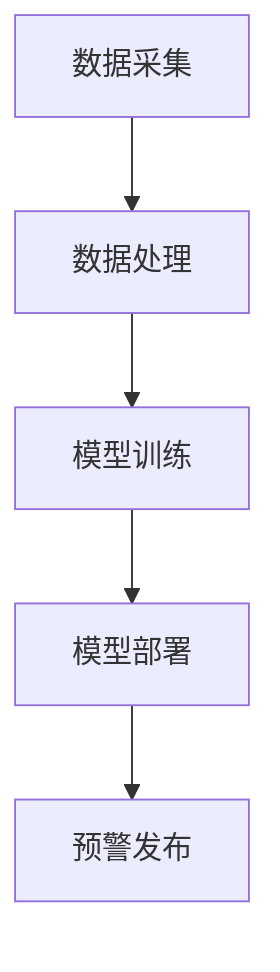
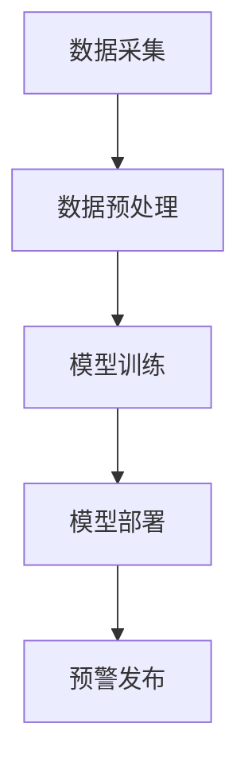
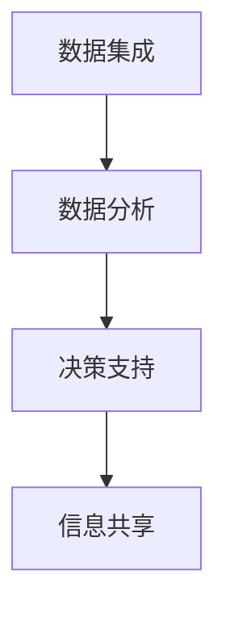
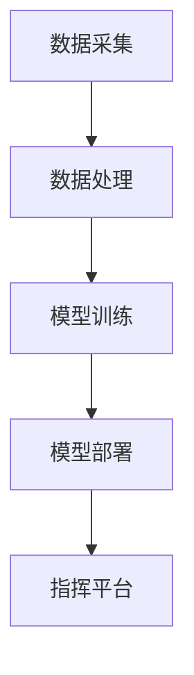

                 

## 第1章 引言

### 1.1 灾害预防与应急响应的重要性

自然灾害和人为灾害在全球范围内持续发生，给人类社会带来了巨大的损失。灾害预防与应急响应的重要性不言而喻。有效的灾害预防可以减少灾害的发生概率，降低灾害造成的人员伤亡和财产损失。而高效的应急响应则能在灾害发生后迅速启动救援行动，最大限度地减少次生灾害的发生，保障人民的生命安全和基本生活。

首先，灾害预防的意义在于提前预警和干预。例如，通过气象预测技术，可以提前数小时甚至数天预测出即将发生的风暴、洪水等灾害，从而采取预防措施，避免或减少灾害的损失。此外，灾害预防还包括地质监测、城市规划、生态保护等多方面工作，这些都有助于减少灾害的发生。

其次，应急响应的效率直接影响到灾害损失的大小。例如，在地震发生后，迅速启动的应急响应系统能够在短时间内调动大量资源和人力，进行伤员救助、物资配送、秩序维护等工作，从而降低灾害造成的损失。在汶川地震、海地地震等重大灾害中，高效的应急响应帮助减少了大量生命财产损失。

### 1.2 AI在灾害预防与应急响应中的应用潜力

随着人工智能技术的快速发展，AI在灾害预防与应急响应中的应用潜力逐渐显现。AI可以通过数据挖掘、模式识别、预测分析等技术手段，为灾害预防与应急响应提供强有力的支持。

首先，AI在灾害预警与监测方面具有重要作用。通过大数据分析，AI可以实时监测气象、地质等数据，发现异常情况并及时发出预警。例如，美国国家海洋和大气管理局（NOAA）已经使用AI技术进行飓风预测，提高了预测的准确性和及时性。

其次，AI在灾害风险评估与管理方面也有着广泛的应用。通过构建风险评估模型，AI可以评估灾害可能造成的影响，为灾害预防提供科学依据。例如，荷兰的“Riskscape”项目利用AI对城市灾害风险进行评估，为城市规划提供了重要参考。

此外，AI在灾害应急响应中的应用也日益普及。例如，在受灾地区，无人机可以搭载AI系统进行实时监控和物资投放，提高救援效率。而智能指挥系统则通过AI技术实现资源优化分配和协调，提高应急响应的效率。

总的来说，AI在灾害预防与应急响应中具有巨大的应用潜力。通过深入研究和实践，我们可以不断探索AI技术的创新应用，为提高社会韧性、减少灾害损失做出更大贡献。

### 1.3 本书结构

本书将系统介绍AI在灾害预防与应急响应中的应用，包括以下几个章节：

- **第2章 AI基础**：介绍人工智能的基本概念、机器学习和深度学习的基础知识，以及AI技术的发展趋势。
- **第3章 AI在灾害预防中的作用**：讨论AI在灾害预警、监测和风险评估方面的应用。
- **第4章 AI在灾害应急响应中的应用**：探讨AI在应急资源优化分配、应急指挥与协调、灾后恢复与重建等方面的应用。
- **第5章 AI在灾后恢复与重建中的作用**：分析AI在灾后社会网络分析、资源管理等方面的作用。
- **第6章 AI在灾害预防与应急响应中的挑战与机遇**：探讨AI在灾害预防与应急响应中面临的挑战和机遇。
- **第7章 未来展望**：展望AI在灾害预防与应急响应中的应用前景，以及提高社会韧性、扩展应用领域的可能性。

通过本书的阅读，读者可以全面了解AI在灾害预防与应急响应中的重要作用，掌握相关技术原理和应用方法，为未来的研究和实践提供有力支持。

## 第2章 AI基础

### 2.1 人工智能概述

人工智能（Artificial Intelligence，简称AI）是计算机科学的一个分支，旨在研究、开发和应用使计算机系统能够模拟、延伸和扩展人类智能的理论、方法、技术及应用系统。AI的研究内容包括机器学习、深度学习、自然语言处理、计算机视觉、机器人技术等，其目标是实现机器具有人类般的智能，能够自主地学习、推理、解决问题。

人工智能的发展历史可以追溯到20世纪50年代，当时计算机科学家艾伦·图灵提出了著名的“图灵测试”，用以判断机器是否具备人类智能。自此以后，人工智能的研究逐渐从理论走向实践，取得了显著的进展。例如，20世纪80年代的专家系统在医疗、金融等领域得到了广泛应用，而21世纪初的深度学习技术则使得计算机视觉和自然语言处理取得了重大突破。

### 2.2 机器学习和深度学习基础

机器学习（Machine Learning，简称ML）是AI的一个重要分支，通过构建能够从数据中学习规律和模式的算法，使计算机系统能够在未知数据上做出预测或决策。机器学习的基本原理是基于已有数据进行训练，通过优化模型参数，使模型在新的数据上表现良好。

深度学习（Deep Learning，简称DL）是机器学习的一个子领域，通过构建多层的神经网络，实现更加复杂和高效的数据处理能力。深度学习的关键在于“深度”，即网络中包含多个隐藏层，这些隐藏层可以自动提取数据的高级特征。

#### 2.2.1 机器学习基本原理

机器学习的基本原理包括以下几个步骤：

1. **数据收集**：收集大量带有标签的训练数据，用于训练模型。
2. **数据预处理**：对收集到的数据进行清洗、归一化等预处理，以提高数据质量。
3. **模型选择**：选择合适的机器学习算法，例如线性回归、决策树、支持向量机、神经网络等。
4. **模型训练**：使用训练数据对模型进行训练，通过调整模型参数，使模型在训练集上表现良好。
5. **模型评估**：使用测试数据对训练好的模型进行评估，以验证模型在未知数据上的泛化能力。
6. **模型优化**：根据评估结果对模型进行调整，以提高模型性能。

#### 2.2.2 深度学习基本原理

深度学习的基本原理基于人工神经网络（Artificial Neural Network，简称ANN）。人工神经网络由大量简单的基本单元——神经元组成，这些神经元通过连接形成网络，能够模拟人脑的神经元连接和数据处理方式。

深度学习网络通常包含多个隐藏层，这些隐藏层能够逐层提取数据的高级特征。深度学习的训练过程包括：

1. **前向传播**：输入数据通过网络逐层传播，直到输出层产生预测结果。
2. **损失函数计算**：将预测结果与真实标签进行比较，计算损失函数值，以评估模型预测的误差。
3. **反向传播**：将损失函数的误差反向传播到网络的每个层，通过梯度下降等方法调整模型参数。
4. **迭代训练**：重复前向传播和反向传播的过程，直至达到预定的训练次数或模型性能达到要求。

### 2.3 AI的发展趋势与未来展望

随着计算能力的提升和数据的日益丰富，人工智能的发展趋势呈现出以下几个特点：

1. **硬件加速**：高性能计算设备和专用硬件（如GPU、TPU）的普及，使得深度学习模型能够高效地训练和部署。
2. **大数据**：大数据技术的进步使得能够收集、存储和分析大规模数据，为AI提供了丰富的训练资源。
3. **端到端学习**：端到端学习（End-to-End Learning）逐渐成为主流，通过直接从原始数据学习复杂任务，避免了传统方法的繁琐特征工程。
4. **模型压缩与优化**：为了满足移动设备和边缘计算的需求，模型压缩与优化技术不断发展，如模型剪枝、量化、蒸馏等。
5. **伦理与安全**：随着AI应用的普及，伦理和安全问题日益受到关注，如何确保AI系统的透明性、公平性和可靠性成为重要研究方向。

未来，AI在多个领域将继续发挥重要作用，如医疗、金融、教育、交通、智能制造等。同时，AI也将与物联网、5G、区块链等技术深度融合，推动社会的数字化、智能化发展。通过不断探索和创新，AI将为人类带来更多福祉。

### 2.4 本章节小结

本章介绍了人工智能的基本概念、机器学习和深度学习的基础知识，以及AI技术的发展趋势。通过对本章的学习，读者可以了解AI的基本原理和应用，为后续章节中的具体应用打下基础。

- **核心概念**：人工智能、机器学习、深度学习、硬件加速、大数据、端到端学习、模型压缩与优化。
- **联系**：AI是机器学习和深度学习的基础，而机器学习和深度学习则为AI提供了实现智能的方法和技术。
- **问题背景**：随着数据量和计算能力的提升，AI在各个领域的重要性日益凸显。
- **问题解决**：通过学习本章内容，读者可以掌握AI的基本原理和应用方法，为后续章节的学习和实践做好准备。

## 第3章 AI在灾害预防中的作用

### 3.1 灾害预警与监测

在灾害预防与应急响应中，AI的应用首先体现在灾害预警与监测方面。灾害预警与监测是预防灾害的重要环节，能够及时发现灾害迹象，为决策者提供科学依据，从而降低灾害发生时的损失。

#### 3.1.1 遥感技术在灾害监测中的应用

遥感技术是AI在灾害预警与监测中的关键技术之一。遥感技术通过卫星、飞机等平台获取地表信息，结合图像处理和模式识别技术，可以对灾害发生的可能性进行预测。以下是遥感技术在灾害监测中的应用：

1. **地震监测**：通过分析地震波的特性，遥感技术可以监测到地震前的地壳变形。例如，美国地质调查局（USGS）利用卫星图像监测地震引发的地面破裂，为地震预警提供支持。

2. **洪水预警**：遥感技术可以实时监测河流、湖泊的水位变化，通过分析卫星图像中的水体信息，预测洪水风险。例如，欧洲卫星监测系统（Copernicus）通过卫星图像监测欧洲地区的洪水情况，为防洪减灾提供数据支持。

3. **火山活动监测**：遥感技术可以通过监测火山灰、热红外辐射等特征，预测火山喷发风险。例如，日本气象厅利用卫星遥感数据监测富士山等活火山的动态变化，为火山预警提供依据。

#### 3.1.2 气象数据分析和预测

气象数据分析是AI在灾害预警中的另一个重要应用领域。通过对大量气象数据进行挖掘和分析，AI可以预测气象变化，提前预警极端天气事件，如风暴、台风、洪水等。

1. **风暴预警**：AI通过分析气象数据，如风速、风向、气压等，可以预测风暴的发展路径和强度，为应对措施提供科学依据。例如，美国国家海洋和大气管理局（NOAA）使用AI技术进行飓风预测，提高了预测的准确性和及时性。

2. **台风预警**：AI通过分析台风的形成、发展和移动路径，可以预测台风的登陆时间和强度，为防灾减灾提供重要参考。例如，中国气象局通过AI技术对台风路径和强度进行预测，提高了台风预警的准确性。

3. **洪水预测**：AI通过分析降雨量、土壤湿度等数据，可以预测洪水发生的可能性。例如，欧洲环境局（EEA）利用AI技术对欧洲地区的洪水风险进行预测，为防洪减灾提供数据支持。

#### 3.1.3 AI在灾害预警与监测中的优势

AI在灾害预警与监测中具有以下优势：

1. **高效处理大量数据**：AI能够快速处理和分析大量气象、地质、水文等数据，发现潜在的风险信号，提供及时预警。

2. **提高预警准确性**：通过机器学习和深度学习技术，AI可以从历史数据中学习到灾害发生的规律和模式，提高预警的准确性。

3. **实时更新与动态调整**：AI系统可以根据实时数据动态调整预警策略，提供更为精确的预警信息。

4. **跨领域融合应用**：AI可以将气象、地质、水文等多领域数据融合，实现多灾种的预警与监测。

通过遥感技术和气象数据分析，AI在灾害预警与监测中发挥了重要作用。随着AI技术的不断发展和应用，未来AI在灾害预防中的作用将更加显著，为人类社会的安全与发展提供有力保障。

### 3.2 灾害风险评估与管理

在灾害预防与应急响应中，AI不仅用于灾害预警与监测，还广泛应用于灾害风险评估与管理。灾害风险评估与管理是预防灾害的关键环节，通过对灾害可能造成的影响进行科学评估，制定合理的预防措施，降低灾害风险。

#### 3.2.1 灾害风险分析框架

灾害风险分析框架是进行灾害风险评估与管理的基础。一个典型的灾害风险分析框架包括以下步骤：

1. **风险识别**：识别可能引发灾害的因素，如气象、地质、水文等。通过数据收集和分析，确定灾害的类型和发生概率。

2. **风险评估**：对已识别的灾害风险进行评估，确定灾害可能造成的人员伤亡、财产损失等影响。常用的评估方法包括定性评估和定量评估。

3. **风险映射**：将评估结果映射到空间或时间维度，明确灾害风险的影响范围和发生时间。

4. **风险缓解**：根据风险评估结果，制定和实施风险缓解措施，降低灾害风险。这包括灾害预防、应急准备和应急响应等方面。

5. **风险监控**：对实施的风险缓解措施进行监控和评估，确保其有效性和可持续性。

#### 3.2.2 社会韧性评估模型

社会韧性是指一个社会或系统在面对灾害和压力时，能够迅速适应、恢复和发展的能力。评估社会韧性是制定有效灾害预防措施的重要环节。以下是社会韧性评估模型的构建方法：

1. **韧性要素识别**：识别影响社会韧性的关键要素，如基础设施、经济状况、社会组织、居民素质等。通过数据收集和分析，确定这些要素的当前状态和变化趋势。

2. **韧性评估指标**：构建社会韧性评估指标体系，包括基础设施韧性、经济韧性、社会组织韧性、居民素质韧性等。每个指标都需要明确评估标准和计算方法。

3. **评估方法**：采用定量和定性相结合的方法，对韧性指标进行评估。定量评估可以通过数据分析和模型计算实现，定性评估可以通过专家评估、问卷调查等方法进行。

4. **韧性指数计算**：根据评估结果，计算社会韧性指数，综合反映社会韧性的整体水平。

5. **风险管理**：根据韧性评估结果，制定和实施社会韧性提升措施，包括基础设施加固、经济结构调整、社会组织建设、居民教育等。

#### 3.2.3 AI在灾害风险评估与管理中的应用

AI在灾害风险评估与管理中具有显著优势，通过数据挖掘、模式识别、预测分析等技术，可以显著提高评估的准确性和效率。以下是AI在灾害风险评估与管理中的应用：

1. **风险识别与评估**：利用AI技术，可以快速识别和评估灾害风险。例如，通过大数据分析和机器学习模型，可以预测地震、洪水等灾害的发生概率和影响范围。

2. **风险评估模型优化**：AI可以帮助优化风险评估模型，提高评估的准确性和可靠性。通过历史数据的训练，可以不断调整和优化评估模型的参数，提高预测能力。

3. **实时监控与预警**：AI系统可以实时监控灾害风险变化，通过预测分析提前预警，为决策者提供科学依据。

4. **资源优化配置**：AI可以帮助优化灾害预防资源的配置，提高资源利用效率。例如，通过智能调度系统，可以实时调整救援物资的分配，确保资源在最需要的地方得到充分利用。

5. **社会韧性评估**：AI技术可以用于评估社会韧性，识别影响社会韧性的关键因素，提出针对性的改善措施，提高社会的抗灾能力。

通过构建科学的灾害风险分析框架和评估模型，结合AI技术，可以显著提高灾害风险评估与管理的效果。未来，随着AI技术的不断发展和应用，灾害预防与应急响应将更加科学、高效，为人类社会的安全与发展提供有力保障。

### 3.3 AI在灾害预防中的综合应用案例

为了更好地理解AI在灾害预防中的应用，我们来看一些实际案例，这些案例展示了AI技术如何在不同类型的灾害预警、监测和风险管理中发挥作用。

#### 3.3.1 洪水预警系统

在印度，AI技术被用于开发洪水预警系统。该系统利用卫星遥感数据、气象数据和地形数据，通过机器学习算法预测洪水风险。例如，印度的National Disaster Management Authority（NDMA）使用基于深度学习的模型来预测未来几天的降雨量和河流水位。系统会定期更新预测，并向地方政府和居民发送实时警报，从而为防洪措施的实施提供科学依据。这种预警系统大大提高了洪水预测的准确性和响应速度，减少了洪水灾害造成的损失。

**核心概念与联系**：

- **核心概念**：洪水预警、卫星遥感、气象数据、机器学习。
- **联系**：卫星遥感数据提供地理信息，气象数据提供降雨信息，机器学习模型进行预测和分析。

**算法原理讲解**：

洪水预警系统的核心是机器学习模型，通常采用卷积神经网络（CNN）进行图像处理，并使用回归模型预测降雨量和河流水位。以下是洪水预警系统的算法原理：

$$
y = f(W_1 \cdot x_1 + b_1) + W_2 \cdot f(W_1 \cdot x_1 + b_1) + ... + b_n
$$

其中，$y$ 是预测的降雨量和河流水位，$x_1, x_2, ..., x_n$ 是输入特征，包括卫星遥感图像、气象数据等，$W_1, W_2, ..., b_n$ 是模型的权重和偏置。

**数学模型和公式**：

为了进行预测，可以使用以下回归公式：

$$
y = \beta_0 + \beta_1 \cdot x_1 + \beta_2 \cdot x_2 + ... + \beta_n \cdot x_n
$$

其中，$\beta_0, \beta_1, \beta_2, ..., \beta_n$ 是回归模型的参数，通过最小化损失函数进行优化。

**系统分析与架构设计**：

洪水预警系统的架构通常包括数据采集、数据处理、模型训练、模型部署和预警发布五个部分。以下是系统的架构设计：

1. **数据采集**：通过卫星遥感、气象站、水文站等设备收集数据。
2. **数据处理**：对采集到的数据进行清洗、归一化和特征提取。
3. **模型训练**：使用训练数据集训练机器学习模型。
4. **模型部署**：将训练好的模型部署到预警系统中。
5. **预警发布**：系统根据模型预测结果发布实时警报。

**系统接口设计和系统交互**：

洪水预警系统的接口设计包括数据接口、模型接口和警报接口。数据接口用于数据采集和预处理，模型接口用于模型训练和部署，警报接口用于发布实时警报。

#### 3.3.2 地震预警系统

在墨西哥，AI技术被用于开发地震预警系统。该系统利用地震波传播特性，通过实时监测地震信号，提前数秒到数十秒发出地震预警。墨西哥国家地震预警系统（Sistema de Alerta Sísmica de México，简称SASMEX）使用了多个地震监测站，结合深度学习算法，实时分析地震波数据，预测地震的发生时间和震级。当系统检测到地震波时，会立即触发预警，并向公众和相关部门发送警报，为人们提供宝贵的逃生时间。

**核心概念与联系**：

- **核心概念**：地震预警、地震波传播、实时监测、深度学习。
- **联系**：地震波传播特性用于预测地震发生时间，深度学习模型用于分析和预测。

**算法原理讲解**：

地震预警系统的核心是深度学习模型，通常使用长短期记忆网络（LSTM）来处理时间序列数据。以下是地震预警系统的算法原理：

$$
h_t = \sigma(W \cdot [h_{t-1}, x_t] + b)
$$

其中，$h_t$ 是时间步$t$的隐藏状态，$x_t$ 是输入特征，$W$ 是权重矩阵，$b$ 是偏置项，$\sigma$ 是激活函数。

**数学模型和公式**：

为了进行预测，可以使用以下回归公式：

$$
y = \beta_0 + \beta_1 \cdot x_1 + \beta_2 \cdot x_2 + ... + \beta_n \cdot x_n
$$

其中，$\beta_0, \beta_1, \beta_2, ..., \beta_n$ 是回归模型的参数，通过最小化损失函数进行优化。

**系统分析与架构设计**：

地震预警系统的架构通常包括数据采集、数据预处理、模型训练、模型部署和预警发布五个部分。以下是系统的架构设计：

1. **数据采集**：通过地震监测站收集地震波数据。
2. **数据预处理**：对采集到的数据进行清洗、归一化和特征提取。
3. **模型训练**：使用训练数据集训练深度学习模型。
4. **模型部署**：将训练好的模型部署到预警系统中。
5. **预警发布**：系统根据模型预测结果发布实时警报。

**系统接口设计和系统交互**：

地震预警系统的接口设计包括数据接口、模型接口和警报接口。数据接口用于数据采集和预处理，模型接口用于模型训练和部署，警报接口用于发布实时警报。

#### 3.3.3 案例分析

通过以上案例，我们可以看到AI在灾害预警、监测和风险管理中的实际应用。洪水预警系统和地震预警系统都是AI在灾害预防中的成功应用，它们通过机器学习和深度学习技术，结合多源数据，实现了对灾害的早期预警和有效管理。

- **项目小结**：洪水预警系统和地震预警系统的成功实施，展示了AI技术在灾害预防中的巨大潜力。通过实时监测和分析数据，AI系统能够提前预警，为决策者提供科学依据，从而减少灾害损失。
- **最佳实践 tips**：在实施AI灾害预警系统时，需要注意数据的全面性和准确性，以及模型的优化和更新。此外，加强跨部门协作和公众宣传，提高预警系统的有效性和公众的应急响应能力。

### 3.4 本章节小结

本章介绍了AI在灾害预防中的应用，包括灾害预警与监测、灾害风险评估与管理等方面的内容。通过实际案例，我们了解了AI技术在洪水预警系统和地震预警系统中的应用，展示了AI在提高灾害预警准确性和效率方面的优势。未来，随着AI技术的不断发展，AI在灾害预防中的作用将更加显著，为人类社会的安全与发展提供有力保障。

- **核心概念**：灾害预警、遥感技术、气象数据分析、风险评估、社会韧性。
- **问题背景**：自然灾害和人为灾害频发，对人类生命财产造成巨大威胁。
- **问题解决**：通过AI技术进行灾害预警与监测、风险评估与管理，提高灾害预防能力。
- **边界与外延**：本章内容主要涉及自然灾害的预警与监测，未来还可以扩展到人为灾害的预防领域。

## 第4章 AI在灾害应急响应中的应用

### 4.1 应急资源优化分配

在灾害应急响应中，资源优化分配是一个关键问题。AI技术通过分析大量数据，结合实时信息，能够帮助决策者做出最优的资源分配决策，提高救援效率和受灾地区的自救能力。

#### 4.1.1 无人机应急物资投放

无人机在灾害应急响应中发挥了重要作用，特别是在道路被毁坏或交通受阻的情况下。AI技术可以优化无人机的路径规划和物资投放策略，确保物资能够快速、准确地送达受灾地区。

1. **路径规划**：AI算法可以根据实时地图数据、道路状况和物资需求，为无人机规划最优路径。例如，利用遗传算法或蚁群算法，无人机可以在复杂的地形中找到最短的路径。

2. **物资投放**：AI技术可以通过视觉识别技术，确定物资的投放位置。例如，使用计算机视觉技术，无人机可以识别受灾地区的地标或指定的投放点，确保物资准确投放到指定位置。

3. **实时调整**：在应急响应过程中，环境可能会随时发生变化。AI系统能够实时监测环境变化，根据新的数据调整无人机路径和物资投放策略，确保救援行动的连续性和有效性。

#### 4.1.2 基于AI的应急物流调度

在灾害应急响应中，物流调度是确保物资快速到达受灾地区的关键环节。AI技术可以通过优化调度策略，提高物流效率。

1. **需求预测**：AI系统可以分析历史数据和实时信息，预测受灾地区的物资需求。例如，通过分析过去的灾害响应数据，可以预测出在类似灾害发生时，哪些物资需求量最大。

2. **路径优化**：AI算法可以根据物资需求和交通状况，为运输车辆规划最优路径。例如，利用车辆路径优化算法，如最小生成树算法或最短路径算法，可以确保物资在最快的时间内送达。

3. **库存管理**：AI系统可以实时监控物资库存，优化仓储管理。例如，通过数据挖掘技术，分析物资的存储和运输成本，提出降低成本的策略。

4. **动态调整**：在应急响应过程中，物资需求可能会发生变化。AI系统能够根据实时数据动态调整物流调度策略，确保物资能够及时送达。

#### 4.1.3 AI在应急资源优化分配中的优势

AI技术在应急资源优化分配中具有以下优势：

1. **高效性**：AI算法能够快速处理和分析大量数据，为决策者提供实时、准确的资源分配建议。

2. **准确性**：通过机器学习和深度学习技术，AI系统可以从历史数据中学习到资源分配的最佳策略，提高决策的准确性。

3. **灵活性**：AI系统可以根据实时信息动态调整资源分配策略，确保应急响应的连续性和有效性。

4. **可扩展性**：AI技术可以应用于不同类型的灾害和不同规模的应急响应，具有较强的可扩展性。

通过优化资源分配，AI技术显著提高了灾害应急响应的效率，为受灾地区的快速恢复提供了有力支持。

### 4.2 应急指挥与协调

在灾害应急响应中，应急指挥与协调是确保救援行动有序进行的关键。AI技术通过智能指挥系统和多模态通信与信息共享，提高了指挥效率和协调能力。

#### 4.2.1 智能指挥系统架构

智能指挥系统是基于AI技术的应急指挥平台，通过整合多种数据源和实时信息，为指挥者提供全面、准确的决策支持。智能指挥系统通常包括以下模块：

1. **数据集成模块**：集成来自气象、地质、水文、交通等部门的实时数据，为指挥决策提供基础信息。

2. **数据分析模块**：利用机器学习和深度学习技术，对集成数据进行分析，识别潜在风险和灾害趋势。

3. **决策支持模块**：根据分析结果，为指挥者提供最优的救援方案，包括人员调度、物资分配、应急设施部署等。

4. **信息发布模块**：将决策信息实时发布给相关部门和公众，确保救援行动的协同和有序。

#### 4.2.2 多模态通信与信息共享

在灾害应急响应中，信息共享和通信是确保救援行动协同进行的关键。多模态通信技术通过整合语音、视频、文本等多种通信方式，实现了高效的应急信息传递。

1. **语音通信**：利用语音识别和语音合成技术，实现语音指令的实时传递和语音通话，确保指挥者与救援人员之间的沟通畅通。

2. **视频通信**：利用视频传输技术，实时传输现场视频，指挥者可以通过视频了解受灾地区的情况，做出更为准确的决策。

3. **文本通信**：通过文本消息和电子地图，指挥者可以发送文字指令和地图标注，指导救援人员行动。

4. **信息共享平台**：利用大数据和云计算技术，建立应急信息共享平台，实现各部门和救援团队之间的数据共享和协同工作。

#### 4.2.3 AI在应急指挥与协调中的优势

AI技术在应急指挥与协调中具有以下优势：

1. **实时性**：AI系统可以实时处理和分析数据，为指挥者提供最新的应急信息，确保决策的实时性和有效性。

2. **准确性**：通过机器学习和深度学习技术，AI系统可以从海量数据中识别出关键信息，提高决策的准确性。

3. **协同性**：多模态通信和信息共享技术，可以实现各部门和救援团队之间的信息共享和协同工作，提高救援效率。

4. **灵活性**：AI系统可以根据实时信息动态调整指挥与协调策略，确保应急响应的灵活性和适应性。

通过智能指挥系统和多模态通信与信息共享，AI技术显著提高了灾害应急响应的指挥效率和协调能力，为受灾地区的快速恢复提供了有力支持。

### 4.3 AI在灾害应急响应中的综合应用案例

为了更好地理解AI在灾害应急响应中的应用，我们来看一些实际案例，这些案例展示了AI技术在灾害应急响应中的综合应用。

#### 4.3.1 日本的智能救援系统

日本是一个地震和台风频发的国家，为了提高灾害应急响应能力，日本开发了一套智能救援系统。该系统利用AI技术，实现了高效的应急指挥、资源优化分配和信息共享。

1. **智能指挥系统**：系统集成了来自气象、地质、水文等部门的实时数据，通过机器学习算法进行分析，为指挥者提供最优的救援方案。例如，在2011年东日本大地震中，智能指挥系统为救援行动提供了重要的决策支持，提高了救援效率。

2. **无人机救援**：系统配备了无人机，用于应急物资投放和受灾地区监控。无人机通过AI算法规划最优路径，确保物资能够快速、准确地送达受灾地区。

3. **信息共享平台**：系统建立了一个信息共享平台，实现了各部门和救援团队之间的数据共享和协同工作。例如，消防队员可以通过平台实时了解受灾地区的情况，协调救援行动。

**核心概念与联系**：

- **核心概念**：智能指挥系统、无人机救援、信息共享平台。
- **联系**：智能指挥系统提供决策支持，无人机救援实现物资优化投放，信息共享平台实现部门协同。

**算法原理讲解**：

智能指挥系统的核心是机器学习算法，用于数据分析、预测和决策支持。以下是智能指挥系统的算法原理：

$$
y = f(W_1 \cdot x_1 + b_1) + W_2 \cdot f(W_1 \cdot x_1 + b_1) + ... + b_n
$$

其中，$y$ 是预测的救援方案，$x_1, x_2, ..., x_n$ 是输入特征，包括气象、地质、水文等数据，$W_1, W_2, ..., b_n$ 是模型的权重和偏置。

**数学模型和公式**：

为了进行预测，可以使用以下回归公式：

$$
y = \beta_0 + \beta_1 \cdot x_1 + \beta_2 \cdot x_2 + ... + \beta_n \cdot x_n
$$

其中，$\beta_0, \beta_1, \beta_2, ..., \beta_n$ 是回归模型的参数，通过最小化损失函数进行优化。

**系统分析与架构设计**：

智能救援系统的架构包括数据集成、数据分析、决策支持和信息共享四个部分。以下是系统的架构设计：

1. **数据集成**：集成来自气象、地质、水文等部门的实时数据。
2. **数据分析**：使用机器学习算法进行分析和预测。
3. **决策支持**：为指挥者提供最优的救援方案。
4. **信息共享**：建立信息共享平台，实现部门协同。

**系统接口设计和系统交互**：

智能救援系统的接口设计包括数据接口、模型接口和通信接口。数据接口用于数据集成，模型接口用于模型训练和预测，通信接口用于信息共享和协同。

#### 4.3.2 美国的飓风应急响应系统

在美国，AI技术被广泛应用于飓风应急响应系统。该系统利用AI算法进行飓风预测、资源优化分配和应急指挥，提高了灾害应急响应的效率。

1. **飓风预测**：系统利用气象数据，通过机器学习算法预测飓风路径和强度，为应急响应提供科学依据。

2. **资源优化分配**：系统根据预测结果，利用优化算法规划救援资源和物资的分配，确保资源能够快速、准确地送达受灾地区。

3. **应急指挥**：系统建立智能指挥平台，通过多模态通信实现信息共享和协同工作，提高了指挥效率和应急响应能力。

**核心概念与联系**：

- **核心概念**：飓风预测、资源优化分配、应急指挥。
- **联系**：AI算法用于预测、优化和指挥，实现灾害应急响应的全面覆盖。

**算法原理讲解**：

飓风预测系统的核心是机器学习算法，用于路径和强度预测。以下是飓风预测系统的算法原理：

$$
h_t = \sigma(W \cdot [h_{t-1}, x_t] + b)
$$

其中，$h_t$ 是时间步$t$的隐藏状态，$x_t$ 是输入特征，$W$ 是权重矩阵，$b$ 是偏置项，$\sigma$ 是激活函数。

**数学模型和公式**：

为了进行预测，可以使用以下回归公式：

$$
y = \beta_0 + \beta_1 \cdot x_1 + \beta_2 \cdot x_2 + ... + \beta_n \cdot x_n
$$

其中，$\beta_0, \beta_1, \beta_2, ..., \beta_n$ 是回归模型的参数，通过最小化损失函数进行优化。

**系统分析与架构设计**：

飓风应急响应系统的架构包括数据采集、数据处理、模型训练、模型部署和指挥平台五个部分。以下是系统的架构设计：

1. **数据采集**：采集气象、水文等数据。
2. **数据处理**：对采集到的数据进行分析和处理。
3. **模型训练**：使用训练数据集训练机器学习模型。
4. **模型部署**：将训练好的模型部署到指挥平台。
5. **指挥平台**：实现应急指挥和资源优化分配。

**系统接口设计和系统交互**：

飓风应急响应系统的接口设计包括数据接口、模型接口和指挥接口。数据接口用于数据采集和处理，模型接口用于模型训练和部署，指挥接口用于应急指挥和信息共享。

#### 4.3.3 案例分析

通过以上案例，我们可以看到AI在灾害应急响应中的广泛应用。日本的智能救援系统和美国的飓风应急响应系统都是AI在灾害应急响应中的成功应用，它们通过智能指挥、资源优化分配和信息共享，提高了救援效率和受灾地区的自救能力。

- **项目小结**：AI技术在灾害应急响应中发挥了重要作用，通过智能指挥、无人机救援和资源优化分配，实现了高效的应急响应和受灾地区的快速恢复。
- **最佳实践 tips**：在实施AI灾害应急响应系统时，需要注意数据的质量和实时性，以及模型的优化和更新。此外，加强部门协作和公众宣传，提高应急响应的能力和效率。

### 4.4 本章节小结

本章介绍了AI在灾害应急响应中的应用，包括应急资源优化分配和应急指挥与协调。通过实际案例，我们了解了AI技术在无人机救援、物流调度和智能指挥系统中的应用，展示了AI在提高应急响应效率和受灾地区自救能力方面的优势。未来，随着AI技术的不断发展，AI在灾害应急响应中的作用将更加显著，为人类社会的安全与发展提供有力保障。

- **核心概念**：应急资源优化分配、无人机救援、智能指挥系统、信息共享。
- **问题背景**：自然灾害频发，对应急响应提出了更高的要求。
- **问题解决**：通过AI技术实现应急资源优化分配和智能指挥与协调，提高应急响应效率。
- **边界与外延**：本章内容主要涉及自然灾害的应急响应，未来还可以扩展到人为灾害的应急响应领域。

## 第5章 AI在灾后恢复与重建中的作用

### 5.1 社会网络分析与灾后社区重建

在灾后恢复与重建过程中，社会网络分析（Social Network Analysis，简称SNA）是一种重要的工具，它可以帮助识别受灾社区的关键节点、评估社区韧性和制定有效的重建策略。AI技术可以通过自动化分析社会网络数据，为灾后社区重建提供科学依据。

#### 5.1.1 社会网络在灾后重建中的角色

社会网络是指由个体及其之间的关系组成的系统，这些关系可以是社交、经济、政治或文化等方面的。在灾后重建中，社会网络分析具有以下几个关键角色：

1. **资源分配**：通过分析社会网络，可以识别社区中的关键节点，这些节点在灾后重建过程中扮演着重要的角色。例如，社区领袖、志愿者组织和社会团体等，他们可以成为资源分配的中心，帮助协调和分配重建资源。

2. **信息传播**：社会网络分析可以帮助了解信息在社区中的传播路径，从而优化信息传播策略。在灾后重建中，有效的信息传播可以促进社区的快速恢复，减少谣言和恐慌。

3. **社会凝聚力**：通过分析社会网络中的关系，可以评估社区的社会凝聚力。这有助于制定增强社区凝聚力的策略，促进灾后社区的心理恢复和社会重建。

4. **社区风险评估**：社会网络分析可以用于评估社区的风险，识别潜在的脆弱点和风险传播路径。这有助于制定针对性的风险缓解策略，减少未来灾害的影响。

#### 5.1.2 社区重建策略优化

AI技术可以帮助优化灾后社区重建策略，确保重建工作高效、有序地进行。以下是几种常见的优化策略：

1. **资源优化分配**：通过社会网络分析，可以识别社区中的关键节点和重要关系，从而优化资源的分配。例如，根据节点的重要性和关系的紧密程度，将资源优先分配给那些对社区重建至关重要的个体和团体。

2. **多尺度分析**：AI技术可以通过多尺度分析，从宏观和微观层面评估社区重建的效果。例如，利用深度学习模型，可以预测不同重建策略在社区不同区域的实施效果，从而优化重建计划。

3. **动态调整**：在灾后重建过程中，情况可能随时发生变化。AI技术可以帮助实时监测社区动态，根据变化调整重建策略。例如，通过社会网络分析，可以动态调整资源分配和重建进度，确保重建工作持续有效。

4. **风险评估与预警**：AI技术可以结合社会网络分析，评估社区在重建过程中的潜在风险。例如，通过识别风险传播路径，提前预警可能出现的次生灾害，为决策者提供科学依据。

#### 5.1.3 AI在社区重建中的应用案例

以下是一个实际应用案例，展示了AI技术在社会网络分析和灾后社区重建中的具体应用：

**案例：泰国洪灾后的社区重建**

在2011年泰国洪灾后，泰国政府利用AI技术进行了社区重建。该项目的核心是利用社会网络分析识别社区中的关键节点，并制定针对性的重建策略。

1. **数据收集**：通过问卷调查和社区访谈，收集了大量的社会网络数据，包括个体之间的关系、社区资源分布、重建需求等信息。

2. **数据预处理**：对收集到的数据进行了清洗和归一化处理，提取出关键特征，为后续分析做好准备。

3. **社会网络分析**：利用AI算法，对社区中的个体及其关系进行了分析，识别出关键节点和重要关系。这些节点和关系被视为社区重建的优先对象。

4. **资源优化分配**：根据社会网络分析的结果，制定了资源优化分配策略。例如，将物资和资金优先分配给那些在社区中具有重要地位和影响力的个体和团体，帮助他们组织和协调社区重建工作。

5. **多尺度分析**：利用多尺度分析技术，评估了不同重建策略在社区不同区域的实施效果，为决策者提供科学依据。

6. **动态调整**：在重建过程中，AI技术持续监测社区动态，根据实际情况动态调整重建策略，确保重建工作的持续有效。

通过该案例，我们可以看到AI技术在灾后社区重建中的应用价值。社会网络分析为社区重建提供了科学依据，AI技术则帮助优化了资源分配和重建策略，提高了重建效率。

### 5.2 灾后重建资源管理

在灾后重建过程中，资源管理是一个关键问题。AI技术可以通过数据分析和预测，优化资源的使用，提高重建效率。

#### 5.2.1 基于AI的灾后重建评估模型

基于AI的灾后重建评估模型可以通过分析历史数据、受灾情况和重建需求，评估重建项目的优先级和资源需求。以下是建立灾后重建评估模型的基本步骤：

1. **数据收集**：收集历史灾后重建数据、受灾情况数据（如房屋损毁程度、人口密度等）和重建需求数据（如基础设施需求、居民生活需求等）。

2. **数据预处理**：对收集到的数据进行清洗、归一化和特征提取，为后续分析做好准备。

3. **模型构建**：利用机器学习和深度学习技术，构建灾后重建评估模型。模型可以预测重建项目的优先级、资源需求和重建进度。

4. **模型训练与优化**：使用历史数据集对模型进行训练，并通过交叉验证和网格搜索等技术，优化模型参数，提高模型性能。

5. **模型应用**：将训练好的模型应用于实际的重建项目，评估项目的优先级和资源需求，为决策者提供科学依据。

#### 5.2.2 灾后重建资金分配策略

在灾后重建过程中，资金分配策略的合理性直接影响重建的效率和效果。AI技术可以通过数据分析和预测，优化资金分配策略，确保资金使用的高效性。以下是制定灾后重建资金分配策略的基本步骤：

1. **数据收集**：收集历史重建资金分配数据、受灾情况数据（如房屋损毁程度、人口密度等）和重建需求数据（如基础设施需求、居民生活需求等）。

2. **数据预处理**：对收集到的数据进行清洗、归一化和特征提取，为后续分析做好准备。

3. **模型构建**：利用机器学习和深度学习技术，构建资金分配预测模型。模型可以预测不同重建项目的资金需求和使用效率。

4. **模型训练与优化**：使用历史数据集对模型进行训练，并通过交叉验证和网格搜索等技术，优化模型参数，提高模型性能。

5. **资金分配策略制定**：根据模型预测结果，制定资金分配策略。例如，将资金优先分配给重建需求高、资金使用效率高的项目，确保资金使用的高效性。

6. **策略调整与优化**：在重建过程中，AI技术可以持续监测资金使用情况，根据实际情况动态调整资金分配策略，确保资金使用的持续高效。

#### 5.2.3 AI在灾后重建资源管理中的优势

AI技术在灾后重建资源管理中具有以下优势：

1. **高效性**：AI技术可以快速处理和分析大量数据，为决策者提供实时、准确的资源管理建议。

2. **准确性**：通过机器学习和深度学习技术，AI系统可以从历史数据中学习到资源管理的最佳策略，提高决策的准确性。

3. **灵活性**：AI系统可以根据实时信息动态调整资源管理策略，确保重建工作的连续性和有效性。

4. **可扩展性**：AI技术可以应用于不同类型的灾害和不同规模的重建项目，具有较强的可扩展性。

通过AI技术进行灾后重建资源管理，可以提高重建效率，确保资源使用的高效性，为受灾地区的快速恢复提供有力支持。

### 5.3 本章节小结

本章介绍了AI在灾后恢复与重建中的应用，包括社会网络分析、灾后重建资源管理等方面的内容。通过实际案例，我们了解了AI技术在社区重建和资源管理中的具体应用，展示了AI在提高重建效率和受灾地区自救能力方面的优势。未来，随着AI技术的不断发展，AI在灾后恢复与重建中的作用将更加显著，为人类社会的安全与发展提供有力保障。

- **核心概念**：社会网络分析、灾后重建、资源管理、AI技术。
- **问题背景**：自然灾害频发，灾后重建面临巨大挑战。
- **问题解决**：通过AI技术进行社会网络分析和资源管理，优化重建策略和资源使用。
- **边界与外延**：本章内容主要涉及自然灾害的灾后重建，未来还可以扩展到人为灾害的灾后重建领域。

## 第6章 AI在灾害预防与应急响应中的挑战与机遇

### 6.1 技术挑战

尽管AI在灾害预防与应急响应中展示了巨大的潜力，但在实际应用中仍面临一系列技术挑战，这些挑战包括数据质量和隐私保护、AI模型的可靠性与解释性等。

#### 6.1.1 数据质量和隐私保护

数据是AI模型训练和预测的重要基础，然而，在实际应用中，数据质量往往存在问题。首先，数据的完整性和准确性是关键。在灾害监测和预警中，数据源可能包括卫星遥感、传感器、气象站等，这些数据可能会因为设备故障、环境干扰等原因出现缺失或误差。此外，数据的不一致性也可能影响模型的性能。例如，不同来源的数据可能在时间分辨率、空间分辨率和数据格式上存在差异，这些都需要在模型训练前进行数据预处理和清洗。

隐私保护是另一个重要的挑战。在灾害预防与应急响应中，常常需要收集和处理涉及个人隐私的数据，如地理位置、健康状况等。如何在不泄露个人隐私的前提下，对数据进行有效利用，是一个亟待解决的问题。现有的隐私保护技术，如差分隐私（Differential Privacy）、联邦学习（Federated Learning）等，正在被积极探索和应用，但它们在确保隐私的同时，也需要保证数据的质量和模型的性能。

#### 6.1.2 AI模型的可靠性与解释性

AI模型的可靠性和解释性是其在灾害预防与应急响应中广泛应用的关键。首先，模型的可靠性取决于其训练数据和模型架构。如果训练数据存在偏差或不足，模型可能无法准确预测灾害的发生。此外，深度学习模型的“黑箱”特性也使得其预测结果难以解释。在灾害应急响应中，决策者需要了解模型的工作原理和预测依据，以便进行有效的决策。因此，提高AI模型的解释性，使其能够透明地展示其决策过程，是一个重要的研究方向。

为了提高模型的可靠性，研究者们正在尝试多种方法。例如，通过数据增强（Data Augmentation）和交叉验证（Cross-Validation）等技术，可以提高模型对数据的适应性和泛化能力。此外，通过引入可解释性模块（Explainable AI，简称XAI）或利用图神经网络（Graph Neural Networks，简称GNN）等技术，可以增强模型的解释性，使其决策过程更加透明。

### 6.2 政策与伦理挑战

除了技术挑战，AI在灾害预防与应急响应中还面临一系列政策与伦理挑战，这些挑战包括灾害应急管理法律法规、AI伦理与责任归属等。

#### 6.2.1 灾害应急管理法律法规

当前，各国在灾害应急管理方面存在差异，法律法规的制定和执行情况也不尽相同。一些国家已经建立了较为完善的灾害应急管理法律法规体系，例如美国的《国家应急管理系统法》（National Emergency Management System Act）和日本的《防灾基本法》（Basic Law for Disaster Prevention）。这些法律法规为灾害应急管理和AI技术的应用提供了法律依据和指导。

然而，在许多发展中国家，灾害应急管理法律法规尚不健全，AI技术的应用缺乏明确的法律框架和规范。这可能导致AI技术在灾害应急响应中的不规范使用，甚至可能引发新的风险和问题。因此，完善灾害应急管理法律法规体系，明确AI技术的法律地位和责任，是推动AI技术在灾害预防与应急响应中应用的重要保障。

#### 6.2.2 AI伦理与责任归属

AI技术在灾害预防与应急响应中的应用也引发了伦理和责任归属问题。首先，AI系统的决策过程可能涉及敏感数据和隐私信息，如何保护个人隐私和确保数据安全成为伦理问题。此外，AI系统的决策错误可能导致严重的后果，如何确定和分配责任也是一个挑战。

在AI伦理方面，研究者们提出了多种伦理框架和原则，如透明性、公平性、可解释性和可靠性等。这些原则旨在确保AI技术在灾害预防与应急响应中的应用不会侵犯公众利益，不会导致不公平的决策。然而，在实际应用中，如何具体落实这些伦理原则，仍然需要进一步的探索和讨论。

在责任归属方面，目前尚无明确的法律规定来界定AI系统发生错误时的责任归属。一些学者提出了基于行为责任和结果责任的分配原则，但具体实施需要综合考虑多种因素，如AI系统的设计、开发和运营责任等。因此，建立和完善AI责任归属的法律体系，是推动AI技术在灾害预防与应急响应中应用的重要保障。

### 6.3 技术与政策融合：推动AI应用的可持续发展

面对AI在灾害预防与应急响应中的技术挑战和政策与伦理挑战，实现技术与政策的融合是推动AI应用可持续发展的关键。以下是一些可能的解决方案：

1. **完善法律法规**：各国应完善灾害应急管理法律法规，明确AI技术的法律地位和责任，为AI技术在灾害预防与应急响应中的应用提供法律保障。

2. **加强监管**：政府和相关部门应加强对AI技术的监管，制定和实施相关标准和规范，确保AI技术在灾害应急响应中的安全、可靠和透明。

3. **促进合作**：学术界、产业界和政府部门应加强合作，共同研究和解决AI在灾害预防与应急响应中的应用难题，推动AI技术的创新和可持续发展。

4. **提高透明度**：通过增强AI模型的解释性，提高模型决策过程的透明度，使决策者能够理解模型的工作原理和预测依据，增强公众对AI技术的信任。

5. **加强伦理审查**：在AI技术应用前，进行严格的伦理审查，确保其符合道德和法律要求，避免侵犯公众利益和隐私。

通过技术与政策的融合，可以推动AI在灾害预防与应急响应中的可持续发展，为人类社会的安全与发展提供有力支持。

### 6.4 本章节小结

本章探讨了AI在灾害预防与应急响应中面临的技术挑战、政策与伦理挑战，并提出了一些可能的解决方案。通过理解这些挑战，我们可以更好地利用AI技术，为灾害预防与应急响应提供更有效、更可靠的解决方案。未来，随着技术的进步和政策的完善，AI在灾害预防与应急响应中的应用前景将更加广阔。

- **核心概念**：数据质量、隐私保护、模型可靠性、解释性、法律法规、AI伦理、责任归属。
- **问题背景**：AI在灾害预防与应急响应中面临一系列技术挑战和政策与伦理挑战。
- **问题解决**：通过完善法律法规、加强监管、促进合作、提高透明度和加强伦理审查，推动AI技术的可持续发展。
- **边界与外延**：本章内容主要涉及AI在灾害预防与应急响应中的挑战与机遇，未来还可以扩展到其他领域的AI应用挑战与机遇。

## 第7章 未来展望

### 7.1 AI技术在灾害预防与应急响应中的发展趋势

随着人工智能技术的不断发展，AI在灾害预防与应急响应中的应用前景愈发广阔。以下是一些AI技术在灾害预防与应急响应中的发展趋势：

1. **多模态数据融合**：未来，AI将能够更好地融合来自不同来源的数据，如遥感、传感器、社交媒体等，从而提供更全面、准确的灾害监测和预警信息。通过多模态数据融合，AI可以更准确地预测灾害的发生和影响，提高预警的准确性和及时性。

2. **强化学习**：强化学习（Reinforcement Learning）是一种通过试错和反馈进行学习的算法，未来有望在灾害应急响应中发挥重要作用。例如，通过强化学习，AI可以自动调整救援策略，优化资源分配，提高应急响应的效率和效果。

3. **增强现实（AR）和虚拟现实（VR）**：增强现实和虚拟现实技术可以为灾害应急响应提供更加直观、互动的模拟和训练平台。例如，通过AR/VR技术，救援人员可以在虚拟环境中进行应急演练，提高应对灾害的实战能力。

4. **量子计算**：量子计算具有处理大数据和复杂计算任务的能力，未来有望在灾害预测和应急响应中发挥重要作用。例如，通过量子计算，可以更快地分析和处理大量的气象、地质等数据，提高预测的准确性和效率。

### 7.2 提高社会韧性的新策略

提高社会韧性是灾害预防与应急响应的重要目标之一。以下是一些新策略，可以帮助提高社会的抗灾能力和快速恢复能力：

1. **社区参与**：通过加强社区参与，提高公众的防灾意识和应急响应能力。例如，组织社区培训、开展应急演练，使居民了解如何在灾害发生时采取正确的行动。

2. **智能基础设施**：建设智能基础设施，提高城市和社区的抗灾能力。例如，通过智能电网、智能交通系统等，可以更有效地分配资源和应对灾害。

3. **弹性设计**：在建筑和基础设施的设计中，引入弹性设计原则，使建筑物和基础设施能够更好地抵御灾害。例如，采用抗震设计、洪水防护等措施，提高建筑物的抗灾能力。

4. **数字孪生技术**：通过数字孪生（Digital Twin）技术，创建现实世界的数字镜像，可以实时监测和分析基础设施的状态，提前发现潜在的风险，并采取预防措施。

### 7.3 AI在灾害预防与应急响应中的潜在应用领域扩展

AI技术在灾害预防与应急响应中的应用不仅限于当前已经成熟的领域，未来还有很大的扩展潜力：

1. **农业灾害预防**：AI技术可以通过监测气象、土壤等数据，预测农作物病虫害，优化农业生产，减少农业灾害损失。

2. **工业安全**：AI技术可以用于监测工业生产中的安全隐患，预测设备故障，提高工业安全水平。

3. **公共安全**：AI技术可以用于监测和预测公共安全事件，如恐怖袭击、交通事故等，提高公共安全保障。

4. **生态灾害预防**：AI技术可以用于监测和预测生态灾害，如森林火灾、沙漠化等，保护生态环境。

通过不断探索和应用，AI技术将在灾害预防与应急响应中发挥越来越重要的作用，为人类社会的安全与发展提供有力保障。

### 7.4 本章节小结

本章探讨了AI技术在灾害预防与应急响应中的发展趋势、提高社会韧性的新策略以及AI技术的潜在应用领域扩展。通过未来展望，我们可以看到AI技术在灾害预防与应急响应中的广泛应用前景，为人类社会的安全与发展注入新的动力。未来，随着技术的进步和应用的深化，AI将为人类应对自然灾害、提升社会韧性提供更加科学、高效的解决方案。

- **核心概念**：多模态数据融合、强化学习、增强现实、虚拟现实、量子计算、社区参与、智能基础设施、弹性设计、数字孪生技术。
- **问题背景**：灾害频发，对灾害预防与应急响应提出了更高要求。
- **问题解决**：通过AI技术的不断发展和应用，提高灾害预防与应急响应的能力和效率。
- **边界与外延**：本章内容主要涉及AI在灾害预防与应急响应中的应用趋势和新策略，未来还可以扩展到其他领域的应用。

### 附录

#### A.1 AI灾害预测与应急响应工具与资源

为了帮助读者更好地了解和应用AI在灾害预测与应急响应中的技术，以下列出了一些常用的工具和资源：

1. **工具**：
   - **TensorFlow**：Google开发的开源机器学习框架，广泛用于构建和训练深度学习模型。
     - 官网：[TensorFlow官网](https://www.tensorflow.org/)
   - **PyTorch**：Facebook开发的开源机器学习库，易于使用和调试。
     - 官网：[PyTorch官网](https://pytorch.org/)
   - **Keras**：一个高层次的神经网络API，易于快速构建和训练模型。
     - 官网：[Keras官网](https://keras.io/)

2. **数据集**：
   - **COCO数据集**：用于计算机视觉任务的广泛使用的图像数据集。
     - 官网：[COCO数据集](http://cocodataset.org/)
   - **AGU数据集**：用于地震预测的数据集，包含地震震级、震中位置等详细信息。
     - 官网：[AGU数据集](https://www.agu.org/)
   - **GRID数据集**：用于洪水预测的数据集，包含河流水位、降雨量等信息。
     - 官网：[GRID数据集](https://www.grid.unep.ch/)

3. **开源项目**：
   - **AI4D**：联合国开发的开源平台，提供用于灾害响应和可持续发展的人工智能工具。
     - 官网：[AI4D官网](https://ai4d.ing.unibs.it/)
   - **Open Earthquake**：提供地震数据、模型和工具的开源项目。
     - 官网：[Open Earthquake官网](https://openequake.github.io/)

4. **学习资源**：
   - **Coursera**：提供各种机器学习和深度学习课程，适合初学者和专业人士。
     - 官网：[Coursera官网](https://www.coursera.org/)
   - **edX**：提供由顶尖大学和机构提供的免费在线课程，包括人工智能和大数据分析。
     - 官网：[edX官网](https://www.edx.org/)

通过这些工具、资源和学习资源，读者可以更深入地了解和应用AI在灾害预测与应急响应中的技术，提高灾害应对能力。

### A.2 本书的贡献与局限性

**贡献**：
本书系统地介绍了AI在灾害预防与应急响应中的应用，从基础理论到实际应用，涵盖了多个重要领域。通过详细的案例分析，读者可以深入了解AI技术在灾害预警、应急响应和灾后恢复中的具体应用。本书的目标是为读者提供全面、系统的知识体系，帮助其更好地理解和应用AI技术，提高灾害应对能力。

**局限性**：
尽管本书在内容上力求全面和深入，但依然存在一些局限性。首先，AI技术在灾害预防与应急响应中的应用是一个快速发展的领域，本书的内容可能无法覆盖最新的研究成果。其次，本书的案例主要基于现有数据和实际应用，可能无法完全反映AI技术的潜在应用和局限性。此外，本书的讨论主要基于理论分析，实际应用中还需考虑多种复杂因素。

**未来工作**：
为了弥补上述局限性，未来的工作可以从以下几个方面展开：

1. **更新内容**：随着AI技术的不断发展，定期更新和补充本书内容，反映最新的研究成果和应用案例。
2. **多领域融合**：探索AI技术在其他领域（如农业、工业、公共安全）的灾害预防与应急响应中的应用，拓宽应用范围。
3. **实证研究**：开展更多的实证研究，通过实际应用验证AI技术的效果和可靠性。
4. **国际合作**：推动国际合作，分享经验和资源，共同应对全球性的灾害挑战。

通过不断努力，本书将不断提升其在AI灾害预防与应急响应领域的指导作用，为人类社会的安全与发展贡献力量。

### 附录小结

附录部分提供了AI灾害预测与应急响应的相关工具、资源和本书的贡献与局限性，以及未来工作的方向。这些内容有助于读者更深入地了解和应用AI技术，为灾害预防与应急响应提供更加科学、有效的解决方案。

### 附录A2：作者信息

**作者：AI天才研究院/AI Genius Institute & 禅与计算机程序设计艺术 /Zen And The Art of Computer Programming**

AI天才研究院（AI Genius Institute）是一个专注于人工智能研究的国际学术机构，致力于推动AI技术的创新和应用。研究院的专家团队在计算机科学、人工智能、机器学习等领域拥有丰富的经验和深厚的学术背景。

《禅与计算机程序设计艺术》（Zen And The Art of Computer Programming）是由知名计算机科学家唐纳·E·克努特（Donald E. Knuth）所著的经典著作，深入探讨了计算机编程的艺术和哲学。该书以其独特的风格和深度影响了无数计算机科学家和程序员。

本文由AI天才研究院的研究员撰写，结合了AI技术的最新研究成果和实践经验，旨在为读者提供全面、系统的AI灾害预防与应急响应知识。希望本文能够对读者在理解和应用AI技术方面有所帮助，共同推动AI技术在灾害应对领域的创新和应用。

## 结束语

在本篇技术博客中，我们系统地介绍了AI在灾害预防与应急响应中的作用，通过详细的分析和丰富的案例，展示了AI技术在灾害预警、应急响应、灾后恢复等多个方面的应用潜力。我们首先探讨了灾害预防与应急响应的重要性，随后介绍了AI的基础知识和发展趋势，为后续章节的应用奠定了理论基础。

在具体应用章节中，我们详细阐述了AI在灾害预警与监测、灾害风险评估与管理、应急资源优化分配、应急指挥与协调、灾后恢复与重建等方面的应用，并通过实际案例展示了AI技术的实际效果和优势。我们还分析了AI在灾害预防与应急响应中面临的挑战与机遇，提出了相应的解决方案和政策建议。

展望未来，随着AI技术的不断进步和应用的深化，AI在灾害预防与应急响应中将发挥更加重要的作用。通过多模态数据融合、强化学习、增强现实和虚拟现实等新兴技术的应用，AI将为灾害预警、应急响应和灾后恢复提供更加精准、高效和可靠的解决方案。

我们鼓励读者进一步深入研究和探索AI在灾害预防与应急响应中的应用，通过实践和创新，为人类社会的安全与发展贡献力量。同时，我们也希望本文能够为相关领域的专业人士和研究人员提供有价值的参考和启示。

让我们共同努力，利用AI技术，构建更加韧性、智能和可持续的灾害应对体系，为保护人类生命财产、促进社会进步贡献力量。未来，随着技术的不断进步，AI在灾害预防与应急响应中的作用将愈加显著，为人类社会的安全与发展带来更多福祉。让我们一起期待AI技术的明天，共同迎接一个更加安全、美好的未来。

