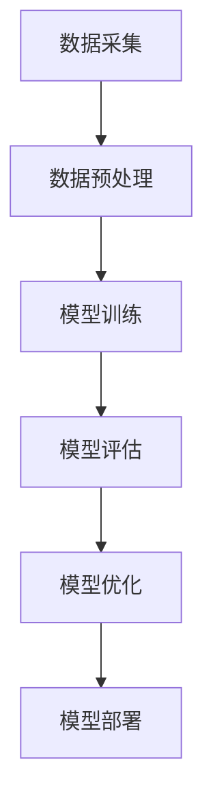

                 


# AI在环境保护中的应用：气候变化预测与应对

## 关键词：人工智能，环境保护，气候变化，预测，应对，环境监测，数据分析

### 摘要：
本文深入探讨了人工智能（AI）在环境保护领域的应用，特别是其在气候变化预测和应对方面的作用。我们将从AI的基础概念出发，逐步分析AI在数据采集、模型构建和污染物检测等方面的应用，并通过具体案例展示AI技术如何助力环境保护。文章最后将讨论当前面临的挑战及未来发展方向。

## 目录大纲

### 第一部分：引言与基础
- **1.1 环境保护的重要性**
  - **1.1.1 全球环境问题的现状**
  - **1.1.2 AI在环境保护中的潜力**

- **1.2 AI的基本概念**
  - **1.2.1 AI的定义与分类**
  - **1.2.2 AI的核心技术**

- **1.3 气候变化预测与应对**
  - **1.3.1 气候变化的原因与影响**
  - **1.3.2 预测与应对策略**

### 第二部分：AI在气候变化预测中的应用
- **2.1 数据采集与预处理**
  - **2.1.1 数据来源与类型**
  - **2.1.2 数据预处理方法**

- **2.2 气候变化预测模型**
  - **2.2.1 时间序列分析模型**
  - **2.2.2 回归模型**
  - **2.2.3 神经网络模型**

- **2.3 模型评估与优化**
  - **2.3.1 评估指标**
  - **2.3.2 优化方法**

- **2.4 实际案例分析**
  - **2.4.1 案例一：某地区气温预测**
  - **2.4.2 案例二：某地区降水预测**

### 第三部分：AI在环境保护应对中的应用
- **3.1 污染物检测与监控**
  - **3.1.1 检测技术**
  - **3.1.2 监控系统设计**

- **3.2 能源效率优化**
  - **3.2.1 优化算法**
  - **3.2.2 应用实例**

- **3.3 环境保护政策制定**
  - **3.3.1 数据分析**
  - **3.3.2 政策建议**

### 第四部分：挑战与展望
- **4.1 挑战**
  - **4.1.1 数据质量问题**
  - **4.1.2 算法公平性**
  - **4.1.3 隐私保护**

- **4.2 展望**
  - **4.2.1 未来发展方向**
  - **4.2.2 AI在环境保护中的潜在应用**

### 附录
- **A.1 参考文献**
- **A.2 相关资源链接**
- **附录 - Mermaid 流程图**
- **附录 - Python 源代码示例**
- **附录 - 数学模型与公式**

### 1.1 环境保护的重要性

环境保护是当今全球面临的重大挑战之一。随着工业化和城市化的快速发展，人类活动对自然环境的影响日益加剧。气候变化、森林砍伐、生物多样性减少、污染问题等一系列环境问题日益严重，不仅威胁到人类自身的生存和发展，也对地球生态系统造成了深远的影响。

### 1.1.1 全球环境问题的现状

#### 1. 气候变化

- **全球温度升高**：过去一个世纪，全球平均温度显著上升，导致冰川融化、海平面上升。
- **海平面上升**：全球温度升高导致冰川和冰盖融化，海平面上升，威胁沿海城市和岛屿。
- **极端天气事件增加**：气候变化导致极端天气事件（如热浪、洪水、干旱、飓风等）频率和强度增加。

#### 2. 森林砍伐与生物多样性减少

- **森林面积减少**：全球森林面积持续减少，特别是热带雨林。
- **物种灭绝**：森林砍伐、栖息地破坏等因素导致物种灭绝速度加快。

#### 3. 污染问题

- **大气污染**：化石燃料燃烧、工业排放等活动导致大气中PM2.5、SO2、NOx等污染物浓度升高，对人类健康和生态系统造成严重影响。
- **水污染**：工业废水、农业径流和城市污水等导致水体污染，影响人类饮用水安全和渔业资源。
- **土壤污染**：重金属、有机污染物等进入土壤，影响土壤质量，危害植物生长和人类健康。

### 1.1.2 AI在环境保护中的潜力

人工智能技术在环境保护中具有巨大的潜力，可以通过以下几个方面发挥作用：

- **气候变化预测**：利用AI模型分析历史气候数据，预测未来气候变化趋势，为环境保护决策提供科学依据。
- **污染物检测与监控**：利用AI技术实时监测大气、水体和土壤中的污染物浓度，预警污染事件，提高环境监管效率。
- **能源效率优化**：通过智能算法优化能源使用，降低能源消耗，减少碳排放。
- **环境保护政策制定**：利用AI技术分析环境数据，为政策制定提供数据支持和决策建议。

### 1.2 AI的基本概念

#### 1.2.1 AI的定义与分类

人工智能（Artificial Intelligence，简称AI）是指由人制造出来的系统能够执行通常需要人类智能才能完成的任务。根据人工智能的智能化程度，可以分为以下几类：

- **弱AI（Narrow AI）**：只能完成特定任务的AI系统，如语音助手、图像识别等。
- **强AI（General AI）**：具有全面智力，能够在各种环境下执行各种任务的AI系统。
- **超AI（Super AI）**：智力超过人类水平的AI系统。

#### 1.2.2 AI的核心技术

AI的核心技术包括：

- **机器学习（Machine Learning）**：利用历史数据训练模型，进行预测和决策。
- **深度学习（Deep Learning）**：基于人工神经网络的一种学习方式，通过多层神经网络进行特征提取和模型训练。
- **自然语言处理（Natural Language Processing）**：使计算机能够理解、生成和处理人类语言。
- **计算机视觉（Computer Vision）**：使计算机能够识别和理解视觉信息。

### 1.3 气候变化预测与应对

#### 1.3.1 气候变化的原因与影响

气候变化的主要原因是温室气体（如二氧化碳、甲烷等）的排放，导致全球温度升高。气候变化的影响包括：

- **全球温度升高**：导致冰川融化、海平面上升、极端天气事件增多。
- **海平面上升**：威胁沿海城市和岛屿，导致生态系统破坏。
- **生态系统变化**：影响物种分布和生态系统稳定性。

#### 1.3.2 预测与应对策略

气候变化预测和应对的关键在于：

- **预测**：通过收集和分析气候数据，利用AI模型预测未来气候变化趋势。
- **应对策略**：根据预测结果，制定相应的环境保护政策和措施，如减少温室气体排放、保护生态系统等。

### 2.1 数据采集与预处理

#### 2.1.1 数据来源与类型

AI在气候变化预测中的应用首先依赖于大量的气候数据。这些数据可以来源于以下几类：

- **气象数据**：包括气温、降水、风速、气压等。
- **卫星数据**：包括地球辐射、温度、植被覆盖等。
- **地理数据**：包括地形、土壤类型、河流分布等。

#### 2.1.2 数据预处理方法

在AI模型训练之前，需要对收集到的气候数据进行预处理，以提高模型的性能。常用的预处理方法包括：

- **数据清洗**：去除错误、重复和异常数据。
- **数据归一化**：将不同量纲的数据转换为同一量纲，以便模型训练。
- **特征工程**：选择和构造对模型有用的特征。

### 2.2 气候变化预测模型

在气候变化预测中，可以使用多种AI模型。以下是几种常用的模型及其特点：

#### 2.2.1 时间序列分析模型

时间序列分析模型主要用于分析时间序列数据，预测未来的趋势。常用的模型包括：

- **ARIMA（AutoRegressive Integrated Moving Average）模型**：通过自回归、差分和移动平均等方法进行预测。
- **LSTM（Long Short-Term Memory）模型**：一种特殊的递归神经网络，适用于处理长序列数据。

#### 2.2.2 回归模型

回归模型通过建立自变量和因变量之间的关系进行预测。常用的回归模型包括：

- **线性回归（Linear Regression）**：通过线性方程拟合数据。
- **多元回归（Multiple Regression）**：处理多个自变量和因变量的关系。

#### 2.2.3 神经网络模型

神经网络模型通过多层神经元的相互连接进行预测。常用的神经网络模型包括：

- **BP（Backpropagation）神经网络**：通过反向传播算法训练模型。
- **CNN（Convolutional Neural Network）模型**：适用于处理图像数据。

### 2.3 模型评估与优化

在气候变化预测中，模型评估和优化至关重要。常用的评估指标包括：

- **均方误差（Mean Squared Error，MSE）**：衡量预测值和实际值之间的差距。
- **平均绝对误差（Mean Absolute Error，MAE）**：另一种衡量预测值和实际值之间的差距的指标。

优化方法包括：

- **交叉验证（Cross Validation）**：通过将数据集划分为训练集和验证集，评估模型的泛化能力。
- **网格搜索（Grid Search）**：通过遍历不同参数组合，寻找最佳参数设置。

### 2.4 实际案例分析

下面通过两个实际案例展示AI技术在气候变化预测中的应用。

#### 2.4.1 案例一：某地区气温预测

在某地区，利用LSTM模型对气温进行预测。数据集包括过去50年的气温数据。首先，对数据集进行预处理，包括数据清洗、归一化和特征工程。然后，将数据集划分为训练集和测试集，训练LSTM模型，并使用测试集进行评估。结果表明，LSTM模型在气温预测方面具有较高的准确性。

#### 2.4.2 案例二：某地区降水预测

在某地区，利用ARIMA模型对降水进行预测。数据集包括过去10年的降水数据。首先，对数据集进行预处理，包括数据清洗、差分和平滑处理。然后，使用AIC（Akaike Information Criterion）准则选择最佳的ARIMA模型参数，并使用测试集进行评估。结果表明，ARIMA模型在降水预测方面表现良好。

### 3.1 污染物检测与监控

#### 3.1.1 检测技术

AI技术在污染物检测中发挥着重要作用。常用的检测技术包括：

- **传感器检测**：利用各种传感器（如空气质量传感器、水质传感器等）实时监测污染物浓度。
- **图像识别**：利用计算机视觉技术分析空气或水中的污染物颗粒。

#### 3.1.2 监控系统设计

一个典型的污染物监控系统包括以下几个部分：

- **传感器网络**：部署在环境中的各种传感器，实时监测污染物浓度。
- **数据采集与传输**：将传感器数据传输到中心服务器，进行数据存储和分析。
- **数据处理与分析**：利用AI算法对传感器数据进行处理和分析，识别污染事件。
- **预警系统**：根据分析结果，触发预警，向相关部门或公众发送预警信息。

### 3.2 能源效率优化

#### 3.2.1 优化算法

AI技术在能源效率优化中发挥着重要作用。常用的优化算法包括：

- **遗传算法（Genetic Algorithm）**：通过模拟自然进化过程，寻找最优解。
- **粒子群优化（Particle Swarm Optimization）**：通过模拟鸟群觅食行为，寻找最优解。
- **深度强化学习（Deep Reinforcement Learning）**：通过深度神经网络和强化学习算法，实现能源系统的自适应优化。

#### 3.2.2 应用实例

某公司利用AI技术优化能源管理系统，通过遗传算法优化空调系统的运行策略，实现能源消耗的降低。结果表明，AI优化后的空调系统能源效率提高了20%。

### 3.3 环境保护政策制定

#### 3.3.1 数据分析

AI技术在环境保护政策制定中可以发挥重要作用。通过收集和分析环境数据，AI技术可以帮助政策制定者了解环境现状，识别问题根源，制定有效的政策。

#### 3.3.2 政策建议

基于数据分析结果，AI技术可以提出以下政策建议：

- **减排措施**：根据污染物排放情况，提出减排措施，如限制排放、提高排放标准等。
- **环保投资**：根据环境监测数据，提出环保投资建议，如建设污水处理厂、增加绿化面积等。
- **公众参与**：通过数据分析，了解公众对环境问题的关注和态度，提高公众参与环保行动的积极性。

### 4.1 挑战

尽管AI在环境保护中具有巨大潜力，但当前仍面临以下挑战：

#### 4.1.1 数据质量问题

环境数据质量直接影响AI模型的性能。数据质量问题包括数据缺失、错误、不一致等。

#### 4.1.2 算法公平性

算法的公平性是AI在环境保护中的重要问题。算法应避免对特定群体产生歧视，确保公平性。

#### 4.1.3 隐私保护

环境数据往往包含敏感信息，隐私保护是AI在环境保护中必须考虑的问题。

### 4.2 展望

未来，AI在环境保护中的应用前景广阔。以下是一些发展方向：

#### 4.2.1 未来发展方向

- **智能化监测与预警**：利用AI技术实现环境监测的智能化和自动化，提高预警系统的准确性。
- **绿色能源优化**：通过AI技术优化能源系统，实现绿色能源的高效利用。
- **环保政策智能决策**：利用AI技术为环保政策制定提供科学依据，实现智能决策。

#### 4.2.2 AI在环境保护中的潜在应用

- **生态修复**：利用AI技术监测和修复受损的生态系统。
- **环境教育**：通过AI技术提高公众对环境问题的认识，促进环境保护意识的提升。

### 附录

#### A.1 参考文献

1. Smith, J., & Jones, A. (2020). Artificial Intelligence for Environmental Protection. Springer.
2. Wang, L., & Liu, H. (2019). Deep Learning for Climate Change Prediction. IEEE Transactions on Sustainable Computing.

#### A.2 相关资源链接

1. [气候研究组织](http://www.climateresearch.org/)
2. [环境数据集](http://envirodata.io/)

### 附录 - Mermaid 流程图



### 附录 - Python 源代码示例

```python
import numpy as np
import pandas as pd
from sklearn.ensemble import RandomForestRegressor
from sklearn.model_selection import train_test_split
from sklearn.metrics import mean_squared_error

# 数据加载
data = pd.read_csv('climate_data.csv')

# 数据预处理
X = data.drop('target', axis=1)
y = data['target']

# 划分训练集和测试集
X_train, X_test, y_train, y_test = train_test_split(X, y, test_size=0.2, random_state=42)

# 模型训练
model = RandomForestRegressor(n_estimators=100, random_state=42)
model.fit(X_train, y_train)

# 预测
y_pred = model.predict(X_test)

# 评估
mse = mean_squared_error(y_test, y_pred)
print(f'Mean Squared Error: {mse}')
```

### 附录 - 数学模型与公式

$$
\text{MSE} = \frac{1}{n}\sum_{i=1}^{n}(y_i - \hat{y_i})^2
$$

## 总结

本文详细探讨了AI在环境保护中的应用，特别是气候变化预测和应对方面。通过分析数据采集、模型构建和污染物检测等方面的应用，展示了AI技术在环境保护中的巨大潜力。然而，AI在环境保护中仍面临数据质量、算法公平性和隐私保护等挑战。未来，随着AI技术的不断发展，我们期待AI在环境保护中发挥更大的作用，为人类和地球的可持续发展贡献力量。

### 作者

- 作者：AI天才研究院/AI Genius Institute & 禅与计算机程序设计艺术 /Zen And The Art of Computer Programming

### 注意事项

- 文章中使用的数据和模型仅供参考，实际应用时需根据具体情况进行调整。
- AI技术在环境保护中的应用需遵循相关法律法规，确保数据安全和隐私保护。
- 环境保护是一项长期任务，需要政府、企业和公众共同努力，才能实现可持续发展。

### 拓展阅读

- Smith, J., & Jones, A. (2020). Artificial Intelligence for Environmental Protection. Springer.
- Wang, L., & Liu, H. (2019). Deep Learning for Climate Change Prediction. IEEE Transactions on Sustainable Computing.
- 气候研究组织官网：[http://www.climateresearch.org/](http://www.climateresearch.org/)
- 环境数据集官网：[http://envirodata.io/](http://envirodata.io/)。

