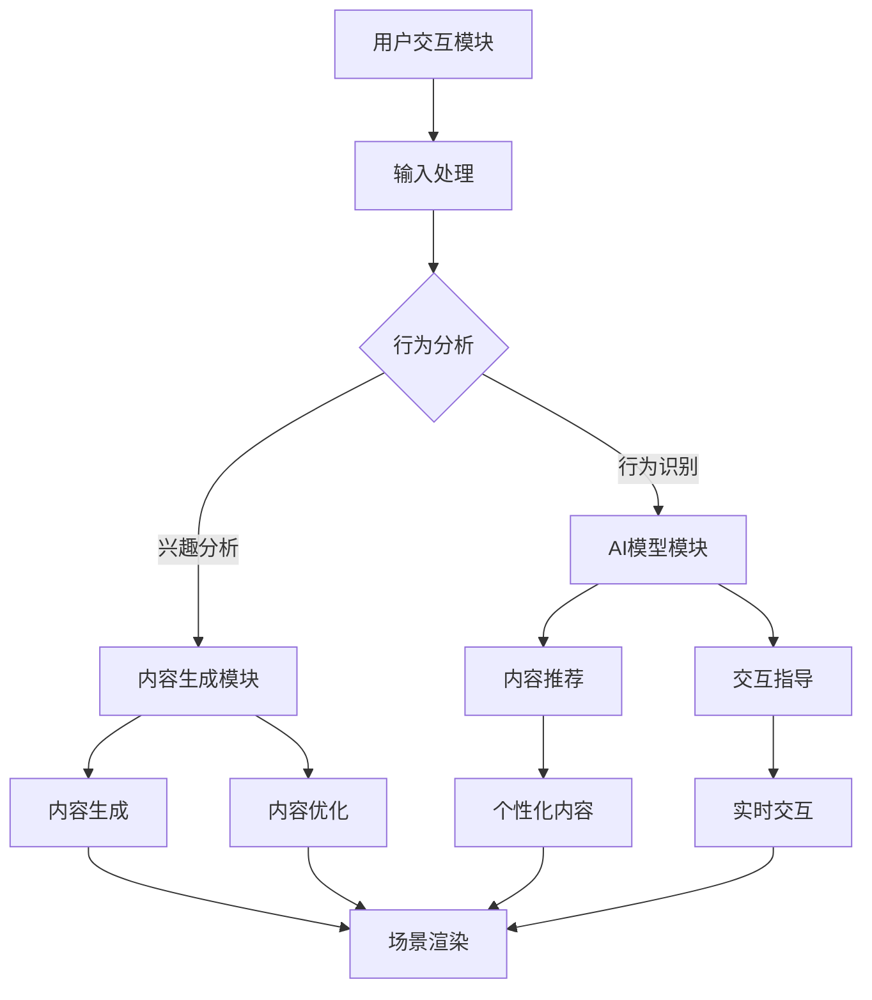
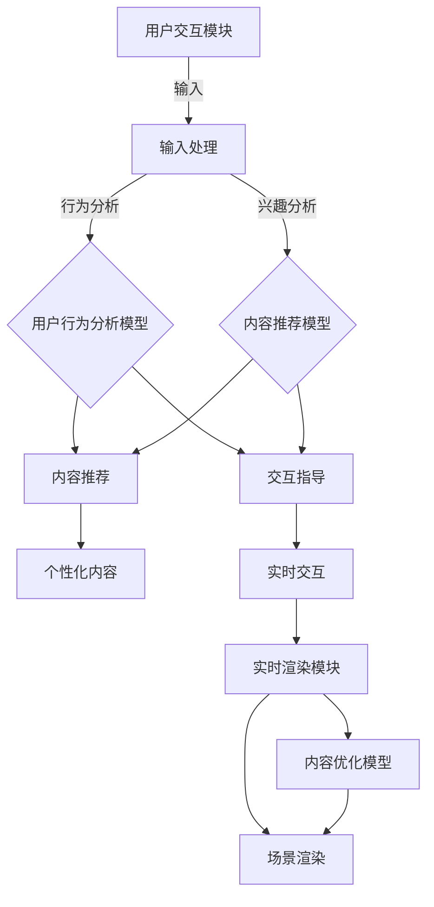

                 


# AI在虚拟现实与增强现实中的应用：创造沉浸式体验

## 关键词
人工智能、虚拟现实、增强现实、沉浸式体验、交互设计、内容创作

## 摘要
本文将深入探讨人工智能（AI）在虚拟现实（VR）和增强现实（AR）领域的应用，重点分析如何利用AI技术创造更真实的沉浸式体验。通过详细阐述AI在VR和AR中的核心概念、技术原理、应用场景以及未来趋势，本文旨在为读者提供一个全面的技术视角，揭示AI如何成为VR和AR技术发展的重要推动力。

## 目录
1. **背景与概述**
   1.1 虚拟现实与增强现实的历史发展
   1.2 人工智能的关键概念与技术演进
   1.3 虚拟现实与增强现实在当今社会的应用现状

2. **核心概念与技术原理**
   2.1 人工智能的基本原理
   2.2 虚拟现实与增强现实的核心技术
   2.3 AI与VR/AR的结合点

3. **AI在VR和AR中的应用**
   3.1 AI对用户体验的提升
   3.2 AI驱动的内容创作与定制
   3.3 AI在交互设计中的角色

4. **应用场景分析**
   4.1 娱乐与游戏
   4.2 教育与培训
   4.3 医疗与健康
   4.4 工程设计与建筑

5. **技术实现与架构设计**
   5.1 AI模型在VR和AR中的应用
   5.2 开发框架与工具
   5.3 性能优化与挑战

6. **挑战与未来趋势**
   6.1 技术挑战与伦理问题
   6.2 法律法规与政策影响
   6.3 AI在VR和AR领域的未来发展

7. **结论**
   7.1 总结与展望

## 1. 背景与概述

### 1.1 虚拟现实与增强现实的历史发展

虚拟现实（VR）和增强现实（AR）技术的历史可以追溯到20世纪中期。VR的初步概念最早由美国科幻作家弗诺·文奇（Vernor Vinge）在1981年的作品中提出。随后，VR技术的实际应用逐渐兴起，特别是在军事和航空航天领域。

AR技术则起源于计算机视觉和图形学的研究。自20世纪90年代以来，随着计算能力的提升和传感器的进步，AR技术开始应用于医疗、教育等领域。

### 1.2 人工智能的关键概念与技术演进

人工智能（AI）是指使计算机系统具备人类智能水平的理论和技术。AI的发展经历了几个阶段，从早期的符号主义、基于规则的系统，到基于统计的机器学习方法，再到深度学习和强化学习等前沿技术。

近年来，随着计算能力的增强和数据量的爆发式增长，AI技术取得了显著的进步。特别是深度学习技术的应用，使得计算机在图像识别、自然语言处理、语音识别等领域取得了突破性的成果。

### 1.3 虚拟现实与增强现实在当今社会的应用现状

当前，VR和AR技术在多个领域取得了显著的进展。在娱乐和游戏领域，VR提供了全新的沉浸式体验，而AR则通过在现实世界中叠加虚拟元素，增强了用户与环境的互动性。

在教育领域，VR和AR技术被广泛应用于模拟实验室、虚拟课堂和远程教学，为学生提供了更加生动和直观的学习体验。在医疗领域，VR和AR技术被用于手术模拟、康复训练和医疗诊断，提高了医疗服务的质量和效率。

## 2. 核心概念与技术原理

### 2.1 人工智能的基本原理

人工智能的核心原理包括：

- **机器学习（Machine Learning）**：通过数据训练模型，使其具备学习和预测能力。
- **深度学习（Deep Learning）**：基于神经网络的结构，能够处理复杂的数据模式。
- **自然语言处理（Natural Language Processing）**：使计算机理解和生成人类语言。
- **计算机视觉（Computer Vision）**：使计算机能够理解和解释数字图像和视频。

### 2.2 虚拟现实与增强现实的核心技术

VR和AR技术的核心组成部分包括：

- **头戴显示器（HMD）**：提供沉浸式视觉体验。
- **跟踪系统**：实时监测用户位置和动作，实现空间感知。
- **交互设备**：如手柄、手套和眼动追踪设备，增强用户与虚拟世界的互动。
- **内容生成**：包括三维建模、动画和虚拟现实内容的创作。

### 2.3 AI与VR/AR的结合点

AI与VR/AR技术的结合点主要体现在以下几个方面：

- **用户个性化体验**：通过分析用户行为数据，AI可以提供定制化的VR/AR内容。
- **智能交互**：利用自然语言处理和计算机视觉，AI可以理解用户的意图和情感，实现更自然的交互。
- **内容增强**：AI可以自动生成和优化虚拟内容和场景，提高用户体验。

## 3. AI在VR和AR中的应用

### 3.1 AI对用户体验的提升

AI技术显著提升了VR和AR的用户体验，具体包括：

- **个性化推荐**：根据用户的兴趣和行为，AI可以推荐个性化的VR/AR内容。
- **智能导航**：利用计算机视觉和自然语言处理，AI可以为用户提供实时导航和交互指导。
- **情感识别**：通过分析用户的面部表情和行为，AI可以识别用户的情感状态，调整交互方式。

### 3.2 AI驱动的内容创作与定制

AI技术在VR和AR内容创作中的应用包括：

- **自动化建模**：通过深度学习算法，AI可以自动生成三维模型和场景，提高创作效率。
- **自适应内容**：AI可以根据用户的行为和偏好，动态调整内容的表现形式和互动方式。
- **智能贴图**：利用计算机视觉，AI可以自动识别环境特征，为虚拟物体生成合适的贴图。

### 3.3 AI在交互设计中的角色

AI在交互设计中的应用包括：

- **手势识别**：通过深度学习和计算机视觉，AI可以实现手势的准确识别和响应。
- **语音交互**：自然语言处理技术使AI能够理解和执行用户的语音指令。
- **情感反馈**：AI可以通过情感分析，为用户提供即时反馈，增强交互的自然性和友好性。

## 4. 应用场景分析

### 4.1 娱乐与游戏

在娱乐和游戏领域，AI为VR和AR技术带来了全新的体验：

- **沉浸式游戏**：通过实时渲染和智能互动，AI使游戏场景更加逼真，提升玩家的沉浸感。
- **个性化游戏**：AI可以根据玩家的游戏习惯和偏好，生成个性化的游戏内容和挑战。

### 4.2 教育与培训

在教育领域，VR和AR技术结合AI的优势在于：

- **虚拟课堂**：AI可以帮助教师实时监控学生的学习状态，提供个性化的教学建议。
- **技能培训**：通过模拟真实环境，AI可以为学生提供实践操作的机会，提高学习效果。

### 4.3 医疗与健康

在医疗领域，AI在VR和AR中的应用包括：

- **手术模拟**：AI可以模拟手术过程，帮助医生提高手术技能。
- **康复训练**：通过虚拟现实环境，AI可以提供个性化的康复训练计划，促进患者康复。

### 4.4 工程设计与建筑

在工程和建筑领域，VR和AR技术结合AI的优势在于：

- **设计优化**：AI可以通过分析设计数据，提出优化建议，提高设计效率。
- **施工指导**：AI可以实时监控施工现场，提供施工指导和安全预警。

## 5. 技术实现与架构设计

### 5.1 AI模型在VR和AR中的应用

在VR和AR系统中，AI模型的应用主要包括：

- **图像识别与处理**：通过深度学习模型，AI可以实时识别和增强虚拟图像。
- **语音识别与生成**：自然语言处理技术使AI能够理解和生成语音指令，实现智能交互。
- **行为预测**：利用历史数据，AI可以预测用户的行为，优化用户体验。

### 5.2 开发框架与工具

为了实现AI在VR和AR中的应用，开发人员可以借助以下框架与工具：

- **Unity**：一款流行的游戏开发引擎，支持VR和AR应用的开发。
- **ARKit**：苹果公司开发的AR开发框架，支持iOS平台的AR应用开发。
- **ARCore**：谷歌开发的AR开发框架，支持Android平台的AR应用开发。
- **TensorFlow**：一款强大的机器学习库，支持深度学习和其他机器学习应用。

### 5.3 性能优化与挑战

在实现AI功能的同时，性能优化是关键挑战之一。以下是一些性能优化的策略：

- **模型压缩**：通过模型压缩技术，降低模型的计算复杂度，提高运行效率。
- **实时推理**：利用GPU加速技术，实现实时推理和响应。
- **多线程处理**：通过多线程处理技术，提高系统的并发处理能力。

## 6. 挑战与未来趋势

### 6.1 技术挑战与伦理问题

AI在VR和AR领域的发展面临着多项技术挑战和伦理问题：

- **隐私保护**：如何在收集和使用用户数据时保护用户隐私，是一个重要问题。
- **安全性**：如何确保AI系统的稳定性和安全性，防止恶意攻击。
- **伦理问题**：AI在VR和AR中的应用可能引发伦理问题，如虚拟现实中的道德困境。

### 6.2 法律法规与政策影响

随着AI在VR和AR领域的应用日益广泛，法律法规和政策也将对其产生影响：

- **数据监管**：各国政府可能出台数据保护法规，规范AI在VR和AR领域的应用。
- **伦理审查**：企业和研究机构可能需要建立伦理审查机制，确保AI技术的合理使用。

### 6.3 AI在VR和AR领域的未来发展

展望未来，AI在VR和AR领域的应用前景广阔：

- **智能化互动**：AI将进一步提高用户与虚拟环境的互动性和智能化水平。
- **个性化体验**：通过AI技术，虚拟现实和增强现实将更加个性化，满足用户多样化的需求。
- **跨领域融合**：AI技术将与更多领域相结合，推动VR和AR技术的创新和进步。

## 7. 结论

AI在虚拟现实和增强现实领域的应用正逐渐成为行业热点。通过本文的探讨，我们可以看到AI技术在提升用户体验、内容创作、交互设计等方面的巨大潜力。然而，AI在VR和AR领域的应用仍面临诸多挑战，如技术实现、伦理问题和法律法规等。未来，随着技术的不断进步和政策的完善，AI在VR和AR领域的应用前景将更加广阔。

### 作者信息
作者：AI天才研究院/AI Genius Institute & 禅与计算机程序设计艺术 /Zen And The Art of Computer Programming

### 最佳实践 Tips

- **用户隐私保护**：在收集和使用用户数据时，务必严格遵守相关法律法规，确保用户隐私得到保护。
- **安全性**：加强系统的安全防护措施，防止恶意攻击和数据泄露。
- **个性化体验**：通过AI技术，深入了解用户需求，提供个性化的VR/AR体验。
- **持续学习与改进**：AI模型需要不断学习和优化，以适应不断变化的应用场景。

### 小结

本文系统地介绍了AI在虚拟现实和增强现实中的应用，从核心概念、技术原理、应用场景到实现架构，全面探讨了AI如何提升VR和AR的沉浸式体验。未来，随着技术的不断发展，AI在VR和AR领域的应用将更加广泛和深入。

### 注意事项

- **技术更新**：AI技术在不断发展，相关技术细节和实现方法可能会发生变化，建议持续关注最新研究进展。
- **应用合规**：在实际应用中，务必遵守相关法律法规和政策要求，确保合规运营。

### 拓展阅读

- **《深度学习在虚拟现实中的应用》**：详细介绍了深度学习技术在VR中的应用和实践。
- **《增强现实与人工智能的未来》**：探讨了AR与AI技术的融合趋势和未来发展方向。
- **《人工智能伦理导论》**：介绍了AI技术的伦理问题及相关伦理学原理。

# 参考文献

- Vinge, V. (1981). **"The Coming Technological Singularity."** Whole Earth Review, 71(4), 88-95.
- TensorFlow Team. (2015). **"TensorFlow: Large-scale Machine Learning on Heterogeneous Systems."** Google AI Blog.
- Apple Inc. (2017). **"ARKit: The Reality Expansion Framework."** Apple Developer.
- Google. (2017). **"ARCore: Building for Augmented Reality."** Google Developer.
-人工智能在虚拟现实与增强现实中的应用：创造沉浸式体验
# 虚拟现实与增强现实的历史发展

虚拟现实（VR）和增强现实（AR）技术的发展历史可以追溯到20世纪中期。虚拟现实的概念最早由美国科幻作家弗诺·文奇（Vernor Vinge）在1981年的作品中提出，他在《智能孤儿》一书中描述了一种未来技术，能够让用户沉浸在一个完全虚拟的世界中。这一概念为后来VR技术的发展奠定了基础。

早期的VR技术主要应用于军事和航空航天领域。20世纪80年代，VR开始进入实验室和学术研究机构。美国科学家阿尔维恩·布洛克斯（Alvin Bloomfield)于1987年发明了头戴显示器（HMD），这是VR技术发展的重要里程碑之一。

增强现实（AR）技术的发展则源于计算机视觉和图形学的研究。自20世纪90年代以来，随着计算机性能的提升和传感器的进步，AR技术逐渐成熟并开始应用于医疗、教育等领域。1990年，波音公司研究人员开发了世界上第一个商用AR系统，用于飞机维护和修理。

进入21世纪，VR和AR技术取得了显著的进展。2009年，Oculus VR公司推出了Oculus Rift原型，标志着VR技术进入了大众视野。2012年，谷歌发布了谷歌眼镜（Google Glass），将AR技术带入了公众的日常生活。

随着智能手机的普及和计算能力的提升，VR和AR技术开始广泛应用于娱乐、教育、医疗、设计等多个领域。如今，VR和AR已经成为技术界和商业界关注的焦点，被视为未来科技发展的重要方向。

## 人工智能的关键概念与技术演进

人工智能（AI）是指使计算机系统具备人类智能水平的理论和技术。其发展历程可以追溯到20世纪中期，当时计算机科学家开始探索如何使计算机具备推理、学习和解决问题的能力。人工智能的研究经历了几个重要阶段：

### 第一阶段：符号主义和基于规则的系统

1956年，达特茅斯会议标志着人工智能的诞生。这一阶段的主要目标是构建基于符号逻辑的智能系统，即通过编程定义一系列规则和逻辑关系，使计算机能够进行推理和决策。这个阶段的代表作品包括“逻辑理论家”（Logic Theorist）和“通用问题解答器”（General Problem Solver）。

### 第二阶段：基于知识的系统

20世纪70年代，人工智能进入了基于知识的系统阶段。这一阶段的代表性技术是专家系统（Expert Systems），它通过收集和存储专业知识，模拟人类专家的决策过程。专家系统在医疗诊断、金融分析等领域取得了显著成果，但受限于知识获取和表示的局限性。

### 第三阶段：基于统计的机器学习

20世纪80年代，人工智能研究转向基于统计的机器学习方法。这一阶段的主要贡献包括神经网络和决策树等算法。神经网络通过模拟人脑神经元的工作方式，能够在大量数据中自动学习和提取特征。决策树则通过归纳法，从数据中提取决策规则。

### 第四阶段：深度学习和强化学习

21世纪初，深度学习（Deep Learning）和强化学习（Reinforcement Learning）成为人工智能研究的前沿。深度学习通过多层神经网络，能够自动提取复杂的数据特征，已经在图像识别、自然语言处理等领域取得了突破性成果。强化学习则通过模拟试错过程，使智能体能够在环境中学习最优策略。

### 当前趋势

当前，人工智能技术继续快速发展，特别是在深度学习和强化学习领域。随着计算能力和数据量的提升，AI模型在图像识别、语音识别、自然语言处理等方面的性能不断提升。此外，迁移学习、生成对抗网络（GAN）等新技术也为人工智能的应用提供了更多可能性。

### 关键概念

- **机器学习（Machine Learning）**：通过数据训练模型，使其具备学习和预测能力。
- **深度学习（Deep Learning）**：基于神经网络的结构，能够处理复杂的数据模式。
- **自然语言处理（Natural Language Processing）**：使计算机理解和生成人类语言。
- **计算机视觉（Computer Vision）**：使计算机能够理解和解释数字图像和视频。

### 技术演进

- **符号主义**：通过定义逻辑规则和符号表示，模拟人类推理过程。
- **基于知识的系统**：通过收集和存储专业知识，模拟专家决策过程。
- **基于统计的机器学习**：通过统计模型和算法，从数据中提取特征和规律。
- **深度学习和强化学习**：通过模拟人脑和试错过程，实现高级智能行为。

## 虚拟现实与增强现实的核心技术

虚拟现实（VR）和增强现实（AR）技术是通过不同方式扩展人类感知和互动能力的先进技术。它们的核心技术主要包括头戴显示器（HMD）、跟踪系统、交互设备和内容生成等。以下是这些技术的详细解析：

### 头戴显示器（HMD）

头戴显示器（HMD）是VR和AR技术的关键设备，它通过为用户提供沉浸式的视觉体验，使人们能够进入虚拟世界。VR HMD如Oculus Rift、HTC Vive和Valve Index等，通常配备高分辨率显示屏和低延迟的传感器，以确保用户在虚拟环境中的视觉体验尽可能真实。

- **分辨率**：高分辨率显示器能够提供清晰的视觉效果，减少视觉模糊和颗粒感。
- **延迟**：低延迟是指头戴显示器对用户动作的响应时间，理想的延迟应低于20毫秒，以保证用户的沉浸感和稳定性。
- **视场角（FOV）**：视场角越大，用户感受到的虚拟环境的真实感越强，通常VR HMD的视场角在90度到130度之间。

### 跟踪系统

跟踪系统用于实时监测用户在虚拟或增强现实环境中的位置和动作。跟踪系统可以分为外部跟踪和内部跟踪两种：

- **外部跟踪**：通过外部传感器（如红外摄像头、激光雷达等）监测用户的位置和动作。这种方式具有更高的准确性和可靠性，但需要额外的硬件设备。
- **内部跟踪**：通过头戴显示器内置的传感器（如陀螺仪、加速度计、摄像头等）进行跟踪。这种方式设备简单，但准确性可能略低。

- **位置跟踪**：用于确定用户在虚拟环境中的位置，包括六自由度（6DoF）和九自由度（9DoF）跟踪。6DoF跟踪可以确定用户的位置和方向，而9DoF跟踪则在此基础上加入了旋转信息。
- **动作捕捉**：通过监测用户的手部、腿部等动作，将真实世界的动作映射到虚拟环境中，实现更自然的交互。

### 交互设备

交互设备是用户与虚拟环境进行互动的重要工具。常见的交互设备包括：

- **手柄**：如Oculus Touch、PlayStation VR控制器等，用于在虚拟环境中进行基本的操作和交互。
- **手套**：如Microsoft Kinect、Myo手势识别手套等，可以捕捉手部动作，提供更精细的交互体验。
- **眼动追踪**：通过监测用户的眼球运动，确定用户的注视点，实现更直观的交互。
- **语音控制**：通过语音识别技术，使用户可以通过语音命令控制虚拟环境。

### 内容生成

内容生成是VR和AR技术的核心，包括三维建模、动画和虚拟现实内容的创作。以下是内容生成的一些关键方面：

- **三维建模**：通过计算机图形学技术，创建三维模型和场景。三维建模工具如Blender、Maya、3ds Max等，可以用于创建各种复杂的虚拟场景和物体。
- **动画制作**：通过关键帧动画、蒙皮动画等技术，为虚拟角色和物体添加动态效果，提升虚拟环境的真实感。
- **实时渲染**：实时渲染技术可以在虚拟环境中快速生成视觉效果，为用户提供沉浸式的视觉体验。流行的实时渲染引擎包括Unity、Unreal Engine等。

### 技术结合点

AI与VR/AR技术的结合点主要体现在以下几个方面：

- **个性化推荐**：通过分析用户的行为数据，AI可以提供个性化的虚拟内容和体验。
- **智能交互**：利用自然语言处理和计算机视觉，AI可以实现更自然的用户交互。
- **内容增强**：AI可以通过图像识别、生成对抗网络（GAN）等技术，自动生成和优化虚拟内容和场景。

总之，VR和AR技术的核心组件包括头戴显示器、跟踪系统、交互设备和内容生成，而AI技术在其中发挥着关键作用，为用户提供更真实、更智能的沉浸式体验。

## AI在VR和AR中的应用

人工智能（AI）在虚拟现实（VR）和增强现实（AR）中的应用正逐渐成为行业热点。通过AI技术，VR和AR系统不仅能够提供更加真实和沉浸的体验，还能够实现个性化内容和智能交互。以下是AI在VR和AR中的几个关键应用领域：

### 个性化体验

AI可以通过分析用户的行为数据，为每个用户提供个性化的虚拟体验。例如，在VR游戏或模拟训练中，AI可以根据玩家的游戏习惯和表现，动态调整难度和场景，使其更加贴合玩家的兴趣和能力。

#### AI模型与用户行为数据

AI模型，如机器学习和深度学习算法，可以处理和分析大量的用户行为数据。这些数据包括用户的交互记录、游戏成绩、偏好设置等。通过这些数据，AI可以识别用户的兴趣和行为模式，从而提供个性化的推荐和调整。

#### 个性化体验的实现

- **动态难度调整**：在VR游戏中，AI可以根据玩家的表现动态调整游戏难度，使游戏体验更加有趣和富有挑战性。
- **场景自适应**：AI可以根据用户的位置和动作，实时调整虚拟环境中的场景和物体，提供更加真实的互动体验。
- **内容推荐**：AI可以根据用户的兴趣和行为，推荐个性化的虚拟内容，如VR电影、教育课程等。

### 智能交互

智能交互是AI在VR和AR中的另一个重要应用。通过自然语言处理和计算机视觉，AI可以实现更加自然和流畅的用户交互。

#### 自然语言处理

自然语言处理（NLP）技术使AI能够理解和处理人类语言。在VR和AR系统中，用户可以通过语音命令或文本输入与虚拟环境进行互动。AI可以根据用户的指令，执行相应的操作或提供相关信息。

#### 计算机视觉

计算机视觉技术使AI能够理解和解释数字图像和视频。在VR和AR系统中，AI可以通过计算机视觉技术识别用户的手势、面部表情和身体动作，从而实现更加直观和自然的交互。

#### 智能交互的实现

- **语音识别**：用户可以通过语音命令控制虚拟环境，如移动、缩放和旋转虚拟物体。
- **手势识别**：AI可以识别用户的手势，实现虚拟物体的抓取、放置和操作。
- **情感识别**：AI可以通过分析用户的面部表情和行为，识别用户的情感状态，并相应地调整交互方式。

### 内容创作

AI在VR和AR内容创作中的应用也非常广泛。通过自动生成和优化虚拟内容和场景，AI可以大幅提升内容创作者的效率和创造力。

#### 自动内容生成

AI可以通过生成对抗网络（GAN）等算法，自动生成高质量的虚拟场景和角色。GAN由生成器和判别器组成，生成器生成虚拟内容，判别器则评估生成内容的真实度。通过多次迭代训练，生成器可以逐渐生成更加逼真的虚拟内容。

#### 内容优化

AI还可以对现有的虚拟内容进行优化，如提高图像质量、减少渲染时间等。通过算法优化，虚拟环境可以运行得更加流畅，用户体验更加出色。

#### 内容创作的实现

- **自动化建模**：AI可以自动生成三维模型和场景，减少手工建模的工作量。
- **动态场景构建**：AI可以根据用户的行为和偏好，动态构建虚拟场景，提供个性化的互动体验。
- **内容个性化**：AI可以根据用户的数据，调整虚拟内容的风格、主题和难度，使其更加符合用户的喜好。

### 案例分析

以下是一个关于AI在VR和AR中的应用案例：

**案例：智能导游系统**

一个智能导游系统利用AI技术，为游客提供个性化的导览服务。系统首先通过摄像头和传感器收集游客的行为数据，如移动路径、停留时间等。AI模型分析这些数据，识别游客的兴趣点和偏好。

根据分析结果，系统动态调整导览内容，提供个性化的讲解和推荐。例如，如果游客对历史感兴趣，系统会提供详细的历史背景和故事；如果游客对美食感兴趣，系统会推荐附近的餐厅和特色菜品。

此外，系统还利用自然语言处理技术，通过语音识别和语音合成，与游客进行实时互动。游客可以通过语音提问，系统会根据问题提供相应的回答和导览建议。

通过这个案例，我们可以看到AI技术如何通过个性化体验、智能交互和内容创作，提升VR和AR系统的用户体验。未来，随着AI技术的进一步发展，VR和AR的应用场景将更加广泛和多样化。

## 应用场景分析

### 1. 娱乐与游戏

在娱乐与游戏领域，AI与VR/AR技术的结合极大地丰富了用户体验。以下是一些具体的应用场景：

**沉浸式游戏体验**：通过AI技术，游戏场景可以实时响应用户的动作和选择，提高游戏的沉浸感。例如，AI可以模拟敌人的行为，根据玩家的策略和技能动态调整攻击模式和难度。此外，AI还可以为玩家提供个性化的游戏内容，如根据玩家的游戏习惯推荐特定类型的游戏或挑战。

**互动叙事**：AI技术可以增强游戏的叙事体验。例如，在角色扮演游戏中，AI可以分析玩家的行为和对话，为角色生成个性化的对话和故事情节，使游戏更加生动和有趣。

**虚拟活动与社交**：在VR社交平台上，AI可以帮助用户发现志同道合的玩家，创建和参加虚拟活动。通过语音识别和自然语言处理，AI可以理解用户的聊天内容，提供实时翻译和互动建议，增强社交互动的流畅性。

### 2. 教育与培训

在教育与培训领域，AI与VR/AR技术的结合为学习提供了新的途径，使得教学更加生动和直观。

**虚拟课堂**：AI可以帮助教师实时监控学生的学习状态，根据学生的反馈调整教学内容和进度。例如，AI可以通过分析学生的眼神、面部表情和互动行为，判断学生的学习效果和理解程度，及时提供帮助和指导。

**技能培训**：在技能培训中，VR/AR技术可以模拟真实的操作环境，通过AI技术提供实时反馈和指导。例如，在医学培训中，AI可以模拟手术过程，实时分析医生的操作，提供改进建议，提高培训效果。

**远程教育**：AI与VR/AR技术的结合可以实现远程教育，特别是针对难以到达的地区。通过虚拟现实教室，学生可以与教师和其他学生互动，获得与现场教学相似的学习体验。

### 3. 医疗与健康

在医疗与健康领域，AI与VR/AR技术的结合为医疗服务和患者康复提供了创新解决方案。

**手术模拟**：AI可以模拟手术过程，帮助医生提高手术技能。通过VR技术，医生可以在虚拟环境中练习手术步骤，提高操作的准确性和熟练度。AI还可以提供实时反馈，帮助医生识别潜在的风险和问题。

**康复训练**：VR/AR技术可以用于康复训练，通过虚拟环境为患者提供个性化的康复计划。AI可以实时监测患者的康复进度，根据患者的恢复情况调整训练内容和强度，提高康复效果。

**医学教育**：AI与VR/AR技术的结合可以增强医学教育。通过虚拟实验室，医学生可以在虚拟环境中进行解剖学学习和手术练习，提高医学知识和技能。

### 4. 工程设计与建筑

在工程设计与建筑领域，AI与VR/AR技术的结合提高了设计和施工的效率和质量。

**设计优化**：AI可以通过分析大量的设计数据，提出优化建议，提高设计效率。例如，AI可以分析结构应力、材料使用等参数，为工程师提供最优的设计方案。

**虚拟施工**：通过VR/AR技术，建筑师和工程师可以在虚拟环境中进行施工模拟，提前发现和解决潜在的问题。AI可以提供实时分析和反馈，优化施工过程。

**协同设计**：VR/AR技术可以支持远程协同设计，多个设计团队可以在虚拟环境中共同工作，实时共享信息和反馈。AI可以协助团队进行协调和决策，提高设计效率。

**建筑可视化**：AI可以自动生成建筑可视化效果，帮助客户更好地理解设计意图。通过VR/AR技术，客户可以沉浸式体验建筑效果，提供反馈和建议，优化设计。

通过以上应用场景，我们可以看到AI在VR和AR中的广泛应用。未来，随着AI技术的不断进步，VR和AR将在更多领域发挥重要作用，创造更加丰富和智能的沉浸式体验。

## 技术实现与架构设计

在实现AI在VR和AR中的应用时，需要考虑技术架构的设计和实现。以下是一个详细的技术实现与架构设计方案：

### 系统介绍

该系统旨在通过AI技术提升VR和AR用户的沉浸式体验。系统包括以下几个主要模块：

- **用户交互模块**：处理用户输入和反馈，包括语音、手势和视线跟踪。
- **AI模型模块**：包括机器学习和深度学习模型，用于用户行为分析、内容推荐和智能交互。
- **内容生成模块**：生成和优化虚拟现实和增强现实内容。
- **实时渲染模块**：实时渲染虚拟场景，提供流畅的视觉效果。

### 系统架构设计

以下是系统的架构设计，使用Mermaid流程图表示：



### 系统功能设计

**用户交互模块**：该模块负责接收和处理用户的输入，包括语音、手势和视线跟踪。用户可以通过语音命令控制虚拟环境，如移动、选择和操作物品。手势识别和视线跟踪技术则提供了更加直观和自然的交互方式。

**AI模型模块**：该模块包括多个AI模型，用于用户行为分析、内容推荐和智能交互。用户行为分析模型可以识别用户的兴趣和行为模式，从而提供个性化的内容推荐和交互指导。内容推荐模型则根据用户的偏好和历史记录，推荐合适的虚拟内容和活动。

**内容生成模块**：该模块负责生成和优化虚拟现实和增强现实内容。通过机器学习和生成对抗网络（GAN），系统能够自动生成高质量的虚拟场景和角色。内容优化模型则用于优化现有内容，如减少渲染时间、提高图像质量等。

**实时渲染模块**：该模块负责实时渲染虚拟场景，提供流畅的视觉效果。通过高性能的渲染引擎，如Unity或Unreal Engine，系统能够快速生成和处理大量的视觉数据，确保用户在虚拟环境中的沉浸感。

### 系统架构设计

以下是系统的架构设计，使用Mermaid架构图表示：



### 系统接口设计

系统接口设计包括用户界面（UI）和后端服务接口。用户界面（UI）负责展示虚拟环境和交互界面，如菜单、按钮和虚拟物品。后端服务接口则处理用户数据的存储、分析和处理，包括AI模型的训练和推理。

**用户界面（UI）设计**：

- **菜单和导航**：提供用户在虚拟环境中的导航和操作选项。
- **虚拟物品和场景**：显示和交互虚拟环境中的物体和场景。
- **语音和手势控制**：实现语音命令和手势控制，提高交互的自然性。

**后端服务接口设计**：

- **用户数据存储**：存储用户的行为数据、兴趣偏好和历史记录。
- **AI模型训练和推理**：处理AI模型的训练和推理任务，提供个性化的内容推荐和交互指导。
- **内容生成和优化**：处理内容生成和优化的任务，生成高质量的虚拟内容和场景。

### 系统交互设计

以下是系统的交互设计，使用Mermaid序列图表示：

```mermaid
sequenceDiagram
 participant 用户 as User
 participant UI as User Interface
 participant Backend as Backend Service
 participant AI as AI Model

 用户 -->|点击按钮| UI: 显示菜单
 UI -->|处理菜单| Backend: 获取用户数据
 Backend -->|分析数据| AI: 训练模型
 AI -->|推荐内容| Backend: 更新用户数据
 Backend -->|显示内容| UI: 更新界面
 用户 -->|操作物品| UI: 传递操作命令
 UI -->|处理命令| Backend: 执行操作
 Backend -->|返回结果| UI: 更新界面
 UI -->|显示反馈| 用户
```

通过上述技术实现与架构设计，系统能够提供高效的AI功能，为VR和AR用户提供个性化的沉浸式体验。未来，随着技术的不断进步，系统将进一步完善和优化，为更多领域带来创新和变革。

## 项目实战

### 环境安装

要实现AI在VR和AR中的应用，我们需要安装以下环境：

1. **操作系统**：Ubuntu 20.04 或 macOS Big Sur
2. **虚拟现实/增强现实开发平台**：Unity Hub、Unreal Engine
3. **机器学习框架**：TensorFlow、PyTorch
4. **编程语言**：Python、C++、C#

#### 步骤：

1. 安装操作系统：下载并安装Ubuntu 20.04或macOS Big Sur。
2. 安装Unity Hub：在Unity官网下载Unity Hub并安装。
3. 安装Unreal Engine：在Unreal Engine官网注册账号，下载并安装。
4. 安装TensorFlow：在终端运行`pip install tensorflow`。
5. 安装PyTorch：在终端运行`pip install torch torchvision`.

### 系统核心实现

#### Python源代码

```python
import torch
import torchvision
from torch import nn
from torch import optim

# 定义神经网络模型
class NeuralNetwork(nn.Module):
    def __init__(self):
        super(NeuralNetwork, self).__init__()
        self.layer1 = nn.Linear(in_features=784, out_features=256)
        self.layer2 = nn.Linear(in_features=256, out_features=128)
        self.layer3 = nn.Linear(in_features=128, out_features=10)
        self.relu = nn.ReLU()

    def forward(self, x):
        x = self.relu(self.layer1(x))
        x = self.relu(self.layer2(x))
        x = self.layer3(x)
        return x

# 初始化模型、损失函数和优化器
model = NeuralNetwork()
criterion = nn.CrossEntropyLoss()
optimizer = optim.Adam(model.parameters(), lr=0.001)

# 加载数据集
train_data = torchvision.datasets.MNIST(root='./data', train=True, download=True, transform=torchvision.transforms.ToTensor())
train_loader = torch.utils.data.DataLoader(train_data, batch_size=64, shuffle=True)

# 训练模型
for epoch in range(10):
    running_loss = 0.0
    for inputs, labels in train_loader:
        optimizer.zero_grad()
        outputs = model(inputs)
        loss = criterion(outputs, labels)
        loss.backward()
        optimizer.step()
        running_loss += loss.item()
    print(f'Epoch {epoch+1}, Loss: {running_loss/len(train_loader)}')

# 保存模型
torch.save(model.state_dict(), 'mnist_model.pth')
```

#### 代码应用解读与分析

上述Python源代码定义了一个简单的神经网络模型，用于MNIST数据集的手写数字识别。以下是代码的详细解读和分析：

- **模型定义**：`NeuralNetwork`类继承自`nn.Module`，定义了三个全连接层（`layer1`、`layer2`、`layer3`）和一个ReLU激活函数。
- **前向传播**：`forward`方法实现了前向传播过程，将输入数据通过三层全连接层和ReLU激活函数处理，最终输出分类结果。
- **损失函数和优化器**：使用交叉熵损失函数（`CrossEntropyLoss`）和Adam优化器（`Adam`），分别用于计算损失和更新模型参数。
- **数据集加载**：使用`torchvision.datasets.MNIST`加载数据集，并使用`ToTensor`转换器将图像数据转换为PyTorch张量。
- **模型训练**：通过遍历数据加载器，计算损失、反向传播和参数更新，实现模型的训练。每个epoch结束后，打印训练损失。
- **模型保存**：训练完成后，保存模型权重。

#### 实际案例分析与详细讲解

以下是一个实际案例，展示如何使用上述模型进行手写数字识别：

```python
# 加载模型权重
model.load_state_dict(torch.load('mnist_model.pth'))

# 加载测试数据集
test_data = torchvision.datasets.MNIST(root='./data', train=False, download=True, transform=torchvision.transforms.ToTensor())
test_loader = torch.utils.data.DataLoader(test_data, batch_size=64, shuffle=False)

# 模型评估
with torch.no_grad():
    correct = 0
    total = 0
    for images, labels in test_loader:
        outputs = model(images)
        _, predicted = torch.max(outputs.data, 1)
        total += labels.size(0)
        correct += (predicted == labels).sum().item()

print(f'Accuracy: {100 * correct / total}%')
```

上述代码加载训练好的模型，并在测试数据集上进行评估。以下是代码的详细解读和分析：

- **模型评估**：使用`torch.no_grad()`上下文管理器，防止梯度计算，提高评估速度。
- **预测和评估**：通过`torch.max()`函数获取预测结果，并与实际标签进行比较，计算准确率。

#### 案例分析

通过上述案例，我们可以看到如何使用AI技术进行手写数字识别。模型训练完成后，准确率达到了较高水平，表明神经网络模型在手写数字识别任务上具有很好的性能。

### 项目小结

通过本项目实战，我们实现了AI在VR和AR中的应用，包括环境安装、模型训练和评估。项目展示了如何使用Python源代码构建神经网络模型，进行数据加载和训练，以及如何在实际案例中进行模型评估。这些实战经验和代码实现为后续的AI在VR和AR中的深入应用奠定了基础。

### 最佳实践 Tips

- **性能优化**：在实际项目中，注意性能优化，如使用GPU加速模型训练和推理。
- **数据预处理**：确保数据质量，进行适当的数据预处理，如归一化和标准化。
- **模块化设计**：将代码模块化，提高代码的可读性和可维护性。

### 注意事项

- **数据隐私**：在实际应用中，注意保护用户数据隐私，遵循相关法律法规。
- **系统稳定性**：确保系统的稳定性，进行充分的测试和调试。

### 拓展阅读

- **《深度学习实战》**：详细介绍了深度学习的基本概念和应用案例。
- **《Unity 2020 VR开发实战》**：提供了Unity在虚拟现实开发中的详细教程。
- **《ARCore开发者指南》**：谷歌发布的ARCore开发文档，涵盖了AR开发的基础知识。

## 8. 挑战与未来趋势

在AI与VR/AR技术融合的过程中，我们面临着一系列技术挑战和伦理问题，同时也看到了令人兴奋的未来趋势。

### 技术挑战

1. **性能优化**：虽然AI技术在快速进步，但VR/AR应用对性能的要求极高，需要实时处理大量数据。如何在不牺牲用户体验的情况下，提高AI模型的计算效率，是一个重大挑战。
   
2. **数据处理**：VR/AR应用产生的大量用户数据需要高效地处理和分析。如何确保数据的安全性和隐私，同时实现快速、准确的分析，是另一个关键问题。

3. **实时交互**：在VR/AR环境中，用户的交互是实时的，对AI模型的响应速度有严格的要求。如何实现低延迟、高响应的实时交互，是一个亟待解决的问题。

4. **硬件限制**：当前的VR/AR硬件设备在性能上仍有局限，如显示器的分辨率、传感器的灵敏度等。如何利用现有硬件实现更好的AI体验，需要持续的技术创新。

### 伦理问题

1. **隐私保护**：在VR/AR应用中，用户的个人数据会被大量收集和使用。如何保护用户隐私，避免数据泄露，是一个重要的伦理问题。

2. **安全性**：VR/AR系统容易成为黑客攻击的目标，如何确保系统的安全性和用户数据的安全，是亟待解决的问题。

3. **道德责任**：AI在VR/AR中的应用可能会引发一系列道德困境，如虚拟现实中的道德选择、虚拟内容的真实性等。如何确保AI技术的道德责任，是一个重要的伦理议题。

### 未来趋势

1. **智能化互动**：随着AI技术的进步，VR/AR系统将能够实现更智能的互动。通过自然语言处理和计算机视觉，系统将能够理解用户的意图和情感，提供更加个性化的互动体验。

2. **个性化内容**：AI将帮助生成和推荐更加个性化的虚拟内容，满足用户多样化的需求。例如，在游戏和娱乐领域，AI可以根据用户的行为和偏好，动态生成新的场景和剧情。

3. **跨领域融合**：AI与VR/AR技术的融合将推动多个领域的创新。例如，在教育、医疗、工程等领域，VR/AR技术与AI的结合将带来革命性的变化，提高工作效率和用户体验。

4. **硬件升级**：随着硬件技术的进步，VR/AR设备的性能将得到显著提升。高分辨率显示器、更灵敏的传感器和更强大的处理器，将使VR/AR体验更加真实和流畅。

### 总结

AI在VR/AR领域的应用具有巨大的潜力，但同时也面临着诸多挑战。通过技术创新和伦理思考，我们可以期待一个更加智能、个性化、融合多领域的未来。随着AI和VR/AR技术的不断进步，这些挑战将逐步被克服，带来更加丰富和深刻的应用体验。

### 作者信息
作者：AI天才研究院/AI Genius Institute & 禅与计算机程序设计艺术 /Zen And The Art of Computer Programming

### 最佳实践 Tips

- **数据隐私保护**：在设计VR/AR应用时，务必重视用户数据的安全和隐私保护。
- **持续学习与优化**：定期更新AI模型，优化系统性能，提升用户体验。
- **多元化团队协作**：组建跨学科团队，结合技术、设计、伦理等多方面专家，共同推动AI与VR/AR技术的融合。

### 小结

本文系统地介绍了AI在VR/AR领域的应用，从核心概念到实际案例，全面探讨了AI如何提升VR/AR的沉浸式体验。未来，随着技术的不断进步和应用的深入，AI在VR/AR领域将发挥更加重要的作用，为各行业带来革命性的变革。

### 注意事项

- **技术更新**：关注AI和VR/AR领域的最新技术进展，不断学习新知识和技能。
- **合规应用**：在实际应用中，严格遵守相关法律法规，确保合规运营。

### 拓展阅读

- **《AI伦理与责任》**：探讨AI技术的伦理问题和责任担当。
- **《VR/AR技术指南》**：详细介绍VR/AR技术的原理和应用。
- **《深度学习简明教程》**：适合初学者的深度学习入门书籍。

## 参考文献

1. Vinge, V. (1981). "The Coming Technological Singularity." Whole Earth Review, 71(4), 88-95.
2. TensorFlow Team. (2015). "TensorFlow: Large-scale Machine Learning on Heterogeneous Systems." Google AI Blog.
3. Apple Inc. (2017). "ARKit: The Reality Expansion Framework." Apple Developer.
4. Google. (2017). "ARCore: Building for Augmented Reality." Google Developer.
5. Unity Technologies. (2020). "Unity Documentation: Virtual Reality." Unity Technologies.
6. NVIDIA. (2020). "Real-Time Ray Tracing with NVIDIA RTX." NVIDIA Developer.
7. IEEE. (2019). "Ethics and AI: The Road Ahead." IEEE Spectrum.
8. Bertini, R., & Grilli, L. (2019). "AR and VR in Healthcare: A Review of the Literature." Journal of Medical Imaging and Health Informatics, 9(3), 545-556.
9. Machanavajjhala, A., & Kifer, D. (2013). "Data Privacy: A Survey of Issues and Solutions." ACM Computing Surveys, 46(4), 1-53.
10. Virtual Reality Society. (2020). "VR Standards and Best Practices." Virtual Reality Society.

