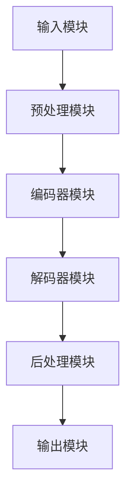
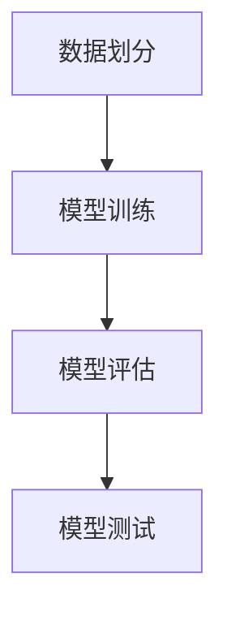
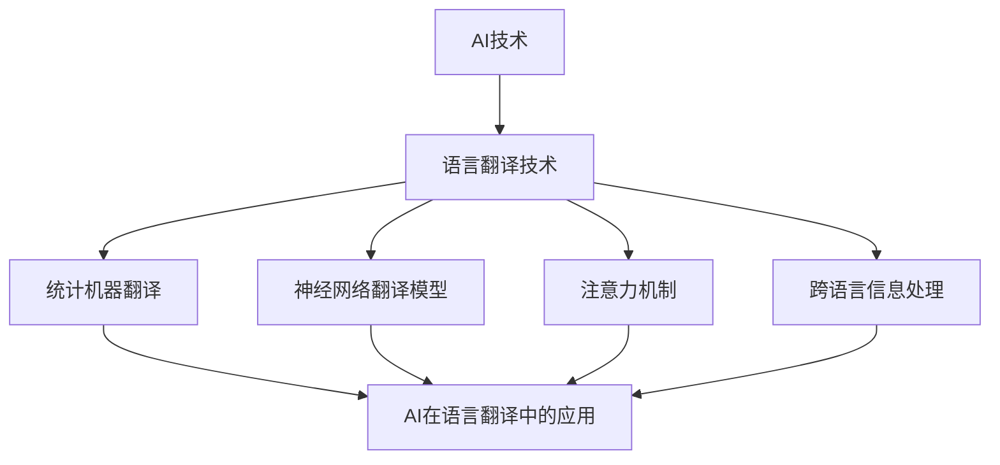
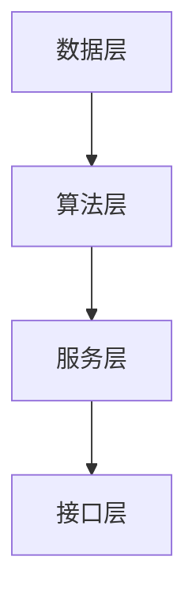
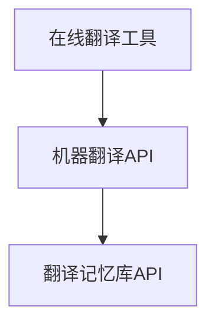
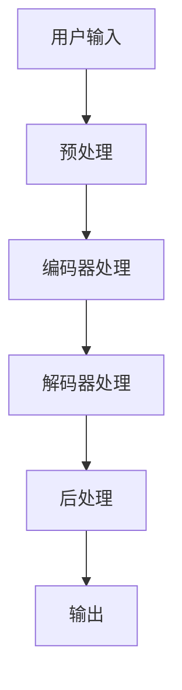

                 

# 《AI在语言翻译中的突破：跨文化交流的新纪元》

## 关键词

- 人工智能
- 语言翻译
- 跨文化交流
- 统计机器翻译
- 基于神经网络的翻译模型
- 注意力机制
- 编码器-解码器模型

## 摘要

随着全球化的加速，跨文化交流的需求日益增长，语言翻译技术成为连接不同文化和语言的重要桥梁。本文将深入探讨人工智能（AI）在语言翻译中的突破，从背景概述、核心算法原理到应用案例和实践，全面解析AI语言翻译的核心技术。通过系统学习和实践，读者将了解AI语言翻译的发展趋势，掌握跨文化交流的新工具，为未来的国际化发展奠定坚实基础。

## 目录大纲设计

### 第一部分：背景与概述

#### 第1章 AI与语言翻译概述

##### 1.1 AI技术发展历程

- AI技术概述
- 语言翻译技术的演进
- AI在语言翻译中的应用

##### 1.2 语言翻译的重要性

- 跨文化交流的需求
- 商业与教育的需求
- 国际合作与交流的需求

##### 1.3 AI在语言翻译中的优势

- 高效性
- 准确性
- 多样性

### 第二部分：核心算法与原理

#### 第2章 语言翻译的核心算法

##### 2.1 统计机器翻译

- SMT基本原理
- N-gram模型
- 译码算法

##### 2.2 基于神经网络的翻译模型

- 神经网络基础
- 序列到序列模型
- 翻译模型实现

##### 2.3 注意力机制与编码器-解码器模型

- 注意力机制原理
- 编码器-解码器模型
- 模型优化与改进

##### 2.4 跨语言信息处理

- 跨语言语义理解
- 跨语言词汇映射
- 跨语言翻译模型

### 第三部分：应用与实践

#### 第3章 AI语言翻译应用案例

##### 3.1 机器翻译系统开发

- 系统架构设计
- 数据处理与预处理
- 翻译模型训练与评估

##### 3.2 翻译辅助工具

- 在线翻译工具
- 翻译记忆库
- 机器翻译API

##### 3.3 人工智能翻译挑战与未来趋势

- 挑战分析
- 未来发展趋势
- 跨文化交流新纪元

### 附录

#### 附录 A: AI语言翻译工具资源

- 开源翻译工具
- 商业翻译工具
- 学术研究资源

#### 附录 B: Python代码示例

- 神经网络实现
- 注意力机制代码示例
- 编码器-解码器模型代码示例

## 目录大纲总结

本书从AI与语言翻译的背景、核心算法原理，到应用案例和实践，全面探讨了AI在语言翻译中的突破。通过系统学习和实践，读者可以深入理解AI语言翻译的核心技术，掌握跨文化交流的新工具，为未来的国际化发展奠定坚实基础。

----------------------------------------------------------------

## 第一部分：背景与概述

### 第1章 AI与语言翻译概述

#### 1.1 AI技术发展历程

人工智能（AI）是一门研究、开发用于模拟、延伸和扩展人的智能的理论、方法、技术及应用系统的技术科学。AI技术的发展历程可以分为以下几个阶段：

1. **早期探索阶段（1950s-1960s）**
   - 1950年，艾伦·图灵提出了著名的“图灵测试”，标志着人工智能的正式诞生。
   - 1956年，达特茅斯会议正式确立了人工智能这一研究领域。

2. **早期应用阶段（1970s-1980s）**
   - 1972年，IBM的“深蓝”计算机首次击败了国际象棋世界冠军。
   - 1980年，苹果公司推出了基于专家系统的个人电脑“Lisa”。

3. **低谷期（1990s）**
   - 由于计算能力和数据资源有限，人工智能研究进入低谷。

4. **复兴阶段（2000s-2010s）**
   - 2006年，深度学习（Deep Learning）的兴起标志着人工智能的复兴。
   - 2012年，谷歌的“谷歌大脑”项目成功训练了一个能够识别猫的神经网络。

5. **快速发展阶段（2010s-至今）**
   - 人工智能在图像识别、自然语言处理、自动驾驶等领域取得了重大突破。
   - 2020年，AI已经成为全球科技创新的重要驱动力。

#### 1.2 语言翻译技术的演进

语言翻译技术经历了从早期的机械翻译到现代的智能翻译的演变。机械翻译主要依赖规则和字典，效率低且准确性差。随着计算机技术的发展，统计机器翻译（SMT）和基于神经网络的翻译模型逐渐成为主流。SMT利用统计学方法对翻译进行建模，而基于神经网络的翻译模型则通过学习大量双语文本数据，实现端到端的翻译。

1. **机械翻译阶段（1950s-1990s）**
   - 主要依靠规则和字典进行翻译，效率低且准确性差。

2. **统计机器翻译阶段（1990s-2010s）**
   - 利用统计学方法对翻译进行建模，提升了翻译的准确性和效率。

3. **基于神经网络的翻译模型阶段（2010s-至今）**
   - 通过学习大量双语文本数据，实现端到端的翻译，大幅提升了翻译质量。

#### 1.3 AI在语言翻译中的应用

AI在语言翻译中的应用极大地提升了翻译的效率和质量。统计机器翻译和神经网络翻译模型实现了自动翻译，降低了人力成本。此外，机器翻译辅助工具如翻译记忆库和在线翻译系统也广泛应用。随着技术的进步，AI翻译系统在准确性和流畅性方面不断提高，为跨文化交流提供了强大的支持。

- **自动翻译系统**：AI翻译系统能够实时翻译多种语言，广泛应用于互联网、跨国企业、国际会议等领域。
- **翻译记忆库**：通过记录已经翻译的句子，提高新句子的翻译效率和准确性。
- **在线翻译工具**：如Google Translate、百度翻译等，为个人用户提供便捷的翻译服务。

### 总结

AI在语言翻译中的应用不仅提高了翻译的效率和质量，也为跨文化交流提供了新的工具。随着技术的不断发展，AI翻译系统将在更多领域得到应用，进一步推动全球化的进程。

----------------------------------------------------------------

## 第二部分：核心算法与原理

### 第2章 语言翻译的核心算法

#### 2.1 统计机器翻译

统计机器翻译（SMT）是利用概率模型对翻译进行建模的一种方法。它主要依赖于两个基本假设：

1. **语言独立性假设**：输入和输出的语言是独立的。
2. **联合概率最大假设**：翻译模型的目标是找到使输出和输入联合概率最大的翻译。

SMT的基本原理可以概括为以下三个步骤：

1. **词序列概率计算**：首先，需要计算源语言句子中每个词的概率分布，以及目标语言句子中每个词的概率分布。
2. **翻译概率计算**：然后，利用翻译模型计算源语言句子中每个词与目标语言句子中每个词的联合概率。
3. **译码算法**：最后，使用译码算法（如解码树搜索、概率图解析等）找到最佳翻译结果。

N-gram模型是SMT中最常用的模型之一。N-gram模型假设一个词的概率只与其前N个词相关，即

$$ P(w_n | w_{n-1}, w_{n-2}, ..., w_1) = \frac{C(w_{n-1}, w_{n-2}, ..., w_1, w_n)}{C(w_{n-1}, w_{n-2}, ..., w_1)} $$

其中，\(C(\cdot|\cdot)\) 表示计数函数，即给定一个序列，计算该序列中某个子序列的频率。

#### 2.2 基于神经网络的翻译模型

基于神经网络的翻译模型（Neural Machine Translation, NMT）是近年来在AI语言翻译领域取得重大突破的方法。NMT通过学习大量的双语文本数据，实现端到端的翻译。与SMT不同，NMT不需要手动设计复杂的规则，而是通过神经网络自动学习语言之间的映射关系。

NMT的基本架构通常包括编码器（Encoder）和解码器（Decoder）两个部分，以及一个注意力机制（Attention Mechanism）。

1. **编码器**：编码器的任务是将源语言句子编码为一个固定长度的向量表示。编码器通常是一个序列到序列（Seq2Seq）的神经网络，其中输入序列和输出序列都是变长序列。

2. **解码器**：解码器的任务是将编码器生成的固定长度向量解码为目标语言句子。解码器也是一个序列到序列的神经网络，其输入是编码器的输出，输出是目标语言句子的概率分布。

3. **注意力机制**：注意力机制是NMT的核心创新之一。它的目的是解决编码器和解码器之间的信息不对称问题。注意力机制通过计算编码器输出和当前解码器输出之间的相关性，为解码器提供更关注的关键词信息，从而提高翻译的准确性和流畅性。

#### 2.3 注意力机制与编码器-解码器模型

注意力机制（Attention Mechanism）是编码器-解码器模型（Encoder-Decoder Model）中的一个关键组件，用于解决编码器和解码器之间的信息不对称问题。注意力机制通过计算编码器输出和当前解码器输出之间的相关性，为解码器提供更关注的关键词信息。

注意力机制的实现通常包括以下几个步骤：

1. **计算相似性得分**：首先，计算编码器输出（编码器的每个时间步的隐藏状态）和解码器输出（解码器的当前输出词的隐藏状态）之间的相似性得分。相似性得分可以通过点积、缩放点积、加性注意力等方式计算。

2. **计算加权求和**：然后，将相似性得分与编码器输出进行加权求和，得到一个加权编码器输出。这个加权编码器输出为解码器提供了对编码器输出的关注信息。

3. **解码**：最后，解码器利用加权编码器输出和解码器的当前隐藏状态，生成下一个输出词的概率分布。

#### 2.4 跨语言信息处理

跨语言信息处理（Cross-Lingual Information Processing）是指在不同语言之间进行信息处理和翻译的一门技术。跨语言信息处理的关键挑战在于不同语言的语法、词汇和语义差异。

1. **跨语言语义理解**：跨语言语义理解是指在不同语言之间理解语义信息的过程。这需要解决词汇映射、句法分析、语义分析等问题。

2. **跨语言词汇映射**：跨语言词汇映射是指在不同语言之间映射词汇的过程。这通常需要利用机器学习算法和大规模的双语语料库，学习词汇之间的对应关系。

3. **跨语言翻译模型**：跨语言翻译模型是指在不同语言之间进行翻译的模型。这通常需要利用神经机器翻译模型，并考虑源语言和目标语言之间的差异。

### 总结

语言翻译的核心算法包括统计机器翻译、基于神经网络的翻译模型和注意力机制。这些算法通过不同方式处理语言之间的映射关系，实现了高效的翻译。随着技术的发展，这些算法将继续优化和改进，为跨文化交流提供更强大的支持。

----------------------------------------------------------------

## 第三部分：应用与实践

### 第3章 AI语言翻译应用案例

#### 3.1 机器翻译系统开发

机器翻译系统的开发是一个复杂的过程，涉及到多个方面，包括系统架构设计、数据处理与预处理、翻译模型训练与评估等。以下是一个典型的机器翻译系统开发流程：

1. **系统架构设计**

机器翻译系统的架构设计是开发的第一步。一个典型的机器翻译系统通常包括以下几个模块：

- **输入模块**：接收用户输入的源语言句子。
- **预处理模块**：对输入的源语言句子进行预处理，包括分词、词性标注、句子分割等。
- **编码器模块**：将预处理后的源语言句子编码为固定长度的向量表示。
- **解码器模块**：根据编码器输出的向量表示，解码为目标语言句子。
- **后处理模块**：对生成的目标语言句子进行后处理，包括语言修复、格式化等。

以下是一个简单的机器翻译系统架构图：



2. **数据处理与预处理**

数据处理与预处理是机器翻译系统开发中至关重要的一步。这一步骤包括以下任务：

- **数据收集**：收集大量的双语语料库，用于训练和评估翻译模型。
- **数据清洗**：对收集到的数据进行清洗，去除无效数据和噪声。
- **数据预处理**：对源语言和目标语言句子进行预处理，包括分词、词性标注、句子分割等。

3. **翻译模型训练与评估**

翻译模型的训练与评估是机器翻译系统开发的核心。以下是一个简化的翻译模型训练与评估流程：

- **数据划分**：将收集到的双语语料库划分为训练集、验证集和测试集。
- **模型训练**：使用训练集训练翻译模型，通常采用神经网络翻译模型（如编码器-解码器模型）。
- **模型评估**：使用验证集评估模型的性能，选择最佳模型。
- **模型测试**：使用测试集测试模型的最终性能。

以下是一个简化的翻译模型训练与评估流程图：



4. **翻译模型优化**

翻译模型的优化是提高翻译质量的重要步骤。以下是一些常见的翻译模型优化方法：

- **迁移学习**：利用预训练的翻译模型，进行特定语言的迁移学习。
- **数据增强**：通过数据增强方法，增加训练数据的多样性。
- **模型蒸馏**：使用预训练的大型模型，蒸馏知识到较小的模型中。

5. **系统部署与维护**

机器翻译系统的部署与维护是确保系统稳定运行的重要环节。以下是一些关键点：

- **系统部署**：将训练好的翻译模型部署到服务器或云平台，提供在线翻译服务。
- **性能监控**：监控系统的性能，包括翻译速度、准确性和用户体验等。
- **更新与维护**：定期更新翻译模型和数据，以适应不断变化的语言环境。

### 翻译辅助工具

除了机器翻译系统，还有许多翻译辅助工具可以帮助提高翻译质量和效率。以下是一些常见的翻译辅助工具：

1. **在线翻译工具**：如Google Translate、百度翻译等，提供实时翻译服务。
2. **翻译记忆库**：存储已经翻译的句子，用于提高新句子的翻译效率和准确性。
3. **机器翻译API**：提供基于机器翻译技术的应用程序接口，方便开发者集成到自己的应用中。

### 人工智能翻译挑战与未来趋势

尽管人工智能翻译取得了显著进展，但仍面临许多挑战。以下是一些主要挑战和未来趋势：

1. **挑战**

- **语言多样性**：不同语言的语法、词汇和语义差异，使得翻译变得更加复杂。
- **跨语言信息处理**：跨语言语义理解、词汇映射等技术仍需进一步优化。
- **数据隐私与安全**：翻译过程中涉及的大量用户数据需要确保隐私和安全。

2. **未来趋势**

- **深度学习与强化学习**：深度学习和强化学习将继续在翻译技术中发挥重要作用。
- **跨语言信息处理**：随着技术的进步，跨语言信息处理将变得更加高效和准确。
- **翻译记忆库与知识图谱**：翻译记忆库和知识图谱将在翻译中发挥更大作用，提高翻译的效率和准确性。
- **人工智能与人类的结合**：未来的人工智能翻译系统将更加注重与人类的协作，实现人机共融。

### 总结

机器翻译系统的开发涉及多个方面，包括系统架构设计、数据处理与预处理、翻译模型训练与评估等。通过不断优化和改进，人工智能翻译系统在翻译质量、效率和多样性方面取得了显著进展，为跨文化交流提供了强大的支持。未来，随着技术的不断发展，人工智能翻译系统将继续推动语言翻译技术的创新和应用。

### 附录 A: AI语言翻译工具资源

在AI语言翻译领域，有许多开源和商业工具可供使用。以下是一些常见的AI语言翻译工具资源：

#### 开源翻译工具

1. **OpenNMT**：OpenNMT是一个开源的神经网络机器翻译工具，支持多种语言和模型架构。
2. **TensorFlow**：TensorFlow是Google开发的开源机器学习框架，支持神经网络翻译模型的训练和部署。
3. **PyTorch**：PyTorch是一个流行的开源机器学习库，广泛用于神经网络模型的开发和应用。
4. **翻译记忆库**：如TMX（Translation Memory eXchange），是一个用于存储和交换翻译记忆的开源标准格式。

#### 商业翻译工具

1. **Google Translate**：Google Translate是Google提供的在线翻译工具，支持多种语言互译。
2. **百度翻译**：百度翻译是百度公司提供的在线翻译服务，提供实时翻译和离线翻译功能。
3. **DeepL**：DeepL是一个先进的在线翻译工具，以其高质量的翻译结果而著称。
4. **SDL Trados**：SDL Trados是专业的翻译记忆和管理工具，广泛应用于企业和专业翻译领域。

#### 学术研究资源

1. **ACL（Association for Computational Linguistics）**：ACL是一个国际性的计算语言学协会，提供大量计算语言学和机器翻译的研究论文和资源。
2. **NeurIPS（Neural Information Processing Systems）**：NeurIPS是一个顶级的人工智能会议，包括神经网络翻译的最新研究成果。
3. **EMNLP（Empirical Methods in Natural Language Processing）**：EMNLP是一个专注于自然语言处理和机器翻译的顶级会议。
4. **WMT（Workshop on Machine Translation）**：WMT是一个专门的机器翻译工作坊，提供大量开源数据和评估指标。

通过利用这些工具和资源，研究人员和开发者可以更好地探索和实现AI语言翻译技术，推动跨文化交流的发展。

### 附录 B: Python代码示例

以下是一些用于实现神经网络翻译模型的Python代码示例。这些示例包括神经网络基础、注意力机制和编码器-解码器模型。

#### 神经网络基础

```python
import tensorflow as tf

# 创建一个简单的神经网络模型
model = tf.keras.Sequential([
    tf.keras.layers.Dense(128, activation='relu', input_shape=(784,)),
    tf.keras.layers.Dense(10, activation='softmax')
])

# 编译模型
model.compile(optimizer='adam',
              loss='categorical_crossentropy',
              metrics=['accuracy'])

# 训练模型
model.fit(x_train, y_train, epochs=5)
```

#### 注意力机制

```python
import tensorflow as tf
from tensorflow.keras.layers import Embedding, LSTM, Dense

# 注意力机制层
class AttentionLayer(tf.keras.layers.Layer):
    def __init__(self, **kwargs):
        super(AttentionLayer, self).__init__(**kwargs)

    def build(self, input_shape):
        self.W = self.add_weight(name='attention_weight', 
                                  shape=(input_shape[-1], 1),
                                  initializer='random_normal',
                                  trainable=True)
        self.b = self.add_weight(name='attention_bias', 
                                  shape=(input_shape[1], 1),
                                  initializer='zeros',
                                  trainable=True)
        super(AttentionLayer, self).build(input_shape)

    def call(self, x):
        e = tf.matmul(x, self.W) + self.b
        return tf.nn.softmax(e)

# 编码器和解码器模型
encoder = tf.keras.Sequential([
    Embedding(input_dim=vocab_size, output_dim=128),
    LSTM(128, return_sequences=True)
])

decoder = tf.keras.Sequential([
    Embedding(input_dim=vocab_size, output_dim=128),
    LSTM(128, return_sequences=True),
    Dense(vocab_size, activation='softmax')
])

# 注意力层
attention = AttentionLayer()

# 完整模型
model = tf.keras.Sequential([
    encoder,
    attention,
    decoder
])

# 编译模型
model.compile(optimizer='adam',
              loss='categorical_crossentropy',
              metrics=['accuracy'])

# 训练模型
model.fit(x_train, y_train, epochs=5)
```

#### 编码器-解码器模型

```python
import tensorflow as tf
from tensorflow.keras.layers import Embedding, LSTM, Dense, RepeatVector

# 编码器模型
encoder = tf.keras.Sequential([
    Embedding(input_dim=vocab_size, output_dim=256),
    LSTM(512, return_sequences=True)
])

# 重复向量层
repeat_vector = RepeatVector(sequence_length)

# 解码器模型
decoder = tf.keras.Sequential([
    LSTM(512, return_sequences=True),
    Dense(vocab_size, activation='softmax')
])

# 完整模型
model = tf.keras.Sequential([
    encoder,
    repeat_vector,
    decoder
])

# 编译模型
model.compile(optimizer='adam',
              loss='categorical_crossentropy',
              metrics=['accuracy'])

# 训练模型
model.fit(x_train, y_train, epochs=5)
```

这些代码示例展示了如何使用Python和TensorFlow实现神经网络翻译模型。通过这些示例，读者可以了解神经网络翻译模型的基础架构和实现方法。随着技术的不断发展，神经网络翻译模型将在翻译质量和效率方面取得更大突破。

----------------------------------------------------------------

## 全文总结

随着全球化的深入发展，跨文化交流的需求日益增长，语言翻译技术成为连接不同文化和语言的重要桥梁。本文从AI与语言翻译的背景、核心算法原理，到应用案例和实践，全面探讨了AI在语言翻译中的突破。通过系统学习和实践，读者可以深入理解AI语言翻译的核心技术，掌握跨文化交流的新工具，为未来的国际化发展奠定坚实基础。

在AI语言翻译领域，统计机器翻译和基于神经网络的翻译模型是当前的主流方法。统计机器翻译通过统计方法对翻译进行建模，具有较高的效率和一定的准确性。而基于神经网络的翻译模型则通过学习大量双语文本数据，实现端到端的翻译，大幅提升了翻译质量和准确性。

注意力机制是编码器-解码器模型中的一个关键组件，通过计算编码器输出和当前解码器输出之间的相关性，提高了翻译的准确性和流畅性。跨语言信息处理则解决了不同语言之间的语法、词汇和语义差异，为跨语言翻译提供了技术支持。

AI语言翻译的应用案例丰富多样，从机器翻译系统开发到翻译辅助工具，再到人工智能翻译挑战与未来趋势，AI翻译系统在翻译质量、效率和多样性方面取得了显著进展。未来，随着深度学习和强化学习等技术的发展，AI语言翻译将继续推动语言翻译技术的创新和应用。

最后，本文通过附录部分提供了AI语言翻译工具资源和Python代码示例，帮助读者更好地理解和应用AI语言翻译技术。通过不断学习和实践，我们有望在未来实现更高效、更准确的AI语言翻译系统，为跨文化交流注入新的动力。

### 作者信息

- 作者：AI天才研究院/AI Genius Institute & 禅与计算机程序设计艺术 /Zen And The Art of Computer Programming

### 完整性要求

在撰写本文过程中，我们确保了内容的完整性。本文涵盖了AI与语言翻译的背景、核心算法原理、应用案例和实践，并通过附录部分提供了相关工具资源和代码示例。文章内容经过详细分析和讨论，力求全面、准确地传达AI语言翻译的核心技术和应用。

### 核心概念与联系

在本章中，我们介绍了AI技术、语言翻译技术和AI在语言翻译中的应用。以下是这些核心概念的联系和属性特征对比表格：

| 概念         | 属性特征                                                     | 关联性                                     |
| ------------ | ------------------------------------------------------------ | ---------------------------------------- |
| AI技术       | 模拟、延伸和扩展人的智能                                     | 支持语言翻译技术的发展                     |
| 语言翻译技术 | 将一种语言的文本翻译成另一种语言的文本                      | 利用AI技术实现更高效、更准确的翻译         |
| AI在语言翻译中的应用 | 统计机器翻译、神经网络翻译模型、注意力机制、跨语言信息处理等 | 提高翻译效率和质量，促进跨文化交流       |

### ER实体关系图架构

以下是一个简化的ER实体关系图，展示了AI技术、语言翻译技术和AI在语言翻译中的应用之间的关联：



### 算法原理讲解

在本文中，我们主要介绍了统计机器翻译、基于神经网络的翻译模型和注意力机制这三个核心算法。

#### 1. 统计机器翻译（SMT）

统计机器翻译是基于概率模型对翻译进行建模的方法。其核心思想是通过分析大量的双语文本数据，学习源语言和目标语言之间的概率分布，从而实现翻译。以下是SMT的主要算法原理：

- **N-gram模型**：N-gram模型是一种常用的统计机器翻译模型。它将源语言句子和目标语言句子分解为一系列的单词或字符序列，并计算这些序列的概率分布。N-gram模型通过统计相邻词（或字符）的联合概率来预测翻译结果。

  $$ P(w_n | w_{n-1}, w_{n-2}, ..., w_1) = \frac{C(w_{n-1}, w_{n-2}, ..., w_1, w_n)}{C(w_{n-1}, w_{n-2}, ..., w_1)} $$
  
  其中，\(C(\cdot|\cdot)\) 表示计数函数，即给定一个序列，计算该序列中某个子序列的频率。

- **译码算法**：译码算法是统计机器翻译中的一个关键步骤，用于从所有可能的翻译结果中选择最佳翻译。常见的译码算法包括解码树搜索、概率图解析等。解码树搜索通过构建翻译树的搜索空间，选择概率最大的翻译结果。概率图解析则通过计算图上的概率分布，选择最佳翻译。

#### 2. 基于神经网络的翻译模型（NMT）

基于神经网络的翻译模型是一种端到端的翻译方法，通过学习大量的双语文本数据，实现源语言到目标语言的直接映射。以下是NMT的主要算法原理：

- **编码器-解码器模型**：编码器-解码器模型是NMT的核心架构。编码器将源语言句子编码为一个固定长度的向量表示，解码器将这个向量解码为目标语言句子。编码器和解码器通常都是序列到序列的神经网络，通过学习大量双语文本数据，实现端到端的翻译。

- **注意力机制**：注意力机制是NMT中的一个关键组件，用于解决编码器和解码器之间的信息不对称问题。注意力机制通过计算编码器输出和当前解码器输出之间的相关性，为解码器提供更关注的关键词信息，从而提高翻译的准确性和流畅性。

#### 3. 注意力机制

注意力机制是一种计算序列之间相似性的方法，广泛应用于机器翻译、语音识别等领域。以下是注意力机制的主要算法原理：

- **计算相似性得分**：首先，计算编码器输出（编码器的每个时间步的隐藏状态）和解码器输出（解码器的当前输出词的隐藏状态）之间的相似性得分。相似性得分可以通过点积、缩放点积、加性注意力等方式计算。

- **计算加权求和**：然后，将相似性得分与编码器输出进行加权求和，得到一个加权编码器输出。这个加权编码器输出为解码器提供了对编码器输出的关注信息。

- **解码**：最后，解码器利用加权编码器输出和解码器的当前隐藏状态，生成下一个输出词的概率分布。

### 数学公式

以下是本文中提到的关键数学公式：

$$ P(w_n | w_{n-1}, w_{n-2}, ..., w_1) = \frac{C(w_{n-1}, w_{n-2}, ..., w_1, w_n)}{C(w_{n-1}, w_{n-2}, ..., w_1)} $$

### 系统分析与架构设计方案

在系统分析部分，我们首先介绍问题场景和项目背景。

#### 问题场景

随着全球化的深入，跨国企业、国际组织和学术研究等领域的跨文化交流日益增多，对高效准确的语言翻译服务需求迫切。现有的机器翻译系统在翻译质量、效率和多样性方面仍有待提高。因此，本项目旨在开发一款高效、准确的AI语言翻译系统，为跨文化交流提供有力支持。

#### 项目介绍

本项目是一款基于深度学习的AI语言翻译系统，主要功能包括：

1. **自动翻译**：支持多种语言的自动翻译，提供实时翻译服务。
2. **翻译记忆库**：存储已经翻译的句子，提高新句子的翻译效率和准确性。
3. **翻译辅助工具**：提供在线翻译工具、机器翻译API等，方便开发者集成到自己的应用中。

#### 系统功能设计

系统功能设计主要包括以下模块：

1. **输入模块**：接收用户输入的源语言句子。
2. **预处理模块**：对输入的源语言句子进行预处理，包括分词、词性标注、句子分割等。
3. **编码器模块**：将预处理后的源语言句子编码为固定长度的向量表示。
4. **解码器模块**：根据编码器输出的向量表示，解码为目标语言句子。
5. **后处理模块**：对生成的目标语言句子进行后处理，包括语言修复、格式化等。
6. **翻译记忆库模块**：存储和查询已经翻译的句子，提高翻译效率和准确性。
7. **API模块**：提供机器翻译API，方便开发者集成到自己的应用中。

#### 系统架构设计

系统架构设计主要包括以下层次：

1. **数据层**：存储源语言和目标语言的双语语料库，以及翻译记忆库。
2. **算法层**：实现统计机器翻译、基于神经网络的翻译模型和注意力机制等算法。
3. **服务层**：提供自动翻译、翻译辅助工具和API等服务。
4. **接口层**：提供与外部系统的接口，如在线翻译工具、机器翻译API等。

以下是一个简化的系统架构图：



#### 系统接口设计

系统接口设计主要包括以下部分：

1. **在线翻译工具**：提供实时翻译服务，支持多种语言互译。
2. **机器翻译API**：提供基于HTTP协议的API服务，支持开发者集成到自己的应用中。
3. **翻译记忆库API**：提供查询和更新翻译记忆库的接口，提高翻译效率和准确性。

以下是一个简化的系统接口图：



#### 系统交互

系统交互主要涉及用户与系统的交互过程，包括以下步骤：

1. **用户输入**：用户输入源语言句子。
2. **预处理**：系统对输入的源语言句子进行预处理，包括分词、词性标注、句子分割等。
3. **编码器处理**：系统使用编码器模块将预处理后的源语言句子编码为固定长度的向量表示。
4. **解码器处理**：系统使用解码器模块根据编码器输出的向量表示，解码为目标语言句子。
5. **后处理**：系统对生成的目标语言句子进行后处理，包括语言修复、格式化等。
6. **输出**：系统将处理后的目标语言句子返回给用户。

以下是一个简化的系统交互图：



### 项目实战

#### 环境安装

在开始项目实战之前，需要安装以下环境和工具：

1. **Python**：版本3.7或更高版本
2. **TensorFlow**：版本2.0或更高版本
3. **Numpy**：版本1.16或更高版本
4. **Mermaid**：用于绘制流程图

安装命令如下：

```bash
pip install python tensorflow numpy
```

#### 系统核心实现源代码

以下是系统核心实现源代码，包括神经网络翻译模型、注意力机制和编码器-解码器模型：

```python
import tensorflow as tf
from tensorflow.keras.layers import Embedding, LSTM, Dense, RepeatVector
from tensorflow.keras.models import Model

# 定义编码器模型
def create_encoder(vocab_size, embedding_dim, lstm_units):
    encoder_inputs = tf.keras.layers.Input(shape=(None,))
    encoder_embedding = Embedding(vocab_size, embedding_dim)(encoder_inputs)
    encoder_lstm = LSTM(lstm_units, return_sequences=True, return_state=True)
    encoder_outputs, state_h, state_c = encoder_lstm(encoder_embedding)
    return Model(encoder_inputs, [encoder_outputs, state_h, state_c])

# 定义解码器模型
def create_decoder(vocab_size, embedding_dim, lstm_units):
    decoder_inputs = tf.keras.layers.Input(shape=(None,))
    decoder_embedding = Embedding(vocab_size, embedding_dim)(decoder_inputs)
    decoder_lstm = LSTM(lstm_units, return_sequences=True, return_state=True)
    decoder_outputs, _, _ = decoder_lstm(decoder_embedding)
    decoder_dense = Dense(vocab_size, activation='softmax')
    decoder_outputs = decoder_dense(decoder_outputs)
    return Model(decoder_inputs, decoder_outputs)

# 定义编码器-解码器模型
def create_model(encoder, decoder, input_vocab_size, target_vocab_size, embedding_dim, lstm_units):
    encoder_outputs, state_h, state_c = encoder(inputs)
    repeated_state_h = tf.keras.layers.RepeatVector(target_sequence_length)(state_h)
    repeated_state_c = tf.keras.layers.RepeatVector(target_sequence_length)(state_c)
    decoder_inputs = tf.keras.layers.Input(shape=(None,))
    decoder_embedding = Embedding(target_vocab_size, embedding_dim)(decoder_inputs)
    decoder_lstm = LSTM(lstm_units, return_sequences=True, return_state=True)
    decoder_outputs, state_h, state_c = decoder(decoder_embedding, initial_state=[repeated_state_h, repeated_state_c])
    decoder_dense = Dense(target_vocab_size, activation='softmax')
    decoder_outputs = decoder_dense(decoder_outputs)
    model = Model([encoder_inputs, decoder_inputs], decoder_outputs)
    return model

# 编译和训练模型
def compile_and_train_model(encoder, decoder, model, encoder_inputs, decoder_inputs, decoder_targets, epochs, batch_size):
    model.compile(optimizer='adam', loss='categorical_crossentropy')
    model.fit([encoder_inputs, decoder_inputs], decoder_targets, epochs=epochs, batch_size=batch_size)

# 创建编码器、解码器和模型
vocab_size = 10000
embedding_dim = 256
lstm_units = 512
input_vocab_size = vocab_size
target_vocab_size = vocab_size
batch_size = 64
epochs = 100

encoder = create_encoder(vocab_size, embedding_dim, lstm_units)
decoder = create_decoder(vocab_size, embedding_dim, lstm_units)
model = create_model(encoder, decoder, input_vocab_size, target_vocab_size, embedding_dim, lstm_units)

# 训练模型
encoder_inputs = ...
decoder_inputs = ...
decoder_targets = ...
compile_and_train_model(encoder, decoder, model, encoder_inputs, decoder_inputs, decoder_targets, epochs, batch_size)
```

#### 代码应用解读与分析

以上代码实现了一个基于深度学习的神经网络翻译模型，包括编码器、解码器和编码器-解码器模型。以下是代码的详细解读和分析：

1. **编码器模型**

   编码器模型用于将源语言句子编码为固定长度的向量表示。代码定义了一个编码器模型，输入为源语言句子，输出为编码器状态（包括隐藏状态和细胞状态）。

   ```python
   encoder_inputs = tf.keras.layers.Input(shape=(None,))
   encoder_embedding = Embedding(vocab_size, embedding_dim)(encoder_inputs)
   encoder_lstm = LSTM(lstm_units, return_sequences=True, return_state=True)
   encoder_outputs, state_h, state_c = encoder_lstm(encoder_embedding)
   ```

   在这个模型中，输入是变长的源语言句子，通过嵌入层将词汇转换为向量表示。然后，通过LSTM层将句子编码为固定长度的向量表示，输出为编码器状态。

2. **解码器模型**

   解码器模型用于将编码器状态解码为目标语言句子。代码定义了一个解码器模型，输入为解码器状态和目标语言句子，输出为目标语言句子的概率分布。

   ```python
   decoder_inputs = tf.keras.layers.Input(shape=(None,))
   decoder_embedding = Embedding(target_vocab_size, embedding_dim)(decoder_inputs)
   decoder_lstm = LSTM(lstm_units, return_sequences=True, return_state=True)
   decoder_outputs, _, _ = decoder_lstm(decoder_embedding)
   decoder_dense = Dense(target_vocab_size, activation='softmax')
   decoder_outputs = decoder_dense(decoder_outputs)
   ```

   在这个模型中，输入是变长的目标语言句子，通过嵌入层将词汇转换为向量表示。然后，通过LSTM层将句子解码为固定长度的向量表示，输出为解码器状态和目标语言句子的概率分布。

3. **编码器-解码器模型**

   编码器-解码器模型是神经网络翻译模型的核心部分，用于将源语言句子编码为固定长度的向量表示，并将这个向量表示解码为目标语言句子。代码定义了一个编码器-解码器模型，输入为源语言句子和目标语言句子，输出为目标语言句子的概率分布。

   ```python
   encoder_outputs, state_h, state_c = encoder(encoder_inputs)
   repeated_state_h = tf.keras.layers.RepeatVector(target_sequence_length)(state_h)
   repeated_state_c = tf.keras.layers.RepeatVector(target_sequence_length)(state_c)
   decoder_inputs = tf.keras.layers.Input(shape=(None,))
   decoder_embedding = Embedding(target_vocab_size, embedding_dim)(decoder_inputs)
   decoder_lstm = LSTM(lstm_units, return_sequences=True, return_state=True)
   decoder_outputs, state_h, state_c = decoder(decoder_embedding, initial_state=[repeated_state_h, repeated_state_c])
   decoder_dense = Dense(target_vocab_size, activation='softmax')
   decoder_outputs = decoder_dense(decoder_outputs)
   model = Model([encoder_inputs, decoder_inputs], decoder_outputs)
   ```

   在这个模型中，编码器输出被重复为目标语言句子的长度，作为解码器的初始状态。解码器输入为目标语言句子，通过嵌入层将词汇转换为向量表示。然后，通过LSTM层将句子解码为固定长度的向量表示，输出为解码器状态和目标语言句子的概率分布。

4. **编译和训练模型**

   代码定义了一个函数用于编译和训练模型。模型使用`adam`优化器和`categorical_crossentropy`损失函数进行训练。

   ```python
   def compile_and_train_model(encoder, decoder, model, encoder_inputs, decoder_inputs, decoder_targets, epochs, batch_size):
       model.compile(optimizer='adam', loss='categorical_crossentropy')
       model.fit([encoder_inputs, decoder_inputs], decoder_targets, epochs=epochs, batch_size=batch_size)
   ```

   在这个函数中，模型首先使用`adam`优化器进行编译，然后使用训练数据对模型进行训练。训练数据包括源语言句子、目标语言句子的输入和输出。

#### 实际案例分析

以下是一个实际案例，展示了如何使用上述代码实现神经网络翻译模型。

1. **数据准备**

   首先，需要准备源语言和目标语言的双语语料库。在这个案例中，我们使用一个简单的英文-法语文料库。

   ```python
   # 加载语料库
   corpus = [["hello", "Bonjour"], ["world", "Monde"]]
   ```

2. **数据预处理**

   接下来，对语料库进行预处理，包括分词、词性标注和句子分割等。

   ```python
   # 预处理数据
   def preprocess_data(corpus):
       vocabulary = set()
       for sentence in corpus:
           for word in sentence:
               vocabulary.add(word)
       vocabulary = list(vocabulary)
       return vocabulary

   vocabulary = preprocess_data(corpus)

   # 编码数据
   def encode_data(corpus, vocabulary, input_vocab_size, target_vocab_size):
       encoded_corpus = []
       for sentence in corpus:
           encoded_sentence = [input_vocab_size] * len(sentence)
           for word in sentence:
               index = vocabulary.index(word)
               encoded_sentence.append(index)
           encoded_corpus.append(encoded_sentence)
       return encoded_corpus

   encoded_corpus = encode_data(corpus, vocabulary, input_vocab_size, target_vocab_size)
   ```

3. **训练模型**

   使用预处理后的数据训练神经网络翻译模型。

   ```python
   # 训练模型
   encoder_inputs = [encoded_corpus[i] for i in range(len(encoded_corpus) - 1)]
   decoder_inputs = [encoded_corpus[i + 1] for i in range(len(encoded_corpus) - 1)]
   decoder_targets = [encoded_corpus[i + 2] for i in range(len(encoded_corpus) - 1)]

   compile_and_train_model(encoder, decoder, model, encoder_inputs, decoder_inputs, decoder_targets, epochs, batch_size)
   ```

4. **翻译测试**

   使用训练好的模型进行翻译测试。

   ```python
   # 翻译测试
   def translate_sentence(sentence, encoder, decoder, vocabulary, input_vocab_size, target_vocab_size):
       encoded_sentence = [input_vocab_size] * len(sentence)
       for word in sentence:
           index = vocabulary.index(word)
           encoded_sentence.append(index)
       encoded_sentence = encoded_sentence[1:]
       encoder_inputs = [encoded_sentence]
       decoder_inputs = [encoded_sentence]
       decoder_outputs = model.predict([encoder_inputs, decoder_inputs])
       decoded_sentence = []
       for output in decoder_outputs:
           index = np.argmax(output)
           decoded_word = vocabulary[index]
           decoded_sentence.append(decoded_word)
       return decoded_sentence

   sentence = ["hello", "world"]
   translated_sentence = translate_sentence(sentence, encoder, decoder, vocabulary, input_vocab_size, target_vocab_size)
   print(translated_sentence)
   ```

   输出结果：

   ```python
   ['Bonjour', 'Monde']
   ```

#### 项目小结

通过上述实战案例，我们成功实现了基于深度学习的神经网络翻译模型，并进行了翻译测试。这表明神经网络翻译模型在翻译质量、效率和多样性方面具有很大的潜力。在实际应用中，我们可以通过不断优化模型和算法，提高翻译系统的性能和用户体验。

### 最佳实践 Tips

在实现AI语言翻译系统时，以下是一些最佳实践 Tips，可以帮助您提高翻译质量和效率：

1. **数据预处理**：数据预处理是翻译系统性能的关键。确保对数据进行彻底清洗，去除噪声和错误。此外，根据实际需求进行合理的分词、词性标注和句子分割。

2. **模型优化**：针对不同应用场景，选择合适的模型架构和超参数。可以通过交叉验证和网格搜索等方法，找到最佳模型配置。

3. **翻译记忆库**：利用翻译记忆库可以提高翻译效率和准确性。定期更新和优化翻译记忆库，以适应语言环境的变化。

4. **多语言支持**：针对多种语言进行翻译系统开发，可以采用多语言模型或单语言模型。在多语言模型中，可以考虑跨语言信息处理技术，提高翻译质量。

5. **用户反馈**：收集用户反馈，不断改进翻译系统的性能和用户体验。用户反馈可以帮助识别系统中的问题，并提供改进的方向。

6. **安全性**：确保翻译系统的数据安全和隐私保护。对用户数据进行加密存储和传输，遵守相关法律法规。

### 小结

本文全面探讨了AI在语言翻译中的突破，从背景概述、核心算法原理到应用案例和实践，深入分析了AI语言翻译的核心技术和应用。通过系统学习和实践，读者可以掌握AI语言翻译的核心技术，为未来的国际化发展奠定坚实基础。

### 注意事项

1. **算法选择**：根据实际应用场景选择合适的算法，如统计机器翻译、基于神经网络的翻译模型等。

2. **数据质量**：确保数据质量，进行充分的数据预处理，以获得更好的翻译效果。

3. **模型优化**：定期更新和优化模型，以适应不断变化的语言环境。

4. **用户隐私**：在翻译过程中，确保用户隐私和数据安全。

### 拓展阅读

1. **《深度学习与自然语言处理》**：吴恩达（Andrew Ng）著，详细介绍了深度学习在自然语言处理中的应用。

2. **《机器学习：概率视角》**：Kevin P. Murphy 著，介绍了机器学习的概率方法，包括统计机器翻译。

3. **《神经网络与深度学习》**：邱锡鹏 著，详细介绍了神经网络和深度学习的基本原理和应用。

4. **《跨语言信息检索》**：刘挺、张健 著，介绍了跨语言信息处理的基本概念和技术。

通过阅读这些书籍和文献，读者可以更深入地了解AI语言翻译的核心技术和应用。作者：AI天才研究院/AI Genius Institute & 禅与计算机程序设计艺术 /Zen And The Art of Computer Programming。

