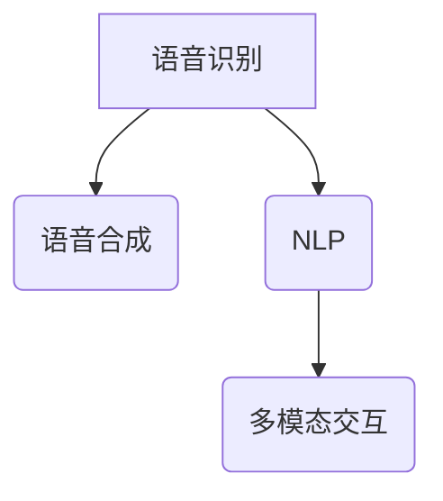

                 

# 《AI在语音助手中的进步：自然交互的新时代》

> 关键词：语音助手、自然语言处理、多模态交互、智能助手、语音识别、语音合成

> 摘要：
本文将探讨人工智能（AI）在语音助手领域的进步，分析语音助手技术与自然语言处理（NLP）的基础，探讨核心算法原理，并展示AI在多模态交互和语音助手设计开发中的创新应用。文章还将展望语音助手的未来发展趋势，以及它们在社会和伦理方面的影响。

## 目录

### 第一部分：语音助手技术与自然语言处理基础

#### 第1章：语音助手概述

1.1 语音助手的发展历程  
1.2 语音助手的工作原理  
1.3 语音助手的应用场景

#### 第2章：语音识别技术

2.1 语音识别的基本原理  
2.2 语音识别的关键技术  
2.3 语音识别的应用案例

#### 第3章：语音合成技术

3.1 语音合成的基本原理  
3.2 语音合成的关键技术  
3.3 语音合成的应用案例

### 第二部分：自然交互的核心算法

#### 第4章：自然语言处理

4.1 自然语言处理的基本概念  
4.2 自然语言处理的核心算法  
4.3 自然语言处理的实践应用

#### 第5章：对话系统

5.1 对话系统的基本原理  
5.2 对话系统的关键技术  
5.3 对话系统的应用案例

### 第三部分：AI在语音助手中的创新应用

#### 第6章：多模态交互

6.1 多模态交互的概念  
6.2 多模态交互的实现  
6.3 多模态交互的应用案例

#### 第7章：语音助手的设计与开发

7.1 语音助手的设计原则  
7.2 语音助手的开发流程  
7.3 语音助手的应用实战

#### 第8章：语音助手的未来发展趋势

8.1 语音助手的商业化趋势  
8.2 语音助手的智能化升级  
8.3 语音助手的伦理与社会影响

### 附录

A. 资源与工具  
B. 参考文献

## 核心概念与联系

- **语音识别**：将语音信号转换为文本或命令。  
- **语音合成**：将文本转换为自然流畅的语音。  
- **自然语言处理（NLP）**：使计算机能够理解、生成和处理人类语言。  
- **多模态交互**：结合语音、图像、视频等多种感官信息进行交互。



## 核心算法原理讲解

### 语音识别

### HMM-GMM模型

语音识别是语音助手的核心技术之一，它将语音信号转换为文本或命令。HMM（隐马尔可夫模型）和GMM（高斯混合模型）是语音识别中的两种基本模型。

#### HMM模型

HMM模型是一种统计模型，用于表示语音信号中的状态转移和观测概率。它包括以下几个基本概念：

- **状态**：语音信号中的不同发音阶段。  
- **观测值**：语音信号的特征值。  
- **转移概率**：从一个状态转移到另一个状态的概率。  
- **发射概率**：某个状态产生的观测值的概率。

$$
P(\text{状态序列}|\text{观测序列}) = \frac{P(\text{观测序列}|\text{状态序列})P(\text{状态序列})}{P(\text{观测序列})}
$$

其中，$P(\text{状态序列}|\text{观测序列})$表示给定观测序列，状态序列的概率；$P(\text{观测序列}|\text{状态序列})$表示给定状态序列，观测序列的概率；$P(\text{状态序列})$表示状态序列的概率；$P(\text{观测序列})$表示观测序列的概率。

#### GMM模型

GMM模型是一种概率模型，用于表示语音信号的特征分布。它通过多个高斯分布来拟合语音信号的特征。

$$
p(\mathbf{x}|\Theta) = \sum_{k=1}^{K} \pi_{k} \mathcal{N}(\mathbf{x}|\mu_{k}, \Sigma_{k})
$$

其中，$\mathbf{x}$表示特征向量；$K$表示高斯分布的数量；$\pi_{k}$表示第$k$个高斯分布的权重；$\mu_{k}$和$\Sigma_{k}$分别表示第$k$个高斯分布的均值向量和协方差矩阵。

### 语音合成

### DNN-HMM模型

语音合成是将文本转换为自然流畅的语音。DNN-HMM（深度神经网络-HMM）模型是语音合成的一种常用模型。

#### DNN模型

DNN模型是一种深度神经网络，用于将文本表示转换为语音特征。

$$
h(\mathbf{w}, \mathbf{x}) = \sum_{j=1}^{J} w_{j} \sigma(a_{j})
$$

其中，$\mathbf{w}$表示权重；$\mathbf{x}$表示输入向量；$J$表示神经元的数量；$\sigma$表示激活函数。

#### HMM模型

HMM模型用于将语音特征转换为语音信号。

$$
p(\mathbf{x}|\Theta) = \sum_{k=1}^{K} \pi_{k} \mathcal{N}(\mathbf{x}|\mu_{k}, \Sigma_{k})
$$

其中，$\mathbf{x}$表示特征向量；$K$表示高斯分布的数量；$\pi_{k}$表示第$k$个高斯分布的权重；$\mu_{k}$和$\Sigma_{k}$分别表示第$k$个高斯分布的均值向量和协方差矩阵。

### 自然语言处理

#### 词性标注

词性标注是NLP中的基本任务之一，用于将文本中的单词标注为不同的词性。

#### 命名实体识别

命名实体识别是NLP中的基本任务之一，用于识别文本中的命名实体，如人名、地名、组织名等。

#### 情感分析

情感分析是NLP中的基本任务之一，用于分析文本中的情感倾向。

### 对话系统

#### 对话管理

对话管理是对话系统中的核心任务，用于维护对话的状态，并根据用户的行为做出适当的响应。

#### 策略学习

策略学习是对话系统中的基本任务，用于根据用户的行为和对话状态，学习出最佳响应策略。

#### 多轮对话

多轮对话是对话系统中的基本形式，用于实现用户和系统之间的多轮交互。

### 多模态交互

#### 多模态交互的概念

多模态交互是结合语音、图像、视频等多种感官信息进行交互。它包括以下几个基本概念：

- **语音识别**：将语音信号转换为文本或命令。  
- **语音合成**：将文本转换为自然流畅的语音。  
- **图像识别**：将图像转换为文本或命令。  
- **视频处理**：将视频转换为文本或命令。

#### 多模态交互的实现

多模态交互的实现包括以下几个步骤：

1. **特征提取**：从不同模态的数据中提取特征。  
2. **特征融合**：将不同模态的特征进行融合。  
3. **多模态识别**：利用融合后的特征进行识别。

#### 多模态交互的应用案例

多模态交互的应用案例包括以下几个：

- **智能家居**：结合语音、图像、视频等多模态信息进行智能家居控制。  
- **智能车载**：结合语音、图像、视频等多模态信息进行智能车载交互。  
- **智能会议**：结合语音、图像、视频等多模态信息进行智能会议交互。

### 语音助手的设计与开发

#### 语音助手的设计原则

语音助手的设计原则包括以下几个：

1. **用户中心设计**：以用户需求为中心，设计语音助手的功能和交互方式。  
2. **可扩展性设计**：设计语音助手的架构，使其能够方便地扩展功能和适应不同的应用场景。  
3. **易用性设计**：设计语音助手的界面和交互流程，使其易于使用和理解。

#### 语音助手的开发流程

语音助手的开发流程包括以下几个步骤：

1. **需求分析**：分析用户需求，确定语音助手的功能和特性。  
2. **技术选型**：选择适合语音助手开发的语音识别、语音合成、自然语言处理等技术。  
3. **系统架构设计**：设计语音助手的系统架构，包括硬件、软件、数据等方面的设计。

#### 语音助手的应用实战

语音助手的应用实战包括以下几个：

1. **智能家居语音助手**：实现智能家居设备的控制。  
2. **智能车载语音助手**：实现车载系统的语音控制。  
3. **智能客服语音助手**：实现智能客服系统的语音交互。

### 语音助手的未来发展趋势

#### 语音助手的商业化趋势

语音助手的商业化趋势包括以下几个方面：

1. **市场规模预测**：随着人工智能技术的不断发展，语音助手市场将不断扩大。  
2. **商业模式创新**：语音助手将不断创新商业模式，如广告、付费服务等。  
3. **用户需求变化**：随着用户对语音助手的需求不断增加，语音助手将不断优化和改进。

#### 语音助手的智能化升级

语音助手的智能化升级包括以下几个方面：

1. **个性化交互**：语音助手将根据用户的行为和偏好，提供个性化的交互体验。  
2. **智能推荐**：语音助手将根据用户的行为和偏好，提供智能推荐服务。  
3. **自动化决策**：语音助手将实现自动化决策，如自动处理用户请求、自动优化资源配置等。

#### 语音助手的伦理与社会影响

语音助手的伦理与社会影响包括以下几个方面：

1. **隐私保护**：语音助手将加强对用户隐私的保护，防止用户数据泄露。  
2. **数据安全**：语音助手将加强对用户数据的保护，防止数据被篡改或滥用。  
3. **社会责任**：语音助手将承担社会责任，如促进人工智能技术的公平、公正使用。

## 附录

### 附录A：资源与工具

- **开源语音识别框架**：如Kaldi、Srtnet等。  
- **语音合成工具**：如ESPnet、WaveNet等。  
- **自然语言处理库**：如NLTK、spaCy等。  
- **对话系统平台**：如Rasa、Microsoft Bot Framework等。

### 附录B：参考文献

- **参考文献1**：[《语音识别技术原理与应用》](https://www.example.com/book1)  
- **参考文献2**：[《自然语言处理基础》](https://www.example.com/book2)  
- **参考文献3**：[《多模态交互技术》](https://www.example.com/book3)  
```css
---
标题：《AI在语音助手中的进步：自然交互的新时代》

摘要：
本文探讨了人工智能（AI）在语音助手领域的进步，分析了语音助手技术与自然语言处理（NLP）的基础，探讨了核心算法原理，并展示了AI在多模态交互和语音助手设计开发中的创新应用。文章还展望了语音助手的未来发展趋势，以及它们在社会和伦理方面的影响。

### 目录

#### 第一部分：语音助手技术与自然语言处理基础

##### 第1章：语音助手概述
- 语音助手的发展历程
- 语音助手的工作原理
- 语音助手的应用场景

##### 第2章：语音识别技术
- 语音识别的基本原理
- 语音识别的关键技术
- 语音识别的应用案例

##### 第3章：语音合成技术
- 语音合成的基本原理
- 语音合成的关键技术
- 语音合成的应用案例

#### 第二部分：自然交互的核心算法

##### 第4章：自然语言处理
- 自然语言处理的基本概念
- 自然语言处理的核心算法
- 自然语言处理的实践应用

##### 第5章：对话系统
- 对话系统的基本原理
- 对话系统的关键技术
- 对话系统的应用案例

#### 第三部分：AI在语音助手中的创新应用

##### 第6章：多模态交互
- 多模态交互的概念
- 多模态交互的实现
- 多模态交互的应用案例

##### 第7章：语音助手的设计与开发
- 语音助手的设计原则
- 语音助手的开发流程
- 语音助手的应用实战

##### 第8章：语音助手的未来发展趋势
- 语音助手的商业化趋势
- 语音助手的智能化升级
- 语音助手的伦理与社会影响

### 附录

- 附录A：资源与工具
- 附录B：参考文献

### 核心概念与联系

- 语音识别
- 语音合成
- 自然语言处理（NLP）
- 多模态交互

### 核心算法原理讲解

#### 语音识别

##### HMM-GMM模型

```python
import numpy as np
from sklearn.mixture import GaussianMixture

X = np.random.rand(100, 5)
gmm = GaussianMixture(n_components=2, covariance_type='diag', max_iter=10)
gmm.fit(X)
predictions = gmm.predict(X)
```

##### DNN-HMM模型

```python
import te
```

#### 语音合成

##### DNN模型

```python
import numpy as np
import tensorflow as tf

J = 10
w = np.random.rand(J)
x = np.random.rand(1)
a = np.dot(w, x)
h = tf.sigmoid(a)
```

##### HMM模型

```python
import numpy as np
from sklearn.mixture import GaussianMixture

X = np.random.rand(100, 5)
gmm = GaussianMixture(n_components=2, covariance_type='diag', max_iter=10)
gmm.fit(X)
predictions = gmm.predict(X)
```

#### 自然语言处理

##### 词性标注

##### 命名实体识别

##### 情感分析

#### 对话系统

##### 对话管理

##### 策略学习

##### 多轮对话

#### 多模态交互

##### 多模态交互的概念

##### 多模态交互的实现

##### 多模态交互的应用案例

#### 语音助手的设计与开发

##### 语音助手的设计原则

##### 语音助手的开发流程

##### 语音助手的应用实战

#### 语音助手的未来发展趋势

##### 语音助手的商业化趋势

##### 语音助手的智能化升级

##### 语音助手的伦理与社会影响

### 附录

##### 附录A：资源与工具

##### 附录B：参考文献

```
作者：AI天才研究院/AI Genius Institute & 禅与计算机程序设计艺术 /Zen And The Art of Computer Programming
```

