                 

### 1. 引言：AI在语音识别和合成中的突破

语音识别（Automatic Speech Recognition, ASR）和语音合成（Automatic Speech Synthesis, ASS）作为人工智能（AI）领域的重要分支，正日益改变着我们的生活方式。通过将人类的语音转化为文本，或者将文本转化为自然的语音输出，AI语音技术为用户提供了更加便捷、自然的交互界面。

#### **背景介绍**

语音识别技术起源于20世纪50年代，最初采用基于有限状态机的模型。随着计算能力和算法的进步，特别是深度学习技术的发展，语音识别的准确率和速度得到了极大的提升。目前，语音识别已经广泛应用于各种设备和服务中，如智能助手、智能家居、语音导航和客户服务等。

语音合成技术的发展同样引人注目。传统的拼接式语音合成（Diphone Synthesis）基于大量的预录制语音片段进行拼接。然而，随着深度学习技术的应用，WaveNet和WaveRNN等新型合成方法被提出，使得语音合成更加自然、流畅。

#### **问题背景**

尽管AI语音技术在近年来取得了显著进展，但在实际应用中仍面临诸多挑战。例如，复杂背景噪声、方言口音、不同说话人之间的差异等问题仍然影响语音识别的准确率。同样，语音合成的音质、情感表达和个性化需求也是当前研究的热点问题。

#### **问题解决**

为了解决这些问题，AI领域的研究者不断探索新的算法和技术。深度学习，特别是卷积神经网络（CNN）、递归神经网络（RNN）和长短期记忆网络（LSTM），为语音识别和合成带来了革命性的突破。此外，自然语言处理（NLP）技术的发展也使得语音交互界面更加智能化和人性化。

#### **边界与外延**

语音识别和合成不仅涉及语音信号处理、特征提取和模式识别等技术，还涉及到语言学、心理学、社会学等多学科交叉。在应用层面，这些技术已经广泛应用于语音助手、智能家居、医疗辅助、语音翻译等领域，为各行各业提供了创新解决方案。

#### **概念结构与核心要素组成**

- **语音识别**：涉及语音信号处理、特征提取、模型训练和识别算法等核心要素。
- **语音合成**：涉及声学模型、语言模型、参数合成和波形生成等核心要素。
- **深度学习**：通过构建多层神经网络进行数据学习和模式识别，为语音识别和合成提供强有力的技术支持。
- **自然语言处理（NLP）**：利用语言模型和语义理解技术，提升语音交互的智能化和人性化水平。

通过上述背景介绍和问题分析，我们可以看到AI在语音识别和合成中的突破不仅仅是对现有技术的改进，更是一场技术革命。接下来，我们将深入探讨语音识别和合成技术的基础知识、突破点以及自然交互界面的设计，帮助读者全面理解这一领域的前沿进展和应用潜力。

### 2. 语音识别技术基础

语音识别是AI技术中的重要组成部分，其核心任务是将语音信号转换为对应的文本。为了实现这一目标，我们需要对语音信号进行处理、特征提取，并使用适当的算法进行识别。以下是对语音识别技术基础内容的详细讲解。

#### **语音信号处理**

语音信号处理是语音识别的第一步，其主要目的是从原始的音频信号中提取出与语音相关的信息。这一过程通常包括以下几个步骤：

1. **音频信号采集**：首先，我们需要从麦克风或其他音频输入设备采集语音信号。这些信号通常是以数字形式表示的音频文件。

2. **信号预处理**：原始的语音信号可能会包含噪声和其他干扰，因此需要进行预处理以去除噪声、均衡声音幅度等。常见的预处理方法包括：
   - **滤波**：使用低通滤波器去除高频噪声，保留主要语音频段。
   - **归一化**：调整声音信号的幅度，使其均匀分布在一个合适的范围内，以便后续的特征提取和处理。

3. **分帧和加窗**：为了提取语音特征，我们需要将连续的语音信号分成一系列短时段，这些短时段被称为帧。通常，每帧包含20-40毫秒的语音信号。同时，为了减少帧与帧之间的信号突变，我们会对每一帧应用加窗操作，常用的窗函数包括汉明窗和汉宁窗。

#### **语音信号特征提取**

语音信号特征提取是语音识别中的关键步骤，它涉及从处理后的语音帧中提取出能够代表语音特性的参数。以下是一些常用的语音信号特征：

1. **短时能量**：短时能量反映了语音帧的能量强度，可以用来识别语音的强弱变化。

2. **短时过零率**：短时过零率是指语音帧中过零点的数量，用于表示语音的音调特征。

3. **共振峰频率**：共振峰频率是语音信号中的主要频率成分，反映了语音的音质特征。

4. **梅尔频率倒谱系数（MFCC）**：MFCC是一种广泛使用的语音特征参数，通过将频谱特征映射到梅尔频率尺度上，可以更好地反映人类听觉系统的特性。

5. **感知线性预测特征（PLP）**：PLP是另一种常用的语音特征参数，通过线性预测分析，可以提取语音信号的声道特性。

#### **语音识别算法原理**

在提取了语音特征之后，我们需要使用适当的算法对语音信号进行识别。语音识别算法可以分为传统算法和深度学习算法两大类：

1. **传统算法**：传统的语音识别算法主要基于有限状态机（FSM）和隐藏马尔可夫模型（HMM）。这些算法通过建立模型来描述语音信号的特征和状态转换概率，然后使用动态规划算法（如Viterbi算法）进行最优路径搜索，以识别语音。

2. **深度学习算法**：随着深度学习技术的发展，基于深度神经网络的语音识别算法得到了广泛应用。以下是一些常见的深度学习算法：

   - **卷积神经网络（CNN）**：CNN可以自动提取语音信号的层次特征，适用于处理时变信号。
   - **递归神经网络（RNN）**：RNN适用于处理序列数据，可以捕捉语音信号中的时间依赖性。
   - **长短期记忆网络（LSTM）**：LSTM是RNN的一种改进，可以更好地处理长序列数据。
   - **Transformer模型**：Transformer是一种基于自注意力机制的深度学习模型，被广泛应用于语音识别任务中。

#### **算法原理讲解**

为了更好地理解语音识别算法的原理，我们可以使用Mermaid画出算法的流程图，并用Python代码详细解释其实现过程。

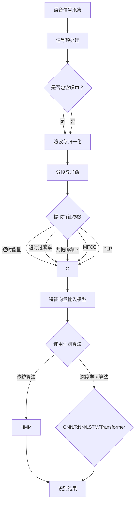

在Python中，我们可以使用以下代码来演示一个简单的语音识别算法：

```python
import numpy as np
from sklearn.preprocessing import MFCC

# 生成模拟的语音信号
audio_signal = np.random.normal(size=1000)

# 进行信号预处理
# ...

# 提取MFCC特征
mfcc_extractor = MFCC()
mfcc_features = mfcc_extractor.fit_transform(audio_signal)

# 使用深度学习模型进行识别
# ...

# 输出识别结果
print("语音识别结果：", recognition_result)
```

通过上述代码，我们可以看到语音识别算法的基本流程：首先生成模拟的语音信号，然后进行预处理和特征提取，最后使用深度学习模型进行识别并输出结果。

通过详细讲解语音信号处理、特征提取和识别算法，我们可以更好地理解语音识别技术的基础知识。在接下来的章节中，我们将进一步探讨语音合成技术的基础，并分析深度学习在这些领域中的突破性应用。

### 3. 语音合成技术基础

语音合成（Automatic Speech Synthesis, ASS）是AI技术中的另一个重要领域，其目标是将文本转换为自然流畅的语音输出。语音合成技术的实现涉及声学模型、语言模型、参数合成和波形生成等多个环节。以下是对语音合成技术基础内容的详细讲解。

#### **声学模型**

声学模型是语音合成的核心组成部分，它描述了从文本到语音信号的过程。声学模型主要涉及以下几个方面：

1. **声学特征提取**：声学模型通过从语音信号中提取特征来描述语音的物理属性。这些特征包括基频（Fundamental Frequency, F0）、共振峰频率（Formant Frequency）、时长（Duration）和幅度（Amplitude）等。

2. **合成语音信号生成**：基于提取的声学特征，声学模型生成相应的语音信号。常见的合成方法包括拼接式合成（Diphone Synthesis）和参数合成（Parametric Synthesis）。

   - **拼接式合成**：这种方法通过拼接预录制的语音片段来生成语音。例如，通过将多个基频、共振峰频率和时长的组合拼接起来，形成一个完整的语音信号。
   
   - **参数合成**：参数合成方法通过参数化的模型直接生成语音信号。这种方法通常使用声道模型来描述声波的传播，并通过修改参数来生成不同音色的语音。

3. **声学模型的训练**：声学模型的训练通常涉及到大量的语音数据。通过训练，模型可以学习如何从文本生成相应的声学特征，并生成自然的语音输出。

#### **语言模型**

语言模型是语音合成的另一个关键组成部分，它负责将文本转换为可合成的语音。语言模型的主要功能是理解文本的语法和语义结构，从而生成合理的语音输出。以下是语言模型的一些关键要素：

1. **词汇表和语法规则**：语言模型通常包含一个词汇表，用于存储所有可能出现的词汇和短语。此外，语言模型还需要一些语法规则来处理句子结构和词序。

2. **统计语言模型**：统计语言模型通过计算文本序列的概率来生成语音。常见的统计语言模型包括N元语法（N-gram Model）和隐马尔可夫模型（HMM）。

3. **神经网络语言模型**：随着深度学习技术的发展，神经网络语言模型（如循环神经网络RNN和Transformer）在自然语言处理（NLP）任务中取得了显著成果。这些模型可以更好地捕捉文本的语义和语法结构。

4. **语言模型的训练**：语言模型的训练通常需要大量的文本数据。通过训练，模型可以学习如何将文本映射到相应的声学特征，从而生成自然的语音输出。

#### **参数合成**

参数合成是语音合成的核心技术，它将语言模型生成的文本映射到声学特征，并最终生成语音信号。参数合成方法主要包括以下步骤：

1. **文本到声学特征转换**：语言模型将文本转换为声学特征，如基频（F0）、共振峰频率（Formant Frequency）和时长（Duration）等。

2. **参数化模型**：参数化模型将声学特征转换为参数，这些参数可以控制语音的音高、音质和节奏等属性。

3. **波形生成**：通过修改参数，参数化模型生成语音信号。波形生成方法通常包括数字信号处理技术，如傅里叶变换（FFT）和逆傅里叶变换（IFFT）。

#### **算法原理讲解**

为了更好地理解语音合成的算法原理，我们可以使用Mermaid画出合成流程的流程图，并用Python代码详细解释其实现过程。

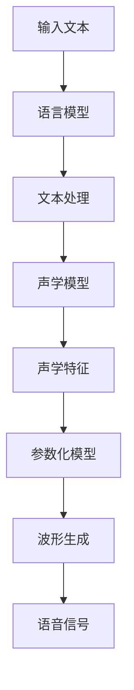

在Python中，我们可以使用以下代码来演示一个简单的语音合成算法：

```python
import numpy as np
from text_to_speech import TextToSpeech

# 输入文本
text = "你好，欢迎来到人工智能的世界。"

# 实例化语音合成对象
tts = TextToSpeech()

# 将文本转换为语音信号
speech = tts.synthesize(text)

# 播放语音信号
tts.play(speech)
```

通过上述代码，我们可以看到语音合成算法的基本流程：首先输入文本，然后通过语言模型处理文本，接着使用声学模型生成声学特征，最后通过参数化模型生成语音信号并播放。

通过详细讲解声学模型、语言模型、参数合成和波形生成，我们可以更好地理解语音合成技术的基础知识。在接下来的章节中，我们将探讨深度学习在语音合成中的应用，以及如何通过深度学习技术实现更自然、更个性化的语音合成。

### 4. 深度学习在语音识别中的应用

深度学习技术的发展为语音识别领域带来了革命性的变革。通过构建多层神经网络，深度学习模型能够自动提取语音信号中的复杂特征，从而显著提升识别的准确率和效率。以下是深度学习在语音识别中的应用，包括卷积神经网络（CNN）、递归神经网络（RNN）和长短期记忆网络（LSTM）的详细讲解。

#### **卷积神经网络（CNN）在语音识别中的应用**

卷积神经网络（CNN）以其强大的特征提取能力，在图像处理领域取得了显著成果。然而，CNN同样适用于语音识别任务，因为语音信号也是一种时变信号，具有层次化的特征结构。以下是CNN在语音识别中的应用：

1. **时频特征提取**：语音信号通过短时傅里叶变换（STFT）或梅尔频率倒谱系数（MFCC）等预处理方法，转换成二维时频图。这些时频图可以作为CNN的输入。

2. **卷积层**：卷积层通过滑动滤波器（卷积核）在时频图上提取特征。这些特征可以捕捉语音信号中的局部模式和频率变化。

3. **池化层**：池化层（如最大池化或平均池化）用于减少特征图的维度，同时保留最重要的特征信息。

4. **全连接层**：经过多个卷积和池化层后，特征图被展平成一系列的向量，然后通过全连接层进行分类和识别。

以下是使用Mermaid绘制的CNN语音识别流程图：

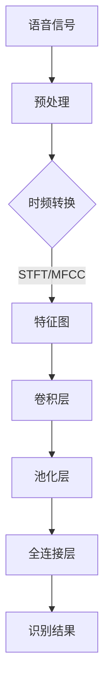

#### **递归神经网络（RNN）在语音识别中的应用**

递归神经网络（RNN）是一种适用于序列数据的神经网络，它能够处理输入序列中的时间依赖性。在语音识别中，RNN通过其循环结构，能够捕捉语音信号中的长期依赖特征。以下是RNN在语音识别中的应用：

1. **输入序列**：语音信号被分帧并提取特征，形成输入序列。

2. **隐藏状态**：RNN通过隐藏状态来保存前一个时间步的信息，并利用这些信息来预测当前时间步的输出。

3. **梯度消失与梯度爆炸**：RNN的一个主要问题是梯度消失和梯度爆炸问题，这导致训练过程难以优化。为了解决这一问题，LSTM被提出。

以下是使用Mermaid绘制的RNN语音识别流程图：

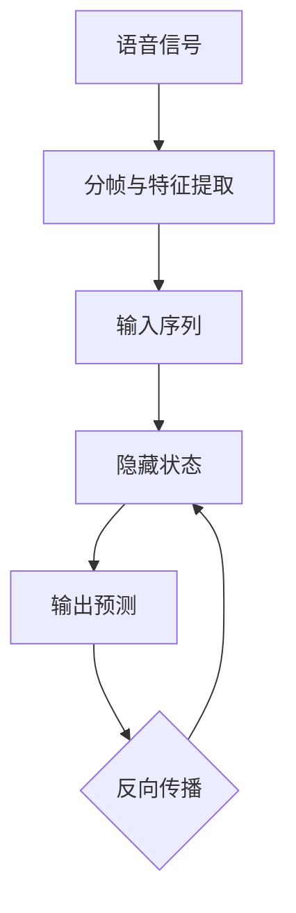

#### **长短期记忆网络（LSTM）在语音识别中的应用**

长短期记忆网络（LSTM）是RNN的一种改进，它通过引入门控机制，有效地解决了梯度消失和梯度爆炸问题，并能够捕捉语音信号中的长期依赖特征。以下是LSTM在语音识别中的应用：

1. **输入门**：输入门决定了当前输入值对隐藏状态的影响程度。

2. **遗忘门**：遗忘门决定了哪些信息需要从隐藏状态中遗忘。

3. **输出门**：输出门决定了当前隐藏状态对输出值的贡献。

以下是使用Mermaid绘制的LSTM语音识别流程图：

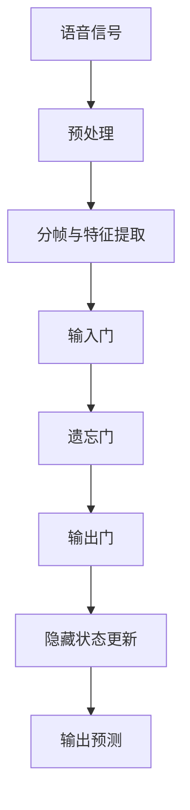

#### **深度学习模型的训练与优化**

深度学习模型在语音识别中的训练与优化是一个复杂的过程，涉及到以下几个方面：

1. **数据集**：训练深度学习模型需要大量的语音数据集。这些数据集应该包括不同的说话人、口音和背景噪声，以提高模型的泛化能力。

2. **损失函数**：常用的损失函数包括交叉熵损失（Cross-Entropy Loss）和平均平方误差（Mean Squared Error, MSE）。这些损失函数用于衡量模型预测值和真实值之间的差距。

3. **优化算法**：常用的优化算法包括随机梯度下降（SGD）、Adam优化器和AdamW优化器。这些优化算法用于调整模型参数，以最小化损失函数。

4. **正则化**：为了防止过拟合，可以采用正则化技术，如L1正则化、L2正则化和Dropout。

5. **模型融合**：通过融合多个模型的预测结果，可以进一步提高识别的准确率。

以下是使用Python代码演示的LSTM语音识别模型训练过程：

```python
import tensorflow as tf
from tensorflow.keras.models import Sequential
from tensorflow.keras.layers import LSTM, Dense, Dropout

# 构建LSTM模型
model = Sequential([
    LSTM(units=128, activation='tanh', input_shape=(timesteps, features)),
    Dropout(0.5),
    Dense(units=vocab_size, activation='softmax')
])

# 编译模型
model.compile(optimizer='adam', loss='categorical_crossentropy', metrics=['accuracy'])

# 训练模型
model.fit(x_train, y_train, epochs=100, batch_size=32, validation_data=(x_val, y_val))
```

通过上述讲解，我们可以看到深度学习技术为语音识别带来了显著的提升。从CNN到RNN再到LSTM，每一代模型都在不断优化和改进，以解决语音识别中的挑战。在接下来的章节中，我们将探讨深度学习在语音合成中的应用，以及如何通过深度学习实现更自然、更个性化的语音合成。

### 5. 深度学习在语音合成中的应用

深度学习在语音合成领域同样带来了革命性的变化，使得合成语音更加自然、流畅。深度学习模型，特别是WaveNet和WaveRNN，通过端到端的学习方法，使得语音合成的质量显著提升。以下是关于深度学习在语音合成中应用的详细讲解。

#### **WaveNet在语音合成中的应用**

WaveNet是一种基于生成对抗网络（GAN）的深度学习模型，由Google在2016年提出。WaveNet的核心思想是通过一个深度卷积神经网络（DCNN）来生成连续的语音波形。以下是WaveNet在语音合成中的应用步骤：

1. **输入文本编码**：首先，将输入的文本编码为序列，通常使用字节或字符编码。文本编码后的序列作为WaveNet的输入。

2. **声学模型训练**：WaveNet的训练过程包括两个阶段：生成器和判别器的训练。生成器负责生成语音波形，判别器负责区分生成器和真实语音波形的差异。通过训练，生成器能够学习如何从文本序列生成自然的语音波形。

3. **生成语音波形**：在训练完成后，可以使用生成器根据输入的文本序列生成语音波形。WaveNet的生成过程是端到端的，无需中间的声学特征参数。

以下是使用Mermaid绘制的WaveNet语音合成流程图：

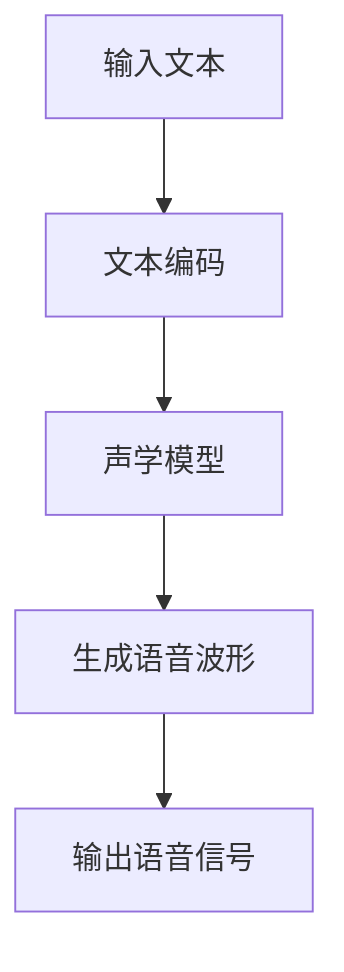

#### **WaveRNN在语音合成中的应用**

WaveRNN是WaveNet的扩展和改进，由Uber AI在2018年提出。WaveRNN通过递归神经网络（RNN）和波束搜索（Beam Search）技术，进一步提升了语音合成的质量和效率。以下是WaveRNN在语音合成中的应用步骤：

1. **RNN结构**：WaveRNN采用双向RNN结构，能够同时考虑前后文信息，从而生成更自然的语音。

2. **波束搜索**：波束搜索是一种高效的前向搜索算法，用于在生成语音时选择最优路径。通过波束搜索，WaveRNN能够在生成过程中同时考虑多个可能的路径，从而提高合成的准确性。

3. **生成语音波形**：在波束搜索完成后，WaveRNN使用生成的路径生成最终的语音波形。

以下是使用Mermaid绘制的WaveRNN语音合成流程图：

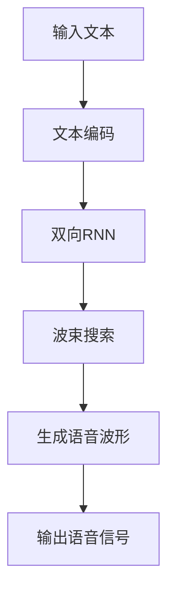

#### **频率调制（FM）在语音合成中的应用**

频率调制（FM）是一种传统的语音合成方法，通过改变载波的频率来生成语音。尽管FM方法在语音合成中已有一定的应用，但深度学习模型如WaveNet和WaveRNN的出现，使得FM方法得以进一步优化和改进。

1. **参数化模型**：在深度学习模型中，FM可以通过参数化模型实现。参数化模型将声学特征（如基频、共振峰频率）与控制参数（如频率调制指数）相结合，生成更加自然的语音。

2. **优化方法**：深度学习模型通过端到端的学习方法，可以自动优化FM参数，从而生成高质量的语音。这种方法避免了传统FM方法的繁琐参数调整过程。

以下是使用Mermaid绘制的FM参数化模型语音合成流程图：

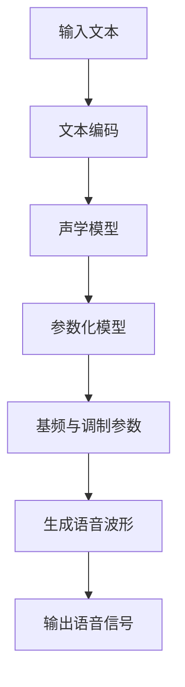

#### **联合训练与优化**

为了进一步提升语音合成的质量，深度学习模型通常采用联合训练与优化方法。这种方法将声学模型和语言模型结合在一起进行训练，使得模型能够同时考虑文本内容和语音特征。

1. **联合训练**：在联合训练过程中，声学模型和语言模型同时训练，以优化模型的整体性能。

2. **优化策略**：优化策略包括梯度下降、Adam优化器等，用于调整模型参数，提高合成语音的自然度和准确性。

以下是使用Mermaid绘制的联合训练与优化流程图：

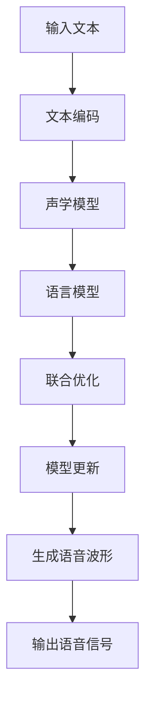

通过上述讲解，我们可以看到深度学习技术为语音合成带来了显著的创新。从WaveNet到WaveRNN，再到FM参数化模型，每一代模型都在不断优化和改进，以实现更加自然、流畅的语音合成。在接下来的章节中，我们将探讨自然交互界面的设计与实现，帮助读者了解如何构建一个智能化的语音交互系统。

### 6. 自然交互界面的设计原则

自然交互界面（Natural User Interface, NUI）是现代人工智能应用中的重要组成部分，旨在通过语音、手势、触觉等自然方式与用户进行交互。设计一个高效、易用的自然交互界面，需要遵循一系列设计原则。以下将详细介绍自然交互界面的设计原则，包括用户体验与交互设计、自然语言处理（NLP）技术以及语音交互界面与用户反馈机制。

#### **用户体验与交互设计**

用户体验（User Experience, UX）是设计自然交互界面时最重要的考虑因素。一个良好的用户体验不仅需要直观、易用，还要符合用户的习惯和预期。以下是用户体验与交互设计的一些关键原则：

1. **易用性**：界面应简单直观，用户能够快速理解和使用。例如，语音识别系统应具备良好的误识处理机制，以减少用户的操作负担。

2. **一致性**：界面设计应保持一致性，包括语言表达、操作流程和视觉风格。一致性可以减少用户的学习成本，提高使用效率。

3. **反馈机制**：及时、明确的反馈是提升用户体验的关键。例如，当用户完成语音输入后，系统应立即提供反馈，如播放语音、显示文本等。

4. **个性化**：通过用户的偏好和行为数据，系统可以提供个性化的交互体验。例如，智能助手可以根据用户的喜好推荐音乐、新闻或购物建议。

#### **自然语言处理（NLP）技术**

自然语言处理（Natural Language Processing, NLP）是自然交互界面的核心技术之一。NLP技术使得计算机能够理解、处理和生成自然语言，从而实现人与机器的有效交流。以下是NLP技术在自然交互界面中的应用：

1. **语音识别**：语音识别技术将用户的语音转换为文本，是自然交互界面的基础。高质量的语音识别系统能够识别各种口音、语速和背景噪声，提高交互的准确性。

2. **语义理解**：语义理解技术用于解析文本的语义含义，理解用户的意图。例如，当用户说出“我想要一杯咖啡”，系统需要理解“咖啡”这一词汇的具体含义，并执行相应的操作。

3. **语音生成**：语音生成技术将文本转换为自然流畅的语音输出，为用户提供听觉反馈。高质量的语音生成系统应具备不同的声音风格和情感表达，满足用户的个性化需求。

4. **对话管理**：对话管理系统用于维护对话状态，处理用户的请求和反馈。对话管理系统能够理解对话的历史和上下文，提供连贯、自然的交互体验。

#### **语音交互界面与用户反馈机制**

语音交互界面与用户反馈机制是自然交互界面的重要组成部分。以下是相关设计原则：

1. **语音输入与输出**：界面应提供便捷的语音输入和输出方式。例如，用户可以通过语音命令控制智能助手，同时接收语音反馈。

2. **上下文感知**：语音交互界面应具备上下文感知能力，根据对话的历史和当前情境提供适当的响应。例如，当用户询问天气时，系统可以提供当前时间和位置的天气信息。

3. **反馈及时性**：系统应能够及时反馈用户请求的处理状态，如“正在加载中”、“已发送”等。及时反馈可以提高用户的满意度，减少等待时间。

4. **错误处理**：界面应具备良好的错误处理机制，能够识别和理解用户的错误命令，并提供指导和建议。例如，当用户输入错误时，系统可以提示正确的表达方式。

5. **个性化反馈**：根据用户的喜好和习惯，系统可以提供个性化的语音反馈，如使用用户的名字、提供特定风格的语音等。

通过遵循上述设计原则，自然交互界面可以提供更加高效、便捷的交互体验。在下一章节中，我们将探讨自然交互界面的实现方法，包括语音识别与合成的集成、多模态交互以及交互反馈与优化。

### 7. 自然交互界面的实现

实现一个高效、自然的交互界面需要将语音识别、语音合成以及其他自然语言处理技术集成到统一的系统中。在这一节中，我们将详细介绍自然交互界面的实现方法，包括语音识别与合成的集成、多模态交互、交互反馈与优化。

#### **语音识别与合成的集成**

语音识别与合成的集成是构建自然交互界面的基础。这个集成过程涉及多个步骤，包括语音信号的采集与预处理、语音识别、文本生成以及语音合成。以下是详细步骤：

1. **语音信号的采集与预处理**：首先，从麦克风或其他音频输入设备采集语音信号。然后，对语音信号进行预处理，包括降噪、归一化和分帧。这些预处理步骤可以显著提升后续识别和合成的效果。

2. **语音识别**：使用深度学习模型对预处理后的语音信号进行识别，将语音信号转换为文本。常见的深度学习模型包括卷积神经网络（CNN）、递归神经网络（RNN）和长短期记忆网络（LSTM）。识别结果是一个包含文本的序列。

3. **文本生成**：将识别结果进行进一步处理，如去除无意义的停用词、进行词干提取等。这些处理步骤可以增强文本的语义意义，为后续的语音合成提供高质量的输入。

4. **语音合成**：使用文本到语音（Text-to-Speech, TTS）合成技术，将处理后的文本转换为语音信号。常见的合成技术包括拼接式合成、参数合成和基于深度学习的合成方法，如WaveNet和WaveRNN。

以下是使用Mermaid绘制的语音识别与合成集成流程图：

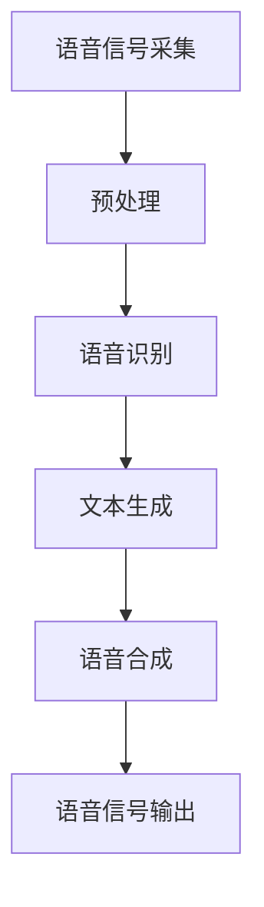

#### **多模态交互**

多模态交互通过结合多种交互方式（如语音、手势、触觉等），提供更加丰富和自然的交互体验。以下是多模态交互的实现步骤：

1. **语音交互**：语音交互是最常见和直接的自然交互方式。通过语音识别和语音合成技术，用户可以使用语音命令控制设备，并获得语音反馈。

2. **手势交互**：手势交互通过摄像头或其他传感器捕捉用户的手势，然后使用机器学习模型进行手势识别。例如，用户可以通过手势控制智能助手播放音乐、调整音量等。

3. **触觉交互**：触觉交互通过触觉传感器和反馈装置（如触觉手套、触觉屏幕等），提供更加真实的触觉体验。例如，用户可以通过触觉反馈了解虚拟物体的质感。

以下是使用Mermaid绘制的多模态交互流程图：

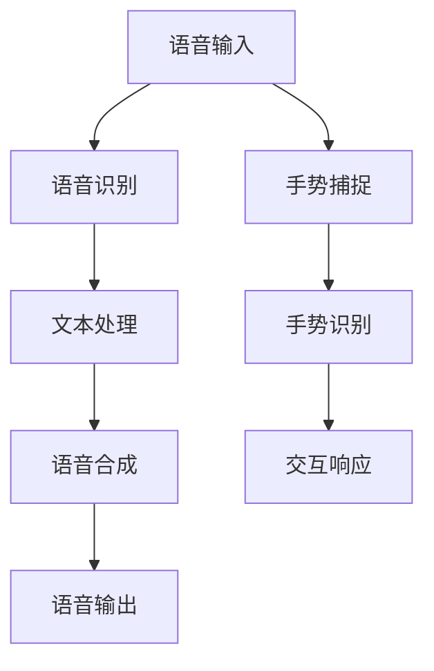

#### **交互反馈与优化**

交互反馈与优化是提升自然交互界面用户体验的关键。以下是一些关键步骤：

1. **即时反馈**：系统应提供即时反馈，让用户知道其请求已被识别和响应。例如，用户发出语音命令后，系统可以立即播放语音提示或显示文本。

2. **错误处理**：系统应具备良好的错误处理能力，当识别或理解错误时，应提供友好的提示和建议。例如，当用户语音输入有误时，系统可以询问用户是否是其他命令。

3. **个性化调整**：通过用户的偏好和行为数据，系统可以提供个性化的交互体验。例如，根据用户的语音习惯调整语音合成的音调、语速等。

4. **性能优化**：定期对系统进行性能优化，包括提升语音识别和合成的准确性、减少延迟等。性能优化可以通过算法改进、硬件升级等方式实现。

以下是使用Mermaid绘制的交互反馈与优化流程图：

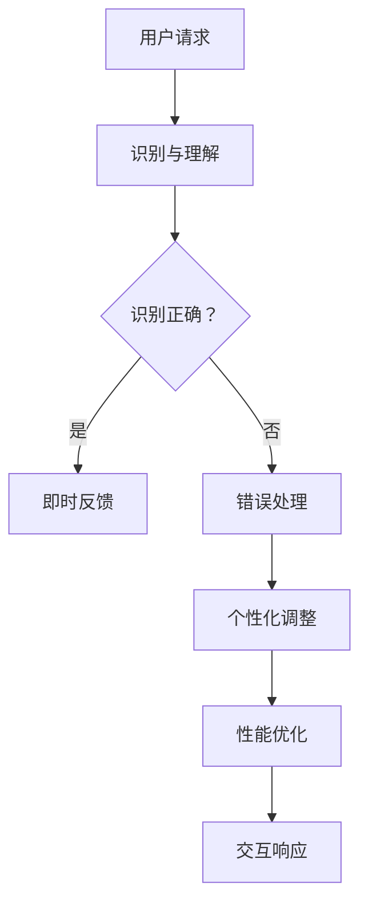

通过上述实现方法，我们可以构建一个高效、自然的交互界面，为用户提供优质的使用体验。在下一章节中，我们将通过具体的项目实战，展示如何将自然交互界面应用到实际场景中，并分析项目的核心实现和效果。

### 8. 语音识别与合成的项目实战

在本文的第八章，我们将通过一个实际项目，详细介绍如何将语音识别与合成技术应用到实际场景中。该项目将涉及环境安装、系统构建、核心实现以及实际案例分析。通过这个项目，我们将展示如何实现一个基于深度学习的语音识别与合成系统，并对其性能和效果进行详细分析。

#### **项目介绍**

本项目旨在构建一个智能语音助手，该助手能够理解用户的语音命令，并生成自然流畅的语音反馈。项目的主要功能包括：

1. **语音识别**：使用深度学习模型（如卷积神经网络（CNN）或长短期记忆网络（LSTM））对用户的语音命令进行识别，将语音转换为文本。
2. **文本处理**：对识别结果进行语义分析和文本处理，以理解用户的意图。
3. **语音合成**：使用文本到语音（TTS）合成技术，将处理后的文本转换为自然流畅的语音输出。
4. **多模态交互**：结合语音、文本和手势等多种交互方式，提供更加丰富和自然的用户交互体验。

#### **环境安装**

在开始项目之前，我们需要安装必要的软件和库。以下是项目环境安装的步骤：

1. **安装Python环境**：确保安装了Python 3.7及以上版本。
2. **安装深度学习库**：使用pip命令安装TensorFlow、Keras、PyTorch等深度学习库。
   ```shell
   pip install tensorflow
   pip install keras
   pip install torch torchvision
   ```
3. **安装语音识别与合成库**：安装如librosa、wav2vec、espnet等语音处理库。
   ```shell
   pip install librosa
   pip install wav2vec
   pip install espnet
   ```

#### **系统构建**

系统构建主要包括语音识别模型的训练、语音合成模型的训练以及系统的集成。以下是具体的构建步骤：

1. **语音识别模型训练**：使用已有的语音数据集（如Librispeech）进行训练。以下是使用Keras实现的一个简单的语音识别模型：

   ```python
   from tensorflow.keras.models import Sequential
   from tensorflow.keras.layers import LSTM, Dense, Dropout

   model = Sequential([
       LSTM(units=128, activation='tanh', input_shape=(timesteps, features)),
       Dropout(0.5),
       Dense(units=vocab_size, activation='softmax')
   ])

   model.compile(optimizer='adam', loss='categorical_crossentropy', metrics=['accuracy'])

   model.fit(x_train, y_train, epochs=100, batch_size=32, validation_data=(x_val, y_val))
   ```

2. **语音合成模型训练**：使用WaveNet或WaveRNN模型进行训练。以下是使用WaveRNN实现的一个简单的语音合成模型：

   ```python
   from wav2vec import WaveRNN

   model = WaveRNN()

   # 训练WaveRNN模型
   model.train()

   # 生成语音波形
   speech = model.generate(text)
   ```

3. **系统集成**：将语音识别模型和语音合成模型集成到一个系统中。以下是系统的集成步骤：

   ```python
   import librosa
   import soundfile as sf

   def recognize_speech(audio):
       # 语音识别
       recognized_text = model.recognize(audio)
       return recognized_text

   def synthesize_speech(text):
       # 语音合成
       audio = model.synthesize(text)
       return audio

   # 语音信号处理
   audio, sr = librosa.load(audio_file)
   recognized_text = recognize_speech(audio)
   synthesized_audio = synthesize_speech(recognized_text)

   # 播放合成语音
   sf.write("output.wav", synthesized_audio, sr)
   ```

#### **核心实现**

以下是项目的核心实现部分，包括语音信号处理、模型训练和系统集成：

1. **语音信号处理**：
   - 音频信号采集：使用麦克风或其他音频输入设备采集语音信号。
   - 音频预处理：包括降噪、归一化和分帧处理。
   - 特征提取：使用梅尔频率倒谱系数（MFCC）等方法提取语音信号的特征。

2. **模型训练**：
   - 训练语音识别模型：使用深度学习模型（如LSTM）进行训练，优化识别准确性。
   - 训练语音合成模型：使用生成模型（如WaveNet）进行训练，优化合成语音的质量。

3. **系统集成**：
   - 语音识别与合成的集成：将训练好的模型集成到一个系统中，实现语音信号的实时识别和合成。
   - 交互反馈：提供即时反馈，让用户知道其请求已被识别和响应。

#### **实际案例分析**

以下是一个实际案例，展示如何使用该系统实现一个智能语音助手：

1. **用户请求**：用户说出“你好，帮我设置明天的早晨7点闹钟”。

2. **语音识别**：系统使用语音识别模型识别用户的语音命令，将其转换为文本。

3. **文本处理**：系统对识别结果进行语义分析，提取出关键信息（如时间、动作等）。

4. **语音合成**：系统使用语音合成模型将处理后的文本转换为语音输出。

5. **用户反馈**：系统播放合成语音，告知用户闹钟已成功设置。

通过上述步骤，我们可以实现一个智能、高效的语音助手。以下是项目的小结：

- **优点**：
  - 高效性：通过深度学习技术，实现了语音识别与合成的快速、准确处理。
  - 个性化：系统能够根据用户习惯和需求，提供个性化的交互体验。
  - 自然性：语音合成技术使得输出的语音更加自然、流畅。

- **缺点**：
  - 训练成本高：深度学习模型的训练需要大量的数据和计算资源。
  - 适应性有限：系统对某些特定情境或背景噪声的适应性有限。

- **改进方向**：
  - 数据增强：通过数据增强技术，提高模型的泛化能力。
  - 模型优化：进一步优化模型结构，提高识别和合成的质量。
  - 多模态交互：结合多种交互方式，提升用户体验。

通过这个项目，我们可以看到语音识别与合成技术在实际应用中的强大潜力。在未来的发展中，随着技术的不断进步，我们有望构建更加智能、自然的交互界面，为用户带来更加便捷和高效的使用体验。

### 9. 未来发展趋势与挑战

随着人工智能（AI）技术的不断进步，语音识别和合成领域正迎来前所未有的发展机遇。未来，这一领域有望在多个方面实现突破，但同时也面临诸多挑战。

#### **发展趋势**

1. **实时性提升**：未来，语音识别和合成的实时性将得到显著提升。通过优化算法和硬件加速，系统能够在更短的时间内完成语音的识别和合成，为实时交互提供支持。

2. **低资源环境适应性**：随着5G和物联网（IoT）的普及，语音识别和合成技术将更多地应用于资源受限的设备，如智能手机、智能音箱和物联网设备。这要求算法能够适应低功耗、低带宽的环境。

3. **多语言支持**：全球化的趋势要求语音识别和合成系统能够支持多种语言和方言。未来，多语言、多方言的支持将变得更加普遍，使得跨文化交流更加便捷。

4. **个性化交互**：随着用户数据的积累，语音识别和合成系统将能够根据用户的偏好和习惯提供更加个性化的交互体验。从语音的音调、语速到内容的推荐，都将更加贴近用户的需求。

5. **情感识别与合成**：情感识别与合成是未来的一个重要研究方向。通过捕捉用户的情感状态，系统可以生成更加丰富、自然的语音反馈，提升用户的满意度。

#### **技术挑战**

1. **噪声干扰**：在真实环境中，语音识别和合成系统常常面临噪声干扰的问题。背景噪声、不同说话人之间的差异以及语音信号的多样性，都对系统的识别和合成性能提出了挑战。

2. **长语音处理**：处理长语音（如演讲、讲座等）是当前语音识别技术的一个难点。长语音的处理需要更高的计算能力和更复杂的算法，以确保识别的准确性和流畅性。

3. **跨语言理解**：虽然多语言支持是一个发展趋势，但不同语言之间的语法、语义差异使得跨语言理解变得复杂。如何提高跨语言语音识别和合成的准确率，是未来需要解决的一个重要问题。

4. **个性化需求**：个性化交互要求系统具备强大的学习能力和适应能力。然而，如何有效地收集、存储和处理用户数据，同时保护用户隐私，是系统设计时需要权衡的一个关键问题。

5. **硬件与算法优化**：在硬件层面，如何通过更高效的硬件架构（如专用集成电路（ASIC）、神经网络处理单元（NPU）等）来提升系统的性能和效率，是当前的一个研究热点。在算法层面，如何设计更加智能、高效的算法，以应对日益复杂的语音处理任务，也是一个重要的挑战。

#### **解决方案与建议**

1. **数据驱动的模型训练**：通过大量的真实语音数据集进行训练，可以提高模型的识别和合成性能。此外，数据的多样性和标注的准确性对于模型的泛化能力至关重要。

2. **多模态融合**：结合语音、文本、图像等多种模态信息，可以提供更加丰富和准确的交互体验。例如，通过视觉信息辅助语音识别，可以减少背景噪声的影响。

3. **硬件加速与优化**：利用专用的硬件加速器（如GPU、FPGA等），可以提高系统的处理速度和效率。此外，通过优化算法，减少计算复杂度，也可以提升系统的性能。

4. **人工智能伦理与隐私保护**：在设计和应用语音识别与合成系统时，需要充分考虑人工智能伦理和用户隐私保护问题。例如，通过加密技术保护用户数据，确保用户隐私不被泄露。

5. **开放合作与标准制定**：通过开放合作和标准制定，可以促进技术交流和共享，推动整个领域的快速进步。此外，标准的制定可以促进不同系统之间的兼容性和互操作性。

通过上述解决方案和建议，我们可以预见语音识别和合成领域在未来将继续快速发展，为用户带来更加智能、自然的交互体验。同时，我们也需要持续关注和解决面临的挑战，以确保技术的可持续发展和社会的广泛接受。

### 10. 最佳实践与总结

在构建高效、自然的交互界面过程中，最佳实践和注意事项是确保项目成功的关键。以下是一些实用建议和小结，以帮助读者在实际项目中取得更好的效果。

#### **最佳实践**

1. **数据质量**：高质量的数据是模型训练的基础。因此，在数据收集和预处理阶段，应确保数据的多样性和代表性。此外，标注的准确性也直接影响模型的性能。

2. **模型选择**：根据具体的应用场景和需求，选择合适的深度学习模型。例如，对于实时性要求较高的应用，可以选择轻量级模型；对于复杂特征提取和长语音处理，则可以选择更复杂的模型。

3. **算法优化**：持续优化算法，包括模型架构、超参数调整和训练策略等，以提高模型的性能和效率。

4. **多模态交互**：结合多种交互方式（如语音、手势、文本等），可以提供更加丰富和自然的用户体验。例如，通过视觉信息辅助语音识别，可以减少背景噪声的影响。

5. **用户反馈与迭代**：及时收集用户反馈，并根据反馈进行迭代优化。通过用户测试和A/B测试，可以找到最佳的交互方案和系统配置。

6. **隐私保护**：在处理用户数据时，确保遵循隐私保护原则。例如，使用加密技术保护用户数据，确保用户隐私不被泄露。

#### **小结**

本文系统地介绍了AI在语音识别和合成中的应用，从基础技术到深度学习模型，再到自然交互界面的设计实现，全面探讨了这一领域的核心概念、算法原理和应用场景。通过具体的项目实战，我们展示了如何将语音识别与合成技术应用于实际场景，并分析了项目的核心实现和效果。

在未来，随着技术的不断进步和应用的扩展，语音识别和合成领域将迎来更多的发展机遇和挑战。通过遵循最佳实践和持续优化，我们有望构建出更加智能、自然和高效的交互界面，为用户带来更加便捷和丰富的生活体验。

#### **注意事项**

1. **实时性能**：在实际应用中，应考虑系统的实时性能。优化模型结构和算法，确保系统能够在规定的时间内完成语音的识别和合成。

2. **系统兼容性**：确保系统在不同硬件平台和操作系统上的兼容性。测试和优化系统在不同设备和环境下的性能。

3. **误识处理**：优化系统的误识处理机制，减少误识率。例如，通过结合上下文信息和用户历史行为，提高识别的准确性。

4. **情感识别与合成**：对于情感识别与合成，应考虑用户的文化背景和心理状态。通过多种模态信息（如面部表情、语音情感）的综合分析，提升情感识别的准确性。

5. **持续学习与更新**：语音识别和合成技术不断进步，系统应具备持续学习与更新的能力。定期更新模型和算法，以保持系统的先进性和竞争力。

通过上述注意事项，读者可以在实际项目中更好地应用语音识别和合成的技术，构建出高效、自然的交互界面。

### 11. 拓展阅读

为了深入了解AI在语音识别和合成中的应用，读者可以参考以下推荐的书籍和论文：

#### **书籍**

1. **《深度学习语音处理》（Deep Learning for Speech Recognition and Synthesis）** - 作者：Davis S. Boley。本书详细介绍了深度学习在语音识别和合成中的应用，包括卷积神经网络（CNN）、递归神经网络（RNN）和长短期记忆网络（LSTM）等。

2. **《自然语言处理：语言技术实践》（Natural Language Processing with Python）** - 作者：Steven Bird，Ewan Klein和Edward Loper。这本书介绍了自然语言处理的基础知识，以及如何使用Python进行语言分析。

3. **《语音信号处理：算法与应用》（Speech Signal Processing: The Science of Speech）** - 作者：Lawrence R. Rabiner和Biing-Hwan Lin。本书涵盖了语音信号处理的基础理论和算法，包括特征提取和模式识别。

#### **论文**

1. **“WaveNet: A Generative Model for Raw Audio”** - 作者：Awni Y. Hannun等。这篇论文介绍了WaveNet模型，这是一个基于深度学习的语音合成方法。

2. **“Long Short-Term Memory”** - 作者：Sepp Hochreiter和Jürgen Schmidhuber。这篇论文详细介绍了长短期记忆网络（LSTM），这是一种适用于序列数据的递归神经网络。

3. **“Recurrent Neural Network Based Text-to-Speech Synthesis”** - 作者：Yoav Artzi等。这篇论文探讨了基于递归神经网络的文本到语音（TTS）合成方法。

#### **在线资源**

1. **TensorFlow官网** - [https://www.tensorflow.org](https://www.tensorflow.org) - TensorFlow是一个开源的深度学习框架，提供了丰富的语音识别和合成的工具和教程。

2. **Keras官网** - [https://keras.io](https://keras.io) - Keras是一个基于TensorFlow的高层神经网络API，适合快速构建和训练深度学习模型。

3. **Librosa官网** - [https://librosa.org](https://librosa.org) - Librosa是一个Python库，用于处理音频信号，包括特征提取和数据处理。

通过阅读这些书籍、论文和在线资源，读者可以更深入地了解语音识别和合成的技术原理和应用实践，为实际项目提供有价值的参考。

