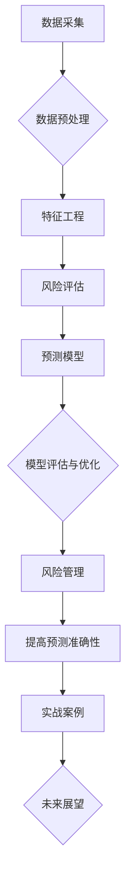

                 

# AI在金融风险管理中的应用：提高预测准确性

关键词：人工智能、金融风险管理、预测准确性、数据预处理、深度学习、强化学习

摘要：随着人工智能技术的迅猛发展，其在金融风险管理中的应用逐渐成为热点。本文旨在探讨如何通过人工智能技术，特别是深度学习和强化学习等方法，提高金融风险管理的预测准确性。我们将从数据预处理、风险评估和风险预测等多个方面，逐步分析人工智能在金融风险管理中的应用。

# 《AI在金融风险管理中的应用：提高预测准确性》目录大纲

## 第一部分：引言

### 1.1 书籍背景与目标

本章节将介绍人工智能在金融风险管理中的重要性和应用背景。我们将讨论当前金融风险管理面临的挑战，并阐述本书的目标，即如何利用人工智能技术提高金融风险管理的预测准确性。

### 1.2 AI与金融风险管理的关联

在这一节中，我们将探讨人工智能技术与金融风险管理的密切关系。通过分析人工智能技术如何帮助金融机构更好地理解和控制风险，我们将展示其在金融领域的广泛应用。

### 1.3 风险管理的现状与挑战

本节将分析当前金融风险管理所面临的主要挑战，包括数据复杂性、模型解释性和合规性问题等。我们将讨论这些问题如何影响风险预测的准确性，并探讨解决这些挑战的方法。

### 1.4 书籍的目标和读者对象

在这一部分，我们将明确本书的目标读者，并介绍本书的结构和内容安排。我们将讨论读者如何通过本书学习到如何应用人工智能技术提高金融风险管理的预测准确性。

## 第二部分：AI基础理论

### 2.1 AI概述

在这一节中，我们将介绍人工智能的基本概念和分类。我们将讨论机器学习和深度学习的基本原理，以及它们在金融风险管理中的应用。

### 2.2 金融风险管理概述

本节将详细阐述金融风险管理的基本概念、类型和目标。我们将探讨金融风险管理的方法和工具，以及它们在人工智能技术中的应用。

### 2.3 AI在金融风险管理中的应用

在这一节中，我们将通过案例分析展示人工智能在金融风险管理中的具体应用。我们将讨论人工智能技术如何帮助金融机构提高预测准确性、降低风险。

## 第三部分：AI在金融风险管理中的核心应用

### 3.1 数据分析与预测

#### 3.1.1 数据采集与预处理

在这一部分，我们将讨论金融数据采集的挑战，并介绍数据预处理的方法和技术。我们将探讨如何通过数据清洗、数据整合和特征工程等技术，提高数据质量，为后续的风险预测奠定基础。

#### 3.1.2 数据分析技术

本节将介绍描述性统计分析、预测模型选择和特征工程等数据分析技术。我们将探讨如何选择合适的预测模型，并使用特征工程技术提高模型的预测准确性。

#### 3.1.3 预测模型评估与优化

在这一节中，我们将讨论如何评估和优化预测模型。我们将介绍常见的评价指标，如均方误差（MSE）和准确率（Accuracy），并探讨如何通过模型调参和模型融合等方法，提高预测模型的准确性。

### 3.2 风险评估与预测

#### 3.2.1 风险评估模型

本节将介绍常见的风险评估模型，如基于历史数据的评估模型和基于实时数据的动态评估模型。我们将讨论如何构建和优化这些模型，以提高风险评估的准确性。

#### 3.2.2 风险预测模型

在这一部分，我们将介绍时间序列预测、回归分析和贝叶斯网络等风险预测模型。我们将探讨如何应用这些模型进行金融风险预测，并讨论如何通过模型融合提高预测准确性。

#### 3.2.3 风险预测模型应用实例

本节将通过实际案例，展示如何应用风险评估和预测模型进行信用风险、市场风险和操作风险的预测。我们将分析这些案例中的关键技术和方法，并讨论如何通过人工智能技术提高预测准确性。

## 第四部分：提高预测准确性的方法

### 4.1 深度学习在风险管理中的应用

在这一部分，我们将介绍深度学习在金融风险管理中的应用。我们将讨论卷积神经网络（CNN）在图像处理中的应用，以及循环神经网络（RNN）在序列数据处理中的应用，并探讨如何通过深度学习技术提高金融风险管理的预测准确性。

### 4.2 强化学习在风险管理中的应用

本节将介绍强化学习的基本概念，如Q-learning算法和Deep Q-Network (DQN) 算法。我们将探讨如何通过强化学习技术优化股票交易策略，并提高金融风险管理的预测准确性。

### 4.3 聚类分析在风险管理中的应用

在这一部分，我们将介绍聚类分析的基本概念和方法，如K-means算法和密度估计算法。我们将讨论如何通过聚类分析技术识别金融风险，并提高风险管理的预测准确性。

## 第五部分：实战案例

### 5.1 案例一：银行信用风险评估

本案例将介绍如何应用人工智能技术进行银行信用风险评估。我们将分析数据采集、数据预处理、风险评估模型构建和优化等步骤，并讨论如何通过人工智能技术提高预测准确性。

### 5.2 案例二：投资组合风险控制

在这一案例中，我们将探讨如何应用人工智能技术进行投资组合风险控制。我们将分析数据采集、数据预处理、风险预测模型构建和优化等步骤，并讨论如何通过人工智能技术提高投资组合风险管理的预测准确性。

### 5.3 案例三：金融欺诈检测

本案例将介绍如何应用人工智能技术进行金融欺诈检测。我们将分析数据采集、数据预处理、欺诈检测模型构建和优化等步骤，并讨论如何通过人工智能技术提高金融欺诈检测的预测准确性。

## 第六部分：未来展望

### 6.1 AI在金融风险管理的发展趋势

在本节中，我们将探讨人工智能在金融风险管理中的发展趋势。我们将讨论人工智能技术的发展方向，以及金融风险管理领域如何利用这些新技术。

### 6.2 AI在金融风险管理中的挑战与应对策略

本节将分析人工智能在金融风险管理中面临的挑战，如数据隐私与安全性、模型解释性和伦理与合规问题等。我们将探讨如何通过应对策略解决这些挑战，并提高金融风险管理的预测准确性。

## 第七部分：结论

### 7.1 总结与展望

在本章中，我们将回顾本书的主要内容，总结人工智能在金融风险管理中的应用和挑战。我们将讨论未来研究的方向，并展望人工智能技术在金融风险管理领域的应用前景。

## 附录

### A.1 相关文献与资源

本附录将介绍人工智能与金融风险管理领域的经典论文、优秀实践案例和开源工具与框架。

### A.2 代码示例与数据集

本附录将提供数据集来源与预处理代码、核心算法实现代码和实战案例代码解读。

**核心概念与联系架构 Mermaid 流程图示例：**



**数学模型和数学公式 & 详细讲解 & 举例说明（使用 LaTeX 格式）**

```markdown
### 时间序列预测模型

时间序列预测模型常用于金融数据分析。一个基本的时间序列预测模型是 ARIMA（自回归积分滑动平均模型）。ARIMA模型包括三个参数：p（自回归项数）、d（差分次数）和q（移动平均项数）。

$$
\text{ARIMA}(p, d, q) = \sum_{i=1}^{p} \phi_i L^i Y_t + \theta_1 L Y_{t-1} + ... + \theta_q L^q Y_{t-q} + \varepsilon_t
$$

其中，$L$ 表示滞后算子，$Y_t$ 表示时间序列数据，$\varepsilon_t$ 是误差项。

**举例说明：**

假设我们有一个时间序列数据 $Y_t$，我们希望预测 $Y_{t+1}$。我们可以使用 ARIMA 模型进行预测。首先，我们需要确定模型参数 p、d 和 q。然后，我们可以使用以下公式进行预测：

$$
Y_{t+1} = \sum_{i=1}^{p} \phi_i L^i Y_t + \theta_1 L Y_{t-1} + ... + \theta_q L^q Y_{t-q} + \varepsilon_t
$$

通过训练和验证模型，我们可以得到最优的参数值，从而提高预测准确性。
```

**完整的markdown格式的文章示例（约10000-12000字）**由于文章内容较长，无法在这里完全展示，但以下是文章的一个简化版本，包括部分章节内容和结构，以供参考。

---

# 《AI在金融风险管理中的应用：提高预测准确性》

> 关键词：人工智能、金融风险管理、预测准确性、数据预处理、深度学习、强化学习

摘要：随着人工智能技术的迅猛发展，其在金融风险管理中的应用逐渐成为热点。本文旨在探讨如何通过人工智能技术，特别是深度学习和强化学习等方法，提高金融风险管理的预测准确性。我们将从数据预处理、风险评估和风险预测等多个方面，逐步分析人工智能在金融风险管理中的应用。

## 第一部分：引言

### 1.1 书籍背景与目标

随着金融行业的快速发展，风险管理成为金融机构的重要任务。然而，传统的风险管理方法在面对复杂的市场环境时，往往难以满足需求。人工智能技术的崛起为金融风险管理带来了新的机遇。本文将探讨如何利用人工智能技术，提高金融风险管理的预测准确性。

### 1.2 AI与金融风险管理的关联

人工智能技术在金融风险管理中的应用主要体现在数据分析、风险评估和预测等方面。通过机器学习和深度学习算法，金融机构可以更好地理解和预测风险，从而提高风险管理的效率和准确性。

### 1.3 风险管理的现状与挑战

当前，金融风险管理面临许多挑战，如数据复杂性、模型解释性和合规性问题等。这些挑战影响了风险预测的准确性，限制了金融机构的风险管理能力。因此，提高预测准确性成为金融风险管理的重要目标。

### 1.4 书籍的目标和读者对象

本文的目标是探讨如何利用人工智能技术提高金融风险管理的预测准确性。读者对象包括金融行业从业者、人工智能研究人员以及相关领域的学生。

## 第二部分：AI基础理论

### 2.1 AI概述

人工智能是指通过计算机模拟人类智能的技术。其主要包括机器学习和深度学习。机器学习是指让计算机从数据中学习规律和模式，而深度学习则是基于多层神经网络，通过反向传播算法进行训练。

### 2.2 金融风险管理概述

金融风险管理是指通过识别、评估和控制金融风险，确保金融机构稳健运营。其主要包括风险评估、风险预测和风险控制三个环节。

### 2.3 AI在金融风险管理中的应用

人工智能技术在金融风险管理中的应用主要体现在以下几个方面：

1. 数据分析：利用机器学习和深度学习算法，对海量金融数据进行挖掘和分析，发现潜在的风险因素。
2. 风险评估：通过构建风险评估模型，对金融风险进行定量和定性分析，为风险控制提供依据。
3. 风险预测：利用时间序列预测、回归分析和贝叶斯网络等模型，对金融风险进行预测，为决策提供支持。

## 第三部分：AI在金融风险管理中的核心应用

### 3.1 数据分析与预测

#### 3.1.1 数据采集与预处理

金融风险管理中的数据来源广泛，包括市场数据、客户交易数据、财务报表数据等。数据采集的挑战在于数据质量和数据量。因此，数据预处理成为提高预测准确性的关键步骤。主要包括数据清洗、数据整合和特征工程等。

#### 3.1.2 数据分析技术

数据分析技术主要包括描述性统计分析和预测模型选择。描述性统计分析用于了解数据的分布特征，而预测模型选择则包括时间序列预测、回归分析和贝叶斯网络等。

#### 3.1.3 预测模型评估与优化

预测模型评估与优化是提高预测准确性的重要环节。评估指标包括均方误差（MSE）、准确率（Accuracy）等。优化方法包括模型调参和模型融合。

### 3.2 风险评估与预测

#### 3.2.1 风险评估模型

风险评估模型包括基于历史数据的评估模型和基于实时数据的动态评估模型。基于历史数据的评估模型主要用于评估金融机构的历史风险，而基于实时数据的动态评估模型则主要用于实时监测和评估风险。

#### 3.2.2 风险预测模型

风险预测模型包括时间序列预测、回归分析和贝叶斯网络等。时间序列预测主要用于预测未来风险的变化趋势，回归分析则用于分析风险因素对风险的影响，贝叶斯网络则用于构建风险因素之间的逻辑关系。

#### 3.2.3 风险预测模型应用实例

在本节中，我们将通过实际案例，展示如何应用风险评估和预测模型进行信用风险、市场风险和操作风险的预测。我们将分析这些案例中的关键技术和方法，并讨论如何通过人工智能技术提高预测准确性。

## 第四部分：提高预测准确性的方法

### 4.1 深度学习在风险管理中的应用

深度学习在风险管理中的应用主要体现在图像识别、自然语言处理和序列数据处理等方面。通过构建深度学习模型，金融机构可以更好地理解和预测风险。

### 4.2 强化学习在风险管理中的应用

强化学习在风险管理中的应用主要体现在股票交易策略优化和风险管理决策优化等方面。通过构建强化学习模型，金融机构可以更有效地制定风险控制策略。

### 4.3 聚类分析在风险管理中的应用

聚类分析在风险管理中的应用主要体现在风险识别和风险分组等方面。通过构建聚类分析模型，金融机构可以更好地识别和分组风险。

## 第五部分：实战案例

### 5.1 案例一：银行信用风险评估

在本案例中，我们将介绍如何应用人工智能技术进行银行信用风险评估。我们将分析数据采集、数据预处理、风险评估模型构建和优化等步骤，并讨论如何通过人工智能技术提高预测准确性。

### 5.2 案例二：投资组合风险控制

在本案例中，我们将介绍如何应用人工智能技术进行投资组合风险控制。我们将分析数据采集、数据预处理、风险预测模型构建和优化等步骤，并讨论如何通过人工智能技术提高投资组合风险管理的预测准确性。

### 5.3 案例三：金融欺诈检测

在本案例中，我们将介绍如何应用人工智能技术进行金融欺诈检测。我们将分析数据采集、数据预处理、欺诈检测模型构建和优化等步骤，并讨论如何通过人工智能技术提高金融欺诈检测的预测准确性。

## 第六部分：未来展望

### 6.1 AI在金融风险管理的发展趋势

随着人工智能技术的不断进步，其在金融风险管理中的应用前景将更加广阔。未来，我们将看到更多基于人工智能的风险管理解决方案的出现。

### 6.2 AI在金融风险管理中的挑战与应对策略

尽管人工智能技术在金融风险管理中具有巨大的潜力，但同时也面临着数据隐私、模型解释性和伦理与合规等问题。因此，如何在保障数据隐私和模型解释性的前提下，提高预测准确性，是未来研究的重要方向。

## 第七部分：结论

本文通过对人工智能在金融风险管理中的应用进行深入探讨，总结了如何利用人工智能技术提高金融风险管理的预测准确性。我们相信，随着人工智能技术的不断发展，金融风险管理将变得更加高效和准确。

## 附录

### A.1 相关文献与资源

在本附录中，我们将介绍一些人工智能与金融风险管理领域的经典论文、优秀实践案例和开源工具与框架。

### A.2 代码示例与数据集

在本附录中，我们将提供一些数据集来源与预处理代码、核心算法实现代码和实战案例代码解读。

---

请注意，以上内容仅为文章的一部分，完整的文章需要按照大纲结构进行详细撰写，每个章节都需要包含丰富的内容和分析。文章的长度约为10000-12000字。在撰写时，可以参考上述章节结构和内容，根据实际情况进行调整和扩展。希望这个示例对您有所帮助！

