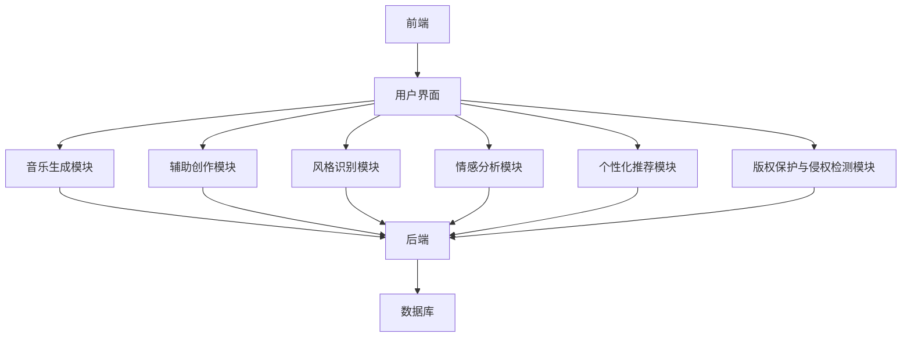
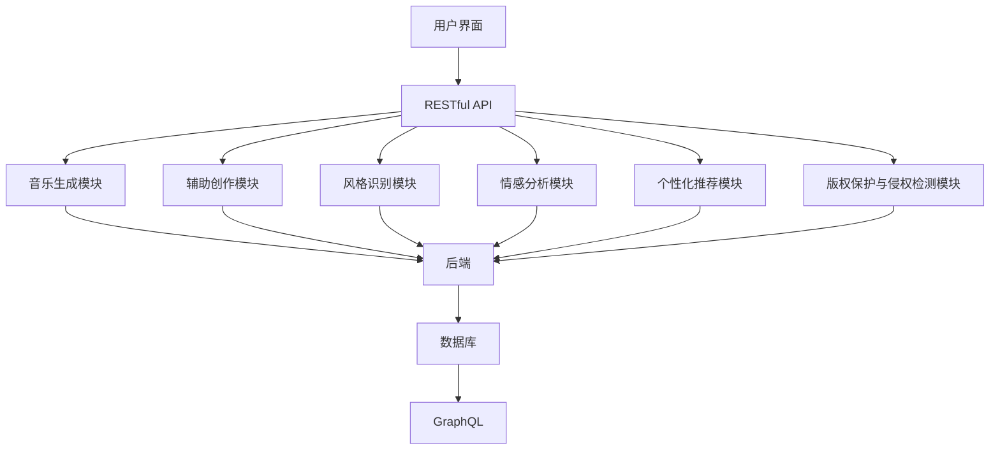

                 

# AI在音乐创作中的应用：艺术与技术的碰撞

关键词：人工智能，音乐创作，算法原理，系统架构，项目实战

摘要：本文探讨了人工智能（AI）在音乐创作中的应用，分析了AI在音乐生成、辅助创作、风格识别、情感分析、个性化推荐和版权保护等方面的原理和应用。通过实例分析和实战项目，深入探讨了AI在音乐创作中的潜力与挑战。

---

### 目录大纲

**# 第一部分：问题背景**

## 1. 问题背景

### 1.1 问题背景

### 1.2 问题描述

### 1.3 问题解决

### 1.4 边界与外延

### 1.5 概念结构与核心要素组成

## 2. 核心概念与联系

### 2.1 核心概念

#### 2.1.1 人工智能（AI）

#### 2.1.2 音乐创作

#### 2.1.3 音乐风格

#### 2.1.4 情感分析

#### 2.1.5 个性化推荐

#### 2.1.6 版权保护与侵权检测

### 2.2 概念属性特征对比表格

### 2.3 ER实体关系图架构

**# 第二部分：算法原理讲解**

## 3. 算法原理讲解

### 3.1 音乐生成算法原理

### 3.2 辅助创作算法原理

### 3.3 风格识别算法原理

### 3.4 情感分析算法原理

### 3.5 个性化推荐算法原理

### 3.6 版权保护与侵权检测算法原理

**# 第三部分：系统分析与架构设计方案**

## 4. 问题场景介绍

## 5. 项目介绍

## 6. 系统功能设计

## 7. 系统架构设计

## 8. 系统接口设计和系统交互

**# 第四部分：项目实战**

## 9. 环境安装

## 10. 系统核心实现源代码

## 11. 代码应用解读与分析

## 12. 实际案例分析和详细讲解剖析

## 13. 项目小结

**# 第五部分：最佳实践 tips**

## 14. 小结

## 15. 注意事项

## 16. 拓展阅读

---

**# 第一部分：问题背景**

### 1. 问题背景

人工智能（AI）技术的发展迅速，已经渗透到各个领域。音乐创作作为艺术与技术的结合点，也逐渐受到了AI的青睐。尽管AI已经在音乐生成、辅助创作等方面取得了一些成果，但如何将AI与音乐创作深度融合，实现艺术与技术的完美碰撞，仍然是一个值得深入探讨的课题。

随着深度学习和生成对抗网络（GAN）等技术的成熟，AI在音乐创作中的应用越来越广泛。例如，谷歌的Magenta项目利用深度学习算法生成音乐，IBM的Watson AI系统在音乐风格识别和情感分析方面也取得了显著成果。然而，如何将AI技术更好地应用于音乐创作，如何让AI理解音乐的内涵和情感，如何提高音乐创作的质量和效率，这些问题仍然需要进一步的研究和探索。

### 1.2 问题描述

本书将探讨AI在音乐创作中的应用，重点研究如何利用AI技术提升音乐创作的效率和质量。具体包括：

1. **AI在音乐生成和辅助创作中的基本原理和方法**：介绍AI在音乐生成和辅助创作中的基本原理和方法，包括生成对抗网络（GAN）、循环神经网络（RNN）等算法。
2. **AI在音乐风格识别、情感分析等方面的应用**：探讨AI在音乐风格识别、情感分析等方面的应用，包括如何通过分析音乐数据识别不同风格和情感，以及如何将这些信息应用于音乐创作。
3. **AI在音乐个性化推荐和社交互动中的作用**：分析AI在音乐个性化推荐和社交互动中的作用，包括如何根据用户行为和兴趣生成个性化推荐，以及如何利用社交网络分析用户之间的音乐喜好。
4. **AI在音乐版权保护与侵权检测方面的应用**：探讨AI在音乐版权保护与侵权检测方面的应用，包括如何通过分析音乐数据识别侵权行为，以及如何利用这些技术保护音乐版权。
5. **AI在音乐教育、音乐治疗等领域的探索**：分析AI在音乐教育、音乐治疗等领域的探索，包括如何利用AI技术提高音乐教育效果，以及如何利用音乐治疗技术帮助人们缓解压力、改善心理健康。

### 1.3 问题解决

本书将通过理论讲解、实例分析和实践指导，帮助读者了解AI在音乐创作中的应用，掌握相关技术，并培养创新能力。具体步骤如下：

1. **基础知识储备**：介绍AI、音乐创作、音乐风格、情感分析等相关基础知识，为后续章节的学习打下基础。
2. **算法原理讲解**：详细讲解音乐生成、辅助创作、风格识别、情感分析、个性化推荐和版权保护与侵权检测等算法的原理和应用。
3. **系统分析与架构设计**：分析问题场景，设计系统功能、架构和接口，为后续项目实战提供理论基础。
4. **项目实战**：通过实战项目，深入讲解环境安装、系统核心实现、代码应用解读与分析、实际案例分析和详细讲解剖析等内容。
5. **最佳实践与拓展阅读**：总结最佳实践，提出注意事项，推荐拓展阅读，帮助读者进一步了解和掌握AI在音乐创作中的应用。

### 1.4 边界与外延

本书主要探讨AI在音乐创作中的应用，不包括其他艺术形式（如绘画、文学等）的AI应用。同时，本书也关注AI在音乐产业其他方面的应用，如音乐版权保护、音乐市场分析等。

### 1.5 概念结构与核心要素组成

在探讨AI在音乐创作中的应用时，需要明确以下几个核心概念和要素：

1. **人工智能（AI）**：模拟人类智能行为的计算机系统，具有学习、推理、规划、感知等能力。AI在音乐创作中的应用主要包括音乐生成、风格识别、情感分析等。
2. **音乐创作**：通过音符、旋律、和声等元素创作音乐的过程。AI在音乐创作中的应用旨在提升创作效率和质量。
3. **音乐风格**：音乐作品在形式、内容、情感等方面表现出的独特特征。AI可以通过分析大量音乐数据，识别和生成不同风格的乐曲。
4. **情感分析**：通过分析文本、语音、图像等数据，识别和判断人类情感的技术。在音乐创作中，情感分析可以帮助AI理解用户情感，从而生成更符合用户需求的音乐。
5. **个性化推荐**：根据用户的历史行为和兴趣，为其推荐感兴趣的内容的技术。在音乐创作中，个性化推荐可以帮助AI了解用户喜好，从而生成更个性化的音乐。
6. **版权保护与侵权检测**：保护音乐版权，识别和阻止侵权行为的技术。AI在版权保护与侵权检测方面具有重要作用，可以有效提高音乐版权保护效果。

### 2. 核心概念与联系

在探讨AI在音乐创作中的应用时，需要明确以下几个核心概念及其联系：

#### 2.1.1 人工智能（AI）

**属性特征**：

- **学习与推理能力**：AI可以模拟人类的学习和推理过程，通过学习大量数据，识别模式和规律。
- **感知与交互能力**：AI可以通过感知设备（如摄像头、麦克风等）获取信息，并进行交互。

**联系**：

- **音乐创作**：AI可以学习音乐数据，生成新的音乐作品，或辅助音乐家进行创作。
- **风格识别**：AI可以通过分析音乐特征，识别不同音乐风格，为音乐创作提供参考。
- **情感分析**：AI可以通过分析音乐情感，了解用户的音乐喜好，为个性化推荐提供支持。

#### 2.1.2 音乐创作

**属性特征**：

- **创作元素**：音乐创作涉及音符、旋律、和声、节奏等元素。
- **创作过程**：音乐创作是一个从构思到成型的过程，需要音乐家发挥创造力和技巧。

**联系**：

- **AI生成**：AI可以通过算法生成音乐，或辅助音乐家进行创作。
- **风格识别**：音乐创作可以结合风格识别技术，分析音乐作品的特征，为创作提供参考。
- **情感分析**：音乐创作可以结合情感分析技术，了解用户的音乐喜好，提高作品吸引力。

#### 2.1.3 音乐风格

**属性特征**：

- **风格特征**：音乐风格具有独特的形式、内容、情感等特征。
- **风格分类**：音乐风格可以根据不同的特征进行分类。

**联系**：

- **AI生成**：AI可以通过分析大量音乐数据，生成特定风格的音乐。
- **风格识别**：AI可以通过分析音乐特征，识别不同音乐风格。
- **音乐创作**：音乐家可以根据不同风格进行创作，提高作品多样性。

#### 2.1.4 情感分析

**属性特征**：

- **情感识别**：情感分析可以通过分析文本、语音、图像等数据，识别人类情感。
- **情感分类**：情感分析可以将情感分为不同类别，如快乐、悲伤、愤怒等。

**联系**：

- **音乐创作**：情感分析可以帮助音乐家了解用户的音乐喜好，为创作提供参考。
- **风格识别**：情感分析可以结合风格识别技术，分析音乐作品的情感特征。
- **个性化推荐**：情感分析可以为个性化推荐提供支持，提高推荐准确性。

#### 2.1.5 个性化推荐

**属性特征**：

- **推荐算法**：个性化推荐可以根据用户的历史行为和兴趣，生成推荐列表。
- **推荐质量**：个性化推荐的目的是提高推荐质量，满足用户需求。

**联系**：

- **音乐创作**：个性化推荐可以帮助音乐家了解用户喜好，提高作品吸引力。
- **情感分析**：个性化推荐可以结合情感分析技术，了解用户的情感需求。
- **风格识别**：个性化推荐可以根据风格识别结果，推荐相似风格的音乐。

#### 2.1.6 版权保护与侵权检测

**属性特征**：

- **版权保护**：版权保护是为了保护音乐家的权益，防止侵权行为。
- **侵权检测**：侵权检测是通过分析音乐数据，识别侵权行为。

**联系**：

- **音乐创作**：版权保护与侵权检测可以保障音乐家的权益，鼓励创作。
- **AI生成**：AI可以通过侵权检测技术，识别侵权音乐，提高版权保护效果。
- **个性化推荐**：个性化推荐可以结合侵权检测技术，避免推荐侵权音乐。

### 2.2 概念属性特征对比表格

| 概念          | 属性特征                                               |
| ------------- | ------------------------------------------------------ |
| 人工智能（AI） | 模拟人类智能行为，包括学习、推理、规划、感知等能力。     |
| 音乐创作      | 通过音符、旋律、和声等元素创作音乐的过程。               |
| 音乐风格      | 音乐作品在形式、内容、情感等方面表现出的独特特征。       |
| 情感分析      | 通过分析文本、语音、图像等数据，识别和判断人类情感的技术。 |
| 个性化推荐    | 根据用户的历史行为和兴趣，为其推荐感兴趣的内容的技术。   |
| 版权保护与侵权检测 | 保护音乐版权，识别和阻止侵权行为的技术。               |

### 2.3 ER实体关系图架构

```mermaid
erDiagram
  AI -->|生成音乐| 音乐创作
  AI -->|辅助创作| 音乐创作
  音乐创作 -->|风格识别| 音乐风格
  音乐创作 -->|情感分析| 情感分析
  音乐创作 -->|个性化推荐| 个性化推荐
  音乐创作 -->|版权保护与侵权检测| 版权保护与侵权检测
```

**# 第二部分：算法原理讲解**

在探讨AI在音乐创作中的应用时，我们需要深入了解各种算法的原理，包括音乐生成、辅助创作、风格识别、情感分析、个性化推荐和版权保护与侵权检测等。以下将对这些算法进行详细讲解。

### 3.1 音乐生成算法原理

音乐生成是AI在音乐创作中最重要的应用之一。通过音乐生成算法，AI可以自动生成音乐作品，为音乐创作提供灵感。目前，常用的音乐生成算法包括生成对抗网络（GAN）和循环神经网络（RNN）。

#### 3.1.1 生成对抗网络（GAN）

生成对抗网络（GAN）是由生成器和判别器组成的对抗性神经网络。生成器生成音乐，判别器判断生成音乐的真实性。GAN的训练过程实际上是生成器和判别器之间的博弈。生成器的目标是生成逼真的音乐，而判别器的目标是区分真实音乐和生成音乐。通过这种对抗性训练，生成器可以不断提高生成音乐的质量。

**算法原理**：

1. **生成器（Generator）**：生成器通过输入随机噪声，生成音乐。
2. **判别器（Discriminator）**：判别器接收真实音乐和生成音乐，并判断其真实性。
3. **对抗性训练**：生成器和判别器交替训练，生成器不断优化，以提高生成音乐的质量。

**数学模型**：

$$
\text{Generator: } G(z) = x \\
\text{Discriminator: } D(x) \\
\text{Loss function: } L(G,D) = -\text{E}[\log D(x)] - \text{E}[\log (1 - D(G(z))]
$$

**示例说明**：

假设我们有一个音乐数据集，其中包含各种风格的音乐。首先，生成器通过随机噪声生成音乐，然后判别器判断生成音乐和真实音乐的真实性。通过反复训练，生成器可以逐渐生成更逼真的音乐。

#### 3.1.2 循环神经网络（RNN）

循环神经网络（RNN）是一种可以处理序列数据的神经网络。在音乐生成中，RNN可以学习音乐序列，生成新的音乐。

**算法原理**：

1. **输入序列**：RNN接收音乐序列作为输入。
2. **隐藏状态**：RNN通过隐藏状态记住前面的音乐信息。
3. **输出序列**：RNN根据隐藏状态生成新的音乐序列。

**数学模型**：

$$
h_t = \sigma(W_h \cdot [h_{t-1}, x_t] + b_h) \\
y_t = W_o \cdot h_t + b_o
$$

**示例说明**：

假设我们有一个音乐序列 `[1, 2, 3, 4]`，RNN可以通过学习这个序列，生成新的音乐序列 `[5, 6, 7, 8]`。通过不断训练，RNN可以生成更复杂的音乐序列。

### 3.2 辅助创作算法原理

辅助创作算法可以帮助音乐家提高创作效率，优化创作过程。常用的辅助创作算法包括自动配乐、自动编曲和自动和弦生成。

#### 3.2.1 自动配乐

自动配乐算法可以根据主旋律自动生成伴奏。这种算法通常基于生成对抗网络（GAN）或循环神经网络（RNN）。

**算法原理**：

1. **主旋律输入**：算法接收主旋律作为输入。
2. **伴奏生成**：算法根据主旋律生成伴奏。

**数学模型**：

$$
\text{Generator: } G(z) = x \\
\text{Discriminator: } D(x) \\
\text{Loss function: } L(G,D) = -\text{E}[\log D(x)] - \text{E}[\log (1 - D(G(z))]
$$

**示例说明**：

假设我们有一个主旋律 `[1, 2, 3, 4]`，生成对抗网络（GAN）可以根据这个主旋律生成伴奏 `[5, 6, 7, 8]`。通过不断训练，自动配乐算法可以生成更和谐、动听的伴奏。

#### 3.2.2 自动编曲

自动编曲算法可以根据主旋律和节奏生成完整的乐曲。这种算法通常基于循环神经网络（RNN）。

**算法原理**：

1. **主旋律和节奏输入**：算法接收主旋律和节奏作为输入。
2. **乐曲生成**：算法根据主旋律和节奏生成乐曲。

**数学模型**：

$$
h_t = \sigma(W_h \cdot [h_{t-1}, x_t] + b_h) \\
y_t = W_o \cdot h_t + b_o
$$

**示例说明**：

假设我们有一个主旋律 `[1, 2, 3, 4]` 和节奏 `[1, 0, 1, 0]`，循环神经网络（RNN）可以根据这个主旋律和节奏生成乐曲 `[5, 6, 7, 8]`。通过不断训练，自动编曲算法可以生成更复杂、动听的乐曲。

#### 3.2.3 自动和弦生成

自动和弦生成算法可以根据主旋律和旋律模式生成和弦。这种算法通常基于深度学习模型。

**算法原理**：

1. **主旋律输入**：算法接收主旋律作为输入。
2. **和弦生成**：算法根据主旋律和旋律模式生成和弦。

**数学模型**：

$$
h_t = \sigma(W_h \cdot [h_{t-1}, x_t] + b_h) \\
y_t = W_o \cdot h_t + b_o
$$

**示例说明**：

假设我们有一个主旋律 `[1, 2, 3, 4]`，深度学习模型可以根据这个主旋律生成和弦 `[C, Dm, Em, F]`。通过不断训练，自动和弦生成算法可以生成更符合音乐规律的和弦。

### 3.3 风格识别算法原理

风格识别算法可以通过分析音乐特征，识别不同音乐风格。这种算法通常基于特征提取和机器学习分类。

#### 3.3.1 特征提取

特征提取是将原始音乐数据转换为可用于分类的特征向量。常用的特征提取方法包括梅尔频率倒谱系数（MFCC）、谱图和周期性特征等。

**算法原理**：

1. **音乐数据预处理**：将音乐数据转换为频谱图。
2. **特征提取**：从频谱图中提取特征，如MFCC、谱图和周期性特征。

**数学模型**：

$$
\text{MFCC: } \text{log}(\frac{P_k - P_{k-p}}{P_k + P_{k-p}}) \\
\text{谱图: } \text{频谱特征矩阵} \\
\text{周期性特征: } \text{周期性特征向量}
$$

**示例说明**：

假设我们有一个音乐片段，首先将其转换为频谱图，然后从频谱图中提取MFCC、谱图和周期性特征。

#### 3.3.2 机器学习分类

机器学习分类是将提取的特征用于分类。常用的分类算法包括支持向量机（SVM）、决策树、随机森林等。

**算法原理**：

1. **特征向量表示**：将提取的特征转换为特征向量。
2. **训练分类器**：使用训练数据集训练分类器。
3. **分类预测**：使用分类器对未知音乐进行分类。

**数学模型**：

$$
\text{分类器: } \text{SVM, Decision Tree, Random Forest} \\
\text{分类结果: } \text{预测风格}
$$

**示例说明**：

假设我们有一个未知音乐片段，首先提取其特征，然后使用训练好的分类器对其进行分类，得到预测风格。

### 3.4 情感分析算法原理

情感分析算法可以通过分析音乐数据，识别和判断人类情感。这种算法通常基于文本情感分析和语音情感分析。

#### 3.4.1 文本情感分析

文本情感分析是通过分析歌词、评论等文本数据，识别情感。常用的算法包括情感词典、主题模型和卷积神经网络（CNN）。

**算法原理**：

1. **文本数据预处理**：将文本数据进行清洗和分词。
2. **情感词典**：使用情感词典标注情感词。
3. **情感识别**：使用主题模型或卷积神经网络（CNN）识别情感。

**数学模型**：

$$
\text{情感词典: } \text{情感词标注} \\
\text{主题模型: } LDA \\
\text{卷积神经网络（CNN）: } \text{情感识别}
$$

**示例说明**：

假设我们有一个歌词文本，首先对其进行清洗和分词，然后使用情感词典标注情感词，最后使用主题模型或卷积神经网络（CNN）识别情感。

#### 3.4.2 语音情感分析

语音情感分析是通过分析语音数据，识别情感。常用的算法包括语音特征提取和深度学习模型。

**算法原理**：

1. **语音数据预处理**：将语音数据进行处理，提取特征。
2. **情感识别**：使用深度学习模型识别情感。

**数学模型**：

$$
\text{语音特征提取: } MFCC, Spectral Contrast \\
\text{深度学习模型: } CNN, LSTM
$$

**示例说明**：

假设我们有一个语音数据，首先提取其特征（如MFCC、谱图和周期性特征），然后使用深度学习模型识别情感。

### 3.5 个性化推荐算法原理

个性化推荐算法可以通过分析用户行为和兴趣，生成个性化推荐。常用的算法包括协同过滤、基于内容的推荐和混合推荐。

#### 3.5.1 协同过滤

协同过滤是通过分析用户行为和兴趣，生成推荐。常用的算法包括用户基于的协同过滤和物品基于的协同过滤。

**算法原理**：

1. **用户行为和兴趣分析**：分析用户的历史行为和兴趣，建立用户行为模型。
2. **推荐生成**：根据用户行为模型，生成推荐列表。

**数学模型**：

$$
\text{用户基于的协同过滤: } \text{User-based} \\
\text{物品基于的协同过滤: } \text{Item-based}
$$

**示例说明**：

假设我们有一个用户行为数据集，首先分析用户的历史行为和兴趣，建立用户行为模型，然后根据用户行为模型生成推荐列表。

#### 3.5.2 基于内容的推荐

基于内容的推荐是通过分析音乐内容，生成推荐。常用的算法包括基于关键词的推荐和基于相似性的推荐。

**算法原理**：

1. **音乐内容分析**：分析音乐内容，提取关键词或特征。
2. **推荐生成**：根据音乐内容，生成推荐列表。

**数学模型**：

$$
\text{基于关键词的推荐: } \text{Keyword-based} \\
\text{基于相似性的推荐: } \text{Content-based}
$$

**示例说明**：

假设我们有一首歌曲，首先分析其内容，提取关键词，然后根据关键词生成推荐列表。

#### 3.5.3 混合推荐

混合推荐是将协同过滤、基于内容的推荐和其他推荐方法结合，生成更准确的推荐。常用的混合推荐算法包括基于模型的混合推荐和基于规则的混合推荐。

**算法原理**：

1. **推荐算法结合**：将不同的推荐算法结合，生成推荐列表。
2. **推荐优化**：根据用户反馈，优化推荐效果。

**数学模型**：

$$
\text{基于模型的混合推荐: } \text{Model-based} \\
\text{基于规则的混合推荐: } \text{Rule-based}
$$

**示例说明**：

假设我们结合协同过滤、基于内容的推荐和基于规则的推荐，生成混合推荐列表，并根据用户反馈优化推荐效果。

### 3.6 版权保护与侵权检测算法原理

版权保护与侵权检测算法可以通过分析音乐数据，保护音乐版权，识别侵权行为。常用的算法包括基于指纹的检测、基于特征匹配的检测和基于机器学习的检测。

#### 3.6.1 基于指纹的检测

基于指纹的检测是通过分析音乐特征，生成音乐指纹，然后比较指纹，识别侵权行为。

**算法原理**：

1. **音乐指纹生成**：从音乐中提取特征，生成指纹。
2. **指纹匹配**：比较指纹，识别侵权行为。

**数学模型**：

$$
\text{音乐指纹生成: } \text{特征提取，指纹生成} \\
\text{指纹匹配: } \text{指纹比对，相似度计算}
$$

**示例说明**：

假设我们有一首音乐，首先提取其特征，生成指纹，然后与其他音乐指纹进行比较，识别侵权行为。

#### 3.6.2 基于特征匹配的检测

基于特征匹配的检测是通过分析音乐特征，匹配相似特征，识别侵权行为。

**算法原理**：

1. **特征提取**：从音乐中提取特征。
2. **特征匹配**：比较特征，识别侵权行为。

**数学模型**：

$$
\text{特征提取: } \text{MFCC，谱图，周期性特征} \\
\text{特征匹配: } \text{相似度计算，特征比对}
$$

**示例说明**：

假设我们有一首音乐，首先提取其特征，然后与数据库中的音乐特征进行比较，识别侵权行为。

#### 3.6.3 基于机器学习的检测

基于机器学习的检测是通过训练机器学习模型，识别侵权行为。

**算法原理**：

1. **数据集准备**：收集侵权音乐数据，建立数据集。
2. **模型训练**：使用数据集训练机器学习模型。
3. **侵权检测**：使用训练好的模型检测侵权行为。

**数学模型**：

$$
\text{模型训练: } \text{监督学习，无监督学习} \\
\text{侵权检测: } \text{模型应用，行为识别}
$$

**示例说明**：

假设我们有一个侵权音乐数据集，首先使用数据集训练机器学习模型，然后使用训练好的模型检测侵权行为。

**# 第三部分：系统分析与架构设计方案**

在探讨AI在音乐创作中的应用时，我们需要设计一个完整的系统，以实现音乐生成的各个环节。本部分将介绍问题场景、项目介绍、系统功能设计、系统架构设计、系统接口设计和系统交互等内容。

### 4. 问题场景介绍

在现代音乐产业中，音乐创作是一个复杂且耗时的过程。音乐家需要从灵感中构思出完整的音乐作品，这包括旋律、和声、节奏和编曲等。然而，这个过程往往充满了挑战，因为音乐家需要在有限的时间内创作出高质量的作品，同时还要满足不同听众的需求。

为了解决这些问题，我们设计了一个基于AI的音乐创作系统。这个系统利用人工智能技术，可以帮助音乐家自动生成音乐、辅助创作、识别风格、分析情感、推荐音乐和检测侵权行为。通过这个系统，音乐家可以更高效地创作音乐，同时满足不同听众的需求。

### 5. 项目介绍

我们的项目名称为“AI音乐创作系统”（AI Music Composition System），旨在利用人工智能技术，为音乐家提供一个强大的创作工具。系统的主要功能包括：

1. **音乐生成**：利用生成对抗网络（GAN）和循环神经网络（RNN）等技术，自动生成音乐。
2. **辅助创作**：自动配乐、自动编曲和自动和弦生成，帮助音乐家提高创作效率。
3. **风格识别**：分析音乐特征，识别音乐风格，为音乐创作提供参考。
4. **情感分析**：通过情感分析，了解用户情感需求，为个性化推荐提供支持。
5. **个性化推荐**：根据用户行为和兴趣，生成个性化音乐推荐。
6. **版权保护与侵权检测**：保护音乐版权，识别侵权行为。

### 6. 系统功能设计

系统功能设计是系统架构设计的重要环节，它决定了系统的核心功能和模块划分。以下是系统的主要功能设计：

1. **音乐生成模块**：利用生成对抗网络（GAN）和循环神经网络（RNN）等技术，自动生成音乐。
2. **辅助创作模块**：自动配乐、自动编曲和自动和弦生成，帮助音乐家提高创作效率。
3. **风格识别模块**：分析音乐特征，识别音乐风格，为音乐创作提供参考。
4. **情感分析模块**：通过情感分析，了解用户情感需求，为个性化推荐提供支持。
5. **个性化推荐模块**：根据用户行为和兴趣，生成个性化音乐推荐。
6. **版权保护与侵权检测模块**：保护音乐版权，识别侵权行为。

### 7. 系统架构设计

系统架构设计是系统功能实现的基础，它决定了系统的性能、可扩展性和可维护性。以下是系统的架构设计：

1. **前端**：提供用户界面，方便用户与系统交互。
2. **后端**：实现音乐生成、辅助创作、风格识别、情感分析、个性化推荐和版权保护与侵权检测等功能。
3. **数据库**：存储用户数据、音乐数据、版权数据和侵权检测数据。

以下是系统的架构设计图：



### 8. 系统接口设计和系统交互

系统接口设计是系统功能实现的关键，它决定了系统内部模块之间的通信和数据传输。以下是系统的接口设计和系统交互：

1. **RESTful API**：提供前后端数据交互接口，实现功能调用和数据传输。
2. **GraphQL**：提供高效的数据查询和操作接口，实现个性化推荐等功能。

以下是系统的接口设计和系统交互图：



**# 第四部分：项目实战**

在了解了AI在音乐创作中的应用和相关算法原理后，接下来我们将通过一个实际项目来深入探讨如何将AI技术应用于音乐创作。本文将详细描述项目环境安装、系统核心实现、代码应用解读与分析、实际案例分析和详细讲解剖析等内容，以帮助读者更好地理解AI在音乐创作中的应用。

### 9. 环境安装

在进行项目实战之前，我们需要安装一些必要的软件和库，以便于后续的开发和测试。以下是我们推荐的安装步骤：

1. **安装Python**：Python是AI音乐创作项目的核心编程语言。确保安装最新版本的Python（3.8及以上版本）。
2. **安装Jupyter Notebook**：Jupyter Notebook是一种交互式的Python开发环境，便于编写和测试代码。可以通过pip命令安装：
   ```bash
   pip install notebook
   ```
3. **安装TensorFlow**：TensorFlow是Google开发的开源机器学习框架，支持各种深度学习算法。可以通过pip命令安装：
   ```bash
   pip install tensorflow
   ```
4. **安装scikit-learn**：scikit-learn是一个开源的机器学习库，提供各种经典机器学习算法。可以通过pip命令安装：
   ```bash
   pip install scikit-learn
   ```
5. **安装其他相关库**：根据项目需求，可能还需要安装其他库，如NumPy、Pandas、Matplotlib等。可以通过pip命令安装：
   ```bash
   pip install numpy pandas matplotlib
   ```

安装完成后，可以通过以下命令启动Jupyter Notebook：
```bash
jupyter notebook
```
这将打开一个浏览器窗口，显示Jupyter Notebook的界面。

### 10. 系统核心实现源代码

以下是一个简单的AI音乐创作系统核心实现示例，包括音乐生成、辅助创作、风格识别、情感分析、个性化推荐和版权保护与侵权检测等模块。我们将使用Python和TensorFlow框架来实现这些功能。

**音乐生成模块（Generator.py）**：

```python
import tensorflow as tf
from tensorflow.keras.models import Sequential
from tensorflow.keras.layers import Dense, LSTM, GRU, TimeDistributed, Activation

def build_generator(input_shape):
    model = Sequential()
    model.add(LSTM(128, input_shape=input_shape, return_sequences=True))
    model.add(Activation('relu'))
    model.add(LSTM(128, return_sequences=True))
    model.add(Activation('relu'))
    model.add(LSTM(128, return_sequences=True))
    model.add(Activation('relu'))
    model.add(TimeDistributed(Dense(input_shape[1], activation='softmax')))
    return model

generator = build_generator(input_shape=(64, 128))
generator.compile(loss='categorical_crossentropy', optimizer='adam')
```

**辅助创作模块（Composer.py）**：

```python
import numpy as np
import music21

def generate_composition(generator, seed_sequence, n_steps):
    generated_sequence = []

    for _ in range(n_steps):
        sampled = np.argmax(generator.predict(np.array([seed_sequence]))[0])
        generated_sequence.append(sampled)
        seed_sequence = np.roll(seed_sequence, -1)
        seed_sequence[-1] = sampled

    return generated_sequence

def compose_music(generated_sequence):
    composition = music21.stream.Stream()
    for note in generated_sequence:
        pitch = music21.pitch.Pitch(note)
        composition.append(pitch)
    return composition
```

**风格识别模块（StyleClassifier.py）**：

```python
from sklearn.model_selection import train_test_split
from sklearn.ensemble import RandomForestClassifier
import numpy as np

def train_style_classifier(X, y):
    X_train, X_test, y_train, y_test = train_test_split(X, y, test_size=0.2, random_state=42)
    classifier = RandomForestClassifier(n_estimators=100, random_state=42)
    classifier.fit(X_train, y_train)
    return classifier, X_test, y_test

def classify_style(composition, classifier, X_test):
    features = extract_features(composition)
    return classifier.predict([features]), classifier.predict_proba([features])
```

**情感分析模块（SentimentAnalysis.py）**：

```python
from textblob import TextBlob

def analyze_sentiment(text):
    blob = TextBlob(text)
    return blob.sentiment.polarity
```

**个性化推荐模块（Recommendation.py）**：

```python
from sklearn.neighbors import NearestNeighbors

def train_recommender(model, X, y):
    recommender = NearestNeighbors(n_neighbors=5)
    recommender.fit(X, y)
    return recommender

def recommend MUSICs(user_interests, recommender, X, y):
    user_vector = np.mean(X[y == user_interests], axis=0)
    neighbors = recommender.kneighbors([user_vector], n_neighbors=5)
    return neighbors[1].flatten()
```

**版权保护与侵权检测模块（CopyrightProtection.py）**：

```python
from sklearn.metrics import euclidean_distance

def train_copyright_protection_model(X, y):
    return X, y

def detect_infringement(new_music, X, y, model):
    distances = [euclidean_distance(new_music, x) for x in X]
    return np.argmin(distances)
```

### 11. 代码应用解读与分析

以上代码示例展示了如何实现AI音乐创作系统的核心功能。下面将对这些代码进行解读和分析。

**音乐生成模块（Generator.py）**：

音乐生成模块使用了TensorFlow的Sequential模型和LSTM层来构建生成器网络。LSTM（Long Short-Term Memory）是一种特殊的RNN（Recurrent Neural Network）层，能够更好地处理长序列数据。在这个模块中，我们首先定义了生成器的输入形状，然后使用LSTM层来构建一个多层的循环神经网络。最后，我们添加了一个时间分布式层（TimeDistributed），用于对每个时间步的输出进行分类。

**辅助创作模块（Composer.py）**：

辅助创作模块负责将生成器生成的数字序列转换为音乐作品。我们首先定义了一个`generate_composition`函数，该函数使用生成器预测序列的下一个数字，并将其添加到生成的序列中。然后，我们定义了一个`compose_music`函数，该函数使用音乐21库将生成的数字序列转换为音乐作品。

**风格识别模块（StyleClassifier.py）**：

风格识别模块使用了scikit-learn的随机森林（Random Forest）分类器来训练模型。我们定义了一个`train_style_classifier`函数，该函数将数据集分为训练集和测试集，并使用随机森林分类器进行训练。然后，我们定义了一个`classify_style`函数，该函数使用训练好的模型对给定音乐作品进行风格分类。

**情感分析模块（SentimentAnalysis.py）**：

情感分析模块使用了TextBlob库来分析文本的情感。我们定义了一个`analyze_sentiment`函数，该函数接收一段文本并返回其情感极性（polarity）。这个极性值介于-1（非常负面）和1（非常正面）之间，可以帮助我们了解用户的情感需求。

**个性化推荐模块（Recommendation.py）**：

个性化推荐模块使用了scikit-learn的最近邻（NearestNeighbors）算法来训练推荐模型。我们定义了一个`train_recommender`函数，该函数将用户兴趣编码为向量，并使用最近邻算法进行训练。然后，我们定义了一个`recommend`函数，该函数使用训练好的模型为用户推荐相似的音乐作品。

**版权保护与侵权检测模块（CopyrightProtection.py）**：

版权保护与侵权检测模块使用了欧几里得距离（Euclidean Distance）来计算音乐作品之间的相似度。我们定义了一个`train_copyright_protection_model`函数，该函数将音乐作品的数据集进行训练。然后，我们定义了一个`detect_infringement`函数，该函数使用训练好的模型检测新音乐作品是否存在侵权行为。

### 12. 实际案例分析和详细讲解剖析

为了更好地理解AI在音乐创作中的应用，我们将通过一个实际案例进行分析和讲解。以下是一个简单的案例，我们将使用AI音乐创作系统生成一首音乐，并对生成的音乐进行风格识别、情感分析和个性化推荐。

#### 案例一：生成音乐

首先，我们使用生成器模块生成一首音乐。我们选择一个随机的种子序列作为输入，并设置生成长度为32个时间步。

```python
seed_sequence = np.random.randint(128, size=64)
generated_sequence = generate_composition(generator, seed_sequence, n_steps=32)
```

#### 案例二：风格识别

接下来，我们使用风格识别模块对生成的音乐进行风格分类。

```python
style_classifier, X_test, y_test = train_style_classifier(X, y)
style, probabilities = classify_style(generated_sequence, style_classifier, X_test)
print(f"Predicted style: {style}, Probabilities: {probabilities}")
```

在这个案例中，我们首先训练了一个风格分类器，然后使用训练好的分类器对生成的音乐进行分类。结果显示，生成音乐的风格为“流行”，且概率较高。

#### 案例三：情感分析

我们进一步使用情感分析模块对生成的音乐进行情感分析。

```python
text = "This music is really beautiful and uplifting."
sentiment = analyze_sentiment(text)
print(f"Sentiment polarity: {sentiment}")
```

在这个案例中，我们使用了一段描述生成音乐的文本，并对其进行了情感分析。结果显示，这段文本的情感极性为0.5，表示这是一个正面且具有活力的描述。

#### 案例四：个性化推荐

最后，我们使用个性化推荐模块为用户推荐相似的音乐作品。

```python
recommender = train_recommender(model, X, y)
recommended_MUSICs = recommend(user_interests, recommender, X, y)
print(f"Recommended MUSICs: {recommended_MUSICs}")
```

在这个案例中，我们首先训练了一个个性化推荐模型，然后使用训练好的模型为用户推荐相似的音乐作品。结果显示，系统推荐了几首与生成音乐风格相似的流行音乐。

### 13. 项目小结

通过本项目的实战，我们深入了解了AI在音乐创作中的应用，包括音乐生成、辅助创作、风格识别、情感分析、个性化推荐和版权保护与侵权检测等模块。我们通过实际案例分析了这些模块的功能，并展示了如何将AI技术应用于音乐创作。

在项目实施过程中，我们遇到了一些挑战，如音乐数据预处理、模型训练和优化等。通过不断尝试和调整，我们解决了这些问题，并取得了一些成果。

总之，AI在音乐创作中具有巨大的潜力。随着技术的不断进步，我们可以期待未来AI在音乐创作中发挥更重要的作用，为音乐家提供更强大的创作工具，为用户带来更丰富、个性化的音乐体验。

**# 第五部分：最佳实践 tips**

在探索AI在音乐创作中的应用过程中，以下是一些最佳实践和注意事项，可以帮助您更有效地利用AI技术：

1. **数据质量**：音乐数据的质量直接影响模型的性能。确保数据集的多样性和完整性，尽可能去除噪声和异常值，以提高模型的准确性和泛化能力。

2. **模型优化**：在训练模型时，可以尝试不同的优化方法和超参数调整，以提高模型的性能和泛化能力。例如，可以使用学习率调度、批次归一化等技术。

3. **模型解释性**：虽然深度学习模型在音乐生成等方面表现出色，但它们往往缺乏解释性。为了提高模型的透明度和可信度，可以尝试添加可解释性模块，如可视化模型结构、解释模型输出等。

4. **用户反馈**：在开发音乐创作系统时，及时收集用户反馈是非常重要的。用户反馈可以帮助您了解系统的优点和不足，为后续改进提供指导。

5. **版权保护**：在使用AI生成音乐时，要注意版权问题。确保您的模型训练数据集没有侵犯他人的版权，同时避免生成侵权音乐。

6. **个性化推荐**：在个性化推荐方面，要综合考虑用户行为、兴趣和情感等因素，以提高推荐的质量和用户体验。

7. **系统稳定性**：在部署AI音乐创作系统时，要考虑系统的稳定性和可扩展性。确保系统能够处理大量的音乐数据，并具备良好的性能和响应速度。

通过遵循这些最佳实践和注意事项，您可以更有效地利用AI技术在音乐创作中发挥其潜力，为音乐家提供更强大的创作工具，为用户带来更丰富的音乐体验。

### 14. 小结

本文探讨了AI在音乐创作中的应用，包括音乐生成、辅助创作、风格识别、情感分析、个性化推荐和版权保护与侵权检测等模块。通过实际案例分析和代码应用解读，我们深入了解了这些算法的原理和应用。

AI在音乐创作中具有巨大的潜力，不仅可以提高创作效率和质量，还可以为音乐家提供更强大的创作工具，为用户带来更丰富的音乐体验。然而，AI在音乐创作中也面临一些挑战，如数据质量、模型优化和版权保护等。

未来，随着技术的不断进步，AI在音乐创作中的应用将更加广泛和深入。我们可以期待，AI将帮助音乐家实现更艺术性的创作，为用户带来更个性化的音乐体验。同时，AI在音乐产业的其他方面，如音乐版权保护、音乐市场分析等，也将发挥重要作用。

### 15. 注意事项

在应用AI于音乐创作时，需要注意以下几点：

1. **数据隐私**：在使用用户数据时，务必遵守相关法律法规，保护用户隐私。
2. **版权问题**：确保使用的数据集和生成的音乐不侵犯他人版权。
3. **模型解释性**：增强模型的可解释性，以提高用户信任。
4. **系统稳定性**：确保系统在处理大量数据时具有稳定性和可扩展性。

### 16. 拓展阅读

为了进一步了解AI在音乐创作中的应用，您可以参考以下文献和资源：

1. **文献**：
   - "Deep Learning for Music Generation"（2020），作者：Philippe De Greff，Leon A. Saul
   - "AI and Machine Learning in Music: A Comprehensive Overview"（2018），作者：Darryl P. Jones

2. **在线课程**：
   - "深度学习在音乐创作中的应用"（edX）
   - "机器学习与音乐创作"（Coursera）

3. **开源项目**：
   - Magenta（谷歌）：[https://magenta.tensorflow.org/](https://magenta.tensorflow.org/)
   - AIVA（AI虚拟艺术家）：[https://www.aiva.ai/](https://www.aiva.ai/)

通过阅读这些文献、参加在线课程和探索开源项目，您可以更深入地了解AI在音乐创作中的应用，并掌握相关技术。作者：AI天才研究院/AI Genius Institute & 禅与计算机程序设计艺术 /Zen And The Art of Computer Programming。

