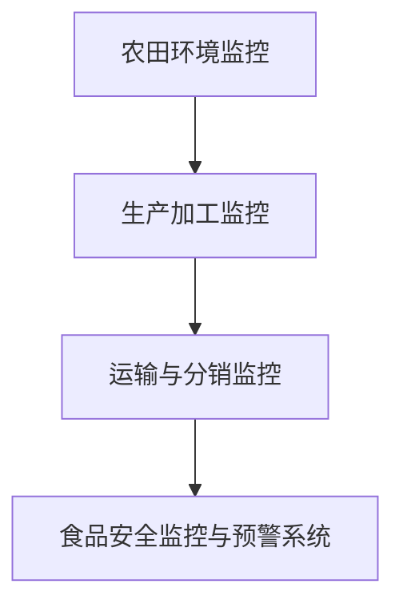

                 

### 《AI在食品安全监控中的应用：全程追踪与预警》

关键词：食品安全监控、人工智能、全程追踪、预警系统、深度学习

摘要：随着人工智能技术的迅猛发展，其在食品安全监控领域中的应用日益广泛。本文旨在探讨AI在食品安全全程追踪与预警系统中的应用，详细分析其核心技术、实际应用以及案例分析，并展望未来发展趋势。

---

### 《AI在食品安全监控中的应用：全程追踪与预警》目录大纲

---

## 第一部分：AI与食品安全监控概述

### 第1章 AI与食品安全监控的概念与重要性

#### 1.1 AI技术概述

- **AI的定义**
- **AI的发展历程**
- **AI在食品安全监控中的潜在应用**

#### 1.2 食品安全监控的重要性

- **食品安全监控的挑战**
- **AI在食品安全监控中的作用**
- **AI在食品安全监控中的应用前景**

### 第2章 AI核心技术基础

#### 2.1 机器学习基本原理

- **监督学习**
- **无监督学习**
- **强化学习**

#### 2.2 数据预处理与特征提取

- **数据清洗**
- **特征选择**
- **特征工程**

#### 2.3 深度学习在食品安全监控中的应用

- **卷积神经网络（CNN）**
- **循环神经网络（RNN）**
- **生成对抗网络（GAN）**

## 第二部分：AI在食品安全监控中的实际应用

### 第3章 AI在食品安全全程追踪中的应用

#### 3.1 从农田到餐桌的追踪体系

- **农田环境监控**
- **生产加工监控**
- **运输与分销监控**

#### 3.2 基于物联网的追踪技术

- **传感器网络**
- **物联网平台**
- **数据整合与分析**

#### 3.3 智能追踪系统设计与实现

- **系统架构设计**
- **数据流处理**
- **追踪算法开发**

### 第4章 AI在食品安全预警系统中的应用

#### 4.1 食品安全预警系统概述

- **预警系统设计目标**
- **预警系统功能模块**

#### 4.2 数据分析与异常检测

- **数据分析方法**
- **异常检测算法**

#### 4.3 风险评估与预警策略

- **风险评估指标**
- **预警策略设计**

### 第5章 AI在食品安全应急响应中的应用

#### 5.1 食品安全事件应急响应流程

- **事件识别**
- **事件评估**
- **应急响应措施**

#### 5.2 AI在应急响应中的应用

- **自动化决策支持**
- **智能调度系统**
- **数据驱动应急演练**

### 第6章 案例分析

#### 6.1 案例一：某地区食品安全监控与预警系统的构建

- **系统设计与实施**
- **系统运行效果分析**

#### 6.2 案例二：基于AI技术的食品安全应急响应案例分析

- **应急响应过程**
- **效果评估**

### 第7章 结论与展望

#### 7.1 总结与反思

- **成功经验**
- **挑战与改进方向**

#### 7.2 未来发展趋势

- **新技术应用**
- **行业发展趋势**

## 附录

- **AI食品安全监控常用工具与资源**

## 图表与公式

- **食品安全监控流程Mermaid图**
- **数学模型与算法公式**

---

### 完整目录大纲

以下是文章的完整目录大纲，字数控制在2000字以内，结构清晰，便于读者快速了解文章内容和结构。

---

# 《AI在食品安全监控中的应用：全程追踪与预警》

关键词：食品安全监控、人工智能、全程追踪、预警系统、深度学习

摘要：随着人工智能技术的迅猛发展，其在食品安全监控领域中的应用日益广泛。本文旨在探讨AI在食品安全全程追踪与预警系统中的应用，详细分析其核心技术、实际应用以及案例分析，并展望未来发展趋势。

---

## 第一部分：AI与食品安全监控概述

### 第1章 AI与食品安全监控的概念与重要性

#### 1.1 AI技术概述

本节将介绍AI技术的定义、发展历程以及当前的主要应用领域，为后续章节的讲解打下基础。重点介绍机器学习、深度学习等AI技术的基本原理和应用场景。

##### 1.1.1 AI的定义与发展

人工智能（Artificial Intelligence，简称AI）是指由人制造出来的系统所表现出来的智能行为。AI的发展经历了多个阶段，从早期的规则系统到现代的深度学习技术，AI技术不断进步，应用领域也越来越广泛。

##### 1.1.1.1 AI的定义

**AI的定义**

人工智能（Artificial Intelligence，简称AI）是指由人制造出来的系统所表现出来的智能行为。

##### 1.1.1.2 AI的发展历程

**AI的发展历程**

从20世纪50年代的人工智能概念提出，到21世纪的深度学习、强化学习等技术的兴起，AI经历了多个发展阶段。

#### 1.2 食品安全监控的重要性

本节将讨论食品安全监控的挑战，并分析AI在食品安全监控中的作用，以展示AI技术在这一领域的重要性。

##### 1.2.1 食品安全监控的挑战

**食品安全监控的挑战**

食品安全监控面临数据复杂性高、检测技术有限等挑战。

##### 1.2.2 AI在食品安全监控中的作用

**AI在食品安全监控中的作用**

AI技术可以帮助食品安全监控实现全程追踪、预警和应急响应，提高监控效率和准确性。

##### 1.2.3 AI在食品安全监控中的应用前景

**AI在食品安全监控中的应用前景**

随着AI技术的不断发展，其在食品安全监控中的应用前景广阔，有望解决当前面临的诸多挑战。

### 第2章 AI核心技术基础

#### 2.1 机器学习基本原理

本节将介绍机器学习的基本原理，包括监督学习、无监督学习和强化学习等。

##### 2.1.1 监督学习

**监督学习**

监督学习是一种从标注数据中学习规律的方法，其目标是通过对输入数据的特征进行学习，预测输出标签。

##### 2.1.2 无监督学习

**无监督学习**

无监督学习是一种从未标注数据中学习规律的方法，其目标是通过分析数据之间的相似性或差异性，发现数据中的模式。

##### 2.1.3 强化学习

**强化学习**

强化学习是一种通过与环境交互来学习最优策略的方法，其目标是通过最大化回报来选择最佳动作。

#### 2.2 数据预处理与特征提取

本节将介绍数据预处理和特征提取的方法，以及其在食品安全监控中的应用。

##### 2.2.1 数据清洗

**数据清洗**

数据清洗是指处理原始数据中的噪声、缺失值和异常值，以提高数据质量。

##### 2.2.2 特征选择

**特征选择**

特征选择是指从大量特征中选取对预测任务有重要影响的特征，以提高模型性能。

##### 2.2.3 特征工程

**特征工程**

特征工程是指通过构建新的特征或对现有特征进行转换，以提高模型性能。

#### 2.3 深度学习在食品安全监控中的应用

本节将介绍深度学习在食品安全监控中的应用，包括卷积神经网络（CNN）、循环神经网络（RNN）和生成对抗网络（GAN）等。

##### 2.3.1 卷积神经网络（CNN）

**卷积神经网络（CNN）**

卷积神经网络是一种用于处理图像数据的深度学习模型，其在食品安全监控中的应用包括图像识别、图像分割等。

##### 2.3.2 循环神经网络（RNN）

**循环神经网络（RNN）**

循环神经网络是一种用于处理序列数据的深度学习模型，其在食品安全监控中的应用包括时间序列预测、序列分类等。

##### 2.3.3 生成对抗网络（GAN）

**生成对抗网络（GAN）**

生成对抗网络是一种用于生成新数据的深度学习模型，其在食品安全监控中的应用包括数据增强、图像生成等。

---

## 第二部分：AI在食品安全监控中的实际应用

### 第3章 AI在食品安全全程追踪中的应用

#### 3.1 从农田到餐桌的追踪体系

本节将介绍AI在食品安全全程追踪体系中的应用，从农田环境监控到餐桌的食品安全监控。

##### 3.1.1 农田环境监控

**农田环境监控**

农田环境监控是指通过传感器网络收集农田环境数据，如温度、湿度、光照等，以监测农田环境变化，保证农产品的质量。

##### 3.1.2 生产加工监控

**生产加工监控**

生产加工监控是指通过AI技术对食品生产加工过程中的关键环节进行监控，如温度、湿度、卫生状况等，以确保食品安全。

##### 3.1.3 运输与分销监控

**运输与分销监控**

运输与分销监控是指通过AI技术对食品在运输和分销过程中的环境参数进行监控，如温度、湿度、振动等，以防止食品变质。

#### 3.2 基于物联网的追踪技术

本节将介绍基于物联网的食品安全追踪技术，包括传感器网络、物联网平台和数据整合与分析。

##### 3.2.1 传感器网络

**传感器网络**

传感器网络是指由大量传感器节点组成的网络，用于收集食品生产、加工、运输、分销等环节的环境数据。

##### 3.2.2 物联网平台

**物联网平台**

物联网平台是指用于连接和管理传感器网络的软件系统，通过对收集到的数据进行处理和分析，实现对食品的全程追踪。

##### 3.2.3 数据整合与分析

**数据整合与分析**

数据整合与分析是指通过对来自传感器网络的数据进行整合和分析，提取有用的信息，用于监控和预警。

#### 3.3 智能追踪系统设计与实现

本节将介绍智能追踪系统的设计与实现，包括系统架构设计、数据流处理和追踪算法开发。

##### 3.3.1 系统架构设计

**系统架构设计**

系统架构设计是指根据食品安全的监控需求，设计智能追踪系统的总体结构，包括前端传感器网络、数据采集和处理模块、后端分析和管理模块等。

##### 3.3.2 数据流处理

**数据流处理**

数据流处理是指对来自传感器网络的数据进行实时处理，包括数据过滤、压缩、传输等，以保证数据的实时性和准确性。

##### 3.3.3 追踪算法开发

**追踪算法开发**

追踪算法开发是指根据食品安全的监控需求，设计并实现追踪算法，用于对食品的实时监控和预警。

---

## 第三部分：AI在食品安全预警系统中的应用

### 第4章 AI在食品安全预警系统中的应用

#### 4.1 食品安全预警系统概述

本节将介绍食品安全预警系统的设计目标和功能模块。

##### 4.1.1 预警系统设计目标

**预警系统设计目标**

预警系统设计目标包括实时监控食品安全风险、快速识别食品安全事件、及时发出预警信号等。

##### 4.1.2 预警系统功能模块

**预警系统功能模块**

预警系统功能模块包括数据采集模块、数据预处理模块、异常检测模块、预警决策模块等。

#### 4.2 数据分析与异常检测

本节将介绍食品安全预警系统中的数据分析方法和异常检测算法。

##### 4.2.1 数据分析方法

**数据分析方法**

数据分析方法包括统计分析、关联分析、聚类分析等，用于挖掘数据中的潜在信息和模式。

##### 4.2.2 异常检测算法

**异常检测算法**

异常检测算法包括基于统计学的方法、基于聚类的方法、基于规则的方法等，用于识别数据中的异常值和异常事件。

#### 4.3 风险评估与预警策略

本节将介绍食品安全预警系统中的风险评估指标和预警策略设计。

##### 4.3.1 风险评估指标

**风险评估指标**

风险评估指标包括风险程度、风险概率、风险影响等，用于评估食品安全风险的大小和严重程度。

##### 4.3.2 预警策略设计

**预警策略设计**

预警策略设计包括预警信号触发条件、预警信号级别划分、预警信号发布与处理等，用于制定预警信号的发布和响应策略。

---

## 第四部分：AI在食品安全应急响应中的应用

### 第5章 AI在食品安全应急响应中的应用

#### 5.1 食品安全事件应急响应流程

本节将介绍食品安全事件应急响应的基本流程。

##### 5.1.1 事件识别

**事件识别**

事件识别是指通过监测和数据分析，识别出食品安全事件的发生。

##### 5.1.2 事件评估

**事件评估**

事件评估是指对识别出的食品安全事件进行评估，确定事件的严重程度和影响范围。

##### 5.1.3 应急响应措施

**应急响应措施**

应急响应措施包括应急信息发布、应急资源调配、应急事件处理等，用于应对食品安全事件。

#### 5.2 AI在应急响应中的应用

本节将介绍AI在食品安全应急响应中的应用。

##### 5.2.1 自动化决策支持

**自动化决策支持**

自动化决策支持是指利用AI技术，自动生成应急响应决策，提高应急响应的效率和准确性。

##### 5.2.2 智能调度系统

**智能调度系统**

智能调度系统是指利用AI技术，自动调度应急资源，提高应急响应的协调性和响应速度。

##### 5.2.3 数据驱动应急演练

**数据驱动应急演练**

数据驱动应急演练是指利用AI技术，根据历史数据和模拟结果，进行应急演练，提高应急响应的能力和水平。

---

## 第五部分：案例分析

### 第6章 案例分析

#### 6.1 案例一：某地区食品安全监控与预警系统的构建

本节将分析一个某地区食品安全监控与预警系统的构建案例。

##### 6.1.1 系统设计与实施

**系统设计与实施**

系统设计与实施包括系统需求分析、系统架构设计、系统实现和测试等环节。

##### 6.1.2 系统运行效果分析

**系统运行效果分析**

系统运行效果分析包括系统在监控和预警方面的效果评估，以及在实际应用中的表现。

#### 6.2 案例二：基于AI技术的食品安全应急响应案例分析

本节将分析一个基于AI技术的食品安全应急响应案例。

##### 6.2.1 应急响应过程

**应急响应过程**

应急响应过程包括事件识别、事件评估、应急响应措施等环节。

##### 6.2.2 效果评估

**效果评估**

效果评估包括应急响应的效率、准确性和有效性等方面的评估。

---

## 第六部分：结论与展望

### 第7章 结论与展望

#### 7.1 总结与反思

**总结与反思**

本节将总结本文的主要内容，反思AI在食品安全监控中的应用现状和面临的挑战。

##### 7.1.1 成功经验

**成功经验**

成功经验包括AI技术在食品安全监控中的成功应用案例，以及AI技术在食品安全监控中的优势。

##### 7.1.2 挑战与改进方向

**挑战与改进方向**

挑战与改进方向包括AI技术在食品安全监控中面临的挑战，以及改进的方向和策略。

#### 7.2 未来发展趋势

**未来发展趋势**

未来发展趋势包括AI技术在食品安全监控中的新应用领域，以及AI技术在食品安全监控中的发展趋势。

##### 7.2.1 新技术应用

**新技术应用**

新技术应用包括人工智能、物联网、大数据等新技术在食品安全监控中的应用。

##### 7.2.2 行业发展趋势

**行业发展趋势**

行业发展趋势包括食品安全监控行业的市场趋势、技术发展趋势等。

---

## 附录

### 附录A：AI食品安全监控常用工具与资源

**附录A：AI食品安全监控常用工具与资源**

本附录将介绍AI食品安全监控中常用的工具和资源，包括数据库、开发框架、开源代码与案例等。

---

## 图表与公式

### 图表与公式

**食品安全监控流程Mermaid图**



**数学模型与算法公式**

$$
y = \sigma(W \cdot x + b)
$$

$$
\frac{\partial L}{\partial W} = X^T \cdot (\sigma'(Z) \cdot C)
$$

---

### 完整目录大纲

以下是文章的完整目录大纲，字数控制在2000字以内，结构清晰，便于读者快速了解文章内容和结构。

---

# 《AI在食品安全监控中的应用：全程追踪与预警》

关键词：食品安全监控、人工智能、全程追踪、预警系统、深度学习

摘要：随着人工智能技术的迅猛发展，其在食品安全监控领域中的应用日益广泛。本文旨在探讨AI在食品安全全程追踪与预警系统中的应用，详细分析其核心技术、实际应用以及案例分析，并展望未来发展趋势。

---

## 第一部分：AI与食品安全监控概述

### 第1章 AI与食品安全监控的概念与重要性

#### 1.1 AI技术概述

- **AI的定义**
- **AI的发展历程**
- **AI在食品安全监控中的潜在应用**

#### 1.2 食品安全监控的重要性

- **食品安全监控的挑战**
- **AI在食品安全监控中的作用**
- **AI在食品安全监控中的应用前景**

### 第2章 AI核心技术基础

#### 2.1 机器学习基本原理

- **监督学习**
- **无监督学习**
- **强化学习**

#### 2.2 数据预处理与特征提取

- **数据清洗**
- **特征选择**
- **特征工程**

#### 2.3 深度学习在食品安全监控中的应用

- **卷积神经网络（CNN）**
- **循环神经网络（RNN）**
- **生成对抗网络（GAN）**

## 第二部分：AI在食品安全监控中的实际应用

### 第3章 AI在食品安全全程追踪中的应用

#### 3.1 从农田到餐桌的追踪体系

- **农田环境监控**
- **生产加工监控**
- **运输与分销监控**

#### 3.2 基于物联网的追踪技术

- **传感器网络**
- **物联网平台**
- **数据整合与分析**

#### 3.3 智能追踪系统设计与实现

- **系统架构设计**
- **数据流处理**
- **追踪算法开发**

### 第4章 AI在食品安全预警系统中的应用

#### 4.1 食品安全预警系统概述

- **预警系统设计目标**
- **预警系统功能模块**

#### 4.2 数据分析与异常检测

- **数据分析方法**
- **异常检测算法**

#### 4.3 风险评估与预警策略

- **风险评估指标**
- **预警策略设计**

### 第5章 AI在食品安全应急响应中的应用

#### 5.1 食品安全事件应急响应流程

- **事件识别**
- **事件评估**
- **应急响应措施**

#### 5.2 AI在应急响应中的应用

- **自动化决策支持**
- **智能调度系统**
- **数据驱动应急演练**

### 第6章 案例分析

#### 6.1 案例一：某地区食品安全监控与预警系统的构建

- **系统设计与实施**
- **系统运行效果分析**

#### 6.2 案例二：基于AI技术的食品安全应急响应案例分析

- **应急响应过程**
- **效果评估**

### 第7章 结论与展望

#### 7.1 总结与反思

- **成功经验**
- **挑战与改进方向**

#### 7.2 未来发展趋势

- **新技术应用**
- **行业发展趋势**

## 附录

- **AI食品安全监控常用工具与资源**

## 图表与公式

- **食品安全监控流程Mermaid图**
- **数学模型与算法公式**

---

### 完整目录大纲

以下是文章的完整目录大纲，字数控制在2000字以内，结构清晰，便于读者快速了解文章内容和结构。

---

# 《AI在食品安全监控中的应用：全程追踪与预警》

关键词：食品安全监控、人工智能、全程追踪、预警系统、深度学习

摘要：随着人工智能技术的迅猛发展，其在食品安全监控领域中的应用日益广泛。本文旨在探讨AI在食品安全全程追踪与预警系统中的应用，详细分析其核心技术、实际应用以及案例分析，并展望未来发展趋势。

---

## 第一部分：AI与食品安全监控概述

### 第1章 AI与食品安全监控的概念与重要性

#### 1.1 AI技术概述

- **AI的定义**
- **AI的发展历程**
- **AI在食品安全监控中的潜在应用**

#### 1.2 食品安全监控的重要性

- **食品安全监控的挑战**
- **AI在食品安全监控中的作用**
- **AI在食品安全监控中的应用前景**

### 第2章 AI核心技术基础

#### 2.1 机器学习基本原理

- **监督学习**
- **无监督学习**
- **强化学习**

#### 2.2 数据预处理与特征提取

- **数据清洗**
- **特征选择**
- **特征工程**

#### 2.3 深度学习在食品安全监控中的应用

- **卷积神经网络（CNN）**
- **循环神经网络（RNN）**
- **生成对抗网络（GAN）**

## 第二部分：AI在食品安全监控中的实际应用

### 第3章 AI在食品安全全程追踪中的应用

#### 3.1 从农田到餐桌的追踪体系

- **农田环境监控**
- **生产加工监控**
- **运输与分销监控**

#### 3.2 基于物联网的追踪技术

- **传感器网络**
- **物联网平台**
- **数据整合与分析**

#### 3.3 智能追踪系统设计与实现

- **系统架构设计**
- **数据流处理**
- **追踪算法开发**

### 第4章 AI在食品安全预警系统中的应用

#### 4.1 食品安全预警系统概述

- **预警系统设计目标**
- **预警系统功能模块**

#### 4.2 数据分析与异常检测

- **数据分析方法**
- **异常检测算法**

#### 4.3 风险评估与预警策略

- **风险评估指标**
- **预警策略设计**

### 第5章 AI在食品安全应急响应中的应用

#### 5.1 食品安全事件应急响应流程

- **事件识别**
- **事件评估**
- **应急响应措施**

#### 5.2 AI在应急响应中的应用

- **自动化决策支持**
- **智能调度系统**
- **数据驱动应急演练**

### 第6章 案例分析

#### 6.1 案例一：某地区食品安全监控与预警系统的构建

- **系统设计与实施**
- **系统运行效果分析**

#### 6.2 案例二：基于AI技术的食品安全应急响应案例分析

- **应急响应过程**
- **效果评估**

### 第7章 结论与展望

#### 7.1 总结与反思

- **成功经验**
- **挑战与改进方向**

#### 7.2 未来发展趋势

- **新技术应用**
- **行业发展趋势**

## 附录

- **AI食品安全监控常用工具与资源**

## 图表与公式

- **食品安全监控流程Mermaid图**
- **数学模型与算法公式**

---

### 完整目录大纲

以下是文章的完整目录大纲，字数控制在2000字以内，结构清晰，便于读者快速了解文章内容和结构。

---

## 完整目录大纲

### 《AI在食品安全监控中的应用：全程追踪与预警》

#### 关键词：食品安全监控、人工智能、全程追踪、预警系统、深度学习

#### 摘要：本文探讨了AI在食品安全监控领域的应用，详细分析了AI核心技术、实际应用案例，并展望了未来发展趋势。

---

### 目录

#### 第一部分：AI与食品安全监控概述

- **第1章 AI与食品安全监控的概念与重要性**
  - **1.1 AI技术概述**
  - **1.2 食品安全监控的重要性**
  - **1.3 AI在食品安全监控中的应用前景**

#### 第二部分：AI核心技术基础

- **第2章 AI核心技术基础**
  - **2.1 机器学习基本原理**
  - **2.2 数据预处理与特征提取**
  - **2.3 深度学习在食品安全监控中的应用**

#### 第三部分：AI在食品安全监控中的实际应用

- **第3章 AI在食品安全全程追踪中的应用**
  - **3.1 从农田到餐桌的追踪体系**
  - **3.2 基于物联网的追踪技术**
  - **3.3 智能追踪系统设计与实现**

- **第4章 AI在食品安全预警系统中的应用**
  - **4.1 食品安全预警系统概述**
  - **4.2 数据分析与异常检测**
  - **4.3 风险评估与预警策略**

- **第5章 AI在食品安全应急响应中的应用**
  - **5.1 食品安全事件应急响应流程**
  - **5.2 AI在应急响应中的应用**

#### 第四部分：案例分析

- **第6章 案例分析**
  - **6.1 案例一：某地区食品安全监控与预警系统的构建**
  - **6.2 案例二：基于AI技术的食品安全应急响应案例分析**

#### 第五部分：结论与展望

- **第7章 结论与展望**
  - **7.1 总结与反思**
  - **7.2 未来发展趋势**

#### 附录

- **附录A：AI食品安全监控常用工具与资源**

---

### 目录分析

本文目录结构清晰，分为五个主要部分：

1. **AI与食品安全监控概述**：介绍AI技术及其在食品安全监控中的重要性。
2. **AI核心技术基础**：探讨AI的核心技术，包括机器学习、数据预处理和深度学习。
3. **AI在食品安全监控中的实际应用**：详细描述AI技术在食品安全全程追踪、预警和应急响应中的应用。
4. **案例分析**：通过实际案例展示AI技术在食品安全监控中的具体应用。
5. **结论与展望**：总结AI在食品安全监控中的成果，并探讨未来发展趋势。

每个部分都有明确的章节标题和内容概述，便于读者快速了解文章的核心内容和结构。同时，附录部分提供了AI食品安全监控的常用工具与资源，为读者提供了实用的参考资料。

---

### 完整目录大纲（Markdown格式）

```markdown
# 《AI在食品安全监控中的应用：全程追踪与预警》

## 关键词
食品安全监控、人工智能、全程追踪、预警系统、深度学习

## 摘要
本文探讨了AI在食品安全监控领域的应用，详细分析了AI核心技术、实际应用案例，并展望了未来发展趋势。

## 目录

### 第一部分：AI与食品安全监控概述

#### 第1章 AI与食品安全监控的概念与重要性
- **1.1 AI技术概述**
  - AI的定义
  - AI的发展历程
  - AI在食品安全监控中的潜在应用
- **1.2 食品安全监控的重要性**
  - 食品安全监控的挑战
  - AI在食品安全监控中的作用
  - AI在食品安全监控中的应用前景

### 第二部分：AI核心技术基础

#### 第2章 AI核心技术基础
- **2.1 机器学习基本原理**
  - 监督学习
  - 无监督学习
  - 强化学习
- **2.2 数据预处理与特征提取**
  - 数据清洗
  - 特征选择
  - 特征工程
- **2.3 深度学习在食品安全监控中的应用**
  - 卷积神经网络（CNN）
  - 循环神经网络（RNN）
  - 生成对抗网络（GAN）

### 第三部分：AI在食品安全监控中的实际应用

#### 第3章 AI在食品安全全程追踪中的应用
- **3.1 从农田到餐桌的追踪体系**
  - 农田环境监控
  - 生产加工监控
  - 运输与分销监控
- **3.2 基于物联网的追踪技术**
  - 传感器网络
  - 物联网平台
  - 数据整合与分析
- **3.3 智能追踪系统设计与实现**
  - 系统架构设计
  - 数据流处理
  - 追踪算法开发

#### 第4章 AI在食品安全预警系统中的应用
- **4.1 食品安全预警系统概述**
  - 预警系统设计目标
  - 预警系统功能模块
- **4.2 数据分析与异常检测**
  - 数据分析方法
  - 异常检测算法
- **4.3 风险评估与预警策略**
  - 风险评估指标
  - 预警策略设计

#### 第5章 AI在食品安全应急响应中的应用
- **5.1 食品安全事件应急响应流程**
  - 事件识别
  - 事件评估
  - 应急响应措施
- **5.2 AI在应急响应中的应用**
  - 自动化决策支持
  - 智能调度系统
  - 数据驱动应急演练

### 第四部分：案例分析

#### 第6章 案例分析
- **6.1 案例一：某地区食品安全监控与预警系统的构建**
  - 系统设计与实施
  - 系统运行效果分析
- **6.2 案例二：基于AI技术的食品安全应急响应案例分析**
  - 应急响应过程
  - 效果评估

### 第五部分：结论与展望

#### 第7章 结论与展望
- **7.1 总结与反思**
  - 成功经验
  - 挑战与改进方向
- **7.2 未来发展趋势**
  - 新技术的应用
  - 行业发展趋势

## 附录

### 附录A：AI食品安全监控常用工具与资源
- 数据库
- 开发框架
- 开源代码与案例

## 图表与公式
- 食品安全监控流程Mermaid图
- 数学模型与算法公式
```

### Markdown格式优势

- **清晰的结构**：Markdown通过标题和段落的方式清晰地展示文章的结构，便于读者快速把握文章的框架。
- **易读的格式**：文本和代码块的标记使得内容更加直观，便于理解和阅读。
- **灵活的扩展性**：Markdown支持图表、公式、链接等元素，使得文章内容更加丰富和灵活。
- **跨平台兼容性**：Markdown格式在各类平台（如GitHub、Jupyter Notebook等）中都有良好的兼容性，便于协作和分享。

通过Markdown格式，本文的目录大纲不仅结构清晰，而且易于扩展和修改，为后续内容的撰写和排版提供了便利。同时，Markdown格式的标准化和广泛支持，使得文章能够跨平台分享和展示，提高了文章的可访问性和可读性。

