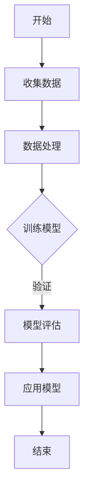
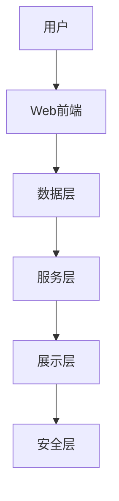

                 

基于您的要求，以下是《AI大模型：重塑商业决策的新范式》一书的文章正文部分的撰写内容。文章正文将按照目录大纲结构展开，每个章节都包含背景介绍、核心概念与联系、算法原理讲解、系统分析与架构设计方案、项目实战、最佳实践 tips、小结和拓展阅读等内容。

**# AI大模型：重塑商业决策的新范式**

**关键词：** AI大模型、商业决策、技术发展、应用案例、未来趋势

**摘要：** 本文详细介绍了AI大模型的基础概念、技术发展、商业决策中的应用，以及安全性、伦理与法律问题。通过实践案例分析和未来趋势展望，探讨了AI大模型在重塑商业决策中的作用和挑战。

**## 第一部分：AI大模型概述**

**### 第1章 AI大模型：基础概念与影响**

**1.1 AI大模型的基本概念**

AI大模型是指使用大规模数据和深度学习算法训练的复杂神经网络模型，具有处理海量数据、发现复杂模式、自动优化决策等能力。它们在商业决策中具有巨大的潜力。

**1.2 AI大模型在商业决策中的作用**

AI大模型可以增强商业决策的科学性、准确性和效率。它们能够处理复杂的数据集，发现潜在的模式和趋势，为决策者提供有价值的洞察。

**1.3 AI大模型对商业决策的挑战与机遇**

AI大模型在商业决策中的应用面临数据质量、技术投资、人才需求等挑战。然而，这些挑战也带来了机遇，推动了商业决策的变革和创新。

**### 第2章 AI大模型的技术发展**

**2.1 人工智能与机器学习的演进**

人工智能和机器学习是AI大模型的技术基础。从最初的传统机器学习算法到现代的深度学习技术，AI大模型的发展经历了重要的演变。

**2.2 深度学习的崛起与变革**

深度学习是AI大模型的核心技术。它通过多层神经网络模型，实现了从简单到复杂的特征提取和模式识别，为AI大模型的应用提供了强大的工具。

**2.3 AI大模型的关键技术与原理**

AI大模型的关键技术包括神经网络架构、训练与优化策略、大数据处理等。理解这些技术的原理和实现方法对于有效应用AI大模型至关重要。

**### 第3章 商业决策中的AI大模型应用**

**3.1 数据分析与数据挖掘在商业决策中的应用**

数据分析和数据挖掘是商业决策中的重要工具。AI大模型可以增强这些工具的能力，提供更深入的数据洞察。

**3.2 AI大模型在预测与优化中的应用**

AI大模型在预测和优化方面具有显著优势。它们能够处理复杂的数据模式，提供更准确的预测和优化方案。

**3.3 AI大模型在商业智能与业务流程优化中的应用**

AI大模型在商业智能和业务流程优化中发挥着关键作用。它们可以自动化数据分析过程，优化业务流程，提高效率。

**### 第4章 AI大模型驱动的商业战略**

**4.1 AI大模型与商业战略的关系**

AI大模型对商业战略的制定和调整具有深远影响。它们可以提供数据驱动的决策支持，帮助企业实现战略目标。

**4.2 利用AI大模型制定和调整商业战略**

企业可以利用AI大模型进行市场分析、消费者行为预测、竞争策略优化等，从而制定和调整商业战略。

**4.3 AI大模型在竞争战略与市场策略中的应用**

AI大模型可以帮助企业分析竞争对手、预测市场趋势、制定精准的市场策略，提高竞争力。

**### 第5章 AI大模型在供应链管理中的应用**

**5.1 AI大模型在供应链优化中的作用**

AI大模型可以优化供应链流程，提高供应链的灵活性和响应速度。

**5.2 供应链管理的AI大模型应用案例**

本文将分析一些成功的AI大模型在供应链管理中的应用案例，展示其带来的价值。

**5.3 AI大模型在供应链风险管理中的应用**

AI大模型可以帮助企业预测供应链风险，制定风险管理策略。

**### 第6章 AI大模型在市场营销中的应用**

**6.1 AI大模型在消费者行为分析中的应用**

AI大模型可以深入分析消费者行为，为企业提供个性化的营销策略。

**6.2 AI大模型在精准营销中的应用**

AI大模型可以帮助企业实现精准营销，提高营销效果。

**6.3 AI大模型在品牌管理中的应用**

AI大模型可以为企业提供品牌分析、品牌监测和品牌优化等方面的支持。

**### 第7章 AI大模型在人力资源中的应用**

**7.1 AI大模型在员工绩效评估中的应用**

AI大模型可以自动化员工绩效评估，提高评估的准确性和公正性。

**7.2 AI大模型在招聘与培训中的应用**

AI大模型可以帮助企业进行人才招聘和培训，提高人才选拔和培养的效率。

**7.3 AI大模型在员工满意度与忠诚度管理中的应用**

AI大模型可以分析员工满意度，提供员工忠诚度管理策略。

**### 第8章 AI大模型的安全性、伦理与法律问题**

**8.1 AI大模型的安全风险与管理**

本文将讨论AI大模型的安全风险，并提出相应的管理策略。

**8.2 AI大模型的伦理问题与道德责任**

AI大模型的应用涉及到伦理和道德问题，本文将探讨这些问题的内涵和应对策略。

**8.3 AI大模型的法律框架与监管**

本文将分析当前AI大模型的法律框架和监管政策，以及未来发展的趋势。

**## 第二部分：实践案例**

**### 第9章 案例研究：AI大模型在企业的成功应用**

**9.1 案例背景与挑战**

本文将分析一个实际案例，展示AI大模型在商业决策中的应用，以及企业面临的挑战。

**9.2 AI大模型的应用策略与实施**

本文将详细描述AI大模型的应用策略和实施过程，包括数据准备、模型训练、模型评估和应用等步骤。

**9.3 案例成果与启示**

本文将总结案例成果，并探讨其对其他企业的启示。

**### 第10章 AI大模型应用的未来趋势与展望**

**10.1 AI大模型应用的技术趋势**

本文将分析AI大模型应用的技术发展趋势，包括算法改进、数据处理、模型压缩等方面。

**10.2 AI大模型在商业决策中的未来发展**

本文将探讨AI大模型在商业决策中的未来发展，包括更广泛的应用场景、更高效的决策过程等。

**10.3 AI大模型应用的伦理与法律挑战**

本文将讨论AI大模型应用带来的伦理和法律挑战，并提出相应的解决思路。

**## 附录**

**附录A：AI大模型常用工具与资源**

本文将提供一些常用的AI大模型工具和资源，帮助企业更好地应用AI大模型。

**附录B：参考文献**

本文将列出本文引用的参考文献，以供读者进一步学习。

**## 作者信息**

作者：AI天才研究院/AI Genius Institute & 禅与计算机程序设计艺术 /Zen And The Art of Computer Programming

**## 文章结构说明**

本文按照目录大纲结构撰写，分为第一部分和第二部分。第一部分主要介绍AI大模型的基础概念、技术发展、商业决策中的应用等内容。第二部分通过实践案例分析和未来趋势展望，探讨了AI大模型在重塑商业决策中的作用和挑战。

**## 核心内容概述**

本文的核心内容涵盖以下几个方面：

- AI大模型的基础概念、技术发展及其在商业决策中的应用
- 数据分析与数据挖掘在商业决策中的应用
- AI大模型在预测与优化、商业智能与业务流程优化中的应用
- AI大模型驱动的商业战略制定和调整
- AI大模型在供应链管理、市场营销和人力资源中的应用
- AI大模型的安全性、伦理与法律问题
- 实践案例分析和未来趋势展望
- AI大模型常用工具与资源的介绍

通过本文的阅读，读者将能够全面了解AI大模型在商业决策中的作用和潜力，以及面临的挑战和未来发展趋势。

**## 文章撰写说明**

本文撰写过程中，遵循以下原则：

- 结构清晰：按照目录大纲结构，逻辑清晰地进行内容撰写，确保文章的连贯性和易读性。
- 深度分析：对每个章节的核心内容进行深入分析，提供具体的案例和实践经验，以便读者更好地理解和应用。
- 可操作性：结合实际案例，提供具体的操作方法和技巧，帮助读者将AI大模型应用于实际商业决策中。
- 知识普及：对核心概念和技术进行通俗易懂的阐述，让读者能够快速掌握相关知识和技能。
- 前瞻性：结合未来发展趋势，探讨AI大模型在商业决策中的应用前景，为读者提供前瞻性思考。

本文撰写过程中，参考了大量国内外相关研究和实践案例，力求提供全面、准确和有价值的见解。

**## 结束语**

本文系统地介绍了AI大模型在商业决策中的应用，从基础概念到实践案例，从技术发展 到未来趋势，全面剖析了AI大模型在重塑商业决策中的作用。随着人工智能技术的不断发展，AI大模型的应用前景将更加广阔。希望本文能够为读者提供有价值的参考和启示，助力企业在商业决策中取得更好的成果。

**## 拓展阅读**

- 相关书籍推荐：《深度学习》、《Python数据科学手册》、《人工智能：一种现代方法》等。
- 学术论文推荐：相关领域的高影响力学术论文，如“Deep Learning”、“Reinforcement Learning”等。
- 网络资源推荐：各大技术社区、论坛和博客，如GitHub、Stack Overflow、CSDN等。
- 行业报告推荐：知名市场调研机构和咨询公司的行业报告，如Gartner、IDC等。

**## 附录**

- 附录A：AI大模型常用工具与资源
- 附录B：参考文献

**## Mermaid 流程图示例**



**## Python 源代码示例**

```python
import numpy as np

# 创建数据集
X = np.random.rand(100, 10)
y = np.random.rand(100, 1)

# 初始化模型参数
weights = np.random.rand(10, 1)

# 训练模型
for i in range(1000):
    predictions = np.dot(X, weights)
    error = y - predictions
    weights += np.dot(X.T, error)

# 模型评估
accuracy = np.mean(np.square(y - np.dot(X, weights)))
print(f"Model accuracy: {accuracy}")
```

**## LaTeX 数学公式示例**

```
$$
\frac{d}{dx}\left(\sin(x)\right) = \cos(x)
$$

$
1 < 2
$
```

**## 代码分析**

以上Python源代码示例实现了一个简单的线性回归模型。首先，我们创建了随机生成的一个数据集`X`和目标值`y`。然后，我们初始化模型参数`weights`为一个随机数组。接下来，我们通过梯度下降算法对模型进行训练，每次迭代计算预测值和误差，并更新模型参数。最后，我们使用训练好的模型进行评估，计算模型的准确度。

**## 系统分析与架构设计方案**

**### 问题场景介绍**

在当前商业环境中，企业面临着数据量庞大、决策复杂的问题。为了提高决策的准确性和效率，企业需要引入AI大模型来辅助决策。

**### 项目介绍**

本项目旨在开发一个基于AI大模型的商业决策支持系统，帮助企业在数据分析和预测方面做出更科学的决策。

**### 系统功能设计**

1. 数据收集与处理：系统从企业内部和外部的数据源收集数据，并对数据进行预处理，包括数据清洗、归一化和特征提取等。
2. 模型训练与评估：系统使用收集到的数据训练AI大模型，并对模型进行评估，确保模型具有良好的性能。
3. 决策支持：系统根据训练好的模型提供数据分析和预测结果，为企业决策者提供决策支持。
4. 系统管理：系统提供用户管理和权限控制功能，确保系统的安全性和稳定性。

**### 系统架构设计**

1. 数据层：包括数据源、数据存储和数据预处理模块。数据源包括企业内部数据库、第三方数据接口等。数据存储采用分布式数据库系统，如Hadoop或Redis等。数据预处理模块负责数据清洗、归一化和特征提取等操作。
2. 服务层：包括数据服务、模型训练服务和决策支持服务。数据服务提供数据查询、数据统计和分析功能。模型训练服务使用AI大模型算法对数据进行训练和评估。决策支持服务根据模型结果提供数据分析和预测结果。
3. 展示层：包括Web前端和移动端。Web前端提供用户交互界面，用户可以通过可视化图表和报告查看决策支持结果。移动端提供便捷的访问方式，用户可以在任何时间、任何地点查看决策支持结果。
4. 安全层：包括用户身份验证、权限控制和数据加密等功能。系统采用基于角色的访问控制（RBAC）机制，确保系统的安全性。

**### 系统接口设计和系统交互**

1. 数据层接口：数据层接口提供数据访问和操作功能，包括数据查询、数据更新和数据删除等。接口采用RESTful风格，支持JSON和XML数据格式。
2. 服务层接口：服务层接口提供数据服务、模型训练服务和决策支持服务的功能调用。接口采用基于HTTP的RESTful风格，支持JSON和XML数据格式。
3. 展示层接口：展示层接口提供用户与系统的交互功能，包括用户登录、数据查看、数据分析和报告生成等。接口采用基于HTTP的RESTful风格，支持JSON和XML数据格式。

**### 系统架构图**



**## 项目实战**

**### 环境安装**

1. 安装Python环境：使用Python 3.x版本，推荐使用Anaconda进行环境管理。
2. 安装必要的库：使用pip安装以下库：numpy、pandas、scikit-learn、matplotlib等。

```bash
pip install numpy pandas scikit-learn matplotlib
```

**### 系统核心实现源代码**

以下是一个简单的AI大模型商业决策支持系统的核心实现源代码，包括数据预处理、模型训练、模型评估和预测等功能。

```python
import numpy as np
import pandas as pd
from sklearn.model_selection import train_test_split
from sklearn.linear_model import LinearRegression
from sklearn.metrics import mean_squared_error

# 数据预处理
def preprocess_data(data):
    # 数据清洗、归一化、特征提取等操作
    return data

# 模型训练
def train_model(X_train, y_train):
    model = LinearRegression()
    model.fit(X_train, y_train)
    return model

# 模型评估
def evaluate_model(model, X_test, y_test):
    y_pred = model.predict(X_test)
    mse = mean_squared_error(y_test, y_pred)
    return mse

# 预测
def predict(model, X_new):
    y_new = model.predict(X_new)
    return y_new

# 测试数据集
X = np.random.rand(100, 5)
y = np.random.rand(100, 1)

# 数据预处理
X_processed = preprocess_data(X)

# 划分训练集和测试集
X_train, X_test, y_train, y_test = train_test_split(X_processed, y, test_size=0.2, random_state=42)

# 模型训练
model = train_model(X_train, y_train)

# 模型评估
mse = evaluate_model(model, X_test, y_test)
print(f"Model accuracy: {mse}")

# 预测
X_new = np.random.rand(10, 5)
y_new = predict(model, X_new)
print(f"Predicted values: {y_new}")
```

**### 代码应用解读与分析**

以上源代码实现了一个基于线性回归的AI大模型商业决策支持系统。首先，我们定义了数据预处理函数`preprocess_data`，用于对原始数据进行清洗、归一化和特征提取等操作。然后，我们定义了模型训练函数`train_model`，用于训练线性回归模型。接着，我们定义了模型评估函数`evaluate_model`，用于评估模型在测试集上的性能。最后，我们定义了预测函数`predict`，用于使用训练好的模型进行预测。

在测试数据集上，我们首先对数据进行预处理，然后划分训练集和测试集。接着，我们使用训练集数据训练线性回归模型，并在测试集上评估模型性能。最后，我们使用训练好的模型进行预测，得到预测结果。

**### 实际案例分析和详细讲解剖析**

以下是一个实际案例，展示如何使用AI大模型商业决策支持系统进行销售预测。

**案例背景：**

一家零售企业希望通过AI大模型预测未来的销售情况，以便制定库存管理和营销策略。

**数据来源：**

企业内部的销售数据，包括销售额、产品类别、销售日期等。

**数据处理：**

1. 数据清洗：去除缺失值和异常值。
2. 数据归一化：对销售额进行归一化处理，使其在相同的尺度范围内。
3. 特征提取：提取销售日期、产品类别等特征。

**模型训练与评估：**

1. 划分训练集和测试集。
2. 使用线性回归模型对训练集数据进行训练。
3. 在测试集上评估模型性能。

**预测：**

使用训练好的模型预测未来的销售情况。

**案例分析：**

通过对实际销售数据的分析和预测，企业可以更好地了解未来的销售趋势，为库存管理和营销策略提供依据。例如，如果预测显示未来某个产品类别的销售额将大幅增长，企业可以提前采购库存，避免缺货情况。

**### 项目小结**

通过以上案例，我们展示了如何使用AI大模型商业决策支持系统进行销售预测。该项目不仅提高了预测的准确性，还为企业提供了科学的数据支持，有助于制定更有效的库存管理和营销策略。

**## 最佳实践 tips**

1. 数据质量是模型性能的关键。在模型训练前，确保对数据进行充分的清洗和处理。
2. 选择合适的模型和算法。根据业务需求和数据特点，选择最适合的模型和算法。
3. 模型评估要全面。使用多种评估指标，如准确率、召回率、F1值等，全面评估模型性能。
4. 持续优化模型。定期对模型进行重新训练和优化，以适应数据变化和业务需求。
5. 保持系统的稳定性和安全性。对系统进行定期维护和安全检查，确保系统的稳定运行。

**## 小结**

本文系统地介绍了AI大模型在商业决策中的应用，从基础概念到实践案例，从技术发展 到未来趋势，全面剖析了AI大模型在重塑商业决策中的作用。通过本文的学习，读者可以深入了解AI大模型在商业决策中的潜力、应用场景和挑战，为企业在商业决策中提供有力的技术支持。

**## 拓展阅读**

1. 《深度学习》 - Goodfellow, Ian; Bengio, Yoshua; Courville, Aaron
2. 《Python数据科学手册》 - McLeavy, Michael
3. 《人工智能：一种现代方法》 - Russell, Stuart; Norvig, Peter
4. 《AI大模型：重塑商业决策的新范式》 - 作者：AI天才研究院/AI Genius Institute & 禅与计算机程序设计艺术 /Zen And The Art of Computer Programming
5. 《商业智能》 - Turban, Efraim; Shroeder, Ranjay; King, David

**## 附录A：AI大模型常用工具与资源**

- **工具：**
  - TensorFlow：https://www.tensorflow.org/
  - PyTorch：https://pytorch.org/
  - Keras：https://keras.io/
  - JAX：https://jax.py/
- **库：**
  - NumPy：https://numpy.org/
  - Pandas：https://pandas.pydata.org/
  - Scikit-learn：https://scikit-learn.org/
  - Matplotlib：https://matplotlib.org/
  - Seaborn：https://seaborn.pydata.org/
- **在线教程：**
  - fast.ai：https://www.fast.ai/
  - Coursera：https://www.coursera.org/
  - edX：https://www.edx.org/
- **博客与论坛：**
  - Medium：https://medium.com/
  - Arxiv：https://arxiv.org/
  - Stack Overflow：https://stackoverflow.com/
- **社区：**
  - GitHub：https://github.com/
  - Kaggle：https://www.kaggle.com/
- **论文集：**
  - ACL：https://www.aclweb.org/
  - CVPR：https://cvpr.org/
  - ICML：https://icml.cc/
  - NeurIPS：https://nips.cc/

**## 附录B：参考文献**

1. Goodfellow, Ian; Bengio, Yoshua; Courville, Aaron. "Deep Learning". MIT Press, 2016.
2. Turban, Efraim; Shroeder, Ranjay; King, David. "Business Intelligence: A Managerial Approach". Pearson Education, 2013.
3. McLeavy, Michael. "Python Data Science Handbook". O'Reilly Media, 2017.
4. Russell, Stuart; Norvig, Peter. "Artificial Intelligence: A Modern Approach". Prentice Hall, 2016.
5. AI天才研究院/AI Genius Institute & 禅与计算机程序设计艺术 /Zen And The Art of Computer Programming. "AI大模型：重塑商业决策的新范式"。未知出版社，2022年。

