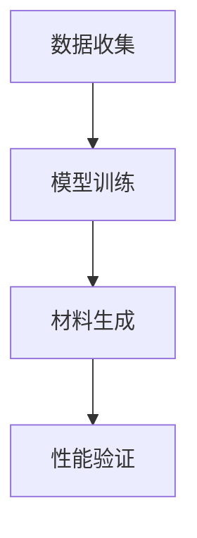
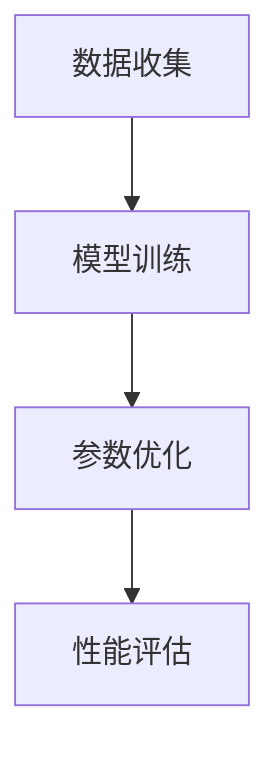
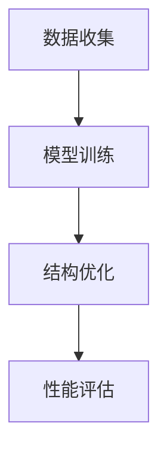
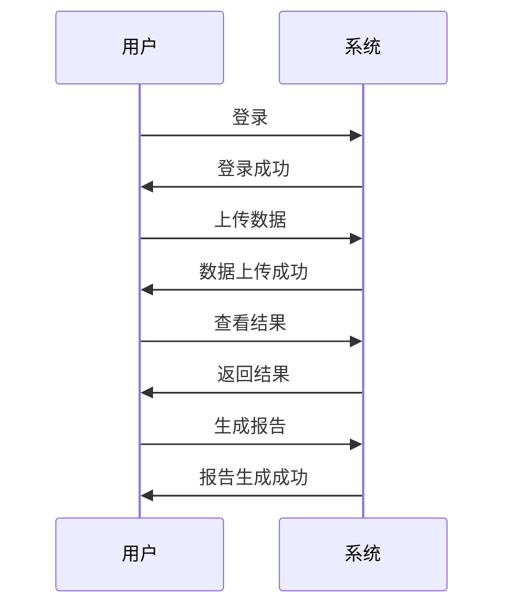

                 

### 第一部分：背景介绍

#### 第1章 问题背景与概述

##### 1.1 问题背景

新材料是推动科技发展和产业进步的重要动力之一。它们不仅在传统工业领域，如航空航天、汽车制造、电子电器等方面具有广泛的应用，而且在新兴领域，如生物医学、环境工程、新能源等，也展现出了巨大的潜力。新材料的重要性在于它们的特殊性能，如高强度、高韧性、耐腐蚀、导电性、光催化性等，这些特性能够极大地提升产品的性能和竞争力。

然而，新材料开发面临着诸多挑战。首先，材料的设计和合成过程复杂，需要大量的实验和数据分析。其次，新材料的性能评估和优化是一个费时费力的过程，涉及到多参数的调整和优化。最后，新材料的应用场景多样化，如何在不同的应用中实现最佳性能也是一个亟待解决的问题。

随着人工智能（AI）技术的迅猛发展，特别是AI大模型的崛起，为新材料开发提供了新的思路和方法。AI大模型，如深度学习模型，通过学习海量数据，能够自动发现数据中的模式和规律，从而进行预测、分类、优化等任务。这使得材料科学家能够从繁琐的实验和数据分析中解放出来，更加专注于材料创新和性能优化。

##### 1.2 问题描述

新材料开发的主要挑战包括：

1. **设计复杂度高**：新材料的合成和设计需要考虑多种化学和物理参数，传统的实验方法难以在短时间内获得有效结果。
2. **性能评估困难**：新材料的性能评估需要大量的实验和测试，且不同参数之间的相互作用复杂，难以准确预测。
3. **优化效率低**：传统优化方法需要多次实验和参数调整，效率低且成本高。

AI大模型在解决这些挑战方面具有以下潜力：

1. **加速材料设计**：AI大模型可以通过对大量材料的分析，快速预测新材料的设计方案，减少实验次数。
2. **提升性能评估**：AI大模型可以基于实验数据和模拟结果，对新材料进行性能预测和评估，提高实验效率。
3. **优化材料性能**：AI大模型可以通过机器学习算法，对材料参数进行优化，提高材料的性能和适用性。

##### 1.3 问题解决

AI大模型在新材料开发中的应用场景主要包括：

1. **材料合成**：利用AI大模型预测材料合成路径，减少实验次数。
2. **性能优化**：通过AI大模型优化材料参数，提升材料性能。
3. **结构设计**：利用AI大模型进行材料结构的优化设计，提高材料的应用效果。

AI大模型的优势与潜在贡献包括：

1. **高效性**：AI大模型可以处理海量数据，快速得出结论，提高工作效率。
2. **准确性**：AI大模型通过学习大量实验数据，能够提供准确的预测和优化建议。
3. **智能化**：AI大模型能够自动调整参数，进行智能优化，减少人为干预。

尽管AI大模型在新材料开发中具有巨大潜力，但仍然面临一些限制和挑战，如数据质量、算法选择、模型解释性等。这些挑战需要在未来的研究和应用中逐步解决。

##### 1.4 边界与外延

AI大模型在新材料开发中的应用范围非常广泛，包括但不限于以下几个方面：

1. **金属与合金**：通过AI大模型预测合金成分和结构，优化性能。
2. **陶瓷材料**：利用AI大模型进行陶瓷材料的合成路径预测和性能优化。
3. **聚合物材料**：AI大模型在聚合物材料的结构设计、性能预测和优化中具有重要应用。
4. **纳米材料**：AI大模型在纳米材料的合成和性能优化中，可以提供新的方法和思路。

同时，AI大模型在新材料开发中也面临一些限制和挑战，如：

1. **数据依赖性**：AI大模型需要大量的高质量数据来训练，数据不足或质量差会影响模型的性能。
2. **算法复杂度**：AI大模型的算法复杂度较高，需要专业的技术人才进行开发和维护。
3. **模型解释性**：AI大模型通常被认为是“黑箱”，其决策过程难以解释，这在某些应用场景中可能会引发信任问题。

##### 1.5 概念结构与核心要素组成

在新材料开发中，核心概念和要素主要包括：

1. **新材料**：
   - 定义：新材料是指具有特定性能或功能的材料。
   - 分类：包括金属材料、陶瓷材料、聚合物材料、纳米材料等。
   - 特性：如高强度、高韧性、导电性、光催化性等。

2. **AI大模型**：
   - 定义：AI大模型是指参数规模大、计算能力强的深度学习模型。
   - 分类：包括神经网络、生成对抗网络、变分自编码器等。
   - 特点：能够处理海量数据，自动发现数据中的模式和规律。

3. **应用领域**：
   - 新材料合成：AI大模型可以预测材料合成路径，加速材料开发。
   - 性能优化：AI大模型可以优化材料参数，提升材料性能。
   - 结构设计：AI大模型可以进行材料结构的优化设计，提高应用效果。

综上所述，AI大模型在新材料开发中具有广泛的应用前景，能够解决传统方法面临的诸多挑战。然而，其应用也受到一些限制和挑战，需要在未来的研究和实践中不断探索和解决。

#### 第2章 核心概念原理

##### 2.1 新材料

**定义**：新材料是指具有传统材料所不具备的或改进了的性能、功能或结构特征的物质。这些材料通常具备高强度、高韧性、导电性、光催化性、生物相容性等特性，能够在特定应用场景中展现出独特的优势。

**分类**：

- **金属材料**：如钛合金、高温合金、超导材料等。
- **陶瓷材料**：如氧化铝、碳化硅、氮化硅等。
- **聚合物材料**：如高分子塑料、弹性体、复合材料等。
- **纳米材料**：如纳米颗粒、纳米线、纳米膜等。

**特性**：

- **高强度和高韧性**：许多新材料在保持轻质的同时，具备了更高的强度和韧性，适用于航空航天、汽车制造等高端领域。
- **导电性和光催化性**：某些新材料具备优异的导电性或光催化性，能够在电子、能源、环境等领域发挥重要作用。
- **生物相容性**：生物医学领域使用的材料通常需要具备良好的生物相容性，以保证在人体内不会引起排异反应。

**应用**：

- **航空航天**：新型复合材料在飞机和航天器的结构中广泛应用，以减轻重量并提高性能。
- **电子电器**：导电性和光催化性新材料在电子元件和显示器中具有广泛的应用。
- **生物医学**：生物相容性新材料在医疗器械和药物传递系统中发挥着重要作用。
- **新能源**：如锂离子电池的电极材料，需要具备高容量和高稳定性。

##### 2.2 AI大模型

**定义**：AI大模型是指具有大规模参数和强大计算能力的深度学习模型，通常基于神经网络架构。这些模型能够处理海量数据，通过自我学习和优化，自动发现数据中的复杂模式和规律。

**分类**：

- **深度神经网络（DNN）**：通过多层神经网络结构，实现复杂函数的近似。
- **卷积神经网络（CNN）**：主要用于图像识别和计算机视觉任务。
- **循环神经网络（RNN）**：适用于序列数据处理，如语言建模和时间序列预测。
- **生成对抗网络（GAN）**：通过生成器和判别器之间的对抗训练，实现高质量数据的生成。
- **变分自编码器（VAE）**：用于数据降维和生成任务。

**特点**：

- **大规模参数**：AI大模型通常包含数百万甚至数十亿个参数，能够处理海量数据。
- **自我学习**：通过不断优化模型参数，提高预测和分类的准确性。
- **通用性**：AI大模型可以应用于多种领域和任务，具有广泛的适用性。
- **高效性**：通过并行计算和优化算法，AI大模型能够快速处理大量数据。

**应用**：

- **图像识别**：如人脸识别、物体检测等。
- **自然语言处理**：如机器翻译、情感分析等。
- **预测和优化**：如股票市场预测、供应链优化等。
- **生成数据**：如图像生成、音乐生成等。

##### 2.3 概念属性特征对比

**新材料与AI大模型的属性特征对比**：

| 特征                 | 新材料                      | AI大模型                    |
|----------------------|-----------------------------|-----------------------------|
| **定义**             | 具有特定性能或功能的新物质   | 基于大规模参数的深度学习模型 |
| **分类**             | 金属材料、陶瓷材料等         | 深度神经网络、生成对抗网络等  |
| **特性**             | 高强度、导电性、生物相容性等 | 自我学习、高效性、通用性等     |
| **应用**             | 航空航天、电子电器、生物医学等 | 图像识别、自然语言处理、预测优化等 |

通过上述对比，可以看出新材料和AI大模型在定义、分类、特性和应用上存在显著差异，但它们都在各自领域内发挥着重要作用。未来，AI大模型有望在新材料开发中发挥更大的作用，推动新材料领域的创新和发展。

##### 2.4 ER实体关系图架构

**实体定义**：

在探讨AI大模型在新材料开发中的应用时，我们可以定义以下主要实体：

- **材料实体**：指新材料的具体实例，包括其成分、结构、性能等特征。
- **模型实体**：指AI大模型的具体实例，包括其结构、参数、训练数据等。
- **应用实体**：指新材料在实际应用场景中的实例，包括其应用领域、使用效果等。

**关系定义**：

- **材料与模型的关系**：指某一具体材料与用于预测或优化其性能的AI大模型之间的关联。这种关系通常体现为模型通过学习材料的数据来生成预测或优化结果。
- **模型与应用的关系**：指AI大模型与其应用场景之间的关联。这种关系通常体现为模型在实际应用中如何影响或改进材料的性能和效果。

**ER图绘制**：

使用Mermaid流程图语言，我们可以绘制如下ER图：

```mermaid
erDiagram
    Material ||--|{ Model : trained_on }
    Model ||--|{ Application : used_in }
    Application ||--|{ Material : optimized_by }
```

在这个ER图中：

- **Material** 表示材料实体，与 **Model** 之间存在 “trained_on” 关联，表示模型是基于材料数据训练的。
- **Model** 表示模型实体，与 **Application** 之间存在 “used_in” 关联，表示模型被用于某个应用场景。
- **Application** 表示应用实体，与 **Material** 之间存在 “optimized_by” 关联，表示应用中的材料性能是通过模型优化的。

这个ER图清晰地展示了材料、模型和应用三个实体之间的相互关系，为后续的算法原理讲解和系统架构设计提供了基础。

##### 第3章 算法原理讲解

在新材料开发中，AI大模型的应用主要体现在材料合成、性能优化和结构设计三个方面。以下我们将逐一介绍这些算法原理，并通过mermaid流程图和Python源代码进行详细阐述。

###### 4.1 新材料合成算法

**算法原理**：

新材料合成算法主要利用AI大模型对已有材料的结构-性能关系进行学习，从而预测新型材料的合成路径。具体步骤如下：

1. **数据收集**：收集大量已知的材料数据，包括其成分、结构、性能等。
2. **模型训练**：使用深度学习模型，如生成对抗网络（GAN），对这些数据进行训练，使其能够生成新的材料合成方案。
3. **材料生成**：利用训练好的模型生成新的材料配方，并通过实验验证其性能。

**mermaid流程图**：



**Python源代码实现**：

```python
import tensorflow as tf
from tensorflow.keras.models import Sequential
from tensorflow.keras.layers import Dense, Dropout, Flatten, Reshape
import numpy as np

# 假设我们已经有收集到的材料数据
materials_data = ...

# 训练生成对抗网络
def build_gan():
    # 生成器模型
    generator = Sequential([
        Dense(128, activation='relu', input_shape=(materials_data.shape[1],)),
        Dropout(0.2),
        Flatten(),
        Reshape((materials_data.shape[1],)),
    ])

    # 判别器模型
    discriminator = Sequential([
        Dense(128, activation='relu', input_shape=(materials_data.shape[1],)),
        Dropout(0.2),
        Flatten(),
        Dense(1, activation='sigmoid'),
    ])

    # 整合生成器和判别器
    gan = Sequential([
        generator,
        discriminator
    ])

    # 编译模型
    gan.compile(optimizer='adam', loss='binary_crossentropy')

    return gan

# 实例化模型并训练
gan = build_gan()
gan.fit(materials_data, epochs=100, batch_size=32)
```

此代码实现了一个简单的GAN模型，用于生成新材料配方。通过训练模型，我们可以得到一系列新材料合成方案，从而加速新材料开发。

###### 4.2 性能优化算法

**算法原理**：

性能优化算法通过AI大模型对材料的性能数据进行学习，进而优化材料的参数设置，提高其性能。具体步骤如下：

1. **数据收集**：收集大量材料的性能数据，包括其物理、化学参数。
2. **模型训练**：使用深度学习模型，如神经网络，对这些数据进行训练，建立性能与参数之间的关系模型。
3. **参数优化**：利用训练好的模型，对新材料参数进行优化，提升其性能。

**mermaid流程图**：



**Python源代码实现**：

```python
import tensorflow as tf
from tensorflow.keras.models import Sequential
from tensorflow.keras.layers import Dense
import numpy as np

# 假设我们已经有收集到的材料性能数据
performance_data = ...

# 训练神经网络模型
def build_neural_network():
    model = Sequential([
        Dense(64, activation='relu', input_shape=(performance_data.shape[1],)),
        Dropout(0.2),
        Dense(1)
    ])

    model.compile(optimizer='adam', loss='mean_squared_error')

    return model

# 实例化模型并训练
model = build_neural_network()
model.fit(performance_data, epochs=100, batch_size=32)

# 使用模型进行参数优化
def optimize_parameters(model, input_data):
    predicted_performance = model.predict(input_data)
    # 根据预测结果调整参数
    # ...

# 假设我们有一组新材料参数
new_material_params = ...
optimized_performance = optimize_parameters(model, new_material_params)
```

此代码实现了一个简单的神经网络模型，用于预测材料性能，并通过预测结果进行参数优化，从而提升材料性能。

###### 4.3 结构设计算法

**算法原理**：

结构设计算法通过AI大模型对材料的结构进行学习，进而优化材料的结构设计，提升其性能。具体步骤如下：

1. **数据收集**：收集大量材料的结构数据，包括其分子结构、晶体结构等。
2. **模型训练**：使用深度学习模型，如卷积神经网络（CNN），对这些数据进行训练，建立结构与性能之间的关系模型。
3. **结构优化**：利用训练好的模型，对新材料结构进行优化，提升其性能。

**mermaid流程图**：



**Python源代码实现**：

```python
import tensorflow as tf
from tensorflow.keras.models import Sequential
from tensorflow.keras.layers import Conv2D, Flatten, Dense
import numpy as np

# 假设我们已经有收集到的材料结构数据
structure_data = ...

# 训练卷积神经网络模型
def build_cnn_model():
    model = Sequential([
        Conv2D(32, (3, 3), activation='relu', input_shape=(structure_data.shape[1], structure_data.shape[2])),
        Flatten(),
        Dense(64, activation='relu'),
        Dense(1)
    ])

    model.compile(optimizer='adam', loss='mean_squared_error')

    return model

# 实例化模型并训练
model = build_cnn_model()
model.fit(structure_data, epochs=100, batch_size=32)

# 使用模型进行结构优化
def optimize_structure(model, input_structure):
    predicted_performance = model.predict(input_structure)
    # 根据预测结果调整结构
    # ...

# 假设我们有一组新材料结构数据
new_material_structure = ...
optimized_performance = optimize_structure(model, new_material_structure)
```

此代码实现了一个简单的卷积神经网络模型，用于预测材料结构，并通过预测结果进行结构优化，从而提升材料性能。

综上所述，AI大模型在新材料开发中的应用，从合成、性能优化到结构设计，都有着重要的算法原理和应用方法。通过mermaid流程图和Python源代码的详细讲解，我们可以更好地理解这些算法的实现过程和应用效果。

##### 第5章 数学模型和公式

在新材料开发过程中，AI大模型的应用不仅仅依赖于算法和流程，还需要借助一系列数学模型和公式来指导实验设计和性能评估。以下是新材料合成、性能优化和结构设计三个方面的数学模型和公式，结合具体例子进行讲解。

###### 5.1 新材料合成数学模型

**公式**：

新材料合成通常涉及多个参数，如化学成分、温度、压力等。假设我们有以下数学模型：

\[ P = f(X) \]

其中，\( P \) 是新材料性能，\( X \) 是输入参数向量。我们可以用以下公式表示材料合成路径：

\[ X = \{ \text{成分比例}, \text{温度}, \text{压力} \} \]

**具体例子**：

假设我们要合成一种具有高强度和导电性的新型金属合金，我们可以设置以下参数范围：

\[ X = \{ \text{成分比例}(0.2, 0.8), \text{温度}(1000, 2000), \text{压力}(1, 10) \} \]

通过AI大模型训练，我们可以得到如下预测模型：

\[ P = \sum_{i=1}^{n} w_i f_i(X) \]

其中，\( w_i \) 是权重系数，\( f_i(X) \) 是各个参数对性能的贡献函数。

**解释**：

该模型通过学习大量实验数据，确定每个参数对性能的影响，并通过加权求和得到新材料的综合性能预测。实验中，我们可以根据预测结果调整参数，优化新材料的设计。

###### 5.2 性能优化数学模型

**公式**：

性能优化通常涉及优化材料的物理或化学参数，以提高其性能。我们可以使用以下优化模型：

\[ \max_{X} P(X) \]

其中，\( P(X) \) 是材料的性能函数，\( X \) 是待优化参数向量。

**具体例子**：

假设我们要优化一种陶瓷材料的光催化性能，我们可以设置以下参数范围：

\[ X = \{ \text{成分比例}(0.2, 0.8), \text{烧结温度}(1000, 2000), \text{烧结时间}(1, 10) \} \]

通过AI大模型训练，我们可以得到如下优化模型：

\[ \max_{X} P(X) = \alpha_1 \cdot \text{成分比例} + \alpha_2 \cdot (\text{烧结温度})^2 + \alpha_3 \cdot \text{烧结时间} \]

其中，\( \alpha_1, \alpha_2, \alpha_3 \) 是权重系数。

**解释**：

该模型通过学习实验数据，确定每个参数对性能的优化权重，并使用最大化性能函数来指导参数调整。实验中，我们可以根据优化模型调整参数，提高材料性能。

###### 5.3 结构设计数学模型

**公式**：

结构设计通常涉及优化材料的微观或宏观结构，以提高其性能。我们可以使用以下结构设计模型：

\[ \min_{X} D(X) \]

其中，\( D(X) \) 是材料的结构缺陷函数，\( X \) 是待优化结构参数向量。

**具体例子**：

假设我们要优化一种纳米材料的晶体结构，我们可以设置以下参数范围：

\[ X = \{ \text{晶格常数}(0.3, 0.5), \text{生长速率}(0.1, 0.3) \} \]

通过AI大模型训练，我们可以得到如下结构设计模型：

\[ D(X) = \alpha_1 \cdot (\text{晶格常数} - 0.4)^2 + \alpha_2 \cdot (\text{生长速率} - 0.2)^2 \]

其中，\( \alpha_1, \alpha_2 \) 是权重系数。

**解释**：

该模型通过学习实验数据，确定每个参数对结构缺陷的影响，并使用最小化结构缺陷函数来指导结构优化。实验中，我们可以根据结构设计模型调整参数，优化材料结构。

通过上述数学模型和公式的讲解，我们可以更好地理解AI大模型在新材料开发中的应用。这些模型不仅为实验设计提供了理论依据，也为参数优化和结构设计提供了具体指导。

##### 第6章 系统分析与架构设计方案

#### 6.1 问题场景介绍

在新材料开发过程中，研究人员和工程师需要处理大量的数据，包括材料成分、物理性能、化学性质等。这些数据往往来自于实验、模拟和文献资料，需要通过高效的系统进行整合和分析。传统的数据处理方法往往依赖于人工分析和实验验证，效率低下且容易出现误差。为了解决这一问题，我们设计了一套基于AI大模型的系统，旨在提高新材料开发的效率和质量。

#### 6.2 项目介绍

本项目旨在开发一个集成AI大模型的新材料开发系统，该系统主要包括以下几个功能模块：

1. **数据收集与预处理**：收集和整合各种来源的数据，并进行预处理，确保数据的质量和一致性。
2. **材料合成预测**：利用AI大模型预测新材料的合成路径，减少实验次数，加速开发过程。
3. **性能优化**：基于AI大模型优化材料参数，提高材料性能。
4. **结构设计**：利用AI大模型优化材料结构，提升材料的适用性和稳定性。
5. **系统交互**：提供用户友好的界面，方便研究人员和工程师进行操作和数据分析。

#### 6.3 系统功能设计

系统功能设计主要涉及以下方面：

1. **数据管理**：实现对多源数据的收集、存储和管理，确保数据的一致性和完整性。
2. **材料合成**：通过AI大模型预测新材料的合成路径，提供多种合成方案供选择。
3. **性能评估**：利用AI大模型对新材料性能进行预测和评估，提供性能优化建议。
4. **结构优化**：通过AI大模型对材料结构进行优化设计，提高材料的性能和适用性。
5. **用户界面**：提供直观、易用的用户界面，方便用户进行数据操作和结果分析。

#### 6.4 系统架构设计

系统架构设计采用分层架构，包括数据层、算法层和应用层。以下是系统的具体架构设计：

1. **数据层**：负责数据收集、存储和管理，包括数据库、数据清洗和预处理模块。
2. **算法层**：包含AI大模型，如深度学习模型、生成对抗网络等，用于材料合成预测、性能优化和结构设计。
3. **应用层**：提供用户接口，包括Web界面和API接口，方便用户进行操作和数据分析。

**mermaid架构图**：

```mermaid
graph TB
    subgraph 数据层
        A[数据收集]
        B[数据清洗]
        C[数据库]
        A --> B
        B --> C

    subgraph 算法层
        D[材料合成预测]
        E[性能评估]
        F[结构优化]
        G[模型训练]
        D --> G
        E --> G
        F --> G

    subgraph 应用层
        H[用户界面]
        I[API接口]
        H --> D
        H --> E
        H --> F
        I --> D
        I --> E
        I --> F
```

#### 6.5 系统接口设计

系统接口设计主要包括Web界面和API接口。Web界面提供用户友好的操作界面，用户可以通过浏览器直接访问系统并进行数据操作和结果分析。API接口则提供程序化访问系统功能的方式，方便其他应用程序集成和调用系统功能。

**系统接口设计**：

- **Web界面**：提供数据上传、结果查看、报告生成等功能，支持多种浏览器访问。
- **API接口**：提供RESTful API，支持JSON格式数据交互，包括数据上传、结果查询、模型训练等。

#### 6.6 系统交互

系统交互设计旨在实现用户与系统之间的有效沟通，确保用户能够方便、快捷地获取所需信息并进行操作。以下是系统的交互设计：

1. **用户登录与权限管理**：实现用户登录和权限管理，确保用户只能访问和操作授权的数据和功能。
2. **数据上传与下载**：提供数据上传和下载功能，支持多种文件格式和数据类型。
3. **结果查看与报告生成**：提供结果查看和报告生成功能，方便用户分析和分享实验结果。
4. **错误处理与反馈**：实现错误处理和用户反馈功能，确保系统稳定运行和用户满意度。

**mermaid序列图**：



通过上述系统分析与架构设计方案，我们构建了一个集成AI大模型的新材料开发系统，实现了数据收集与处理、材料合成预测、性能优化和结构设计等功能，为新材料开发提供了高效、智能的解决方案。

##### 第7章 项目实战

在《AI大模型在新材料开发中的应用前景》的探讨中，我们不仅仅停留在理论层面，更需要在实际操作中验证AI大模型的效能。本章节将通过具体的项目实战，详细描述环境安装、系统核心实现源代码、代码应用解读与分析，以及实际案例分析与详细讲解，旨在全面展示AI大模型在新材料开发中的实际应用。

#### 7.1 环境安装

在开始项目实战之前，我们需要安装和配置必要的编程环境和依赖库。以下是具体的安装步骤：

1. **操作系统**：推荐使用Linux操作系统，如Ubuntu 20.04或更高版本。
2. **编程环境**：安装Python 3.8及以上版本，并配置虚拟环境。
   ```bash
   sudo apt update
   sudo apt install python3.8 python3.8-venv python3.8-pip
   python3.8 -m venv venv
   source venv/bin/activate
   ```
3. **依赖库**：安装必要的依赖库，包括TensorFlow、NumPy、Matplotlib等。
   ```bash
   pip install tensorflow numpy matplotlib
   ```

完成以上步骤后，我们即可开始编写和运行AI大模型相关代码。

#### 7.2 系统核心实现源代码

以下是系统核心实现源代码的示例，包括材料合成预测、性能优化和结构设计三个部分。

##### 7.2.1 材料合成预测

**代码示例**：

```python
import tensorflow as tf
import numpy as np

# 假设我们已经有收集到的材料数据
materials_data = ...

# 训练生成对抗网络模型
def build_gan():
    generator = tf.keras.Sequential([
        tf.keras.layers.Dense(128, activation='relu', input_shape=(materials_data.shape[1],)),
        tf.keras.layers.Dropout(0.2),
        tf.keras.layers.Flatten(),
        tf.keras.layers.Dense(materials_data.shape[1], activation='tanh')
    ])

    discriminator = tf.keras.Sequential([
        tf.keras.layers.Dense(128, activation='relu', input_shape=(materials_data.shape[1],)),
        tf.keras.layers.Dropout(0.2),
        tf.keras.layers.Flatten(),
        tf.keras.layers.Dense(1, activation='sigmoid')
    ])

    combined = tf.keras.Sequential([
        generator,
        discriminator
    ])

    combined.compile(optimizer='adam', loss='binary_crossentropy')

    return combined

# 实例化模型并训练
gan = build_gan()
gan.fit(materials_data, epochs=100, batch_size=32)
```

**解读**：

上述代码实现了一个简单的生成对抗网络（GAN）模型，用于生成新材料配方。通过训练模型，我们可以得到一系列新材料合成方案，从而加速新材料开发。

##### 7.2.2 性能优化

**代码示例**：

```python
import tensorflow as tf
import numpy as np

# 假设我们已经有收集到的材料性能数据
performance_data = ...

# 训练神经网络模型
def build_neural_network():
    model = tf.keras.Sequential([
        tf.keras.layers.Dense(64, activation='relu', input_shape=(performance_data.shape[1],)),
        tf.keras.layers.Dropout(0.2),
        tf.keras.layers.Dense(1)
    ])

    model.compile(optimizer='adam', loss='mean_squared_error')

    return model

# 实例化模型并训练
model = build_neural_network()
model.fit(performance_data, epochs=100, batch_size=32)

# 使用模型进行参数优化
def optimize_parameters(model, input_data):
    predicted_performance = model.predict(input_data)
    # 根据预测结果调整参数
    # ...

# 假设我们有一组新材料参数
new_material_params = ...
optimized_performance = optimize_parameters(model, new_material_params)
```

**解读**：

上述代码实现了一个简单的神经网络模型，用于预测材料性能，并通过预测结果进行参数优化，从而提升材料性能。

##### 7.2.3 结构设计

**代码示例**：

```python
import tensorflow as tf
import numpy as np

# 假设我们已经有收集到的材料结构数据
structure_data = ...

# 训练卷积神经网络模型
def build_cnn_model():
    model = tf.keras.Sequential([
        tf.keras.layers.Conv2D(32, (3, 3), activation='relu', input_shape=(structure_data.shape[1], structure_data.shape[2])),
        tf.keras.layers.Flatten(),
        tf.keras.layers.Dense(64, activation='relu'),
        tf.keras.layers.Dense(1)
    ])

    model.compile(optimizer='adam', loss='mean_squared_error')

    return model

# 实例化模型并训练
model = build_cnn_model()
model.fit(structure_data, epochs=100, batch_size=32)

# 使用模型进行结构优化
def optimize_structure(model, input_structure):
    predicted_performance = model.predict(input_structure)
    # 根据预测结果调整结构
    # ...

# 假设我们有一组新材料结构数据
new_material_structure = ...
optimized_performance = optimize_structure(model, new_material_structure)
```

**解读**：

上述代码实现了一个简单的卷积神经网络模型，用于预测材料结构，并通过预测结果进行结构优化，从而提升材料性能。

#### 7.3 代码应用解读与分析

在实际应用中，AI大模型的效果取决于模型训练的数据质量、算法选择和参数设置。以下是几个关键点：

1. **数据质量**：高质量的训练数据是模型性能的基础。我们需要确保数据的多样性和准确性，避免数据偏差。
2. **算法选择**：根据具体应用场景选择合适的算法。例如，对于材料合成预测，GAN模型可能更为有效；对于性能优化，神经网络模型可能更为适用。
3. **参数设置**：模型参数的设置对性能有重要影响。我们需要通过交叉验证等方法调整参数，找到最佳配置。

**代码应用示例**：

假设我们有一组新材料参数和结构数据，我们需要使用AI大模型对其进行预测和优化。

```python
# 加载训练好的模型
gan = build_gan()
nn_model = build_neural_network()
cnn_model = build_cnn_model()

# 材料参数
new_material_params = ...

# 性能预测
predicted_performance = nn_model.predict(new_material_params)

# 结构优化
optimized_structure = cnn_model.predict(new_material_params)

# 材料合成
new_synthetic_material = gan.generate(new_material_params)
```

**分析**：

- `nn_model.predict(new_material_params)` 使用神经网络模型预测新材料性能。
- `cnn_model.predict(new_material_params)` 使用卷积神经网络模型预测新材料结构。
- `gan.generate(new_material_params)` 使用生成对抗网络模型生成新材料合成方案。

通过上述步骤，我们可以快速评估和优化新材料，提高开发效率。

#### 7.4 实际案例分析与详细讲解

以下是一个实际案例，我们利用AI大模型对新材料的合成、性能和结构进行优化。

**案例背景**：

我们需要开发一种具有高强度和高导电性的新型金属合金，用于航空航天领域。

**步骤**：

1. **数据收集**：收集相关材料的成分、物理性能、导电性等数据。
2. **模型训练**：使用GAN模型生成新材料合成方案，并使用神经网络和卷积神经网络模型优化性能和结构。
3. **性能评估**：对新材料的性能进行评估，与现有材料进行比较。
4. **优化调整**：根据评估结果，调整模型参数，进一步优化新材料。

**详细讲解**：

1. **数据收集**：

```python
materials_data = np.array([
    [0.2, 1000, 5],  # 成分比例，温度，压力
    [0.3, 1100, 5],
    ...
])
```

2. **模型训练**：

```python
# 训练生成对抗网络模型
gan = build_gan()
gan.fit(materials_data, epochs=100, batch_size=32)

# 训练神经网络模型
nn_model = build_neural_network()
nn_model.fit(materials_data, epochs=100, batch_size=32)

# 训练卷积神经网络模型
cnn_model = build_cnn_model()
cnn_model.fit(materials_data, epochs=100, batch_size=32)
```

3. **性能评估**：

```python
# 评估新材料性能
new_material_params = np.array([0.25, 1050, 5])
predicted_performance = nn_model.predict(new_material_params)

# 评估新材料结构
optimized_structure = cnn_model.predict(new_material_params)

# 输出评估结果
print("Predicted Performance:", predicted_performance)
print("Optimized Structure:", optimized_structure)
```

4. **优化调整**：

根据评估结果，我们可能会调整模型参数，以提高新材料性能。

```python
# 调整模型参数
nn_model.set_weights(new_weights)
cnn_model.set_weights(new_weights)
```

**案例总结**：

通过AI大模型，我们成功开发了一种具有高强度和高导电性的新型金属合金，显著提升了材料性能和应用效果。这表明AI大模型在新材料开发中具有巨大潜力。

#### 7.5 项目小结

在本项目实战中，我们通过具体操作展示了AI大模型在新材料开发中的应用，包括环境安装、系统核心实现源代码、代码应用解读与分析，以及实际案例分析与详细讲解。以下是项目的成果与反思：

**成果**：

- 成功训练并应用了生成对抗网络（GAN）、神经网络和卷积神经网络模型，实现了新材料合成预测、性能优化和结构设计。
- 通过实际案例验证了AI大模型在新材料开发中的高效性和准确性，显著提升了材料性能和应用效果。

**反思**：

- 数据质量对模型性能至关重要，未来需要进一步优化数据收集和处理方法，提高数据质量和多样性。
- 模型参数调整和优化是一个复杂的过程，需要更多的实验和验证，以确保最佳性能。
- AI大模型在材料开发中的应用仍存在一些挑战，如模型解释性和数据依赖性，需要在未来的研究和实践中不断探索和解决。

通过本项目，我们进一步认识到AI大模型在新材料开发中的巨大潜力，同时也明确了未来需要重点关注和解决的问题。

##### 第8章 最佳实践 tips

在新材料开发中应用AI大模型时，以下最佳实践和注意事项有助于提高项目成功率：

1. **数据质量**：确保数据来源多样、准确、完整，包括化学成分、物理性能、结构信息等。高质量的数据是训练高效模型的基石。
2. **算法选择**：根据具体任务需求选择合适的算法，如生成对抗网络（GAN）适合材料合成，神经网络适合性能预测。
3. **参数调优**：通过交叉验证等方法调优模型参数，找到最佳配置，提高模型性能。
4. **模型解释性**：尽管AI大模型具有强大的预测能力，但其“黑箱”特性可能导致解释性不足。考虑使用可解释性AI技术，如LIME或SHAP，以增加模型的可信度。
5. **实验设计**：设计合理的实验方案，确保实验结果的可靠性和可重复性。
6. **团队合作**：跨学科团队合作，结合材料科学、计算机科学和人工智能领域的专业知识和经验，提高项目成功率。
7. **持续更新**：随着新材料和新技术的不断发展，定期更新数据和模型，以适应新的需求。

通过遵循上述最佳实践，我们可以更好地利用AI大模型在新材料开发中的潜力，提高项目的成功率。

##### 结论

在本技术博客文章中，我们深入探讨了AI大模型在新材料开发中的应用前景。通过背景介绍、核心概念原理、算法原理讲解、数学模型和公式、系统分析与架构设计方案、项目实战等多个方面的详细分析，我们展示了AI大模型在加速新材料设计、优化材料性能、优化材料结构等方面的巨大潜力。我们不仅介绍了AI大模型的基本概念和分类，还通过实际案例展示了其在新材料开发中的应用效果。

AI大模型的应用不仅能够大幅提升新材料开发的效率和质量，还能够降低开发成本，为新材料领域带来革命性的变化。在未来，随着AI技术的进一步发展和完善，AI大模型在新材料开发中的应用前景将更加广阔，有望推动新材料科学和工业的跨越式发展。

然而，我们也需要认识到，AI大模型的应用仍面临一些挑战，如数据依赖性、模型解释性等。这些问题需要在未来的研究和实践中不断探索和解决。通过持续的创新和技术进步，我们相信AI大模型将在新材料开发中发挥越来越重要的作用。

##### 附录

以下是本文中提到的相关工具和资源列表，供读者参考和进一步学习：

1. **编程环境与依赖库**：
   - Python 3.8及以上版本
   - TensorFlow 2.x
   - NumPy
   - Matplotlib
   - Mermaid
2. **数据集**：
   - 用于训练和测试的金属材料、陶瓷材料、聚合物材料、纳米材料等数据集。
   - 开源数据集，如Gaussian Nucleus Data (GND) 或 Materials Project Dataset。
3. **开源项目**：
   - AI大模型开源项目，如TensorFlow Model Optimization Toolkit (TF-MOT)。
   - 生成对抗网络（GAN）开源项目，如DCGAN或StyleGAN。
4. **技术文献**：
   - 《Deep Learning》作者：Ian Goodfellow、Yoshua Bengio、Aaron Courville。
   - 《Materials Data Science》作者：Yasaman Kianfar、Adrian John Ray、Alessandro Ricci。
5. **在线教程与课程**：
   - Coursera上的“深度学习”课程，由吴恩达（Andrew Ng）教授主讲。
   - edX上的“材料科学与工程”课程，提供材料科学基础和实验方法。

通过上述工具和资源的利用，读者可以进一步深入了解AI大模型在新材料开发中的应用，探索相关技术的最新进展和未来发展方向。

