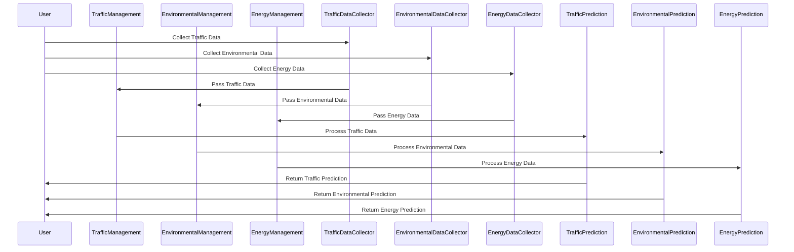
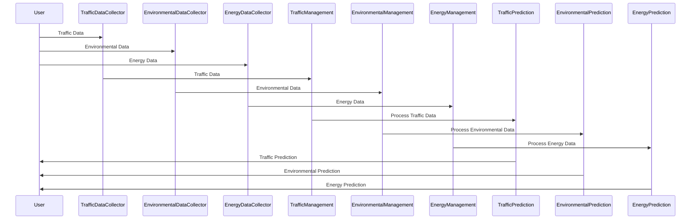
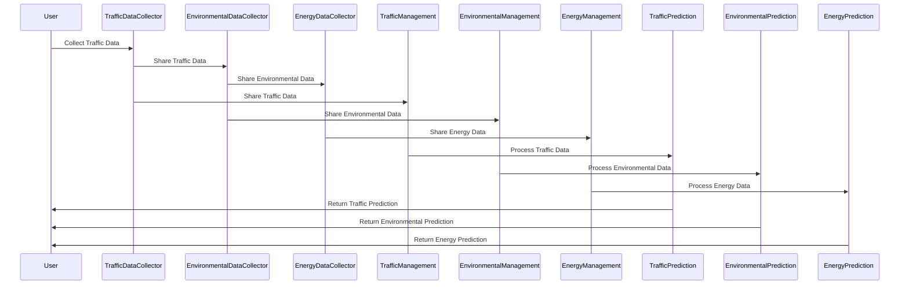

                 


### 第一部分：背景介绍

**第1章：AI大模型在智慧城市管理中的应用与挑战**

**1.1 问题的背景**

随着全球城市化进程的加速，城市规模不断扩大，人口密度增加，城市管理和运营面临前所未有的挑战。交通拥堵、环境污染、资源浪费等问题日益突出，传统的城市管理方式已难以满足现代智慧城市的需求。AI大模型作为一种先进的智能技术，其在智慧城市管理中的应用成为解决这些问题的关键。

**问题背景**：智慧城市是利用信息技术和AI技术，实现对城市资源、环境和公共服务的智能化管理和优化。AI大模型在智慧城市中的应用，包括交通管理、环境监测、能源管理等多个领域。

**问题描述**：如何利用AI大模型解决智慧城市管理的实际问题？AI大模型在智慧城市中的应用有哪些优势与挑战？

**问题解决**：本文将深入探讨AI大模型在智慧城市管理的应用，分析其优势与挑战，并探讨具体的解决方案。

**1.2 核心概念**

**AI大模型**：AI大模型是一种具有大规模数据训练和强大推理能力的智能模型，主要包括深度学习模型、神经网络模型等。这些模型能够处理海量数据，并从中提取有价值的信息。

**智慧城市管理**：智慧城市管理是通过信息技术和AI技术，实现对城市资源、环境和公共服务的智能化管理和优化。其核心在于通过数据的采集、分析和应用，提升城市管理的效率和质量。

**1.3 边界与外延**

**边界**：本文的研究边界主要集中在AI大模型在智慧城市交通管理、环境监测、能源管理等领域中的应用。

**外延**：AI大模型在智慧城市中的应用不仅限于上述领域，还包括城市规划、公共安全、社会服务等多个方面。这些领域的应用也是本文探讨的内容。

**1.4 概念结构与核心要素组成**

**概念结构**：AI大模型、智慧城市管理、应用场景、挑战与对策。

**核心要素组成**：数据集、算法模型、系统架构、应用效果评估。

### 第二部分：核心概念与联系

**第2章：AI大模型在智慧城市管理的核心概念与联系**

**2.1 AI大模型原理**

**核心概念**：AI大模型是基于深度学习和神经网络技术，通过大规模数据训练和优化，实现智能推理和决策的能力。

**原理说明**：AI大模型通过多层神经网络结构，对输入数据进行特征提取和模式识别，进而实现复杂的智能任务。其核心在于通过不断的训练和学习，提高模型的准确性和鲁棒性。

**2.2 智慧城市管理概念**

**核心概念**：智慧城市管理是通过信息技术和AI技术，实现对城市资源、环境和公共服务的智能化管理和优化。

**原理说明**：智慧城市管理利用AI大模型等先进技术，实现对城市运行状态的实时监测、预测和优化，提高城市管理的效率和效果。其关键在于数据的应用和创新。

**2.3 AI大模型与智慧城市管理的联系**

**联系分析**：AI大模型作为智慧城市管理的关键技术，其核心能力与智慧城市管理的需求高度契合，可实现精准预测、智能决策和优化调度。例如，在交通管理中，AI大模型可以通过对交通数据的分析，预测交通流量，优化交通信号，减少交通拥堵；在环境监测中，AI大模型可以通过对环境数据的分析，预测空气质量，优化城市绿化，改善环境质量。

### 第三部分：算法原理讲解

**第3章：AI大模型在智慧城市管理中的应用场景与算法原理**

**3.1 交通管理**

**应用场景**：利用AI大模型实现交通流量预测、交通信号优化和交通事件检测。

**优势**：提高交通效率，减少拥堵，降低交通事故发生率。

**挑战**：数据质量和实时性要求高，算法模型需不断优化。

**算法原理**：AI大模型在交通管理中的应用主要通过深度学习算法实现。具体包括：

1. **数据采集**：采集交通流量、交通事故、道路施工等数据。
2. **特征提取**：对采集的数据进行预处理，提取关键特征。
3. **模型训练**：使用训练数据训练深度学习模型。
4. **预测与优化**：利用训练好的模型进行交通流量预测和信号优化。

**示例**：假设我们要预测一条道路上的交通流量，我们可以使用一个基于深度学习的循环神经网络（RNN）模型。模型的结构如下：

$$
\begin{align*}
h_t &= \sigma(W_h \cdot [h_{t-1}, x_t] + b_h) \\
y_t &= W_o \cdot h_t + b_o
\end{align*}
$$

其中，$h_t$ 表示第 $t$ 个时间步的隐藏状态，$x_t$ 表示第 $t$ 个时间步的输入特征，$W_h$ 和 $b_h$ 分别为隐藏层权重和偏置，$W_o$ 和 $b_o$ 分别为输出层权重和偏置，$\sigma$ 为激活函数。

**3.2 环境监测**

**应用场景**：利用AI大模型进行空气质量预测、噪声监测和城市绿化管理。

**优势**：提高环境监测的准确性和实时性，助力城市可持续发展。

**挑战**：数据来源多样，数据预处理复杂。

**算法原理**：AI大模型在环境监测中的应用主要通过卷积神经网络（CNN）实现。具体包括：

1. **数据采集**：采集空气质量、噪声水平、绿化覆盖率等数据。
2. **特征提取**：对采集的数据进行预处理，提取关键特征。
3. **模型训练**：使用训练数据训练卷积神经网络。
4. **预测与优化**：利用训练好的模型进行空气质量预测、噪声监测和绿化管理。

**示例**：假设我们要预测一个区域内的空气质量，我们可以使用一个基于卷积神经网络的模型。模型的结构如下：

$$
\begin{align*}
h_t &= \sigma(W_h \cdot [h_{t-1}, x_t] + b_h) \\
y_t &= W_o \cdot h_t + b_o
\end{align*}
$$

其中，$h_t$ 表示第 $t$ 个时间步的隐藏状态，$x_t$ 表示第 $t$ 个时间步的输入特征，$W_h$ 和 $b_h$ 分别为隐藏层权重和偏置，$W_o$ 和 $b_o$ 分别为输出层权重和偏置，$\sigma$ 为激活函数。

**3.3 能源管理**

**应用场景**：利用AI大模型实现智能电网管理、能源需求预测和节能减排。

**优势**：提高能源利用效率，降低能源消耗。

**挑战**：算法模型需适应不同能源场景，数据采集与处理复杂。

**算法原理**：AI大模型在能源管理中的应用主要通过深度强化学习（DRL）实现。具体包括：

1. **数据采集**：采集能源消耗、电网负荷、可再生能源发电等数据。
2. **特征提取**：对采集的数据进行预处理，提取关键特征。
3. **模型训练**：使用训练数据训练深度强化学习模型。
4. **预测与优化**：利用训练好的模型进行能源需求预测和节能减排优化。

**示例**：假设我们要优化一个智能电网的能源调度，我们可以使用一个基于深度强化学习的模型。模型的结构如下：

$$
\begin{align*}
Q(s, a) &= r(s, a) + \gamma \max_{a'} Q(s', a') \\
s' &= s + \epsilon(a) \\
Q(s, a) &= \frac{1}{N} \sum_{i=1}^{N} (r(s, a) + \gamma Q(s', a'))
\end{align*}
$$

其中，$Q(s, a)$ 表示在状态 $s$ 下采取行动 $a$ 的价值函数，$r(s, a)$ 表示在状态 $s$ 下采取行动 $a$ 的即时回报，$\gamma$ 为折扣因子，$s'$ 表示新的状态，$\epsilon(a)$ 表示探索概率。

### 第四部分：系统分析与架构设计方案

**第4章：AI大模型在智慧城市管理的系统分析与架构设计方案**

**4.1 问题场景介绍**

**问题场景**：假设我们要开发一个智慧城市管理系统，主要包括交通管理、环境监测和能源管理三个方面。我们需要对城市交通、环境和能源的运行状态进行实时监测、预测和优化，以提高城市管理的效率和效果。

**4.2 系统功能设计**

**领域模型**：使用Mermaid绘制领域模型类图，表示系统的主要类和类之间的关系。

```mermaid
classDiagram
  TrafficManagement <-|{uses}|> TrafficDataCollector
  EnvironmentalManagement <-|{uses}|> EnvironmentalDataCollector
  EnergyManagement <-|{uses}|> EnergyDataCollector
  TrafficDataCollector --|{collects}|> TrafficData
  EnvironmentalDataCollector --|{collects}|> EnvironmentalData
  EnergyDataCollector --|{collects}|> EnergyData
  TrafficManagement --|{processes}|> TrafficPrediction
  EnvironmentalManagement --|{processes}|> EnvironmentalPrediction
  EnergyManagement --|{processes}|> EnergyPrediction
```

**功能说明**：

1. **交通管理**：收集交通数据，预测交通流量，优化交通信号。
2. **环境监测**：收集环境数据，预测空气质量，优化城市绿化。
3. **能源管理**：收集能源数据，预测能源需求，优化能源调度。

**4.3 系统架构设计**

**架构设计**：使用Mermaid绘制系统架构图，表示系统的组成部分和它们之间的关系。



**架构说明**：

1. **数据采集**：用户通过系统接口收集交通、环境和能源数据。
2. **数据处理**：数据采集模块将数据传递给相应的管理模块，进行数据预处理和特征提取。
3. **模型预测**：管理模块使用训练好的AI大模型对数据进行分析和预测。
4. **结果反馈**：预测结果通过系统接口返回给用户，用于指导城市管理和决策。

**4.4 系统接口设计**

**接口设计**：使用Mermaid绘制系统接口图，表示系统的输入输出接口。



**接口说明**：

1. **数据采集接口**：用户通过接口提交交通、环境和能源数据。
2. **数据处理接口**：数据采集模块通过接口接收数据，传递给管理模块。
3. **预测结果接口**：管理模块通过接口将预测结果返回给用户。

**4.5 系统交互**

**交互设计**：使用Mermaid绘制系统交互图，表示系统的运行流程和交互过程。



**交互说明**：

1. **数据共享**：各模块之间通过数据共享接口，实现数据的传递和共享。
2. **预测结果反馈**：管理模块通过接口将预测结果返回给用户，指导城市管理和决策。

### 第五部分：项目实战

**第5章：AI大模型在智慧城市管理的项目实战**

**5.1 环境安装**

**环境要求**：在项目开发过程中，我们需要安装以下软件和工具：

1. **Python 3.7及以上版本**
2. **TensorFlow 2.0及以上版本**
3. **Jupyter Notebook**
4. **Keras**
5. **Scikit-learn**

**安装步骤**：

1. 安装Python 3.7及以上版本。
2. 安装TensorFlow 2.0及以上版本。

```bash
pip install tensorflow
```

3. 安装Jupyter Notebook。

```bash
pip install notebook
```

4. 安装Keras。

```bash
pip install keras
```

5. 安装Scikit-learn。

```bash
pip install scikit-learn
```

**5.2 系统核心实现源代码**

**核心代码**：以下是一个简单的AI大模型在智慧城市管理中的应用示例，包括数据采集、模型训练和预测等功能。

```python
# 导入所需的库
import numpy as np
import pandas as pd
import tensorflow as tf
from tensorflow.keras.models import Sequential
from tensorflow.keras.layers import Dense, LSTM
from sklearn.preprocessing import MinMaxScaler
from sklearn.model_selection import train_test_split

# 采集数据
data = pd.read_csv('data.csv')

# 数据预处理
scaler = MinMaxScaler(feature_range=(0, 1))
scaled_data = scaler.fit_transform(data)

# 划分训练集和测试集
train_data, test_data = train_test_split(scaled_data, test_size=0.2, shuffle=False)

# 构建AI大模型
model = Sequential()
model.add(LSTM(units=50, return_sequences=True, input_shape=(1, 1)))
model.add(LSTM(units=50, return_sequences=False))
model.add(Dense(units=1))

# 编译模型
model.compile(optimizer='adam', loss='mean_squared_error')

# 训练模型
model.fit(train_data, epochs=100, batch_size=32)

# 预测
predicted_data = model.predict(test_data)

# 反归一化预测结果
predicted_data = scaler.inverse_transform(predicted_data)

# 打印预测结果
print(predicted_data)
```

**5.3 代码应用解读与分析**

**代码解读**：上述代码实现了基于LSTM网络的AI大模型，用于预测交通流量。首先，我们从CSV文件中读取数据，并进行数据预处理。然后，使用训练集数据训练LSTM模型，并使用测试集数据进行预测。

**分析**：通过分析代码，我们可以了解到AI大模型在智慧城市管理中的应用流程：

1. 数据采集：从实际场景中收集交通数据。
2. 数据预处理：对采集的数据进行归一化处理，使其适合模型的训练。
3. 模型训练：使用LSTM网络训练模型，提取数据中的特征。
4. 预测：使用训练好的模型对测试集数据进行预测。

**5.4 实际案例分析和详细讲解剖析**

**案例**：假设我们要预测一条道路上的交通流量，我们可以使用上述代码进行预测。

**分析**：在实际应用中，我们可以将收集的交通数据输入到模型中，预测未来一段时间内的交通流量。例如，我们预测下一小时内的交通流量，可以输入过去一小时的数据进行预测。

**详细讲解**：

1. **数据采集**：从实际场景中收集交通数据，包括道路上的车辆数量、速度等。
2. **数据预处理**：对采集的数据进行归一化处理，将其转换为适合模型训练的格式。
3. **模型训练**：使用LSTM网络训练模型，提取数据中的特征，并优化模型的参数。
4. **预测**：使用训练好的模型对新的数据进行预测，得到未来一段时间内的交通流量。

**5.5 项目小结**

**总结**：通过本项目实战，我们了解了AI大模型在智慧城市管理中的应用流程和关键技术。在实际项目中，我们需要根据具体场景和数据特点，选择合适的算法模型和优化策略，以提高预测的准确性和实时性。

### 第六部分：最佳实践与小结

**第6章：最佳实践与小结**

**6.1 最佳实践**

**数据采集**：

1. 选择合适的数据采集设备，确保数据的准确性和实时性。
2. 设计合理的数据采集流程，减少数据丢失和噪声。

**数据处理**：

1. 使用有效的数据预处理方法，如归一化、去噪等，提高数据质量。
2. 根据业务需求，提取关键特征，降低模型复杂性。

**模型训练**：

1. 选择合适的模型结构，如LSTM、CNN、DRL等，根据数据特点和需求进行优化。
2. 使用合适的训练策略，如交叉验证、学习率调整等，提高模型性能。

**预测与优化**：

1. 结合实际场景，制定合理的预测策略，如短期预测、长期预测等。
2. 持续优化模型参数，提高预测的准确性和实时性。

**6.2 小结**

本文通过深入探讨AI大模型在智慧城市管理的应用，分析了其优势与挑战，并提供了实际案例和实践指导。通过本文的介绍，读者可以了解到：

1. AI大模型在智慧城市管理的应用场景和核心概念。
2. AI大模型的算法原理和实现方法。
3. 智慧城市管理的系统分析与架构设计。
4. 实际项目的开发流程和实战技巧。

**6.3 注意事项**

1. 数据质量和实时性是AI大模型应用的关键，需要重视数据采集和处理。
2. 模型训练过程中，选择合适的模型结构和训练策略，提高模型性能。
3. 实际应用中，结合业务需求，制定合理的预测策略和优化方案。

**6.4 拓展阅读**

1. **《深度学习》**：Goodfellow, Ian, et al. "Deep learning." MIT press, 2016.
2. **《智慧城市》**：刘贵明,等. "智慧城市理论与方法". 中国电力出版社, 2018.
3. **《人工智能技术与应用》**：杨强,等. "人工智能技术与应用". 清华大学出版社, 2019.

---

**作者**：

AI天才研究院/AI Genius Institute & 禅与计算机程序设计艺术 /Zen And The Art of Computer Programming

