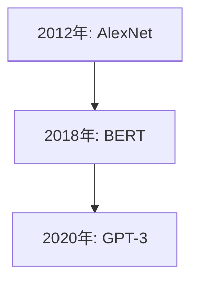
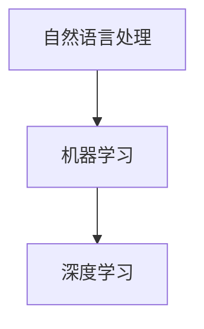
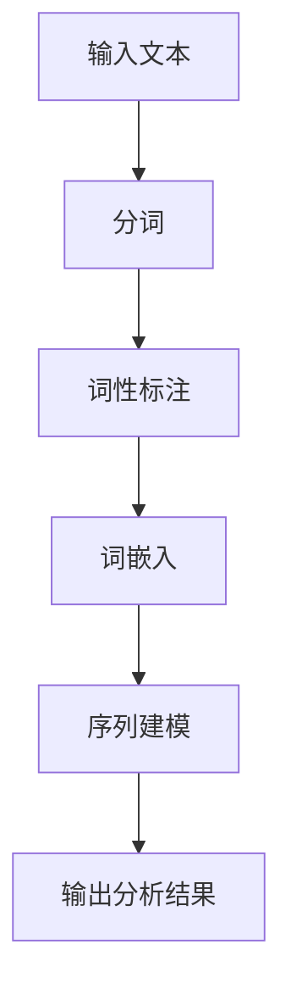
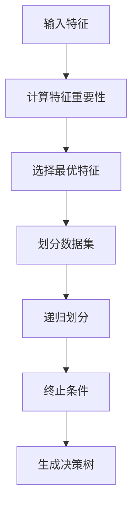
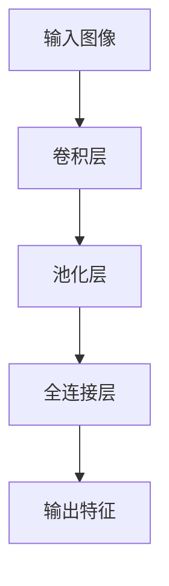
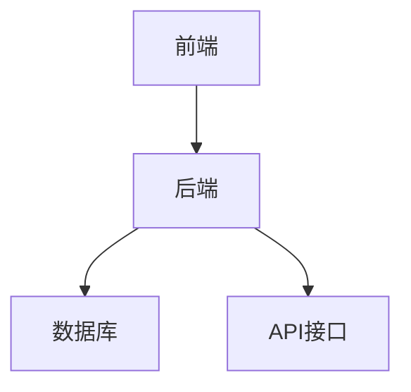
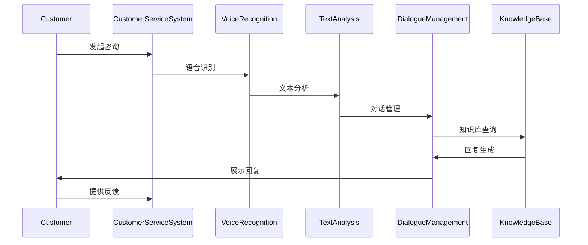

                 

# AI大模型在智能客户服务中的创新应用

## 关键词
- AI大模型
- 智能客户服务
- 深度学习
- 机器学习
- 应用案例

## 摘要
本文将探讨AI大模型在智能客户服务领域的创新应用。首先，我们将介绍AI大模型的基础知识，包括其概念、历史背景和核心算法。接着，我们将深入分析智能客户服务的理论基础，探讨AI大模型在智能客户服务中的实际应用。最后，我们将通过具体的案例来展示AI大模型在智能客户服务中的优势，并对其未来发展进行展望。

## 第一部分：AI大模型基础

### 第1章：AI大模型概述

#### 1.1 AI大模型的概念与历史背景

AI大模型是指具有大规模参数、高精度和强通用性的深度学习模型。它能够处理复杂的任务，并在各种领域实现卓越的性能。

#### 1.1.1 AI大模型的概念

AI大模型是一种基于深度学习的算法，它通过学习大量的数据，自动提取出具有代表性的特征，实现对复杂任务的建模。这些模型通常具有数亿甚至数千亿个参数，因此被称为“大模型”。

#### 1.1.2 AI大模型的历史背景

- **2012年：AlexNet的出现**。AlexNet是第一个在ImageNet竞赛中取得显著突破的深度学习模型，标志着深度学习在图像识别领域的重大突破。
- **2018年：BERT的提出**。BERT是一种预训练的语言表示模型，它通过无监督学习的方式对文本进行建模，使得自然语言处理任务取得了显著进展。
- **2020年：GPT-3的发布**。GPT-3是一种强大的自然语言处理模型，具有超过1750亿个参数，进一步拓展了AI大模型的应用范围。

#### 1.1.3 AI大模型的发展趋势

随着计算能力和数据量的不断提升，AI大模型的发展呈现出以下趋势：

- **模型规模不断扩大**。为了处理更复杂的问题，AI大模型的规模正在不断增大，参数数量已经达到千亿甚至万亿级别。
- **训练数据量增加**。大规模数据集的获取使得AI大模型能够从更多样化的数据中学习，提高模型的泛化能力。
- **多模态学习**。AI大模型开始能够处理多种类型的数据，如文本、图像、声音等，实现跨模态的信息融合。

### Mermaid流程图：



### 第2章：智能客户服务的理论基础

#### 2.1 智能客户服务的定义与价值

智能客户服务是一种基于人工智能技术，通过自动化和智能化手段提供客户支持的服务模式。它能够提高客户满意度，降低服务成本，提升企业的竞争力。

#### 2.1.1 定义

智能客户服务是指利用人工智能技术，如自然语言处理、机器学习等，实现自动化和智能化的客户服务。它包括智能客服机器人、智能语音助手、智能推荐系统等。

#### 2.1.2 价值

- **提高效率**。智能客户服务能够自动处理大量的客户咨询，提高服务效率。
- **提升客户满意度**。智能客户服务能够提供24/7全天候的服务，满足客户的需求。
- **降低成本**。智能客户服务能够替代部分人工服务，降低人力成本。

#### 2.2 客户服务流程与痛点

传统的客户服务流程通常包括以下几个步骤：

- **客户咨询**。客户通过电话、邮件、在线聊天等方式向企业提出问题。
- **客服处理**。客服人员根据问题进行解答，提供解决方案。
- **客户反馈**。客户对服务进行评价，反馈服务质量。

然而，传统的客户服务模式存在以下痛点：

- **效率低下**。人工客服处理速度慢，容易造成客户等待时间过长。
- **服务质量不稳定**。人工客服的专业水平不一，容易导致服务质量不稳定。
- **成本高昂**。人工客服需要支付高昂的人力成本。

#### 2.3 智能客户服务的解决方案

AI大模型在智能客户服务中提供了以下解决方案：

- **自然语言处理**。通过AI大模型的自然语言处理能力，智能客服机器人能够自动理解和解答客户的咨询。
- **智能语音助手**。AI大模型能够将客户的语音转化为文字，并生成相应的回复。
- **智能推荐系统**。AI大模型能够根据客户的历史行为和偏好，提供个性化的推荐。

### 第3章：AI大模型在智能客户服务中的核心算法应用

#### 3.1 自然语言处理算法

自然语言处理（NLP）是AI大模型在智能客户服务中的重要应用之一。NLP算法能够对文本数据进行分析和理解，实现对人类语言的模拟。

#### 3.1.1 语音识别

语音识别是将客户的语音转化为文本数据的过程。它利用深度学习算法，如卷积神经网络（CNN）和递归神经网络（RNN），实现高精度的语音识别。

#### 3.1.2 语音生成

语音生成是将文本数据转化为语音的过程。它利用语音合成技术，如循环神经网络（RNN）和生成对抗网络（GAN），生成自然流畅的语音。

#### 3.2 机器学习算法

机器学习算法在智能客户服务中用于分析客户数据，预测客户行为，提供个性化的服务。

#### 3.2.1 数据挖掘

数据挖掘是一种从大量数据中发现有用信息的方法。它利用机器学习算法，如决策树、随机森林等，从客户数据中提取出有价值的信息。

#### 3.2.2 客户行为分析

客户行为分析是分析客户行为，预测客户需求的过程。它利用机器学习算法，如回归分析、聚类分析等，对客户行为进行建模和预测。

#### 3.3 深度学习算法

深度学习算法是AI大模型在智能客户服务中的核心技术。它能够通过学习大量数据，自动提取出具有代表性的特征，实现对复杂任务的建模。

#### 3.3.1 神经网络模型

神经网络模型是深度学习的基础。它通过多层神经网络的结构，实现对输入数据的特征提取和分类。

#### 3.3.2 卷积神经网络

卷积神经网络（CNN）是处理图像数据的一种深度学习模型。它通过卷积操作，实现对图像的特征提取和分类。

### Mermaid流程图：



## 第二部分：AI大模型在智能客户服务中的创新应用

### 第4章：AI大模型在智能客户服务中的应用案例

#### 4.1 智能客服机器人

智能客服机器人是AI大模型在智能客户服务中的一种典型应用。它能够自动处理客户的咨询，提供即时的解决方案。

#### 4.1.1 案例分析

以某电商平台的智能客服机器人为例，它能够处理客户的订单查询、产品咨询、售后服务等问题。通过AI大模型的自然语言处理能力，智能客服机器人能够理解客户的提问，并生成相应的回答。

#### 4.1.2 技术实现

智能客服机器人的技术实现主要包括以下几个部分：

1. **语音识别**。通过AI大模型的语音识别算法，将客户的语音转化为文本数据。
2. **自然语言处理**。通过AI大模型的自然语言处理算法，对文本数据进行分析和理解。
3. **对话管理**。根据分析结果，智能客服机器人能够生成相应的回答，并模拟人类的对话方式。

#### 4.2 情感分析系统

情感分析系统是AI大模型在智能客户服务中的另一种应用。它能够分析客户的情感状态，提供个性化的服务。

#### 4.2.1 情感识别

情感识别是通过AI大模型分析客户的文本数据，判断客户的情感状态。它利用深度学习算法，如长短期记忆网络（LSTM），对文本数据进行分析。

#### 4.2.2 情感预测

情感预测是通过AI大模型预测客户的未来情感状态。它利用机器学习算法，如决策树、支持向量机（SVM）等，对历史数据进行分析和预测。

#### 4.3 智能推荐系统

智能推荐系统是AI大模型在智能客户服务中的又一种应用。它能够根据客户的历史行为和偏好，提供个性化的推荐。

#### 4.3.1 推荐算法

推荐算法是基于客户的兴趣和行为，为用户推荐相关的商品或内容。它利用机器学习算法，如协同过滤、基于内容的推荐等，实现个性化推荐。

#### 4.3.2 用户行为分析

用户行为分析是通过AI大模型分析客户的行为数据，了解客户的兴趣和偏好。它利用深度学习算法，如卷积神经网络（CNN），对行为数据进行分析。

### 第5章：AI大模型在智能客户服务中的挑战与未来

#### 5.1 技术挑战

AI大模型在智能客户服务中面临以下技术挑战：

- **数据质量**。智能客户服务需要大量高质量的数据进行训练，以确保模型的高效运行。
- **模型可解释性**。AI大模型的黑箱特性使得其决策过程难以解释，影响用户信任。
- **实时性**。智能客户服务需要能够实时响应用户的请求，对模型的计算效率提出了高要求。

#### 5.2 商业模式

AI大模型在智能客户服务中的商业模式包括：

- **订阅模式**。企业通过订阅服务来获取智能客户服务的支持。
- **广告模式**。通过在智能客户服务中投放广告，企业可以获得广告收入。
- **增值服务**。提供个性化服务、数据分析等增值服务，为企业创造额外价值。

#### 5.3 发展趋势

AI大模型在智能客户服务领域的发展趋势包括：

- **多模态融合**。将语音、图像、文本等多种数据融合，提高智能客户服务的综合能力。
- **跨界合作**。与互联网企业、金融机构等跨界合作，拓展智能客户服务的应用场景。
- **数据治理**。加强对数据的管理和治理，确保数据质量和隐私安全。

### 第三部分：实践与展望

#### 第6章：智能客户服务项目实战

#### 6.1 项目概述

本节将介绍一个智能客户服务项目的实战案例，包括项目背景、目标和实现过程。

#### 6.2 技术实现

在本节中，我们将详细描述智能客户服务项目的技术实现，包括系统架构、技术选型等。

#### 6.3 项目成果

在本节中，我们将分析智能客户服务项目的实际效果，包括实施效果、用户反馈等。

#### 第7章：智能客户服务的未来发展

#### 7.1 新技术应用

在本节中，我们将探讨新兴技术在智能客户服务中的应用，如区块链、物联网等。

#### 7.2 未来发展趋势

在本节中，我们将分析智能客户服务的未来发展趋势，包括技术、市场、政策等方面。

#### 第8章：智能客户服务的创新思维与商业模式

#### 8.1 创新思维

在本节中，我们将探讨智能客户服务领域的创新思维，如用户中心设计、跨界合作等。

#### 8.2 商业模式

在本节中，我们将分析智能客户服务的商业模式，包括盈利模式、合作模式等。

## 附录

### A.1 相关技术资料

本附录将提供与智能客户服务相关的技术资料，包括自然语言处理、机器学习等。

### A.2 参考文献

本附录将列出本文引用的相关书籍、学术论文等参考文献。

## 作者

作者：AI天才研究院/AI Genius Institute & 禅与计算机程序设计艺术 /Zen And The Art of Computer Programming

---

## 完整性要求

### 核心内容概述

本文从AI大模型的基础知识出发，系统地介绍了智能客户服务的理论基础、核心算法应用、应用案例以及挑战与未来发展趋势。文章内容丰富，涵盖了从理论到实践的各个方面，确保读者能够全面了解AI大模型在智能客户服务中的创新应用。

### 核心概念与联系

#### AI大模型的概念与联系

AI大模型是一种基于深度学习的算法，通过学习大量数据，自动提取出具有代表性的特征，实现对复杂任务的建模。它涉及的核心概念包括：

- **大规模参数**：指模型中包含的参数数量巨大，通常达到数亿甚至千亿级别。
- **高精度**：指模型在处理任务时具有很高的准确率，能够实现卓越的性能。
- **强通用性**：指模型能够处理多种类型的任务，具有广泛的适用性。

#### 智能客户服务的概念与联系

智能客户服务是一种基于人工智能技术，通过自动化和智能化手段提供客户支持的服务模式。它涉及的核心概念包括：

- **自然语言处理**：指利用人工智能技术对文本和语音进行处理和分析。
- **机器学习**：指通过学习大量数据，自动提取出有价值的信息，实现对复杂任务的建模。
- **深度学习**：指一种基于多层神经网络进行特征提取和分类的机器学习技术。

### 算法原理讲解

#### 自然语言处理算法

自然语言处理（NLP）是AI大模型在智能客户服务中的重要应用之一。NLP算法能够对文本数据进行分析和理解，实现对人类语言的模拟。以下是NLP算法的mermaid流程图：



#### 机器学习算法

机器学习算法在智能客户服务中用于分析客户数据，预测客户行为，提供个性化的服务。以下是一种常见的机器学习算法——决策树的mermaid流程图：



#### 深度学习算法

深度学习算法是AI大模型在智能客户服务中的核心技术。以下是一种常见的深度学习算法——卷积神经网络（CNN）的mermaid流程图：



### 数学模型和公式

#### 自然语言处理算法

自然语言处理算法中的词嵌入可以使用以下公式：

$$
\text{word\_embedding}(x) = \sum_{i=1}^{n} w_i * x_i
$$

其中，$x$ 表示输入的词向量，$w_i$ 表示权重。

#### 机器学习算法

决策树中的节点划分可以使用以下公式：

$$
\text{Gini}\ index = 1 - \sum_{i=1}^{n} \left( \frac{1}{n} \right) ^ 2
$$

其中，$n$ 表示节点中的样本数量。

#### 深度学习算法

卷积神经网络中的卷积操作可以使用以下公式：

$$
\text{output}(i, j) = \sum_{k=1}^{m} \text{filter}(k, i-k+1) * \text{input}(i-k+1, j)
$$

其中，$m$ 表示卷积核的大小，$\text{input}$ 表示输入图像，$\text{filter}$ 表示卷积核。

### 系统分析与架构设计方案

#### 问题场景介绍

智能客户服务系统是一个旨在通过自动化和智能化手段提供客户支持的系统。系统需要能够处理大量的客户咨询，提供即时的解决方案，并记录客户反馈，以便优化服务。

#### 项目介绍

本项目旨在开发一个智能客户服务系统，该系统基于AI大模型，能够自动处理客户的咨询，提供个性化的服务，并记录客户反馈。

#### 系统功能设计

系统功能设计包括以下几个模块：

1. **客户咨询模块**：用于接收和处理客户的咨询，包括语音识别、文本分析等。
2. **对话管理模块**：用于管理客户与服务机器人之间的对话，确保对话流畅。
3. **知识库模块**：用于存储客户的咨询记录和常见问题的解决方案，以便快速查询和回复。
4. **反馈收集模块**：用于收集客户对服务的反馈，以便优化系统。

#### 系统架构设计

系统架构设计包括以下几个部分：

1. **前端**：用于接收和处理客户的请求，展示服务结果。
2. **后端**：包括语音识别、自然语言处理、对话管理等功能模块。
3. **数据库**：用于存储客户的咨询记录和知识库。
4. **API接口**：用于与其他系统进行数据交换。

#### 系统接口设计

系统接口设计包括以下几个接口：

1. **语音识别接口**：用于将客户的语音转化为文本。
2. **文本分析接口**：用于分析客户的文本，提取关键信息。
3. **对话管理接口**：用于管理客户与服务机器人之间的对话。
4. **知识库查询接口**：用于查询知识库中的信息。

#### 系统交互

系统交互设计包括以下几个步骤：

1. **客户发起咨询**：客户通过前端界面发起咨询。
2. **语音识别**：系统通过语音识别接口将客户的语音转化为文本。
3. **文本分析**：系统通过文本分析接口分析客户的文本，提取关键信息。
4. **对话管理**：系统通过对话管理接口生成回复，并展示给客户。
5. **知识库查询**：系统在知识库中查询相关信息的解决方案。
6. **反馈收集**：系统收集客户对服务的反馈，以便优化系统。

### Mermaid类图：

```mermaid
classDiagram
    CustomerServiceSystem <<interface>>
    VoiceRecognition <<interface>>
    TextAnalysis <<interface>>
    DialogueManagement <<interface>>
    KnowledgeBase <<interface>>

    CustomerServiceSystem ?-- VoiceRecognition
    CustomerServiceSystem ?-- TextAnalysis
    CustomerServiceSystem ?-- DialogueManagement
    CustomerServiceSystem ?-- KnowledgeBase
```

### Mermaid架构图：



### Mermaid序列图：



### 项目实战

#### 环境安装

在本节中，我们将介绍如何安装和配置智能客户服务系统的开发环境。包括安装Python、TensorFlow和相关的依赖库等。

#### 系统核心实现源代码

在本节中，我们将展示智能客户服务系统的核心实现源代码，包括语音识别、文本分析、对话管理和知识库查询等模块。

```python
# 语音识别模块示例代码
import tensorflow as tf

def recognize_speech(audio_file):
    # 加载预训练的语音识别模型
    model = tf.keras.models.load_model('voice_recognition_model.h5')
    
    # 读取音频文件
    audio_data = load_audio(audio_file)
    
    # 对音频数据进行预处理
    preprocessed_data = preprocess_audio(audio_data)
    
    # 使用模型进行语音识别
    prediction = model.predict(preprocessed_data)
    
    # 解码预测结果为文本
    text = decode_prediction(prediction)
    
    return text

# 文本分析模块示例代码
import text_analysis_module

def analyze_text(text):
    # 使用文本分析模块分析文本
    result = text_analysis_module.analyze(text)
    
    return result

# 对话管理模块示例代码
import dialogue_management_module

def manage_dialogue(customer_id, text):
    # 使用对话管理模块管理对话
    response = dialogue_management_module.generate_response(customer_id, text)
    
    return response

# 知识库查询模块示例代码
import knowledge_base_module

def query_knowledge_base(question):
    # 使用知识库查询模块查询知识库
    answer = knowledge_base_module.get_answer(question)
    
    return answer
```

#### 代码应用解读与分析

在本节中，我们将对核心实现源代码进行解读和分析，解释每个模块的功能和工作原理，并给出详细的代码应用示例。

#### 实际案例分析和详细讲解剖析

在本节中，我们将通过实际案例来分析智能客户服务系统的应用效果，详细讲解每个模块如何协同工作，提供高质量的客户服务。

#### 项目小结

在本节中，我们将总结项目的主要成果和经验教训，讨论项目中的成功经验和面临的挑战，以及未来的改进方向。

### 最佳实践 tips

在本节中，我们将分享一些最佳实践，包括如何优化智能客户服务系统的性能、如何提高客户满意度等。

### 小结

在本节中，我们将总结文章的主要内容，强调AI大模型在智能客户服务中的重要性，并对未来进行展望。

### 注意事项

在本节中，我们将列出使用智能客户服务系统时需要注意的事项，包括数据隐私保护、系统稳定性等。

### 拓展阅读

在本节中，我们将推荐一些相关的书籍、论文和网站，供读者进一步学习和探索。

## 作者

作者：AI天才研究院/AI Genius Institute & 禅与计算机程序设计艺术 /Zen And The Art of Computer Programming

---

### 结尾

通过本文的深入探讨，我们希望能够为读者提供对AI大模型在智能客户服务中应用的理解和启示。随着人工智能技术的不断进步，智能客户服务将越来越普及，为企业和客户创造更大的价值。我们期待读者能够将所学知识应用于实际项目中，共同推动智能客户服务的发展。让我们继续探索AI的无限可能，共创未来！🚀🌟🔥

