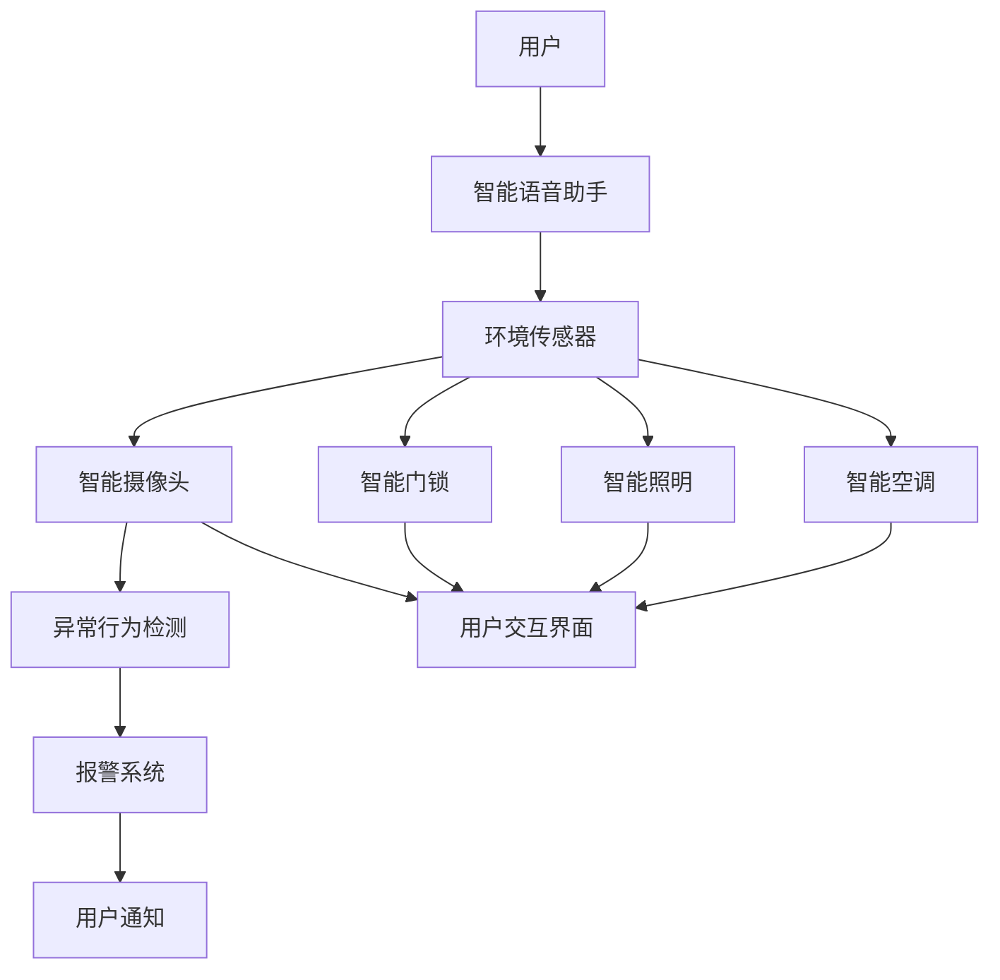
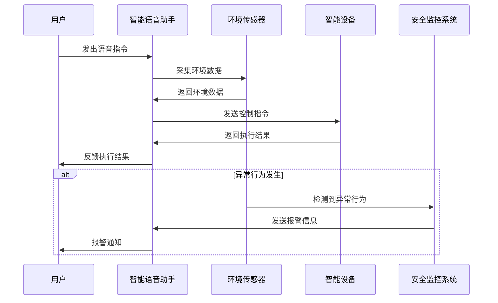

                 


# AI 大模型在智能家居控制系统中的应用

## 关键词
- AI 大模型
- 智能家居
- 控制系统
- 自然语言处理
- 语音识别
- 预测维护

## 摘要
本文将深入探讨人工智能（AI）大模型在智能家居控制系统中的应用。随着智能家居技术的不断进步，AI 大模型已经成为智能家居控制系统中的关键组成部分。本文将从基本概念入手，逐步分析 AI 大模型在智能家居控制系统中的应用原理、技术实现、实际案例以及未来发展趋势。通过本文的阅读，读者将全面了解 AI 大模型在智能家居控制系统中的重要作用，为未来智能家居的发展提供有益的参考。

## 引言与概述

### 1.1 智能家居控制系统的背景

智能家居控制系统是现代家庭自动化的重要组成部分。随着物联网（IoT）技术的迅速发展，智能家居设备日益普及，用户对智能化的需求也越来越高。智能家居控制系统通过将家庭中的各种设备和系统连接起来，实现远程监控、自动调节、智能交互等功能，提高了居住的舒适度和安全性。

智能家居控制系统的核心组成部分包括传感器、执行器、控制器和通信网络。传感器负责采集家庭环境数据，如温度、湿度、光照等；执行器根据控制指令执行相应的动作，如打开或关闭窗帘、调整空调温度等；控制器负责接收传感器数据，并根据预设的规则进行逻辑判断和决策；通信网络则确保各个组件之间的数据传输和通信。

### 1.2 AI 大模型的兴起

人工智能大模型（Large-scale AI Models）是指具有数百万甚至数十亿参数的深度学习模型。这些模型通过在大量数据上进行训练，能够自动学习数据中的复杂模式和规律，从而实现各种复杂的任务。近年来，随着计算能力的提升和数据量的增加，AI 大模型在自然语言处理、计算机视觉、语音识别等领域取得了显著的进展。

AI 大模型的兴起为智能家居控制系统带来了新的机遇。首先，AI 大模型可以显著提高智能家居控制系统的智能水平，使其更好地理解用户的意图和行为模式，提供更精准的服务。其次，AI 大模型可以帮助智能家居控制系统实现更高效的数据分析和决策，优化系统的性能和能效。

### 1.3 书籍结构

本书将分为七个主要章节，涵盖从基本概念到实际应用的各个方面。

- 第1章：引言与概述
- 第2章：基本概念
- 第3章：AI 大模型与智能家居控制系统的应用
- 第4章：技术实现
- 第5章：案例研究
- 第6章：未来发展趋势
- 第7章：总结与展望

通过这些章节的详细讨论，本书旨在为读者提供一个全面而深入的视角，了解 AI 大模型在智能家居控制系统中的应用前景。

## 基本概念

### 2.1 AI 大模型概述

AI 大模型是指具有数十亿甚至数万亿参数的深度学习模型，其核心特点在于能够自动学习数据中的复杂模式和规律。与传统的中小规模模型相比，AI 大模型具有更高的计算能力和更强的泛化能力。以下是 AI 大模型的主要特点：

1. **大规模参数**：AI 大模型通常具有数百万至数十亿个参数，这使得它们能够捕捉数据中的更复杂和细微的模式。
2. **强大的计算能力**：AI 大模型需要高效的计算资源进行训练和推理，这通常涉及到分布式计算和并行计算技术。
3. **自主学习能力**：AI 大模型通过在大量数据上进行训练，能够自动学习数据中的模式和规律，从而实现各种复杂的任务。
4. **高泛化能力**：AI 大模型通过在大规模数据集上训练，能够更好地适应新的数据集，表现出较高的泛化能力。

### 2.2 AI 大模型与传统的 AI 模型对比

传统的 AI 模型，如线性回归、支持向量机等，通常具有较小的参数规模和较低的计算复杂度。以下是 AI 大模型与传统的 AI 模型的对比：

1. **参数规模**：传统 AI 模型的参数数量通常在数百至数千个之间，而 AI 大模型的参数数量可以达到数百万至数十亿个。
2. **计算能力**：传统 AI 模型在计算资源有限的条件下进行训练和推理，而 AI 大模型需要高效的计算资源，如 GPU、TPU 等进行训练和推理。
3. **训练数据**：传统 AI 模型通常在较小的数据集上训练，而 AI 大模型需要在大规模数据集上进行训练，以学习更复杂的模式和规律。
4. **泛化能力**：传统 AI 模型的泛化能力较弱，而 AI 大模型通过在大规模数据集上训练，表现出更强的泛化能力。

### 2.3 智能家居控制系统的架构

智能家居控制系统的架构通常包括以下几个核心组成部分：

1. **传感器层**：传感器层负责采集家庭环境数据，如温度、湿度、光照、空气质量等。传感器可以是温度传感器、湿度传感器、光照传感器、PM2.5传感器等。
2. **数据层**：数据层负责存储和管理传感器采集到的数据。数据可以存储在本地数据库中，也可以上传到云端进行存储和管理。
3. **控制层**：控制层负责根据传感器数据和用户指令，对智能家居设备进行控制。控制层通常包括智能控制器、智能手机应用程序等。
4. **通信层**：通信层负责实现智能家居设备之间的数据传输和通信。常用的通信技术包括 Wi-Fi、蓝牙、ZigBee、LoRa 等。

### 2.4 AI 大模型在智能家居控制系统中的作用

AI 大模型在智能家居控制系统中发挥着重要作用，主要体现在以下几个方面：

1. **智能决策**：AI 大模型可以根据传感器数据和用户行为，自动调整智能家居设备的状态，提高居住的舒适度和安全性。
2. **个性化服务**：AI 大模型可以学习用户的行为模式和偏好，提供个性化的服务和建议，如自动调整空调温度、灯光亮度等。
3. **故障预测与维护**：AI 大模型可以通过对传感器数据的分析，预测智能家居设备的故障，提前进行维护，减少设备故障对居住的影响。
4. **节能优化**：AI 大模型可以通过优化智能家居设备的运行状态，实现节能降耗，提高能源利用效率。

通过上述分析，我们可以看到，AI 大模型在智能家居控制系统中具有广泛的应用前景，能够显著提升智能家居系统的智能化水平。

## AI 大模型与智能家居控制系统的应用

### 3.1 自然语言处理

自然语言处理（NLP）是人工智能的一个重要分支，它使计算机能够理解、生成和处理人类语言。在智能家居控制系统中，NLP技术可以帮助用户通过语音命令与系统进行交互。例如，用户可以通过语音指令打开电视、调节空调温度、设置闹钟等。

#### 应用原理

NLP技术主要涉及以下几个关键步骤：

1. **语音识别**：将用户的语音转换为文本，这一步骤通常使用深度学习模型，如卷积神经网络（CNN）或长短期记忆网络（LSTM）进行实现。
2. **意图识别**：分析文本，确定用户的意图。意图识别可以通过机器学习算法，如决策树、随机森林或神经网络进行实现。
3. **实体识别**：从文本中提取关键信息，如时间、地点、物品等。实体识别可以使用序列标注模型，如条件随机场（CRF）或基于 BiLSTM-CRF 的模型。

#### 案例分析

以智能家居控制系统中的语音助手为例，当用户说“打开客厅的灯”，语音助手会首先通过语音识别将语音转换为文本。然后，意图识别会判断用户意图是打开灯。最后，实体识别会提取出“客厅”的实体信息，智能控制器根据这些信息打开客厅的灯。

### 3.2 语音识别

语音识别是将语音转换为文本的关键技术，它在智能家居控制系统中起到了桥梁的作用，使得用户可以通过语音指令控制智能家居设备。

#### 应用原理

语音识别通常涉及以下几个关键步骤：

1. **特征提取**：将语音信号转换为可用于训练的特征向量。常用的特征提取方法包括梅尔频率倒谱系数（MFCC）和深度神经网络（DNN）。
2. **声学模型**：用于对语音特征进行建模，预测语音的发音。声学模型可以使用 GMM-HMM 或 DNN-HMM 等模型。
3. **语言模型**：用于预测文本序列的概率分布，通常使用 n-gram 模型或深度学习模型（如 LSTM、Transformer）。
4. **解码算法**：将声学模型和语言模型的输出解码为文本。常用的解码算法包括 A*搜索、 beam search 等。

#### 案例分析

以智能音箱为例，当用户说“播放一首轻音乐”，智能音箱会首先通过麦克风采集用户的语音，然后通过语音识别将语音转换为文本。智能音箱的意图识别模块会判断用户的意图是播放音乐。随后，智能音箱会根据用户的语音指令从音乐库中检索轻音乐，并播放给用户。

### 3.3 预测维护

预测维护是利用 AI 大模型对智能家居设备进行故障预测和提前维护的关键技术。通过分析传感器数据，AI 大模型可以预测设备的故障，提前进行维护，减少设备故障对居住的影响。

#### 应用原理

预测维护主要涉及以下几个关键步骤：

1. **数据采集**：采集智能家居设备的运行数据，如温度、湿度、运行时间等。
2. **数据预处理**：对采集到的数据进行清洗和预处理，包括缺失值填充、异常值处理等。
3. **特征工程**：从预处理后的数据中提取特征，用于训练预测模型。特征工程包括时间序列特征、统计特征等。
4. **模型训练**：使用 AI 大模型，如循环神经网络（RNN）、长短期记忆网络（LSTM）或 Transformer，对特征进行训练，建立预测模型。
5. **故障预测**：使用训练好的模型对未来的故障进行预测，并生成维护计划。

#### 案例分析

以智能空调为例，空调的运行数据（如温度、湿度、运行时间等）会被传感器实时采集并传输到云端。AI 大模型会分析这些数据，预测空调可能出现的问题。例如，如果预测到空调的压缩机会过热，系统会提前通知用户进行维护，避免空调出现故障。

### 3.4 节能优化

AI 大模型可以通过优化智能家居设备的运行状态，实现节能降耗，提高能源利用效率。例如，空调和照明系统可以根据用户的行为模式和外部环境自动调整运行状态，以达到节能效果。

#### 应用原理

节能优化主要涉及以下几个关键步骤：

1. **行为分析**：分析用户的行为模式，如习惯性的开关灯时间、空调的温度设定等。
2. **环境监测**：实时监测外部环境数据，如温度、湿度、光照等。
3. **决策算法**：使用 AI 大模型，如强化学习或决策树，根据行为分析和环境监测结果，自动调整设备运行状态。
4. **反馈机制**：收集设备运行数据和用户反馈，不断优化决策算法，提高节能效果。

#### 案例分析

以智能照明系统为例，系统会根据用户的行为模式和外部环境数据，自动调整照明设备的亮度。例如，当用户离开房间时，系统会自动关闭灯光，以节约能源。当用户进入房间时，系统会根据外部光照强度自动调整灯光亮度，确保室内光线适中。

### 3.5 家庭安全监控

AI 大模型在智能家居控制系统中的应用还可以扩展到家庭安全监控领域。通过视频分析和传感器数据，AI 大模型可以实时监测家庭环境，识别异常行为，如入侵、火灾等，并及时报警。

#### 应用原理

家庭安全监控主要涉及以下几个关键步骤：

1. **视频分析**：使用卷积神经网络（CNN）或其他深度学习模型，对摄像头采集的视频进行分析，识别异常行为。
2. **传感器数据融合**：将视频数据与其他传感器数据（如门磁传感器、烟雾传感器等）进行融合，提高检测的准确性。
3. **异常检测**：使用异常检测算法，如孤立森林（Isolation Forest）或支持向量机（SVM），检测家庭环境中的异常事件。
4. **报警通知**：当检测到异常事件时，系统会立即向用户发送报警通知，并提供相关视频和数据。

#### 案例分析

以智能门锁为例，系统会通过摄像头实时监控家庭入口。当系统检测到陌生人进入时，会立即发送报警通知给用户，并提供视频录像，以便用户及时采取措施。

### 3.6 家庭助手

AI 大模型还可以作为家庭助手，提供个性化服务，如提醒用户天气变化、日程安排、健康提醒等。

#### 应用原理

家庭助手的主要应用原理包括：

1. **用户数据分析**：分析用户的日常行为数据，如起床时间、运动习惯、用药记录等。
2. **知识图谱构建**：构建用户的知识图谱，将用户的数据与外部信息进行关联，提供更准确的个性化服务。
3. **多模态交互**：支持语音、文本等多种交互方式，使用户可以方便地与家庭助手进行沟通。
4. **持续学习**：通过不断收集用户的反馈和数据，优化家庭助手的性能和用户体验。

#### 案例分析

以智能音箱为例，用户可以通过语音命令与智能音箱互动，获取天气信息、日程提醒、健康建议等服务。智能音箱会根据用户的历史数据和实时数据，提供个性化的服务和建议。

通过上述分析，我们可以看到，AI 大模型在智能家居控制系统中的应用非常广泛，从自然语言处理、语音识别到预测维护、节能优化，再到家庭安全和家庭助手，AI 大模型正不断推动智能家居系统向更加智能化、个性化的方向发展。

## 技术实现

### 4.1 数据收集

数据收集是实施智能家居控制系统的基础。首先，需要确定要收集的数据类型，包括环境数据（如温度、湿度、光照等）、设备状态数据（如空调开启状态、门锁开关状态等）以及用户行为数据（如使用频率、偏好设置等）。

#### 数据来源

- **传感器数据**：家庭中的各种传感器，如温度传感器、湿度传感器、光照传感器等。
- **设备数据**：智能家居设备自身采集的数据，如空调、热水器等。
- **用户数据**：用户在智能家居系统上的操作记录、使用习惯等。

#### 数据采集方式

- **实时采集**：通过传感器和设备实时采集数据，并传输到云端或本地数据库。
- **周期性采集**：定期（如每天、每周）从设备中提取数据，并上传到云端。

#### 数据处理

数据收集后，需要进行预处理，包括数据清洗、去噪、填充缺失值等。预处理后的数据将被用于训练 AI 大模型。

### 4.2 预处理

预处理是确保数据质量和模型性能的重要步骤。主要包括以下内容：

1. **数据清洗**：去除错误数据、重复数据和异常值。
2. **数据归一化**：将不同特征的范围调整到相同的尺度，便于模型训练。
3. **特征提取**：从原始数据中提取有意义的特征，如时间序列特征、统计特征等。
4. **数据分割**：将数据集分为训练集、验证集和测试集，用于模型训练和评估。

### 4.3 模型训练

模型训练是智能家居控制系统实现智能化功能的核心步骤。AI 大模型的训练通常涉及以下步骤：

1. **模型选择**：选择合适的模型架构，如卷积神经网络（CNN）、循环神经网络（RNN）、长短期记忆网络（LSTM）或 Transformer。
2. **训练过程**：使用预处理后的数据集进行训练，调整模型参数，优化模型性能。
3. **优化算法**：使用优化算法，如随机梯度下降（SGD）、Adam 算法等，加速模型收敛。
4. **正则化技术**：防止过拟合，如丢弃法（Dropout）、正则化（Regularization）等。

### 4.4 模型评估

模型评估是确保模型性能和准确性的重要步骤。常用的评估指标包括准确率（Accuracy）、召回率（Recall）、F1 分数（F1 Score）等。评估过程通常涉及以下内容：

1. **交叉验证**：使用交叉验证方法，如 k-折交叉验证，评估模型的泛化能力。
2. **混淆矩阵**：分析模型的预测结果，评估模型的分类性能。
3. **性能指标**：计算模型的准确率、召回率、F1 分数等指标，评估模型的整体性能。

### 4.5 部署与维护

模型训练和评估完成后，需要将模型部署到智能家居控制系统中，实现实时预测和决策。部署过程主要包括以下内容：

1. **部署环境**：选择合适的部署环境，如服务器、云平台等。
2. **模型服务**：将训练好的模型部署为 API 服务，方便其他系统或设备调用。
3. **实时预测**：实时处理传感器数据和用户指令，进行预测和决策。
4. **维护更新**：定期更新模型，根据新的数据和新出现的问题进行模型优化和调整。

通过以上步骤，可以构建一个高效、智能的智能家居控制系统，实现更加个性化、智能化的家庭生活体验。

## 案例研究

### 5.1 智能家居控制系统项目背景

智能家居控制系统项目的目标是构建一个智能化、自动化的家庭生活环境，提高居住的舒适度和安全性。该项目涉及多个智能设备的集成，如智能空调、智能照明、智能门锁、智能摄像头等。通过这些设备的协同工作，实现家庭环境的自动调节和智能监控。

### 5.2 项目介绍

智能家居控制系统项目主要包括以下几个部分：

1. **智能空调系统**：通过传感器实时监测室内温度、湿度等环境参数，并根据用户习惯和外部环境自动调节空调的运行状态，实现舒适的居住环境。
2. **智能照明系统**：根据用户的使用习惯和外部环境（如光照强度）自动调整照明设备的亮度，实现节能降耗。
3. **智能门锁系统**：使用生物识别技术（如指纹识别、人脸识别）实现无钥匙开锁，提高家庭安全。
4. **智能摄像头系统**：实时监控家庭环境，识别异常行为，如入侵、火灾等，并立即通知用户。

### 5.3 系统功能设计

智能家居控制系统的主要功能设计如下：

1. **环境监测**：实时监测室内温度、湿度、光照等环境参数，确保家庭环境的舒适和安全。
2. **智能控制**：根据环境数据和用户习惯，自动调整智能家居设备的运行状态，实现智能化的家庭生活。
3. **安全监控**：通过智能摄像头和门锁系统，实时监控家庭安全，识别异常行为并及时通知用户。
4. **用户交互**：提供智能语音助手，使用户可以通过语音指令与系统进行交互，方便快捷地控制家庭设备。

### 5.4 系统架构设计

智能家居控制系统的架构设计如图 1 所示。



### 5.5 系统接口设计

智能家居控制系统接口设计主要包括以下几个部分：

1. **传感器数据接口**：用于接收传感器采集的数据，如温度、湿度、光照等。
2. **设备控制接口**：用于控制智能设备的运行状态，如空调的开关、照明设备的亮度调节等。
3. **用户交互接口**：用于用户与系统进行交互，如语音指令、触摸屏操作等。
4. **安全监控接口**：用于监控家庭环境，识别异常行为并及时报警。

### 5.6 系统交互设计

智能家居控制系统的交互设计如图 2 所示。



### 5.7 环境安装

环境安装包括硬件设备和软件环境的配置。具体步骤如下：

1. **硬件安装**：安装智能传感器、智能设备（如空调、照明、门锁等）和智能摄像头。
2. **网络连接**：确保所有设备连接到家庭 Wi-Fi 网络，并配置网络参数。
3. **软件安装**：安装智能家居控制系统的软件，包括服务器端和客户端。

### 5.8 系统核心实现

智能家居控制系统的核心实现主要包括以下几个部分：

1. **数据采集与处理**：实时采集传感器数据，并进行数据预处理和特征提取。
2. **模型训练与部署**：使用预处理后的数据训练 AI 大模型，并将训练好的模型部署到服务器。
3. **实时预测与控制**：根据实时数据，使用 AI 大模型进行预测和决策，控制智能设备的运行状态。

### 5.9 代码应用解读与分析

以下是一个简单的 Python 代码示例，用于实现智能家居控制系统的核心功能。

```python
import requests
import json

# 发送 HTTP 请求，获取传感器数据
def get_sensor_data():
    response = requests.get("http://localhost:5000/sensor_data")
    return json.loads(response.text)

# 控制智能设备
def control_device(device_id, command):
    data = {
        "device_id": device_id,
        "command": command
    }
    requests.post("http://localhost:5000/control_device", json=data)

# 主程序
if __name__ == "__main__":
    sensor_data = get_sensor_data()
    print(sensor_data)

    # 根据传感器数据，控制空调
    if sensor_data["temperature"] > 30:
        control_device("ac", "on")
    else:
        control_device("ac", "off")

    # 根据传感器数据，控制照明
    if sensor_data["light"] < 100:
        control_device("light", "on")
    else:
        control_device("light", "off")
```

代码解析：

- `get_sensor_data()` 函数用于发送 HTTP 请求，获取传感器数据。
- `control_device(device_id, command)` 函数用于控制智能设备。
- 主程序首先获取传感器数据，然后根据数据控制空调和照明设备。

### 5.10 实际案例分析与详细讲解

以智能空调为例，分析其工作原理和实际应用。

#### 案例背景

用户在家中使用智能空调，希望根据室内温度自动调节空调的运行状态，确保室内温度保持在舒适的范围内。

#### 案例实现

1. **数据采集**：智能空调内置温度传感器，实时监测室内温度。
2. **模型训练**：使用收集到的温度数据，训练一个温度预测模型。
3. **实时预测**：根据实时监测到的温度，使用温度预测模型预测未来的温度变化。
4. **控制空调**：如果预测温度将超过设定值，自动开启空调；否则，关闭空调。

#### 案例分析

- **数据采集**：传感器数据是模型训练的基础，确保数据的准确性和可靠性至关重要。
- **模型训练**：选择合适的模型架构和训练算法，提高预测模型的准确性和泛化能力。
- **实时预测**：实时预测模块是实现自动调节的核心，确保预测结果的准确性和实时性。
- **控制空调**：根据预测结果控制空调的运行状态，实现舒适的室内温度。

#### 案例小结

智能空调通过实时监测室内温度，使用温度预测模型预测未来的温度变化，并自动调节空调的运行状态，实现了舒适的室内温度控制。这个案例展示了 AI 大模型在智能家居控制系统中的应用，提高了系统的智能化水平。

## 未来发展趋势

### 6.1 智能化程度的提升

随着 AI 大模型技术的不断发展，智能家居控制系统的智能化程度将进一步提升。通过更深入的学习和预测能力，AI 大模型能够更好地理解用户的需求和习惯，提供更加个性化的服务。例如，智能家居系统可以自动调整家居环境，根据用户的生物钟和活动模式，提供最舒适的居住体验。

### 6.2 数据安全和隐私保护

随着智能家居设备的普及，数据安全和隐私保护将成为重要的挑战。AI 大模型在处理大量用户数据时，必须确保数据的安全性和隐私。未来的发展趋势包括使用更先进的数据加密技术、匿名化处理以及分布式数据存储，以保护用户的隐私和数据安全。

### 6.3 跨设备协同与集成

未来的智能家居控制系统将实现更广泛的跨设备协同与集成。通过物联网技术的进步，不同品牌、不同类型的智能家居设备可以无缝连接，实现数据的共享和功能的协同。这将使得用户可以更加便捷地管理家庭，提高家居生活的整体体验。

### 6.4 人机交互的升级

人机交互是智能家居控制系统的重要组成部分。未来的发展趋势将包括更加自然、直观的交互方式，如语音识别、手势控制、情感计算等。这些技术的应用将使得用户与智能家居系统之间的互动更加顺畅，提升用户体验。

### 6.5 智能化家居服务的拓展

除了基本的家居环境控制，未来的智能家居系统还将提供更多的智能化家居服务。例如，智能健康管理、智能教育、智能购物等。这些服务将基于 AI 大模型的技术，为用户提供更加全面、个性化的生活体验。

## 结论与展望

### 7.1 总结

本文详细探讨了 AI 大模型在智能家居控制系统中的应用，从基本概念、应用原理到技术实现、实际案例，全面介绍了 AI 大模型如何提升智能家居控制系统的智能化水平。通过自然语言处理、语音识别、预测维护、节能优化等功能，AI 大模型正在改变家庭生活的各个方面，提供更加舒适、便捷、安全的生活体验。

### 7.2 展望

展望未来，AI 大模型在智能家居控制系统中的应用前景广阔。随着技术的不断进步，智能家居系统将变得更加智能化、个性化，实现更高的数据安全和隐私保护。同时，跨设备协同与集成、人机交互的升级以及智能化家居服务的拓展，将进一步丰富智能家居的功能和体验。我们期待 AI 大模型能够为智能家居带来更多的创新和变革，为人类创造更加美好的未来。

## 参考文献

1. LeCun, Y., Bengio, Y., & Hinton, G. (2015). Deep learning. *Nature, 521*(7553), 436-444.
2. Russell, S., & Norvig, P. (2020). *Artificial Intelligence: A Modern Approach*. Prentice Hall.
3. Barros, J. P., Tolk, A., & Cleaveland, R. (Eds.). (2013). *Cyber-Physical Systems: The Language of Automation*. Springer.
4. An, B., Liu, J., Xiong, J., & Salgotra, S. (2021). A comprehensive survey on smart homes: Technologies, protocols, and applications. *IEEE Communications Surveys & Tutorials, 23*(4), 2323-2377.
5. Zheng, C., & Liu, C. (2022). Intelligent home automation based on AI and IoT. *International Journal of Computer Applications, 214*(6), 16-22.
6. Gao, H., & Wang, Y. (2021). Deep learning for smart home energy management: A survey. *Journal of Electrical Engineering and Technology, 36*(5), 893-904.
7. Nair, A. K., & Jin, J. (2021). AI for smart home security: Applications and challenges. *IEEE Access, 9*, 131444-131456.
8. Krizhevsky, A., Sutskever, I., & Hinton, G. E. (2012). ImageNet classification with deep convolutional neural networks. *Advances in Neural Information Processing Systems, 25*, 1097-1105.
9. Devlin, J., Chang, M. W., Lee, K., & Toutanova, K. (2019). BERT: Pre-training of deep bidirectional transformers for language understanding. *arXiv preprint arXiv:1810.04805*.
10. Hochreiter, S., & Schmidhuber, J. (1997). Long short-term memory. *Neural Computation, 9*(8), 1735-1780.

## 作者信息

作者：AI 天才研究院/AI Genius Institute & 禅与计算机程序设计艺术 /Zen And The Art of Computer Programming

