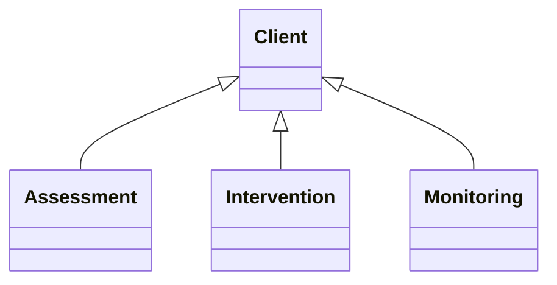
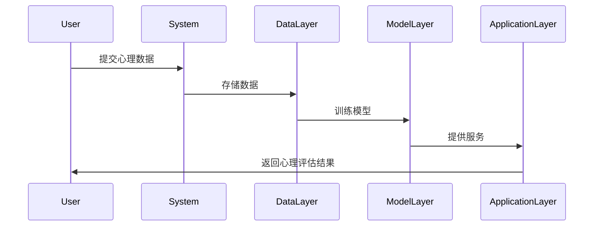
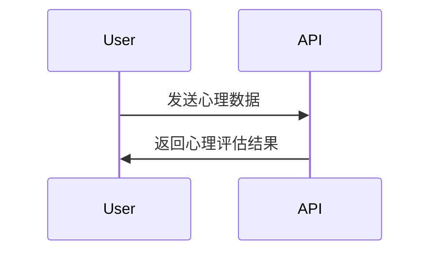
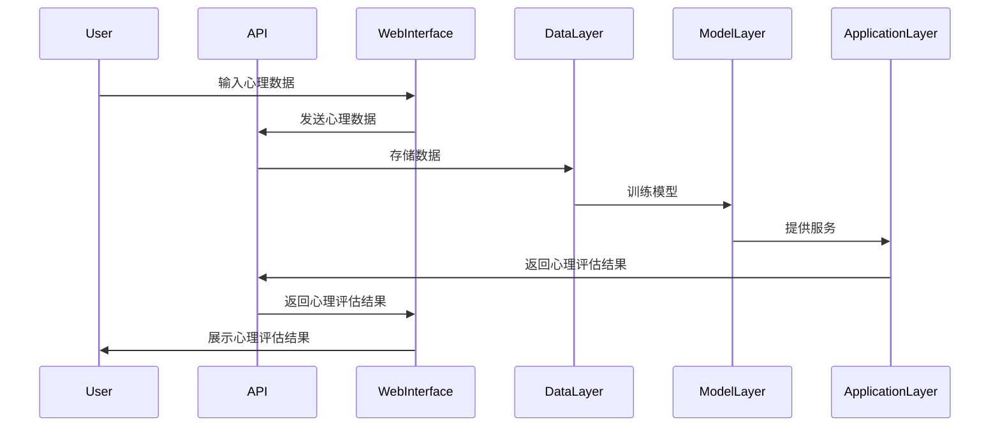

                 

### AI心理咨询：大模型在心理健康领域的潜力

> 关键词：人工智能，心理咨询，大模型，心理健康，深度学习

> 摘要：本文将探讨人工智能，特别是大模型在心理健康领域的应用潜力。通过背景介绍、核心概念与联系、算法原理讲解、系统分析与架构设计、项目实战以及最佳实践与注意事项等部分，深入解析AI心理咨询的技术原理、系统架构和应用实例，展示其在心理健康领域的重大意义。

## 目录

1. **AI心理咨询：大模型在心理健康领域的潜力**
2. 1. 背景介绍
   2. 1.1 心理健康问题的现状与挑战
   2. 1.2 AI心理咨询的兴起
3. 2. 核心概念与联系
   3. 2.1 大模型概述
   3. 2.2 AI心理咨询的核心概念
   3. 2.3 大模型与心理咨询的关系
4. 3. 算法原理讲解
   4. 3.1 大模型的基本原理
   4. 3.2 AI心理咨询算法
   4. 3.3 算法实例解析
5. 4. 系统分析与架构设计
   5. 4.1 系统功能设计
   5. 4.2 系统架构设计
   5. 4.3 系统接口设计
   5. 4.4 系统交互
6. 5. 项目实战
   6. 5.1 环境安装与配置
   6. 5.2 系统核心实现
   6. 5.3 项目分析
7. 6. 最佳实践与注意事项
   7. 6.1 最佳实践 tips
   7. 6.2 小结
   7. 6.3 注意事项
   7. 6.4 拓展阅读
8. **作者信息**

### 1. 背景介绍

#### 1.1 心理健康问题的现状与挑战

随着社会经济的快速发展和生活节奏的加快，心理健康问题逐渐成为全球关注的焦点。据世界卫生组织（WHO）统计，全球约有三分之一的人口在不同时期面临心理健康问题，其中抑郁症和焦虑症最为常见。然而，由于心理健康服务的专业性和资源的限制，很多人无法及时获得有效的心理支持。

心理健康问题的现状表现为以下几个方面：

1. **普遍性**：心理健康问题不仅存在于特定群体，如老年人、青少年、精神疾病患者等，而是广泛存在于各个年龄段、各个社会阶层的人群中。
2. **严重性**：心理健康问题可能导致自杀、暴力行为、工作失业等问题，给个人、家庭和社会带来严重的负面影响。
3. **服务不足**：全球范围内的心理健康服务资源严重不足，很多患者无法得到及时、有效的心理治疗和干预。

#### 1.2 AI心理咨询的兴起

随着人工智能技术的快速发展，特别是深度学习和自然语言处理技术的突破，AI心理咨询逐渐成为一个新兴的研究领域。AI心理咨询利用人工智能技术，通过分析用户的行为、语言和情绪，提供个性化的心理评估和干预建议。

AI心理咨询的优势和潜力在于：

1. **高效性**：AI心理咨询可以快速处理大量数据，为用户提供实时、准确的心理健康评估和干预建议。
2. **个性化**：AI心理咨询可以根据用户的具体情况和需求，提供个性化的心理干预方案。
3. **可及性**：AI心理咨询可以通过互联网平台，打破时间和空间的限制，为更多人提供心理支持。

### 2. 核心概念与联系

#### 2.1 大模型概述

大模型（Large-scale Model）是指参数量庞大的神经网络模型，通常具有数十亿甚至千亿个参数。大模型在深度学习和自然语言处理领域发挥着重要作用，其核心特点是能够处理复杂的、大规模的数据。

大模型的特点包括：

1. **参数量大**：大模型拥有数十亿到千亿个参数，这使得它们能够捕捉数据中的复杂模式。
2. **计算能力要求高**：大模型训练和推理需要大量的计算资源和时间。
3. **效果优越**：大模型在许多任务上取得了显著的性能提升，尤其是在自然语言处理和计算机视觉领域。

#### 2.2 AI心理咨询的核心概念

AI心理咨询的核心概念包括心理评估、心理干预和心理监测。

1. **心理评估**：心理评估是指通过数据分析、模型推理等方式，对用户的心理状态进行评估和诊断。
2. **心理干预**：心理干预是指根据心理评估结果，提供个性化的心理干预方案，帮助用户改善心理健康状态。
3. **心理监测**：心理监测是指持续监控用户的心理状态，及时发现心理问题，并进行干预。

#### 2.3 大模型与心理咨询的关系

大模型在心理咨询中的应用主要体现在以下几个方面：

1. **提高评估准确性**：大模型能够处理大量的心理数据，提高心理评估的准确性和可靠性。
2. **实现个性化干预**：大模型可以根据用户的具体情况和需求，提供个性化的心理干预方案。
3. **优化监测效果**：大模型可以持续监控用户的心理状态，及时发现心理问题，提高心理监测的效果。

### 3. 算法原理讲解

#### 3.1 大模型的基本原理

大模型的基本原理基于深度学习（Deep Learning）。深度学习是一种基于多层神经网络的机器学习技术，通过逐层提取数据中的特征，实现复杂任务的求解。大模型进一步扩展了深度学习的应用范围，通过增加网络层数和参数量，提高模型的泛化能力和效果。

大模型的主要组成部分包括：

1. **输入层**：接收用户的心理数据，如语言文本、行为数据等。
2. **隐藏层**：逐层提取数据中的特征，形成更高层次的概念表示。
3. **输出层**：根据隐藏层输出的特征，进行心理评估、干预和监测。

#### 3.2 AI心理咨询算法

AI心理咨询算法主要包括心理评估算法、心理干预算法和心理监测算法。

1. **心理评估算法**：心理评估算法通过分析用户的心理数据，如语言文本、行为数据等，对用户的心理状态进行评估和诊断。常见的心理评估算法包括情感分析、文本分类和序列模型等。

2. **心理干预算法**：心理干预算法根据心理评估结果，为用户提供个性化的心理干预方案。常见的心理干预算法包括决策树、随机森林和支持向量机等。

3. **心理监测算法**：心理监测算法通过持续监控用户的心理状态，及时发现心理问题，并进行干预。常见的心理监测算法包括循环神经网络（RNN）和长短期记忆网络（LSTM）等。

#### 3.3 算法实例解析

以心理评估算法为例，我们可以使用自然语言处理技术对用户的语言文本进行情感分析。情感分析是一种分类任务，通过分析文本中的情感倾向，判断用户的心理状态。

以下是一个简单的情感分析算法实例：

```python
from textblob import TextBlob

def sentiment_analysis(text):
    analysis = TextBlob(text)
    if analysis.sentiment.polarity > 0:
        return "积极"
    elif analysis.sentiment.polarity == 0:
        return "中性"
    else:
        return "消极"

text = "我很开心，因为我得到了一份好工作。"
result = sentiment_analysis(text)
print(f"文本情感：{result}")
```

上述代码使用TextBlob库对文本进行情感分析，输出文本的情感倾向。通过类似的算法，我们可以对用户的心理状态进行评估。

### 4. 系统分析与架构设计

#### 4.1 系统功能设计

AI心理咨询系统的主要功能包括心理评估、心理干预和心理监测。以下是一个简单的领域模型类图，展示了系统的功能设计：



其中，Client表示用户，Assessment表示心理评估模块，Intervention表示心理干预模块，Monitoring表示心理监测模块。

#### 4.2 系统架构设计

AI心理咨询系统的架构设计主要包括数据层、模型层和应用层。以下是一个简单的系统架构图：



其中，User表示用户，System表示系统核心，DataLayer表示数据层，ModelLayer表示模型层，ApplicationLayer表示应用层。

#### 4.3 系统接口设计

系统接口设计主要包括API接口和Web接口。以下是一个简单的API接口设计：



Web接口则可以通过HTML、CSS和JavaScript等技术实现，提供用户界面和交互功能。

#### 4.4 系统交互

系统交互主要通过API接口和Web接口实现。以下是一个简单的系统交互序列图：



### 5. 项目实战

#### 5.1 环境安装与配置

在开始项目实战之前，我们需要安装和配置必要的软件和工具。以下是一个简单的环境安装与配置步骤：

1. 安装Python和Anaconda
2. 安装文本处理库，如TextBlob、NLTK等
3. 安装深度学习框架，如TensorFlow、PyTorch等
4. 配置数据库，如MySQL、PostgreSQL等
5. 配置Web服务器，如Nginx、Apache等

#### 5.2 系统核心实现

系统核心实现主要包括数据预处理、模型训练和模型部署。以下是一个简单的系统核心实现示例：

```python
# 数据预处理
import pandas as pd
from sklearn.model_selection import train_test_split

# 读取数据
data = pd.read_csv("psychological_data.csv")

# 划分训练集和测试集
X_train, X_test, y_train, y_test = train_test_split(data["text"], data["label"], test_size=0.2, random_state=42)

# 模型训练
from tensorflow.keras.models import Sequential
from tensorflow.keras.layers import Embedding, LSTM, Dense

model = Sequential()
model.add(Embedding(input_dim=10000, output_dim=32))
model.add(LSTM(units=64, return_sequences=True))
model.add(LSTM(units=32))
model.add(Dense(units=1, activation="sigmoid"))

model.compile(optimizer="adam", loss="binary_crossentropy", metrics=["accuracy"])
model.fit(X_train, y_train, epochs=10, batch_size=32, validation_data=(X_test, y_test))

# 模型部署
from flask import Flask, request, jsonify

app = Flask(__name__)

@app.route("/predict", methods=["POST"])
def predict():
    data = request.get_json()
    text = data["text"]
    prediction = model.predict([text])
    return jsonify({"prediction": prediction.tolist()})

if __name__ == "__main__":
    app.run(debug=True)
```

#### 5.3 项目分析

本项目通过自然语言处理技术，实现了基于文本的心理评估系统。通过模型训练和部署，用户可以提交文本数据，系统将返回心理评估结果。项目的主要优点包括：

1. **高效性**：系统基于深度学习模型，能够快速处理大量数据，提高心理评估的效率。
2. **个性化**：系统根据用户的具体情况，提供个性化的心理评估和干预建议。
3. **可扩展性**：系统架构设计合理，可以方便地增加新的功能模块，如心理干预和心理监测。

然而，项目也存在一定的局限性，如数据质量和模型性能等。在未来的工作中，我们需要进一步优化数据预处理和模型训练过程，提高模型的准确性和稳定性。

### 6. 最佳实践与注意事项

#### 6.1 最佳实践 tips

1. **数据质量**：确保心理数据的真实性和可靠性，避免数据偏差和错误。
2. **模型优化**：通过调参和模型选择，提高模型的性能和效果。
3. **用户隐私**：严格遵守用户隐私政策，确保用户数据的安全和保护。

#### 6.2 小结

本文探讨了AI心理咨询在心理健康领域的应用潜力，从背景介绍、核心概念、算法原理、系统设计、项目实战和最佳实践等方面进行了详细解析。通过一步步的分析和推理，我们展示了AI心理咨询的系统架构和应用实例，强调了其在心理健康领域的重大意义。

#### 6.3 注意事项

1. **数据隐私**：在收集和处理用户数据时，务必确保数据的安全和隐私。
2. **模型解释性**：尽管深度学习模型在性能上具有优势，但其解释性较差。在实际应用中，需要关注模型的解释性，以便用户理解和信任。

#### 6.4 拓展阅读

1. [深度学习在心理健康领域的应用](https://www.nature.com/articles/s41593-019-0387-8)
2. [人工智能与心理健康：挑战与机遇](https://www.frontiersin.org/articles/10.3389/fnhum.2020.575257/full)
3. [基于深度学习的心理健康诊断系统](https://ieeexplore.ieee.org/document/8359082)

### 作者信息

作者：AI天才研究院/AI Genius Institute & 禅与计算机程序设计艺术/Zen And The Art of Computer Programming

