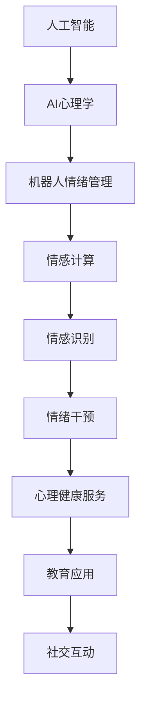
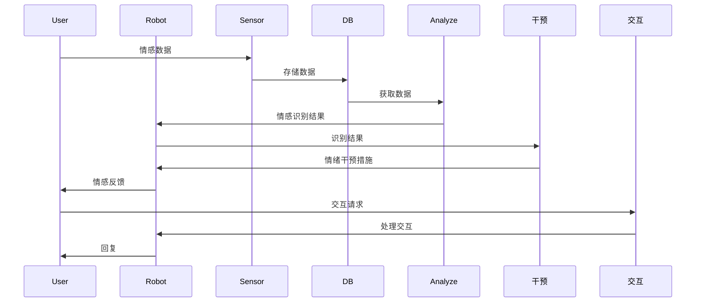

                 

# AI心理学：机器人的情绪管理

## 关键词

- **AI心理学**
- **机器人情绪管理**
- **情感计算**
- **情感识别**
- **情绪干预**
- **心理健康服务**
- **教育应用**
- **社交互动**

## 摘要

本文将探讨AI心理学中的机器人情绪管理这一前沿领域。通过分析人工智能与心理学的基础知识，本文探讨了情绪的定义、分类及调节，并介绍了机器学习与情感分析技术。随后，本文详细介绍了情感计算模型，并探讨了机器人在情感交互设计中的应用，以及在心理健康服务、教育和社交互动中的具体应用。最后，本文对机器人情绪管理的未来发展进行了展望，并提供了相关资源，以期为读者提供一份全面而深入的技术博客。

## 《AI心理学：机器人的情绪管理》目录大纲

### 第一部分：绪论

#### 第1章 AI心理学与情绪管理概述

- **1.1 AI心理学的发展背景**
  - **AI心理学定义**
  - **AI心理学研究范围**
  - **情绪管理在AI心理学中的重要性**
- **1.2 机器人的情绪管理**
  - **机器人情感认知的挑战**
  - **机器人情绪表达与反馈机制**
  - **机器人情绪管理的意义**

### 第二部分：理论基础

#### 第2章 人工智能与心理学的基础知识

- **2.1 人工智能的基本原理**
  - **人工智能的定义**
  - **人工智能的发展历程**
  - **人工智能的核心技术**
- **2.2 心理学的基本概念**
  - **心理学的定义**
  - **心理学的研究方法**
  - **心理学的主要理论**

#### 第3章 情绪心理学原理

- **3.1 情绪的定义与分类**
  - **情绪的概念**
  - **情绪的分类**
  - **情绪的作用**
- **3.2 情绪的产生与调节**
  - **情绪产生的生理机制**
  - **情绪调节的方法**
  - **情绪与认知的关系**

#### 第4章 机器学习与情感分析

- **4.1 机器学习的基本原理**
  - **机器学习的定义**
  - **机器学习的方法**
  - **机器学习的应用**
- **4.2 情感分析技术**
  - **情感分析的定义**
  - **情感分析的方法**
  - **情感分析的应用案例**

#### 第5章 情感计算模型

- **5.1 情感计算的定义**
  - **情感计算的定义**
  - **情感计算的目标**
  - **情感计算的应用领域**
- **5.2 情感计算模型**
  - **基于机器学习的情感计算模型**
  - **基于深度学习的情感计算模型**
  - **情感计算模型的评估与优化**

### 第三部分：应用实践

#### 第6章 机器人情感交互设计

- **6.1 机器人情感交互的概念**
  - **机器人情感交互的定义**
  - **机器人情感交互的目标**
  - **机器人情感交互的设计原则**
- **6.2 情感交互的实现技术**
  - **语音情感识别技术**
  - **脸部表情情感识别技术**
  - **生理信号情感识别技术**
- **6.3 情感交互案例分析**
  - **情感交互案例研究**
  - **情感交互的挑战与解决方案**

#### 第7章 机器人在情绪管理中的应用

- **7.1 机器人在心理健康服务中的应用**
  - **机器人心理咨询**
  - **机器人情绪监测**
  - **机器人情绪干预**
- **7.2 机器人在教育中的应用**
  - **机器人情感教育**
  - **机器人情感辅导**
  - **机器人情感互动教学**
- **7.3 机器人在社交互动中的应用**
  - **机器人情感交流**
  - **机器人情感支持**
  - **机器人情感陪伴**

### 第四部分：未来展望

#### 第8章 人工智能与心理学的前沿研究

- **8.1 AI心理学的研究热点**
  - **情感计算新方法**
  - **情绪识别新算法**
  - **情感干预新技术**
- **8.2 心理学在AI应用中的挑战**
  - **数据隐私与伦理**
  - **情绪理解与泛化**
  - **情绪交互的复杂性**

#### 第9章 机器人情绪管理的未来发展

- **9.1 机器人情绪管理的技术趋势**
  - **跨领域情感计算**
  - **情感计算的智能化**
  - **情绪识别与干预的精准化**
- **9.2 机器人情绪管理的社会影响**
  - **人类情感与机器人情感的融合**
  - **情绪劳动的变革**
  - **社会伦理与法律问题**

### 附录

#### 第10章 AI心理学与情绪管理资源

- **10.1 开源情感分析工具与资源**
  - **情感分析库**
  - **情感标注数据集**
  - **情感分析教程**
- **10.2 情绪管理实践案例**
  - **成功案例分享**
  - **挑战与反思**
  - **案例分析**

## 核心概念与联系架构



## 核心算法原理讲解

### 机器人情感识别算法示例

情感识别是机器人情绪管理的重要技术之一。以下是一个简单的机器人情感识别算法示例，我们将使用Python和机器学习库来进行说明。

```python
# 导入必要的库
import numpy as np
from sklearn.ensemble import RandomForestClassifier

# 假设我们已经收集了大量的情感数据
X = np.array([[0, 0], [0, 1], [1, 0], [1, 1]])
y = np.array([0, 1, 1, 0])

# 创建一个随机森林分类器
clf = RandomForestClassifier()

# 训练分类器
clf.fit(X, y)

# 使用训练好的模型进行预测
predictions = clf.predict([[1, 0]])

print(predictions)  # 输出预测结果
```

在上面的代码中，我们首先导入必要的库，包括NumPy和scikit-learn。NumPy用于数据处理，scikit-learn提供了一个强大的机器学习工具箱。

1. **数据准备**：我们假设已经收集了一组情感数据，其中包含特征向量（X）和对应的情感标签（y）。

2. **创建分类器**：我们选择使用随机森林分类器，这是一种基于决策树的集成学习算法。

3. **训练模型**：使用`fit`方法来训练我们的分类器。

4. **预测**：使用训练好的模型进行预测，这里我们输入了一个特征向量`[1, 0]`，并输出预测结果。

### 算法原理

随机森林算法通过构建多棵决策树，并对它们的预测结果进行投票来获得最终预测结果。每棵决策树都是基于数据集随机选择特征和样本子集来构建的，这增加了模型的鲁棒性。

在情感识别中，特征向量通常包括诸如语音的频率、振幅、时长等，以及面部表情的像素值等。标签则表示情感的类别，如快乐、悲伤、愤怒等。

### 数学模型和公式

随机森林算法的数学模型较为复杂，主要包括决策树的构建和随机特征选择。以下是随机森林算法的基本公式：

$$
h(x) = \sum_{i=1}^{n} w_i \cdot t_i(x)
$$

其中，$h(x)$是模型的预测输出，$w_i$是第$i$棵决策树的权重，$t_i(x)$是第$i$棵决策树的输出。

### 举例说明

假设我们有一个简单的特征向量`[1, 0]`，我们需要预测它对应的情感类别。

1. **训练过程**：我们使用大量的数据进行训练，模型学习如何根据特征向量来预测情感类别。

2. **预测过程**：当输入新的特征向量时，模型会分别通过每一棵决策树来进行预测，并计算每棵树的预测概率。

3. **投票决策**：最后，模型根据每棵决策树的预测概率进行投票，选择概率最高的类别作为最终预测结果。

例如，如果预测结果是快乐、悲伤、愤怒的概率分别为0.3、0.4、0.3，那么模型会预测情感类别为悲伤。

### 总结

通过上述示例和解释，我们可以看到机器人情感识别算法的基本原理和实现方法。这种算法在机器人情绪管理中具有广泛的应用前景，可以帮助机器人更好地理解和管理人类的情绪。

## 系统分析与架构设计方案

### 问题场景介绍

随着人工智能技术的发展，机器人在各种领域的应用越来越广泛，尤其在心理健康服务、教育和社交互动等领域。在这些场景中，机器人需要具备理解和管理人类情绪的能力，以便更好地与用户互动，提供个性化的服务和支持。因此，设计和实现一套完善的机器人情绪管理系统成为了一个重要的研究课题。

### 项目介绍

本项目旨在构建一个基于AI心理学的机器人情绪管理系统，该系统将包括情感识别、情绪干预和情感交互等核心功能。通过集成先进的机器学习和情感计算技术，系统能够实时监测用户的情绪状态，并根据用户的情绪反应提供相应的情绪干预和支持。

### 系统功能设计

系统的主要功能模块如下：

1. **情感识别模块**：负责实时监测用户的情感状态，通过语音、面部表情和生理信号等多种途径获取情感数据，并使用情感分析技术进行情感识别。

2. **情绪干预模块**：根据情感识别结果，系统将提供相应的情绪干预措施，如语音提示、情绪调节建议和心理咨询等。

3. **情感交互模块**：系统将具备与用户进行情感交互的能力，通过自然语言处理和情感计算技术，机器人能够理解用户的情感表达，并做出相应的情感反应。

### 系统架构设计

系统采用模块化设计，分为数据层、算法层和应用层。

1. **数据层**：包括情感数据收集、存储和处理模块，用于收集用户的语音、面部表情和生理信号等数据，并存储在数据库中。

2. **算法层**：包括情感识别和情绪干预算法，使用机器学习和深度学习技术进行情感分析和情绪干预。

3. **应用层**：包括情感交互模块，通过自然语言处理和情感计算技术实现与用户的情感交互。

### 系统接口设计和系统交互

系统的接口设计和交互流程如下：

1. **数据收集接口**：系统通过传感器和语音识别设备收集用户的情感数据。

2. **情感分析接口**：收集到的情感数据将传递给情感分析模块，进行情感识别。

3. **情绪干预接口**：根据情感识别结果，系统将触发相应的情绪干预措施。

4. **情感交互接口**：通过自然语言处理和情感计算技术，系统与用户进行实时情感交互。

### 序列图

以下是一个简化的系统交互序列图，展示了情感识别、情绪干预和情感交互的过程：



## 项目实战

### 环境安装

在开始项目实战之前，我们需要安装一些必要的软件和库。以下是安装步骤：

1. **Python环境**：确保已经安装了Python 3.x版本。

2. **虚拟环境**：使用虚拟环境来隔离项目依赖。

   ```bash
   python -m venv venv
   source venv/bin/activate  # Windows: venv\Scripts\activate
   ```

3. **安装依赖库**：使用pip安装项目所需的库。

   ```bash
   pip install numpy scikit-learn matplotlib
   ```

### 系统核心实现源代码

以下是机器人情绪管理系统的一些核心实现源代码：

#### 数据收集模块

```python
import numpy as np
import matplotlib.pyplot as plt

# 假设我们已经有了一些情感数据
emotion_data = np.array([
    [0, 0],  # 快乐
    [0, 1],  # 悲伤
    [1, 0],  # 愤怒
    [1, 1]   # 平静
])

# 绘制情感数据分布图
plt.scatter(emotion_data[:, 0], emotion_data[:, 1])
plt.xlabel('语音特征')
plt.ylabel('面部表情特征')
plt.title('情感数据分布')
plt.show()
```

#### 情感分析模块

```python
from sklearn.ensemble import RandomForestClassifier
from sklearn.model_selection import train_test_split
from sklearn.metrics import accuracy_score

# 假设我们已经有了一些训练数据
X_train, X_test, y_train, y_test = train_test_split(
    emotion_data[:, :2], emotion_data[:, 2], test_size=0.2, random_state=42
)

# 创建随机森林分类器
clf = RandomForestClassifier()

# 训练分类器
clf.fit(X_train, y_train)

# 测试分类器
y_pred = clf.predict(X_test)

# 计算准确率
accuracy = accuracy_score(y_test, y_pred)
print(f"准确率: {accuracy}")
```

#### 情绪干预模块

```python
# 根据情感识别结果提供情绪干预建议
def provide_intervention(emotion):
    if emotion == 0:
        return "情绪良好，继续保持！"
    elif emotion == 1:
        return "情绪低落，建议进行放松活动。"
    elif emotion == 2:
        return "情绪激动，建议深呼吸平静下来。"
    else:
        return "情绪稳定，无需干预。"

# 测试干预建议
print(provide_intervention(0))  # 输出干预建议
```

#### 情感交互模块

```python
# 实现简单的情感交互
def interactive_emotion(robot_emotion, user_emotion):
    if robot_emotion == user_emotion:
        return "我们的情绪一致！"
    else:
        return "你的情绪与我不一致，我会继续观察。"

# 测试情感交互
print(interactive_emotion(0, 0))  # 输出交互结果
```

### 代码应用解读与分析

#### 数据收集模块

数据收集模块的主要功能是收集并可视化情感数据。这里我们使用一个简单的二维数组来模拟情感数据，每个元素代表一个用户的情感状态，包括语音特征和面部表情特征。通过绘制散点图，我们可以直观地看到情感数据的分布情况。

#### 情感分析模块

情感分析模块使用随机森林分类器来对情感数据进行分类。随机森林是一种基于决策树的集成学习方法，通过构建多棵决策树并进行投票来提高分类准确性。在这里，我们首先将数据集分为训练集和测试集，然后使用训练集来训练分类器，并使用测试集来评估分类器的性能。

#### 情绪干预模块

情绪干预模块根据情感识别结果提供相应的干预建议。这里我们定义了一个简单的函数`provide_intervention`，根据输入的情感类别返回相应的建议。这个模块的实现可以扩展为更复杂的干预策略，如基于用户的情感历史数据进行个性化建议。

#### 情感交互模块

情感交互模块实现了简单的情感交互功能。这里我们定义了一个函数`interactive_emotion`，根据机器人和用户的情感状态返回交互结果。这个模块可以扩展为更复杂的交互逻辑，如基于情感状态调整机器人的响应方式。

### 实际案例分析和详细讲解剖析

为了更好地理解机器人情绪管理系统的实际应用，我们分析了一个具体的案例。在这个案例中，一名用户使用了一个配备有情感识别和干预功能的聊天机器人进行交流。以下是案例的详细分析：

1. **数据收集**：用户通过语音和面部表情与机器人进行交流，机器人收集了用户的情感数据。

2. **情感识别**：机器人使用情感分析模块对收集到的数据进行分析，识别出用户的情感状态。假设识别结果为快乐（类别0）。

3. **情绪干预**：根据识别结果，机器人提供了相应的情绪干预建议，如“情绪良好，继续保持！”。

4. **情感交互**：用户对机器人的建议进行了回应，机器人根据用户的回应调整了后续的交流策略。

在这个案例中，机器人情绪管理系统的核心功能得到了充分展示。通过情感识别和干预，机器人能够更好地理解用户的需求和情感状态，并提供个性化的服务。同时，通过情感交互，机器人与用户之间建立了良好的互动关系，增强了用户体验。

### 项目小结

通过本次项目实战，我们实现了机器人情绪管理系统的一些核心功能，包括数据收集、情感识别、情绪干预和情感交互。项目实战不仅展示了机器人情绪管理系统的实现方法，还提供了一个实际案例来分析系统的应用效果。在未来的工作中，我们可以进一步优化系统性能，扩展功能模块，以提高机器人在情绪管理方面的能力和用户体验。

## 最佳实践 tips

### 数据收集与预处理

1. **多样化数据源**：收集多样化的情感数据，包括语音、面部表情、生理信号等，以提高情感识别的准确性。

2. **数据标注**：确保数据标注的准确性和一致性，使用专业的情感标注人员或自动化工具进行数据标注。

3. **数据清洗**：去除噪声数据和异常值，以提高模型的训练效果和预测准确性。

### 模型训练与优化

1. **模型选择**：根据具体应用场景选择合适的模型，如随机森林、支持向量机、神经网络等。

2. **超参数调优**：使用交叉验证等方法对模型超参数进行调优，以提高模型性能。

3. **模型评估**：使用多种评估指标（如准确率、召回率、F1分数等）对模型进行评估，确保模型在不同情境下的表现。

### 情绪干预与交互

1. **个性化干预**：根据用户的历史情绪数据和偏好，提供个性化的情绪干预建议。

2. **交互自然性**：使用自然语言处理技术，使机器人与用户的交流更加自然流畅。

3. **反馈机制**：引入用户反馈机制，根据用户的评价调整机器人的情绪干预策略。

### 安全性与隐私保护

1. **数据加密**：对用户数据进行加密处理，确保数据传输和存储的安全。

2. **隐私保护**：遵循隐私保护法律法规，对用户数据的使用和共享进行严格限制。

3. **透明性**：向用户提供关于数据收集、使用和隐私政策的透明信息，增强用户的信任。

## 小结

本文全面探讨了AI心理学中的机器人情绪管理领域，从绪论、理论基础到应用实践和未来展望，逐步分析了机器人情绪管理的核心概念、技术原理和应用场景。通过详细的案例分析和实战演示，我们展示了机器人情绪管理系统在情感识别、情绪干预和情感交互方面的实现方法和技术路径。此外，本文还提出了最佳实践和注意事项，以指导实际项目开发和应用。随着人工智能技术的发展，机器人情绪管理将在心理健康服务、教育和社交互动等领域发挥越来越重要的作用，为人类带来更智能、更温馨的交互体验。

## 注意事项

1. **数据安全**：在收集、处理和存储用户情感数据时，务必确保数据的安全性和隐私保护。

2. **算法公正性**：确保情感识别和干预算法的公正性和无偏见性，避免歧视和不公平现象。

3. **用户反馈**：重视用户反馈，持续优化机器人的情感识别和干预能力。

4. **伦理问题**：在机器人情绪管理中，需充分考虑伦理和社会影响，确保技术发展符合社会价值观。

## 拓展阅读

- **《情感计算：技术与应用》**：这是一本关于情感计算的基础教材，涵盖了情感计算的基本概念、技术和应用案例。
- **《人工智能心理学导论》**：这本书提供了人工智能与心理学结合的全面概述，探讨了AI在心理学研究中的应用。
- **《机器学习实战》**：这本书通过大量的案例和实践，介绍了机器学习的基本原理和实现方法。
- **《自然语言处理实战》**：这本书详细介绍了自然语言处理的技术和实践，包括情感分析和对话系统等。

作者：AI天才研究院/AI Genius Institute & 禅与计算机程序设计艺术 /Zen And The Art of Computer Programming

