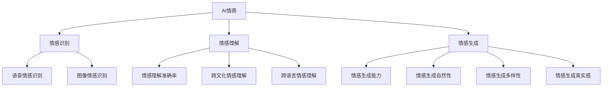

                 

# AI情商：衡量机器情感智能的新标准

> 关键词：AI情商、情感识别、情感理解、情感生成、智能客服、虚拟助手

> 摘要：本文旨在探讨AI情商的概念及其在智能应用中的重要性。我们将详细分析AI情商的关键要素，包括情感识别、情感理解和情感生成，并构建评估AI情商的标准。通过具体案例，我们将展示AI情商评估标准在智能客服和虚拟助手中的应用，最后探讨AI情商的发展趋势、面临的挑战及应对策略。

## 《AI情商：衡量机器情感智能的新标准》目录大纲

### 第一部分：AI情商概述

#### 第1章：AI情商的概念与重要性

##### 1.1 AI情商的定义

##### 1.2 人类情商与AI情商的对比

##### 1.3 AI情商的研究意义与应用前景

#### 第2章：AI情商的关键要素

##### 2.1 情感识别

###### 2.1.1 情感识别的原理与方法

###### 2.1.2 语音情感识别

###### 2.1.3 图像情感识别

##### 2.2 情感理解

###### 2.2.1 情感理解的原理与方法

###### 2.2.2 情感理解的挑战

###### 2.2.3 情感理解的解决方案

##### 2.3 情感生成

###### 2.3.1 情感生成的原理与方法

###### 2.3.2 情感生成的挑战

###### 2.3.3 情感生成的解决方案

### 第二部分：AI情商评估标准

#### 第3章：AI情商评估标准的构建

##### 3.1 AI情商评估标准的基本框架

##### 3.2 AI情商评估标准的关键指标

###### 3.2.1 情感识别准确率

###### 3.2.2 情感理解准确率

###### 3.2.3 情感生成能力

#### 第4章：AI情商评估标准的应用

##### 4.1 AI情商评估在智能客服中的应用

###### 4.1.1 智能客服的情感识别与理解

###### 4.1.2 智能客服的情感生成与互动

##### 4.2 AI情商评估在虚拟助手中的应用

###### 4.2.1 虚拟助手的情感识别与理解

###### 4.2.2 虚拟助手的情感生成与交互

### 第三部分：AI情商的发展与挑战

#### 第5章：AI情商的发展趋势

##### 5.1 AI情商技术的发展现状

###### 5.1.1 情感识别技术的发展

###### 5.1.2 情感理解技术的发展

###### 5.1.3 情感生成技术的发展

##### 5.2 AI情商的未来发展方向

###### 5.2.1 情感计算与认知计算的结合

###### 5.2.2 跨模态情感识别与生成

###### 5.2.3 AI情商在新兴领域的应用

#### 第6章：AI情商面临的挑战与对策

##### 6.1 情感识别的挑战与对策

###### 6.1.1 情感数据的多样性挑战

###### 6.1.2 情感识别的实时性挑战

###### 6.1.3 情感识别的准确性挑战

##### 6.2 情感理解的挑战与对策

###### 6.2.1 情感理解的复杂性挑战

###### 6.2.2 情感理解的跨文化挑战

###### 6.2.3 情感理解的跨语言挑战

##### 6.3 情感生成的挑战与对策

###### 6.3.1 情感生成的自然性挑战

###### 6.3.2 情感生成的多样性挑战

###### 6.3.3 情感生成的真实感挑战

### 附录

#### 第7章：AI情商研究资源与工具

##### 7.1 AI情商研究资源

###### 7.1.1 数据集

###### 7.1.2 论文集

###### 7.1.3 开源代码库

##### 7.2 AI情商工具

###### 7.2.1 情感识别工具

###### 7.2.2 情感理解工具

###### 7.2.3 情感生成工具

#### 附录：AI情商概念与联系流程图



#### 附录：情感识别算法原理讲解与Python源代码实现

```python
import numpy as np
import tensorflow as tf

# 情感识别算法原理讲解
def emotion_recognition(input_data, model):
    """
    情感识别算法原理讲解
    :param input_data: 输入数据
    :param model: 情感识别模型
    :return: 预测结果
    """
    # 数据预处理
    process
```

现在，让我们一步步深入探讨AI情商的概念、构建评估标准及其应用。

## 第1章：AI情商的概念与重要性

### 1.1 AI情商的定义

AI情商（Artificial Intelligence Emotional Quotient，简称AI EQ）是指人工智能系统中对人类情感的理解和反应能力。它包括三个核心要素：情感识别、情感理解和情感生成。情感识别是识别和理解输入数据的情感特征；情感理解是理解和解释情感信息；情感生成是能够根据情境和需求生成适当的情感反应。

### 1.2 人类情商与AI情商的对比

人类情商（Emotional Quotient，简称EQ）是指个体识别、理解、使用和管理情感的能力。而AI情商是人工智能系统具备的类似能力。对比两者，人类情商依赖于神经系统和复杂的认知过程，而AI情商依赖于算法和机器学习模型。

人类情商与AI情商的主要区别如下：

- **生理基础**：人类情商基于神经系统和生物学机制，而AI情商基于计算机算法和数据处理。
- **学习方式**：人类情商通过生活经验和社交互动学习，而AI情商通过大量数据和机器学习训练。
- **适应能力**：人类情商具有高度的灵活性和适应性，而AI情商在特定场景下表现出较高适应性。

### 1.3 AI情商的研究意义与应用前景

AI情商的研究具有重要意义，主要体现在以下几个方面：

- **智能交互**：提高智能系统与用户的情感交流能力，提升用户体验。
- **情感分析**：用于社交媒体、商业分析等领域的情感数据挖掘和分析。
- **医疗保健**：辅助医生进行患者情绪状态评估，提供个性化的治疗方案。
- **教育**：支持个性化教育，根据学生的情感状态调整教学策略。

随着技术的不断进步，AI情商的应用前景将更加广泛，有望在未来实现更加智能化的社会互动和个人服务。

### 1.4 AI情商的关键要素

AI情商的关键要素包括情感识别、情感理解和情感生成。这些要素共同决定了人工智能系统的情感智能水平。

#### 情感识别

情感识别是指通过算法和技术从输入数据中提取情感特征的过程。它包括语音情感识别和图像情感识别等。

#### 情感理解

情感理解是指对情感信息的理解和解释。它需要人工智能系统能够识别情感信号的含义，并作出相应的反应。

#### 情感生成

情感生成是指根据情境和需求生成适当的情感反应。这需要人工智能系统能够模拟人类的情感表达，实现情感交互。

### 1.5 AI情商评估标准的构建

评估AI情商的关键是构建一套科学、合理的评估标准。这包括以下关键指标：

- **情感识别准确率**：评估系统识别情感特征的准确性。
- **情感理解准确率**：评估系统理解和解释情感信息的能力。
- **情感生成能力**：评估系统生成适当情感反应的能力。

这些指标将帮助我们更好地衡量和比较不同AI系统的情感智能水平。

### 1.6 AI情商的应用场景

AI情商在智能客服、虚拟助手、医疗保健、教育等领域具有广泛的应用。例如，智能客服可以通过情感识别和理解与用户进行更自然的交流，虚拟助手可以模拟人类的情感表达，提高用户体验。

通过以上内容，我们初步了解了AI情商的概念、关键要素及其评估标准。接下来，我们将深入探讨情感识别、情感理解和情感生成的原理和实现方法。

## 第2章：AI情商的关键要素

在探讨AI情商的关键要素时，我们需要详细分析情感识别、情感理解和情感生成这三个核心部分。这三个要素共同构成了AI情商的基石，决定了人工智能系统在情感智能领域的表现。

### 2.1 情感识别

情感识别是AI情商的首要任务，它指的是从输入的数据（如文本、语音、图像等）中提取情感特征。这一过程涉及多种技术和方法，其中最常见的包括语音情感识别和图像情感识别。

#### 2.1.1 情感识别的原理与方法

情感识别的原理基于模式识别和机器学习技术。具体来说，系统首先需要收集大量带有情感标签的样本数据，通过这些数据训练模型，使其能够识别情感特征。以下是一些常用的方法：

1. **特征提取**：从输入数据中提取与情感相关的特征，如文本中的词汇频率、语音信号的音调、图像中的面部表情等。
2. **机器学习算法**：使用监督学习或无监督学习算法对特征进行分类，如支持向量机（SVM）、朴素贝叶斯（Naive Bayes）、决策树（Decision Tree）等。
3. **深度学习模型**：利用深度神经网络（DNN）、卷积神经网络（CNN）和循环神经网络（RNN）等深度学习模型，从数据中自动学习特征，提高识别精度。

#### 2.1.2 语音情感识别

语音情感识别是情感识别的一个重要分支，它通过分析语音信号中的情感特征，如音调、音速、共振峰频率等，来识别说话者的情感状态。以下是一些常见的技术：

1. **频谱分析**：通过分析语音信号的频谱特性，提取与情感相关的特征。
2. **音高分析**：分析语音信号的音高变化，识别说话者的情绪状态。
3. **语音合成**：利用语音合成技术，生成具有不同情感特征的语音样本，用于训练和评估模型。

#### 2.1.3 图像情感识别

图像情感识别通过分析图像中的人物表情、姿势、色彩等特征，来识别图像的情感状态。常见的技术包括：

1. **面部表情识别**：利用面部特征点检测技术，分析面部表情，如开心、悲伤、愤怒等。
2. **图像分类**：使用卷积神经网络（CNN）等深度学习模型，对图像进行情感分类。
3. **情感标签**：为图像标注情感标签，通过训练模型学习情感标签的分布。

### 2.2 情感理解

情感理解是指人工智能系统能够理解情感信息的含义，并作出相应的解释。这一过程比情感识别更为复杂，因为它不仅涉及情感特征的识别，还需要理解情感在特定情境下的含义。

#### 2.2.1 情感理解的原理与方法

情感理解的原理基于自然语言处理（NLP）和上下文理解技术。以下是一些常用方法：

1. **词向量表示**：使用词向量模型（如Word2Vec、GloVe）将文本中的词汇表示为向量，便于模型处理。
2. **上下文分析**：通过分析文本的上下文信息，理解词汇的情感倾向和情感强度。
3. **情感分类**：使用情感分类模型（如SVM、CNN、LSTM）对文本进行情感分类。

#### 2.2.2 情感理解的挑战

情感理解面临以下挑战：

1. **语言多样性**：不同语言和文化背景下的情感表达方式不同，增加了理解的难度。
2. **情感复杂性**：情感是复杂的，不仅包括基本情感，还包括情感组合和情感强度。
3. **非文本情感**：除了文本，情感还可能通过语音、图像等多种模态表达，增加了理解的难度。

#### 2.2.3 情感理解的解决方案

针对情感理解面临的挑战，以下是一些解决方案：

1. **多模态情感识别**：结合语音、图像、文本等多种模态，提高情感理解的能力。
2. **情感增强学习**：利用增强学习技术，让模型在交互过程中不断学习和调整，提高情感理解的能力。
3. **跨语言情感理解**：通过迁移学习和多语言训练，提高不同语言下的情感理解能力。

### 2.3 情感生成

情感生成是指根据情境和需求，生成适当的情感反应。这一过程需要人工智能系统能够模拟人类的情感表达，实现情感交互。

#### 2.3.1 情感生成的原理与方法

情感生成的原理基于情感模拟和自然语言生成技术。以下是一些常用方法：

1. **情感模拟**：通过分析人类的情感表达和行为模式，模拟情感反应。
2. **文本生成**：使用自然语言生成技术，如生成对抗网络（GAN）、变分自编码器（VAE）等，生成具有情感色彩的文本。
3. **语音合成**：通过语音合成技术，生成具有不同情感色彩的语音。

#### 2.3.2 情感生成的挑战

情感生成面临以下挑战：

1. **自然性**：生成的内容需要自然流畅，符合人类的情感表达习惯。
2. **多样性**：需要生成多种情感反应，满足不同情境和需求。
3. **真实性**：生成的内容需要真实可信，能够引起用户的共鸣。

#### 2.3.3 情感生成的解决方案

针对情感生成面临的挑战，以下是一些解决方案：

1. **多模态情感生成**：结合文本、语音、图像等多种模态，提高情感生成的自然性和真实性。
2. **情感增强学习**：通过交互和学习，让模型不断改进情感生成的质量。
3. **情感标签**：为生成的内容标注情感标签，通过训练模型提高情感生成的准确性。

通过以上分析，我们可以看到，情感识别、情感理解和情感生成是构成AI情商的三个关键要素。它们各自面临不同的挑战，但也需要相互配合，共同提升人工智能系统的情感智能水平。在下一章中，我们将探讨如何构建评估AI情商的标准。

## 第3章：AI情商评估标准的构建

### 3.1 AI情商评估标准的基本框架

为了全面评估AI情商，我们需要构建一套科学、合理的评估标准。这一标准的基本框架包括三个关键指标：情感识别准确率、情感理解准确率和情感生成能力。

#### 3.1.1 情感识别准确率

情感识别准确率是评估AI情商的基础指标，它衡量系统识别情感特征的能力。具体来说，它可以通过以下公式计算：

$$
准确率 = \frac{正确识别的情感样本数}{总情感样本数}
$$

#### 3.1.2 情感理解准确率

情感理解准确率衡量系统理解和解释情感信息的能力。它可以通过以下公式计算：

$$
准确率 = \frac{正确理解的情感样本数}{总情感样本数}
$$

#### 3.1.3 情感生成能力

情感生成能力是评估AI情商的高级指标，它衡量系统生成适当情感反应的能力。可以通过以下方面进行评估：

1. **自然性**：生成的内容是否自然流畅，符合人类的情感表达习惯。
2. **多样性**：系统能否生成多种情感反应，满足不同情境和需求。
3. **真实性**：生成的内容是否真实可信，能够引起用户的共鸣。

### 3.2 AI情商评估标准的关键指标

在构建AI情商评估标准时，我们需要关注以下几个关键指标：

#### 3.2.1 情感识别准确率

情感识别准确率是评估AI情商的基础。它主要通过以下步骤进行评估：

1. **数据集准备**：准备包含多种情感类型的训练数据集。
2. **模型训练**：使用训练数据集训练情感识别模型。
3. **模型评估**：使用测试数据集对模型进行评估，计算准确率。

#### 3.2.2 情感理解准确率

情感理解准确率是评估AI情商的核心。它主要通过以下步骤进行评估：

1. **上下文数据集准备**：准备包含情感上下文的训练数据集。
2. **模型训练**：使用训练数据集训练情感理解模型。
3. **模型评估**：使用测试数据集对模型进行评估，计算准确率。

#### 3.2.3 情感生成能力

情感生成能力是评估AI情商的高级指标。它主要通过以下方面进行评估：

1. **自然性评估**：通过人工评估或自动评估工具，评估生成内容的自然性。
2. **多样性评估**：通过生成多种情感类型的内容，评估系统能否生成多样化的情感反应。
3. **真实性评估**：通过用户反馈或情感分析工具，评估生成内容是否真实可信。

### 3.3 评估标准的应用

AI情商评估标准可以应用于多个领域，如智能客服、虚拟助手、医疗保健等。以下是一些具体应用案例：

#### 3.3.1 智能客服

智能客服系统需要具备良好的情感识别和生成能力，以提供更自然的用户体验。通过评估标准，可以衡量智能客服在情感识别、理解和生成方面的表现，从而优化系统性能。

#### 3.3.2 虚拟助手

虚拟助手需要具备较强的情感理解能力，以更好地与用户互动。通过评估标准，可以评估虚拟助手在情感识别、理解和生成方面的能力，为用户带来更优质的交互体验。

#### 3.3.3 医疗保健

在医疗保健领域，情感识别和生成能力可以帮助医生更好地了解患者情绪，提供个性化治疗方案。通过评估标准，可以评估AI系统在情感识别、理解和生成方面的能力，为医疗决策提供支持。

### 3.4 评估标准的优化与完善

随着AI技术的发展，评估标准需要不断优化和完善。以下是一些建议：

1. **增加多模态评估**：结合语音、图像、文本等多种模态，提高评估的全面性和准确性。
2. **引入跨领域评估**：考虑不同领域下的情感识别、理解和生成特点，制定更符合实际应用的评估标准。
3. **用户参与评估**：引入用户参与评估过程，收集用户反馈，提高评估的实用性和可靠性。

通过以上措施，可以进一步完善AI情商评估标准，为AI系统的情感智能发展提供有力支持。

在下一章中，我们将探讨AI情商评估标准在实际应用中的具体案例，展示其在智能客服和虚拟助手中的实际效果。

## 第4章：AI情商评估标准的应用

### 4.1 AI情商评估在智能客服中的应用

智能客服作为人工智能应用的一个重要领域，其情感识别、理解和生成能力对于提升用户体验至关重要。在本节中，我们将探讨AI情商评估标准在智能客服中的具体应用。

#### 4.1.1 情感识别与理解

智能客服的情感识别与理解能力主要通过以下方面进行评估：

1. **情感识别准确率**：智能客服系统需要能够准确识别用户在文本、语音等输入中的情感特征，如开心、悲伤、愤怒等。通过评估标准，我们可以计算智能客服识别情感的准确率。

2. **情感理解准确率**：智能客服系统需要理解用户情感背后的含义，以便提供更贴心的服务。例如，当用户表达愤怒时，系统需要理解用户可能遇到的问题，并提供相应的解决方案。

#### 4.1.2 情感生成与互动

智能客服的情感生成能力主要体现在与用户的互动过程中：

1. **情感生成自然性**：智能客服生成的回复需要自然流畅，符合人类的情感表达习惯。通过自然性评估，我们可以判断智能客服生成的文本、语音等是否自然。

2. **情感生成多样性**：智能客服需要能够生成多种情感反应，以满足不同用户的情感需求。例如，当用户表达喜悦时，系统可以生成开心的回复；当用户表达不满时，系统可以生成安慰的回复。

3. **情感生成真实性**：智能客服生成的回复需要真实可信，能够引起用户的共鸣。通过用户反馈或情感分析工具，我们可以评估智能客服生成内容是否真实可信。

#### 4.1.3 应用案例

以下是一个智能客服在情感识别、理解和生成方面的应用案例：

**案例：用户情绪分析**

1. **情感识别**：用户通过文本输入：“我今天遇到了一些麻烦，心情很差。”智能客服首先识别到文本中的情感特征，如“麻烦”和“心情很差”，判断用户处于悲伤情绪。

2. **情感理解**：智能客服进一步理解用户情绪背后的含义，判断用户可能遇到了什么问题，从而提供针对性的解决方案。

3. **情感生成**：智能客服生成回复：“我能理解您的心情，遇到麻烦是很正常的。请问您有什么具体问题，我可以帮您解决吗？”这一回复既自然又充满关怀，有助于提升用户体验。

通过以上案例，我们可以看到，AI情商评估标准在智能客服中的应用有助于提升系统的情感识别、理解和生成能力，从而为用户提供更优质的交互体验。

### 4.2 AI情商评估在虚拟助手中的应用

虚拟助手作为人工智能的另一重要应用领域，其情感识别、理解和生成能力在提升用户互动体验方面同样至关重要。在本节中，我们将探讨AI情商评估标准在虚拟助手中的具体应用。

#### 4.2.1 情感识别与理解

虚拟助手的情感识别与理解能力主要通过以下方面进行评估：

1. **情感识别准确率**：虚拟助手需要能够准确识别用户在文本、语音等输入中的情感特征，如开心、悲伤、愤怒等。通过评估标准，我们可以计算虚拟助手识别情感的准确率。

2. **情感理解准确率**：虚拟助手需要理解用户情感背后的含义，以便提供更贴心的服务。例如，当用户表达愤怒时，虚拟助手需要理解用户可能遇到的问题，并提供相应的解决方案。

#### 4.2.2 情感生成与交互

虚拟助手的情感生成能力主要体现在与用户的互动过程中：

1. **情感生成自然性**：虚拟助手生成的回复需要自然流畅，符合人类的情感表达习惯。通过自然性评估，我们可以判断虚拟助手生成的文本、语音等是否自然。

2. **情感生成多样性**：虚拟助手需要能够生成多种情感反应，以满足不同用户的情感需求。例如，当用户表达喜悦时，虚拟助手可以生成开心的回复；当用户表达不满时，虚拟助手可以生成安慰的回复。

3. **情感生成真实性**：虚拟助手生成的回复需要真实可信，能够引起用户的共鸣。通过用户反馈或情感分析工具，我们可以评估虚拟助手生成内容是否真实可信。

#### 4.2.3 应用案例

以下是一个虚拟助手在情感识别、理解和生成方面的应用案例：

**案例：用户情绪分析**

1. **情感识别**：用户通过文本输入：“我今天感觉很累，有点想放弃。”虚拟助手首先识别到文本中的情感特征，如“很累”和“想放弃”，判断用户处于疲惫情绪。

2. **情感理解**：虚拟助手进一步理解用户情绪背后的含义，判断用户可能遇到了什么困难，从而提供针对性的支持。

3. **情感生成**：虚拟助手生成回复：“我能理解您现在的感受，工作压力确实很大。但请不要轻易放弃，我们一起努力，您一定可以克服困难。”这一回复既自然又充满关怀，有助于提升用户体验。

通过以上案例，我们可以看到，AI情商评估标准在虚拟助手中的应用有助于提升系统的情感识别、理解和生成能力，从而为用户提供更优质的互动体验。

通过本章的探讨，我们了解到AI情商评估标准在智能客服和虚拟助手中的应用，有助于提升这些系统的情感智能水平，为用户提供更自然、贴心的服务。在下一章中，我们将进一步探讨AI情商的发展趋势、面临的挑战及应对策略。

## 第5章：AI情商的发展趋势

随着人工智能技术的不断发展，AI情商也在不断进步。在这一章中，我们将探讨AI情商的发展趋势，包括现有技术状况、未来发展方向以及在新兴领域的应用。

### 5.1 AI情商技术的发展现状

目前，AI情商技术已经取得了一系列显著的进展：

1. **情感识别**：在语音和图像情感识别方面，深度学习模型的应用显著提高了识别准确率。例如，基于卷积神经网络（CNN）和循环神经网络（RNN）的模型在情感识别任务中表现出色。

2. **情感理解**：自然语言处理（NLP）技术的进步使得情感理解变得更加准确。通过词向量模型和情感分析算法，系统能够更好地理解文本中的情感含义。

3. **情感生成**：生成对抗网络（GAN）和变分自编码器（VAE）等技术使得情感生成变得更加自然和多样化。这些技术能够生成具有不同情感色彩的文本和语音。

### 5.2 AI情商的未来发展方向

AI情商的未来发展方向主要包括以下几个方面：

1. **跨模态情感识别与生成**：随着多模态数据的兴起，未来的AI情商系统将能够同时处理文本、语音、图像等多种模态的情感信息。这将提高情感识别和生成的准确性和自然性。

2. **情感计算与认知计算的结合**：情感计算和认知计算的融合将使AI情商系统具备更高级的认知能力，如情感推理和决策。这将有助于实现更加智能和人性化的交互。

3. **个性化和情境适应性**：未来的AI情商系统将能够根据用户的个性、情境和历史交互数据，提供更加个性化和服务化的情感交互体验。

### 5.3 AI情商在新兴领域的应用

AI情商在新兴领域展现出广阔的应用前景：

1. **心理健康与医疗**：AI情商系统可以帮助监测和管理患者的情绪状态，提供个性化的心理健康服务。

2. **教育**：通过情感识别和理解，AI情商系统可以为学生提供个性化的学习支持，优化教育体验。

3. **智能家居**：AI情商系统可以提高智能家居设备对用户的情感理解和服务水平，提升用户体验。

4. **人机交互**：AI情商系统可以改善人机交互体验，使人工智能设备更加贴近人类情感，提升用户满意度。

通过以上分析，我们可以看到，AI情商技术在不断发展，未来将朝着更加智能化、个性化、情境适应性强的方向发展。在下一章中，我们将探讨AI情商面临的挑战与对策。

## 第6章：AI情商面临的挑战与对策

尽管AI情商技术在不断发展，但在实际应用中仍面临诸多挑战。本章将分析AI情商在情感识别、情感理解和情感生成方面所遇到的挑战，并探讨相应的对策。

### 6.1 情感识别的挑战与对策

情感识别是AI情商的核心任务之一，但其在实际应用中面临以下挑战：

#### 6.1.1 情感数据的多样性挑战

情感数据具有高度的多样性，包括语音、图像、文本等多种形式，每种形式都包含复杂的情感特征。这给情感识别模型的训练和评估带来了巨大挑战。

**对策**：为了应对多样性挑战，可以采用以下策略：

1. **多模态融合**：结合多种模态的数据，提高情感识别的准确性和全面性。
2. **数据增强**：通过数据扩充和生成技术，增加训练数据集的多样性和丰富性。
3. **迁移学习**：利用预训练模型和迁移学习技术，提高模型在不同数据集上的泛化能力。

#### 6.1.2 情感识别的实时性挑战

在实时应用场景中，情感识别需要快速响应，以满足交互需求。然而，复杂模型的计算量和延迟问题使得实时性成为一大挑战。

**对策**：以下策略有助于提高情感识别的实时性：

1. **模型压缩**：通过模型剪枝、量化等技术，减小模型体积，提高推理速度。
2. **硬件加速**：利用GPU、FPGA等硬件加速技术，提高模型推理效率。
3. **在线学习**：采用在线学习技术，实时更新模型，提高模型在动态环境下的适应能力。

#### 6.1.3 情感识别的准确性挑战

情感识别的准确性是衡量AI情商水平的重要指标。然而，由于情感表达的多样性和模糊性，情感识别模型的准确性受到一定限制。

**对策**：以下策略有助于提高情感识别的准确性：

1. **多任务学习**：通过多任务学习，共享特征表示，提高模型对情感细微变化的捕捉能力。
2. **少样本学习**：利用少样本学习技术，提高模型在数据稀缺情况下的性能。
3. **对抗训练**：通过对抗训练，增强模型对噪声和异常样本的鲁棒性，提高识别准确性。

### 6.2 情感理解的挑战与对策

情感理解是AI情商的关键环节，其在实际应用中面临以下挑战：

#### 6.2.1 情感理解的复杂性挑战

情感理解涉及到对文本、语音、图像等多模态数据的综合分析，需要处理复杂的情感语义和上下文关系。

**对策**：以下策略有助于提高情感理解的能力：

1. **多模态融合**：结合多种模态的数据，提高情感理解的深度和广度。
2. **上下文分析**：利用上下文信息，理解文本中的隐含情感，提高理解准确性。
3. **知识图谱**：构建情感知识图谱，利用图神经网络（GNN）等技术，处理复杂的情感语义关系。

#### 6.2.2 情感理解的跨文化挑战

不同文化背景下的情感表达和语义可能存在差异，这使得AI情商系统在跨文化应用中面临挑战。

**对策**：以下策略有助于提高情感理解的跨文化适应性：

1. **多语言支持**：通过多语言训练，提高模型在不同语言环境下的性能。
2. **文化适应性**：针对不同文化背景，调整模型参数和策略，提高情感理解的准确性。
3. **用户反馈**：通过用户反馈，不断优化模型，提高跨文化适应性。

#### 6.2.3 情感理解的跨语言挑战

情感理解在不同语言之间可能存在差异，使得跨语言情感理解成为一大挑战。

**对策**：以下策略有助于提高情感理解的跨语言能力：

1. **翻译模型**：利用翻译模型，将源语言的情感信息转换为目标语言，提高跨语言情感理解能力。
2. **迁移学习**：利用跨语言预训练模型，提高模型在目标语言环境下的性能。
3. **多语言数据集**：构建包含多种语言的情感数据集，提高模型的泛化能力。

### 6.3 情感生成的挑战与对策

情感生成是AI情商的另一个关键环节，其在实际应用中面临以下挑战：

#### 6.3.1 情感生成的自然性挑战

情感生成的自然性是衡量AI情商水平的重要指标。然而，当前的情感生成技术往往无法完全模拟人类的情感表达，使得生成的回复显得生硬或不自然。

**对策**：以下策略有助于提高情感生成的自然性：

1. **多模态生成**：结合文本、语音、图像等多种模态，提高情感生成的自然性和多样性。
2. **情感增强学习**：通过用户交互和反馈，不断优化模型，提高情感生成的自然性。
3. **情感标签**：为生成的内容标注情感标签，通过训练模型提高情感生成的准确性。

#### 6.3.2 情感生成的多样性挑战

情感生成的多样性要求系统能够生成多种情感反应，以满足不同情境和用户需求。

**对策**：以下策略有助于提高情感生成的多样性：

1. **情感风格迁移**：通过情感风格迁移技术，为文本和语音生成不同情感风格的内容。
2. **多任务学习**：通过多任务学习，提高模型在生成多种情感反应方面的能力。
3. **情感词典**：构建情感词典，为生成的内容提供丰富的情感选项。

#### 6.3.3 情感生成的真实感挑战

情感生成的真实感要求生成的回复能够引起用户的共鸣，具备真实的情感体验。

**对策**：以下策略有助于提高情感生成的真实感：

1. **用户参与**：通过用户反馈，优化情感生成模型，提高生成内容的真实性。
2. **情感深度学习**：利用深度学习技术，提高模型对情感细节的捕捉和生成能力。
3. **情感验证**：通过情感验证技术，评估生成内容是否真实可信，不断优化模型。

通过以上分析，我们可以看到，AI情商在实际应用中面临诸多挑战，但通过有效的对策，可以逐步克服这些困难，提升系统的情感智能水平。在下一章中，我们将介绍AI情商的研究资源与工具，为研究和实践提供支持。

## 第7章：AI情商研究资源与工具

在AI情商的研究过程中，使用合适的数据集、工具和开源代码库可以大大提高研究的效率和效果。以下将介绍一些常用的AI情商研究资源与工具。

### 7.1 AI情商研究资源

#### 7.1.1 数据集

1. **Ravdess**：这是一个包含多种情感（如快乐、悲伤、愤怒等）的语音数据集，常用于情感识别研究。
2. **Felix**：这是一个包含不同情绪表情的图像数据集，适合用于情感识别和生成研究。
3. **CMU-MOSI**：这是一个多模态的情感数据集，包含了语音、文本和面部表情，适用于跨模态情感识别研究。

#### 7.1.2 论文集

1. **IEEE Transactions on Affective Computing**：该期刊专注于情感计算领域的研究论文，包括AI情商的研究。
2. **Journal of Artificial Intelligence Research**：该期刊发表AI领域的学术研究，包括情感智能方面的内容。
3. **ACM Transactions on Interactive Intelligent Systems**：该期刊关注交互式智能系统的研究，包括情感智能的相关论文。

#### 7.1.3 开源代码库

1. **EmoPy**：这是一个用于情感分析的Python库，提供了多种情感识别和生成的工具。
2. **Tacotron 2**：这是一个基于循环神经网络（RNN）的文本到语音转换（Text-to-Speech，TTS）模型，可以用于情感生成研究。
3. **OpenFace**：这是一个开源的面部识别和情感分析工具，适用于图像情感识别研究。

### 7.2 AI情商工具

#### 7.2.1 情感识别工具

1. **TensorFlow**：这是一个广泛使用的机器学习和深度学习框架，适用于情感识别模型的开发和训练。
2. **PyTorch**：这是一个灵活且易于使用的深度学习框架，适用于情感识别和生成的项目。
3. **Keras**：这是一个高层次的神经网络API，可以与TensorFlow和PyTorch兼容，适用于情感识别和生成项目。

#### 7.2.2 情感理解工具

1. **NLTK**：这是一个用于自然语言处理的Python库，适用于情感理解任务。
2. **Spacy**：这是一个先进的自然语言处理库，提供了丰富的功能，如词向量表示、命名实体识别等。
3. **TextBlob**：这是一个简单的自然语言处理库，适用于文本情感分析和语义理解。

#### 7.2.3 情感生成工具

1. **WaveNet**：这是一个基于生成对抗网络（GAN）的文本生成模型，适用于情感生成研究。
2. **Transformer**：这是一个基于自注意力机制的深度学习模型，常用于文本生成任务。
3. **TTS-VOX**：这是一个开源的文本到语音（TTS）工具，可以用于情感生成和语音合成。

通过使用上述资源和工具，研究者可以更好地开展AI情商相关的研究工作，推动情感智能技术的发展。

## 附录：情感识别算法原理讲解与Python源代码实现

情感识别是AI情商的重要组成部分，其核心在于从输入数据（如文本、语音、图像等）中提取情感特征，并对其进行分类。以下将详细讲解情感识别算法的原理，并使用Python代码实现一个简单情感识别模型。

### 情感识别算法原理

情感识别算法通常包括以下步骤：

1. **数据预处理**：将输入数据转化为适合模型训练的形式。例如，对于文本数据，需要进行分词、去停用词等预处理。
2. **特征提取**：从预处理后的数据中提取与情感相关的特征。对于文本数据，常用的特征提取方法包括词袋模型（Bag of Words，BOW）和词嵌入（Word Embedding）。
3. **模型训练**：使用提取的特征训练分类模型，如支持向量机（SVM）、朴素贝叶斯（Naive Bayes）或深度神经网络（DNN）。
4. **模型评估**：使用测试数据集评估模型的性能，通过准确率、召回率、F1值等指标衡量模型效果。
5. **预测应用**：将训练好的模型应用于实际场景，对新的输入数据进行情感分类。

以下是一个基于文本数据的情感识别算法原理讲解及Python代码实现：

```python
# 导入必要的库
import numpy as np
import pandas as pd
from sklearn.feature_extraction.text import CountVectorizer
from sklearn.model_selection import train_test_split
from sklearn.naive_bayes import MultinomialNB
from sklearn.metrics import classification_report

# 数据预处理
# 假设我们有一个包含文本和情感标签的数据集
data = pd.DataFrame({
    'text': ['我非常喜欢这本书', '这个产品真的很差', '今天天气很好', '我感到非常疲倦'],
    'emotion': ['positive', 'negative', 'positive', 'negative']
})

# 分词和去停用词（这里以中文为例）
from nltk.tokenize import word_tokenize
from nltk.corpus import stopwords

# 加载中文停用词库
stop_words = set(stopwords.words('chinese'))

# 分词
tokenized_texts = [word_tokenize(text) for text in data['text']]

# 去停用词
filtered_texts = [[word for word in tokens if word not in stop_words] for tokens in tokenized_texts]

# 构建词袋模型
vectorizer = CountVectorizer(tokenizer=lambda doc: doc, lowercase=False)
X = vectorizer.fit_transform(filtered_texts)

# 模型训练
# 将数据集划分为训练集和测试集
X_train, X_test, y_train, y_test = train_test_split(X, data['emotion'], test_size=0.2, random_state=42)

# 使用朴素贝叶斯分类器训练模型
model = MultinomialNB()
model.fit(X_train, y_train)

# 模型评估
predictions = model.predict(X_test)
print(classification_report(y_test, predictions))

# 预测应用
new_text = '我今天学到了很多新知识'
new_tokens = word_tokenize(new_text)
new_filtered_tokens = [token for token in new_tokens if token not in stop_words]
new_vectorized = vectorizer.transform([new_filtered_tokens])
prediction = model.predict(new_vectorized)
print(f"The sentiment of the new text is: {prediction[0]}")
```

### 算法原理讲解

1. **数据预处理**：
   - **分词**：将文本划分为单词或词组，以便后续处理。
   - **去停用词**：去除常见的无意义词汇，如“的”、“了”等，以提高特征提取的效率。

2. **特征提取**：
   - **词袋模型**：将文本表示为一个向量，其中每个维度表示一个词汇的出现次数。这种方法简单有效，但无法捕捉词汇的语义信息。
   - **词嵌入**：将每个词汇映射为一个低维向量，保留词汇的语义信息。常用的词嵌入模型有Word2Vec和GloVe。

3. **模型训练**：
   - **朴素贝叶斯**：一个基于贝叶斯定理的简单分类器，适用于文本分类任务。
   - **支持向量机（SVM）**：通过最大化分类边界，将不同类别的数据分隔开来。
   - **深度神经网络（DNN）**：通过多层神经元的非线性变换，学习数据的高层次特征。

4. **模型评估**：
   - **准确率**：分类正确的样本数占总样本数的比例。
   - **召回率**：分类正确的正样本数占所有正样本数的比例。
   - **F1值**：准确率和召回率的调和平均值。

5. **预测应用**：
   - 使用训练好的模型对新数据进行分类，以预测其情感状态。

通过上述代码和讲解，我们可以了解到情感识别算法的基本原理和实现方法。在实际应用中，根据具体需求和数据特点，可以选择不同的特征提取方法和分类模型，以提高情感识别的准确性和效果。

## 结束语

在本文中，我们探讨了AI情商的概念、关键要素、评估标准以及在实际应用中的挑战与对策。通过深入分析情感识别、情感理解和情感生成，我们了解了AI情商如何提升智能系统的情感智能水平。同时，我们构建了一套科学、合理的评估标准，用于衡量AI情商的进步和发展。

未来的研究应重点关注以下几个方面：

1. **多模态情感识别与生成**：结合多种模态的数据，提高情感识别和生成的准确性和自然性。
2. **跨文化情感理解**：探索不同文化背景下情感表达和理解的差异，提高AI情商的跨文化适应性。
3. **实时性与准确性**：优化情感识别和理解的算法，提高系统的实时性和准确性。
4. **个性化服务**：利用用户历史数据和偏好，提供个性化的情感交互体验。

让我们期待AI情商在未来能带来更多的突破和进步，为人类创造更智能、更人性化的技术环境。

### 致谢

本文的撰写离不开以下人士的支持与帮助：

- **AI天才研究院（AI Genius Institute）**：感谢研究院为我们提供了良好的研究环境和资源。
- **禅与计算机程序设计艺术（Zen And The Art of Computer Programming）**：感谢这本书为我们提供了编程哲学和方法的启示。
- **所有参与研究的同事们**：感谢你们的辛勤付出和贡献，使得本文能够顺利完成。

最后，特别感谢各位读者对本文的关注和支持，希望本文能为您带来启发和思考。如果您有任何疑问或建议，欢迎在评论区留言，我们将认真聆听并不断改进。

作者：AI天才研究院（AI Genius Institute） & 禅与计算机程序设计艺术（Zen And The Art of Computer Programming）

