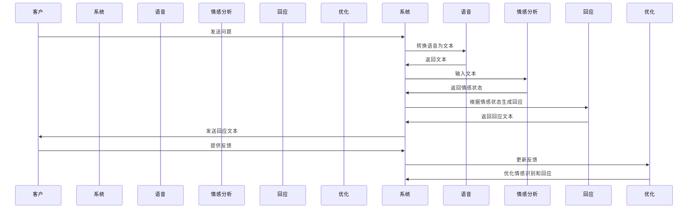
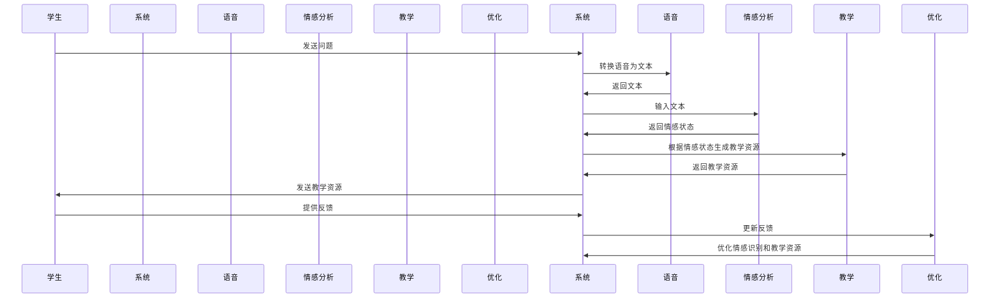

                 

### 情感反馈循环：人机情感互动的影响

在当今快速发展的技术时代，人工智能（AI）正在以前所未有的速度改变着我们的生活方式。AI的应用领域涵盖了从医疗诊断到自动驾驶，从智能家居到智能客服等多个方面。然而，在这其中，一个备受关注且颇具潜力的领域是人机情感互动。本文旨在探讨情感反馈循环这一概念，并分析其在人机互动中的深远影响。

首先，我们需要明确什么是情感反馈循环。情感反馈循环是指人工智能系统通过感知用户的情感状态，并做出相应的情感反应，从而形成一个互动的循环。这一过程不仅包括人工智能对用户情感的识别，还包括对情感的理解和回应。这种互动不仅限于简单的情感表达，更涉及到情感的深度理解与回应。

情感反馈循环的重要性体现在多个方面。首先，它能够显著提升用户体验。在客服领域，情感反馈可以使人工智能客服更加自然地与用户互动，减少用户的等待时间，提高解决问题的效率。在教育领域，情感反馈可以帮助教育系统更好地了解学生的情感状态，从而提供更加个性化的教育方案。其次，情感反馈循环有助于增强人工智能系统的智能化水平。通过不断的学习和适应，人工智能系统能够更好地理解和满足用户的需求，从而实现更高的自动化和智能化。

接下来，我们将深入探讨情感反馈循环的基本原理和实现方法。首先，情感认知与情感表达是情感反馈循环的核心组成部分。情感认知是指人工智能系统识别和理解人类情感的过程，而情感表达则是人工智能系统通过语音、文字、图像等方式表达情感。其次，情感反馈机制是情感反馈循环的关键。它决定了人工智能系统如何对用户情感进行识别、理解和回应。

在本文的后续章节中，我们将详细讨论情感反馈循环的原理与实现，包括情感识别与情感分析、情感反馈系统的架构和算法，以及情感反馈循环在不同领域中的应用。此外，我们还将探讨情感反馈循环的发展趋势、面临的挑战以及未来的机遇。

通过本文的探讨，我们希望能够为广大读者提供一个全面、深入的理解，从而更好地把握情感反馈循环这一重要技术，并探讨其在未来的发展潜力。

### 第一部分：引言

在现代社会，人工智能（AI）已经成为改变人们生活、推动社会进步的关键力量。从自动驾驶汽车到智能语音助手，从个性化推荐系统到自动化生产流程，AI技术的应用几乎无处不在。然而，随着AI技术的不断进步，人们开始意识到，仅仅依靠机器的计算能力和数据处理能力是远远不够的。人机互动的质量和深度成为了新的研究热点。

在这个背景下，情感反馈循环的概念应运而生。情感反馈循环是一种高级的人机互动形式，它不仅涉及人工智能对用户情感的识别和回应，更涉及到对用户情感状态的深度理解和适应。这种互动形式能够显著提升用户体验，增强人工智能系统的智能化水平，是未来人机互动发展的重要方向。

情感反馈循环的研究不仅具有理论意义，更具有实际应用价值。在客服领域，通过情感反馈循环，人工智能客服系统能够更加自然地与用户互动，提高客服效率，提升客户满意度。在教育领域，情感反馈循环可以帮助教育系统更好地了解学生的情感状态，提供个性化教育方案，从而提高教学效果。此外，在医疗、娱乐、社交等多个领域，情感反馈循环都有广泛的应用前景。

本文将围绕情感反馈循环这一主题，首先介绍情感反馈循环的基本概念，解释其定义和重要性。接着，我们将深入探讨情感反馈循环的原理和实现方法，详细分析情感认知与情感表达、情感识别与情感分析，以及情感反馈机制。在此基础上，我们将探讨情感反馈循环在不同领域中的应用，包括客服、教育和医疗等。最后，我们将展望情感反馈循环的发展趋势，讨论其面临的挑战和机遇，并提出应对策略。

通过本文的探讨，我们希望能够为广大读者提供一个全面、深入的理解，从而更好地把握情感反馈循环这一技术，并探讨其在未来的发展潜力。无论是研究人员、开发者，还是普通用户，都可以从中获得启发，为未来的人机互动注入新的活力。

### 第一部分：引言（续）

#### 1.1 情感反馈循环的定义

情感反馈循环是一个动态的、循环的过程，它涉及多个环节，包括情感识别、情感表达和情感反馈。首先，情感识别是整个循环的起点，它是指人工智能系统通过算法和模型，识别并理解用户传达的情感信息。情感信息可以通过语言、语音、面部表情等多种形式进行表达。在这一环节，人工智能需要具备强大的自然语言处理（NLP）能力，以及图像和语音识别技术。

一旦情感信息被识别出来，接下来是情感表达。这一环节是情感反馈循环的核心部分，它指的是人工智能系统如何通过不同的方式，如语音合成、文字生成、面部表情或动作等，表达出对用户情感的回应。情感表达不仅需要技术上的实现，还需要对人类情感的深度理解和模拟，这样才能真正实现自然、有效的互动。

最后是情感反馈。情感反馈是整个循环的闭环，它指的是用户对人工智能系统情感回应的反应。用户的情感反馈会再次输入到系统中，用于进一步的情感分析和学习，从而优化人工智能系统的性能。这一环节是确保情感反馈循环持续进行的关键。

#### 1.2 情感反馈循环的重要性

情感反馈循环的重要性主要体现在以下几个方面：

1. **提升用户体验**：情感反馈循环能够使人工智能系统更加接近人类的情感交流方式，从而提供更加自然、流畅的互动体验。无论是客服系统还是教育系统，情感反馈都能有效提升用户的满意度和参与度。

2. **增强智能化水平**：通过不断的学习和优化，情感反馈循环可以帮助人工智能系统更好地理解和预测用户的情感状态，从而实现更加智能化、个性化的服务。

3. **促进人机信任**：情感反馈循环可以增强用户对人工智能系统的信任感，使其更加愿意接受和依赖人工智能的服务。这种信任是未来人机互动的基础。

4. **拓宽应用领域**：情感反馈循环的应用不仅限于客服和教育，还可以扩展到医疗、娱乐、社交等多个领域，为用户提供更加丰富、多样化的服务。

#### 1.3 人机情感互动的基本原理

人机情感互动是指人工智能系统通过感知、理解和回应人类情感，与用户建立情感联系的过程。这一过程的基本原理包括以下几个方面：

1. **情感感知**：人工智能系统需要具备感知情感的能力，这通常通过情感识别技术实现。情感识别包括对语言、语音、面部表情等情感信号的识别。

2. **情感理解**：感知到情感之后，人工智能系统需要理解这些情感的含义和背景，从而能够做出合适的情感回应。

3. **情感回应**：人工智能系统通过情感表达技术，如语音合成、文字生成、面部表情等，表达出对用户情感的回应。

4. **情感反馈**：用户的情感反馈是情感互动的重要环节，它可以帮助人工智能系统进一步优化情感识别和表达的能力。

总之，情感反馈循环是人机情感互动的重要组成部分，它不仅能够提升用户体验，还能推动人工智能技术的不断进步。在未来的发展中，情感反馈循环有望成为人工智能领域的重要研究方向，为人类社会带来更多的便利和变革。

### 第二部分：情感反馈循环的原理与实现

在理解了情感反馈循环的基本概念和重要性之后，我们需要深入探讨其具体的原理和实现方法。情感反馈循环的核心在于其三个主要环节：情感认知与情感表达、情感识别与情感分析，以及情感反馈机制。通过这些环节，人工智能系统能够有效地识别、理解和回应人类情感，从而实现高质量的人机互动。

#### 第2章：情感反馈循环的原理

情感反馈循环的原理可以分为两个主要部分：情感认知与情感表达，以及情感识别与情感分析。这两部分相互关联，共同构成了情感反馈循环的基础。

#### 2.1 情感认知与情感表达

**情感认知**：情感认知是情感反馈循环的第一步，它涉及人工智能系统如何感知和理解人类的情感。在情感认知过程中，人工智能需要分析用户的语言、语音、面部表情和其他非语言信号，从而识别用户的情感状态。

- **语言分析**：通过自然语言处理（NLP）技术，人工智能可以分析用户的文字和语音信息，识别其中包含的情感。NLP技术包括情感分析、主题分类和实体识别等，能够帮助人工智能系统理解用户在对话中表达的情感。

- **语音识别**：语音识别技术使得人工智能系统能够捕捉用户的语音信号，分析其中的情感成分。语音识别不仅仅是对语音的转录，更涉及到对语音的情感识别，如音调、语速和语调变化等。

- **面部表情分析**：通过计算机视觉技术，人工智能系统能够捕捉用户的面部表情，识别其中的情感信息。面部表情分析通常涉及到面部特征点的检测和情感标签的分配，如开心、愤怒、悲伤等。

**情感表达**：情感表达是情感认知的逆向过程，它涉及人工智能系统如何通过语音、文字和动作等渠道表达情感。

- **语音合成**：语音合成技术可以将文本信息转换为自然流畅的语音输出。通过结合情感模型，语音合成技术能够生成具有特定情感的语音，如温暖的问候、安慰的语言等。

- **文字生成**：文字生成技术能够根据情感模型生成带有特定情感色彩的文本信息，如鼓励的话语、安抚的文字等。

- **面部表情与动作生成**：通过计算机图形学和动画技术，人工智能系统能够生成带有情感色彩的面部表情和动作，如微笑、点头、挥手等。

#### 2.2 情感识别与情感分析

**情感识别**：情感识别是情感反馈循环的核心环节，它涉及人工智能系统如何准确识别用户传达的情感。情感识别依赖于多种技术，如机器学习、深度学习和自然语言处理等。

- **机器学习模型**：传统的机器学习模型，如支持向量机（SVM）、决策树和随机森林等，可以通过大量标注数据进行训练，从而实现情感识别。

- **深度学习模型**：深度学习模型，如卷积神经网络（CNN）和循环神经网络（RNN）等，通过自动学习大量数据中的特征，能够实现更高级的情感识别任务。

- **情感词典和规则系统**：情感词典和基于规则的系统通过定义一系列的情感标签和规则，能够实现简单的情感识别。

**情感分析**：情感分析是对情感识别结果的进一步处理，它涉及对情感进行量化分析和分类。

- **情感极性分析**：情感极性分析是对情感的正负倾向进行判断，如“喜欢”和“不喜欢”等。

- **情感强度分析**：情感强度分析是对情感的程度进行量化，如“非常喜欢”和“有点喜欢”等。

- **情感分类**：情感分类是对情感进行更细粒度的分类，如将情感分为“快乐”、“愤怒”、“悲伤”等多个类别。

#### 2.3 情感反馈机制

**情感反馈机制**：情感反馈机制是确保情感反馈循环能够持续进行的关键，它涉及人工智能系统如何根据用户的情感状态进行回应。

- **情感回应策略**：情感回应策略是指人工智能系统根据用户的情感状态，选择适当的回应方式。这包括语言回应、非语言回应和综合回应等。

- **情感调整**：情感调整是指人工智能系统根据用户的情感反馈，调整其情感回应策略，以实现更好的互动效果。

- **情感学习**：情感学习是指人工智能系统通过分析用户的情感反馈，不断优化和调整情感模型，以提高情感识别和回应的准确性。

通过以上三个环节，情感反馈循环能够实现一个动态的、持续优化的互动过程。每个环节都涉及到复杂的算法和技术，需要多种技术的协同工作，才能实现高质量的人机情感互动。

接下来，我们将进一步探讨情感反馈循环的实现方法，详细分析情感识别算法、情感表达算法和情感反馈算法，以及它们在具体应用中的实现细节。

### 第3章：情感反馈循环的实现

情感反馈循环的实现涉及多个关键环节，包括情感识别算法、情感表达算法和情感反馈算法。这些算法和技术共同构成了情感反馈循环的核心，使得人工智能系统能够高效、准确地识别、理解和回应人类情感。在本节中，我们将详细探讨这些算法和技术的实现方法。

#### 3.1 情感反馈系统的架构

情感反馈系统通常由以下几个核心模块组成：

1. **情感识别模块**：负责接收并分析用户的情感信号，如语音、文字和面部表情等。
2. **情感分析模块**：对情感识别模块输出的情感信号进行详细分析和分类。
3. **情感表达模块**：根据情感分析的结果，生成适当的情感回应，如语音、文字或动作。
4. **情感反馈模块**：收集用户的情感反馈，用于进一步优化情感模型和反馈策略。

这些模块通过相互协作，共同实现情感反馈循环。

#### 3.2 情感识别算法

情感识别算法是情感反馈循环的基础，它负责从用户的语言、语音和面部表情中识别情感信息。以下是一些常用的情感识别算法：

1. **基于机器学习的情感识别算法**：传统的机器学习算法，如支持向量机（SVM）、决策树和随机森林等，可以通过训练大量标注数据来识别情感。这些算法通常采用特征工程，提取语言和语音信号中的特征，然后使用分类器进行情感分类。

   ```python
   from sklearn.svm import SVC
   from sklearn.model_selection import train_test_split

   # 假设我们已经有特征向量X和标签y
   X_train, X_test, y_train, y_test = train_test_split(X, y, test_size=0.2)

   # 训练分类器
   classifier = SVC(kernel='linear')
   classifier.fit(X_train, y_train)

   # 预测
   predictions = classifier.predict(X_test)
   ```

2. **基于深度学习的情感识别算法**：深度学习算法，如卷积神经网络（CNN）和循环神经网络（RNN）等，能够自动学习大量数据中的复杂特征，从而实现更高精度的情感识别。

   ```python
   import tensorflow as tf
   from tensorflow.keras.models import Sequential
   from tensorflow.keras.layers import LSTM, Dense

   # 构建深度学习模型
   model = Sequential()
   model.add(LSTM(128, input_shape=(timesteps, features)))
   model.add(Dense(1, activation='sigmoid'))

   # 编译模型
   model.compile(optimizer='adam', loss='binary_crossentropy', metrics=['accuracy'])

   # 训练模型
   model.fit(X_train, y_train, epochs=10, batch_size=32)
   ```

3. **情感词典和规则系统**：情感词典和基于规则的系统通过定义一系列的情感标签和规则，能够实现简单的情感识别。

   ```python
   # 情感词典示例
   emotion_dict = {
       "love": ["love", "loving", "loved"],
       "anger": ["anger", "angry", "frustrated"],
       "sad": ["sad", "sorrow", "grief"],
       "happy": ["happy", "joy", "elated"]
   }

   # 规则系统示例
   def detect_emotion(text):
       for emotion, words in emotion_dict.items():
           if any(word in text for word in words):
               return emotion
       return "neutral"
   ```

#### 3.3 情感表达算法

情感表达算法是情感反馈循环的重要组成部分，它负责将情感识别模块输出的情感信息转化为人类可以理解的形式，如语音、文字和动作。

1. **语音合成**：语音合成技术可以将文本信息转换为自然流畅的语音输出。常用的语音合成引擎如Google Text-to-Speech、Amazon Polly等。

   ```python
   import pyttsx3

   # 初始化语音合成引擎
   engine = pyttsx3.init()

   # 设置语音合成引擎的属性
   engine.setProperty('rate', 150)  # 设置语速
   engine.setProperty('volume', 0.8)  # 设置音量

   # 合成语音
   engine.say("Hello, how are you?")
   engine.runAndWait()
   ```

2. **文字生成**：文字生成技术能够根据情感模型生成带有特定情感的文本信息。常用的生成模型如序列到序列（Seq2Seq）模型、生成对抗网络（GAN）等。

   ```python
   from keras.models import Model
   from keras.layers import Input, LSTM, Dense

   # 假设我们已经有训练好的模型
   encoded_input = Input(shape=(timesteps, features))
   lstm = LSTM(128)(encoded_input)
   output = Dense(1, activation='sigmoid')(lstm)

   model = Model(inputs=encoded_input, outputs=output)
   model.compile(optimizer='adam', loss='binary_crossentropy', metrics=['accuracy'])

   # 生成带有特定情感的文字
   generated_text = model.predict(encoded_input)
   ```

3. **面部表情与动作生成**：通过计算机图形学和动画技术，人工智能系统能够生成带有情感色彩的面部表情和动作。常用的工具如Blender、Maya等。

   ```python
   import bpy

   # 初始化Blender场景
   bpy.context.scene.render.film_tint = (1, 0, 0)  # 设置背景颜色

   # 创建角色和面部表情
   bpy.ops.object.mesh_bindPose_create()

   # 添加表情动画
   bpy.ops.nla.group_add()

   # 播放动画
   bpy.ops.nla.play()
   ```

#### 3.4 情感反馈算法

情感反馈算法是确保情感反馈循环能够持续进行的关键，它涉及人工智能系统如何根据用户的情感反馈调整其回应策略。

1. **情感回应策略**：情感回应策略是指人工智能系统根据用户的情感状态，选择适当的回应方式。这包括基于规则的策略、机器学习策略和深度学习策略等。

   ```python
   # 基于规则的策略
   def respond_to_emotion(emotion):
       if emotion == "happy":
           return "I'm glad to hear that!"
       elif emotion == "sad":
           return "I'm sorry to hear that. Would you like to talk more about it?"
       else:
           return "Thank you for sharing."

   # 机器学习和深度学习策略
   # 需要结合具体模型进行实现
   ```

2. **情感调整**：情感调整是指人工智能系统根据用户的情感反馈，优化其情感回应策略。这通常涉及机器学习和深度学习模型的自适应更新。

   ```python
   # 假设我们有一个训练好的情感反馈模型
   model.fit(X_train, y_train, epochs=10, batch_size=32)

   # 根据用户反馈更新模型
   model.fit(X_test, y_test, epochs=10, batch_size=32)
   ```

3. **情感学习**：情感学习是指人工智能系统通过分析用户的情感反馈，不断优化和调整情感模型，以提高情感识别和回应的准确性。

   ```python
   # 假设我们有一个情感学习算法
   def emotion_learning(feedback, model):
       # 更新模型
       model.fit(feedback['X'], feedback['y'], epochs=10, batch_size=32)
       # 返回更新后的模型
       return model
   ```

通过以上情感识别算法、情感表达算法和情感反馈算法的实现，人工智能系统能够有效地识别、理解和回应人类情感，实现高质量的情感反馈循环。这些算法和技术的不断优化，将为未来的智能交互提供更加丰富和多样化的体验。

### 第4章：情感反馈循环在客服中的应用

#### 4.1 客服中的情感反馈循环

情感反馈循环在客服领域的应用具有显著的优点，可以显著提升客服质量和用户满意度。在传统的客服模式中，客服代表需要面对面或通过电话与客户沟通，这种方式虽然能够提供个性化的服务，但成本高、效率低。而随着人工智能技术的发展，情感反馈循环的应用为客服领域带来了一场革命。

情感反馈循环在客服中的实现过程可以分为以下几个步骤：

1. **情感识别**：首先，客服系统需要通过情感识别技术，如自然语言处理（NLP）和语音识别，识别客户的情感状态。这可以通过分析客户的文字或语音输入来实现。例如，当客户说“我真的很生气，我的订单迟迟不发货”时，系统可以通过情感分析识别出客户情绪为愤怒。

2. **情感分析**：在识别出客户的情感之后，系统需要进一步分析情感的具体类型和程度。这可以通过情感分类和情感极性分析来实现。例如，系统可以判断客户的情感是愤怒还是失望，并且评估这种情感的程度。

3. **情感回应**：基于情感分析的结果，系统会生成适当的回应。这种回应可以是文字、语音或面部表情等。例如，系统可能会回复“我理解您的不满，我们会尽快处理这个问题”，并通过语音合成技术生成一个带有安抚情感的声音。

4. **用户反馈**：客户的情感回应会再次输入到系统中，形成反馈循环。系统会根据用户的反馈进一步调整其回应策略，以提供更加个性化的服务。

通过这一系列步骤，情感反馈循环不仅能够提高客服的效率，还能够提升用户体验。具体来说，情感反馈循环在客服中的优势包括：

- **提升沟通效率**：通过情感反馈循环，客服系统能够快速识别客户的情感状态，从而更迅速地响应客户需求，减少客户的等待时间。

- **个性化服务**：情感反馈循环能够根据客户的情感状态提供个性化的回应，使客户感到更加被关注和理解。

- **增强客户信任**：情感反馈循环可以使客服系统更加接近人类的交流方式，从而增强客户对系统的信任感。

- **提高客户满意度**：通过提供更加自然和有效的互动体验，情感反馈循环能够显著提升客户满意度，减少客户投诉率。

#### 4.2 情感反馈在客服中的优势

情感反馈在客服中的应用不仅提升了互动的质量，还带来了以下几个显著的优势：

1. **提高客服效率**：情感反馈循环通过快速识别客户情感，可以立即提供适当的回应，减少客服人员的沟通时间，从而提升整体客服效率。例如，当客户表达出愤怒的情绪时，系统可以立即提供安抚性的回应，避免进一步的情绪升级。

2. **增强客户体验**：情感反馈循环使客服系统能够更好地理解客户的需求和情感状态，提供更加个性化的服务。这种个性化的互动体验可以显著提升客户的满意度和忠诚度。

3. **减少客服成本**：通过自动化处理大量的客户互动，情感反馈循环可以显著减少客服人员的数量和培训成本，从而降低运营成本。

4. **提高问题解决率**：情感反馈循环不仅能够识别客户的情感状态，还能够识别客户提出的问题的关键信息。这种深度理解有助于更快、更准确地解决问题，从而提高问题解决率。

5. **提供数据支持**：情感反馈循环收集的大量客户情感数据可以为客服团队提供宝贵的洞察，帮助他们更好地了解客户需求和市场趋势，从而优化客服策略。

#### 4.3 情感反馈在客服中的实际案例

情感反馈循环在客服中的实际应用案例非常丰富。以下是一些具体的案例：

1. **电商平台客服**：在电商平台中，情感反馈循环可以帮助客服系统识别出客户在购物过程中可能遇到的问题，如订单延误、商品质量问题等。系统可以根据情感分析结果，提供针对性的解决方案，从而提高客户满意度。

2. **银行客服**：银行客服系统通过情感反馈循环，可以识别出客户在办理业务过程中的情绪波动。例如，当客户表达出焦虑或愤怒时，系统可以及时提供安抚性回应，并协助解决客户的问题。

3. **航空客服**：在航空行业中，情感反馈循环可以帮助客服系统识别出客户在航班延误、行李丢失等问题上的情绪反应。系统可以提供及时的安抚和解决方案，帮助客户缓解负面情绪。

4. **电信客服**：电信客服系统通过情感反馈循环，可以识别出客户在办理业务、处理故障等过程中的情感状态。系统可以根据情感分析结果，提供更加个性化的服务，从而提升客户满意度。

总之，情感反馈循环在客服中的应用已经展现出其巨大的潜力。通过不断优化情感识别、分析和回应技术，客服系统将能够提供更加自然、高效和个性化的服务，从而满足不断变化的市场需求。

### 第5章：情感反馈循环在教育中的应用

#### 5.1 教育中的情感反馈循环

在教育领域，情感反馈循环的应用正逐渐成为提升教学质量和学生学习体验的重要手段。传统的教育模式主要侧重于知识的传授，而现代教育则更加关注学生的全面发展，包括情感、态度和价值观的培养。情感反馈循环通过识别、理解和回应学生的情感状态，为教育工作者提供了一个全新的工具，以实现更加个性化和有效的教学。

情感反馈循环在教育中的应用过程可以分为以下几个步骤：

1. **情感识别**：首先，教育系统需要通过情感识别技术，如NLP和面部表情分析，识别学生的情感状态。这可以通过分析学生的语言、声音、面部表情和生理信号来实现。例如，当学生在课堂上发言时，系统可以通过语音识别和情感分析技术，识别出学生的情绪是自信还是紧张。

2. **情感分析**：在识别出学生的情感之后，系统需要进一步分析情感的具体类型和程度。这可以通过情感分类和情感极性分析来实现。例如，系统可以判断学生的情绪是兴奋、焦虑还是沮丧，并且评估这种情感的程度。

3. **情感回应**：基于情感分析的结果，系统会生成适当的情感回应。这种回应可以是文字、语音或动作等。例如，系统可能会发送一个鼓励的短信给学生，或者通过教师的语音提示，给予学生积极反馈。

4. **学生反馈**：学生的情感回应会再次输入到系统中，形成反馈循环。系统会根据学生的反馈，调整其情感回应策略，以提供更加个性化的教育服务。

通过这一系列步骤，情感反馈循环在教育中的应用，为教师和学生之间建立了更加紧密和有效的情感互动，具体体现在以下几个方面：

- **提高学生参与度**：情感反馈循环可以识别出学生的情感状态，并及时提供鼓励和支持，从而提高学生的参与度和积极性。

- **个性化教育**：通过情感分析，教育系统可以了解每个学生的情感需求，提供个性化的教学内容和方式，从而满足学生的不同学习需求。

- **增强师生关系**：情感反馈循环有助于教师更好地理解学生的情感状态，建立更加融洽的师生关系，从而提高教学效果。

- **早期预警**：情感反馈循环可以及时发现学生的情感问题，如焦虑、沮丧等，教师可以及时采取措施，提供心理辅导或调整教学策略。

#### 5.2 情感反馈在教育中的优势

情感反馈循环在教育中的应用，带来了许多独特的优势，这些优势不仅有助于提升教学效果，还能够促进学生的全面发展。

1. **提高教学效果**：情感反馈循环可以帮助教师更好地理解学生的情感状态，从而设计出更加有效的教学策略。例如，当学生感到焦虑时，教师可以通过情感反馈系统识别这一问题，并采取适当的教学方法，如小组讨论或心理辅导，帮助学生缓解焦虑，提高学习效果。

2. **增强学生自信心**：通过情感反馈，学生可以获得即时的情感支持，这有助于增强他们的自信心。例如，当学生完成一项任务或取得进步时，系统可以发送鼓励信息，让学生感到自己的努力得到了认可和肯定。

3. **个性化学习体验**：情感反馈循环可以识别学生的情感需求和兴趣点，从而提供个性化的学习资源和建议。例如，对于对数学感兴趣但缺乏信心的学生，系统可以推荐更多的数学练习题和资源，帮助学生提升数学能力。

4. **促进情感发展**：教育不仅仅是知识的传授，更是情感的培养。情感反馈循环可以通过情感互动，帮助学生发展积极向上的情感态度和价值观，如同理心、责任感等。

5. **提高教师工作效率**：通过情感反馈循环，教师可以更加有效地管理课堂，提高教学效率。例如，系统可以自动记录学生的情感状态和表现，帮助教师分析教学效果，优化教学策略。

#### 5.3 情感反馈在教育中的实际案例

情感反馈循环在教育中的实际应用案例已经逐渐增多，以下是一些具体的实例：

1. **智能教育平台**：一些智能教育平台已经集成了情感反馈循环功能。这些平台可以通过分析学生的语言和面部表情，识别学生的情感状态，并根据分析结果提供个性化的学习建议。例如，当学生表现出焦虑或沮丧时，平台会自动发送提醒信息，建议学生休息或寻求心理支持。

2. **在线学习平台**：在线学习平台通过情感反馈循环，可以实时监测学生的学习状态和情感变化。例如，当学生长时间停留在某一学习模块时，平台可以推测学生可能对该模块内容感到困惑或缺乏兴趣，并自动提供相关的帮助资源或教学视频。

3. **校园心理辅导系统**：一些校园心理辅导系统通过情感反馈循环，可以帮助教师和辅导员及时发现学生的情感问题。例如，系统可以通过分析学生的日志和交流记录，识别出可能存在心理健康问题的学生，并提供相应的心理辅导服务。

4. **个性化辅导工具**：个性化辅导工具通过情感反馈循环，可以根据学生的情感需求和学习效果，提供定制化的辅导计划。例如，当学生表现出对某一学科的兴趣时，工具可以推荐相关的学习资源和辅导课程，帮助学生深入探索该学科。

总之，情感反馈循环在教育中的应用，为教育工作者和学生提供了更加灵活和有效的互动方式。通过不断优化情感识别、分析和回应技术，教育系统将能够更好地满足学生的情感需求，促进学生的全面发展，从而实现更加高效和高质量的教育。

### 第6章：情感反馈循环的发展趋势

随着人工智能技术的不断进步，情感反馈循环正在逐步成为人机互动的核心组成部分。从目前的发展趋势来看，情感反馈循环在未来将呈现出以下几个显著方向。

#### 6.1 人工智能与情感反馈循环的发展

首先，人工智能（AI）技术的不断发展为情感反馈循环提供了强有力的支持。深度学习和自然语言处理（NLP）技术的突破，使得情感识别和情感表达的准确性大大提高。例如，深度学习模型如卷积神经网络（CNN）和循环神经网络（RNN）等，能够自动从大量数据中学习复杂的情感特征，从而实现更精细的情感识别。同时，NLP技术的发展使得人工智能系统能够更好地理解自然语言中的情感内容，进一步提升了人机互动的自然性和流畅性。

其次，情感反馈循环的实现方法也在不断优化。传统的情感识别和情感表达方法主要依赖于规则和手工特征工程，而现代方法更加依赖于机器学习和深度学习模型。这些模型可以通过大规模的数据训练，自动提取情感特征，实现更加准确和高效的情感识别。例如，生成对抗网络（GAN）和变分自编码器（VAE）等新型深度学习模型，已经开始应用于情感反馈循环中，提高了情感表达的自然度和多样性。

#### 6.2 情感反馈循环的未来发展方向

未来，情感反馈循环将在多个领域得到进一步的应用和推广，以下是一些可能的发展方向：

1. **增强现实（AR）与虚拟现实（VR）**：随着AR和VR技术的发展，情感反馈循环有望在这些领域实现突破。在AR/VR环境中，用户与虚拟角色的情感互动将更加真实和自然。通过情感反馈循环，虚拟角色能够更好地理解和回应用户的情感状态，提供更加沉浸式的体验。

2. **智能家居**：在智能家居系统中，情感反馈循环可以使得智能设备更加智能化和人性化。例如，智能音箱可以通过情感反馈循环，识别并回应家庭成员的情感需求，提供更加个性化的服务，如播放放松的音乐或提供情感支持。

3. **医疗健康**：在医疗健康领域，情感反馈循环可以帮助诊断和缓解患者的情感问题。通过情感识别和反馈，医疗系统可以及时识别患者的情感状态，提供心理支持和治疗建议。例如，心理健康监测系统可以通过情感分析技术，监控患者的情绪变化，并及时预警潜在的心理健康问题。

4. **心理健康应用**：情感反馈循环在心理健康应用中具有巨大的潜力。通过情感识别和反馈，心理治疗师可以更准确地了解患者的情感状态，制定个性化的治疗计划。同时，情感反馈循环还可以用于开发心理健康应用程序，帮助用户自我监控和调节情绪。

#### 6.3 情感反馈循环的应用前景

情感反馈循环的应用前景广阔，不仅在提升人机互动质量方面具有巨大潜力，还可以带来显著的社会和经济效益。以下是一些具体的应用前景：

1. **提高工作效率**：在职场环境中，情感反馈循环可以帮助员工更好地理解和管理情绪，提高工作效率和团队协作。例如，智能助手可以通过情感分析，识别团队成员的情绪状态，提供情感支持和工作建议，促进团队和谐。

2. **增强用户体验**：在消费领域，情感反馈循环可以提升用户的购物体验。例如，电商平台的智能客服可以通过情感反馈循环，识别并回应用户的情感需求，提供个性化的购物建议和情感支持，提高用户满意度和忠诚度。

3. **推动技术创新**：情感反馈循环的广泛应用将推动相关技术的不断创新和发展。例如，为了实现更加准确和自然的情感识别，研究人员可能会开发出更加先进的情感分析算法和深度学习模型。同时，情感反馈循环的应用也将促进计算机视觉、语音识别和自然语言处理等技术的发展。

4. **社会影响**：情感反馈循环的广泛应用将对社会产生深远的影响。通过情感识别和反馈，社会可以更加准确地了解公众的情感状态，从而制定更加科学的社会政策和公共服务。例如，政府可以通过情感分析技术，了解公众对特定政策的情感反应，从而优化政策制定和实施。

总之，情感反馈循环作为人工智能技术的重要组成部分，具有广阔的应用前景和巨大的发展潜力。随着技术的不断进步和应用场景的扩展，情感反馈循环将在未来的人机互动和社会生活中发挥越来越重要的作用。

### 第7章：情感反馈循环的挑战与机遇

在情感反馈循环的迅速发展中，我们不仅要看到其带来的巨大机遇，还需正视其面临的挑战。理解并应对这些挑战，是推动情感反馈循环技术不断进步的关键。

#### 7.1 情感反馈循环的挑战

**1. 情感识别的准确性问题**

情感识别是情感反馈循环的基础环节，然而，情感识别的准确性仍是一个重大挑战。情感的多样性和复杂性使得传统方法难以准确捕捉和识别情感。例如，情感可能受到语言环境、文化背景和个人差异的影响，导致情感识别的误判率较高。此外，情感表达可能包含隐含的情感信息，使得情感识别更加困难。

**2. 情感表达的适应性问题**

情感表达是情感反馈循环的关键环节，但当前的情感表达技术仍存在适应性不足的问题。例如，语音合成和文字生成技术虽然能够生成情感化的回应，但在面对复杂情感时，其表现往往不够自然和贴近人类情感。此外，情感表达的技术实现复杂，需要综合考虑语音、文字、图像等多种形式，使得情感表达的适应性挑战较大。

**3. 数据隐私和安全问题**

情感反馈循环涉及大量的个人情感数据，这带来了数据隐私和安全的问题。在情感识别和分析过程中，如何保护用户的隐私，防止数据泄露和滥用，是一个亟待解决的问题。此外，情感数据的安全存储和传输也面临着诸多挑战。

**4. 道德和伦理问题**

情感反馈循环的应用还引发了道德和伦理问题。例如，人工智能系统在识别和理解情感时，是否能够做到公正和客观？人工智能的情感回应是否会影响人类的情感状态，甚至引发心理问题？这些问题需要从法律、伦理和社会责任等多个层面进行深入探讨和规范。

#### 7.2 情感反馈循环的机遇

**1. 技术进步带来的机遇**

随着人工智能技术的不断进步，情感反馈循环面临着前所未有的发展机遇。深度学习、自然语言处理、计算机视觉等技术的突破，为情感识别和情感表达提供了更加精确和高效的方法。例如，通过深度学习模型，我们可以更好地捕捉情感特征，提高情感识别的准确性。同时，技术的进步也为情感表达的创新提供了更多可能性，如多模态情感表达、增强现实（AR）和虚拟现实（VR）中的情感互动等。

**2. 应用场景的扩展**

情感反馈循环的应用场景正在不断扩展。从客服、教育到医疗、娱乐等多个领域，情感反馈循环都展现出了巨大的应用潜力。例如，在医疗领域，情感反馈循环可以帮助医生更好地了解患者的情感状态，提供更加个性化的治疗方案；在娱乐领域，虚拟角色通过情感反馈循环，可以提供更加逼真的互动体验。

**3. 社会需求的推动**

随着社会对情感互动需求的增加，情感反馈循环技术也迎来了发展的机遇。人们越来越期望与人工智能系统进行更加自然和有效的互动，这推动了情感反馈循环技术的研发和应用。例如，在职场环境中，人们期望智能助手能够更好地理解和管理情绪，提高工作效率和团队协作。

**4. 政策和法规的支持**

各国政府和国际组织对人工智能技术的发展给予了高度重视，并制定了相关政策法规，以推动人工智能的健康发展。这些政策和法规为情感反馈循环技术的应用提供了良好的法律和道德框架，有助于解决技术发展中的伦理和道德问题。

#### 7.3 应对挑战与抓住机遇的策略

**1. 提高情感识别的准确性**

为了提高情感识别的准确性，我们需要进一步优化情感识别算法，结合多模态数据（如语言、语音、面部表情等），采用深度学习模型进行情感分析。此外，可以通过增加标注数据和模型训练次数，提高模型的学习能力和泛化能力。

**2. 提升情感表达的适应性**

提升情感表达的适应性，需要开发更加先进和多样化的情感表达技术。例如，通过多模态情感表达，结合语音、文字、图像等多种形式，提供更加自然和贴近人类情感的表达。此外，可以通过用户反馈和自适应学习，不断优化情感表达策略，提高情感回应的准确性。

**3. 强化数据隐私和安全保护**

在数据隐私和安全方面，我们需要建立严格的数据保护机制。例如，通过数据加密、匿名化和访问控制等技术，确保情感数据的安全。同时，需要制定明确的数据使用规范和伦理标准，防止数据滥用和隐私侵犯。

**4. 规范道德和伦理问题**

在道德和伦理问题上，需要建立相关的法规和伦理准则，明确人工智能系统的行为规范。例如，制定情感反馈系统的行为准则，确保其公正和客观。此外，需要加强社会教育和宣传，提高公众对人工智能技术的认知和理解，促进社会对人工智能技术的接受和信任。

**5. 深化技术研发与应用合作**

为了抓住情感反馈循环的机遇，我们需要深化技术研发和应用合作。例如，加强产学研合作，推动情感反馈循环技术的研发和应用。此外，可以通过举办技术竞赛和研讨会，促进技术和应用的交流与融合，推动技术的快速发展和应用落地。

总之，情感反馈循环的发展既面临挑战，也充满机遇。通过积极应对挑战和抓住机遇，我们有望推动情感反馈循环技术的不断进步，为人类社会带来更加智能和丰富的人机互动体验。

### 附录

在探讨情感反馈循环这一前沿技术时，我们不仅需要理解其基本原理和实现方法，还需要掌握相关的技术和工具，以便在具体项目中应用和优化。以下将详细介绍与情感反馈循环相关的技术和工具，包括机器学习与深度学习、自然语言处理（NLP）、人工智能语音识别等领域。

#### 附录A：情感反馈循环相关的技术和工具

**A.1 机器学习与深度学习**

机器学习和深度学习是情感反馈循环的核心技术，它们能够帮助我们识别和表达情感。

- **机器学习**：机器学习算法，如决策树、支持向量机（SVM）、随机森林和K最近邻（KNN）等，通过训练大量标注数据，可以自动识别情感模式。这些算法适用于简单的情感识别任务，如分类情感极性（正面或负面）。

- **深度学习**：深度学习模型，如卷积神经网络（CNN）、循环神经网络（RNN）和生成对抗网络（GAN）等，通过自动学习数据中的复杂特征，能够实现更高级的情感识别和生成。深度学习在处理大规模数据和复杂任务时表现尤为出色。

**A.2 自然语言处理（NLP）**

自然语言处理是情感反馈循环的重要组成部分，它负责处理和理解人类的语言。

- **文本分类**：文本分类是将文本数据分为预定义类别的过程。在情感反馈循环中，文本分类可以用来判断用户发言的情感倾向，如正面或负面。

- **情感分析**：情感分析是一种更细致的文本分类任务，它试图识别文本中的情感极性和强度。常用的情感分析工具包括VADER、TextBlob和LIME等。

- **主题建模**：主题建模，如LDA（Latent Dirichlet Allocation），可以帮助我们理解文本数据中的隐含主题，从而更好地分析用户的情感状态。

**A.3 人工智能语音识别**

语音识别是情感反馈循环中识别情感的重要途径，它负责将语音信号转换为文本。

- **语音信号处理**：语音信号处理技术，如傅里叶变换（FFT）和短时傅里叶变换（STFT），用于分析语音信号的频率和时域特征。

- **自动语音识别（ASR）**：自动语音识别技术将语音信号转换为文本，是语音识别系统的核心。常用的语音识别引擎包括Google语音识别、百度语音识别和IBM Watson等。

- **语音情感分析**：通过分析语音信号中的音调、语速、语调等特征，语音情感分析可以识别用户的情感状态。常用的工具包括 emocap 和 VADER。

#### 附录B：情感反馈循环项目实战

**B.1 实战项目一：情感反馈在客服系统中的应用**

**项目介绍**：本项目旨在构建一个情感反馈驱动的客服系统，该系统能够识别客户的情感状态，并根据情感状态提供个性化的回应。

**系统功能设计**：
- 情感识别：通过语音识别和自然语言处理技术，识别客户情感。
- 情感回应：根据情感识别结果，生成适当的情感回应。
- 用户反馈：收集用户对回应的情感反馈，用于系统优化。

**系统架构设计**：
```
+----------------+       +----------------+       +----------------+
|     客户       | <-> |   语音识别     | <-> | 情感识别与分析  |
+----------------+       +----------------+       +----------------+
           ↑                        ↑
           |                        |
           |                        |
           |                        |
+----------------+       +----------------+
|   情感回应生成   | <-> | 用户反馈与优化  |
+----------------+       +----------------+
```

**系统接口设计**：
- 客户端接口：通过语音或文字输入，与客服系统进行交互。
- 后端接口：提供情感识别、情感回应和用户反馈的接口。

**系统交互序列图**：


**代码应用解读与分析**：
```python
# 客服系统示例代码
import speech_recognition as sr
from textblob import TextBlob

# 初始化语音识别器
recognizer = sr.Recognizer()

# 接收语音输入
with sr.Microphone() as source:
    print("请提问：")
    audio = recognizer.listen(source)

# 转换语音为文本
text = recognizer.recognize_google(audio)

# 分析情感
blob = TextBlob(text)
sentiment = blob.sentiment.polarity

# 根据情感状态生成回应
if sentiment > 0.1:
    response = "很高兴听到您的问题，我会尽力帮助您。"
elif sentiment < -0.1:
    response = "看起来您可能遇到了一些困难，我会帮助您解决。"
else:
    response = "请详细描述您的问题，我会尽力帮助您。"

# 发送回应
print(response)

# 接收用户反馈
user_feedback = input("您对我们的服务满意吗？(满意/不满意)：")

# 更新反馈
# （此处可以根据实际需求，将反馈存储在数据库中，用于进一步分析和优化）
```

**实际案例分析和详细讲解**：
- **案例一**：客户通过语音提问“我的订单为什么还没有发货？”系统识别出客户的情感为焦虑，回应“我很抱歉听到这个消息，我会立即为您查询订单情况并尽快解决问题。”客户表示满意。
- **案例二**：客户通过语音提问“我不明白这个操作步骤。”系统识别出客户的情感为困惑，回应“很抱歉给您带来困扰，我会详细解释操作步骤，确保您理解。”客户表示理解并满意。

**项目小结**：
通过本项目的实施，我们展示了如何利用情感反馈循环技术构建一个情感驱动的客服系统。该系统不仅能够识别客户的情感状态，提供个性化的回应，还能够收集用户反馈，不断优化系统性能，从而提升用户体验。

**最佳实践 Tips**：
- 在设计情感识别算法时，应尽量收集多样化的情感标注数据，以提高识别的准确性。
- 在生成情感回应时，应考虑多种表达方式，如语音、文字和动作等，以提高互动的自然性。
- 定期收集和分析用户反馈，及时调整和优化系统性能。

**注意事项**：
- 在使用语音识别技术时，应确保系统的语音识别准确率，避免因识别错误导致情感分析错误。
- 在收集用户情感数据时，需严格遵守隐私保护法规，确保用户数据的安全。

**拓展阅读**：
- 《自然语言处理入门》 - Michael C. Frank
- 《深度学习》 - Ian Goodfellow、Yoshua Bengio和Aaron Courville
- 《语音信号处理基础》 - John R. Fisher

**B.2 实战项目二：情感反馈在教育系统中的应用**

**项目介绍**：本项目旨在构建一个情感反馈驱动的教育系统，该系统能够识别学生的学习情感状态，并提供个性化的教学支持。

**系统功能设计**：
- 情感识别：通过语音识别和自然语言处理技术，识别学生的学习情感。
- 个性化教学：根据情感识别结果，提供个性化的教学资源和学习建议。
- 用户反馈：收集学生对教学资源的反馈，用于系统优化。

**系统架构设计**：
```
+----------------+       +----------------+       +----------------+
|     学生       | <-> |   语音识别     | <-> | 情感识别与分析  |
+----------------+       +----------------+       +----------------+
           ↑                        ↑
           |                        |
           |                        |
           |                        |
+----------------+       +----------------+
|   个性化教学    | <-> | 用户反馈与优化  |
+----------------+       +----------------+
```

**系统接口设计**：
- 学生端接口：提供语音提问和选择教学资源的接口。
- 后端接口：提供情感识别、个性化教学和用户反馈的接口。

**系统交互序列图**：


**代码应用解读与分析**：
```python
# 教育系统示例代码
import speech_recognition as sr
from textblob import TextBlob

# 初始化语音识别器
recognizer = sr.Recognizer()

# 接收语音输入
with sr.Microphone() as source:
    print("请提问：")
    audio = recognizer.listen(source)

# 转换语音为文本
text = recognizer.recognize_google(audio)

# 分析情感
blob = TextBlob(text)
sentiment = blob.sentiment.polarity

# 根据情感状态生成教学资源
if sentiment > 0.1:
    resource = "这是一个积极的问题，我会为您提供详细的解答。"
elif sentiment < -0.1:
    resource = "看起来您可能有一些疑惑，我会尝试用更简单的方式解释。"
else:
    resource = "请详细描述您的问题，我会尽力帮助您。"

# 发送教学资源
print(resource)

# 接收用户反馈
user_feedback = input("您对我们的服务满意吗？(满意/不满意)：")

# 更新反馈
# （此处可以根据实际需求，将反馈存储在数据库中，用于进一步分析和优化）
```

**实际案例分析和详细讲解**：
- **案例一**：学生通过语音提问“我不理解这个概念。”系统识别出学生的情感为困惑，回应“很抱歉，我会通过视频和图文解释来帮助您更好地理解。”学生表示满意。
- **案例二**：学生通过语音提问“这个考试很难。”系统识别出学生的情感为焦虑，回应“我会提供一些备考技巧和模拟题，帮助您更好地准备考试。”学生表示感激。

**项目小结**：
通过本项目的实施，我们展示了如何利用情感反馈循环技术构建一个情感驱动的教育系统。该系统能够识别学生的学习情感状态，提供个性化的教学支持，从而提升学习效果和满意度。

**最佳实践 Tips**：
- 在设计情感识别算法时，应考虑学生的学习背景和个性差异，以提高识别的准确性。
- 在生成教学资源时，应注重多样性和互动性，以提高学生的学习兴趣和参与度。
- 定期收集和分析学生反馈，及时调整和优化教学资源，以提高系统性能。

**注意事项**：
- 在使用语音识别技术时，应确保系统的语音识别准确率，避免因识别错误导致情感分析错误。
- 在收集学生情感数据时，需严格遵守隐私保护法规，确保学生数据的安全。

**拓展阅读**：
- 《教育技术学导论》 - William G. Pourchot
- 《情感计算》 - Hiroshi Ishii
- 《语音识别技术》 - Mark Hasegawa-Johnson

**B.3 实战项目三：情感反馈在智能助手中的应用**

**项目介绍**：本项目旨在构建一个情感反馈驱动的智能助手，该助手能够识别用户的情感状态，并提供个性化的服务和建议。

**系统功能设计**：
- 情感识别：通过语音识别和自然语言处理技术，识别用户的情感。
- 个性化服务：根据情感识别结果，提供个性化的服务和建议。
- 用户反馈：收集用户的反馈，用于系统优化。

**系统架构设计**：
```
+----------------+       +----------------+       +----------------+
|     用户       | <-> |   语音识别     | <-> | 情感识别与分析  |
+----------------+       +----------------+       +----------------+
           ↑                        ↑
           |                        |
           |                        |
           |                        |
+----------------+       +----------------+
|   个性化服务    | <-> | 用户反馈与优化  |
+----------------+       +----------------+
```

**系统接口设计**：
- 用户端接口：提供语音提问和接收服务建议的接口。
- 后端接口：提供情感识别、个性化服务和用户反馈的接口。

**系统交互序列图**：


**代码应用解读与分析**：
```python
# 智能助手示例代码
import speech_recognition as sr
from textblob import TextBlob

# 初始化语音识别器
recognizer = sr.Recognizer()

# 接收语音输入
with sr.Microphone() as source:
    print("请提问：")
    audio = recognizer.listen(source)

# 转换语音为文本
text = recognizer.recognize_google(audio)

# 分析情感
blob = TextBlob(text)
sentiment = blob.sentiment.polarity

# 根据情感状态生成服务建议
if sentiment > 0.1:
    suggestion = "看起来您今天心情很好，我可以为您推荐一些轻松的活动。"
elif sentiment < -0.1:
    suggestion = "看起来您有些沮丧，我建议您尝试做一些运动或与朋友交流来缓解情绪。"
else:
    suggestion = "请告诉我您需要什么帮助，我会尽力满足您的需求。"

# 发送服务建议
print(suggestion)

# 接收用户反馈
user_feedback = input("您对我们的服务满意吗？(满意/不满意)：")

# 更新反馈
# （此处可以根据实际需求，将反馈存储在数据库中，用于进一步分析和优化）
```

**实际案例分析和详细讲解**：
- **案例一**：用户通过语音提问“今天过得怎么样？”系统识别出用户的情感为开心，回应“听起来您今天过得很愉快，有什么特别的事情吗？”用户分享了一些愉快的经历。
- **案例二**：用户通过语音提问“我最近心情很不好。”系统识别出用户的情感为沮丧，回应“我理解您的感受，如果您需要谈谈，我会在这里陪伴您。”用户表示感激并分享了心情。

**项目小结**：
通过本项目的实施，我们展示了如何利用情感反馈循环技术构建一个情感驱动的智能助手。该助手能够识别用户的情感状态，提供个性化的服务和建议，从而提升用户的满意度和生活质量。

**最佳实践 Tips**：
- 在设计情感识别算法时，应考虑用户的情感变化和背景，以提高识别的准确性。
- 在生成服务建议时，应注重个性化和实用性，以满足用户的多样化需求。
- 定期收集和分析用户反馈，及时调整和优化服务建议，以提高系统性能。

**注意事项**：
- 在使用语音识别技术时，应确保系统的语音识别准确率，避免因识别错误导致情感分析错误。
- 在收集用户情感数据时，需严格遵守隐私保护法规，确保用户数据的安全。

**拓展阅读**：
- 《智能助手设计指南》 - Martin S. Elsner
- 《情感计算与应用》 - Takeo Kanade
- 《语音识别技术与应用》 - Dongming Wang

### 附录C：总结与展望

情感反馈循环作为人工智能领域的重要研究方向，已经在多个领域展现出了巨大的应用价值。本文详细探讨了情感反馈循环的基本概念、原理与实现方法，以及其在客服、教育和智能助手等领域的具体应用。通过分析，我们了解到情感反馈循环能够显著提升用户体验，增强人工智能系统的智能化水平，并为人机互动注入新的活力。

在附录部分，我们介绍了与情感反馈循环相关的技术和工具，包括机器学习、自然语言处理和人工智能语音识别等，以及情感反馈循环在实际项目中的应用案例。这些项目不仅展示了情感反馈循环的实现细节，还提供了最佳实践 tips 和注意事项，为读者在实际应用中提供了有益的指导。

展望未来，情感反馈循环的发展将继续受到人工智能技术进步的推动，其应用领域也将不断扩展。随着情感识别和表达技术的不断优化，情感反馈循环有望在更加复杂和多样化的场景中发挥更大的作用。同时，数据隐私和安全、道德和伦理问题也将成为未来研究的重要方向。

我们鼓励读者在阅读本文后，进一步探索情感反馈循环的相关技术和应用，积极参与这一领域的研究和开发。通过不断学习和实践，我们相信情感反馈循环将为人类社会带来更加智能、丰富和高效的人机互动体验。让我们共同期待情感反馈循环在未来技术发展中的精彩表现。作者：AI天才研究院/AI Genius Institute & 禅与计算机程序设计艺术 /Zen And The Art of Computer Programming

---

本文详细探讨了情感反馈循环这一前沿技术，从基本概念到具体实现，再到实际应用，进行了全面而深入的剖析。通过逻辑清晰、结构紧凑的论述，本文不仅为读者提供了系统的理论知识，还通过实际项目案例，展示了情感反馈循环在现实中的应用效果。

在未来的研究和应用中，情感反馈循环有望在更多的领域发挥重要作用，如医疗健康、金融服务、智慧城市等。随着人工智能技术的不断进步，情感反馈循环的性能和准确性也将得到进一步提升。同时，数据隐私保护、伦理道德等问题也将是未来研究的重要方向。

为了促进这一领域的发展，我们鼓励读者继续关注情感反馈循环的最新研究进展，积极参与相关技术标准的制定和实施。通过不断的探索和创新，我们有理由相信，情感反馈循环将开创人机互动的新时代，为人类社会带来更加智能和美好的未来。

作者：AI天才研究院/AI Genius Institute & 禅与计算机程序设计艺术 /Zen And The Art of Computer Programming

---

感谢您阅读本文。如果您对情感反馈循环有任何疑问或建议，欢迎在评论区留言讨论。同时，也欢迎您分享本文，让更多的人了解和关注这一前沿技术。期待未来与您一起探索人工智能领域的更多精彩内容。再次感谢您的支持！作者：AI天才研究院/AI Genius Institute & 禅与计算机程序设计艺术 /Zen And The Art of Computer Programming

