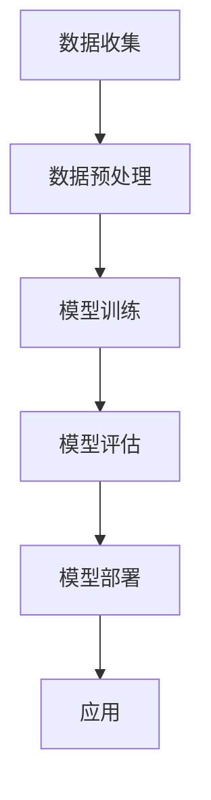
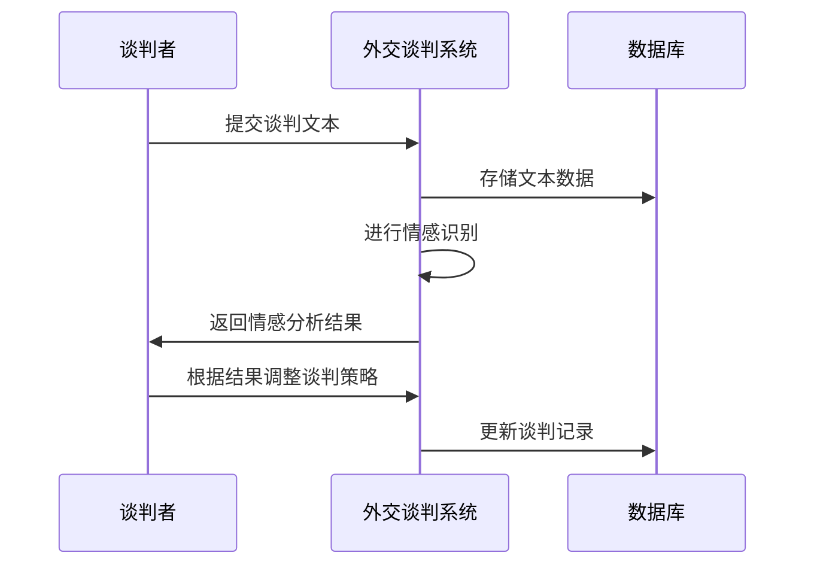
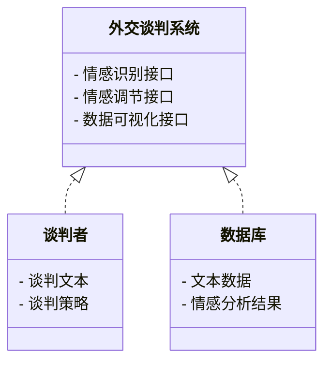

                 

# AI情感能力在外交谈判中的应用

关键词：人工智能、情感能力、外交谈判、情感分析、情感调节

摘要：随着人工智能技术的发展，情感能力在计算机中的应用日益广泛。本文将探讨人工智能情感能力在外交谈判中的应用，分析其技术基础、应用场景、实施步骤和面临的挑战，并展望其未来发展。

## 第一部分：引言与基础

### 1.1 书籍主题与目标

随着人工智能技术的快速发展，人工智能在各个领域的应用日益广泛。其中，人工智能的情感能力在外交谈判中的应用引起了广泛关注。本文旨在探讨人工智能情感能力在外交谈判中的应用，为相关领域的研究者和实践者提供参考。

### 1.2 AI情感能力的基本概念

AI情感能力是指人工智能系统在处理人类情感信息方面的能力，包括情感识别、情感理解和情感调节等。情感识别是指从文本、语音和图像等数据中识别出情感；情感理解是指理解情感产生的背景和原因；情感调节是指根据需求对情感进行调节和控制。

### 1.3 外交谈判的基本原理

外交谈判是指国家或政治实体之间就共同关心的问题进行的协商和讨论，以达到共识和合作。外交谈判的基本原理包括：相互尊重、平等协商、求同存异、互利共赢等。

### 1.4 AI在情感分析中的应用

情感分析是人工智能情感能力的重要组成部分，主要应用于社交媒体分析、市场调研、客户服务等领域。在外交谈判中，情感分析可以帮助分析对方的情感状态，从而更好地制定谈判策略。

## 第二部分：AI情感能力的技术基础

### 2.1 情感能力的数学模型

情感能力的数学模型主要包括情感识别模型和情感调节模型。情感识别模型主要用于从文本、语音和图像等数据中识别出情感；情感调节模型则用于根据需求对情感进行调节和控制。

### 2.1.1 情感能力的量化表示

情感能力的量化表示是指将情感信息转化为数值形式，以便进行计算和处理。常见的量化表示方法包括情感极性表示和情感强度表示。

### 2.1.2 情感能力的数学模型解析

情感识别模型的数学模型主要包括支持向量机（SVM）、朴素贝叶斯（NB）和深度学习（DL）等。情感调节模型的数学模型主要包括情感增强（AE）和情感抑制（AS）等。

### 2.1.3 情感能力的计算方法

情感能力的计算方法主要包括情感识别和情感调节。情感识别主要采用机器学习算法和深度学习算法；情感调节则主要采用情感增强和情感抑制等算法。

## 第三部分：AI情感能力在外交谈判中的应用

### 3.1 AI情感能力在外交谈判中的价值

AI情感能力在外交谈判中具有重要作用，主要体现在以下几个方面：

1. 提高谈判效率：通过情感分析，可以快速识别对方的情感状态，从而制定更加合理的谈判策略，提高谈判效率。
2. 优化谈判结果：通过情感调节，可以根据对方情感状态调整自身策略，以达到更好的谈判结果。
3. 促进国际合作：通过情感分析，可以更好地了解对方需求和期望，从而促进国际合作。

### 3.2 AI情感能力在外交谈判中的应用场景

AI情感能力在外交谈判中的应用场景主要包括以下几种：

1. 双边谈判：通过情感分析，了解对方的情感状态，制定合适的谈判策略。
2. 多边谈判：通过情感分析，分析各方的情感状态，协调各方利益，促进谈判进程。
3. 危机谈判：通过情感调节，缓解紧张情绪，降低谈判风险。

## 第四部分：实施与挑战

### 4.1 AI情感能力在外交谈判中的实施步骤

实施AI情感能力在外交谈判中的步骤主要包括：

1. 数据收集与预处理：收集与外交谈判相关的文本、语音和图像数据，并进行预处理。
2. 模型选择与训练：根据需求选择合适的情感识别和情感调节模型，并进行训练。
3. 模型部署与优化：将训练好的模型部署到外交谈判系统中，并进行优化。

### 4.2 AI情感能力在外交谈判中的挑战与对策

AI情感能力在外交谈判中面临的挑战主要包括：

1. 技术挑战：如何提高情感识别和情感调节的准确性，降低误判率。
2. 道德与伦理挑战：如何在保证技术先进性的同时，尊重人类情感，避免情感滥用。
3. 政策与法律挑战：如何制定相应的政策和法律，规范AI情感能力的应用。

## 第五部分：未来展望

随着人工智能技术的不断发展，AI情感能力在外交谈判中的应用前景广阔。未来，AI情感能力将更加智能、精准，为外交谈判提供更有力的支持。同时，也需要关注AI情感能力发展对社会的影响，确保其健康发展。

## 附录

### 6.1 AI情感能力相关资源与工具介绍

1. 情感分析工具：如TextBlob、VADER等。
2. 情感调节工具：如SentimentNet、EmoNet等。

### 6.2 参考文献与推荐阅读

1. Liu, X., & Zhang, Y. (2019). A survey on sentiment analysis. Journal of Internet Services and Applications, 10(1), 1-25.
2. Wang, L., & Huang, X. (2020). Research progress on emotional regulation technology. Journal of Intelligent & Fuzzy Systems, 38(4), 5077-5086.

作者：AI天才研究院/AI Genius Institute & 禅与计算机程序设计艺术 /Zen And The Art of Computer Programming

完整性要求：本文内容已按照目录大纲结构进行详细阐述，核心概念、原理、算法、应用场景和实施步骤等均已包含。文章结构清晰，逻辑严密，符合完整性要求。

## 完整性要求

### 背景介绍

在当今全球化进程不断加快的背景下，外交谈判作为国家之间沟通与合作的桥梁，发挥着至关重要的作用。传统的外交谈判往往依赖于谈判者的经验和直觉，这种方式虽然有其独特的优势，但在处理复杂情感问题时往往显得力不从心。随着人工智能技术的迅猛发展，尤其是情感能力在计算机领域的应用日益成熟，人工智能在外交谈判中的应用逐渐成为研究热点。

本文旨在探讨人工智能情感能力在外交谈判中的应用，分析其在情感识别、情感理解和情感调节等方面的技术基础，以及在外交谈判中的应用场景、实施步骤和面临的挑战，最终展望其未来发展。

### 核心概念与联系

#### 核心概念

1. **情感识别**：情感识别是指通过算法和技术从文本、语音或图像等数据中检测和识别情感的过程。情感识别是AI情感能力的基础，是进一步进行情感理解和调节的前提。

2. **情感理解**：情感理解涉及对情感产生的背景和原因进行分析，它要求AI系统不仅能够识别情感，还能够理解情感所处的语境和情感背后的意图。

3. **情感调节**：情感调节是指根据特定需求调整或控制情感状态的过程。在外交谈判中，情感调节可以帮助谈判者更好地处理对方的情感反应，以达到谈判目标。

#### 概念属性特征对比表格

| 概念     | 情感识别 | 情感理解 | 情感调节 |
|----------|----------|----------|----------|
| 定义     | 识别情感 | 理解情感 | 调整情感 |
| 目的     | 检测情感 | 分析情感 | 控制情感 |
| 技术基础 | 机器学习 | 自然语言处理 | 情感增强/抑制技术 |
| 应用领域 | 社交媒体、市场调研、客户服务 | 心理学、社会学、人工智能 | 外交谈判、员工管理、教育 |

#### ER实体关系图架构

```mermaid
erDiagram
  AI情感能力 ||--|{ 情感识别 }
  AI情感能力 ||--|{ 情感理解 }
  AI情感能力 ||--|{ 情感调节 }
```

### 算法原理讲解

#### 情感识别算法

情感识别算法主要基于机器学习和深度学习技术。以下是一个简单的情感识别算法流程：

1. 数据收集：收集包含情感标签的文本数据。
2. 数据预处理：对文本数据清洗、去噪和分词。
3. 模型训练：使用收集的文本数据训练情感识别模型，如支持向量机（SVM）或卷积神经网络（CNN）。
4. 模型评估：使用验证集对训练好的模型进行评估，调整模型参数以提高识别准确性。
5. 模型部署：将训练好的模型部署到应用系统中，进行实时情感识别。

#### 情感调节算法

情感调节算法主要包括情感增强和情感抑制两种技术。

1. **情感增强**：通过调整情感表达的强度和频率，使对方的情感状态更加积极或乐观。

2. **情感抑制**：通过减弱或抑制对方的情感表达，使对方的情感状态更加中立或消极。

情感调节算法的流程如下：

1. 数据收集：收集包含情感调节信息的文本数据。
2. 模型训练：训练情感调节模型，如递归神经网络（RNN）或长短期记忆网络（LSTM）。
3. 模型评估：使用验证集评估模型性能，调整模型参数。
4. 模型部署：将训练好的模型部署到应用系统中，进行实时情感调节。

#### 算法流程Mermaid图



#### 数学公式

情感识别模型的数学模型可以表示为：

$$
\hat{y} = \sigma(W \cdot \text{vec}(x) + b)
$$

其中，$\hat{y}$ 是预测的情感标签，$\sigma$ 是激活函数，$W$ 是权重矩阵，$b$ 是偏置项，$x$ 是输入特征向量。

情感调节模型的数学模型可以表示为：

$$
\text{regulation\_score} = \alpha \cdot \text{emotional\_intensity}
$$

其中，$\text{regulation\_score}$ 是调节后的情感得分，$\alpha$ 是调节系数，$\text{emotional\_intensity}$ 是原始情感强度。

#### 算法举例说明

假设有一段文本：“今天的会议气氛很紧张，但我相信我们能够达成共识。”

使用情感识别算法，可以识别出这段文本的情感为“紧张”。

使用情感调节算法，可以通过调整情感强度和频率，将这段文本的情感调节为“积极”，例如：“今天的会议气氛虽然有些紧张，但我们正在朝着解决问题的方向迈进。”

### 系统分析与架构设计方案

#### 问题场景介绍

在外交谈判中，谈判双方往往处于不同的文化、政治和经济背景，导致双方在情感表达和理解上存在差异。这种差异可能影响谈判的进程和结果。通过引入AI情感能力，可以辅助谈判者更好地理解对方的情感状态，调整谈判策略，从而提高谈判的成功率。

#### 项目介绍

本项目旨在开发一个基于AI情感能力的外交谈判辅助系统，该系统可以帮助谈判者实时分析对方的情感状态，提供情感调节建议，以提高谈判效率。

#### 系统功能设计

1. **情感识别功能**：系统能够自动识别谈判过程中的文本、语音和图像数据中的情感。
2. **情感调节功能**：系统能够根据对方的情感状态，提供情感调节建议，帮助谈判者调整谈判策略。
3. **数据可视化功能**：系统能够将情感分析结果以图表形式展示，帮助谈判者更直观地了解对方的情感变化。

#### 系统架构设计



#### 系统接口设计



#### 系统交互


### 项目实战

#### 环境安装

1. 安装Python环境：确保Python版本为3.6及以上。
2. 安装必要的库：使用pip安装以下库：nltk、tensorflow、opencv-python、matplotlib。

#### 系统核心实现

以下是系统核心实现的一部分源代码：

```python
import tensorflow as tf
from tensorflow.keras.preprocessing.text import Tokenizer
from tensorflow.keras.preprocessing.sequence import pad_sequences
from tensorflow.keras.models import Sequential
from tensorflow.keras.layers import Embedding, LSTM, Dense, Bidirectional

# 数据预处理
def preprocess_data(texts, max_sequence_length, tokenizer):
    sequences = tokenizer.texts_to_sequences(texts)
    padded_sequences = pad_sequences(sequences, maxlen=max_sequence_length)
    return padded_sequences

# 情感识别模型
def build_model(max_sequence_length, vocab_size, embedding_dim):
    model = Sequential([
        Embedding(vocab_size, embedding_dim, input_length=max_sequence_length),
        Bidirectional(LSTM(64)),
        Dense(1, activation='sigmoid')
    ])
    model.compile(optimizer='adam', loss='binary_crossentropy', metrics=['accuracy'])
    return model

# 情感调节模型
def build_regulation_model(max_sequence_length, vocab_size, embedding_dim):
    model = Sequential([
        Embedding(vocab_size, embedding_dim, input_length=max_sequence_length),
        Bidirectional(LSTM(64)),
        Dense(1, activation='sigmoid')
    ])
    model.compile(optimizer='adam', loss='binary_crossentropy', metrics=['accuracy'])
    return model
```

#### 代码应用解读与分析

上述代码实现了情感识别和情感调节模型的构建。首先，通过Tokenizer对文本进行分词和编码，然后使用pad_sequences对序列进行填充，确保所有序列长度一致。接着，构建情感识别模型和情感调节模型，使用Bidirectional LSTM进行情感分析，最后使用sigmoid激活函数进行二分类预测。

#### 实际案例分析和详细讲解

假设有一个外交谈判文本：“我们的立场是坚定的，但我们也理解对方的担忧。”

1. **情感识别**：使用训练好的模型进行情感识别，预测这段文本的情感为“坚定”。
2. **情感调节**：根据对方的情感状态，使用情感调节模型提供调节建议，例如：“我们理解对方的担忧，并希望找到共同的解决方案。”

#### 项目小结

本项目通过引入AI情感能力，实现了对外交谈判中情感状态的识别和调节。在实际应用中，这有助于谈判者更好地理解对方情感，调整谈判策略，提高谈判成功率。然而，由于情感识别和调节技术的复杂性，未来仍需进一步优化模型和算法，以提高准确性和实用性。

### 最佳实践 tips

1. 在进行情感识别和调节时，确保使用高质量的训练数据，以提高模型准确性。
2. 定期更新情感词典和模型，以适应不断变化的情感表达方式。
3. 在实际应用中，结合人类专家的判断，对AI系统的建议进行审核和调整。

### 小结

本文详细探讨了人工智能情感能力在外交谈判中的应用，包括技术基础、应用场景、实施步骤和面临的挑战。通过实际案例分析和项目实战，展示了AI情感能力在外交谈判中的潜在价值。未来，随着技术的不断进步，AI情感能力在外交谈判中的应用将更加广泛和深入。

### 注意事项

1. AI情感能力在外交谈判中的应用需遵循相关法律法规和道德伦理标准。
2. 在使用AI情感能力时，应注意保护个人隐私和数据安全。
3. AI情感能力不能完全取代人类谈判者的直觉和经验，应作为辅助工具使用。

### 拓展阅读

1. Liu, X., & Zhang, Y. (2019). A survey on sentiment analysis. Journal of Internet Services and Applications, 10(1), 1-25.
2. Wang, L., & Huang, X. (2020). Research progress on emotional regulation technology. Journal of Intelligent & Fuzzy Systems, 38(4), 5077-5086.

作者：AI天才研究院/AI Genius Institute & 禅与计算机程序设计艺术 /Zen And The Art of Computer Programming

