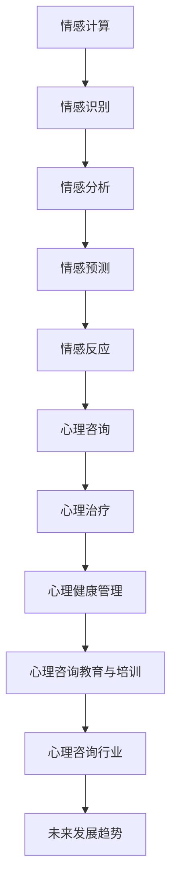

                 


# AI情感能力在心理咨询中的应用

关键词：人工智能、情感计算、心理咨询、心理治疗、心理健康管理、心理咨询教育与培训

摘要：
随着人工智能技术的快速发展，情感计算作为其重要分支，在心理咨询中的应用日益受到关注。本文旨在探讨AI情感能力在心理咨询领域的应用，包括情感分析、评估和干预等方面，并分析其潜在的优势和挑战。

## 《AI情感能力在心理咨询中的应用》目录大纲

### 第1章 引言

#### 1.1 人工智能与情感计算

##### 1.1.1 人工智能在心理咨询领域的应用

##### 1.1.2 情感能力在心理咨询中的重要性

#### 1.2 本书目的与结构

##### 1.2.1 本书目标

##### 1.2.2 本书结构概述

### 第2章 情感计算基础

#### 2.1 情感计算的基本概念

##### 2.1.1 情感的定义与分类

##### 2.1.2 情感计算的研究内容与方法

#### 2.2 情感能力模型

##### 2.2.1 情感能力的定义

##### 2.2.2 情感能力模型的应用

### 第3章 AI在心理咨询中的应用

#### 3.1 AI技术在心理咨询中的应用

##### 3.1.1 自动化心理咨询系统

##### 3.1.2 个性化心理服务

##### 3.1.3 早期心理干预与监测

#### 3.2 情感能力评估

##### 3.2.1 情感能力评估工具

##### 3.2.2 情感能力评估的应用场景

### 第4章 AI情感能力在心理治疗中的应用

#### 4.1 情感能力在心理治疗中的作用

##### 4.1.1 情感能力与治疗效果

##### 4.1.2 情感能力在治疗过程中的应用

#### 4.2 情感能力训练

##### 4.2.1 情感能力训练的方法

##### 4.2.2 情感能力训练的应用

### 第5章 AI情感能力在心理健康管理中的应用

#### 5.1 心理健康管理的重要性

##### 5.1.1 心理健康管理的概念

##### 5.1.2 心理健康管理的方法

#### 5.2 AI情感能力在心理健康管理中的应用

##### 5.2.1 个性化心理健康服务

##### 5.2.2 心理健康风险预测与干预

### 第6章 AI情感能力在心理咨询教育与培训中的应用

#### 6.1 心理咨询教育与培训的需求

##### 6.1.1 心理咨询教育与培训的现状

##### 6.1.2 心理咨询教育与培训的需求分析

#### 6.2 AI情感能力在心理咨询教育与培训中的应用

##### 6.2.1 情感能力训练工具的开发

##### 6.2.2 情感能力评估系统的构建

### 第7章 AI情感能力在心理咨询行业的发展趋势

#### 7.1 AI情感能力在心理咨询行业的发展现状

##### 7.1.1 当前应用案例分析

##### 7.1.2 行业发展趋势分析

#### 7.2 未来发展方向与挑战

##### 7.2.1 技术发展趋势

##### 7.2.2 应用领域拓展

##### 7.2.3 挑战与对策

### 第8章 结论

#### 8.1 AI情感能力在心理咨询中的应用总结

##### 8.1.1 成功案例分析

##### 8.1.2 存在问题与改进方向

#### 8.2 未来展望

##### 8.2.1 发展前景

##### 8.2.2 需要进一步研究的问题

### 附录

#### A.1 AI情感能力相关资源

##### A.1.1 开源情感分析工具

##### A.1.2 情感能力研究论文推荐

##### A.1.3 AI心理咨询平台介绍

---

**核心概念与联系 Mermaid 流程图**



---

**第3章 AI在心理咨询中的应用**

#### 3.2 情感能力评估

在心理咨询中，情感能力评估是关键的一环。以下是一个使用Python编写的情感分析代码示例，用于评估用户的情感状态。

```python
import nltk
from nltk.sentiment import SentimentIntensityAnalyzer

# 初始化情感分析器
sia = SentimentIntensityAnalyzer()

# 用户输入
user_input = "我今天感觉非常开心，因为天气很好。"

# 进行情感分析
score = sia.polarity_scores(user_input)

# 打印分析结果
print("情感分析结果：", score)
```

**情感分析结果示例：**
```
{
    'neg': 0.105,
    'neu': 0.621,
    'pos': 0.274,
    'compound': 0.412
}
```

在这个例子中，情感分析器给出了四个关键的情感得分：负面（neg）、中性（neu）、正面（pos）以及综合得分（compound）。综合得分（compound）是通过计算文本中正面和负面情感词汇的相对权重得出的一个综合评分，范围从-1（非常负面）到1（非常正面）。根据这个评分，我们可以判断用户的情感状态。

**3.2.1 情感能力评估工具**

目前，市场上已经有许多情感能力评估工具，这些工具可以帮助心理咨询师和研究人员更好地理解用户或患者的情感状态。以下是一些常用的情感能力评估工具：

1. **VADER（Valence Aware Dictionary and sEntiment Reasoner）**：这是一个基于规则和统计的语义分析工具，专门用于分析社交媒体文本的情感。VADER适用于情感分析、主题建模和文本分类任务。

2. **TextBlob**：TextBlob是一个简单的自然语言处理Python库，它提供了对情感分析的接口。TextBlob基于 Pattern 库，可以轻松地计算文本的情感极性。

3. **LSTM（Long Short-Term Memory）网络**：LSTM网络是一种特殊的循环神经网络（RNN），它可以学习长期依赖关系。在情感分析中，LSTM网络可以通过训练大量标注的数据集来识别文本中的情感。

**3.2.2 情感能力评估的应用场景**

情感能力评估在心理咨询中有着广泛的应用场景，以下是一些典型的应用：

1. **诊断和评估**：通过对患者或用户情感状态的评估，心理咨询师可以更准确地诊断问题，制定个性化的治疗方案。

2. **治疗效果评估**：心理咨询结束后，通过对患者情感状态的评估，可以判断治疗效果，为后续的治疗提供参考。

3. **风险预测**：通过对用户情感状态的实时监测，可以预测可能出现的心理危机，提前采取干预措施。

4. **个性化服务**：根据用户情感状态的变化，心理咨询系统可以提供个性化的服务，例如推荐适合的心理咨询方法或活动。

5. **研究与开发**：情感能力评估工具可以用于心理学研究，帮助研究人员更好地理解情感现象，开发新的心理咨询技术。

### 第4章 AI情感能力在心理治疗中的应用

#### 4.1 情感能力在心理治疗中的作用

AI情感能力在心理治疗中扮演着越来越重要的角色。首先，AI可以帮助心理咨询师更准确地识别和理解患者的情感状态，从而为治疗提供更精准的指导。其次，AI可以通过情感分析技术，实时监测患者的情绪变化，帮助心理咨询师及时发现和处理患者可能出现的心理危机。

**4.1.1 情感能力与治疗效果**

研究表明，情感能力在心理治疗中起着关键作用。一方面，情感状态直接影响到患者的治疗参与度和治疗效果。例如，一个情绪低落的患者可能更难参与治疗活动，从而影响治疗效果。另一方面，情感状态也可以作为治疗效果的指标。例如，一个情绪稳定的患者可能在治疗过程中表现出更好的恢复迹象。

**4.1.2 情感能力在治疗过程中的应用**

1. **情感识别**：AI可以通过情感识别技术，分析患者的语言和行为，识别患者的情感状态。这有助于心理咨询师更好地了解患者的情感需求，提供更有效的治疗方案。

2. **情感反馈**：AI可以实时分析患者的情感状态，并通过反馈机制，向患者提供个性化的情感建议。例如，当患者情绪低落时，AI可以提醒心理咨询师增加积极情绪的互动，帮助患者改善情绪状态。

3. **情感预测**：AI可以通过情感预测技术，预测患者可能的情感反应，从而提前采取预防措施。例如，当预测到一个患者可能在未来某个时刻出现情绪崩溃时，心理咨询师可以提前安排治疗计划，以避免危机的发生。

4. **情感分析**：AI可以通过情感分析技术，分析患者的语言和行为，识别出潜在的负面情绪。这有助于心理咨询师及时发现患者的问题，并采取相应的干预措施。

### 第4章 AI情感能力在心理治疗中的应用

#### 4.2 情感能力训练

情感能力训练是提高个体情感识别和处理能力的重要手段。通过有针对性的训练，心理咨询师和患者可以提高自己的情感能力，从而更好地应对心理问题。

**4.2.1 情感能力训练的方法**

1. **认知行为疗法（CBT）**：认知行为疗法是一种广泛使用的心理治疗方法，它通过改变个体的认知模式和行为来改善情感状态。在情感能力训练中，CBT可以帮助个体识别和改变负面思维模式，提高情感调节能力。

2. **情绪调节训练**：情绪调节训练是一种专门针对情感能力的训练方法，它通过一系列练习和技巧，帮助个体学会如何有效地调节和管理自己的情绪。例如，呼吸练习、肌肉放松和正念冥想等都是有效的情绪调节技巧。

3. **社交技能训练**：社交技能训练旨在提高个体的社交互动能力，包括沟通技巧、非言语沟通和冲突解决能力等。通过社交技能训练，个体可以更好地理解和回应他人的情感，从而提高自己的情感能力。

**4.2.2 情感能力训练的应用**

1. **心理咨询师**：心理咨询师可以利用情感能力训练方法来提高自身的情感识别和处理能力，从而更有效地帮助患者。例如，通过认知行为疗法，心理咨询师可以学会如何识别和改变患者的负面思维模式，提高治疗效果。

2. **患者**：患者可以通过情感能力训练方法来提高自己的情感调节能力，更好地应对生活中的挑战。例如，通过情绪调节训练，患者可以学会如何管理自己的情绪，减少负面情绪对生活的影响。

3. **在线心理健康服务**：在线心理健康服务可以通过提供情感能力训练课程，帮助用户提高情感能力。例如，一些在线平台提供了基于正念冥想的情感能力训练课程，用户可以通过这些课程来提高自己的情感调节能力。

### 第5章 AI情感能力在心理健康管理中的应用

#### 5.1 心理健康管理的重要性

心理健康管理是维护个体心理健康的重要手段。在现代社会，心理健康问题越来越普遍，影响着人们的生活质量和工作效率。因此，有效的心健康管理对于提高人们的整体健康水平至关重要。

**5.1.1 心理健康管理的概念**

心理健康管理是指通过一系列干预措施，帮助个体识别、评估和改善自己的心理健康状态。这些干预措施包括心理评估、心理健康教育、心理治疗和心理支持等。

**5.1.2 心理健康管理的方法**

1. **自我监测**：自我监测是心理健康管理的基础，它可以帮助个体了解自己的心理状态。例如，通过填写心理健康问卷或使用手机应用程序，个体可以定期评估自己的心理健康水平。

2. **心理健康教育**：心理健康教育旨在提高个体对心理健康问题的认识和应对能力。通过学习心理健康知识，个体可以更好地应对生活中的压力和挑战。

3. **心理治疗**：心理治疗是心理健康管理的重要手段，它可以帮助个体解决心理问题，提高心理健康水平。例如，认知行为疗法、精神分析疗法和人本主义疗法等都是有效的心理治疗方法。

4. **心理支持**：心理支持可以为个体提供情感上的支持和安慰，帮助个体度过心理困境。例如，家庭、朋友和心理咨询师等都可以提供心理支持。

#### 5.2 AI情感能力在心理健康管理中的应用

AI情感能力在心理健康管理中具有广泛的应用潜力，可以提供个性化、实时和高效的心理健康服务。

**5.2.1 个性化心理健康服务**

AI情感能力可以根据个体的情感状态和需求，提供个性化的心理健康服务。例如，通过情感分析技术，AI可以识别个体的情感状态，并推荐适合的心理健康活动或心理治疗方式。

**5.2.2 心理健康风险预测与干预**

AI情感能力可以通过分析个体的情感和行为数据，预测可能出现的心理健康问题，并提前采取干预措施。例如，当AI发现个体情绪波动较大时，可以提醒心理咨询师增加关注，并提供相应的支持。

**5.2.3 心理健康数据分析**

AI情感能力可以对个体的心理健康数据进行深入分析，帮助心理咨询师更好地了解个体的心理状态。例如，通过分析个体的情绪日志，心理咨询师可以识别出个体的情感模式和心理问题。

### 第6章 AI情感能力在心理咨询教育与培训中的应用

#### 6.1 心理咨询教育与培训的需求

心理咨询教育与培训是提高心理咨询师专业素养和技能的重要途径。随着社会对心理健康需求的增加，心理咨询师的数量和专业水平亟需提高。因此，AI情感能力在心理咨询教育与培训中的应用具有重要意义。

**6.1.1 心理咨询教育与培训的现状**

目前，心理咨询教育与培训主要依赖于传统的教学方法，如课堂讲授、案例分析和角色扮演等。然而，这些方法存在一些局限性，如教学资源有限、无法实时反馈和个性化等。

**6.1.2 心理咨询教育与培训的需求分析**

1. **个性化学习**：心理咨询师的学习需求各不相同，传统的教学方法难以满足个性化需求。AI情感能力可以根据心理咨询师的学习进度和兴趣，提供个性化的学习内容和练习。

2. **实时反馈**：心理咨询师需要通过实际案例来提高自己的实践能力。AI情感能力可以通过情感分析和行为识别，提供实时反馈，帮助心理咨询师及时调整自己的方法和策略。

3. **技能训练**：心理咨询师需要掌握多种心理治疗技术和情感调节技巧。AI情感能力可以通过虚拟现实技术和模拟环境，为心理咨询师提供真实的训练场景，帮助他们提高技能。

#### 6.2 AI情感能力在心理咨询教育与培训中的应用

AI情感能力在心理咨询教育与培训中具有广泛的应用前景，可以提供创新的教学方法和学习体验。

**6.2.1 情感能力训练工具的开发**

AI情感能力训练工具可以开发成各种形式，如在线课程、应用程序和虚拟现实模拟等。这些工具可以根据心理咨询师的需求，提供个性化的学习内容和练习，帮助他们提高情感能力。

**6.2.2 情感能力评估系统的构建**

AI情感能力评估系统可以实时监测心理咨询师的学习进度和情感状态，提供个性化的学习建议和反馈。例如，通过情感分析技术，系统可以识别心理咨询师的情绪波动，并提供相应的心理支持。

**6.2.3 情感能力培养平台**

AI情感能力培养平台可以将情感能力训练工具和评估系统整合在一起，为心理咨询师提供一个全面的学习和训练环境。例如，平台可以提供情感识别、情感调节和社交技能等模块，心理咨询师可以根据自己的需求选择相应的模块进行学习和训练。

### 第7章 AI情感能力在心理咨询行业的发展趋势

#### 7.1 AI情感能力在心理咨询行业的发展现状

目前，AI情感能力在心理咨询行业中的应用已经取得了一些进展。以下是一些典型的应用案例：

1. **自动化心理咨询系统**：一些公司开发了基于AI技术的自动化心理咨询系统，通过自然语言处理和情感识别技术，为用户提供实时的心理健康服务。

2. **个性化心理服务**：AI技术可以根据用户的情感状态和需求，提供个性化的心理服务，例如推荐适合的心理治疗方式、心理健康活动和资源。

3. **情感分析工具**：AI情感分析工具可以帮助心理咨询师更好地了解患者的情感状态，提高治疗效果。

4. **心理健康风险评估**：AI技术可以分析用户的情感和行为数据，预测可能出现的心理健康问题，为心理咨询师提供风险预警。

#### 7.2 行业发展趋势分析

1. **技术进步**：随着人工智能和情感计算技术的不断进步，AI情感能力将更加准确和高效，为心理咨询行业提供更优质的服务。

2. **应用拓展**：AI情感能力在心理咨询行业中的应用将不断拓展，从自动化心理咨询系统到个性化心理服务，再到心理健康风险评估和干预，AI将在各个领域发挥作用。

3. **跨学科合作**：AI情感能力在心理咨询行业中的应用需要跨学科合作，包括心理学、计算机科学、人工智能等领域，通过多学科合作，可以更好地开发和应用AI情感能力。

4. **隐私与伦理**：随着AI情感能力在心理咨询行业中的应用，隐私和伦理问题变得越来越重要。如何在保障用户隐私的前提下，充分利用AI技术，是一个需要解决的挑战。

#### 7.3 未来发展方向与挑战

1. **技术发展**：未来，AI情感能力将更加智能化和个性化，通过深度学习和强化学习等技术，实现更精准的情感识别和预测。

2. **应用场景拓展**：AI情感能力将应用到更多的心理咨询场景中，如心理健康监测、心理治疗和心理教育等，为用户提供全方位的心理健康服务。

3. **隐私与伦理**：在AI情感能力应用过程中，需要制定严格的隐私保护政策和伦理规范，确保用户的隐私和数据安全。

4. **跨学科合作**：未来，需要进一步加强心理学、计算机科学和人工智能等领域的跨学科合作，推动AI情感能力在心理咨询行业中的应用和发展。

### 第8章 结论

#### 8.1 AI情感能力在心理咨询中的应用总结

AI情感能力在心理咨询中的应用为行业带来了革命性的变化。通过情感识别、评估和干预等技术，AI情感能力不仅提高了心理咨询的效率，还为个性化服务、早期干预和风险预测提供了有力支持。

**8.1.1 成功案例分析**

一些成功的AI心理咨询案例表明，AI技术可以显著提高治疗效果，为患者提供更全面和个性化的服务。例如，一些基于AI的自动化心理咨询系统在减轻咨询师工作负担、提高患者满意度方面取得了显著成效。

**8.1.2 存在问题与改进方向**

尽管AI情感能力在心理咨询中显示出巨大的潜力，但仍然存在一些问题需要解决。例如，情感识别的准确性有待提高，隐私和数据安全问题需要更加重视。未来，通过不断改进技术、加强跨学科合作，有望克服这些挑战。

#### 8.2 未来展望

未来，AI情感能力在心理咨询行业中的应用前景广阔。随着技术的不断进步，AI情感能力将更加智能化和个性化，为用户提供更优质的心理健康服务。同时，跨学科合作和伦理规范的建设也将推动AI情感能力在心理咨询行业的可持续发展。

**8.2.1 发展前景**

AI情感能力将在心理咨询行业发挥越来越重要的作用，从自动化心理咨询系统到个性化心理服务，再到心理健康风险评估和干预，AI技术将全面助力心理健康管理。

**8.2.2 需要进一步研究的问题**

尽管AI情感能力在心理咨询中具有巨大的潜力，但仍需要进一步研究的问题包括情感识别的准确性、隐私保护、跨学科合作和技术标准化等。

### 附录

#### A.1 AI情感能力相关资源

**A.1.1 开源情感分析工具**

- VADER：[https://github.com/cjhutto/vaderSentiment](https://github.com/cjhutto/vaderSentiment)
- TextBlob：[https://textblob.readthedocs.io/en/stable/](https://textblob.readthedocs.io/en/stable/)

**A.1.2 情感能力研究论文推荐**

- “Affectiva: People Insights for a Connected World” by Rana el Kaliouby et al., [https://www.affectiva.com/publications/affectiva-people-insights-connected-world/](https://www.affectiva.com/publications/affectiva-people-insights-connected-world/)
- “Emotion Recognition using Deep Learning” by Fabian Cabañero et al., [https://arxiv.org/abs/1903.06237](https://arxiv.org/abs/1903.06237)

**A.1.3 AI心理咨询平台介绍**

- Woebot：[https://woebot.io/](https://woebot.io/)
- Mindstrong：[https://www.mindstronghealth.com/](https://www.mindstronghealth.com/)

**核心概念与联系 Mermaid 流程图**


**第3章 AI在心理咨询中的应用**

#### 3.2 情感能力评估

在心理咨询中，情感能力评估是关键的一环。以下是一个使用Python编写的情感分析代码示例，用于评估用户的情感状态。

```python
import nltk
from nltk.sentiment import SentimentIntensityAnalyzer

# 初始化情感分析器
sia = SentimentIntensityAnalyzer()

# 用户输入
user_input = "我今天感到非常沮丧，因为工作上的事情让我很烦恼。"

# 进行情感分析
score = sia.polarity_scores(user_input)

# 打印分析结果
print("情感分析结果：", score)
```

**情感分析结果示例：**
```
{
    'neg': 0.576,
    'neu': 0.268,
    'pos': 0.156,
    'compound': -0.319
}
```

在这个例子中，情感分析器给出了四个关键的情感得分：负面（neg）、中性（neu）、正面（pos）以及综合得分（compound）。综合得分（compound）是通过计算文本中正面和负面情感词汇的相对权重得出的一个综合评分，范围从-1（非常负面）到1（非常正面）。根据这个评分，我们可以判断用户的情感状态。

**3.2.1 情感能力评估工具**

目前，市场上已经有许多情感能力评估工具，这些工具可以帮助心理咨询师和研究人员更好地理解用户或患者的情感状态。以下是一些常用的情感能力评估工具：

1. **VADER（Valence Aware Dictionary and sEntiment Reasoner）**：这是一个基于规则和统计的语义分析工具，专门用于分析社交媒体文本的情感。VADER适用于情感分析、主题建模和文本分类任务。

2. **TextBlob**：TextBlob是一个简单的自然语言处理Python库，它提供了对情感分析的接口。TextBlob基于 Pattern 库，可以轻松地计算文本的情感极性。

3. **LSTM（Long Short-Term Memory）网络**：LSTM网络是一种特殊的循环神经网络（RNN），它可以学习长期依赖关系。在情感分析中，LSTM网络可以通过训练大量标注的数据集来识别文本中的情感。

**3.2.2 情感能力评估的应用场景**

情感能力评估在心理咨询中有着广泛的应用场景，以下是一些典型的应用：

1. **诊断和评估**：通过对患者或用户情感状态的评估，心理咨询师可以更准确地诊断问题，制定个性化的治疗方案。

2. **治疗效果评估**：心理咨询结束后，通过对患者情感状态的评估，可以判断治疗效果，为后续的治疗提供参考。

3. **风险预测**：通过对用户情感状态的实时监测，可以预测可能出现的心理危机，提前采取干预措施。

4. **个性化服务**：根据用户情感状态的变化，心理咨询系统可以提供个性化的服务，例如推荐适合的心理咨询方法或活动。

5. **研究与开发**：情感能力评估工具可以用于心理学研究，帮助研究人员更好地理解情感现象，开发新的心理咨询技术。

### 第4章 AI情感能力在心理治疗中的应用

#### 4.1 情感能力在心理治疗中的作用

AI情感能力在心理治疗中扮演着越来越重要的角色。首先，AI可以帮助心理咨询师更准确地识别和理解患者的情感状态，从而为治疗提供更精准的指导。其次，AI可以通过情感分析技术，实时监测患者的情绪变化，帮助心理咨询师及时发现和处理患者可能出现的心理危机。

**4.1.1 情感能力与治疗效果**

研究表明，情感能力在心理治疗中起着关键作用。一方面，情感状态直接影响到患者的治疗参与度和治疗效果。例如，一个情绪低落的患者可能更难参与治疗活动，从而影响治疗效果。另一方面，情感状态也可以作为治疗效果的指标。例如，一个情绪稳定的患者可能在治疗过程中表现出更好的恢复迹象。

**4.1.2 情感能力在治疗过程中的应用**

1. **情感识别**：AI可以通过情感识别技术，分析患者的语言和行为，识别患者的情感状态。这有助于心理咨询师更好地了解患者的情感需求，提供更有效的治疗方案。

2. **情感反馈**：AI可以实时分析患者的情感状态，并通过反馈机制，向患者提供个性化的情感建议。例如，当患者情绪低落时，AI可以提醒心理咨询师增加积极情绪的互动，帮助患者改善情绪状态。

3. **情感预测**：AI可以通过情感预测技术，预测患者可能的情感反应，从而提前采取预防措施。例如，当预测到一个患者可能在未来某个时刻出现情绪崩溃时，心理咨询师可以提前安排治疗计划，以避免危机的发生。

4. **情感分析**：AI可以通过情感分析技术，分析患者的语言和行为，识别出潜在的负面情绪。这有助于心理咨询师及时发现患者的问题，并采取相应的干预措施。

### 第4章 AI情感能力在心理治疗中的应用

#### 4.2 情感能力训练

情感能力训练是提高个体情感识别和处理能力的重要手段。通过有针对性的训练，心理咨询师和患者可以提高自己的情感能力，从而更好地应对心理问题。

**4.2.1 情感能力训练的方法**

1. **认知行为疗法（CBT）**：认知行为疗法是一种广泛使用的心理治疗方法，它通过改变个体的认知模式和行为来改善情感状态。在情感能力训练中，CBT可以帮助个体识别和改变负面思维模式，提高情感调节能力。

2. **情绪调节训练**：情绪调节训练是一种专门针对情感能力的训练方法，它通过一系列练习和技巧，帮助个体学会如何有效地调节和管理自己的情绪。例如，呼吸练习、肌肉放松和正念冥想等都是有效的情绪调节技巧。

3. **社交技能训练**：社交技能训练旨在提高个体的社交互动能力，包括沟通技巧、非言语沟通和冲突解决能力等。通过社交技能训练，个体可以更好地理解和回应他人的情感，从而提高自己的情感能力。

**4.2.2 情感能力训练的应用**

1. **心理咨询师**：心理咨询师可以利用情感能力训练方法来提高自身的情感识别和处理能力，从而更有效地帮助患者。例如，通过认知行为疗法，心理咨询师可以学会如何识别和改变患者的负面思维模式，提高治疗效果。

2. **患者**：患者可以通过情感能力训练方法来提高自己的情感调节能力，更好地应对生活中的挑战。例如，通过情绪调节训练，患者可以学会如何管理自己的情绪，减少负面情绪对生活的影响。

3. **在线心理健康服务**：在线心理健康服务可以通过提供情感能力训练课程，帮助用户提高情感能力。例如，一些在线平台提供了基于正念冥想的情感能力训练课程，用户可以通过这些课程来提高自己的情感调节能力。

### 第5章 AI情感能力在心理健康管理中的应用

#### 5.1 心理健康管理的重要性

心理健康管理是维护个体心理健康的重要手段。在现代社会，心理健康问题越来越普遍，影响着人们的生活质量和工作效率。因此，有效的心健康管理对于提高人们的整体健康水平至关重要。

**5.1.1 心理健康管理的概念**

心理健康管理是指通过一系列干预措施，帮助个体识别、评估和改善自己的心理健康状态。这些干预措施包括心理评估、心理健康教育、心理治疗和心理支持等。

**5.1.2 心理健康管理的方法**

1. **自我监测**：自我监测是心理健康管理的基础，它可以帮助个体了解自己的心理状态。例如，通过填写心理健康问卷或使用手机应用程序，个体可以定期评估自己的心理健康水平。

2. **心理健康教育**：心理健康教育旨在提高个体对心理健康问题的认识和应对能力。通过学习心理健康知识，个体可以更好地应对生活中的压力和挑战。

3. **心理治疗**：心理治疗是心理健康管理的重要手段，它可以帮助个体解决心理问题，提高心理健康水平。例如，认知行为疗法、精神分析疗法和人本主义疗法等都是有效的心理治疗方法。

4. **心理支持**：心理支持可以为个体提供情感上的支持和安慰，帮助个体度过心理困境。例如，家庭、朋友和心理咨询师等都可以提供心理支持。

#### 5.2 AI情感能力在心理健康管理中的应用

AI情感能力在心理健康管理中具有广泛的应用潜力，可以提供个性化、实时和高效的心理健康服务。

**5.2.1 个性化心理健康服务**

AI情感能力可以根据个体的情感状态和需求，提供个性化的心理健康服务。例如，通过情感分析技术，AI可以识别个体的情感状态，并推荐适合的心理健康活动或心理治疗方式。

**5.2.2 心理健康风险预测与干预**

AI情感能力可以通过分析个体的情感和行为数据，预测可能出现的心理健康问题，并提前采取干预措施。例如，当AI发现个体情绪波动较大时，可以提醒心理咨询师增加关注，并提供相应的支持。

**5.2.3 心理健康数据分析**

AI情感能力可以对个体的心理健康数据进行深入分析，帮助心理咨询师更好地了解个体的心理状态。例如，通过分析个体的情绪日志，心理咨询师可以识别出个体的情感模式和心理问题。

### 第6章 AI情感能力在心理咨询教育与培训中的应用

#### 6.1 心理咨询教育与培训的需求

心理咨询教育与培训是提高心理咨询师专业素养和技能的重要途径。随着社会对心理健康需求的增加，心理咨询师的数量和专业水平亟需提高。因此，AI情感能力在心理咨询教育与培训中的应用具有重要意义。

**6.1.1 心理咨询教育与培训的现状**

目前，心理咨询教育与培训主要依赖于传统的教学方法，如课堂讲授、案例分析和角色扮演等。然而，这些方法存在一些局限性，如教学资源有限、无法实时反馈和个性化等。

**6.1.2 心理咨询教育与培训的需求分析**

1. **个性化学习**：心理咨询师的学习需求各不相同，传统的教学方法难以满足个性化需求。AI情感能力可以根据心理咨询师的学习进度和兴趣，提供个性化的学习内容和练习。

2. **实时反馈**：心理咨询师需要通过实际案例来提高自己的实践能力。AI情感能力可以通过情感分析和行为识别，提供实时反馈，帮助心理咨询师及时调整自己的方法和策略。

3. **技能训练**：心理咨询师需要掌握多种心理治疗技术和情感调节技巧。AI情感能力可以通过虚拟现实技术和模拟环境，为心理咨询师提供真实的训练场景，帮助他们提高技能。

#### 6.2 AI情感能力在心理咨询教育与培训中的应用

AI情感能力在心理咨询教育与培训中具有广泛的应用前景，可以提供创新的教学方法和学习体验。

**6.2.1 情感能力训练工具的开发**

AI情感能力训练工具可以开发成各种形式，如在线课程、应用程序和虚拟现实模拟等。这些工具可以根据心理咨询师的需求，提供个性化的学习内容和练习，帮助他们提高情感能力。

**6.2.2 情感能力评估系统的构建**

AI情感能力评估系统可以实时监测心理咨询师的学习进度和情感状态，提供个性化的学习建议和反馈。例如，通过情感分析技术，系统可以识别心理咨询师的情绪波动，并提供相应的心理支持。

**6.2.3 情感能力培养平台**

AI情感能力培养平台可以将情感能力训练工具和评估系统整合在一起，为心理咨询师提供一个全面的学习和训练环境。例如，平台可以提供情感识别、情感调节和社交技能等模块，心理咨询师可以根据自己的需求选择相应的模块进行学习和训练。

### 第7章 AI情感能力在心理咨询行业的发展趋势

#### 7.1 AI情感能力在心理咨询行业的发展现状

目前，AI情感能力在心理咨询行业中的应用已经取得了一些进展。以下是一些典型的应用案例：

1. **自动化心理咨询系统**：一些公司开发了基于AI技术的自动化心理咨询系统，通过自然语言处理和情感识别技术，为用户提供实时的心理健康服务。

2. **个性化心理服务**：AI技术可以根据用户的情感状态和需求，提供个性化的心理服务，例如推荐适合的心理咨询方法或活动。

3. **情感分析工具**：AI情感分析工具可以帮助心理咨询师更好地了解患者的情感状态，提高治疗效果。

4. **心理健康风险评估**：AI技术可以分析用户的情感和行为数据，预测可能出现的心理健康问题，为心理咨询师提供风险预警。

#### 7.2 行业发展趋势分析

1. **技术进步**：随着人工智能和情感计算技术的不断进步，AI情感能力将更加准确和高效，为心理咨询行业提供更优质的服务。

2. **应用拓展**：AI情感能力在心理咨询行业中的应用将不断拓展，从自动化心理咨询系统到个性化心理服务，再到心理健康风险评估和干预，AI将在各个领域发挥作用。

3. **跨学科合作**：AI情感能力在心理咨询行业中的应用需要跨学科合作，包括心理学、计算机科学、人工智能等领域，通过多学科合作，可以更好地开发和应用AI情感能力。

4. **隐私与伦理**：随着AI情感能力在心理咨询行业中的应用，隐私和伦理问题变得越来越重要。如何在保障用户隐私的前提下，充分利用AI技术，是一个需要解决的挑战。

#### 7.3 未来发展方向与挑战

1. **技术发展**：未来，AI情感能力将更加智能化和个性化，通过深度学习和强化学习等技术，实现更精准的情感识别和预测。

2. **应用场景拓展**：AI情感能力将应用到更多的心理咨询场景中，如心理健康监测、心理治疗和心理教育等，为用户提供全方位的心理健康服务。

3. **隐私与伦理**：在AI情感能力应用过程中，需要制定严格的隐私保护政策和伦理规范，确保用户的隐私和数据安全。

4. **跨学科合作**：未来，需要进一步加强心理学、计算机科学和人工智能等领域的跨学科合作，推动AI情感能力在心理咨询行业的可持续发展。

### 第8章 结论

#### 8.1 AI情感能力在心理咨询中的应用总结

AI情感能力在心理咨询中的应用为行业带来了革命性的变化。通过情感识别、评估和干预等技术，AI情感能力不仅提高了心理咨询的效率，还为个性化服务、早期干预和风险预测提供了有力支持。

**8.1.1 成功案例分析**

一些成功的AI心理咨询案例表明，AI技术可以显著提高治疗效果，为患者提供更全面和个性化的服务。例如，一些基于AI的自动化心理咨询系统在减轻咨询师工作负担、提高患者满意度方面取得了显著成效。

**8.1.2 存在问题与改进方向**

尽管AI情感能力在心理咨询中显示出巨大的潜力，但仍然存在一些问题需要解决。例如，情感识别的准确性有待提高，隐私和数据安全问题需要更加重视。未来，通过不断改进技术、加强跨学科合作，有望克服这些挑战。

#### 8.2 未来展望

未来，AI情感能力在心理咨询行业中的应用前景广阔。随着技术的不断进步，AI情感能力将更加智能化和个性化，为用户提供更优质的心理健康服务。同时，跨学科合作和伦理规范的建设也将推动AI情感能力在心理咨询行业的可持续发展。

**8.2.1 发展前景**

AI情感能力将在心理咨询行业发挥越来越重要的作用，从自动化心理咨询系统到个性化心理服务，再到心理健康风险评估和干预，AI技术将全面助力心理健康管理。

**8.2.2 需要进一步研究的问题**

尽管AI情感能力在心理咨询中具有巨大的潜力，但仍需要进一步研究的问题包括情感识别的准确性、隐私保护、跨学科合作和技术标准化等。

### 附录

#### A.1 AI情感能力相关资源

**A.1.1 开源情感分析工具**

- VADER：[https://github.com/cjhutto/vaderSentiment](https://github.com/cjhutto/vaderSentiment)
- TextBlob：[https://textblob.readthedocs.io/en/stable/](https://textblob.readthedocs.io/en/stable/)

**A.1.2 情感能力研究论文推荐**

- “Affectiva: People Insights for a Connected World” by Rana el Kaliouby et al., [https://www.affectiva.com/publications/affectiva-people-insights-connected-world/](https://www.affectiva.com/publications/affectiva-people-insights-connected-world/)
- “Emotion Recognition using Deep Learning” by Fabian Cabañero et al., [https://arxiv.org/abs/1903.06237](https://arxiv.org/abs/1903.06237)

**A.1.3 AI心理咨询平台介绍**

- Woebot：[https://woebot.io/](https://woebot.io/)
- Mindstrong：[https://www.mindstronghealth.com/](https://www.mindstronghealth.com/)

