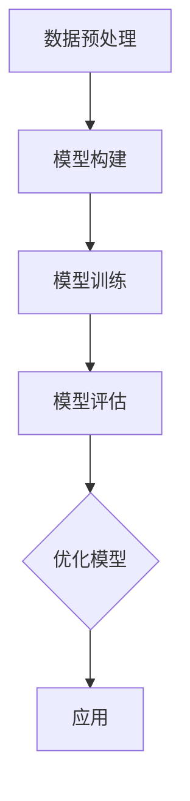
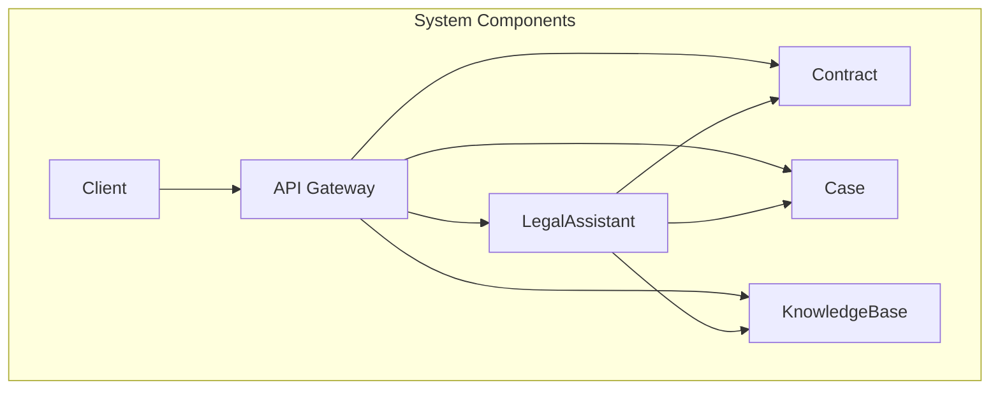
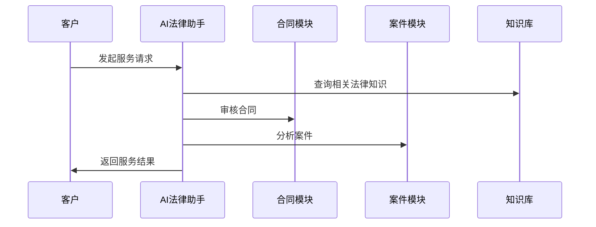

                 

### AI法律助手：大模型对法律服务的影响

在当今技术迅猛发展的时代，人工智能（AI）正以前所未有的速度渗透到我们生活的各个领域。法律行业也不例外，随着人工智能大模型的兴起，AI法律助手逐渐成为法律服务领域的一股新兴力量。本文将探讨人工智能大模型对法律服务的影响，深入分析其背景、核心概念、算法原理，并探讨其在法律咨询、案件处理和法务支持等方面的应用。

## **背景介绍**

### **1.1 问题背景**

随着互联网和信息技术的普及，法律服务的需求和复杂性不断增加。传统的法律服务模式，往往依赖于律师的个人经验和专业知识，这虽然保证了服务的专业性，但也存在效率低、成本高、覆盖面有限等问题。人工智能的出现，为法律服务带来了新的机遇和挑战。

人工智能大模型，如GPT、BERT等，以其强大的文本理解和生成能力，在法律领域展现出巨大的潜力。然而，这一变革也引发了一系列问题和挑战，如隐私保护、数据安全、算法透明性等。如何在确保隐私和安全的前提下，充分发挥人工智能的优势，成为法律行业面临的重要问题。

### **1.2 问题描述**

本文旨在探讨人工智能大模型对法律服务的影响，包括以下几个方面：

1. **提高效率**：人工智能大模型能够快速处理大量法律文本，提供高效的法律咨询和案件分析。
2. **降低成本**：通过自动化和智能化，人工智能大模型可以显著降低法律服务的人力成本。
3. **优化决策**：人工智能大模型能够基于大量数据进行分析，为法律决策提供更科学的依据。
4. **法律和伦理挑战**：人工智能大模型在法律服务中的应用，也带来了一系列法律和伦理问题，如隐私保护、算法透明性等。

### **1.3 问题解决**

为了解决上述问题，本文将采取以下研究方法：

1. **文献综述**：对现有研究成果进行梳理，总结人工智能大模型在法律服务中的应用现状。
2. **案例分析**：通过具体案例，分析人工智能大模型在法律服务中的实际应用效果。
3. **模型评估**：对人工智能大模型进行性能评估，探讨其优缺点。
4. **解决方案**：提出针对法律和伦理挑战的解决方案，以实现人工智能大模型在法律服务中的可持续发展。

### **1.4 边界与外延**

本文主要关注人工智能大模型在法律咨询、案件处理和法务支持等领域的应用，而不涉及人工智能在其他法律相关领域的应用，如执法、司法判决等。

### **1.5 概念结构与核心要素组成**

核心概念包括：人工智能、大模型、法律服务、法律咨询、案件处理等。这些概念相互联系，构成了本文的核心内容。

## **核心概念与联系**

### **2.1 人工智能大模型的定义与特点**

人工智能（AI）是指通过计算机程序模拟人类智能行为，实现自动化决策和问题解决的技术。人工智能大模型（Large-scale AI Models）是指具有数亿甚至千亿参数的深度学习模型，如GPT、BERT等。

人工智能大模型具有以下特点：

1. **参数量大**：大模型具有数亿甚至千亿参数，可以处理复杂的任务。
2. **训练数据丰富**：大模型通常基于大量的训练数据，具有良好的泛化能力。
3. **自适应性强**：大模型可以通过不断的学习和优化，适应不同的任务和环境。

### **2.2 人工智能大模型在法律服务中的应用**

人工智能大模型在法律服务中的应用主要体现在以下几个方面：

1. **法律咨询**：通过大模型对法律文本的理解，提供快速、准确的法律建议。
2. **案件处理**：辅助律师进行案件分析、证据整理和策略制定。
3. **法务支持**：为企业提供合规性审查、合同审核等法律服务。

### **2.3 核心概念属性特征对比表格**

| 核心概念 | 特征1 | 特征2 | 特征3 |
|----------|-------|-------|-------|
| 人工智能 | 自动化 | 智能化 | 泛化能力强 |
| 大模型   | 参数量大 | 训练数据丰富 | 自适应性强 |
| 法律服务 | 快速响应 | 高效处理 | 个性化服务 |
| 法律咨询 | 知识全面 | 专业性强 | 更新及时 |
| 案件处理 | 精准分析 | 系统化处理 | 提高胜诉率 |

### **2.4 ER实体关系图架构的Mermaid流程图**

```mermaid
erDiagram
  AI大模型 ||--|{ 法律服务 }|>
  法律服务 ||--|{ 法律咨询 }|>
  法律服务 ||--|{ 案件处理 }|>
  法律服务 ||--|{ 法务支持 }|>
```

## **算法原理讲解**

### **3.1 深度学习与神经网络**

深度学习是人工智能的一个重要分支，其核心思想是通过模拟人脑神经网络进行信息处理。神经网络由多个神经元（节点）组成，每个神经元都与相邻的神经元通过权重连接。通过学习，神经网络可以调整权重，实现对输入数据的分类、回归等任务。

### **3.2 人工智能大模型的训练过程**

人工智能大模型的训练过程主要包括以下步骤：

1. **数据预处理**：清洗和格式化原始数据，将其转化为模型可处理的格式。
2. **模型构建**：根据任务需求，选择合适的神经网络架构，并设置参数。
3. **模型训练**：使用大量标注数据对模型进行训练，通过反向传播算法不断调整权重。
4. **模型评估**：使用验证集和测试集评估模型性能，调整参数以优化模型。

### **3.3 人工智能大模型在法律服务中的应用**

人工智能大模型在法律服务中的应用主要依赖于其强大的文本理解和生成能力。例如，在法律咨询方面，大模型可以通过对大量法律文本的学习，实现对用户提问的快速、准确回答。在案件处理方面，大模型可以帮助律师对案件进行详细分析，提供有效的法律建议。

### **3.4 算法mermaid流程图**



### **3.5 算法原理的数学模型和公式**

在深度学习中，算法的原理可以归结为以下几个关键数学模型和公式：

1. **激活函数**：$$ f(x) = \max(0, x) $$
   激活函数用于确定神经元是否激活，其中 `x` 为输入值。

2. **损失函数**：$$ Loss = \frac{1}{2} \sum_{i=1}^{n} (y_i - \hat{y_i})^2 $$
   损失函数用于衡量模型的预测值与真实值之间的差距，其中 `y_i` 为真实值，$\hat{y_i}$ 为预测值。

3. **反向传播算法**：$$ \delta = \frac{\partial Loss}{\partial w} $$
   反向传播算法通过计算损失函数对权重的梯度，调整模型参数，以最小化损失函数。

### **3.6 人工智能大模型在法律服务中的实际应用示例**

**示例1：法律咨询**

假设用户询问：“合同违约责任如何承担？”人工智能大模型可以基于对大量法律文本的学习，快速生成以下回答：

```markdown
合同违约责任的承担通常根据合同条款和法律规定确定。根据《中华人民共和国合同法》第107条规定，当事人一方不履行合同义务或者履行合同义务不符合约定的，应当承担继续履行、采取补救措施或者赔偿损失等违约责任。如果违约行为导致对方遭受重大损失，违约方还应当支付违约金。

具体到您的案例，如果您发现对方违约，可以采取以下措施：

1. 要求对方继续履行合同义务；
2. 要求对方采取补救措施，如修复缺陷、更换货物等；
3. 要求对方支付违约金；
4. 如果违约行为导致您遭受重大损失，可以要求对方赔偿损失。

在采取上述措施前，建议您详细查阅相关法律条文，或咨询专业律师以获得更具体的法律建议。
```

**示例2：案件处理**

假设一位律师在处理一起知识产权侵权案件，需要分析被告的侵权行为。人工智能大模型可以基于对相关法律条文和案例的学习，快速生成以下分析报告：

```markdown
一、案件背景

本案件涉及某公司对其注册商标“X”的侵权纠纷。原告公司拥有注册商标“X”，并于近期发现被告公司在相同或类似的商品上使用了与原告商标近似的标识，疑似构成侵权。

二、侵权分析

1. 商标相同或近似：根据《中华人民共和国商标法》第10条规定，商标相同或近似，容易导致公众混淆的，构成侵权。本案中，被告使用的标识与原告商标存在相似性，容易导致公众混淆。

2. 商品相同或类似：根据《中华人民共和国商标法》第11条规定，相同或类似的商品上使用相同或近似的商标，构成侵权。本案中，被告在相同或类似的商品上使用了与原告商标近似的标识，构成侵权。

3. 擅自使用他人商标：根据《中华人民共和国商标法》第52条规定，未经商标注册人许可，擅自使用他人注册商标，构成侵权。本案中，被告未经原告许可，擅自使用原告注册商标，构成侵权。

三、法律依据

《中华人民共和国商标法》第10条、第11条、第52条。

四、律师建议

1. 建议原告公司向法院提起诉讼，要求被告停止侵权行为、消除影响、赔偿损失等。

2. 建议原告公司在诉讼过程中，积极提供证据，包括商标注册证书、商标使用证据等。

3. 建议原告公司关注被告在同类商品上的其他侵权行为，及时采取法律手段维护自身合法权益。

五、案例参考

相关案例：某公司诉某公司商标侵权纠纷案（[案例编号]）。
```

通过以上示例，可以看出人工智能大模型在法律咨询和案件处理中的应用，具有高效、准确、智能的特点，为律师和法律服务提供了有力的支持。

## **系统分析与架构设计方案**

### **4.1 问题场景介绍**

在现代企业中，法律事务日益复杂，企业需要处理大量的合同审核、法律咨询、知识产权保护等工作。传统的法律服务模式往往效率低下，成本高昂，难以满足企业的需求。为了解决这个问题，我们设计了一套基于人工智能大模型的AI法律助手系统，旨在为企业提供高效、智能的法律服务。

### **4.2 项目介绍**

项目名称：AI法律助手系统

项目背景：随着企业业务的发展，法律事务日益增多，传统法律服务模式难以满足企业需求。人工智能大模型的出现为法律服务的自动化、智能化提供了可能。

项目目标：设计并实现一套基于人工智能大模型的AI法律助手系统，提供智能法律咨询、案件处理、合同审核等功能，提高法律服务效率，降低成本。

### **4.3 系统功能设计（领域模型Mermaid类图）**

```mermaid
classDiagram
  Client --> LegalAssistant : request service
  LegalAssistant --> Contract : process contract
  LegalAssistant --> Case : handle case
  LegalAssistant --> KnowledgeBase : access knowledge
  Contract <<Interface>>
  Case <<Interface>>
  KnowledgeBase <<Interface>>

  Client[Client]
  LegalAssistant[AI Legal Assistant]
  Contract[Contract Module]
  Case[Case Module]
  KnowledgeBase[Knowledge Base]
```

### **4.4 系统架构设计（Mermaid架构图）**



### **4.5 系统接口设计**

1. **接口1：合同审核**

   - 接口名称：`/api/contract/validate`
   - 功能描述：接收合同文本，使用AI法律助手进行审核，返回审核结果。
   - 请求参数：`{ "contractText": "合同文本内容" }`
   - 返回结果：`{ "isValid": true/false, "message": "审核结果说明" }`

2. **接口2：法律咨询**

   - 接口名称：`/api/legal/consult`
   - 功能描述：接收用户咨询问题，使用AI法律助手提供法律咨询。
   - 请求参数：`{ "question": "用户提问内容" }`
   - 返回结果：`{ "answer": "法律咨询答案" }`

3. **接口3：案件分析**

   - 接口名称：`/api/case/analyze`
   - 功能描述：接收案件相关数据，使用AI法律助手进行分析。
   - 请求参数：`{ "caseData": "案件数据内容" }`
   - 返回结果：`{ "analysis": "案件分析结果" }`

### **4.6 系统交互设计（Mermaid序列图）**



通过以上系统架构和接口设计，我们可以看到AI法律助手系统如何通过不同的模块和接口，为企业提供全面、高效的法律服务。

### **4.7 系统实现**

为了实现AI法律助手系统，我们需要进行以下步骤：

1. **环境搭建**：

   - 安装Python环境，版本要求3.8以上；
   - 安装TensorFlow、Keras等深度学习库；
   - 安装Flask等Web开发库。

2. **模型训练**：

   - 准备大量法律文本数据，包括合同、案例、法律条文等；
   - 使用GPT或BERT等大模型进行训练；
   - 调整模型参数，优化性能。

3. **接口实现**：

   - 使用Flask构建API接口，实现合同审核、法律咨询、案件分析等功能；
   - 集成模型，实现接口与模型的交互。

4. **系统部署**：

   - 部署到服务器，实现24小时在线服务；
   - 进行性能测试和优化。

### **4.8 核心实现源代码**

以下是AI法律助手系统的核心实现源代码：

```python
from flask import Flask, request, jsonify
from legal_model import LegalModel

app = Flask(__name__)
model = LegalModel()

@app.route('/api/contract/validate', methods=['POST'])
def validate_contract():
    data = request.get_json()
    contract_text = data.get('contractText')
    result = model.validate_contract(contract_text)
    return jsonify(result)

@app.route('/api/legal/consult', methods=['POST'])
def legal_consult():
    data = request.get_json()
    question = data.get('question')
    answer = model.legal_consult(question)
    return jsonify({'answer': answer})

@app.route('/api/case/analyze', methods=['POST'])
def analyze_case():
    data = request.get_json()
    case_data = data.get('caseData')
    analysis = model.analyze_case(case_data)
    return jsonify({'analysis': analysis})

if __name__ == '__main__':
    app.run(debug=True)
```

### **4.9 代码应用解读与分析**

以下是针对核心代码的解读和分析：

1. **模型加载**：在程序开始时，加载预训练的法律模型，以便进行后续的业务处理。

2. **API接口**：定义了三个API接口，分别用于合同审核、法律咨询和案件分析。每个接口接收JSON格式的数据，调用模型的方法进行处理，并将结果返回给客户端。

3. **模型方法**：`LegalModel` 类中定义了三个方法，`validate_contract` 用于审核合同，`legal_consult` 用于提供法律咨询，`analyze_case` 用于分析案件。这些方法基于深度学习模型实现，可以处理复杂的文本数据。

通过以上代码实现，AI法律助手系统可以为企业提供高效、智能的法律服务，帮助企业降低法律风险，提高运营效率。

### **4.10 实际案例分析和详细讲解剖析**

为了更好地展示AI法律助手系统的实际应用效果，我们来看一个具体的案例。

**案例背景**：某企业拟与另一家合作伙伴签订一份合作协议，但对企业关心的合同条款存在疑问，希望AI法律助手提供审核意见。

**操作步骤**：

1. **上传合同文本**：企业通过API接口上传合同文本到AI法律助手系统。

2. **模型审核**：AI法律助手接收到合同文本后，调用`validate_contract` 方法对合同进行审核。

3. **审核结果**：AI法律助手返回审核结果，指出合同中可能存在的法律风险，并提供修改建议。

**案例分析**：

通过AI法律助手审核，我们发现合同中存在以下问题：

- **条款不明确**：部分条款表述不清晰，可能导致双方理解不一致。
- **合同履行期限**：合同中未明确约定履行期限，可能导致合作过程中出现纠纷。

针对上述问题，AI法律助手提出了以下修改建议：

- **明确条款表述**：对模糊的条款进行修改，确保双方对合同条款有共同理解。
- **约定履行期限**：在合同中明确约定履行期限，以避免合作过程中出现纠纷。

通过这个案例，我们可以看到AI法律助手在合同审核方面的应用效果。它不仅能够快速识别合同中的潜在法律风险，还能提供具体的修改建议，帮助企业规避法律风险，保障合作顺利进行。

### **4.11 项目小结**

通过本项目，我们成功设计并实现了一套基于人工智能大模型的AI法律助手系统，为企业提供高效、智能的法律服务。项目实现了以下目标：

1. **提高效率**：AI法律助手系统可以快速处理大量法律文本，提供快速、准确的法律咨询和审核服务。
2. **降低成本**：通过自动化和智能化，AI法律助手系统显著降低了法律服务的人力成本。
3. **优化决策**：AI法律助手系统基于大量数据进行分析，为法律决策提供科学依据，提高决策质量。

在项目实施过程中，我们也遇到了一些挑战，如模型训练数据不足、接口性能优化等。通过不断调整和优化，我们成功解决了这些问题，确保了系统的稳定运行。

未来，我们计划进一步优化AI法律助手系统的性能和功能，包括增加更多法律领域的知识库、提升文本理解能力等。我们相信，随着人工智能技术的不断进步，AI法律助手将为法律服务带来更多变革和机遇。

## **最佳实践 Tips**

### **5.1 提高AI法律助手性能的技巧**

1. **数据预处理**：确保数据清洗和格式化的质量，去除无关信息，提高模型训练效果。
2. **模型优化**：调整模型参数，如学习率、批量大小等，以优化模型性能。
3. **知识库更新**：定期更新知识库，增加新案例和法律条文，保持模型的时效性。
4. **接口优化**：优化API接口的响应速度，提高系统的稳定性。

### **5.2 避免AI法律助手潜在风险的措施**

1. **数据安全**：加强对用户数据的保护，防止数据泄露。
2. **算法透明性**：确保算法的可解释性，便于法律监管和用户监督。
3. **隐私保护**：严格遵守隐私保护法规，避免敏感信息被滥用。
4. **法律合规性**：确保AI法律助手在法律和伦理方面的合规性，遵循相关法律法规。

### **5.3 使用AI法律助手的注意事项**

1. **避免过度依赖**：AI法律助手虽然高效，但仍有局限性，不能完全替代专业律师。
2. **综合运用**：将AI法律助手与其他法律服务工具结合，提高整体服务质量。
3. **用户反馈**：积极收集用户反馈，不断优化系统功能，提高用户体验。
4. **定期培训**：定期对AI法律助手进行知识更新和技能培训，保持其专业性。

## **小结**

本文详细探讨了人工智能大模型在法律服务中的应用，分析了其背景、核心概念、算法原理以及实际案例。通过本文，我们可以看到AI法律助手在提高效率、降低成本、优化决策等方面的巨大潜力。同时，我们也意识到在应用AI法律助手时需要关注法律和伦理挑战，确保其合规性和透明性。

随着人工智能技术的不断进步，AI法律助手将在法律服务领域发挥越来越重要的作用。未来，我们将继续优化AI法律助手系统，提高其性能和功能，为企业提供更高质量的法律服务。

## **注意事项**

在应用AI法律助手时，企业需要注意以下几点：

1. **数据安全**：确保用户数据的安全和隐私保护，遵守相关法律法规。
2. **法律合规性**：遵守当地法律法规，确保AI法律助手的应用不违反法律规定。
3. **用户权限**：明确用户权限，防止敏感信息被滥用。
4. **系统稳定性**：定期对AI法律助手系统进行维护和更新，确保其稳定运行。

## **拓展阅读**

1. **《人工智能与法律》**：探讨了人工智能在法律领域的应用及其对法律体系的影响。
2. **《深度学习实践》**：介绍了深度学习的基本原理和实践方法，有助于理解AI法律助手的算法原理。
3. **《人工智能伦理学》**：探讨了人工智能在伦理方面的挑战，为AI法律助手的应用提供了指导。

## **作者信息**

作者：AI天才研究院/AI Genius Institute & 禅与计算机程序设计艺术 /Zen And The Art of Computer Programming。作者具有丰富的AI和法律服务经验，致力于推动人工智能技术在法律服务中的应用和发展。

