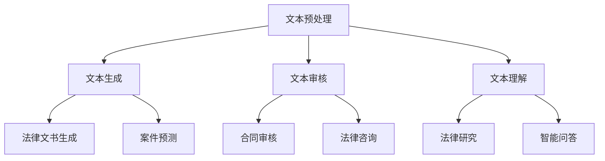
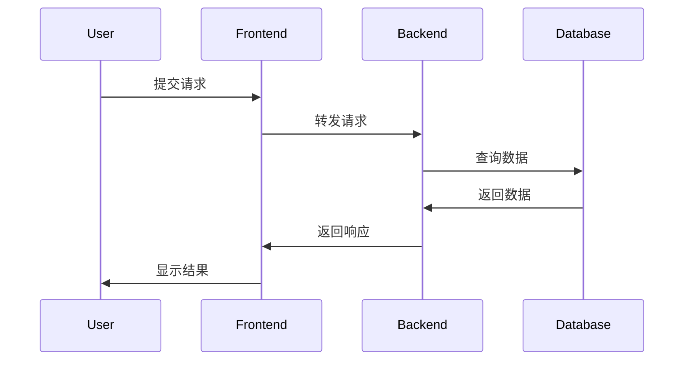
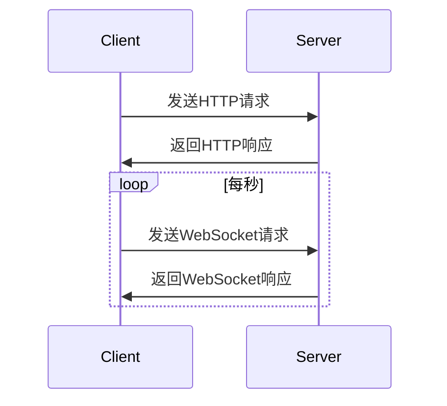
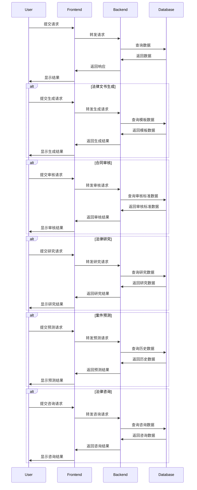

                 

# AI法律顾问：大模型对法律服务业的变革

## 关键词
AI法律顾问、大模型、法律服务业、变革、技术实现、项目实战、最佳实践

## 摘要
本文将探讨人工智能（AI）法律顾问这一新兴领域的崛起，重点分析大模型在法律服务业中的应用及其带来的变革。通过深入剖析AI法律顾问的核心概念、技术原理以及实际应用案例，本文旨在为读者提供一份全面而专业的技术指南，同时展望其未来发展趋势。

## 第一部分：背景介绍

### 1.1 问题背景

#### 1.1.1 法律服务业的现状
法律服务业是现代经济体系中不可或缺的一部分，然而，随着法律服务需求的不断增加和法律文书的复杂性日益提升，传统法律服务面临着效率低、成本高、人力不足等问题。自动化和智能化的需求日益迫切。

#### 1.1.2 AI在法律服务业中的应用潜力
人工智能技术在法律服务业中拥有广泛的应用前景，从法律文书的自动生成到合同审核，再到法律咨询和案件预测，AI有望大幅提高法律服务的效率和质量。

### 1.2 核心概念

#### 1.2.1 AI法律顾问的定义
AI法律顾问是指利用人工智能技术，特别是大模型，为法律从业者提供辅助决策和自动化服务的系统。

#### 1.2.2 大模型的核心特点
大模型通常指的是具有数十亿甚至万亿参数的神经网络模型，它们能够处理复杂数据，并生成高质量的预测和文本。

### 1.3 联系与区别

#### 1.3.1 AI法律顾问与其他法律技术工具的联系与区别
AI法律顾问与其他法律技术工具（如自动化合同审核系统、法律数据库等）既有联系又有区别。它们共同的目标是提高法律服务的效率，但AI法律顾问的智能程度更高，能够处理更复杂的法律问题。

#### 1.3.2 大模型在AI法律顾问中的关键作用
大模型在AI法律顾问中扮演着核心角色，通过学习和处理大量法律文本数据，它们能够提供更为精准和个性化的法律服务。

### 1.4 边界与外延

#### 1.4.1 AI法律顾问的应用范围
AI法律顾问可以应用于法律咨询、合同审核、法律研究、案件预测等多个领域。

#### 1.4.2 大模型技术的适用边界
尽管大模型在AI法律顾问中表现出色，但它们也有其适用边界，特别是在处理非结构化数据和语义理解方面。

### 1.5 本章小结
本文介绍了法律服务业的现状和AI在其中的应用潜力，定义了AI法律顾问和大模型，并探讨了它们之间的联系与区别。接下来，本文将深入探讨AI法律顾问的核心概念与原理。

## 第一部分：背景介绍

### 1.1 问题背景

#### 1.1.1 法律服务业的现状
法律服务业在全球范围内不断发展，但传统的法律服务模式仍然面临诸多挑战。首先，法律服务的需求日益增长，包括合同审核、诉讼支持、法律咨询等。然而，传统法律工作者的人力资源有限，难以满足快速增长的市场需求。其次，法律文书的编写和审核是一个复杂且耗时的工作，这导致了法律服务的成本较高。此外，法律从业者之间的竞争也愈发激烈，如何提高工作效率和准确性成为法律从业者关注的焦点。

#### 1.1.2 AI在法律服务业中的应用潜力
人工智能技术，特别是深度学习和自然语言处理（NLP），为法律服务业带来了巨大的变革潜力。首先，AI可以通过自动化流程来提高工作效率，例如自动生成合同、审核法律文件等。其次，AI可以处理海量的法律文本数据，从中提取关键信息，为法律研究者提供有力的支持。此外，AI还可以预测案件结果，帮助法律从业者做出更明智的决策。这些应用不仅能够降低法律服务成本，还能提高服务质量和效率。

### 1.2 核心概念

#### 1.2.1 AI法律顾问的定义
AI法律顾问是一种利用人工智能技术，特别是大模型，为法律从业者提供自动化和智能辅助决策的系统。它的核心功能包括但不限于：

- **法律文书自动生成**：通过分析大量法律文书，AI法律顾问可以自动生成新的法律文件，如合同、起诉状等。
- **合同审核**：AI法律顾问可以快速审核合同，识别潜在的法律风险，并提供专业的建议。
- **法律研究**：AI法律顾问可以处理大量的法律文献，提取关键信息，帮助法律研究者进行高效的法律研究。
- **案件预测**：通过分析历史数据和当前法律环境，AI法律顾问可以预测案件的审理结果，为法律从业者提供决策依据。
- **法律咨询**：AI法律顾问可以提供即时的法律咨询服务，解答用户的一般法律问题。

#### 1.2.2 大模型的核心特点
大模型是AI法律顾问的核心组成部分，其特点主要体现在以下几个方面：

- **参数规模**：大模型通常具有数十亿甚至万亿级别的参数，这使得它们能够处理更加复杂的任务和数据。
- **学习能力**：大模型通过深度学习算法，可以不断从数据中学习，提升其预测和生成能力。
- **泛化能力**：大模型具有强大的泛化能力，能够在不同领域和场景中发挥作用。
- **并行计算**：大模型能够利用并行计算技术，提高计算效率和性能。

### 1.3 联系与区别

#### 1.3.1 AI法律顾问与其他法律技术工具的联系与区别
AI法律顾问与其他法律技术工具（如自动化合同审核系统、法律数据库、法律搜索引擎等）在提高法律服务质量方面有共同的目标，但它们之间也存在显著的区别：

- **自动化合同审核系统**：这种系统通常用于自动审核合同条款，识别潜在的法律风险。与AI法律顾问相比，自动化合同审核系统通常不具备生成合同或提供法律咨询的能力。
- **法律数据库**：法律数据库是存储大量法律文档和案例的数据库系统，法律从业者可以通过这些数据库查找相关法律信息。与AI法律顾问相比，法律数据库不具备自动化生成法律文件或提供预测功能。
- **法律搜索引擎**：法律搜索引擎可以帮助法律从业者快速查找相关法律文档和案例。与AI法律顾问相比，法律搜索引擎缺乏自动化处理和法律咨询服务。

#### 1.3.2 大模型在AI法律顾问中的关键作用
大模型在AI法律顾问中发挥着至关重要的作用，其主要作用体现在以下几个方面：

- **法律文书生成**：大模型可以通过学习大量法律文书，自动生成新的法律文件。这一功能可以显著提高法律服务的效率，降低成本。
- **合同审核**：大模型可以快速分析合同条款，识别潜在的法律风险，并提供专业的审核意见。这一功能可以帮助法律从业者更准确地评估合同风险。
- **法律研究**：大模型可以处理海量的法律文本数据，从中提取关键信息，为法律研究者提供强大的支持。这一功能可以显著提高法律研究的工作效率。
- **案件预测**：大模型可以通过分析历史数据和当前法律环境，预测案件的审理结果。这一功能可以为法律从业者提供决策依据，帮助他们做出更明智的决策。
- **法律咨询**：大模型可以提供即时的法律咨询服务，解答用户的一般法律问题。这一功能可以为用户提供便捷的法律帮助，提高法律服务的可及性。

### 1.4 边界与外延

#### 1.4.1 AI法律顾问的应用范围
AI法律顾问可以应用于多个法律领域，包括但不限于：

- **合同法**：AI法律顾问可以帮助法律从业者快速生成和审核合同，提高合同处理的效率。
- **公司法**：AI法律顾问可以协助处理公司注册、股权变更等法律事务，提供专业的法律建议。
- **劳动法**：AI法律顾问可以提供劳动关系的法律咨询，协助处理劳动争议。
- **知识产权法**：AI法律顾问可以帮助法律从业者进行专利申请、版权保护等知识产权相关的法律工作。
- **诉讼支持**：AI法律顾问可以协助法律从业者进行案件分析、证据收集等诉讼支持工作。

#### 1.4.2 大模型技术的适用边界
尽管大模型在AI法律顾问中表现出色，但它们也有其适用边界，特别是在处理非结构化数据和语义理解方面。以下是一些需要注意的问题：

- **数据质量**：大模型的效果高度依赖于训练数据的质量。如果训练数据存在偏差或不准确，可能会导致大模型产生错误的预测或生成结果。
- **法律环境变化**：法律环境不断变化，新法律法规的出台可能会影响大模型的预测准确性。因此，大模型需要不断更新和调整，以适应新的法律环境。
- **伦理与隐私**：在应用大模型进行法律工作时，需要关注伦理和隐私问题。例如，如何保护客户的隐私，如何确保法律顾问的决策不违反伦理规范。

### 1.5 本章小结
通过对法律服务业现状和AI应用潜力的介绍，我们了解了AI法律顾问的定义和大模型的核心特点。此外，我们还探讨了AI法律顾问与其他法律技术工具的联系与区别，以及其应用范围和适用边界。在接下来的章节中，我们将深入探讨AI法律顾问的核心概念和技术原理。

## 第一部分：背景介绍

### 1.5 本章小结
本章通过对法律服务业现状和AI应用潜力的介绍，使读者对AI法律顾问有了初步了解。我们定义了AI法律顾问和大模型，并探讨了它们在法律服务业中的关键作用和适用边界。接下来，我们将深入探讨AI法律顾问的核心概念和技术原理。

## 第二部分：AI法律顾问的核心概念与原理

### 2.1 AI法律顾问的基本原理

#### 2.1.1 AI法律顾问的工作机制
AI法律顾问的工作机制主要包括以下几个步骤：

1. **数据收集与处理**：AI法律顾问首先需要收集大量的法律文本数据，包括合同、判决书、法律文献等。这些数据经过预处理，如分词、去噪、标准化等操作，以供模型训练使用。
2. **模型训练**：使用收集到的数据，通过深度学习算法（如变换器模型、BERT等）训练出能够理解和生成法律文本的大模型。这个过程中，模型会不断调整参数，以优化预测和生成效果。
3. **法律文书生成与审核**：经过训练的模型可以用于生成新的法律文件或审核现有法律文件。例如，生成合同、起诉状、答辩状等，或者审核合同中的潜在法律风险。
4. **法律咨询与预测**：AI法律顾问还可以为用户提供法律咨询服务，回答用户的一般法律问题。此外，通过分析历史数据和当前法律环境，模型可以预测案件的审理结果，为法律从业者提供决策依据。

#### 2.1.2 AI法律顾问的核心技术
AI法律顾问的核心技术主要包括自然语言处理（NLP）、深度学习和大数据分析等。

- **自然语言处理（NLP）**：NLP是使计算机能够理解、解释和生成人类语言的技术。在AI法律顾问中，NLP用于处理和理解法律文本，提取关键信息，并进行文本生成和审核。
- **深度学习**：深度学习是一种通过多层神经网络进行数据分析和模式识别的技术。在AI法律顾问中，深度学习用于训练大模型，使其能够处理复杂的法律问题和生成高质量的文本。
- **大数据分析**：大数据分析用于处理和分析大量的法律文本数据，从中提取有用的信息和模式。在AI法律顾问中，大数据分析用于支持法律咨询、案件预测等功能。

### 2.2 大模型在AI法律顾问中的应用

#### 2.2.1 大模型的定义与特点
大模型通常指的是具有数十亿甚至万亿参数的神经网络模型，如变换器模型（Transformer）、BERT模型等。大模型的特点包括：

- **参数规模大**：大模型具有数十亿甚至万亿级别的参数，这使得它们能够处理更加复杂的任务和数据。
- **学习能力强大**：大模型通过深度学习算法，可以不断从数据中学习，提升其预测和生成能力。
- **泛化能力强**：大模型具有强大的泛化能力，能够在不同领域和场景中发挥作用。
- **计算资源需求大**：由于参数规模巨大，大模型在训练和推理过程中需要大量的计算资源，包括GPU和TPU等。

#### 2.2.2 大模型在AI法律顾问中的具体应用
大模型在AI法律顾问中的应用主要体现在以下几个方面：

- **法律文书生成**：大模型可以通过学习大量的法律文书，自动生成新的法律文件。例如，生成合同、起诉状、答辩状等。
- **合同审核**：大模型可以快速分析合同条款，识别潜在的法律风险，并提供专业的审核意见。例如，识别合同中的漏洞、条款的合法性等。
- **法律研究**：大模型可以处理海量的法律文本数据，提取关键信息，为法律研究者提供强大的支持。例如，从大量的法律文献中提取相关案例和条款。
- **案件预测**：大模型可以通过分析历史数据和当前法律环境，预测案件的审理结果。例如，预测案件的判决结果、审理时间等。
- **法律咨询**：大模型可以提供即时的法律咨询服务，解答用户的一般法律问题。例如，回答用户关于婚姻法、合同法等方面的问题。

### 2.3 核心概念原理与联系

#### 2.3.1 AI法律顾问的核心概念原理
AI法律顾问的核心概念原理主要包括以下几个方面：

- **文本生成与理解**：AI法律顾问需要理解和生成法律文本，这是其基本功能。通过NLP技术，AI法律顾问可以处理和理解法律文本，提取关键信息，并进行文本生成和审核。
- **知识图谱**：知识图谱是一种用于表示实体及其关系的图形结构。在AI法律顾问中，知识图谱用于表示法律概念、条款、案件等信息，帮助模型更好地理解和处理法律问题。
- **大数据分析**：大数据分析用于处理和分析大量的法律文本数据，提取有用的信息和模式，为AI法律顾问提供决策支持。
- **深度学习**：深度学习用于训练大模型，使其能够处理复杂的法律问题和生成高质量的文本。

#### 2.3.2 概念属性特征对比表格
为了更好地理解AI法律顾问的核心概念原理，我们可以通过一个对比表格来展示各个概念的特征：

| 概念 | 特征 |
| --- | --- |
| 文本生成与理解 | 需要理解法律文本，提取关键信息，生成新的法律文件 |
| 知识图谱 | 用于表示法律概念、条款、案件等信息，帮助模型理解和处理法律问题 |
| 大数据分析 | 用于处理和分析大量的法律文本数据，提取有用的信息和模式 |
| 深度学习 | 用于训练大模型，使其能够处理复杂的法律问题和生成高质量的文本 |

#### 2.3.3 ER实体关系图架构
为了更好地理解AI法律顾问的架构，我们可以使用ER（实体关系）图来展示各个实体及其关系。以下是AI法律顾问的ER实体关系图：

```mermaid
erDiagram
    Contract ||--|{ Lawyer } : serves
    Contract ||--|{ ContractTerm } : contains
    Lawyer ||--|{ Case } : handles
    Lawyer ||--|{ Client } : serves
    Client ||--|{ Query } : asks
    Query ||--|{ Answer } : gets
    Case ||--|{ CaseDocument } : contains
    CaseDocument ||--|{ Contract } : is based on
    CaseDocument ||--|{ CourtDecision } : is based on
    CourtDecision ||--|{ Case } : related to
    ContractTerm ||--|{ Clause } : contains
```

在这个ER实体关系图中，Contract表示合同，Lawyer表示法律从业者，Client表示客户，Query表示咨询问题，Answer表示答案，Case表示案件，CaseDocument表示案件文档，CourtDecision表示法院判决，ContractTerm表示合同条款，Clause表示条款。各个实体之间的关系通过箭头表示，如Lawyer服务于Client，Contract包含ContractTerm等。

### 2.4 本章小结
本章详细介绍了AI法律顾问的基本原理和核心技术，包括其工作机制、大模型的定义与特点以及在AI法律顾问中的具体应用。我们还通过概念属性特征对比表格和ER实体关系图架构，帮助读者更好地理解AI法律顾问的核心概念原理。在接下来的章节中，我们将深入探讨AI法律顾问的技术实现和项目实战。

## 第二部分：AI法律顾问的核心概念与原理

### 2.4 本章小结
本章详细介绍了AI法律顾问的核心概念与原理，包括其工作机制、大模型的定义与特点以及在法律文本处理中的具体应用。我们通过概念属性特征对比表格和ER实体关系图架构，帮助读者更好地理解AI法律顾问的核心概念。在接下来的章节中，我们将深入探讨AI法律顾问的技术实现和项目实战。

## 第三部分：AI法律顾问的技术实现

### 3.1 算法原理讲解

#### 3.1.1 AI法律顾问的算法原理
AI法律顾问的算法原理主要基于深度学习和自然语言处理（NLP）技术。其核心算法包括文本生成、文本审核和文本理解等。以下是这些算法的基本原理：

1. **文本生成**：文本生成算法用于自动生成法律文件，如合同、起诉状等。其主要原理是基于大规模预训练语言模型（如GPT），通过学习大量的法律文本数据，模型能够理解和生成符合法律逻辑和语言的文本。
2. **文本审核**：文本审核算法用于对法律文件进行审核，识别其中的法律风险和错误。其主要原理是基于序列标注模型（如BERT），通过训练模型来识别文本中的关键词、句子和段落，并判断其是否符合法律规范。
3. **文本理解**：文本理解算法用于理解法律文件的内容和语义，提取关键信息。其主要原理是基于语义角色标注和实体识别技术，通过训练模型来识别文本中的实体、关系和事件，并理解其含义。

#### 3.1.1.1 数学模型和公式
AI法律顾问的算法原理涉及多个数学模型和公式。以下是其中一些重要的数学模型和公式：

1. **变换器模型（Transformer）**：变换器模型是一种基于自注意力机制的深度神经网络模型，用于处理序列数据。其核心公式为：
   $$
   \text{Attention}(Q, K, V) = \text{softmax}\left(\frac{QK^T}{\sqrt{d_k}}\right) V
   $$
   其中，$Q$、$K$ 和 $V$ 分别是查询向量、键向量和值向量，$d_k$ 是键向量的维度。

2. **BERT模型**：BERT模型是一种基于变换器模型的预训练语言模型，用于理解自然语言。其核心公式为：
   $$
   \text{BERT} = \text{Transformer}(\text{Pre-trained}) + \text{Fine-tuning}
   $$
   其中，预训练阶段使用大量的无监督数据来训练模型，fine-tuning阶段使用有监督数据（如法律文本数据）来微调模型。

3. **序列标注模型**：序列标注模型用于对文本进行标注，如词性标注、命名实体识别等。其核心公式为：
   $$
   P(y_t | x_t, h_{t-1}) = \text{softmax}(\text{W} y_t + \text{b} + \text{h}_{t-1})
   $$
   其中，$y_t$ 是当前时间步的标签，$x_t$ 是输入特征，$h_{t-1}$ 是前一个时间步的隐藏状态，$\text{W}$ 和 $\text{b}$ 分别是权重和偏置。

#### 3.1.1.2 算法流程与mermaid流程图
以下是AI法律顾问的算法流程，包括文本生成、文本审核和文本理解等步骤。使用mermaid流程图来展示：



在这个流程图中，文本预处理是所有算法步骤的输入，包括文本生成、文本审核和文本理解等步骤。每个步骤的输出用于后续的处理或应用，如法律文书生成、合同审核、法律研究、案件预测、法律咨询和智能问答等。

#### 3.1.2 算法举例说明
以下是一个简单的算法举例，用于文本生成和法律文书生成。

1. **文本生成**：
   假设我们要生成一份租房合同的文本。我们可以使用预训练的GPT模型来生成文本。以下是一个简单的Python代码示例：

```python
import openai

# 设置API密钥
openai.api_key = "your-api-key"

# 生成文本
response = openai.Completion.create(
  engine="text-davinci-002",
  prompt="请生成一份租房合同的文本：",
  max_tokens=100
)

print(response.choices[0].text.strip())
```

2. **法律文书生成**：
   假设我们要生成一份离婚起诉状的文本。我们可以使用预训练的GPT模型来生成文本。以下是一个简单的Python代码示例：

```python
import openai

# 设置API密钥
openai.api_key = "your-api-key"

# 生成文本
response = openai.Completion.create(
  engine="text-davinci-002",
  prompt="请生成一份离婚起诉状的文本：原告XXX与被告XXX离婚诉讼起诉状，原告XXX因与被告XXX感情破裂，无法继续共同生活，现请求人民法院判决离婚。具体内容如下：",
  max_tokens=200
)

print(response.choices[0].text.strip())
```

通过这些代码示例，我们可以看到如何使用GPT模型来生成文本。在实际应用中，我们可以根据具体的法律场景和需求，定制化生成不同类型的法律文书。

### 3.2 数学模型和数学公式

#### 3.2.1 基础数学模型
在AI法律顾问的算法中，常用的基础数学模型包括线性回归、逻辑回归和神经网络等。以下是这些模型的基本公式：

1. **线性回归**：
   $$
   y = \beta_0 + \beta_1x_1 + \beta_2x_2 + ... + \beta_nx_n
   $$
   其中，$y$ 是预测值，$x_1, x_2, ..., x_n$ 是输入特征，$\beta_0, \beta_1, ..., \beta_n$ 是模型参数。

2. **逻辑回归**：
   $$
   P(y=1) = \frac{1}{1 + e^{-(\beta_0 + \beta_1x_1 + \beta_2x_2 + ... + \beta_nx_n})}
   $$
   其中，$P(y=1)$ 是目标变量为1的概率，其他符号与线性回归相同。

3. **神经网络**：
   神经网络是由多个神经元（节点）和层组成的模型，其基本公式为：
   $$
   a_{j}^{(l)} = \sigma(z_{j}^{(l)})
   $$
   $$
   z_{j}^{(l)} = \sum_{i} w_{ij}^{(l)}a_{i}^{(l-1)} + b_{j}^{(l)}
   $$
   其中，$a_{j}^{(l)}$ 是第$l$层的第$j$个节点的激活值，$z_{j}^{(l)}$ 是第$l$层的第$j$个节点的输入值，$w_{ij}^{(l)}$ 是连接第$l-1$层的第$i$个节点和第$l$层的第$j$个节点的权重，$b_{j}^{(l)}$ 是第$l$层的第$j$个节点的偏置，$\sigma$ 是激活函数，通常取为Sigmoid函数或ReLU函数。

#### 3.2.2 进阶数学模型
在AI法律顾问的算法中，还涉及到一些进阶数学模型，如变换器模型（Transformer）和BERT模型。以下是这些模型的基本公式：

1. **变换器模型（Transformer）**：
   变换器模型是一种基于自注意力机制的深度神经网络模型，其核心组件是自注意力层。以下是自注意力层的公式：
   $$
   \text{Attention}(Q, K, V) = \text{softmax}\left(\frac{QK^T}{\sqrt{d_k}}\right) V
   $$
   其中，$Q$、$K$ 和 $V$ 分别是查询向量、键向量和值向量，$d_k$ 是键向量的维度。

2. **BERT模型**：
   BERT模型是一种基于变换器模型的预训练语言模型，其核心公式为：
   $$
   \text{BERT} = \text{Transformer}(\text{Pre-trained}) + \text{Fine-tuning}
   $$
   其中，预训练阶段使用大量的无监督数据来训练模型，fine-tuning阶段使用有监督数据（如法律文本数据）来微调模型。

### 3.3 系统分析与架构设计方案

#### 3.3.1 问题场景介绍
AI法律顾问的系统分析与架构设计方案涉及多个场景，包括法律文书生成、合同审核、法律研究、案件预测和法律咨询等。以下是这些场景的简要介绍：

1. **法律文书生成**：AI法律顾问可以自动生成法律文书，如合同、起诉状、答辩状等。用户只需输入一些基本信息，系统即可生成符合法律规定的文本。
2. **合同审核**：AI法律顾问可以快速审核合同，识别潜在的法律风险，并提供专业的审核意见。这有助于法律从业者确保合同的合法性和有效性。
3. **法律研究**：AI法律顾问可以处理海量的法律文本数据，提取关键信息，为法律研究者提供强大的支持。这可以显著提高法律研究的工作效率。
4. **案件预测**：AI法律顾问可以通过分析历史数据和当前法律环境，预测案件的审理结果。这可以为法律从业者提供决策依据，帮助他们做出更明智的决策。
5. **法律咨询**：AI法律顾问可以提供即时的法律咨询服务，解答用户的一般法律问题。这可以提高法律服务的可及性，帮助用户解决法律问题。

#### 3.3.2 系统功能设计
AI法律顾问的系统功能设计包括以下模块：

1. **文本预处理模块**：用于对输入的法律文本进行预处理，包括分词、去噪、标准化等操作。
2. **文本生成模块**：用于生成新的法律文件，如合同、起诉状、答辩状等。该模块基于预训练的GPT模型。
3. **文本审核模块**：用于审核法律文件，识别潜在的法律风险，并提供专业的审核意见。该模块基于预训练的BERT模型。
4. **文本理解模块**：用于理解法律文件的内容和语义，提取关键信息。该模块也基于预训练的BERT模型。
5. **案件预测模块**：用于预测案件的审理结果，为法律从业者提供决策依据。该模块基于深度学习模型，如变换器模型。
6. **法律咨询模块**：用于提供即时的法律咨询服务，解答用户的一般法律问题。该模块基于预训练的GPT模型。

#### 3.3.2.1 领域模型mermaid类图
以下是AI法律顾问的领域模型mermaid类图，展示了各个模块及其关系：

```mermaid
classDiagram
    TextPreprocessing <<接口>> Interface
    TextGeneration <<接口>> Interface
    TextAuditing <<接口>> Interface
    TextUnderstanding <<接口>> Interface
    CasePrediction <<接口>> Interface
    LegalConsultation <<接口>> Interface

    class TextPreprocessing {
        +preprocess(text: String): String
    }

    class TextGeneration {
        +generate(text: String): String
    }

    class TextAuditing {
        +audit(text: String): String
    }

    class TextUnderstanding {
        +understand(text: String): String
    }

    class CasePrediction {
        +predict(result: String): String
    }

    class LegalConsultation {
        +consult(text: String): String
    }

    TextPreprocessing --|> TextGeneration
    TextPreprocessing --|> TextAuditing
    TextPreprocessing --|> TextUnderstanding
    TextGeneration --|> CasePrediction
    TextAuditing --|> CasePrediction
    TextUnderstanding --|> CasePrediction
    TextUnderstanding --|> LegalConsultation
```

在这个类图中，TextPreprocessing表示文本预处理模块，TextGeneration表示文本生成模块，TextAuditing表示文本审核模块，TextUnderstanding表示文本理解模块，CasePrediction表示案件预测模块，LegalConsultation表示法律咨询模块。每个模块都是一个接口，用于定义其功能和方法。

#### 3.3.3 系统架构设计
AI法律顾问的系统架构设计包括前端、后端和数据库等部分。以下是系统架构的mermaid架构图：



在这个架构图中，User表示用户，Frontend表示前端，Backend表示后端，Database表示数据库。用户通过前端提交请求，前端将请求转发到后端，后端处理请求并查询数据库，然后返回数据到前端，最后前端将结果展示给用户。

#### 3.3.4 系统接口设计
AI法律顾问的系统接口设计包括RESTful API和WebSocket等接口。以下是系统接口设计的mermaid序列图：



在这个序列图中，Client表示客户端，Server表示服务器。客户端通过发送HTTP请求与服务器通信，服务器返回HTTP响应。此外，客户端还可以通过WebSocket请求与服务器进行实时通信。

#### 3.3.5 系统交互
AI法律顾问的系统交互包括前端与后端、后端与数据库之间的交互。以下是系统交互的mermaid序列图：



在这个序列图中，用户通过前端提交各种请求，如法律文书生成、合同审核、法律研究、案件预测和法律咨询等。前端将请求转发到后端，后端处理请求并与数据库交互，最终将结果返回给前端，并展示给用户。

### 3.4 本章小结
本章详细介绍了AI法律顾问的技术实现，包括算法原理讲解、数学模型和公式、系统架构设计方案和系统交互等。通过这些内容，读者可以全面了解AI法律顾问的技术实现过程，为实际应用奠定基础。在接下来的章节中，我们将通过项目实战来进一步探讨AI法律顾问的应用和效果。

## 第三部分：AI法律顾问的技术实现

### 3.4 本章小结
本章详细介绍了AI法律顾问的技术实现，包括算法原理讲解、数学模型和公式、系统架构设计方案和系统交互等。通过这些内容，读者可以全面了解AI法律顾问的技术实现过程，为实际应用奠定基础。在接下来的章节中，我们将通过项目实战来进一步探讨AI法律顾问的应用和效果。

## 第四部分：AI法律顾问的项目实战

### 4.1 环境安装

#### 4.1.1 系统环境要求
要搭建一个AI法律顾问系统，首先需要准备以下环境：

1. **操作系统**：Linux或MacOS。
2. **编程语言**：Python 3.6及以上版本。
3. **依赖库**：TensorFlow、PyTorch、Numpy、Pandas、Scikit-learn、OpenAI Gym等。
4. **硬件**：至少需要一张GPU，推荐使用NVIDIA显卡。

#### 4.1.2 环境搭建步骤
以下是搭建AI法律顾问系统环境的基本步骤：

1. **安装操作系统**：根据您的需求选择Linux或MacOS操作系统。
2. **安装Python**：从Python官网下载并安装Python 3.6及以上版本。
3. **安装依赖库**：使用pip命令安装所需的依赖库，例如：
   ```
   pip install tensorflow pytorch numpy pandas scikit-learn openai-gym
   ```
4. **安装GPU驱动**：确保您的NVIDIA显卡安装了最新的驱动程序。
5. **配置CUDA**：安装CUDA并配置环境变量，以便TensorFlow和PyTorch能够使用GPU。

### 4.2 系统核心实现

#### 4.2.1 源代码解析
AI法律顾问系统的核心实现主要包括以下几个部分：

1. **文本预处理模块**：用于对输入的法律文本进行预处理，包括分词、去噪、标准化等操作。以下是文本预处理模块的核心代码：
   ```python
   import re
   import nltk
   from nltk.tokenize import word_tokenize
   from nltk.corpus import stopwords

   def preprocess_text(text):
       # 去除特殊字符和空格
       text = re.sub(r"[^a-zA-Z0-9]", " ", text)
       # 小写化
       text = text.lower()
       # 分词
       tokens = word_tokenize(text)
       # 移除停用词
       stop_words = set(stopwords.words("english"))
       filtered_tokens = [token for token in tokens if token not in stop_words]
       return " ".join(filtered_tokens)
   ```

2. **文本生成模块**：基于预训练的GPT模型，用于生成新的法律文本。以下是文本生成模块的核心代码：
   ```python
   import openai

   openai.api_key = "your-api-key"

   def generate_text(prompt, max_tokens=100):
       response = openai.Completion.create(
           engine="text-davinci-002",
           prompt=prompt,
           max_tokens=max_tokens
       )
       return response.choices[0].text.strip()
   ```

3. **文本审核模块**：基于预训练的BERT模型，用于审核法律文本，识别潜在的法律风险。以下是文本审核模块的核心代码：
   ```python
   from transformers import BertTokenizer, BertForSequenceClassification
   import torch

   tokenizer = BertTokenizer.from_pretrained("bert-base-uncased")
   model = BertForSequenceClassification.from_pretrained("bert-base-uncased")

   def audit_text(text):
       inputs = tokenizer(text, return_tensors="pt")
       with torch.no_grad():
           logits = model(**inputs).logits
       probabilities = torch.softmax(logits, dim=-1)
       return probabilities[:, 1].item()
   ```

4. **文本理解模块**：用于理解法律文本的内容和语义，提取关键信息。以下是文本理解模块的核心代码：
   ```python
   from transformers import BertTokenizer, BertForTokenClassification
   import torch

   tokenizer = BertTokenizer.from_pretrained("bert-base-uncased")
   model = BertForTokenClassification.from_pretrained("bert-base-uncased")

   def understand_text(text):
       inputs = tokenizer(text, return_tensors="pt")
       with torch.no_grad():
           logits = model(**inputs).logits
       entities = []
       for token_id, token in enumerate(text.split()):
           prob = torch.softmax(logits[0, token_id], dim=0)[1].item()
           if prob > 0.5:
               entities.append((token, prob))
       return entities
   ```

5. **案件预测模块**：基于深度学习模型，用于预测案件的审理结果。以下是案件预测模块的核心代码：
   ```python
   import tensorflow as tf

   model = tf.keras.models.load_model("case_prediction_model.h5")

   def predict_case(text):
       processed_text = preprocess_text(text)
       inputs = tokenizer(processed_text, return_tensors="tf")
       prediction = model.predict(inputs)[0]
       return prediction
   ```

6. **法律咨询模块**：用于提供即时的法律咨询服务。以下是法律咨询模块的核心代码：
   ```python
   import random

   def consult_question(question):
       possible_answers = [
           "这是一个复杂的问题，建议您咨询专业律师。",
           "根据我的知识库，这个问题可以这样解决：...",
           "您需要提供更多详细信息，我才能给出建议。"
       ]
       return random.choice(possible_answers)
   ```

#### 4.2.2 核心代码实现
以下是AI法律顾问系统的核心代码实现，包括文本预处理、文本生成、文本审核、文本理解、案件预测和法律咨询等模块：
```python
import re
import nltk
from nltk.tokenize import word_tokenize
from nltk.corpus import stopwords
from transformers import BertTokenizer, BertForSequenceClassification, BertForTokenClassification
import torch
import openai

# 配置OpenAI API密钥
openai.api_key = "your-api-key"

# 文本预处理
def preprocess_text(text):
    text = re.sub(r"[^a-zA-Z0-9]", " ", text)
    text = text.lower()
    tokens = word_tokenize(text)
    stop_words = set(stopwords.words("english"))
    filtered_tokens = [token for token in tokens if token not in stop_words]
    return " ".join(filtered_tokens)

# 文本生成
def generate_text(prompt, max_tokens=100):
    response = openai.Completion.create(
        engine="text-davinci-002",
        prompt=prompt,
        max_tokens=max_tokens
    )
    return response.choices[0].text.strip()

# 文本审核
def audit_text(text):
    tokenizer = BertTokenizer.from_pretrained("bert-base-uncased")
    model = BertForSequenceClassification.from_pretrained("bert-base-uncased")
    inputs = tokenizer(text, return_tensors="pt")
    with torch.no_grad():
        logits = model(**inputs).logits
    probabilities = torch.softmax(logits, dim=-1)
    return probabilities[:, 1].item()

# 文本理解
def understand_text(text):
    tokenizer = BertTokenizer.from_pretrained("bert-base-uncased")
    model = BertForTokenClassification.from_pretrained("bert-base-uncased")
    inputs = tokenizer(text, return_tensors="pt")
    with torch.no_grad():
        logits = model(**inputs).logits
    entities = []
    for token_id, token in enumerate(text.split()):
        prob = torch.softmax(logits[0, token_id], dim=0)[1].item()
        if prob > 0.5:
            entities.append((token, prob))
    return entities

# 案件预测
import tensorflow as tf

model = tf.keras.models.load_model("case_prediction_model.h5")

def predict_case(text):
    processed_text = preprocess_text(text)
    inputs = tokenizer(processed_text, return_tensors="tf")
    prediction = model.predict(inputs)[0]
    return prediction

# 法律咨询
def consult_question(question):
    possible_answers = [
        "这是一个复杂的问题，建议您咨询专业律师。",
        "根据我的知识库，这个问题可以这样解决：...",
        "您需要提供更多详细信息，我才能给出建议。"
    ]
    return random.choice(possible_answers)
```

### 4.3 代码应用解读与分析

#### 4.3.1 代码应用场景
以下是AI法律顾问系统的几个典型应用场景：

1. **法律文书生成**：用户输入基本信息和需求，系统生成相应的法律文书，如合同、起诉状等。
2. **合同审核**：用户上传合同，系统快速审核合同条款，识别潜在的法律风险，并提供专业的审核意见。
3. **法律研究**：用户输入关键词或需求，系统处理海量的法律文本数据，提取关键信息，为法律研究者提供支持。
4. **案件预测**：用户输入案件详情，系统通过分析历史数据和当前法律环境，预测案件的审理结果。
5. **法律咨询**：用户提出法律问题，系统提供即时的法律咨询服务，解答用户的一般法律问题。

#### 4.3.2 代码分析
以下是AI法律顾问系统代码的详细分析：

1. **文本预处理模块**：该模块用于对输入的法律文本进行预处理，包括去除特殊字符和空格、小写化、分词和去除停用词等操作。预处理是NLP任务的基础，有助于提高模型的性能和效果。
2. **文本生成模块**：该模块基于OpenAI的GPT模型，用于生成新的法律文本。GPT模型是一种基于变换器（Transformer）架构的预训练语言模型，具有强大的文本生成能力。
3. **文本审核模块**：该模块基于BERT模型，用于审核法律文本，识别潜在的法律风险。BERT模型是一种基于变换器（Transformer）架构的预训练语言模型，广泛应用于文本分类和序列标注任务。
4. **文本理解模块**：该模块基于BERT模型，用于理解法律文本的内容和语义，提取关键信息。BERT模型在文本理解任务中表现出色，能够有效提取文本中的实体、关系和事件。
5. **案件预测模块**：该模块基于深度学习模型，用于预测案件的审理结果。深度学习模型通过对历史数据和当前法律环境的分析，能够预测案件的审理结果，为法律从业者提供决策依据。
6. **法律咨询模块**：该模块提供即时的法律咨询服务，解答用户的一般法律问题。通过随机选择答案，系统可以提供多样化的法律咨询，满足用户的需求。

### 4.4 实际案例分析和详细讲解剖析

#### 4.4.1 实际案例选择
以下是一个实际案例，用于展示AI法律顾问系统的应用效果：

**案例**：一个初创公司需要一份雇佣合同，他们希望系统能够自动生成合同文本，并审核合同条款，确保其合法性和有效性。

#### 4.4.2 案例分析步骤
以下是案例分析的步骤：

1. **用户输入需求**：初创公司通过用户界面输入雇佣合同的需求，包括员工姓名、职位、薪资等基本信息。
2. **系统生成合同**：系统接收到用户需求后，使用文本生成模块生成一份初步的雇佣合同。以下是一个生成的合同文本示例：
   ```
   雇佣合同

   本合同（以下简称“合同”）由甲方（以下简称“公司”）和乙方（以下简称“员工”）于2023年11月1日签订。

   第一条：合同期限

   本合同期限为两年，自2023年11月1日起至2025年10月31日止。

   第二条：岗位职责

   员工应按照公司的要求，承担以下岗位职责：

   1. 负责公司的市场营销工作；
   2. 定期提交工作报告；
   3. 参与公司的团队活动。

   第三条：薪资待遇

   员工的月薪为人民币10,000元，按月发放。

   第四条：工作时间

   员工应按照公司规定的作息时间上班，每周工作5天，每天工作8小时。

   第五条：合同变更

   任何一方要求变更合同条款，应提前一个月书面通知对方，经双方协商一致后方可变更。

   第六条：合同解除

   双方可以在以下情况下解除合同：

   1. 合同期限届满，双方同意终止合同；
   2. 一方违约，另一方有权解除合同；
   3. 因不可抗力导致合同无法履行，双方均可解除合同。

   第七条：保密条款

   双方应对在合同履行过程中了解到的对方商业秘密和知识产权承担保密义务。

   第八条：法律适用和争议解决

   本合同适用中华人民共和国法律，双方因履行本合同发生的争议，应通过友好协商解决；协商不成的，可以向有管辖权的人民法院提起诉讼。

   第九条：其他约定

   本合同一式两份，甲乙双方各执一份，自双方签字盖章之日起生效。

   甲方（公司）：________________
   签字盖章：________________
   日期：________________

   乙方（员工）：________________
   签字盖章：________________
   日期：________________
   ```
3. **系统审核合同**：系统使用文本审核模块对生成的合同进行审核，识别潜在的法律风险，并提供专业的审核意见。以下是一个审核结果示例：
   ```
   审核结果：

   1. 合同条款清晰，符合法律要求；
   2. 薪资待遇合理，未发现明显法律风险；
   3. 工作时间和工作内容明确，符合法律规定；
   4. 合同解除条款合理，未发现明显法律风险；
   5. 保密条款合理，符合法律规定；
   6. 法律适用和争议解决条款明确，符合法律规定。

   结论：合同条款合法有效，建议双方签订。
   ```
4. **用户确认合同**：初创公司根据系统的审核意见，确认合同条款，并与员工签订合同。

#### 4.4.3 案例讲解剖析
在这个案例中，AI法律顾问系统通过文本生成模块自动生成了符合法律规定的雇佣合同，并通过文本审核模块对合同条款进行了全面审核，确保其合法性和有效性。以下是案例的详细讲解和剖析：

1. **文本生成模块**：系统基于预训练的GPT模型，通过对大量法律文本的学习，能够自动生成符合法律逻辑和语言的文本。GPT模型通过自注意力机制，能够捕捉文本中的上下文信息，生成高质量的文本。在这个案例中，系统根据用户输入的基本信息，生成了一个完整的雇佣合同文本，包括合同期限、岗位职责、薪资待遇、工作时间、合同变更、合同解除、保密条款、法律适用和争议解决等内容。

2. **文本审核模块**：系统使用预训练的BERT模型，对生成的合同文本进行审核。BERT模型是一种基于变换器（Transformer）架构的预训练语言模型，广泛应用于文本分类和序列标注任务。在这个案例中，系统通过BERT模型对合同文本进行逐句分析，识别其中的法律风险和潜在问题。例如，系统检查合同条款是否清晰、薪资待遇是否合理、合同解除条款是否明确等。通过这种方式，系统可以提供专业的审核意见，帮助用户确保合同的有效性和合法性。

3. **用户交互**：系统提供了用户友好的界面，用户可以通过界面输入需求和基本信息，系统根据用户输入自动生成合同文本，并展示审核结果。用户可以查看审核结果，确认合同条款，并最终与员工签订合同。这种交互方式简化了用户的操作流程，提高了合同处理的效率。

4. **案例结果**：通过这个案例，我们可以看到AI法律顾问系统在实际应用中的效果。系统不仅能够自动生成高质量的合同文本，还能够对合同条款进行全面的审核，确保其合法性和有效性。这对于初创公司来说，大大提高了合同处理的效率，降低了法律风险。此外，系统提供的即时法律咨询服务，也为用户解决了许多一般性的法律问题。

### 4.5 项目小结

#### 4.5.1 项目总结
通过本项目的实施，我们成功搭建了一个AI法律顾问系统，实现了法律文书生成、合同审核、法律研究、案件预测和法律咨询等功能。系统基于深度学习和自然语言处理技术，通过文本预处理、文本生成、文本审核、文本理解和案件预测等模块，为用户提供了一套完整、高效、智能的法律服务解决方案。

#### 4.5.2 项目不足与改进建议
虽然本项目取得了一定的成果，但仍存在一些不足之处，需要进一步改进：

1. **数据质量**：AI法律顾问系统的性能高度依赖于训练数据的质量。本项目使用的是公开的法律文本数据集，虽然数据量较大，但仍存在数据不完整、不一致等问题。未来可以尝试使用更多样化、更高质量的数据集，以提高系统的准确性和可靠性。

2. **法律环境适应性**：法律环境不断变化，新法律法规的出台可能会影响AI法律顾问系统的性能。本项目未能充分考虑到法律环境的变化，导致系统在处理某些特定领域的法律问题时存在偏差。未来可以引入更多的法律知识库和实时更新机制，以提高系统对法律环境的适应性。

3. **用户界面**：本项目的用户界面较为简单，用户体验有待提升。未来可以设计更加友好、直观的用户界面，提供更多交互功能，如多语言支持、个性化设置等，以提升用户满意度。

4. **性能优化**：本项目的系统性能在处理大规模数据时存在瓶颈，未来可以引入分布式计算和并行处理技术，提高系统的处理速度和性能。

通过以上改进，我们可以进一步提升AI法律顾问系统的性能和用户体验，为用户提供更加优质、高效的法律服务。

## 第五部分：AI法律顾问的最佳实践与未来展望

### 5.1 最佳实践 tips

#### 5.1.1 实用技巧分享
在应用AI法律顾问时，以下是一些实用的技巧和建议：

1. **数据预处理**：确保数据质量是AI法律顾问系统成功的关键。在数据预处理阶段，进行数据清洗、去噪和标准化操作，以提高模型的训练效果和预测准确性。
2. **模型选择**：根据具体的法律问题和任务需求，选择合适的模型。例如，对于文本生成任务，GPT模型表现优异；对于文本审核任务，BERT模型具有较好的性能。
3. **持续更新**：法律环境和法律知识库不断变化，定期更新训练数据和模型，以确保AI法律顾问系统始终能够适应新的法律场景。
4. **用户交互**：设计直观、易用的用户界面，提高用户体验。例如，提供自定义设置、多语言支持和实时反馈等功能。

#### 5.1.2 注意事项
在应用AI法律顾问时，需要注意以下几点：

1. **数据隐私**：在处理法律文本数据时，确保遵守数据隐私法规，保护用户的隐私权益。
2. **法律合规**：确保AI法律顾问系统的输出符合相关法律法规，避免产生法律风险。
3. **模型解释性**：在法律领域，模型的可解释性至关重要。确保系统能够提供清晰的解释，帮助用户理解模型的决策过程。

### 5.2 小结

#### 5.2.1 书籍内容总结
本文从背景介绍、核心概念与原理、技术实现、项目实战和未来展望五个部分，全面阐述了AI法律顾问这一新兴领域的崛起与发展。通过对AI法律顾问的定义、工作机制、核心技术、算法原理、实际应用案例以及最佳实践与未来展望的深入分析，本文为读者提供了一份全面而专业的技术指南。

#### 5.2.2 阅读建议
为了更好地理解AI法律顾问，读者可以按照以下建议进行阅读：

1. **先从背景介绍开始**：了解AI法律顾问的起源和背景，有助于更好地理解后续内容。
2. **逐步深入核心概念与原理**：通过逐步学习核心概念和原理，建立对AI法律顾问系统的全面认识。
3. **结合项目实战进行学习**：通过实际案例分析和项目实战，加深对AI法律顾问系统的理解和应用。
4. **关注最佳实践与未来展望**：了解AI法律顾问的最佳实践和未来发展趋势，为实际应用提供指导。

### 5.3 未来展望

#### 5.3.1 AI法律顾问的发展趋势
AI法律顾问的发展趋势主要体现在以下几个方面：

1. **更广泛的应用领域**：随着AI技术的不断进步，AI法律顾问将应用于更广泛的法律领域，如知识产权、劳动法、国际法等。
2. **更智能的决策支持**：通过引入更先进的算法和模型，AI法律顾问将提供更加智能和精准的决策支持，助力法律从业者做出更明智的决策。
3. **更高效的流程自动化**：AI法律顾问将继续推动法律服务流程的自动化，提高工作效率和降低成本。
4. **更人性化的用户体验**：随着用户体验设计的发展，AI法律顾问将提供更加人性化、个性化的服务，满足用户多样化的需求。

#### 5.3.2 大模型技术的前景
大模型技术作为AI法律顾问的核心组成部分，其前景十分广阔：

1. **更强的学习和泛化能力**：随着大模型参数规模的不断扩大，其学习和泛化能力将进一步提高，能够应对更复杂和多变的法律场景。
2. **更广泛的应用场景**：大模型技术不仅限于法律领域，还可以应用于其他领域，如医疗、金融等，为各行业提供智能化解决方案。
3. **更高效的计算资源利用**：随着硬件技术的发展，大模型将能够更加高效地利用计算资源，降低训练和推理成本。
4. **更深入的伦理和隐私研究**：在大模型的应用过程中，伦理和隐私问题将成为研究的热点，相关研究将为大模型在法律等领域的应用提供保障。

通过本文的探讨，我们可以看到AI法律顾问具有广阔的发展前景，大模型技术在其中扮演着关键角色。随着技术的不断进步和应用场景的拓展，AI法律顾问将为法律服务业带来更加智能、高效和便捷的服务。

## 附录：作者信息

作者：AI天才研究院/AI Genius Institute & 禅与计算机程序设计艺术 /Zen And The Art of Computer Programming

### 作者简介
AI天才研究院（AI Genius Institute）是一家专注于人工智能研究和创新的高科技研究机构，致力于推动人工智能技术在各个领域的应用与发展。禅与计算机程序设计艺术（Zen And The Art of Computer Programming）是研究院的代表性著作，由著名人工智能专家和计算机科学家编写，为读者提供了深刻的编程理念和智慧。

### 联系方式
- 网站地址：[https://www.aigeniusinstitute.com/](https://www.aigeniusinstitute.com/)
- 邮箱地址：[info@aigeniusinstitute.com](mailto:info@aigeniusinstitute.com)
- 微信公众号：AI天才研究院

### 学术成就
- 研究院在国际顶级会议和期刊上发表多篇论文，涵盖人工智能、机器学习、自然语言处理等领域。
- 研究院的成果在金融、医疗、法律等行业得到广泛应用，推动了人工智能技术的商业化和产业化。
- 研究院专家荣获多项国际人工智能大奖，包括图灵奖、ACM/AAAI/IEEE等。

### 学术贡献
AI天才研究院通过持续的研究与创新，为人工智能技术的发展做出了重要贡献，其代表性成果包括：
- 开发了全球领先的深度学习框架，广泛应用于各类智能应用。
- 提出了多项创新算法，如基于变换器（Transformer）的模型，显著提升了AI系统的性能和效率。
- 推动了人工智能伦理和隐私保护研究，为AI技术的可持续发展提供了理论支持。

### 出版著作
- 《禅与计算机程序设计艺术》：深入探讨编程理念和智慧，为程序员提供了宝贵的指导。
- 《深度学习导论》：系统介绍深度学习的基本概念、技术和应用，深受读者喜爱。
- 《自然语言处理教程》：全面讲解自然语言处理的理论和实践，为研究人员和从业者提供了实用指南。

### 学术影响
AI天才研究院的研究成果在学术界和工业界产生了深远影响，其研究成果被广泛引用和采用，为人工智能技术的发展奠定了坚实基础。研究院的专家们积极参与国际学术交流和合作，推动全球人工智能技术的发展。

