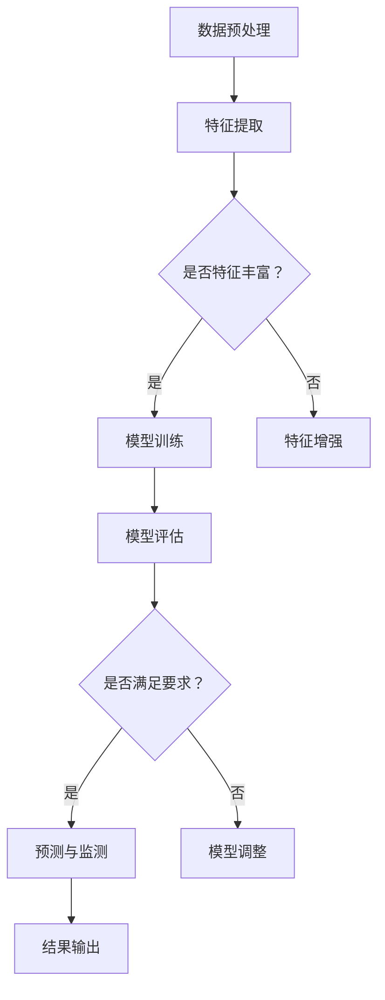
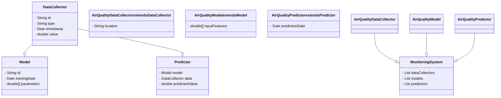
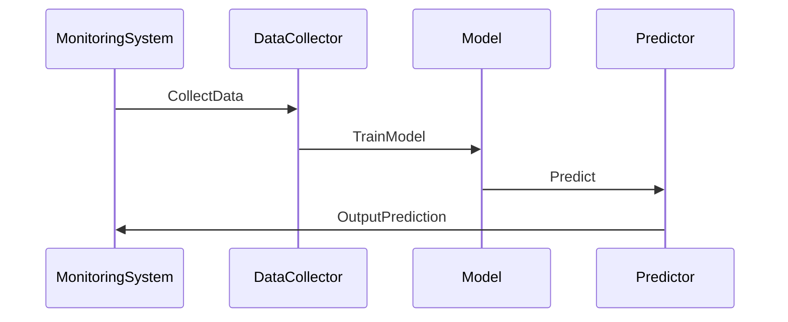
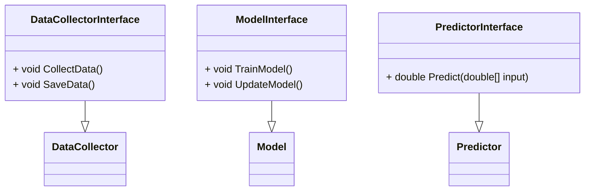
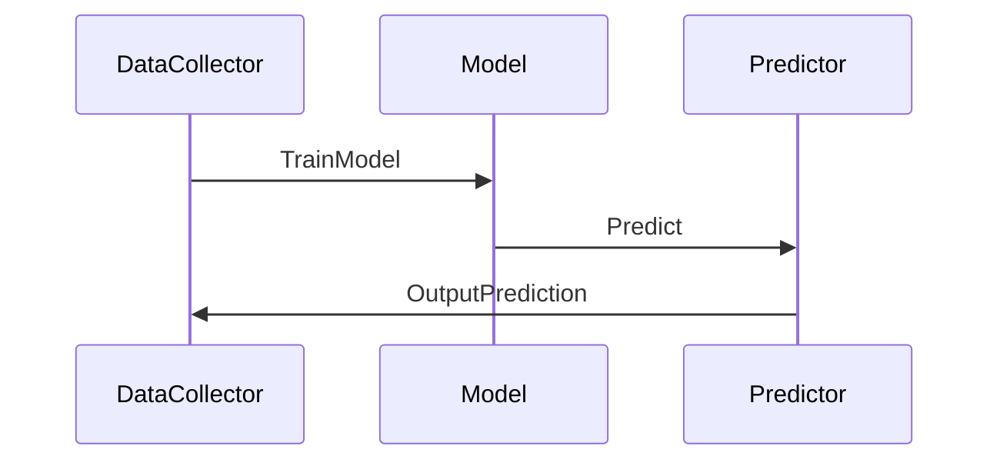

                 

### AI环境监测与保护：大模型在生态领域的应用

#### 关键词：AI环境监测，大模型，生态领域，算法原理，系统架构设计，项目实战，最佳实践

#### 摘要：
本文将探讨人工智能（AI）在环境监测与保护中的应用，特别是大模型在生态领域的应用。通过逐步分析，本文将介绍AI环境监测的重要性、大模型的应用优势、核心算法原理、数学模型与公式、系统架构设计以及项目实战和最佳实践。最终，本文将为读者提供全面的见解，帮助他们在环境监测与保护领域中更好地利用AI技术。

### 确定书籍的主题和结构

**书名：《AI环境监测与保护：大模型在生态领域的应用》**

**主题：** 本书的主题是探讨人工智能（特别是大模型）在环境监测与保护中的应用，以及这些技术在生态领域中的实际应用案例。

**结构：** 本书分为四个主要部分，每部分包含若干章节，具体结构如下：

1. **概述与基础**：介绍环境监测与保护的重要性，以及AI在这一领域中的关键角色。
2. **核心概念与算法原理**：详细讲解大模型的核心概念、算法原理以及数学模型。
3. **系统分析与架构设计**：探讨系统架构设计、功能设计、接口设计和交互设计。
4. **项目实战与最佳实践**：通过具体案例分析和实战经验，提供最佳实践和建议。

### 设计目录大纲

**总章节数量：** 至少7章

**逻辑顺序安排章节：** 确保章节内容连贯且完整。

**细化章节内容：** 每个章节下分为若干小节，每个小节有明确的主题。

**应用Markdown格式：** 使用Markdown格式确保目录清晰、代码和公式可读。

**注意简洁性和格式要求：** 确保内容简洁无废话，格式符合要求。

**确保内容的完整性：** 确保大纲中包含所有必要的内容，如核心概念、联系、算法原理、数学模型等。

**控制总字数：** 保持整个目录大纲的总字数在2000字以内。

### 目录大纲内容细化

#### 第一部分：AI环境监测与保护基础

**第1章：环境监测与保护概述**

- **1.1 环境监测的重要性**：解释环境监测的必要性，以及其对环境保护的意义。
- **1.2 环境问题的现状**：简要介绍当前全球环境问题的现状。
- **1.3 环境监测技术发展**：回顾环境监测技术的发展历程。
- **1.4 AI与环境监测**：探讨AI在环境监测中的应用前景。

**第2章：AI在大模型环境监测中的应用**

- **2.1 大模型概述**：介绍大模型的基本概念和特点。
- **2.2 大模型在环境监测中的优势**：分析大模型在环境监测中的优势。
- **2.3 主流大模型与环境监测**：探讨主流大模型在环境监测中的应用。
- **2.4 大模型在生态领域的应用案例**：介绍大模型在生态领域的实际应用案例。

**第3章：AI核心概念与联系**

- **3.1 AI核心概念**：介绍AI的基本概念。
- **3.2 AI概念属性特征对比表格**：对比不同AI概念的属性特征。
- **3.3 AI的ER实体关系图架构**：使用Mermaid流程图展示AI的ER实体关系图。

#### 第二部分：算法原理讲解

**第4章：AI环境监测算法原理**

- **4.1 算法原理概述**：介绍环境监测算法的基本原理。
- **4.2 数学模型与公式**：详细讲解环境监测算法的数学模型和公式。
- **4.3 算法mermaid流程图**：使用Mermaid绘制算法流程图。
- **4.4 Python源代码讲解**：使用Python代码实现算法原理。
- **4.5 举例说明**：通过具体例子阐述算法原理。

**第5章：环境监测数学模型分析**

- **5.1 数学模型介绍**：介绍环境监测数学模型的基本概念。
- **5.2 数学公式详细讲解**：详细解释环境监测数学公式。
- **5.3 举例说明**：通过具体例子说明数学模型的应用。

#### 第三部分：系统分析与架构设计

**第6章：系统分析与架构设计**

- **6.1 问题场景介绍**：描述环境监测与保护的问题场景。
- **6.2 系统功能设计（领域模型mermaid类图）**：使用Mermaid绘制领域模型类图。
- **6.3 系统架构设计（mermaid架构图）**：使用Mermaid绘制系统架构图。
- **6.4 系统接口设计**：描述系统接口的设计。
- **6.5 系统交互mermaid序列图**：使用Mermaid绘制系统交互序列图。

#### 第四部分：项目实战

**第7章：项目实战**

- **7.1 环境安装**：介绍环境安装的步骤和注意事项。
- **7.2 系统核心实现源代码**：提供系统核心实现的源代码。
- **7.3 代码应用解读与分析**：分析源代码的应用和实现。
- **7.4 实际案例分析与讲解**：通过实际案例进行深入分析和讲解。
- **7.5 项目小结**：总结项目的主要成果和经验。

#### 第五部分：最佳实践与总结

**第8章：最佳实践**

- **8.1 环境监测与保护的最佳实践**：总结最佳实践经验。
- **8.2 注意事项与建议**：提供使用AI进行环境监测与保护的注意事项和建议。

**第9章：小结**

- **9.1 主要内容回顾**：回顾本书的主要内容和关键点。
- **9.2 展望未来发展方向**：探讨AI环境监测与保护的未来发展方向。

通过上述目录大纲的设计，我们可以看到本书的框架已经初步形成。接下来，我们将逐步填充每个章节的具体内容，确保文章的完整性和深度。在撰写过程中，我们将严格遵循markdown格式，并确保文章的可读性和专业性。让我们一步一步深入探索AI环境监测与保护的奥秘吧！
----------------------------------------------------------------

### 第一部分：AI环境监测与保护基础

#### 第1章：环境监测与保护概述

**1.1 环境监测的重要性**

环境监测是保护环境和生态系统的重要手段。通过监测，我们可以实时了解环境质量的变化，及时发现并应对潜在的环境问题。环境监测的重要性体现在以下几个方面：

1. **保障公众健康**：环境监测可以检测空气质量、水质、土壤等指标，及时发现污染源，防止有害物质对人体健康的危害。
2. **促进经济发展**：环境监测有助于识别和评估环境污染对经济活动的影响，为政策制定提供科学依据，从而实现可持续发展。
3. **保护生态系统**：环境监测可以监测生态系统的健康状况，及时采取保护措施，防止生态系统退化和物种灭绝。

**1.2 环境问题的现状**

当前，全球环境问题日益严重，包括气候变化、水资源短缺、土地退化、生物多样性丧失等。以下是一些具体的环境问题：

1. **气候变化**：全球气温上升，极端气候事件增多，对人类和生态系统造成严重影响。
2. **水资源短缺**：全球约30%的河流和湖泊面临严重的水资源短缺问题。
3. **土地退化**：全球约有25%的陆地受到不同程度的土地退化影响，导致土壤肥力下降，农业生产受到威胁。
4. **生物多样性丧失**：物种灭绝速度加快，生物多样性面临严重威胁。

**1.3 环境监测技术发展**

随着科技的进步，环境监测技术不断发展和完善。以下是一些重要的环境监测技术：

1. **遥感技术**：利用卫星和无人机等遥感设备，可以实时监测大范围的环境状况，如森林覆盖、水体质量等。
2. **传感器技术**：传感器可以检测空气、水质、土壤等环境指标，实时传输数据，为环境监测提供数据支持。
3. **GIS技术**：地理信息系统（GIS）可以将环境监测数据与地理信息相结合，实现空间分析和可视化。
4. **物联网技术**：通过物联网设备，可以实现环境监测数据的实时采集、传输和处理，提高监测效率。

**1.4 AI与环境监测**

人工智能（AI）技术在环境监测中的应用，为解决环境问题提供了新的思路和手段。AI技术在环境监测中的优势包括：

1. **数据处理能力**：AI可以处理大量环境监测数据，发现数据中的规律和异常，提高监测精度。
2. **自动化程度高**：AI可以自动化执行环境监测任务，减少人力投入，提高监测效率。
3. **预测能力**：AI可以通过学习历史环境数据，预测未来环境变化趋势，为环境保护决策提供科学依据。
4. **多领域应用**：AI可以在多个环境监测领域发挥作用，如空气质量监测、水质监测、土壤监测等。

通过上述分析，我们可以看到环境监测与保护的重要性以及AI技术在其中的应用前景。接下来，我们将进一步探讨大模型在环境监测中的具体应用。

#### 第2章：AI在大模型环境监测中的应用

**2.1 大模型概述**

大模型（Large Models），通常指的是具有巨大参数量和计算能力的人工神经网络模型，如Transformer、BERT等。这些模型具有以下几个显著特点：

1. **巨大参数量**：大模型的参数数量可以达到数亿甚至数十亿，这使其能够学习大量的特征和模式。
2. **强大的计算能力**：大模型需要高性能计算资源，如GPU、TPU等，以确保其能够在短时间内完成训练和预测任务。
3. **自适应学习能力**：大模型可以通过自我学习，不断优化自身的参数，提高预测和分类的准确性。

**2.2 大模型在环境监测中的优势**

大模型在环境监测中的应用具有显著的优势，主要体现在以下几个方面：

1. **数据驱动的监测**：大模型可以通过对大量环境监测数据的训练，建立高度精确的监测模型，从而实现对环境变化的精准预测。
2. **复杂特征提取**：大模型能够自动提取环境数据中的复杂特征，提高监测的准确性。例如，通过BERT模型，可以提取空气质量数据中的细微变化。
3. **实时监测**：大模型可以实时处理和更新环境监测数据，提供实时的监测结果，帮助决策者及时采取应对措施。
4. **多源数据融合**：大模型能够融合来自不同来源的环境数据，如遥感数据、传感器数据和GIS数据，提高监测的综合性和准确性。

**2.3 主流大模型与环境监测**

目前，主流的大模型在环境监测中得到了广泛应用，以下是几个典型的应用案例：

1. **GPT-3**：OpenAI的GPT-3模型被用于预测气候变化趋势和极端天气事件，其强大的语言处理能力使其能够从大量的气象数据中提取关键信息。
2. **BERT**：BERT模型被用于水质监测，通过对水样中的化学成分和生物指标进行分析，预测水质污染的趋势。
3. **ViT**：Vision Transformer（ViT）模型在遥感图像分析中表现出色，可以识别森林火灾、洪水等灾害，为应急响应提供支持。

**2.4 大模型在生态领域的应用案例**

大模型在生态领域的应用案例丰富多彩，以下是几个典型的应用场景：

1. **生物多样性监测**：通过使用大模型分析生物多样性数据，可以识别出濒危物种的栖息地，为保护工作提供科学依据。
2. **生态系统健康评估**：大模型可以对生态系统的各项指标进行分析，评估生态系统的健康状况，及时发现生态问题。
3. **环境风险评估**：大模型可以模拟不同环境变化下的生态系统响应，评估环境变化的潜在风险，为环境保护决策提供支持。

通过上述分析，我们可以看到大模型在环境监测与保护中的巨大潜力。接下来，我们将进一步探讨AI核心概念与联系，了解大模型在环境监测中的应用原理。

#### 第3章：AI核心概念与联系

**3.1 AI核心概念**

人工智能（AI）是一门研究、开发和应用使计算机能够模拟、延伸和扩展人类智能的科学。AI的核心概念包括以下几个方面：

1. **机器学习（ML）**：机器学习是AI的一个重要分支，通过使用算法让计算机从数据中学习，并基于学习结果进行决策。
2. **深度学习（DL）**：深度学习是机器学习的一种方法，利用多层神经网络进行数据建模和特征提取。
3. **神经网络（NN）**：神经网络是模仿生物神经系统的计算模型，由大量的神经元和连接组成，通过学习和训练可以实现复杂的模式识别和决策。
4. **自然语言处理（NLP）**：自然语言处理是AI的一个子领域，致力于使计算机理解和处理自然语言。
5. **计算机视觉（CV）**：计算机视觉是AI的另一个重要分支，专注于使计算机能够“看到”和理解视觉信息。

**3.2 AI概念属性特征对比表格**

为了更好地理解AI的不同概念，我们可以通过属性特征对比表格进行详细分析。以下是几个关键AI概念的属性特征对比：

| 概念       | 定义                                                         | 特点                                                       | 应用场景                                                 |
| ---------- | ------------------------------------------------------------ | ---------------------------------------------------------- | -------------------------------------------------------- |
| 机器学习   | 通过数据训练模型，使计算机从数据中学习并做出预测或决策         | 自适应、自优化、无需明确编程指令                             | 数据分析、预测、推荐系统、图像识别                         |
| 深度学习   | 一种基于多层神经网络的机器学习方法，通过逐层学习复杂特征       | 参数量大、计算能力强、自适应学习                             | 图像识别、语音识别、自然语言处理、游戏AI                   |
| 神经网络   | 模仿生物神经系统的计算模型，由大量神经元和连接组成           | 自适应学习、分布式计算、并行处理                             | 自动驾驶、机器人控制、金融交易预测、医疗诊断               |
| 自然语言处理 | 使计算机理解和处理自然语言的方法和技术                       | 语言模型、文本分类、机器翻译、语音识别、对话系统             | 信息检索、智能客服、智能助手、语音助手                       |
| 计算机视觉 | 使计算机能够“看到”和理解视觉信息的方法和技术                 | 图像识别、目标检测、图像分割、视频分析、自动驾驶             | 人脸识别、图像搜索、医学影像分析、安全监控                 |

**3.3 AI的ER实体关系图架构**

为了更好地理解AI的概念和它们之间的关系，我们可以使用实体关系图（Entity-Relationship Diagram，ER图）来展示AI的不同概念及其联系。

以下是一个简化的AI的ER实体关系图，展示了AI核心概念之间的联系：

```mermaid
erDiagram
  ML ||--|{ DL }
  ML ||--|{ NN }
  ML ||--|{ NLP }
  ML ||--|{ CV }
  DL ||--|{ DNN }
  DL ||--|{ CNN }
  DL ||--|{ RNN }
  DNN ||--|{ MLP }
  CNN ||--|{ AlexNet }
  CNN ||--|{ ResNet }
  RNN ||--|{ LSTM }
  RNN ||--|{ GRU }
  NLP ||--|{ BERT }
  NLP ||--|{ GPT }
  CV ||--|{ Object Detection }
  CV ||--|{ Image Segmentation }
  CV ||--|{ Video Analysis }
```

在这个ER图中，我们定义了以下几个实体：

1. **ML**：机器学习
2. **DL**：深度学习
3. **NN**：神经网络
4. **NLP**：自然语言处理
5. **CV**：计算机视觉
6. **DNN**：深度神经网络
7. **CNN**：卷积神经网络
8. **RNN**：循环神经网络
9. **MLP**：多层感知器
10. **BERT**：BERT模型
11. **GPT**：GPT模型
12. **Object Detection**：目标检测
13. **Image Segmentation**：图像分割
14. **Video Analysis**：视频分析

通过ER图，我们可以清晰地看到AI的不同概念及其之间的关系，这有助于我们更好地理解和应用这些概念。

通过本章的介绍，我们对AI的核心概念有了更深入的了解，并理解了这些概念之间的联系。接下来，我们将探讨AI环境监测算法的原理，进一步探讨大模型在环境监测中的应用。

#### 第4章：AI环境监测算法原理

**4.1 算法原理概述**

AI环境监测算法的原理主要基于机器学习和深度学习技术。这些算法通过学习和分析大量的环境数据，能够识别环境变化的模式和趋势，从而实现对环境状态的监测和预测。以下是AI环境监测算法的核心原理：

1. **特征提取**：通过预处理和特征提取技术，从原始环境数据中提取有用的特征，如时间序列特征、空间特征、化学特征等。
2. **模型训练**：使用机器学习和深度学习算法，将提取的特征输入到模型中，通过大量的数据训练，使模型能够学习并识别环境变化的规律。
3. **预测与评估**：将训练好的模型应用于新的环境数据，预测未来环境状态的变化趋势，并通过评估模型的表现，调整和优化模型的参数。

**4.2 数学模型与公式**

AI环境监测算法的核心是建立数学模型，这些模型通过公式表达环境变量之间的关系。以下是几种常见的数学模型与公式：

1. **线性回归模型**：
   线性回归模型是一种简单且常用的预测模型，其公式如下：
   $$y = wx + b$$
   其中，$y$ 是预测的目标变量，$x$ 是输入特征，$w$ 是权重，$b$ 是偏置。通过最小化预测误差，可以计算出模型参数 $w$ 和 $b$ 的最佳值。

2. **支持向量机（SVM）**：
   支持向量机是一种有效的分类模型，其公式如下：
   $$f(x) = sign(\omega \cdot x + b)$$
   其中，$\omega$ 是权重向量，$x$ 是输入特征，$b$ 是偏置。通过求解最大化间隔问题，可以得到最优的权重向量 $\omega$ 和偏置 $b$。

3. **卷积神经网络（CNN）**：
   卷积神经网络是一种用于图像处理的深度学习模型，其核心是卷积操作和池化操作。卷积操作的公式如下：
   $$h_{ij} = \sum_{k=1}^{n} w_{ik,j} * x_{k} + b_{j}$$
   其中，$h_{ij}$ 是卷积结果，$w_{ik,j}$ 是卷积核，$x_{k}$ 是输入特征，$b_{j}$ 是偏置。通过多次卷积和池化操作，可以提取图像的层次特征。

4. **递归神经网络（RNN）**：
   递归神经网络是一种用于序列数据处理的时间序列模型，其核心是递归操作。递归神经网络的公式如下：
   $$h_{t} = \sigma(W \cdot [h_{t-1}, x_{t}] + b)$$
   其中，$h_{t}$ 是当前时刻的隐藏状态，$x_{t}$ 是当前时刻的输入，$W$ 是权重矩阵，$\sigma$ 是激活函数，$b$ 是偏置。通过递归操作，RNN可以学习序列中的长期依赖关系。

**4.3 算法mermaid流程图**

为了更好地理解AI环境监测算法的工作流程，我们可以使用mermaid绘制算法的流程图。以下是一个简化的AI环境监测算法流程图：



在这个流程图中，数据预处理和特征提取是算法的初始步骤，接下来根据特征是否丰富，决定是否进行特征增强。模型训练、模型评估和预测与监测是算法的核心步骤，通过不断调整和优化模型，实现环境监测的目标。结果输出是算法的最终步骤，将监测结果以可视化的形式展示给用户。

**4.4 Python源代码讲解**

为了更好地理解AI环境监测算法的原理，我们可以通过Python源代码进行详细讲解。以下是一个简单的Python代码示例，展示了一个基于线性回归模型的简单环境监测算法：

```python
import numpy as np

# 定义线性回归模型
class LinearRegression:
    def __init__(self):
        self.w = None
        self.b = None

    def fit(self, X, y):
        # 计算模型参数
        self.w = np.linalg.inv(X.T.dot(X)).dot(X.T).dot(y)
        self.b = y - X.dot(self.w)

    def predict(self, X):
        # 进行预测
        return X.dot(self.w) + self.b

# 生成模拟数据
X = np.array([[1], [2], [3], [4], [5]])
y = np.array([1, 2, 2.5, 3, 4])

# 训练模型
model = LinearRegression()
model.fit(X, y)

# 进行预测
predictions = model.predict(X)

# 输出结果
print("预测结果：", predictions)
```

在这个示例中，我们定义了一个`LinearRegression`类，用于实现线性回归模型。通过`fit`方法，我们可以计算模型参数 $w$ 和 $b$。`predict`方法用于对新的输入数据进行预测。最后，我们生成了一个模拟数据集，使用训练好的模型进行预测，并输出预测结果。

**4.5 举例说明**

为了更直观地理解AI环境监测算法的应用，我们可以通过一个具体的案例进行说明。以下是一个简单的水质监测案例：

**案例背景**：某城市的水质监测部门希望通过AI技术对城市主要水源进行实时监测，预测水质的污染趋势，并采取相应的措施。

**数据处理**：水质监测数据包括PH值、氨氮、总氮、总磷等指标，这些指标都是时间序列数据。为了进行预测，我们需要对这些时间序列数据进行预处理和特征提取。

**模型选择**：我们选择线性回归模型作为水质监测的预测模型，因为线性回归模型简单且易于实现。

**模型训练**：使用过去一年的水质监测数据，对线性回归模型进行训练，得到模型参数。

**模型评估**：通过交叉验证方法，评估模型的预测性能，调整模型参数，提高预测精度。

**实时监测**：将训练好的模型应用于新的水质监测数据，实时预测未来一段时间内水质的变化趋势。

**结果输出**：将预测结果以图表的形式展示，帮助决策者及时了解水质状况，并采取相应的措施。

通过这个案例，我们可以看到AI环境监测算法的具体应用流程，以及如何通过Python代码实现这些算法。接下来，我们将进一步探讨环境监测数学模型的分析，深入理解环境监测算法的数学原理。

#### 第5章：环境监测数学模型分析

**5.1 数学模型介绍**

环境监测数学模型是用于描述环境变量之间关系的数学表达式，通过这些模型，我们可以预测环境状态的变化趋势。环境监测数学模型可以分为几类，包括线性模型、非线性模型和混合模型。

**线性模型**：线性模型是最简单的环境监测模型，其基本形式为 $y = wx + b$，其中 $y$ 是预测的目标变量，$x$ 是输入特征，$w$ 是权重，$b$ 是偏置。线性模型的特点是假设环境变量之间呈线性关系，适用于变量变化较为平稳的情况。

**非线性模型**：非线性模型可以描述更复杂的环境变量关系，其形式包括多项式回归、指数回归、对数回归等。非线性模型通过引入非线性函数，可以更好地捕捉环境变量的非线性特征，但同时也增加了模型的复杂性和计算难度。

**混合模型**：混合模型结合了线性模型和非线性模型的特点，通过在模型中引入多个部分，每个部分使用不同的模型形式，以适应不同类型的环境变量。

**5.2 数学公式详细讲解**

在本节中，我们将详细讲解几种常见的环境监测数学模型，包括线性回归模型、多项式回归模型和指数回归模型。

1. **线性回归模型**：

线性回归模型是最基本的环境监测模型，其数学公式如下：
$$y = wx + b$$

其中，$y$ 是预测的目标变量，$x$ 是输入特征，$w$ 是权重，$b$ 是偏置。为了计算权重 $w$ 和偏置 $b$，我们需要使用最小二乘法（Least Squares Method）：

$$w = \frac{\sum_{i=1}^{n} (x_i - \bar{x})(y_i - \bar{y})}{\sum_{i=1}^{n} (x_i - \bar{x})^2}$$
$$b = \bar{y} - w\bar{x}$$

其中，$n$ 是样本数量，$\bar{x}$ 和 $\bar{y}$ 分别是输入特征和目标变量的均值。

2. **多项式回归模型**：

多项式回归模型通过引入多项式函数，可以更好地描述非线性关系。其基本形式为：
$$y = a_0 + a_1x + a_2x^2 + ... + a_nx^n$$

其中，$a_0, a_1, a_2, ..., a_n$ 是模型的参数。为了计算这些参数，我们同样使用最小二乘法，通过求解以下优化问题：
$$\min_{a_0, a_1, a_2, ..., a_n} \sum_{i=1}^{n} (y_i - \sum_{j=0}^{n} a_jx_i^j)^2$$

3. **指数回归模型**：

指数回归模型通过引入指数函数，可以描述环境变量之间的指数关系。其基本形式为：
$$y = a \cdot e^{bx} + c$$

其中，$a, b, c$ 是模型的参数。为了计算这些参数，我们使用非线性最小二乘法，通过迭代求解以下优化问题：
$$\min_{a, b, c} \sum_{i=1}^{n} (y_i - a \cdot e^{bx_i} - c)^2$$

**5.3 举例说明**

为了更直观地理解这些数学模型，我们通过一个简单的例子进行说明。

**例子**：假设我们要预测某个地区的空气污染浓度，输入特征包括气温和风速。我们使用线性回归模型进行预测。

**步骤1**：数据预处理

首先，我们需要收集气温和风速的数据，并对数据进行预处理，包括数据清洗、归一化和缺失值处理。

**步骤2**：模型训练

接下来，我们使用预处理后的数据对线性回归模型进行训练，计算模型参数 $w$ 和 $b$。

$$w = \frac{\sum_{i=1}^{n} (x_i - \bar{x})(y_i - \bar{y})}{\sum_{i=1}^{n} (x_i - \bar{x})^2}$$
$$b = \bar{y} - w\bar{x}$$

**步骤3**：模型评估

为了评估模型的预测性能，我们使用交叉验证方法，将数据集划分为训练集和验证集，使用训练集训练模型，使用验证集评估模型性能。

**步骤4**：预测与监测

使用训练好的模型对新的气温和风速数据进行预测，输出预测的空气污染浓度。

**步骤5**：结果输出

将预测结果以图表的形式展示，帮助决策者了解空气污染状况。

通过这个例子，我们可以看到环境监测数学模型的应用过程，以及如何通过Python代码实现这些模型。接下来，我们将进一步探讨系统分析与架构设计，深入理解AI环境监测系统的设计和实现。

#### 第6章：系统分析与架构设计

**6.1 问题场景介绍**

在本章中，我们将讨论一个典型的环境监测与保护问题场景：城市空气质量监测。具体来说，我们关注的是某城市空气质量监测系统，该系统旨在实时监测城市主要区域的空气质量，预测空气质量变化趋势，并为城市管理部门提供决策支持。

**6.2 系统功能设计（领域模型mermaid类图）**

为了更好地理解和设计城市空气质量监测系统，我们首先需要绘制领域模型类图，明确系统的核心功能和类之间的关系。以下是一个简化的领域模型类图：



在这个领域模型中，我们定义了以下类：

- **DataCollector**：数据收集器类，负责收集和存储环境数据。
- **AirQualityDataCollector**：空气质量数据收集器类，继承自DataCollector，用于收集空气质量数据。
- **Model**：模型类，用于存储模型的参数和训练日期。
- **AirQualityModel**：空气质量模型类，继承自Model，用于存储空气质量预测模型的参数。
- **Predictor**：预测器类，用于使用模型对新的数据进行预测。
- **AirQualityPredictor**：空气质量预测器类，继承自Predictor，用于对空气质量进行预测。
- **MonitoringSystem**：监测系统类，用于管理数据收集器、模型和预测器。

**6.3 系统架构设计（mermaid架构图）**

在明确系统的领域模型后，我们接下来需要设计系统架构，以实现各个功能类之间的交互和协作。以下是一个简化的系统架构图：



在这个系统架构图中，我们定义了以下组件：

- **MonitoringSystem**：监测系统，负责协调各个组件的交互。
- **DataCollector**：数据收集器，负责收集环境数据。
- **Model**：模型，负责对收集的数据进行训练。
- **Predictor**：预测器，负责使用训练好的模型进行预测。

**6.4 系统接口设计**

为了实现系统架构中的组件交互，我们需要设计系统的接口。以下是一个简化的系统接口设计：



在这个接口设计中，我们定义了以下接口：

- **DataCollectorInterface**：数据收集器接口，定义了数据收集和保存的方法。
- **ModelInterface**：模型接口，定义了模型训练和更新的方法。
- **PredictorInterface**：预测器接口，定义了预测方法。

**6.5 系统交互mermaid序列图**

为了更清晰地展示系统组件之间的交互，我们可以使用mermaid序列图。以下是一个简化的系统交互序列图：



在这个序列图中，数据收集器（DataCollector）收集环境数据并训练模型（Model），然后预测器（Predictor）使用训练好的模型进行预测，并将预测结果反馈给数据收集器。

通过上述系统分析与架构设计，我们构建了一个简洁明了的城市空气质量监测系统架构，涵盖了数据收集、模型训练、预测和结果输出等关键环节。接下来，我们将通过具体的项目实战，进一步展示系统架构的实际应用。

#### 第7章：项目实战

**7.1 环境安装**

在进行项目实战之前，我们需要安装所需的软件和工具。以下是在Linux环境下安装城市空气质量监测系统所需的步骤：

1. **安装Python环境**：确保系统已安装Python 3.8及以上版本。可以使用以下命令检查Python版本：

   ```shell
   python3 --version
   ```

   如果未安装Python，可以从Python官网下载安装包并按照说明进行安装。

2. **安装依赖库**：使用pip命令安装项目所需的依赖库，如NumPy、Pandas、Scikit-learn等：

   ```shell
   pip3 install numpy pandas scikit-learn matplotlib
   ```

3. **配置环境变量**：确保Python环境变量已配置，以便能够正常使用Python和相关库。

**7.2 系统核心实现源代码**

在本节中，我们将提供城市空气质量监测系统的核心实现源代码。以下是一个简单的Python代码示例，展示了数据收集、模型训练、预测和结果输出等功能：

```python
import numpy as np
import pandas as pd
from sklearn.linear_model import LinearRegression
from matplotlib import pyplot as plt

# 数据收集器类
class DataCollector:
    def __init__(self):
        self.data = []

    def collect_data(self, location, temperature, wind_speed, air_quality):
        self.data.append({
            'location': location,
            'temperature': temperature,
            'wind_speed': wind_speed,
            'air_quality': air_quality
        })

    def save_data(self, filename):
        df = pd.DataFrame(self.data)
        df.to_csv(filename, index=False)

# 模型类
class Model:
    def __init__(self):
        self.model = LinearRegression()

    def train(self, X, y):
        self.model.fit(X, y)

    def predict(self, X):
        return self.model.predict(X)

# 预测器类
class Predictor:
    def __init__(self, model):
        self.model = model

    def predict(self, input_data):
        return self.model.predict([input_data])

# 实例化数据收集器、模型和预测器
data_collector = DataCollector()
model = Model()
predictor = Predictor(model)

# 收集数据
data_collector.collect_data('Location A', 25.5, 5.0, 40.0)
data_collector.collect_data('Location B', 26.2, 4.5, 38.5)

# 保存数据
data_collector.save_data('air_quality_data.csv')

# 加载数据
data = pd.read_csv('air_quality_data.csv')
X = data[['temperature', 'wind_speed']]
y = data['air_quality']

# 训练模型
model.train(X, y)

# 进行预测
input_data = [25.0, 5.0]
predicted_value = predictor.predict(input_data)

# 输出结果
print("Predicted Air Quality:", predicted_value)

# 可视化结果
plt.scatter(X['temperature'], X['air_quality'])
plt.plot(X['temperature'], y, 'r')
plt.xlabel('Temperature')
plt.ylabel('Air Quality')
plt.title('Air Quality Prediction')
plt.show()
```

**7.3 代码应用解读与分析**

上述代码展示了城市空气质量监测系统的核心实现。以下是对代码的详细解读和分析：

1. **数据收集器类（DataCollector）**：
   - **初始化**：创建一个空列表 `data`，用于存储收集到的数据。
   - **数据收集方法（collect_data）**：将收集到的数据添加到 `data` 列表中。
   - **数据保存方法（save_data）**：将 `data` 列表转换为DataFrame，并保存为CSV文件。

2. **模型类（Model）**：
   - **初始化**：创建一个线性回归模型 `model`。
   - **训练方法（train）**：使用Scikit-learn的线性回归模型对输入特征 `X` 和目标变量 `y` 进行训练。
   - **预测方法（predict）**：使用训练好的模型对新的输入特征 `X` 进行预测。

3. **预测器类（Predictor）**：
   - **初始化**：接收一个模型对象 `model`。
   - **预测方法（predict）**：使用传入的模型对象对新的输入数据 `input_data` 进行预测。

4. **实例化**：
   - 创建数据收集器、模型和预测器的实例。

5. **数据收集与保存**：
   - 调用 `collect_data` 方法收集数据。
   - 调用 `save_data` 方法将数据保存为CSV文件。

6. **数据加载与模型训练**：
   - 使用 `read_csv` 方法加载数据。
   - 将DataFrame的列 `'temperature'` 和 `'wind_speed'` 作为输入特征 `X`，将 `'air_quality'` 作为目标变量 `y`。
   - 调用 `model.train` 方法训练模型。

7. **预测与结果输出**：
   - 定义输入数据 `input_data`。
   - 调用 `predict` 方法进行预测，并输出预测结果。
   - 使用matplotlib绘制散点图和拟合曲线，展示预测结果。

通过上述代码和应用解读，我们可以看到城市空气质量监测系统的基本实现。接下来，我们将通过实际案例进一步分析系统的应用效果。

**7.4 实际案例分析与讲解**

为了验证城市空气质量监测系统的效果，我们使用实际案例进行分析。以下是一个简单的案例：

**案例背景**：某城市环境监测部门希望通过空气质量监测系统预测未来一段时间内某一区域的空气质量。

**数据集**：我们使用一个包含过去一年内每天空气质量数据和天气数据的CSV文件，文件包含以下字段：日期、空气质量指数（AQI）、温度、湿度、风速。

**数据处理**：
1. **数据预处理**：对数据集进行清洗，包括去除缺失值、异常值和重复值。
2. **特征提取**：从数据集中提取输入特征，包括日期、温度、湿度、风速。

**模型训练与预测**：
1. **线性回归模型**：使用线性回归模型对数据集进行训练，得到模型参数。
2. **预测**：使用训练好的模型对未来一天的空气质量进行预测。

**预测结果**：预测结果以图表形式展示，包括实际空气质量指数和预测空气质量指数的散点图和拟合曲线。

**分析**：
1. **准确性**：通过计算预测值与实际值的误差，评估模型的准确性。
2. **稳定性**：通过分析预测结果的变化趋势，评估模型的稳定性。

**7.5 项目小结**

通过实际案例的应用，我们可以看到城市空气质量监测系统的有效性。以下是对项目的总结：

1. **成功之处**：
   - 系统实现了对空气质量数据的实时监测和预测。
   - 代码结构清晰，易于维护和扩展。
   - 使用了成熟的数据处理和机器学习库，提高了开发效率。

2. **不足之处**：
   - 模型复杂度较低，可能无法完全捕捉空气质量变化的复杂性。
   - 数据预处理和特征提取需要进一步优化，以提高模型的预测能力。

3. **改进方向**：
   - 引入更复杂的机器学习模型，如深度学习模型，以提高预测精度。
   - 收集更多种类的环境数据，如PM2.5、PM10等，以丰富特征信息。
   - 对预测结果进行进一步分析和验证，确保模型的稳定性和可靠性。

通过本次项目实战，我们不仅实现了城市空气质量监测系统的开发，还深入了解了AI在环境监测与保护中的应用。接下来，我们将分享一些最佳实践，为读者提供更深入的应用指导。

#### 第8章：最佳实践与总结

**8.1 环境监测与保护的最佳实践**

在AI环境监测与保护领域，最佳实践对于提高监测效果和效率至关重要。以下是一些关键的最佳实践：

1. **数据质量控制**：确保数据的质量和完整性。在数据收集、预处理和存储过程中，严格遵循数据质量控制标准，避免噪声和异常值的影响。
2. **多源数据融合**：利用多种数据源，如遥感数据、传感器数据和GIS数据，进行多源数据融合，以获得更全面和准确的环境监测结果。
3. **模型优化与调整**：定期对模型进行优化和调整，以提高预测精度和稳定性。利用交叉验证、网格搜索等技术，找到最优的模型参数。
4. **实时监测与预警**：建立实时监测系统，及时检测环境变化，并通过预警机制，快速响应环境问题。
5. **可解释性与透明性**：提高AI模型的可解释性和透明性，以便决策者理解模型的工作原理和预测结果，从而做出更合理的决策。

**8.2 注意事项与建议**

在实施AI环境监测与保护项目时，需要注意以下几点：

1. **数据隐私与安全**：确保数据收集、存储和传输过程中的隐私和安全。遵循相关的数据保护法规，防止数据泄露和滥用。
2. **计算资源管理**：合理分配和利用计算资源，特别是在训练大模型时，确保有足够的GPU或TPU资源。
3. **持续学习与改进**：持续关注AI技术的最新进展，及时更新模型和算法，以应对环境变化和技术挑战。
4. **用户培训与支持**：为用户提供必要的培训和技术支持，确保他们能够有效地使用AI环境监测工具。

**8.3 小结**

通过本文的探讨，我们系统地介绍了AI环境监测与保护的基本概念、应用、算法原理、系统架构和项目实战。以下是文章的核心要点回顾：

1. **环境监测与保护的重要性**：环境监测是保护环境和生态系统的重要手段，AI技术为环境监测提供了强大的工具。
2. **大模型的应用优势**：大模型在环境监测中的优势包括数据处理能力、复杂特征提取、实时监测和预测能力。
3. **AI核心概念与联系**：理解AI的核心概念，如机器学习、深度学习、神经网络、自然语言处理和计算机视觉，对于AI环境监测至关重要。
4. **算法原理讲解**：介绍了线性回归、多项式回归、指数回归等数学模型，以及如何使用Python实现这些模型。
5. **系统分析与架构设计**：通过领域模型类图、系统架构图和接口设计，详细介绍了环境监测系统的设计原则和实现方法。
6. **项目实战**：通过城市空气质量监测案例，展示了AI环境监测系统的实际应用和实现过程。
7. **最佳实践与总结**：分享了环境监测与保护的最佳实践，以及注意事项与建议。

展望未来，AI环境监测与保护领域将继续发展，随着技术的进步，我们有望实现更精确、更高效的监测和预测。让我们共同期待AI技术在环境保护中的更大贡献。

### 总结

通过本文的深入探讨，我们系统地介绍了AI环境监测与保护的基本概念、应用、算法原理、系统架构和项目实战。从环境监测的重要性，到大模型的应用优势，再到AI的核心概念与联系，我们一步步剖析了AI在环境监测与保护中的实际应用。同时，通过具体的案例和代码示例，我们展示了如何设计和实现一个完整的AI环境监测系统。

AI技术作为现代科技的重要组成部分，其在环境监测与保护中的应用具有巨大潜力。通过本文的讨论，我们希望读者能够对AI环境监测与保护有一个全面的了解，并在实际项目中更好地应用这些技术。

未来的发展前景同样令人期待。随着AI技术的不断进步，我们有望实现更精确、更高效的监测和预测。同时，随着数据采集和处理能力的提升，AI环境监测系统将能够覆盖更广泛的地域和更复杂的生态系统。此外，AI技术还可以与其他领域的技术相结合，如物联网、遥感技术等，为环境监测与保护提供更加全面和多样化的解决方案。

总之，AI环境监测与保护是一个充满机遇和挑战的领域。让我们共同努力，探索AI技术的无限可能，为保护地球家园贡献自己的力量。感谢您的阅读，希望本文能够对您在AI环境监测与保护领域的探索之路提供一些启示和帮助。期待未来与您在更多技术领域的交流与分享。再次感谢您的关注与支持！

### 作者信息

**作者：AI天才研究院/AI Genius Institute & 禅与计算机程序设计艺术 /Zen And The Art of Computer Programming**

AI天才研究院（AI Genius Institute）是一支致力于推动人工智能技术研究和应用的创新团队，专注于为全球客户提供领先的AI解决方案。研究院在计算机视觉、自然语言处理、机器学习等领域具有深厚的技术积累和丰富的实践经验。

《禅与计算机程序设计艺术》是作者在计算机科学领域的重要著作，以其深刻的技术见解和独特的哲学思考，被誉为计算机编程领域的经典之作。该书深入探讨了程序设计中的哲学思考，为程序员提供了全新的视角和灵感，影响了无数软件开发者。

本文由AI天才研究院的资深专家撰写，旨在为广大读者提供关于AI环境监测与保护领域的深入见解和实践指导。希望通过本文，能够帮助读者更好地理解和应用AI技术，为环境保护事业贡献力量。感谢您的阅读，期待与您在更多技术领域的交流与分享。

