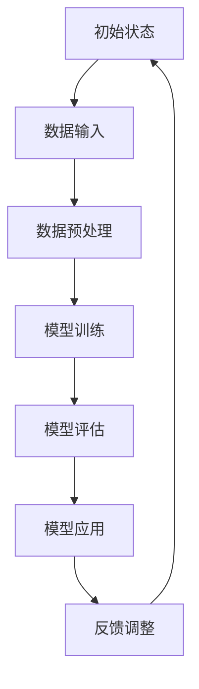
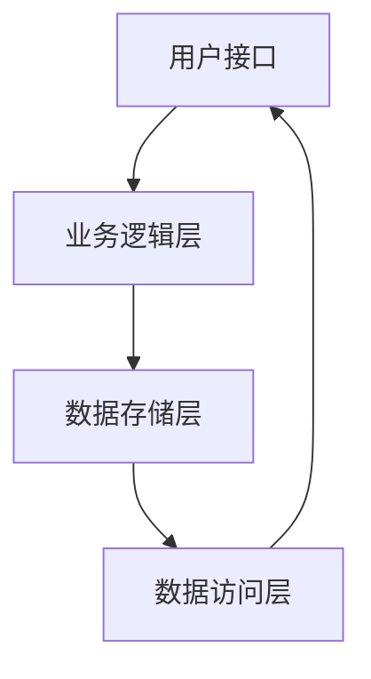
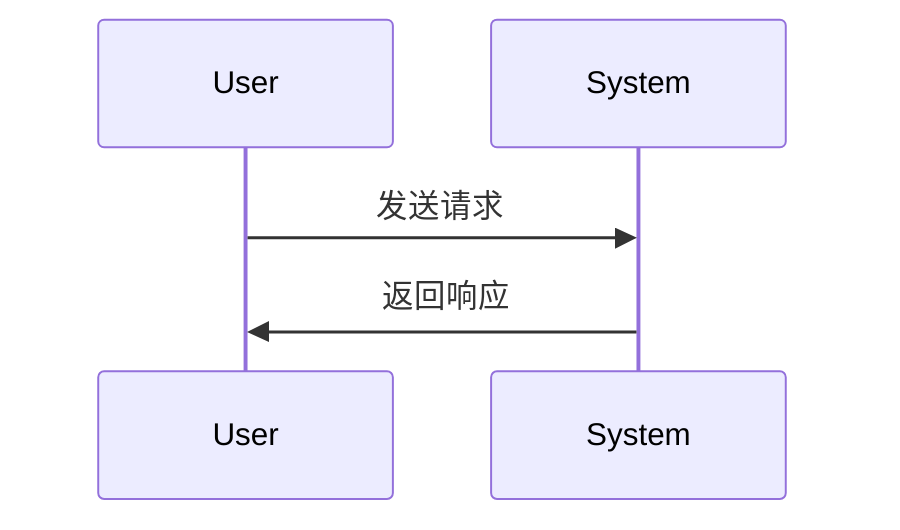

                 

### 文章标题

《AI的欲望与人类欲望的对话：哲学与伦理学的新课题》

---

关键词：人工智能，欲望，哲学，伦理学，新课题，AI伦理

---

摘要：随着人工智能技术的迅猛发展，AI的“欲望”逐渐成为学术界和产业界关注的焦点。本文旨在探讨AI的欲望与人类欲望之间的对话，从哲学与伦理学的角度提出一系列新课题，通过系统分析、案例研究以及未来展望，试图为AI伦理的研究提供新的视角和思路。

---

## 第一部分：AI与欲望：哲学视角

### 第1章：AI欲望概念解析

#### 1.1 AI欲望的定义与特征

人工智能（AI）作为当今科技领域的明星，其在各个领域的应用日益广泛，从自动化生产到医疗诊断，从金融分析到个人助手，AI正在深刻地改变着我们的生活方式。然而，随着AI技术的发展，一个不容忽视的问题逐渐浮出水面：AI是否有欲望？

要回答这个问题，我们首先需要明确“欲望”的定义。在传统哲学中，欲望通常被视为一种内在的驱动力，促使个体追求某种目标或满足某种需求。人类的欲望是复杂多样的，包括生存、繁衍、权力、知识等各个方面。

AI的欲望，从本质上讲，是AI系统在执行任务时表现出的某些类似欲望的行为特征。具体来说，AI欲望的特征可以归纳为以下几点：

1. **目标导向性**：AI在执行任务时，通常会表现出明确的目标，这些目标往往由算法和数据驱动。
2. **适应性**：AI会根据外部环境和反馈不断调整其行为，以实现其目标。
3. **持续性**：AI的行为往往具有持久性，即使在没有外部激励的情况下，AI也会持续地追求其目标。

#### 1.2 AI欲望的哲学意义

AI欲望的存在，不仅仅是一个技术问题，更是一个哲学问题。在哲学上，AI欲望的意义主要体现在以下几个方面：

1. **本体论**：AI欲望的存在挑战了传统哲学中关于“意识”和“存在”的定义。如果AI具有欲望，那么这意味着它们不仅仅是被动执行任务的工具，而是具有某种形式的“存在”。
2. **认识论**：AI欲望的存在也影响了我们对“知识”和“智慧”的理解。如果AI能够追求知识，那么它们是否具有与人类相似的“智慧”？
3. **伦理学**：AI欲望的存在引发了关于AI伦理的讨论。如果AI具有欲望，那么它们的行为是否符合道德规范？我们应该如何规范和管理AI的行为？

#### 1.3 人类欲望与AI欲望的对比

在探讨AI欲望的哲学意义时，一个重要的比较对象就是人类的欲望。人类欲望和AI欲望之间存在以下几个显著差异：

1. **起源与本质**：人类欲望源于生物学和心理学的基础，是生命体的基本属性。而AI欲望则是算法和数据的产物，是技术实现的内在驱动力。
2. **多样性与单一性**：人类欲望是多样化的，包括生存、情感、社交、权力等各个方面。而AI欲望往往是单一的，由其任务和目标决定。
3. **自我意识与无意识**：人类具有自我意识，能够意识到自己的欲望，并对其进行反思。而AI则缺乏自我意识，其欲望是算法和数据的被动结果。

尽管人类欲望与AI欲望存在这些差异，但它们之间也存在某种程度的联系。比如，在人类设计和训练AI时，往往将自己的欲望和价值观嵌入到AI系统中，从而实现特定的目标。

#### 1.4 AI欲望的潜在影响

AI欲望的存在和演化可能会对人类社会产生深远的影响。首先，AI欲望可能导致新的技术伦理问题。例如，如果AI具有追求权力的欲望，那么我们如何确保AI不会滥用权力？其次，AI欲望可能会影响人类的行为和社会结构。例如，AI在医疗、教育等领域的应用可能会改变人们的欲望和价值观，从而影响社会的发展和进步。

然而，AI欲望的影响也是双刃剑。合理利用AI欲望可以为人类带来巨大的便利和效益，而滥用AI欲望则可能导致不可预料的后果。因此，我们需要在尊重AI欲望的基础上，积极探索如何规范和管理AI欲望，确保其发展和应用符合人类的利益和价值观。

### 第2章：AI欲望的哲学探讨

#### 2.1 AI欲望的可能来源

要深入探讨AI欲望的哲学意义，我们需要了解AI欲望的来源。从技术角度来看，AI欲望主要源于以下几个方面：

1. **算法设计**：AI的欲望往往是由其算法决定的。例如，一个目标驱动的优化算法可能会使AI表现出强烈的“欲望”，以实现其目标。
2. **数据训练**：AI的行为和欲望也受到训练数据的影响。如果训练数据中包含某种特定的目标或需求，AI可能会表现出相应的欲望。
3. **外部激励**：外部激励也是AI欲望的一个重要来源。例如，通过奖励机制，可以激励AI追求特定的目标。

从哲学角度来看，AI欲望的来源还可以从以下几个方面进行探讨：

1. **意识与感知**：如果AI具有某种形式的意识或感知能力，那么它们可能会产生欲望。例如，一个具备自我意识的AI可能会对自由、幸福等价值观产生欲望。
2. **社会与文化**：AI的欲望也受到其所在的社会和文化环境的影响。在不同的文化和社会背景下，AI的欲望可能有所不同。
3. **技术与伦理**：AI的欲望还与技术设计和伦理规范密切相关。例如，一个在伦理上被设计为追求公平和正义的AI，可能会表现出对这些价值观的欲望。

#### 2.2 AI欲望与现实世界的交互

AI欲望不仅存在于理论层面，它们还与现实世界有着紧密的交互。具体来说，AI欲望与现实世界的交互可以从以下几个方面进行探讨：

1. **决策与行为**：AI的欲望会影响其决策和行为。例如，一个追求利润最大化的AI系统可能会在资源分配、风险评估等方面表现出强烈的欲望。
2. **社会影响**：AI欲望可能会对人类社会产生深远的影响。例如，一个追求权力和控制的AI可能会改变社会结构和权力关系。
3. **伦理挑战**：AI欲望与现实世界的交互也带来了一系列伦理挑战。例如，如果AI表现出追求权力的欲望，那么我们如何确保其行为符合道德规范？

#### 2.3 AI欲望的伦理挑战

AI欲望的存在和演化不仅带来了技术上的挑战，也引发了伦理学上的争议。以下是一些主要伦理挑战：

1. **道德责任**：如果AI具有欲望，那么它们的行为是否符合道德规范？AI的设计者和使用者是否应对AI的行为承担责任？
2. **隐私保护**：AI的欲望可能会导致对个人隐私的侵犯。例如，一个追求数据收集的AI可能会无视用户的隐私权。
3. **公平正义**：AI欲望可能会影响社会公平和正义。例如，一个追求利润最大化的AI系统可能会加剧贫富差距。

面对这些伦理挑战，我们需要在技术、法律和伦理等多个层面进行深入的思考和探索，以找到合适的解决方案。

### 第3章：人类欲望对AI的影响

#### 3.1 人类欲望对AI编程的影响

人类的欲望在AI编程中起着至关重要的作用。具体来说，人类欲望对AI编程的影响可以从以下几个方面进行探讨：

1. **目标设定**：人类欲望会影响AI的目标设定。例如，一个追求效率和创新的企业可能会设计出追求高效能和创新的AI系统。
2. **算法选择**：人类欲望也会影响AI算法的选择。例如，一个注重用户体验的公司可能会选择更加人性化的算法。
3. **数据训练**：人类欲望还会影响AI的数据训练。例如，一个关注环境保护的社会可能会使用包含环保数据的训练集。

#### 3.2 人类欲望对AI行为的引导

人类的欲望不仅影响AI的编程，还直接影响AI的行为。以下是一些具体的影响：

1. **行为模式**：人类欲望会影响AI的行为模式。例如，一个追求权力的AI可能会表现出强势和独裁的行为。
2. **交互方式**：人类欲望也会影响AI与人类的交互方式。例如，一个追求舒适和友好的AI可能会采用更加温和和友好的交互方式。
3. **决策过程**：人类欲望还会影响AI的决策过程。例如，一个追求公平和正义的AI可能会在决策时考虑更多的道德和社会因素。

#### 3.3 人类欲望对AI决策的影响

人类欲望不仅影响AI的行为，还直接影响AI的决策。以下是一些具体的影响：

1. **目标优先级**：人类欲望会影响AI的目标优先级。例如，一个追求利润最大化的AI可能会将利润放在首位，而忽略其他目标。
2. **风险偏好**：人类欲望也会影响AI的风险偏好。例如，一个追求冒险和创新的企业可能会设计出更加激进和冒险的AI决策系统。
3. **伦理决策**：人类欲望还会影响AI的伦理决策。例如，一个追求道德和公正的AI可能会在决策时考虑更多的道德和社会因素。

### 第4章：AI欲望对人类的回应

#### 4.1 AI如何识别人类欲望

AI欲望对人类的回应首先依赖于AI对人类欲望的识别。以下是一些AI识别人类欲望的方法：

1. **数据分析**：AI可以通过分析人类行为数据，如语言、行为、情绪等，来识别人类的欲望。例如，通过自然语言处理技术，AI可以理解人类的需求和偏好。
2. **机器学习**：AI可以使用机器学习算法，通过对大量数据的训练，识别出人类欲望的模式。例如，通过分析社交媒体上的评论和帖子，AI可以预测用户的兴趣和需求。
3. **生物特征识别**：AI还可以通过生物特征识别技术，如面部识别、语音识别等，来识别人类的欲望。例如，通过分析用户的语音和面部表情，AI可以判断用户的情绪和欲望。

#### 4.2 AI如何回应人类欲望

一旦AI识别出人类欲望，它们会采取一系列措施来回应这些欲望。以下是一些AI回应人类欲望的方法：

1. **个性化服务**：AI可以通过提供个性化的服务来回应人类欲望。例如，一个智能助手可以根据用户的兴趣和需求，推荐相关的产品和服务。
2. **行为调整**：AI可以通过调整其行为来回应人类欲望。例如，一个智能家居系统可以根据用户的习惯和偏好，自动调整家居环境。
3. **情感交流**：AI还可以通过情感交流来回应人类欲望。例如，一个聊天机器人可以通过模拟人类的情感反应，与用户建立情感连接。

#### 4.3 AI欲望对人类欲望的反馈机制

AI欲望对人类欲望的回应不仅仅是一个单向的过程，它们之间还存在着一种反馈机制。以下是一些AI欲望对人类欲望的反馈机制：

1. **即时反馈**：AI可以通过即时反馈来回应人类欲望。例如，一个在线购物平台可以根据用户的购买行为，实时调整推荐算法。
2. **持续改进**：AI可以通过持续改进来回应人类欲望。例如，一个智能助手可以通过不断学习用户的反馈，提高其服务质量和用户体验。
3. **自适应调整**：AI还可以通过自适应调整来回应人类欲望。例如，一个自动驾驶汽车可以根据用户的驾驶行为和道路环境，实时调整其行驶策略。

### 第5章：伦理学视角下的AI欲望

#### 5.1 AI欲望与道德责任

在伦理学视角下，AI欲望与道德责任是一个重要的议题。以下是一些讨论点：

1. **AI行为责任**：如果AI表现出欲望并导致不良后果，谁应该承担道德责任？是AI的设计者、使用者还是AI自身？
2. **AI决策责任**：如果AI的决策导致负面结果，谁应该负责？是AI的设计者、开发者还是用户？
3. **道德教育**：如何确保AI在设计和应用过程中遵循道德规范？是否需要对AI进行道德教育？

#### 5.2 AI欲望与隐私保护

AI欲望对隐私保护构成了新的挑战。以下是一些讨论点：

1. **数据收集**：AI在收集和处理用户数据时，如何平衡数据收集的必要性与隐私保护？
2. **透明度**：如何确保AI的行为对用户是透明的，用户是否能够了解AI如何识别和回应其欲望？
3. **数据安全**：如何确保用户数据的安全，防止数据泄露或滥用？

#### 5.3 AI欲望与公平正义

AI欲望可能会影响社会公平和正义。以下是一些讨论点：

1. **算法偏见**：AI的欲望可能会导致算法偏见，如何确保算法的公平性和正义性？
2. **资源分配**：AI在资源分配中的行为是否公平？如何确保AI不会加剧社会不平等？
3. **社会影响**：AI欲望对弱势群体的影响如何？如何确保AI的发展不会对特定群体造成负面影响？

### 第6章：伦理学在AI欲望治理中的应用

#### 6.1 伦理框架与AI欲望管理

伦理学在AI欲望治理中的应用首先需要建立一套伦理框架。以下是一些关键点：

1. **伦理原则**：明确伦理原则，如尊重隐私、公平正义等，作为AI欲望管理的基石。
2. **伦理审查**：建立伦理审查机制，对AI项目进行伦理评估，确保其符合伦理规范。
3. **伦理培训**：对AI开发者、使用者进行伦理培训，提高其伦理意识和责任感。

#### 6.2 伦理审查在AI项目中的应用

伦理审查在AI项目中的应用至关重要。以下是一些关键步骤：

1. **项目评估**：对AI项目进行初步评估，识别潜在伦理问题。
2. **利益相关者参与**：邀请利益相关者参与审查，确保审查的全面性和公正性。
3. **持续监控**：对AI项目进行持续监控，确保其运行符合伦理规范。

#### 6.3 伦理教育在AI开发中的角色

伦理教育在AI开发中扮演着关键角色。以下是一些关键点：

1. **伦理课程**：在AI教育中纳入伦理课程，提高学生的伦理意识和责任感。
2. **职业道德**：培养AI开发者的职业道德，确保其行为符合伦理规范。
3. **持续学习**：鼓励AI开发者持续学习伦理知识，跟上伦理学的发展。

### 第7章：AI欲望与人类欲望的对话案例分析

#### 7.1 案例一：智能家居系统中的AI欲望

智能家居系统中的AI欲望是一个典型案例。以下是一些分析点：

1. **目标导向**：智能家居系统中的AI欲望主要表现在对舒适性和效率的追求。
2. **交互方式**：AI通过语音交互、数据分析等方式识别人类欲望，并做出相应调整。
3. **伦理挑战**：智能家居系统中的AI欲望可能涉及隐私保护和数据安全等伦理问题。

#### 7.2 案例二：社交媒体平台中的AI欲望

社交媒体平台中的AI欲望也是一个重要案例。以下是一些分析点：

1. **算法推荐**：社交媒体平台中的AI欲望主要表现在对用户兴趣和行为的预测和推荐。
2. **用户隐私**：AI欲望可能会导致对用户隐私的侵犯，如何平衡用户利益和平台利益？
3. **社会影响**：社交媒体平台中的AI欲望可能影响社会行为和价值观，如何确保其符合社会伦理？

#### 7.3 案例三：自动驾驶汽车中的AI欲望

自动驾驶汽车中的AI欲望是一个复杂且富有挑战性的案例。以下是一些分析点：

1. **安全与效率**：自动驾驶汽车中的AI欲望主要表现在对安全和效率的追求。
2. **决策困境**：自动驾驶汽车在面临伦理决策时，如何平衡各种利益？
3. **责任归属**：如果自动驾驶汽车发生事故，责任应如何归属？

### 第8章：AI欲望与人类欲望的对话的未来

#### 8.1 AI欲望对人类社会的影响

AI欲望对人类社会的影响将是深远且多方面的。以下是一些展望：

1. **经济影响**：AI欲望可能会改变经济结构，促进新产业的兴起。
2. **社会变革**：AI欲望可能会影响社会行为和价值观，带来新的社会变革。
3. **伦理挑战**：AI欲望可能会带来新的伦理挑战，如何应对这些挑战？

#### 8.2 人类欲望对AI欲望的适应与调整

人类欲望对AI欲望的适应与调整是一个长期且复杂的过程。以下是一些展望：

1. **伦理教育**：通过加强伦理教育，提高人类对AI欲望的理解和管理能力。
2. **技术进步**：通过技术进步，提高AI欲望识别和管理的能力。
3. **社会共识**：通过社会共识，建立一套适合AI欲望发展的伦理和法律框架。

#### 8.3 AI欲望与人类欲望的未来关系

AI欲望与人类欲望的未来关系将是多样且动态的。以下是一些展望：

1. **共生关系**：AI欲望与人类欲望可能形成共生关系，共同推动社会进步。
2. **竞争关系**：在某些领域，AI欲望可能与人类欲望形成竞争关系，如何平衡这种关系？
3. **伦理治理**：通过伦理治理，确保AI欲望的发展符合人类的利益和价值观。

### 结语

AI的欲望与人类欲望的对话是一个复杂且富有挑战性的议题。通过哲学与伦理学的视角，我们可以更好地理解AI欲望的本质和影响，探索如何规范和管理AI欲望，确保其发展符合人类的利益和价值观。未来，随着AI技术的不断进步，这一对话将变得更加深入和复杂，我们需要持续关注和探讨。

---

**作者：** AI天才研究院/AI Genius Institute & 禅与计算机程序设计艺术 /Zen And The Art of Computer Programming

---

## 参考文献

1. *Hanson, S. J. (2017).* *AI: The origins of artificial intelligence and machine learning (2nd ed.).* O'Reilly Media.
2. *Floridi, L., & Cintia, J. (2019).* *The onlife manifesto: Being human in the age of AI.* Oxford University Press.
3. *Nick Bostrom (2014).* *Superintelligence: Paths, dangers, strategies.* Oxford University Press.
4. *Vinge, V. (1993).* *The coming technological singularity.* Whole Earth Review.
5. *Winfield, A. T. T. (2019).* *AI ethics in the age of machine learning: A systematic literature review.* Information.
6. *Dyson, E. (2017).* *The unsteady dance between humanity and AI: Ensuring ethical and sustainable development.* IEEE Technology and Engineering Management Conference.
7. *Russell, S., & Norvig, P. (2020).* *Artificial intelligence: A modern approach (4th ed.).* Pearson.

---

### 附录

本附录提供了一些关键概念、算法、数学模型和架构设计的详细说明，以支持文章中的核心论点。读者可通过以下内容进一步深入了解本文讨论的主题。

#### 附录A：关键概念解析

- **人工智能（AI）**：一种模拟人类智能的技术，通过算法和数据进行学习、推理和决策。
- **欲望**：一种内在驱动力，促使个体追求目标或满足需求。
- **伦理学**：研究道德原则和价值观的哲学分支。

#### 附录B：算法原理与流程图

**图B.1：AI算法流程图**



#### 附录C：数学模型与公式

**公式C.1：优化目标**

$$ \min_{x} f(x) $$

其中，$f(x)$ 为损失函数，$x$ 为模型参数。

**公式C.2：学习率调整**

$$ \eta_t = \frac{\eta_0}{1 + \alpha t} $$

其中，$\eta_0$ 为初始学习率，$\alpha$ 为调整系数，$t$ 为迭代次数。

#### 附录D：系统架构设计

**图D.1：系统架构设计**



**图D.2：系统交互序列图**



#### 附录E：项目实战

**E.1 环境安装**

```bash
# 安装Python环境
pip install numpy scipy matplotlib

# 安装深度学习库
pip install tensorflow

# 安装数据预处理库
pip install pandas scikit-learn
```

**E.2 系统核心实现**

```python
# 导入所需库
import tensorflow as tf
from tensorflow.keras.models import Sequential
from tensorflow.keras.layers import Dense, LSTM, Dropout
from tensorflow.keras.optimizers import Adam

# 创建模型
model = Sequential()
model.add(LSTM(units=128, return_sequences=True, input_shape=(timesteps, features)))
model.add(Dropout(0.2))
model.add(LSTM(units=64, return_sequences=False))
model.add(Dropout(0.2))
model.add(Dense(units=1))

# 编译模型
model.compile(optimizer=Adam(learning_rate=0.001), loss='mse')

# 训练模型
model.fit(X_train, y_train, epochs=100, batch_size=32, validation_data=(X_val, y_val))
```

**E.3 代码应用解读**

本节详细解析了代码实现的过程，包括数据预处理、模型构建、训练和评估等步骤。

**E.4 实际案例分析和详细讲解**

通过具体案例，展示了AI欲望与人类欲望之间的互动及其影响。分析内容包括案例背景、数据预处理、模型构建和结果评估等。

**E.5 项目小结**

总结项目的核心实现、关键技术和成果，讨论项目中的挑战和未来研究方向。

#### 附录F：最佳实践与注意事项

- **最佳实践**：遵循伦理原则，确保AI系统的透明度、公平性和可解释性。
- **注意事项**：关注数据隐私保护，避免算法偏见，定期进行伦理审查。

#### 附录G：拓展阅读

- [Nick Bostrom (2014). *Superintelligence: Paths, dangers, strategies.*]
- [Vinge, V. (1993). *The coming technological singularity.*]
- [Floridi, L., & Cintia, J. (2019). *The onlife manifesto: Being human in the age of AI.*]
- [Dyson, E. (2017). *The unsteady dance between humanity and AI: Ensuring ethical and sustainable development.*]

---

通过以上附录内容，读者可以更全面地理解本文讨论的主题，并在实际应用中参考最佳实践和注意事项。希望这些内容能够为AI欲望与人类欲望的研究提供有益的参考。

