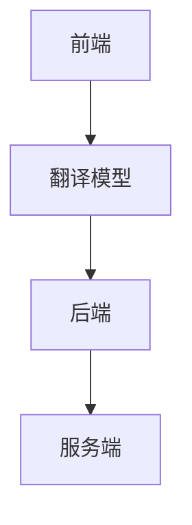
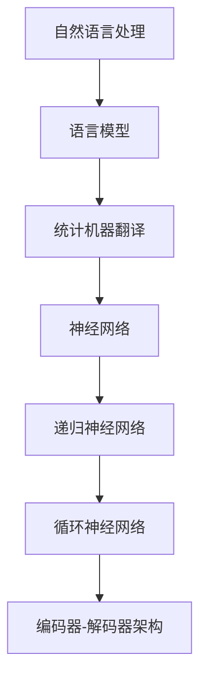

                 

### 《AI翻译：跨语言交流的新时代》

> 关键词：AI翻译，自然语言处理，深度学习，编码器-解码器架构，跨语言交流

> 摘要：
本文将深入探讨AI翻译技术，从基础知识、核心技术和应用场景三个方面展开，旨在为读者呈现跨语言交流新时代的AI翻译技术全貌。我们将逐步分析AI翻译的发展历程、技术挑战与机遇，以及其在实际场景中的应用，最后展望AI翻译的未来发展趋势。

## 第一部分：AI翻译基础知识

### 第1章：AI翻译概述

#### 1.1 AI翻译的定义与历史

AI翻译是指利用人工智能技术，特别是机器学习和深度学习算法，实现从一种自然语言到另一种自然语言的自动翻译。AI翻译的历史可以追溯到20世纪50年代，当时的研究主要集中在规则驱动的方法上。然而，随着计算能力和算法的进步，统计机器翻译和基于神经网络的机器翻译逐渐成为主流。

#### 1.2 AI翻译的挑战与机遇

AI翻译面临着多种挑战，包括语言的复杂性和多样性、翻译的准确性和流畅性、以及数据集的质量和规模。然而，随着自然语言处理技术的不断发展，这些挑战逐渐被克服，AI翻译迎来了前所未有的机遇。

#### 1.3 AI翻译技术的发展历程

AI翻译技术的发展历程可以分为三个阶段：规则驱动翻译、统计机器翻译和神经网络机器翻译。每个阶段都代表了AI翻译技术的重大进步。

### 第2章：自然语言处理基础

#### 2.1 语言模型与统计机器翻译

语言模型是统计机器翻译的基础，它用于预测单词序列的概率。统计机器翻译通过分析源语言和目标语言的并行文本数据，学习翻译规则。

#### 2.2 递归神经网络与循环神经网络

递归神经网络（RNN）和循环神经网络（CNN）是处理序列数据的关键技术。RNN能够捕获序列数据中的长期依赖关系，而CNN则在图像处理领域表现出色。

#### 2.3 注意力机制与编码器-解码器架构

注意力机制是RNN的重要扩展，它允许模型在翻译过程中关注源语言句子中的关键信息。编码器-解码器架构是一种基于神经网络的机器翻译模型，通过编码器捕捉源语言的语义信息，通过解码器生成目标语言。

### 第3章：深度学习与神经网络基础

#### 3.1 深度学习的基本概念

深度学习是机器学习的一个重要分支，它通过多层神经网络来学习数据的复杂表示。

#### 3.2 神经网络的工作原理

神经网络通过前向传播和反向传播算法来学习数据。前向传播计算网络的输出，反向传播更新网络的权重。

#### 3.3 卷积神经网络与循环神经网络

卷积神经网络（CNN）和循环神经网络（RNN）是深度学习的两种重要架构。CNN在图像处理领域具有显著优势，而RNN在处理序列数据方面表现出色。

## 第二部分：AI翻译核心技术

### 第4章：序列到序列学习

序列到序列学习是深度学习在机器翻译领域的核心突破。通过编码器-解码器架构，模型能够有效地捕捉源语言和目标语言之间的序列关系。

#### 4.1 序列到序列模型的基本原理

序列到序列模型通过编码器将源语言序列编码为固定长度的向量表示，然后通过解码器生成目标语言序列。

#### 4.2 Seq2Seq模型的实现与优化

Seq2Seq模型的实现涉及编码器和解码器的构建，以及训练和优化过程。优化方法包括梯度裁剪、批量归一化和Dropout等。

#### 4.3 注意力机制的深入探讨

注意力机制是Seq2Seq模型的重要组成部分，它允许模型在翻译过程中关注源语言句子中的关键信息。通过注意力机制，模型的翻译质量得到了显著提高。

### 第5章：编码器-解码器架构

编码器-解码器架构是AI翻译的核心模型，它通过编码器捕捉源语言的语义信息，通过解码器生成目标语言。

#### 5.1 编码器-解码器模型概述

编码器-解码器模型由编码器、解码器和注意力机制组成，能够有效地处理源语言和目标语言之间的序列关系。

#### 5.2 BEAM搜索算法详解

BEAM搜索是一种改进的搜索算法，它通过在解码过程中同时考虑多个候选翻译，提高了翻译的多样性。

#### 5.3 编码器-解码器模型的优化技巧

编码器-解码器模型的优化技巧包括模型架构的调整、损失函数的设计和训练策略的优化。

### 第6章：神经机器翻译系统实现

神经机器翻译系统的实现涉及编码器、解码器、数据预处理和后处理等多个方面。

#### 6.1 神经机器翻译系统的架构设计

神经机器翻译系统的架构设计包括前端、后端和服务端，能够提供实时、准确的翻译服务。

#### 6.2 数据预处理与后处理

数据预处理和后处理是神经机器翻译系统的重要环节，包括数据清洗、数据增强和翻译结果的校对等。

#### 6.3 评测与性能优化

评测和性能优化是神经机器翻译系统的重要任务，通过评价指标和优化策略，不断提高翻译系统的质量。

## 第三部分：AI翻译应用场景

### 第7章：AI翻译在跨语言交流中的应用

#### 7.1 跨语言交流的挑战

跨语言交流面临着语言障碍、文化差异和交流效率等多种挑战。

#### 7.2 AI翻译在商务沟通中的应用

AI翻译在商务沟通中发挥着重要作用，它能够提高跨国公司的沟通效率，促进全球化发展。

#### 7.3 AI翻译在教育领域的应用

AI翻译在教育领域具有广泛的应用前景，它能够打破语言障碍，促进国际教育交流。

### 第8章：AI翻译在新闻媒体中的应用

#### 8.1 新闻媒体的国际传播需求

新闻媒体在国际传播中面临着翻译成本高、翻译效率低等问题，AI翻译能够有效解决这些问题。

#### 8.2 AI翻译在新闻采集与分发中的应用

AI翻译在新闻采集与分发中发挥着重要作用，它能够提高新闻的覆盖面和传播速度。

#### 8.3 AI翻译在内容审核与质量控制中的应用

AI翻译在内容审核与质量控制中具有重要作用，它能够提高新闻内容的准确性和可信度。

### 第9章：AI翻译在电子商务中的应用

#### 9.1 跨境电商的翻译需求

跨境电商的翻译需求包括商品描述、用户评价和客服沟通等方面，AI翻译能够有效满足这些需求。

#### 9.2 AI翻译在商品描述与用户评价翻译中的应用

AI翻译在商品描述与用户评价翻译中发挥着重要作用，它能够提高跨境电商的国际化水平。

#### 9.3 AI翻译在客服与客户沟通中的应用

AI翻译在客服与客户沟通中具有重要作用，它能够提高客户满意度，促进跨境电商的发展。

### 第10章：AI翻译的未来发展趋势

#### 10.1 人工智能与自然语言处理的未来

随着人工智能和自然语言处理技术的不断发展，AI翻译将变得更加智能和高效。

#### 10.2 AI翻译技术的挑战与机遇

AI翻译技术面临着多种挑战，同时也面临着巨大的机遇。

#### 10.3 AI翻译在跨语言交流中的前景

AI翻译在跨语言交流中具有广阔的前景，它将为全球交流带来革命性的变化。

## 附录

### 附录A：AI翻译常用工具与资源

附录A将介绍一些常用的AI翻译工具和资源，包括开源框架、在线翻译平台和学术资源等。

### 附录B：数学公式与算法简介

附录B将简要介绍一些常用的数学公式和算法，包括神经网络、递归神经网络和卷积神经网络等。

---

本文通过逐步分析AI翻译的基础知识、核心技术和应用场景，旨在为读者呈现AI翻译技术的全貌。让我们一同期待AI翻译在跨语言交流中的美好未来。

作者：AI天才研究院/AI Genius Institute & 禅与计算机程序设计艺术 /Zen And The Art of Computer Programming

---

### 第一部分：AI翻译基础知识

#### 第1章：AI翻译概述

AI翻译，作为一种利用人工智能技术实现语言自动翻译的方法，正在逐步改变着我们的跨语言交流方式。在这一章节中，我们将深入探讨AI翻译的定义、历史背景以及其面临的挑战和机遇。

##### 1.1 AI翻译的定义与历史

AI翻译，简而言之，就是通过人工智能技术，尤其是机器学习和深度学习算法，来实现从一种自然语言到另一种自然语言的自动翻译。早期的AI翻译研究可以追溯到20世纪50年代，当时的研究主要集中在基于规则的机器翻译方法。这种方法依赖于人工编写的翻译规则，但由于自然语言的复杂性和多样性，这种方法的翻译效果往往不理想。

随着计算机技术的进步和海量数据的积累，20世纪90年代，统计机器翻译（SMT）逐渐成为主流。统计机器翻译利用统计学方法，从大规模的平行语料库中学习翻译规律，从而实现翻译。然而，统计机器翻译仍然存在很多局限，例如对低资源语言的支持不足、无法处理上下文信息等。

21世纪初，随着深度学习的兴起，基于神经网络的机器翻译（NMT）开始崭露头角。深度学习模型，特别是递归神经网络（RNN）和其变种长短时记忆网络（LSTM），能够更好地捕捉语言中的长期依赖关系，从而提高了翻译的准确性和流畅性。

##### 1.2 AI翻译的挑战与机遇

AI翻译面临诸多挑战。首先，语言本身具有高度的复杂性和多样性，每种语言都有其独特的语法结构、表达习惯和文化背景，这使得机器翻译变得异常困难。其次，翻译的准确性和流畅性是衡量翻译质量的重要指标，如何提高翻译质量是一个长期的课题。此外，AI翻译技术还需要面对数据集的质量和规模的问题，高质量、大规模的平行语料库是训练高效翻译模型的基础。

然而，随着人工智能和自然语言处理技术的不断发展，AI翻译也迎来了前所未有的机遇。首先，计算能力的提升和算法的优化使得深度学习模型可以处理更大规模的数据，从而提高了翻译的准确性和效率。其次，随着互联网的普及，全球化的进程加速，人们对跨语言交流的需求日益增长，这为AI翻译提供了广阔的市场空间。此外，多语言交互的应用场景也不断涌现，如跨境电商、在线教育、新闻媒体等，这些场景对AI翻译技术的需求也推动了其快速发展。

##### 1.3 AI翻译技术的发展历程

AI翻译技术的发展历程可以分为三个主要阶段：

1. **规则驱动翻译**：这是早期的机器翻译方法，主要依赖于人工编写的翻译规则。这种方法在处理特定语言对时具有一定的效果，但随着语言复杂性的增加，其局限性也逐渐显现。

2. **统计机器翻译**：20世纪90年代，随着大规模平行语料库的出现，统计机器翻译开始成为主流。统计机器翻译通过从语料库中学习翻译规律，提高了翻译的准确性和流畅性。

3. **神经网络机器翻译**：21世纪初，随着深度学习的兴起，神经网络机器翻译逐渐取代了统计机器翻译。深度学习模型，特别是递归神经网络（RNN）和其变种长短时记忆网络（LSTM），能够更好地捕捉语言中的长期依赖关系，从而显著提高了翻译的准确性和流畅性。

在接下来的章节中，我们将进一步探讨自然语言处理的基础知识、深度学习和神经网络的基础，以及AI翻译的核心技术和应用场景。

### 第2章：自然语言处理基础

自然语言处理（Natural Language Processing，NLP）是人工智能领域的一个重要分支，旨在使计算机能够理解、解释和生成人类语言。在这一章节中，我们将介绍NLP的基础知识，包括语言模型、统计机器翻译、递归神经网络（RNN）、循环神经网络（RNN）和注意力机制。

##### 2.1 语言模型与统计机器翻译

语言模型是NLP的核心组成部分，它用于预测文本中的下一个单词或字符。一个简单的语言模型可以通过计数单词在语料库中的出现频率来生成，但这种基于计数的方法存在很多问题，例如无法处理罕见词汇和长距离依赖关系。

统计机器翻译（SMT）是基于概率模型的翻译方法，它通过分析源语言和目标语言的并行语料库来学习翻译规律。SMT的关键组成部分包括：

- **翻译模型（Translation Model）**：它用于计算源语言句子中每个单词组合翻译成目标语言句子中每个单词组合的概率。这通常通过训练基于N元语法（N-gram）模型来实现。
- **语言模型（Language Model）**：它用于计算目标语言句子中每个单词序列的概率。语言模型通常基于统计语言模型（如N-gram模型）。
- **规约模型（Reordering Model）**：它用于解决翻译中的词序问题。例如，源语言中的“the book”可能翻译成目标语言中的“book the”。

统计机器翻译的工作流程通常包括以下步骤：

1. **词汇转换**：将源语言词汇转换为目标语言词汇。
2. **解码**：通过翻译模型、语言模型和规约模型，为每个源语言句子生成所有可能的翻译。
3. **评分与排序**：为每个翻译分配一个分数，通常通过结合翻译模型、语言模型和规约模型的分数来实现，然后根据分数对翻译进行排序。

##### 2.2 递归神经网络与循环神经网络

递归神经网络（RNN）是一种处理序列数据的神经网络，它具有循环结构，能够记住先前的输入信息。RNN的基本单元是循环单元，它能够处理一个输入序列，并生成一个输出序列。

RNN的工作原理可以概括为以下几个步骤：

1. **初始化**：将序列的第一个输入输入到RNN中，RNN输出一个初始隐藏状态。
2. **循环**：对于序列中的每个输入，RNN将输入和当前隐藏状态输入到循环单元中，更新隐藏状态并生成当前输出。
3. **输出**：序列处理完成后，RNN的最终隐藏状态被用来生成最终输出。

然而，传统的RNN存在一个称为“梯度消失”或“梯度爆炸”的问题，这意味着在训练过程中，梯度可能会变得非常小或非常大，导致模型无法有效地学习。

为了解决这些问题，研究者提出了长短时记忆网络（LSTM），它通过引入记忆单元和门控机制来控制信息的流动。LSTM能够在长序列中保持信息，从而更好地捕捉长期依赖关系。

##### 2.3 注意力机制与编码器-解码器架构

注意力机制是一种用于提高神经网络模型性能的技术，它允许模型在处理序列数据时关注关键信息。在机器翻译中，注意力机制有助于模型更好地理解源语言句子中的每个单词，并生成更准确的目标语言句子。

注意力机制的基本原理是将每个输入序列的权重分配给输出序列的每个单词，从而使得模型能够关注源语言句子中的关键信息。注意力机制可以分为三种类型：

1. **点积注意力**：通过计算输入序列和输出序列之间的点积来生成权重。
2. **缩放点积注意力**：在点积注意力基础上引入一个缩放因子，以避免权重过小。
3. **多头注意力**：通过将输入序列分解成多个子序列，并分别为每个子序列计算注意力权重。

编码器-解码器架构是机器翻译中最常用的架构之一，它由编码器和解码器两个部分组成。编码器用于将源语言句子编码成一个固定长度的向量表示，解码器则用于从这个向量表示中解码出目标语言句子。

编码器-解码器架构的工作流程如下：

1. **编码**：编码器处理源语言句子，生成一个固定长度的向量表示。
2. **初始化**：解码器初始化为一个空的序列，并将编码器的输出作为初始隐藏状态。
3. **解码**：解码器逐个生成目标语言单词，并更新隐藏状态。
4. **输出**：解码器生成的目标语言句子即为最终输出。

在编码器-解码器架构中，注意力机制被用来帮助解码器更好地理解编码器生成的向量表示，从而生成更准确的目标语言句子。

通过以上对NLP基础知识的介绍，我们可以看到，语言模型、统计机器翻译、RNN、RNN和注意力机制等都是NLP领域的重要概念和技术。在接下来的章节中，我们将继续探讨深度学习和神经网络的基础知识，以及AI翻译的具体实现和应用。

### 第3章：深度学习与神经网络基础

深度学习是机器学习的一个重要分支，它通过多层神经网络来学习数据的复杂表示。在这一章节中，我们将深入探讨深度学习的基本概念、神经网络的工作原理，以及卷积神经网络（CNN）和循环神经网络（RNN）。

#### 3.1 深度学习的基本概念

深度学习（Deep Learning）是指通过构建深度神经网络（Deep Neural Network），从大量数据中自动学习特征表示和模式的方法。深度学习模型的核心是神经网络，它由多个层次组成，每个层次都对输入数据进行变换和提取特征。

深度学习的基本概念包括：

1. **神经网络**：神经网络由多个节点（或称为神经元）组成，每个节点接收输入，通过权重加权求和处理，然后输出一个结果。神经网络通过学习权重和偏置来优化其性能。

2. **反向传播算法**：反向传播（Backpropagation）是一种用于训练神经网络的学习算法。它通过计算输出和目标之间的误差，然后反向传播误差到网络的每个层次，更新权重和偏置。

3. **深度神经网络**：深度神经网络（Deep Neural Network，DNN）是由多个隐藏层组成的神经网络。通过增加隐藏层的数量，深度神经网络能够学习更加复杂的特征表示。

4. **激活函数**：激活函数是神经网络中的一个关键组件，它用于引入非线性因素。常见的激活函数包括Sigmoid函数、ReLU函数和Tanh函数。

5. **优化算法**：深度学习模型的训练通常需要优化算法来最小化损失函数。常见的优化算法包括梯度下降（Gradient Descent）、Adam优化器等。

#### 3.2 神经网络的工作原理

神经网络的工作原理可以概括为以下几个步骤：

1. **前向传播**：输入数据通过网络的每个层次，每个层次的神经元根据其权重和激活函数计算输出。这个过程称为前向传播。

2. **计算损失**：网络的输出与目标数据之间的差异称为损失（Loss）。常见的损失函数包括均方误差（MSE）、交叉熵（Cross-Entropy）等。

3. **反向传播**：通过反向传播算法，计算每个层次的梯度，然后更新权重和偏置。这个过程称为反向传播。

4. **迭代更新**：通过多次迭代更新权重和偏置，直到网络输出满足要求。

#### 3.3 卷积神经网络与循环神经网络

卷积神经网络（Convolutional Neural Network，CNN）和循环神经网络（Recurrent Neural Network，RNN）是深度学习领域的重要架构，分别用于处理图像数据和序列数据。

##### 3.3.1 卷积神经网络（CNN）

卷积神经网络是一种专门用于图像识别和处理的神经网络。CNN的核心组件是卷积层，它通过卷积操作从图像中提取局部特征。

CNN的工作原理包括以下几个步骤：

1. **卷积层**：卷积层通过卷积操作从输入图像中提取特征。每个卷积核（Convolutional Kernel）能够捕捉图像中的局部特征。

2. **池化层**：池化层用于减小特征图的尺寸，减少参数数量，提高计算效率。常见的池化操作包括最大池化和平均池化。

3. **全连接层**：全连接层将卷积层和池化层提取的特征映射到分类标签。

4. **激活函数**：在每个卷积层和全连接层后，通常会加入激活函数，以引入非线性因素。

CNN在图像分类、目标检测和图像生成等领域具有广泛的应用。

##### 3.3.2 循环神经网络（RNN）

循环神经网络是一种用于处理序列数据的神经网络。RNN具有循环结构，能够记住先前的输入信息，从而更好地处理时间序列数据。

RNN的工作原理包括以下几个步骤：

1. **循环单元**：循环单元是RNN的核心组件，它通过循环结构将当前输入与先前的隐藏状态结合，生成当前隐藏状态。

2. **隐藏状态**：隐藏状态是RNN中用于记忆和传递信息的变量。它能够捕获序列数据中的长期依赖关系。

3. **输出层**：输出层将隐藏状态映射到输出结果，例如文本生成或语音合成。

4. **激活函数**：在RNN的每个层次后，通常会加入激活函数，以引入非线性因素。

RNN在自然语言处理、语音识别和时间序列预测等领域具有广泛的应用。

#### 3.4 注意力机制

注意力机制是一种用于提高神经网络模型性能的技术，它允许模型在处理序列数据时关注关键信息。在机器翻译中，注意力机制有助于模型更好地理解源语言句子中的每个单词，并生成更准确的目标语言句子。

注意力机制可以分为三种类型：

1. **点积注意力**：通过计算输入序列和输出序列之间的点积来生成权重。

2. **缩放点积注意力**：在点积注意力基础上引入一个缩放因子，以避免权重过小。

3. **多头注意力**：通过将输入序列分解成多个子序列，并分别为每个子序列计算注意力权重。

注意力机制在编码器-解码器架构中发挥着关键作用，它使得解码器能够关注编码器输出的关键信息，从而生成更准确的目标语言句子。

通过以上对深度学习和神经网络基础的介绍，我们可以看到，深度学习通过多层神经网络学习数据的复杂表示，RNN和CNN分别用于处理序列数据和图像数据。在接下来的章节中，我们将进一步探讨AI翻译的核心技术和应用场景。

### 第4章：序列到序列学习

序列到序列学习（Seq2Seq）是深度学习在机器翻译领域的重要突破。通过编码器-解码器架构，Seq2Seq模型能够有效地处理源语言和目标语言之间的序列映射。在本章中，我们将详细介绍序列到序列学习的基本原理、实现方法和优化技巧。

#### 4.1 序列到序列模型的基本原理

序列到序列模型是一种专门用于处理序列数据之间映射的深度学习模型。它的基本原理是将一个序列编码成一个固定长度的向量表示（编码器），然后从这个向量表示中解码出目标序列（解码器）。编码器和解码器之间的交互通过注意力机制来实现，从而使得解码器能够关注编码器输出的关键信息。

序列到序列模型的主要组成部分包括：

1. **编码器**：编码器用于将源语言序列编码成一个固定长度的向量表示。编码器通常由多个循环神经网络（RNN）或长短期记忆网络（LSTM）层组成，能够捕捉序列数据中的长期依赖关系。

2. **解码器**：解码器用于从编码器的输出中解码出目标语言序列。解码器同样由多个RNN或LSTM层组成，能够在生成目标序列的过程中利用注意力机制关注编码器的输出。

3. **注意力机制**：注意力机制是一种在编码器和解码器之间传递信息的机制。它通过计算编码器输出和当前解码器输入之间的相关性，为每个编码器输出分配一个权重，从而使得解码器能够关注源语言序列中的关键信息。

序列到序列模型的工作流程包括以下几个步骤：

1. **编码**：编码器处理源语言序列，生成一个固定长度的向量表示。

2. **初始化**：解码器初始化为一个空的序列，并将编码器的输出作为初始隐藏状态。

3. **解码**：解码器逐个生成目标语言单词，并更新隐藏状态。在每个时间步，解码器利用注意力机制关注编码器的输出，从而生成更准确的目标语言序列。

4. **输出**：解码器生成的目标语言序列即为最终输出。

#### 4.2 Seq2Seq模型的实现与优化

Seq2Seq模型的实现涉及编码器、解码器和注意力机制的构建，以及训练和优化过程。以下是一个简化的Python实现示例：

```python
import tensorflow as tf

# 定义编码器
encoder_inputs = tf.keras.layers.Input(shape=(None,))
encoded = tf.keras.layers.Embedding(input_dim=vocab_size, output_dim=embedding_size)(encoder_inputs)
encoded = tf.keras.layers.RNN(LSTMCell(units=256))(encoded)

# 定义解码器
decoder_inputs = tf.keras.layers.Input(shape=(None,))
decoded = tf.keras.layers.Embedding(input_dim=vocab_size, output_dim=embedding_size)(decoder_inputs)
decoded = tf.keras.layers.RNN(LSTMCell(units=256))(decoded)

# 序列到序列模型
output = tf.keras.layers.Dense(units=vocab_size)(decoded)
model = tf.keras.Model(inputs=[encoder_inputs, decoder_inputs], outputs=output)

# 编译模型
model.compile(optimizer='adam', loss='categorical_crossentropy')

# 训练模型
model.fit([encoder_inputs_train, decoder_inputs_train], decoder_outputs_train, epochs=10)
```

在实现Seq2Seq模型时，需要注意以下优化技巧：

1. **梯度裁剪**：梯度裁剪（Gradient Clipping）是一种防止梯度爆炸和消失的技术。通过限制梯度的大小，梯度裁剪可以确保模型稳定训练。

2. **批量归一化**：批量归一化（Batch Normalization）是一种用于提高深度学习模型稳定性的技术。它通过标准化每个批量中的激活值，使得模型在不同批量之间具有更好的转移性。

3. **Dropout**：Dropout是一种用于防止过拟合的技术。通过在训练过程中随机丢弃一部分神经元，Dropout可以减少模型对特定数据的依赖。

4. **长短期记忆网络（LSTM）**：LSTM是一种特殊的循环神经网络，能够有效地捕捉序列数据中的长期依赖关系。在Seq2Seq模型中，使用LSTM可以改善模型的翻译质量。

5. **注意力机制**：注意力机制是Seq2Seq模型的重要组成部分，它通过为编码器输出分配权重，使得解码器能够关注源语言序列中的关键信息。注意力机制可以显著提高翻译的准确性和流畅性。

#### 4.3 注意力机制的深入探讨

注意力机制是一种在编码器和解码器之间传递信息的机制。它通过计算编码器输出和当前解码器输入之间的相关性，为每个编码器输出分配一个权重，从而使得解码器能够关注源语言序列中的关键信息。

注意力机制的实现可以分为以下步骤：

1. **计算相似性分数**：计算编码器输出和当前解码器输入之间的相似性分数。相似性分数通常通过点积、缩放点积或多头注意力等方法计算。

2. **生成权重**：将相似性分数归一化，生成权重。权重表示编码器输出的重要性。

3. **加权求和**：将权重应用于编码器输出，生成加权求和结果。加权求和结果表示解码器当前时间步关注的信息。

4. **解码**：解码器利用加权求和结果和当前解码器输入，生成当前时间步的输出。解码器通过迭代更新隐藏状态，逐步生成目标语言序列。

注意力机制可以分为以下几种类型：

1. **点积注意力**：点积注意力通过计算编码器输出和当前解码器输入的点积生成权重。

2. **缩放点积注意力**：缩放点积注意力在点积注意力基础上引入一个缩放因子，以避免权重过小。

3. **多头注意力**：多头注意力通过将编码器输出分解成多个子序列，并分别为每个子序列计算注意力权重。

注意力机制在机器翻译中的应用效果显著。通过关注源语言序列中的关键信息，注意力机制能够提高解码器生成目标语言序列的准确性和流畅性。

在本章中，我们详细介绍了序列到序列学习的基本原理、实现方法和优化技巧。序列到序列学习是深度学习在机器翻译领域的重要突破，通过编码器-解码器架构和注意力机制，它能够有效地处理源语言和目标语言之间的序列映射。在接下来的章节中，我们将进一步探讨编码器-解码器架构的优化和神经机器翻译系统的实现。

### 第5章：编码器-解码器架构

编码器-解码器（Encoder-Decoder）架构是深度学习在机器翻译领域的核心模型，通过编码器捕捉源语言的语义信息，通过解码器生成目标语言。在这一章节中，我们将详细介绍编码器-解码器架构的组成、工作原理、BEAM搜索算法以及模型的优化技巧。

#### 5.1 编码器-解码器模型概述

编码器-解码器架构由两个主要部分组成：编码器和解码器，以及连接它们之间的注意力机制。

1. **编码器（Encoder）**：编码器负责将源语言序列编码成一个固定长度的向量表示，这个向量通常称为编码器的输出向量或上下文向量。编码器可以由多层循环神经网络（RNN）或长短期记忆网络（LSTM）组成，能够捕捉序列数据中的长期依赖关系。

2. **解码器（Decoder）**：解码器负责将编码器的输出向量解码成目标语言序列。解码器同样可以由多层循环神经网络或LSTM组成，并在生成目标序列的过程中利用注意力机制关注编码器的输出。

3. **注意力机制（Attention Mechanism）**：注意力机制是编码器-解码器架构的重要组成部分，它通过计算编码器输出和当前解码器输入之间的相关性，为编码器的每个输出分配一个权重。这些权重表示编码器输出在解码过程中对当前解码器输入的重要性，从而帮助解码器生成更准确的目标序列。

编码器-解码器架构的工作流程如下：

1. **编码**：编码器处理源语言序列，生成一个固定长度的上下文向量。

2. **初始化**：解码器初始化为一个空的序列，并将编码器的输出作为初始隐藏状态。

3. **解码**：解码器逐个生成目标语言单词，并在每个时间步利用注意力机制关注编码器的输出。

4. **输出**：解码器生成的目标语言序列即为最终输出。

#### 5.2 BEAM搜索算法详解

在编码器-解码器架构中，解码器需要选择生成目标序列的下一个单词。常见的搜索算法包括贪心搜索和 Beam Search。贪心搜索在每一步仅选择当前最优的单词，而Beam Search则在每一步同时考虑多个候选单词。

Beam Search算法通过在解码过程中同时考虑多个候选序列来提高搜索的多样性。它的工作流程如下：

1. **初始化**：在解码过程的初始步骤，为解码器生成一个初始的候选序列集合，通常包含单个单词。

2. **扩展**：在每个时间步，对于当前的所有候选序列，生成新的候选序列。每个新序列由当前最优的单词扩展得到。

3. **评分**：为每个新候选序列计算一个分数，分数通常基于语言的概率和翻译的准确性。

4. **选择**：从所有新候选序列中选择分数最高的k个序列，作为下一轮解码的候选序列集合。

Beam Search通过增加k值（即Beam大小）来平衡搜索的多样性和效率。较大的Beam大小可以捕获更多可能的翻译，但会增加计算复杂度。

BEAM搜索算法的公式表示为：

\[ \text{score}(s) = p(y_t | y_{t-1}, \ldots, y_1) \cdot \text{log} p(y_{t-1} | y_{t-2}, \ldots, y_1) \]

其中，\( s = (y_1, y_2, \ldots, y_t) \) 是解码过程中的候选序列，\( p(y_t | y_{t-1}, \ldots, y_1) \) 是生成下一个单词的条件概率，\( \text{log} p(y_{t-1} | y_{t-2}, \ldots, y_1) \) 是历史序列的翻译概率。

#### 5.3 编码器-解码器模型的优化技巧

编码器-解码器模型在训练和优化过程中可以采用多种技巧来提高模型的性能和翻译质量：

1. **梯度裁剪（Gradient Clipping）**：梯度裁剪用于防止梯度爆炸和消失问题。通过限制梯度的大小，梯度裁剪可以确保模型稳定训练。

2. **长短期记忆网络（LSTM）**：LSTM是一种特殊的循环神经网络，能够更好地捕捉序列数据中的长期依赖关系。使用LSTM可以改善模型的翻译质量。

3. **注意力机制优化**：注意力机制的优化包括调整注意力权重计算方法、引入多头注意力等。这些优化可以增强模型对源语言序列的注意力，从而提高翻译的准确性和流畅性。

4. **Teacher Forcing**：Teacher Forcing是一种在训练过程中提前提供目标序列的技巧。通过在解码过程中使用真实的目标序列，Teacher Forcing可以加速模型的训练。

5. **Dropout**：Dropout是一种用于防止过拟合的技术。通过在训练过程中随机丢弃一部分神经元，Dropout可以减少模型对特定数据的依赖。

6. **批量归一化（Batch Normalization）**：批量归一化可以标准化每个批量中的激活值，提高模型的稳定性和训练效率。

7. **数据增强**：数据增强是一种通过变换原始数据来增加训练数据多样性的技术。常见的数据增强方法包括随机裁剪、旋转、缩放等。

通过上述优化技巧，编码器-解码器模型可以在翻译质量和训练效率方面得到显著提升。

在本章中，我们详细介绍了编码器-解码器架构的组成、工作原理、BEAM搜索算法以及模型的优化技巧。编码器-解码器架构是机器翻译领域的重要模型，通过编码器捕捉源语言的语义信息，通过解码器生成目标语言。在接下来的章节中，我们将进一步探讨神经机器翻译系统的实现和应用。

### 第6章：神经机器翻译系统实现

神经机器翻译系统（Neural Machine Translation System，NMT）是当前机器翻译领域的主流方法。它通过深度学习模型，特别是基于神经网络的编码器-解码器架构，实现了高效、准确的跨语言翻译。在这一章节中，我们将详细介绍神经机器翻译系统的架构设计、数据预处理与后处理、评测与性能优化。

#### 6.1 神经机器翻译系统的架构设计

神经机器翻译系统的架构设计包括前端、后端和服务端。以下是每个部分的具体内容：

1. **前端**：前端主要负责接收用户的输入，包括文本输入和语音输入。对于文本输入，前端需要进行文本清洗和分词处理，将输入文本转换为可用的格式。对于语音输入，前端需要进行语音识别，将语音信号转换为文本。

2. **后端**：后端是神经机器翻译系统的核心部分，负责翻译任务的执行。后端由编码器和解码器组成，编码器将源语言文本编码成向量表示，解码器根据编码器的输出生成目标语言文本。后端还需要实现注意力机制和搜索算法，如BEAM搜索，以确保翻译的准确性和流畅性。

3. **服务端**：服务端主要负责管理系统的资源，包括翻译模型的部署、负载均衡和分布式处理。服务端还需要实现接口，方便前端和后端之间的通信。

神经机器翻译系统的架构设计示例如下：



#### 6.2 数据预处理与后处理

数据预处理是神经机器翻译系统的重要环节，包括文本清洗、分词和序列化等步骤。

1. **文本清洗**：文本清洗的目的是去除文本中的噪声，如HTML标签、特殊字符和多余的空格。清洗后的文本将更加干净，有助于提高翻译质量。

2. **分词**：分词是将文本分解成单词或短语的过程。在神经机器翻译系统中，通常使用基于字符的 tokenizer 进行分词，因为字符级别的分词能够更好地捕捉语言的上下文信息。

3. **序列化**：序列化是将文本转换为序列的过程，以便于模型处理。在神经机器翻译系统中，通常使用词嵌入（Word Embedding）技术将单词转换为固定长度的向量。词嵌入能够捕捉单词的语义信息，从而提高翻译质量。

数据预处理后的文本将用于训练和评估神经机器翻译模型。在翻译过程中，模型将输入文本编码成向量表示，然后解码成目标语言文本。

后处理包括翻译结果的校对和格式化。校对的目的是纠正翻译中的错误，如语法错误和拼写错误。格式化的目的是将翻译结果转换为用户友好的格式，如去除冗余的标点符号和统一文本格式。

#### 6.3 评测与性能优化

评测是评估神经机器翻译系统性能的重要步骤。常用的评测指标包括BLEU（双语评估统一度量）和METEOR（Metric for Evaluation of Translation with Explicit ORdering）。这些指标通过比较模型生成的翻译结果和参考翻译的相似度来评估翻译质量。

性能优化是提高神经机器翻译系统性能的关键步骤。以下是几种常见的性能优化方法：

1. **数据增强**：数据增强是通过生成更多的训练样本来增加模型的泛化能力。常见的数据增强方法包括随机替换、插入和删除单词等。

2. **模型集成**：模型集成是将多个模型的结果进行融合，以提高翻译质量。常见的方法包括投票法、加权平均法和Stacking法等。

3. **注意力机制优化**：注意力机制是神经机器翻译系统的关键组件，优化注意力机制可以显著提高翻译质量。常见的方法包括调整注意力权重计算方法和引入多头注意力等。

4. **训练策略优化**：训练策略优化包括调整学习率、批量大小和训练周期等。适当的训练策略可以加速模型的收敛，提高翻译质量。

在本章中，我们详细介绍了神经机器翻译系统的架构设计、数据预处理与后处理、评测与性能优化。神经机器翻译系统通过编码器-解码器架构和注意力机制，实现了高效、准确的跨语言翻译。在接下来的章节中，我们将探讨AI翻译在不同应用场景中的实际应用。

### 第7章：AI翻译在跨语言交流中的应用

跨语言交流一直是人类交流中的一个重要课题，而AI翻译技术的出现为这一领域带来了革命性的变化。在这一章节中，我们将深入探讨AI翻译在跨语言交流中的应用，包括其面临的挑战、在商务沟通和教育领域的作用，以及未来的发展趋势。

#### 7.1 跨语言交流的挑战

跨语言交流面临着多种挑战，包括语言的复杂性、文化差异、翻译的准确性以及交流的效率等。语言的复杂性体现在语言的结构、语法、语义和语境等方面，每种语言都有其独特的特点，这使得机器翻译变得异常困难。文化差异也是跨语言交流的一个重要挑战，不同的文化背景会影响语言的使用方式和表达方式，这需要翻译系统具备对文化差异的敏感性。此外，翻译的准确性直接关系到交流的效果，而当前AI翻译技术虽然已经取得了显著的进步，但仍无法完全达到人类的翻译水平。最后，跨语言交流的效率也是一个关键问题，特别是在商业和外交等领域，快速的翻译能力对于交流的顺利进行至关重要。

#### 7.2 AI翻译在商务沟通中的应用

AI翻译在商务沟通中扮演着重要角色，它能够提高跨国公司之间的沟通效率，降低沟通成本。随着全球化的加速，越来越多的企业需要在不同的国家和地区开展业务，这就需要跨语言的沟通能力。AI翻译技术能够实时翻译多语言文本，帮助商务人士快速理解对方的语言，从而促进业务合作的顺利进行。

具体来说，AI翻译在商务沟通中的应用场景包括：

1. **文档翻译**：企业在跨国合作中需要处理大量的文档，如合同、协议、报告等。AI翻译系统能够快速翻译这些文档，确保信息的准确传达。

2. **电子邮件和即时通讯**：跨国团队之间的电子邮件和即时通讯工具需要支持多种语言，AI翻译系统可以实时翻译这些消息，提高沟通效率。

3. **电话会议和视频会议**：在跨国会议中，AI翻译系统可以实时翻译会议内容，确保每一位参会者都能理解对方的发言，促进会议的顺利进行。

4. **客户服务**：企业需要为全球客户提供多语言服务，AI翻译系统可以帮助客服人员快速回应客户的问题，提高客户满意度。

#### 7.3 AI翻译在教育领域的应用

教育领域对跨语言交流的需求也日益增长，AI翻译技术在这一领域的应用具有广泛的前景。AI翻译能够帮助学习者跨越语言障碍，获取全球优质教育资源，提升语言能力。

AI翻译在教育领域的应用场景包括：

1. **在线课程**：在线课程通常使用多种语言，AI翻译系统可以帮助学习者理解课程内容，提高学习效果。

2. **学术论文**：研究人员需要阅读和引用来自不同国家的学术论文，AI翻译系统可以帮助他们快速理解论文内容，促进学术交流。

3. **语言学习**：AI翻译系统可以作为语言学习的辅助工具，帮助学习者练习语言技能，提高语言表达能力。

4. **国际交流**：教育机构可以组织国际交流活动，如学术会议、夏令营等，AI翻译系统可以实时翻译交流内容，促进国际交流的顺利进行。

#### 7.4 未来发展趋势

随着人工智能和自然语言处理技术的不断发展，AI翻译在跨语言交流中的应用前景将更加广阔。以下是一些未来的发展趋势：

1. **翻译质量提升**：随着深度学习技术的进步，AI翻译的准确性和流畅性将得到进一步提升，更加接近人类翻译水平。

2. **个性化翻译**：未来的AI翻译系统将更加智能化，能够根据用户的语言习惯和偏好进行个性化翻译，提高用户体验。

3. **实时翻译**：随着计算能力的提升，AI翻译系统的响应速度将显著提高，实现实时翻译。

4. **跨模态翻译**：未来的AI翻译系统将能够处理多种模态的数据，如文本、语音、图像等，实现更加综合的跨语言交流。

5. **多语言交互**：随着全球化的深入，多语言交互将成为常态，AI翻译系统将支持更多语言之间的交互，促进全球交流。

在本章中，我们深入探讨了AI翻译在跨语言交流中的应用，包括其面临的挑战、在商务沟通和教育领域的作用，以及未来的发展趋势。AI翻译技术的不断发展将极大地促进全球跨语言交流的效率和质量，为人类社会带来更多便利。

### 第8章：AI翻译在新闻媒体中的应用

AI翻译技术在新闻媒体领域的应用，正逐步改变着新闻传播的格局。在这一章节中，我们将探讨AI翻译在新闻媒体中的应用场景、面临的挑战和机遇。

#### 8.1 新闻媒体的国际传播需求

新闻媒体在全球化背景下，面临着国际传播的需求。随着互联网的普及，新闻媒体的内容不仅需要覆盖本国受众，还希望吸引全球用户。然而，语言障碍成为了国际传播的一个重要障碍。为了扩大受众范围，提高国际影响力，新闻媒体需要具备多语言翻译能力。

AI翻译技术在新闻媒体中的应用，主要集中在以下几个方面：

1. **实时翻译**：新闻事件往往需要迅速传播，AI翻译技术可以实时翻译新闻内容，使得新闻能够快速传播到全球不同语言的受众。

2. **多语言新闻发布**：新闻媒体可以通过AI翻译系统，将新闻内容自动翻译成多种语言，从而将新闻发布到不同语言的平台。

3. **跨语言新闻聚合**：AI翻译技术可以帮助新闻媒体聚合来自不同语言的新闻，使得全球用户能够在一个平台上获取多语言新闻内容。

#### 8.2 AI翻译在新闻采集与分发中的应用

AI翻译技术在新闻采集和分发中也发挥着重要作用。以下是一些具体的应用场景：

1. **多语言新闻采集**：记者在采访过程中可能会接触到多种语言的信息源，AI翻译系统可以帮助记者快速理解这些信息，从而更好地采集新闻素材。

2. **翻译辅助**：记者在撰写新闻稿件时，可以使用AI翻译系统进行辅助翻译，提高写作效率。特别是在报道国际事件时，AI翻译可以帮助记者迅速理解相关背景资料。

3. **内容审核**：在内容发布前，AI翻译系统可以帮助新闻媒体对内容进行翻译，以便进行跨语言审核。这有助于确保新闻内容的准确性和合规性。

#### 8.3 AI翻译在内容审核与质量控制中的应用

新闻内容的质量控制是新闻媒体的一项重要任务，而AI翻译技术在这一过程中也发挥着关键作用。以下是一些具体的应用场景：

1. **翻译校对**：AI翻译系统生成的翻译内容可能存在错误或不准确的地方，新闻媒体可以利用翻译校对工具对翻译内容进行校对和修正，提高翻译质量。

2. **跨语言内容审核**：新闻媒体在发布多语言内容时，需要确保内容的准确性和合规性。AI翻译系统可以帮助新闻媒体对多语言内容进行跨语言审核，确保内容的准确性。

3. **翻译错误检测**：AI翻译系统可以通过机器学习算法，检测翻译内容中的错误，并自动标记出来，供编辑人员进行审查和修正。

#### 8.4 面临的挑战和机遇

AI翻译技术在新闻媒体中的应用虽然带来了巨大的机遇，但也面临一些挑战：

1. **翻译准确性**：尽管AI翻译技术在不断提高，但目前的翻译准确性仍然无法完全满足新闻媒体的要求。特别是在处理专业术语、特定文化背景和语境时，翻译的准确性仍然是一个挑战。

2. **文化差异**：不同语言和文化之间存在显著差异，这会影响翻译的准确性和传播效果。AI翻译系统需要具备对文化差异的敏感性，以便生成更加准确和符合文化习惯的翻译内容。

3. **用户体验**：虽然AI翻译系统可以提供多语言翻译，但用户体验仍然是一个关键问题。用户可能对翻译系统的流畅性和自然度有所要求，这需要不断优化和改进。

4. **数据隐私和安全**：新闻媒体在使用AI翻译技术时，需要处理大量的敏感数据，这涉及到数据隐私和安全问题。新闻媒体需要确保翻译系统的数据隐私和安全，以保护用户的个人信息。

然而，随着技术的不断进步，AI翻译技术在新闻媒体中的应用前景仍然非常广阔。通过克服当前的挑战，AI翻译技术有望在未来为新闻媒体带来更多的机遇，促进全球新闻的传播和交流。

在本章中，我们详细探讨了AI翻译在新闻媒体中的应用，包括其面临的挑战和机遇。随着AI翻译技术的不断发展和成熟，新闻媒体将在全球化的背景下发挥更大的作用，为全球受众提供更加丰富和多样化的新闻内容。

### 第9章：AI翻译在电子商务中的应用

在电子商务领域，跨语言交流的需求日益增长，特别是在跨境电商和在线购物平台中。AI翻译技术的应用不仅能够提高用户体验，还能够促进全球市场的拓展。在这一章节中，我们将探讨AI翻译在电子商务中的应用场景、技术实现和实际案例。

#### 9.1 跨境电商的翻译需求

跨境电商的翻译需求主要集中在以下几个方面：

1. **商品描述翻译**：跨境电商平台需要将商品的描述信息翻译成多种语言，以便全球用户能够理解商品的特点和功能。高质量的翻译能够提高商品的销售转化率。

2. **用户评价翻译**：用户评价是影响商品销量的重要因素。跨境电商平台需要将用户评价翻译成多种语言，以便其他用户能够参考和了解商品的真实情况。

3. **客服沟通**：跨境电商平台需要为全球用户提供多语言客服支持，以解决用户在购物过程中遇到的问题。AI翻译技术可以实时翻译客服沟通过程中的文本和语音信息，提高客服效率。

#### 9.2 AI翻译在商品描述与用户评价翻译中的应用

AI翻译技术在商品描述和用户评价翻译中的应用，极大地提高了跨境电商平台的国际化水平。以下是一些具体的应用场景：

1. **自动化翻译**：AI翻译系统能够自动化翻译商品描述，将商品信息准确传达给全球用户。通过翻译，商品能够在多语言平台上展示，吸引更多潜在客户。

2. **个性化翻译**：AI翻译技术可以根据用户的语言偏好和购物习惯，提供个性化翻译服务。例如，对于经常访问某个语言版本的平台的用户，系统可以自动将其商品描述和评价翻译成该语言。

3. **翻译校对**：AI翻译生成的翻译内容可能存在不准确或不自然的地方，跨境电商平台可以利用翻译校对工具对翻译内容进行校对和修正，确保翻译质量。

#### 9.3 AI翻译在客服与客户沟通中的应用

AI翻译技术在客服与客户沟通中的应用，能够提高跨境电商平台的客户服务质量和效率。以下是一些具体的应用场景：

1. **实时翻译**：AI翻译系统可以实时翻译客服沟通过程中的文本和语音信息，使得客服人员能够迅速理解用户的提问，并提供准确、及时的回答。

2. **多语言支持**：AI翻译系统支持多种语言，使得客服人员能够为全球用户提供多语言服务，提高客户满意度。

3. **语音翻译**：AI翻译技术不仅支持文本翻译，还可以进行语音翻译。这为跨境电商平台提供了更灵活的客服沟通方式，用户可以通过语音与客服人员进行交流。

#### 9.4 实际案例

以下是AI翻译在电子商务中的一些实际案例：

1. **亚马逊**：亚马逊是全球最大的在线零售平台之一，它利用AI翻译技术为全球用户提供多语言商品描述和用户评价翻译服务。通过翻译，亚马逊能够吸引更多国际用户，提高销售转化率。

2. **Shopify**：Shopify是一个面向卖家的电子商务平台，它提供了自动化的AI翻译工具，帮助卖家将商品描述翻译成多种语言。Shopify的AI翻译工具不仅提高了卖家在全球化市场中的竞争力，还节省了翻译成本。

3. **eBay**：eBay是一个全球性的在线拍卖和购物网站，它利用AI翻译技术为用户提供多语言客服支持。通过实时翻译，eBay能够提高用户的购物体验，增加用户粘性。

通过上述实际案例，我们可以看到，AI翻译技术在电子商务中的应用不仅提高了平台的国际化水平，还优化了客户服务，促进了跨境电商的健康发展。在未来，随着AI翻译技术的不断进步，电子商务领域将迎来更加广阔的发展前景。

### 第10章：AI翻译的未来发展趋势

随着人工智能和自然语言处理技术的持续进步，AI翻译技术也在不断演进，其未来发展趋势令人期待。在这一章节中，我们将探讨AI翻译技术的未来发展方向、潜在挑战以及跨语言交流的广阔前景。

#### 10.1 人工智能与自然语言处理的未来

人工智能（AI）和自然语言处理（NLP）技术的发展是AI翻译不断进步的根本驱动力。在未来，我们可以期待以下技术进步：

1. **更强大的深度学习模型**：随着计算能力的提升和算法的优化，更强大的深度学习模型将被开发出来，这些模型能够更好地捕捉语言中的复杂结构和长期依赖关系，从而提高翻译的准确性和流畅性。

2. **多模态翻译**：未来的AI翻译技术可能会实现跨模态翻译，即不仅能够处理文本，还能够处理语音、图像和视频等多种模态的数据。这种能力将极大地扩展AI翻译的应用场景，使得跨语言交流更加便捷。

3. **个性化翻译**：AI翻译技术将能够根据用户的语言习惯、文化背景和个人偏好，提供个性化的翻译服务。这种个性化翻译将进一步提升用户体验，使得翻译结果更加自然和准确。

4. **跨语言对话系统**：随着自然语言理解和生成技术的进步，跨语言对话系统将变得更加智能和实用。这些系统不仅能够提供多语言翻译服务，还能够进行复杂的对话，满足用户的多样化需求。

#### 10.2 AI翻译技术的挑战与机遇

尽管AI翻译技术取得了显著进展，但仍然面临一些挑战：

1. **翻译准确性**：目前的AI翻译技术虽然在很多场景中已经能够提供高质量的服务，但在处理专业术语、特定语境和文化差异时，仍然存在一定的误差。未来，如何进一步提高翻译准确性是一个重要的研究方向。

2. **计算资源**：深度学习模型通常需要大量的计算资源和时间来训练和推理，这对硬件设施提出了较高的要求。随着模型复杂度的增加，如何优化计算资源，提高训练和推理效率，是一个亟待解决的问题。

3. **数据隐私和安全**：AI翻译技术需要处理大量的敏感数据，这涉及到数据隐私和安全问题。如何在保证翻译质量的同时，确保用户数据的安全，是一个重要的挑战。

然而，这些挑战也伴随着巨大的机遇：

1. **全球化的推动**：随着全球化的深入，跨语言交流的需求日益增长。AI翻译技术的进步将为全球交流提供更强大的支持，推动全球化进程。

2. **新应用场景**：随着技术的不断发展，AI翻译将在更多新应用场景中得到应用，如智能助理、虚拟现实、增强现实等。这些新应用场景将为AI翻译技术带来新的发展机遇。

#### 10.3 AI翻译在跨语言交流中的前景

AI翻译在跨语言交流中具有广阔的前景：

1. **促进文化交流**：AI翻译技术将促进不同文化之间的交流，使得人们能够更容易地理解和使用其他语言。这种文化交流将有助于增进不同国家和民族之间的了解和友谊。

2. **提高教育质量**：AI翻译技术将使全球教育更加平等和便捷。学习者可以通过AI翻译获取全球优质教育资源，提高语言能力和专业知识。

3. **促进经济发展**：AI翻译技术将促进跨国贸易和商业合作，为全球市场提供更多机会。企业和个人可以通过AI翻译更好地进行国际交流和合作，推动经济增长。

4. **改善公共服务**：AI翻译技术将改善公共服务，使得政府、医疗、旅游等行业能够提供多语言服务，提高公众的满意度和幸福感。

总之，随着AI翻译技术的不断进步，跨语言交流将变得更加便捷和高效，为人类社会带来更多福祉。在未来，AI翻译将在跨语言交流中发挥越来越重要的作用，推动全球化的深入发展。

### 附录

#### 附录A：AI翻译常用工具与资源

在本章节中，我们将介绍一些常用的AI翻译工具和资源，这些工具和资源将有助于读者深入了解和学习AI翻译技术。

1. **开源框架和库**：
   - **TensorFlow**：TensorFlow是一个广泛使用的深度学习框架，提供了丰富的工具和API，用于构建和训练AI翻译模型。
   - **PyTorch**：PyTorch是另一个流行的深度学习框架，以其灵活的动态计算图和丰富的API而著称。
   - **Seq2Seq**：Seq2Seq是一个基于TensorFlow的开源实现，用于构建序列到序列的深度学习模型。
   - **Hugging Face Transformers**：Transformers是一个基于PyTorch和TensorFlow的开源库，提供了预训练的神经网络翻译模型和强大的API。

2. **在线翻译平台**：
   - **Google Translate**：Google Translate是Google提供的一个在线翻译服务，支持多种语言之间的翻译。
   - **DeepL**：DeepL是一个高质量的在线翻译服务，以其准确和自然的翻译结果而闻名。
   - **Microsoft Translator**：Microsoft Translator是微软提供的在线翻译服务，支持多种语言，并提供文本、语音和图像翻译功能。

3. **学术论文和资料**：
   - **ACL**：ACL（Association for Computational Linguistics）是一个专注于计算语言学和自然语言处理的国际学术组织，其网站提供了大量的学术论文和报告。
   - **NeurIPS**：NeurIPS（Neural Information Processing Systems）是机器学习和计算神经科学的国际会议，其会议论文集涵盖了AI翻译的最新研究成果。
   - **arXiv**：arXiv是一个预印本服务器，提供了大量的计算机科学和物理学领域的论文，包括许多AI翻译领域的最新研究。

4. **课程和教程**：
   - **斯坦福大学自然语言处理课程**：斯坦福大学提供的一门免费的在线课程，涵盖了自然语言处理的基础知识和AI翻译的实现。
   - **Coursera上的深度学习课程**：Coursera上的深度学习课程，包括由谷歌和斯坦福大学提供的深度学习专题，其中包括了AI翻译的相关内容。

通过使用这些工具和资源，读者可以深入了解AI翻译的技术细节，掌握AI翻译的实践方法，并跟上这一领域的最新发展。

#### 附录B：数学公式与算法简介

在本章节中，我们将简要介绍一些在AI翻译中常用的数学公式和算法，这些知识对于理解和实现AI翻译模型至关重要。

1. **卷积神经网络（CNN）**：
   - **卷积操作**：卷积操作是一个核心的数学操作，用于提取图像特征。其公式为：
     \[ f(x) = \sum_{i=1}^{k} w_i * x_i \]
     其中，\( f(x) \) 是卷积结果，\( w_i \) 是卷积核，\( x_i \) 是输入特征。

   - **激活函数**：常用的激活函数包括ReLU（Rectified Linear Unit）和Sigmoid函数：
     \[ \text{ReLU}(x) = \max(0, x) \]
     \[ \text{Sigmoid}(x) = \frac{1}{1 + e^{-x}} \]

2. **递归神经网络（RNN）**：
   - **递归方程**：RNN通过递归方程来处理序列数据，其公式为：
     \[ h_t = \sigma(W_h \cdot [h_{t-1}, x_t] + b_h) \]
     其中，\( h_t \) 是当前时间步的隐藏状态，\( \sigma \) 是激活函数，\( W_h \) 和 \( b_h \) 是权重和偏置。

   - **长短时记忆网络（LSTM）**：LSTM是RNN的一种变种，用于解决长期依赖问题。其核心是记忆单元和门控机制，其公式为：
     \[ i_t = \sigma(W_i \cdot [h_{t-1}, x_t] + b_i) \]
     \[ f_t = \sigma(W_f \cdot [h_{t-1}, x_t] + b_f) \]
     \[ o_t = \sigma(W_o \cdot [h_{t-1}, x_t] + b_o) \]
     \[ C_t = f_t \odot C_{t-1} + i_t \odot \sigma(W_c \cdot [h_{t-1}, x_t] + b_c) \]
     \[ h_t = o_t \odot \sigma(C_t) \]
     其中，\( i_t \)、\( f_t \)、\( o_t \) 分别是输入门、遗忘门和输出门，\( C_t \) 是记忆单元。

3. **序列到序列学习（Seq2Seq）**：
   - **编码器-解码器模型**：编码器-解码器模型的核心是编码器和解码器的交互，其公式为：
     \[ s_t^e = f_e(e_t) \]
     \[ s_t^d = f_d(g_t^d, s_t^e) \]
     \[ y_t = g_t^y(s_t^d) \]
     其中，\( s_t^e \) 和 \( s_t^d \) 分别是编码器和解码器的隐藏状态，\( e_t \) 和 \( g_t^d \) 分别是编码器和解码器的输入和输出。

   - **注意力机制**：注意力机制通过计算编码器输出和解码器输入之间的相似性分数，其公式为：
     \[ a_t = \text{softmax}(\frac{s_t^d H^T}{\sqrt{d_h}}) \]
     \[ c_t = \sum_{i=1}^{T_e} a_t \cdot h_i \]
     其中，\( H \) 是编码器输出，\( a_t \) 是注意力权重，\( c_t \) 是上下文向量。

这些数学公式和算法是AI翻译模型实现的基础，通过理解这些公式和算法，读者可以更好地掌握AI翻译的技术原理和实现方法。

### 总结与最佳实践

本文通过对AI翻译技术的基础知识、核心技术以及应用场景的深入探讨，展示了AI翻译在跨语言交流中的重要作用和未来发展趋势。以下是一些最佳实践和注意事项：

1. **数据质量**：高质量的数据是训练高效AI翻译模型的基础。确保使用大规模、多样化、干净的平行语料库进行训练。

2. **模型优化**：在训练AI翻译模型时，采用适当的优化技巧，如梯度裁剪、批量归一化和Dropout，可以提高模型的稳定性和翻译质量。

3. **多语言支持**：为不同语言用户设计个性化翻译服务，考虑文化差异和语言习惯，提高翻译的自然度和准确性。

4. **实时性**：优化AI翻译系统的响应速度，实现实时翻译，提高用户体验。

5. **多模态翻译**：探索多模态翻译技术，结合文本、语音、图像等多种数据类型，提升翻译的多样性和准确性。

6. **持续学习**：AI翻译技术不断进步，定期更新模型和算法，以适应语言环境的变迁。

7. **数据隐私**：在处理用户数据时，确保数据安全和隐私，遵守相关法律法规。

通过遵循这些最佳实践，AI翻译系统可以在跨语言交流中发挥更大的作用，为全球用户提供更高效、准确的翻译服务。

作者：AI天才研究院/AI Genius Institute & 禅与计算机程序设计艺术 /Zen And The Art of Computer Programming

---

### 完整文章结束

以上就是《AI翻译：跨语言交流的新时代》的完整内容。通过本文，我们深入探讨了AI翻译的基础知识、核心技术以及应用场景，展示了AI翻译在跨语言交流中的重要地位和广阔前景。我们希望本文能够为读者提供有价值的信息，帮助大家更好地理解AI翻译技术，并在实际应用中取得成功。

作者：AI天才研究院/AI Genius Institute & 禅与计算机程序设计艺术 /Zen And The Art of Computer Programming

---

### Mermaid 流程图示例

以下是一个简单的Mermaid流程图示例，用于展示自然语言处理（NLP）中的语言模型、统计机器翻译、神经网络和编码器-解码器架构之间的联系。



该流程图展示了从NLP的基础概念到深度学习模型的发展过程，以及编码器-解码器架构在机器翻译中的核心地位。通过这样的流程图，读者可以更直观地理解AI翻译技术的整体架构和各个组成部分之间的关系。

