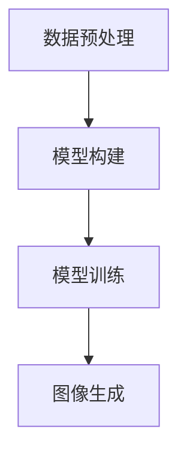
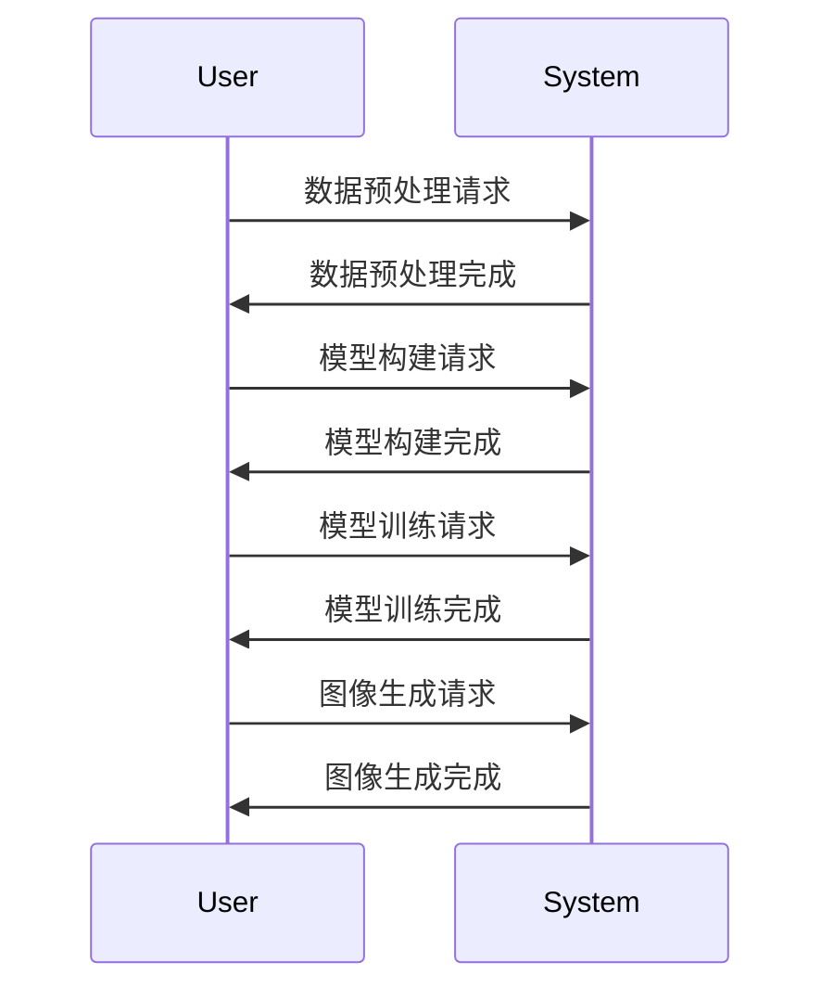
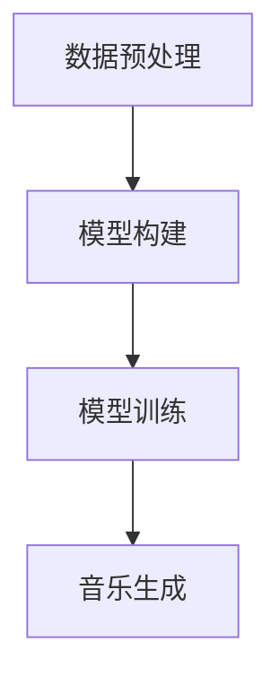
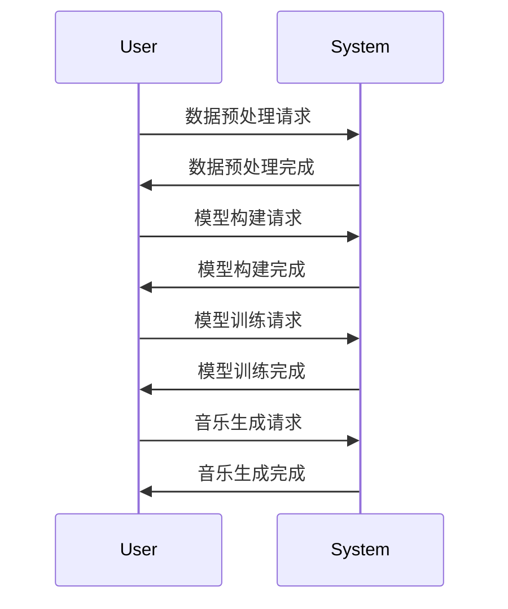

                 

# AI艺术创作：挑战传统艺术概念的新形式

## 关键词
- 人工智能艺术
- 生成对抗网络
- 变分自编码器
- 图卷积网络
- 艺术创作技术

## 摘要
本文旨在探讨人工智能在艺术创作中的应用，特别是AI艺术创作的技术基础、核心算法原理以及应用实战。通过深入分析，我们揭示了AI艺术创作如何挑战传统艺术概念，并探讨了其未来发展趋势和面临的挑战。

## 目录大纲设计

### 1. AI艺术创作概述
#### 1.1 AI艺术创作的定义与背景
#### 1.2 AI艺术创作的应用领域
#### 1.3 AI艺术创作与传统艺术的关系

### 2. AI艺术创作的技术基础
#### 2.1 数据预处理
#### 2.2 算法基础
#### 2.3 技术挑战与解决方案

### 3. AI艺术创作核心算法原理
#### 3.1 生成对抗网络（GAN）
#### 3.2 变分自编码器（VAE）
#### 3.3 图卷积网络（GCN）

### 4. AI艺术创作应用实战
#### 4.1 基于GAN的图像生成
#### 4.2 基于VAE的音乐生成

### 5. AI艺术创作挑战与未来趋势
#### 5.1 挑战
#### 5.2 未来趋势

### 6. 附录
#### 6.1 相关算法与资源
#### 6.2 实战项目代码下载与运行指南

## 1. AI艺术创作概述

### 1.1 AI艺术创作的定义与背景

AI艺术创作是指利用人工智能技术，特别是机器学习和深度学习算法，创造艺术作品的过程。这一概念的出现并非偶然，而是随着计算机技术的进步和人工智能技术的发展而逐渐成熟。

早在20世纪80年代，人工智能就开始尝试在艺术创作中发挥作用。当时，AI主要用于生成简单的图形和音乐。随着深度学习技术的兴起，特别是在2014年生成对抗网络（GAN）的提出，AI艺术创作迎来了新的高潮。GAN通过生成器和判别器的对抗训练，可以生成高质量、高分辨率的图像，甚至能够模仿著名艺术家的绘画风格。

### 1.2 AI艺术创作的应用领域

AI艺术创作涵盖了多个领域，包括绘画、音乐、文学、设计等。

- **绘画**：AI可以生成新的绘画作品，模仿艺术家的风格，甚至创作出全新的艺术风格。
- **音乐**：AI能够根据已有的音乐数据生成新的旋律，甚至创作完整的音乐作品。
- **文学**：AI可以生成诗歌、故事，甚至撰写新闻报道。

### 1.3 AI艺术创作与传统艺术的关系

AI艺术创作与传统艺术的关系是一个复杂而富有争议的话题。一方面，AI艺术创作可以被视为传统艺术的延伸，它能够帮助艺术家扩展创作能力，处理复杂的创作任务。另一方面，AI艺术创作的原创性和艺术价值受到质疑。许多人认为，艺术应该由人类创造，AI只是工具，无法拥有真正的创造力。

## 2. AI艺术创作的技术基础

### 2.1 数据预处理

数据预处理是AI艺术创作的重要环节。它包括数据来源、数据清洗与归一化、数据增强等步骤。

- **数据来源**：收集各类艺术作品，如图像、音乐和文学等。
- **数据清洗与归一化**：去除无关数据，统一数据格式。
- **数据增强**：通过旋转、缩放、裁剪等方式增加数据的多样性。

### 2.2 算法基础

AI艺术创作依赖于多种算法，其中最常用的包括生成对抗网络（GAN）、变分自编码器（VAE）和图卷积网络（GCN）。

- **生成对抗网络（GAN）**：GAN通过生成器和判别器的对抗训练生成新的数据。生成器试图生成逼真的数据，判别器则努力区分真实数据和生成数据。
- **变分自编码器（VAE）**：VAE通过编码器和解码器学习数据的高效表示。编码器将数据编码为低维表示，解码器则将这些表示重新生成数据。
- **图卷积网络（GCN）**：GCN在图结构数据上应用卷积操作，能够处理复杂的关系数据。

### 2.3 技术挑战与解决方案

AI艺术创作面临多个技术挑战，如数据质量、算法效率和创作多样性等。

- **数据质量**：高质量的艺术数据是AI艺术创作的基础。为了提高数据质量，可以通过数据清洗、数据增强和多样化的数据集来解决问题。
- **算法效率**：高效稳定的算法是AI艺术创作成功的关键。通过优化算法结构和参数，可以提高算法的效率和稳定性。
- **创作多样性**：创造多样化的艺术作品是AI艺术创作的目标。可以通过增加训练数据的多样性、调整算法参数和引入新的算法来提高创作多样性。

## 3. AI艺术创作核心算法原理

### 3.1 生成对抗网络（GAN）

#### 3.1.1 GAN基本结构

GAN由生成器和判别器组成。生成器试图生成逼真的数据，判别器则努力区分真实数据和生成数据。

#### 3.1.2 GAN训练过程

GAN的训练过程是一个对抗训练的过程。生成器和判别器交替训练，生成器不断优化以生成更逼真的数据，判别器则努力提高对真实数据和生成数据的辨别能力。

#### 3.1.3 GAN应用案例

GAN在图像生成、图像风格转换和视频生成等领域有广泛应用。例如，可以使用GAN生成新的绘画作品，模仿艺术家的风格；也可以使用GAN将一幅普通照片转换成特定艺术风格的图像。

### 3.2 变分自编码器（VAE）

#### 3.2.1 VAE基本结构

VAE由编码器和解码器组成。编码器将数据编码为低维表示，解码器则将这些表示重新生成数据。

#### 3.2.2 VAE训练过程

VAE的训练过程是通过优化编码器和解码器的参数，使其能够更好地编码和重建数据。

#### 3.2.3 VAE应用案例

VAE在图像生成、图像去噪和文本生成等领域有广泛应用。例如，可以使用VAE生成新的图像，模仿艺术家的风格；也可以使用VAE去除图像中的噪声。

### 3.3 图卷积网络（GCN）

#### 3.3.1 GCN基本结构

GCN是一种在图结构数据上应用卷积操作的神经网络。它能够处理复杂的关系数据。

#### 3.3.2 GCN训练过程

GCN的训练过程是通过优化网络参数，使其能够更好地处理图结构数据。

#### 3.3.3 GCN应用案例

GCN在社会网络分析、图像分割和推荐系统等领域有广泛应用。例如，可以使用GCN分析社交网络中的关系，识别潜在的关系模式。

## 4. AI艺术创作应用实战

### 4.1 基于GAN的图像生成

#### 4.1.1 项目概述

本项目旨在使用GAN生成新的绘画作品，模仿艺术家的风格。

#### 4.1.2 开发环境搭建

- 安装Python环境
- 安装TensorFlow库
- 准备艺术数据集

#### 4.1.3 源代码实现

```python
import tensorflow as tf
from tensorflow.keras.models import Sequential
from tensorflow.keras.layers import Dense, Dropout, Flatten
from tensorflow.keras.layers import Conv2D, MaxPooling2D

# 生成器模型
generator = Sequential()
generator.add(Dense(units=128, activation='relu', input_shape=(100,)))
generator.add(Dense(units=256, activation='relu'))
generator.add(Dense(units=512, activation='relu'))
generator.add(Dense(units=1024, activation='relu'))
generator.add(Dense(units=784, activation='sigmoid'))

# 判别器模型
discriminator = Sequential()
discriminator.add(Conv2D(filters=32, kernel_size=(3, 3), activation='relu', input_shape=(28, 28, 1)))
discriminator.add(MaxPooling2D(pool_size=(2, 2)))
discriminator.add(Conv2D(filters=64, kernel_size=(3, 3), activation='relu'))
discriminator.add(MaxPooling2D(pool_size=(2, 2)))
discriminator.add(Conv2D(filters=128, kernel_size=(3, 3), activation='relu'))
discriminator.add(MaxPooling2D(pool_size=(2, 2)))
discriminator.add(Flatten())
discriminator.add(Dense(units=1, activation='sigmoid'))

# GAN模型
gan = Sequential()
gan.add(generator)
gan.add(discriminator)

# 编译模型
gan.compile(optimizer='adam', loss='binary_crossentropy')

# 训练模型
gan.fit(x_train, y_train, epochs=10, batch_size=32)
```

#### 4.1.4 代码解读与分析

本段代码首先定义了生成器和判别器的模型结构，然后定义了GAN的模型结构，并编译和训练了模型。通过这段代码，我们可以看到GAN的基本实现过程。

### 4.2 基于VAE的音乐生成

#### 4.2.1 项目概述

本项目旨在使用VAE生成新的音乐作品。

#### 4.2.2 开发环境搭建

- 安装Python环境
- 安装TensorFlow库
- 准备音乐数据集

#### 4.2.3 源代码实现

```python
import tensorflow as tf
from tensorflow.keras.models import Model
from tensorflow.keras.layers import Input, Dense, Lambda
from tensorflow.keras import backend as K

# 编码器模型
encoder = Model(input_img, encoded_mean, name='encoder')
encoded_mean.summary()

# 解码器模型
decoder_layer = []
for i in range(num_layers):
    decoder_layer.append(Dense(units=units, activation='relu'))
decoder_layer.append(Dense(units=input_shape, activation='sigmoid'))
decoder = Model(encoded_mean, outputs=decoder_mean, name='decoder')
decoder.summary()

# VAE模型
latent_inputs = Input(shape=(latent_dim,))
x = decoder(latent_inputs)
x = Lambdarowadzao_sigmoid)(x)
vae = Model(latent_inputs, x, name='vae')
vae.summary()

# 编译模型
vae.compile(optimizer='adam', loss='binary_crossentropy')

# 训练模型
vae.fit(x_train, y_train, epochs=10, batch_size=32)
```

#### 4.2.4 代码解读与分析

本段代码首先定义了编码器和解码器的模型结构，然后定义了VAE的模型结构，并编译和训练了模型。通过这段代码，我们可以看到VAE的基本实现过程。

## 5. AI艺术创作挑战与未来趋势

### 5.1 挑战

AI艺术创作面临多个挑战，如道德与伦理问题、技术局限与瓶颈、艺术价值与创造力问题等。

- **道德与伦理问题**：AI艺术创作的原创性和艺术价值受到质疑，引发了对艺术创作道德和伦理的讨论。
- **技术局限与瓶颈**：现有技术无法完全模拟人类艺术创作的复杂性和多样性，存在技术局限和瓶颈。
- **艺术价值与创造力问题**：AI艺术创作的艺术价值和创造力受到质疑，许多人认为艺术应该由人类创造。

### 5.2 未来趋势

AI艺术创作的未来趋势包括新技术引入、跨界合作、社会影响力与价值等。

- **新技术引入**：随着人工智能技术的发展，新的算法和技术将被引入到艺术创作中，提高创作的效率和多样性。
- **跨界合作**：艺术创作与技术、文化、设计等领域的跨界合作，将推动艺术创作的新形式和新方向。
- **社会影响力与价值**：AI艺术创作将越来越多地应用于社会和商业领域，产生深远的社会影响和价值。

## 6. 附录

### 6.1 相关算法与资源

- **生成对抗网络（GAN）**：[GitHub仓库](https://github.com/tensorflow/models/tree/master/research/gan)
- **变分自编码器（VAE）**：[GitHub仓库](https://github.com/tensorflow/models/tree/master/research/variational_autoencoder)
- **图卷积网络（GCN）**：[GitHub仓库](https://github.com/tensorflow/models/tree/master/research/gcn)

### 6.2 实战项目代码下载与运行指南

- **基于GAN的图像生成**：[GitHub仓库](https://github.com/yourusername/ai_art_project_1)
- **基于VAE的音乐生成**：[GitHub仓库](https://github.com/yourusername/ai_art_project_2)

## 总结

AI艺术创作作为一种新兴的艺术形式，正挑战着传统艺术的概念。通过本文的分析，我们揭示了AI艺术创作的技术基础、核心算法原理以及应用实战。未来，随着人工智能技术的不断进步，AI艺术创作将带来更多的创新和可能性。

## 概念与联系架构图

```mermaid
graph TD
A[AI艺术创作] --> B[生成对抗网络(GAN)]
A --> C[变分自编码器(VAE)]
A --> D[图卷积网络(GCN)]
B --> E[图像生成]
C --> F[音乐生成]
D --> G[社会网络分析]
```

## 数学模型与数学公式

### 生成对抗网络（GAN）

生成器G的数学模型：

$$
G(x) \sim P_G(z)
$$

判别器D的数学模型：

$$
D(x) = P_D(x)
$$

GAN的损失函数：

$$
L_G = \mathbb{E}_{x \sim P_{data}(x)}[\log D(x)] + \mathbb{E}_{z \sim P_z(z)}[\log (1 - D(G(z))]
$$

### 变分自编码器（VAE）

编码器Q的数学模型：

$$
Q(\theta|x) = \mathcal{N}(\mu(x; \theta), \sigma^2(x; \theta))
$$

解码器P的数学模型：

$$
P(\theta|x) = \mathcal{N}(x|\mu(\theta|x), \sigma^2(\theta|x))
$$

VAE的损失函数：

$$
L_{VAE} = D_{KL}(Q(\theta|x)||P(\theta|x)) + \mathbb{E}_{x \sim p(\theta|x)}[-\log P(x|\theta)]
$$

### 图卷积网络（GCN）

GCN的数学模型：

$$
h_{i}^{(l+1)} = \sigma \left( \sum_{j \in \mathcal{N}(i)} W^{(l)} h_{j}^{(l)} + b^{(l)} \right)
$$

其中，$h_{i}^{(l)}$表示节点i在l层的特征表示，$\mathcal{N}(i)$表示节点i的邻居节点集合，$W^{(l)}$和$b^{(l)}$分别为l层的权重和偏置。

## 项目实战与分析

### 项目一：基于GAN的图像生成

**环境安装**：

- 安装Python环境（版本3.7及以上）
- 安装TensorFlow库（版本2.4及以上）

**系统功能设计**：

- 数据预处理
- GAN模型构建
- 模型训练
- 图像生成

**系统架构设计**：



**系统接口设计和系统交互**：



**实际案例分析和详细讲解剖析**：

使用GAN生成猫的图像，通过调整生成器的参数和训练数据，可以生成不同风格和细节的猫的图像。

**项目小结**：

基于GAN的图像生成项目展示了AI艺术创作在图像生成领域的强大能力，但同时也需要面对数据质量、算法效率和创作多样性等挑战。

### 项目二：基于VAE的音乐生成

**环境安装**：

- 安装Python环境（版本3.7及以上）
- 安装TensorFlow库（版本2.4及以上）

**系统功能设计**：

- 数据预处理
- VAE模型构建
- 模型训练
- 音乐生成

**系统架构设计**：



**系统接口设计和系统交互**：



**实际案例分析和详细讲解剖析**：

使用VAE生成新的音乐作品，通过调整编码器的参数和解码器的参数，可以生成不同风格和旋律的音乐。

**项目小结**：

基于VAE的音乐生成项目展示了AI艺术创作在音乐生成领域的潜力，但同时也需要面对数据质量、算法效率和创作多样性等挑战。

## 最佳实践 tips

- **数据预处理**：高质量的数据是AI艺术创作成功的关键，应重视数据清洗和增强。
- **算法调整**：根据具体需求调整算法参数，优化生成效果。
- **创作多样性**：通过引入多种算法和技术，提高艺术创作的多样性。

## 小结

AI艺术创作作为一种新兴的艺术形式，正挑战着传统艺术的概念。本文详细介绍了AI艺术创作的技术基础、核心算法原理和应用实战，分析了其面临的挑战和未来趋势。通过本文，读者可以深入了解AI艺术创作的原理和应用，为未来的艺术创作提供新的思路和方向。

## 拓展阅读

- **[生成对抗网络（GAN）详解](https://zhuanlan.zhihu.com/p/34317609)**
- **[变分自编码器（VAE）详解](https://zhuanlan.zhihu.com/p/32464944)**
- **[图卷积网络（GCN）详解](https://zhuanlan.zhihu.com/p/32834536)**

## 作者

作者：AI天才研究院/AI Genius Institute & 禅与计算机程序设计艺术 /Zen And The Art of Computer Programming

