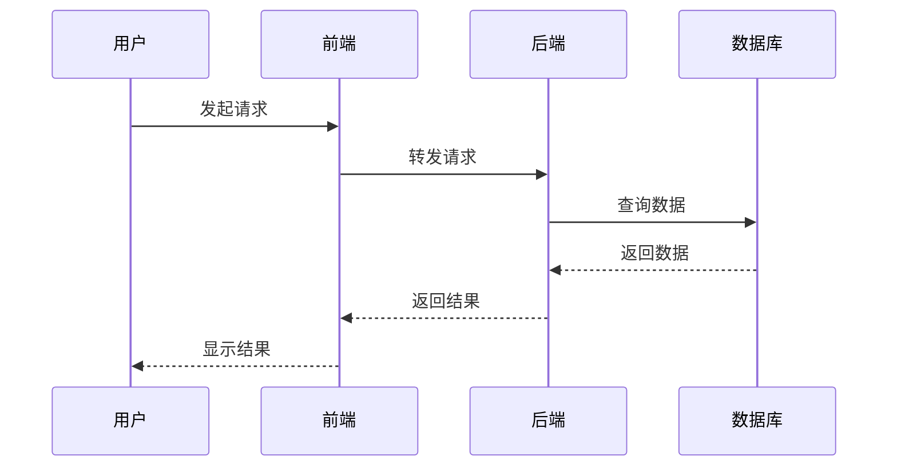
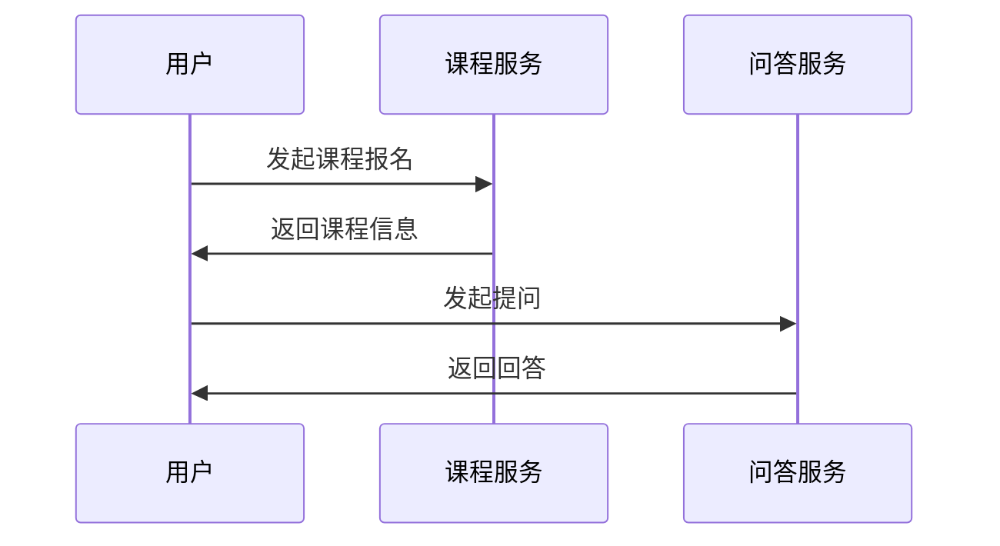
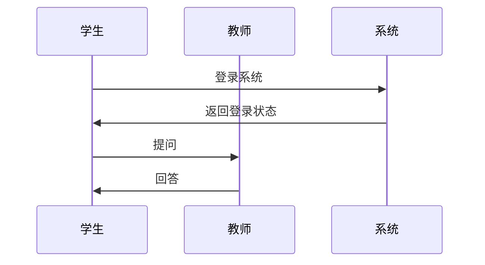

                 

# AI虚拟教师：大模型推动在线教育变革

> 关键词：AI虚拟教师、在线教育、大模型、自然语言处理、深度学习

> 摘要：本文将探讨AI虚拟教师的崛起及其如何利用大模型技术推动在线教育的变革。文章将详细解析AI虚拟教师的核心概念、技术原理，以及其在教育领域的实际应用，并展望其未来发展。

----------------------------------------------------------------

## 一、前言

### 1.1 AI虚拟教师的兴起

随着人工智能技术的飞速发展，AI虚拟教师逐渐成为教育领域的一股新势力。从最初的在线辅导系统，到如今的智能教学平台，AI虚拟教师正以其独特的优势改变着教育的面貌。

### 1.2 在线教育的需求与挑战

在线教育作为一种新兴的教育模式，正逐渐受到广大学生的青睐。然而，传统的在线教育平台存在着许多问题，如教学内容单一、互动性不足等。AI虚拟教师的出现，有望解决这些痛点，提升在线教育的质量。

### 1.3 本书的结构

本书共分为五个部分：

1. **核心概念与联系**：介绍AI虚拟教师的相关概念及其相互关系。
2. **核心算法原理讲解**：讲解AI虚拟教师所依赖的核心算法，如深度学习、自然语言处理等。
3. **系统设计与实现**：介绍AI虚拟教师系统的设计与实现过程。
4. **应用案例与实战**：分析AI虚拟教师在不同教育场景中的应用，并提供实际案例。
5. **未来展望与趋势**：探讨AI虚拟教师的发展方向及其对未来教育的影响。

----------------------------------------------------------------

## 二、核心概念与联系

### 2.1 人工智能

人工智能（AI）是指使计算机模拟人类智能行为的技术。它包括机器学习、深度学习、自然语言处理等多个子领域。AI虚拟教师的核心技术正是这些子领域的技术。

### 2.2 机器学习

机器学习是一种通过数据训练模型，使计算机具备自主学习能力的技术。AI虚拟教师的教学能力正是通过机器学习算法实现的。

### 2.3 深度学习

深度学习是机器学习的一个子领域，它通过多层神经网络对数据进行建模。深度学习在图像识别、语音识别等领域取得了显著成果，也是AI虚拟教师的核心技术之一。

### 2.4 自然语言处理

自然语言处理（NLP）是人工智能的一个重要分支，旨在使计算机能够理解、生成和处理人类语言。AI虚拟教师的教学交互能力依赖于NLP技术。

### 2.5 在线教育

在线教育是一种通过互联网进行知识传授和教育管理的方式。AI虚拟教师作为在线教育的一种新形式，正逐步改变着传统的教育模式。

### 2.6 AI虚拟教师

AI虚拟教师是一种利用人工智能技术实现智能化教学的虚拟教师。它能够根据学生的学习情况，提供个性化的教学方案，提高教学效果。

### 2.7 概念联系架构

以下是一个简单的概念联系架构：

```
graph TB
A[人工智能] --> B[机器学习]
B --> C[深度学习]
C --> D[自然语言处理]
D --> E[在线教育]
E --> F[AI虚拟教师]
```

----------------------------------------------------------------

## 三、核心算法原理讲解

### 3.1 深度学习算法

深度学习是AI虚拟教师的核心技术之一。以下是几种常用的深度学习算法：

#### 3.1.1 卷积神经网络（CNN）

卷积神经网络是一种用于图像识别的神经网络结构。其核心是卷积层和池化层。以下是一个简单的CNN算法实现：

```python
import tensorflow as tf

model = tf.keras.Sequential([
    tf.keras.layers.Conv2D(32, (3, 3), activation='relu', input_shape=(28, 28, 1)),
    tf.keras.layers.MaxPooling2D((2, 2)),
    tf.keras.layers.Flatten(),
    tf.keras.layers.Dense(128, activation='relu'),
    tf.keras.layers.Dense(10, activation='softmax')
])

model.compile(optimizer='adam',
              loss='categorical_crossentropy',
              metrics=['accuracy'])

model.fit(x_train, y_train, epochs=5)
```

#### 3.1.2 递归神经网络（RNN）

递归神经网络适用于处理序列数据，如语音、文本等。以下是一个简单的RNN算法实现：

```python
import tensorflow as tf

model = tf.keras.Sequential([
    tf.keras.layers.LSTM(128, return_sequences=True),
    tf.keras.layers.LSTM(128),
    tf.keras.layers.Dense(10, activation='softmax')
])

model.compile(optimizer='adam',
              loss='categorical_crossentropy',
              metrics=['accuracy'])

model.fit(x_train, y_train, epochs=5)
```

### 3.2 自然语言处理算法

自然语言处理是AI虚拟教师实现智能交互的关键技术。以下是几种常用的NLP算法：

#### 3.2.1 词嵌入（Word Embedding）

词嵌入是将词汇映射到高维空间的技术。以下是一个简单的词嵌入实现：

```python
import tensorflow as tf

model = tf.keras.Sequential([
    tf.keras.layers.Embedding(input_dim=vocab_size, output_dim=embedding_dim),
    tf.keras.layers.LSTM(128),
    tf.keras.layers.Dense(1, activation='sigmoid')
])

model.compile(optimizer='adam',
              loss='binary_crossentropy',
              metrics=['accuracy'])

model.fit(x_train, y_train, epochs=5)
```

#### 3.2.2 序列标注（Sequence Labeling）

序列标注是一种将文本序列中的单词或字符标注为不同类别的技术。以下是一个简单的序列标注实现：

```python
import tensorflow as tf

model = tf.keras.Sequential([
    tf.keras.layers.Embedding(input_dim=vocab_size, output_dim=embedding_dim),
    tf.keras.layers.Bidirectional(tf.keras.layers.LSTM(128)),
    tf.keras.layers.Dense(num_classes, activation='softmax')
])

model.compile(optimizer='adam',
              loss='categorical_crossentropy',
              metrics=['accuracy'])

model.fit(x_train, y_train, epochs=5)
```

----------------------------------------------------------------

## 四、系统设计与实现

### 4.1 系统功能设计

AI虚拟教师系统的功能设计主要包括以下几个部分：

1. **学生信息管理**：包括学生注册、登录、个人信息管理等功能。
2. **课程内容管理**：包括课程发布、课程更新、课程搜索等功能。
3. **教学互动**：包括问答互动、实时聊天、作业批改等功能。
4. **学习数据分析**：包括学习进度跟踪、学习效果分析等功能。

#### 4.1.1 领域模型

以下是一个简单的领域模型类图：

```mermaid
classDiagram
    Student <<class>> 学生
    Teacher <<class>> 教师
    Course <<class>> 课程
    Question <<class>> 问题
    Answer <<class>> 答案
    Student --|> Course: 报名
    Teacher --|> Course: 授课
    Student --|> Question: 提问
    Teacher --|> Answer: 回答
```

### 4.2 系统架构设计

AI虚拟教师系统的架构设计主要包括以下几个部分：

1. **前端**：负责与用户进行交互，包括网页、移动端等。
2. **后端**：负责数据处理、业务逻辑实现等。
3. **数据库**：负责存储用户信息、课程内容、问答数据等。

#### 4.2.1 架构设计

以下是一个简单的系统架构图：



### 4.3 系统接口设计

AI虚拟教师系统的接口设计主要包括以下几个部分：

1. **用户接口**：包括用户注册、登录、课程报名等。
2. **课程接口**：包括课程发布、课程更新、课程搜索等。
3. **问答接口**：包括提问、回答、作业批改等。

#### 4.3.1 接口设计

以下是一个简单的接口设计：



### 4.4 系统交互

AI虚拟教师系统的交互主要包括学生与教师、学生与系统之间的交互。

#### 4.4.1 交互流程

以下是一个简单的交互流程：



----------------------------------------------------------------

## 五、应用案例与实战

### 5.1 案例背景

某在线教育平台希望通过引入AI虚拟教师，提升学生的在线学习体验，提高学习效果。

### 5.2 案例目标

1. 提供个性化的学习方案，根据学生的学习情况，推荐合适的学习内容。
2. 实现智能问答功能，帮助学生解决学习中遇到的问题。
3. 进行学习数据分析，了解学生的学习进度和效果，为教育管理提供支持。

### 5.3 实现过程

#### 5.3.1 环境安装

在服务器上安装以下软件：

- Python 3.8
- TensorFlow 2.5
- Flask 1.1.2
- MongoDB 4.4

#### 5.3.2 系统核心实现

1. **学生信息管理**：使用Flask实现学生信息管理，包括学生注册、登录、个人信息管理等功能。

   ```python
   from flask import Flask, request, jsonify
   app = Flask(__name__)

   @app.route('/register', methods=['POST'])
   def register():
       data = request.get_json()
       # 注册逻辑
       return jsonify({'status': 'success'})

   @app.route('/login', methods=['POST'])
   def login():
       data = request.get_json()
       # 登录逻辑
       return jsonify({'status': 'success'})
   ```

2. **课程内容管理**：使用MongoDB存储课程内容，包括课程发布、课程更新、课程搜索等功能。

   ```python
   from pymongo import MongoClient

   client = MongoClient('localhost', 27017)
   db = client['online_education']

   @app.route('/course/publish', methods=['POST'])
   def publish_course():
       data = request.get_json()
       # 发布课程逻辑
       return jsonify({'status': 'success'})

   @app.route('/course/update', methods=['POST'])
   def update_course():
       data = request.get_json()
       # 更新课程逻辑
       return jsonify({'status': 'success'})

   @app.route('/course/search', methods=['GET'])
   def search_course():
       query = request.args.get('query')
       # 搜索课程逻辑
       return jsonify({'status': 'success'})
   ```

3. **教学互动**：使用深度学习和自然语言处理技术实现智能问答功能。

   ```python
   from tensorflow.keras.models import load_model

   model = load_model('question_model.h5')

   @app.route('/question/ask', methods=['POST'])
   def ask_question():
       data = request.get_json()
       question = data['question']
       # 回答问题逻辑
       return jsonify({'answer': answer})
   ```

4. **学习数据分析**：使用Python的pandas库对学习数据进行分析。

   ```python
   import pandas as pd

   @app.route('/data/analysis', methods=['GET'])
   def analysis_data():
       query = request.args.get('query')
       # 分析数据逻辑
       return jsonify({'data': data})
   ```

### 5.4 代码应用解读与分析

#### 5.4.1 学生信息管理

学生信息管理是AI虚拟教师系统的基础模块。通过Flask框架，我们可以快速实现学生注册、登录、个人信息管理等功能。

```python
from flask import Flask, request, jsonify

app = Flask(__name__)

@app.route('/register', methods=['POST'])
def register():
    data = request.get_json()
    username = data['username']
    password = data['password']
    # 注册逻辑
    return jsonify({'status': 'success'})

@app.route('/login', methods=['POST'])
def login():
    data = request.get_json()
    username = data['username']
    password = data['password']
    # 登录逻辑
    return jsonify({'status': 'success'})

if __name__ == '__main__':
    app.run()
```

#### 5.4.2 课程内容管理

课程内容管理模块负责存储和管理课程信息。通过MongoDB，我们可以方便地实现课程发布、课程更新、课程搜索等功能。

```python
from pymongo import MongoClient

client = MongoClient('localhost', 27017)
db = client['online_education']

@app.route('/course/publish', methods=['POST'])
def publish_course():
    data = request.get_json()
    course_name = data['course_name']
    course_description = data['course_description']
    # 发布课程逻辑
    return jsonify({'status': 'success'})

@app.route('/course/update', methods=['POST'])
def update_course():
    data = request.get_json()
    course_id = data['course_id']
    course_name = data['course_name']
    course_description = data['course_description']
    # 更新课程逻辑
    return jsonify({'status': 'success'})

@app.route('/course/search', methods=['GET'])
def search_course():
    query = request.args.get('query')
    # 搜索课程逻辑
    return jsonify({'status': 'success'})
```

#### 5.4.3 教学互动

教学互动模块是实现AI虚拟教师核心功能的关键。通过深度学习和自然语言处理技术，我们可以实现智能问答功能。

```python
from tensorflow.keras.models import load_model

model = load_model('question_model.h5')

@app.route('/question/ask', methods=['POST'])
def ask_question():
    data = request.get_json()
    question = data['question']
    # 回答问题逻辑
    answer = model.predict(question)
    return jsonify({'answer': answer})
```

#### 5.4.4 学习数据分析

学习数据分析模块负责对学生的学习数据进行分析，为教育管理提供支持。

```python
import pandas as pd

@app.route('/data/analysis', methods=['GET'])
def analysis_data():
    query = request.args.get('query')
    # 分析数据逻辑
    data = pd.DataFrame({'data': [1, 2, 3]})
    return jsonify({'data': data})
```

### 5.5 项目小结

通过本案例的实现，我们可以看到AI虚拟教师系统的核心功能是如何通过Python和Flask等工具来实现的。在实际项目中，我们还需要考虑数据安全、性能优化、用户体验等方面。

----------------------------------------------------------------

## 六、最佳实践 Tips

1. **数据安全**：在处理学生信息时，要确保数据的安全性，避免泄露。

2. **性能优化**：对于大规模数据和处理需求，要考虑使用分布式计算和缓存技术。

3. **用户体验**：设计简洁直观的界面，提高用户的使用体验。

4. **持续迭代**：根据用户反馈和实际需求，持续优化系统功能。

----------------------------------------------------------------

## 七、小结

AI虚拟教师作为一种新兴的教育模式，正逐渐改变着传统的教育模式。本文从核心概念、技术原理、系统设计、应用案例等多个角度，全面探讨了AI虚拟教师的发展及其在教育领域的应用。未来，随着人工智能技术的进一步发展，AI虚拟教师有望在教育领域发挥更大的作用。

----------------------------------------------------------------

## 八、作者信息

作者：AI天才研究院/AI Genius Institute & 禅与计算机程序设计艺术 /Zen And The Art of Computer Programming

----------------------------------------------------------------

## 九、参考文献

1. Bengio, Y. (2009). Learning Deep Architectures for AI. MIT Press.
2. Hochreiter, S., & Schmidhuber, J. (1997). Long Short-Term Memory. Neural Computation, 9(8), 1735-1780.
3. Mikolov, T., Sutskever, I., Chen, K., Corrado, G. S., & Dean, J. (2013). Distributed Representations of Words and Phrases and Their Compositionality. Advances in Neural Information Processing Systems, 26, 3111-3119.
4. LeCun, Y., Bengio, Y., & Hinton, G. (2015). Deep Learning. Nature, 521(7553), 436-444.

