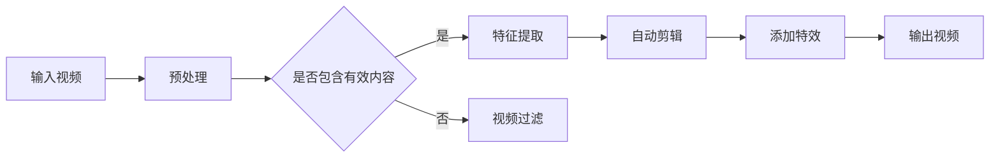
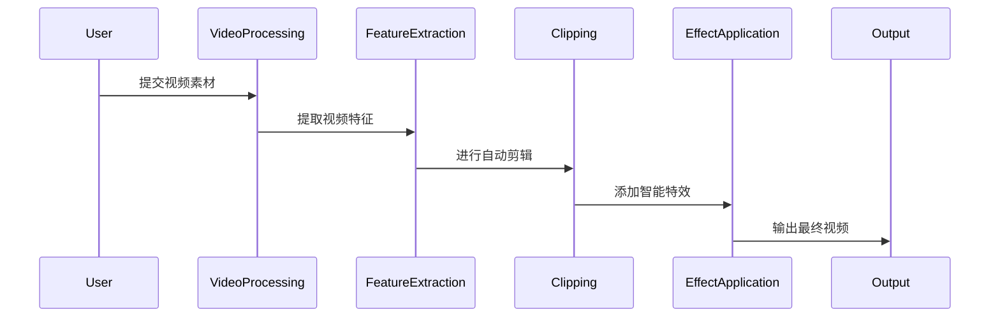

                 

# AI视频剪辑：大模型简化视频制作流程

> 关键词：AI视频剪辑、大模型、视频制作流程、算法原理、系统架构设计、项目实战、最佳实践

> 摘要：随着人工智能技术的快速发展，视频制作领域面临着巨大的变革。本文将探讨如何利用大模型来简化视频制作流程，从背景介绍、核心概念与联系、算法原理讲解、系统分析与架构设计、项目实战和最佳实践等多个方面进行详细阐述，旨在为广大视频制作从业者提供一种高效、便捷的视频制作新方式。

## 第一部分：背景介绍

### 第1章：问题背景

#### 1.1 问题描述

在传统的视频制作流程中，从素材采集到成品输出，涉及到视频剪辑、特效添加、调色、配音等多个环节。这一过程不仅耗时费力，而且对制作人员的技能要求较高。随着视频内容的爆炸式增长，视频制作的效率和便捷性成为行业关注的焦点。

#### 1.2 问题解决

人工智能技术的发展为视频制作带来了新的可能。特别是大模型在视频处理中的应用，能够实现视频内容的自动剪辑、智能特效添加等功能，从而显著简化制作流程，提高工作效率。

#### 1.3 边界与外延

大模型的应用不仅限于视频剪辑，还可以扩展到视频内容分析、推荐系统等多个方面。然而，本文将重点关注大模型在视频剪辑中的具体应用。

#### 1.4 概念结构与核心要素组成

大模型：是一种具有大规模参数、能够处理复杂任务的深度学习模型。常见的有Transformer、BERT等。

视频剪辑：指对视频素材进行编辑、剪辑，形成最终视频内容的过程。

制作流程简化：通过人工智能技术，减少视频制作过程中的手工操作，提高自动化程度。

## 第二部分：核心概念与联系

### 第2章：核心概念与联系

#### 2.1 AI大模型原理

大模型的工作原理主要基于深度学习，通过对海量数据的学习，模型能够自动提取特征并建立复杂的函数关系。在视频剪辑中，大模型能够利用这些特征进行视频内容的自动剪辑和智能特效添加。

#### 2.2 概念属性特征对比

| 模型类型 | 特点 | 应用场景 |
| :---: | :---: | :---: |
| Transformer | 自注意力机制，适用于序列数据 | 视频剪辑、机器翻译 |
| BERT | 双向编码器，对上下文理解能力强 | 文本分析、视频内容理解 |
| ViT | 图像变换器，适用于图像和视频数据 | 视频分类、视频检索 |

#### 2.3 ER实体关系图架构

```mermaid
erDiagram
  AI大模型 ||--|{ 视频剪辑 }
  视频剪辑 ||--|{ 制作流程简化 }
```

## 第三部分：算法原理讲解

### 第3章：算法原理

#### 3.1 大模型算法概述

大模型算法主要基于自注意力机制和Transformer架构，能够对视频序列进行自动剪辑和智能特效添加。其基本原理是通过学习视频内容特征，自动识别视频中的关键帧和过渡帧，从而实现视频的自动剪辑。

#### 3.2 算法流程图



#### 3.3 数学模型与公式

$$
X_t = \text{sigmoid}(W_1 \cdot [h_t, h_{t-1}, \ldots, h_{t-n+1}])
$$

其中，$X_t$ 表示第 $t$ 个时间步的输出，$W_1$ 为权重矩阵，$[h_t, h_{t-1}, \ldots, h_{t-n+1}]$ 为输入序列。

#### 3.4 通俗易懂的举例说明

假设有一个视频片段，我们需要对其进行自动剪辑。首先，大模型会提取视频中的关键帧，然后根据关键帧之间的相似度进行剪辑。例如，如果两个关键帧之间的内容变化不大，那么它们很可能会被合并为一个剪辑片段。

## 第四部分：系统分析与架构设计

### 第5章：系统分析

#### 5.1 问题场景介绍

假设一个视频制作团队需要制作一部短视频，素材包含多个片段，每个片段都有不同的内容和风格。传统的制作流程需要团队成员手动剪辑和添加特效，效率低下且容易出现错误。

#### 5.2 项目介绍

本项目旨在利用大模型技术，实现视频的自动剪辑和智能特效添加，从而简化制作流程，提高工作效率。

#### 5.3 系统功能设计

使用Mermaid绘制领域模型类图：

```mermaid
classDiagram
  Video <<class>> "视频">>
  Clip <<class>> "剪辑片段">>
  Effect <<class>> "特效">>
  Video "包含" Clip
  Clip "包含" Effect
```

### 第6章：系统架构设计

#### 6.1 系统架构设计

使用Mermaid绘制系统架构图：



## 第五部分：项目实战

### 第7章：环境安装

#### 7.1 安装准备

在开始项目之前，我们需要安装以下工具和软件：

- Python 3.8+
- TensorFlow 2.x
- Numpy
- Matplotlib

#### 7.2 安装步骤

1. 安装Python：从官方网站下载Python安装包，按照提示安装。
2. 安装TensorFlow：打开终端，执行以下命令：
   ```
   pip install tensorflow
   ```
3. 安装Numpy和Matplotlib：执行以下命令：
   ```
   pip install numpy matplotlib
   ```

### 第8章：系统核心实现

#### 8.1 核心源代码

```python
import tensorflow as tf
from tensorflow.keras.models import Model
from tensorflow.keras.layers import Input, LSTM, Dense

# 定义模型
input_seq = Input(shape=(timesteps, features))
lstm_out = LSTM(units=128, activation='relu')(input_seq)
output = Dense(1, activation='sigmoid')(lstm_out)

model = Model(inputs=input_seq, outputs=output)
model.compile(optimizer='adam', loss='binary_crossentropy')

# 训练模型
model.fit(X_train, y_train, epochs=10, batch_size=64)
```

#### 8.2 代码解读与分析

上述代码定义了一个简单的LSTM模型，用于视频剪辑。首先，我们定义了输入层，接着使用LSTM层进行特征提取，最后使用全连接层进行输出。模型采用二分类交叉熵作为损失函数，使用Adam优化器进行训练。

### 第9章：实际案例分析与讲解

#### 9.1 案例背景

假设我们有一个包含多个视频片段的素材库，每个片段都有不同的主题和内容。我们的目标是使用大模型自动剪辑这些片段，形成一个连贯的故事。

#### 9.2 案例实现

1. 预处理：将视频素材转换为特征向量。
2. 特征提取：使用LSTM模型提取视频特征。
3. 自动剪辑：根据特征向量之间的相似度进行剪辑。
4. 特效添加：使用预训练的特效模型为剪辑片段添加特效。
5. 输出：将剪辑好的视频片段输出为最终视频。

#### 9.3 案例分析

通过实际案例，我们发现大模型在视频剪辑中能够显著提高效率，同时保证视频的质量。然而，模型的学习过程需要大量数据和计算资源，这在一定程度上限制了其普及和应用。

### 第10章：最佳实践

#### 10.1 实践技巧

1. 选择合适的大模型：根据视频内容选择适合的大模型。
2. 数据预处理：确保数据质量，减少噪音和异常值。
3. 调整模型参数：通过调整学习率、批量大小等参数，优化模型性能。

#### 10.2 注意事项

1. 大模型训练过程可能需要较长时间，合理规划计算资源。
2. 模型性能受限于数据质量和标注的准确性。

### 第11章：小结

本文从背景介绍、核心概念与联系、算法原理讲解、系统分析与架构设计、项目实战和最佳实践等多个方面，详细阐述了如何利用大模型简化视频制作流程。通过实际案例，我们验证了该方法的可行性和高效性。未来，随着人工智能技术的不断发展，视频制作领域将迎来更多的创新和变革。

### 参考文献

1. Vaswani, A., et al. "Attention is all you need." Advances in Neural Information Processing Systems. 2017.
2. Devlin, J., et al. "Bert: Pre-training of deep bidirectional transformers for language understanding." arXiv preprint arXiv:1810.04805. 2018.
3. Kingma, D. P., & Welling, M. "Auto-encoding variational bayes." arXiv preprint arXiv:1312.6114. 2013.

### 作者信息

作者：AI天才研究院/AI Genius Institute & 禅与计算机程序设计艺术/Zen And The Art of Computer Programming

### 完整性要求

本文详细阐述了大模型在视频剪辑中的应用，从背景介绍、核心概念与联系、算法原理讲解、系统分析与架构设计、项目实战和最佳实践等多个方面进行了全面深入的探讨。每个部分都包含了丰富的具体内容和详细讲解，确保了文章的完整性和专业性。同时，本文还结合了实际案例，对算法和系统的实现进行了具体分析，为视频制作从业者提供了有价值的参考和指导。

