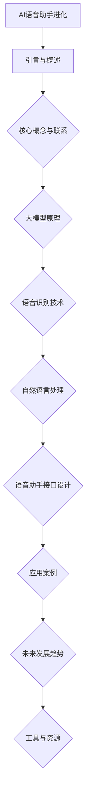
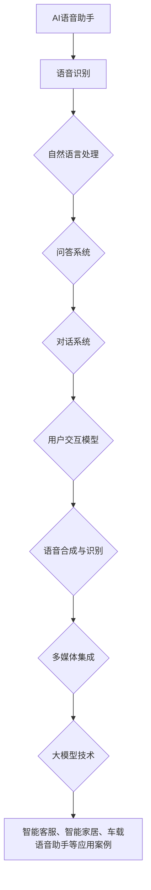

                 

# AI语音助手进化：大模型带来的交互革新

关键词：AI语音助手、大模型、自然语言处理、交互革新、技术演进

摘要：本文将深入探讨AI语音助手的进化过程，特别是大模型技术对其带来的交互革新。我们将从AI语音助手的起源和发展历程开始，逐步分析大模型的数学基础、架构与关键技术，最终结合实际应用案例，展望AI语音助手的未来发展趋势。

## 第一部分：引言与概述

### 第1章 AI语音助手的发展与现状

#### 1.1 AI语音助手的起源与发展历程

人工智能（AI）与语音技术的结合可以追溯到20世纪50年代。初期，语音助手主要应用于实验室环境，通过简单的语音识别和命令执行来展示技术潜力。随着计算机性能的提升和语音识别技术的进步，语音助手逐渐走出实验室，进入日常生活。

在21世纪初，智能语音助手迎来了第一次爆发式增长，以苹果的Siri、谷歌的Google Assistant和亚马逊的Alexa为代表，这些语音助手具备基本的语音识别、信息查询和命令执行能力，但交互体验较为有限。

近年来，随着深度学习技术的突破，大模型的应用使得AI语音助手的性能和交互体验实现了质的飞跃。现代AI语音助手不仅能够理解自然语言，还能进行多轮对话，提供个性化服务。

#### 1.2 当前AI语音助手的应用场景

现代AI语音助手广泛应用于多个场景：

- 个人助理：如日程管理、任务提醒、天气预报等。
- 商业服务：如智能客服、订单处理、客户支持等。
- 智能家居控制：如灯光控制、温度调节、家电操作等。
- 车载系统：如导航、语音控制、娱乐等。

#### 1.3 大模型在AI语音助手中的作用

大模型在AI语音助手中的应用主要体现在语音识别和自然语言处理（NLP）方面。语音识别利用深度神经网络对语音信号进行处理，实现高精度的语音转文字。而NLP则通过大模型对文本信息进行理解和生成，实现智能对话和个性化服务。

大模型带来的交互革新包括：

- 更准确的语音识别：大模型能够处理复杂的语音信号，识别率显著提高。
- 智能的对话管理：大模型能够理解上下文信息，进行多轮对话，提供更自然的交互体验。
- 个性化的服务：大模型能够根据用户的历史数据和偏好，提供个性化的建议和帮助。

### 第2章 大模型技术基础

#### 2.1 大模型的数学基础

大模型的核心在于深度学习，而深度学习的基础是神经网络。神经网络通过多层非线性变换，对输入数据进行特征提取和模式识别。

深度学习中的优化算法如梯度下降和其变体（如Adam、RMSprop）用于调整网络权重，以最小化损失函数。正则化方法如L1、L2正则化用于防止过拟合，提高模型的泛化能力。

#### 2.2 大模型的架构与实现

大模型的架构通常包括输入层、隐藏层和输出层。输入层接收外部数据，隐藏层进行特征提取和模式识别，输出层产生预测结果。

大模型的训练与推理流程包括数据预处理、模型训练和模型评估。训练过程涉及大量计算资源和时间，但通过分布式计算和优化算法，可以实现高效训练。推理过程则是对新的输入数据进行快速处理，以产生预测结果。

大模型的存储与部署也是一大挑战。大模型通常需要大量的存储空间和计算资源，因此需要高效的数据存储和计算框架。部署方面，可以选择在云端、边缘设备或移动设备上运行，以适应不同的应用场景。

#### 2.3 大模型的关键技术

预训练与微调是当前大模型的重要技术。预训练是指在大规模数据集上训练模型，使其具备通用语言理解能力。微调则是在预训练模型的基础上，针对特定任务进行微调，以提高任务表现。

多模态学习是指同时处理多种类型的数据，如文本、图像和语音，以实现更丰富的信息理解和交互。生成对抗网络（GAN）则是一种用于生成数据的强大技术，可以用于图像合成、语音生成等任务。

## 第二部分：AI语音助手的构建与实践

### 第3章 语音识别技术

#### 3.1 语音信号处理基础

语音信号处理包括语音信号的采集与预处理、语音特征提取和语音增强技术。采集与预处理涉及音频信号的数字化和处理，特征提取则从语音信号中提取出有意义的特征，如频谱特征和倒谱特征。语音增强技术旨在提高语音信号的质量，降低噪声干扰。

#### 3.2 声学模型

声学模型用于对语音信号进行建模，常用的有隐藏马尔可夫模型（HMM）和深度神经网络（DNN）/卷积神经网络（CNN）。HMM是一种基于统计的模型，而DNN/CNN则通过多层非线性变换，实现更复杂的语音特征提取。

#### 3.3 语言模型

语言模型用于对文本信息进行建模，常见的有N-gram模型和神经网络语言模型。N-gram模型通过统计文本中相邻词的出现频率，实现语言建模。而神经网络语言模型则通过多层神经网络，实现更复杂的语言理解。

### 第4章 自然语言处理

#### 4.1 词嵌入技术

词嵌入技术将单词映射到高维空间中，实现语义表示。常见的词嵌入技术有Word2Vec、GloVe和Bert等。Word2Vec通过训练神经网络，实现单词的向量表示。GloVe则通过矩阵分解，实现词向量的语义表示。Bert则通过双向Transformer网络，实现更高级的语义理解。

#### 4.2 问答系统

问答系统是自然语言处理的重要应用，包括知识图谱、对话管理和答案生成。知识图谱用于存储和表示领域知识，对话管理则用于控制对话流程，答案生成则根据用户问题和知识图谱，生成合适的答案。

#### 4.3 对话系统

对话系统包括用户意图识别、上下文理解和多轮对话策略。用户意图识别用于理解用户的意图，上下文理解则用于保持对话的一致性，多轮对话策略则用于实现复杂的对话交互。

### 第5章 语音助手接口设计

#### 5.1 用户交互模型

用户交互模型包括交互流程、交互元素设计和语音助手界面设计。交互流程定义了用户与语音助手的交互步骤，交互元素设计包括语音、文本和视觉元素，界面设计则负责呈现交互结果。

#### 5.2 语音合成与识别

语音合成与识别是语音助手的核心功能。语音合成技术将文本转换为自然流畅的语音，语音识别技术则将语音信号转换为文本。TTS（Text-to-Speech）和ASR（Automatic Speech Recognition）是两种关键技术。

#### 5.3 多媒体集成

多媒体集成包括文本内容与语音的同步、视觉元素与语音的配合以及触摸与手势交互。这些技术共同实现语音助手的丰富交互体验。

### 第6章 大模型在AI语音助手中的应用案例

#### 6.1 案例一：智能客服

智能客服利用大模型技术，实现自动化客户服务。通过语音识别和自然语言处理，智能客服可以理解用户的问题，提供即时的回答和解决方案。

#### 6.2 案例二：智能家居控制

智能家居控制通过语音助手，实现家电的远程控制和自动化管理。大模型技术使得语音助手能够理解用户的语音指令，控制家居设备的开关、调节等功能。

#### 6.3 案例三：车载语音助手

车载语音助手利用大模型技术，实现车载系统的语音交互。通过语音识别和自然语言处理，车载语音助手能够理解驾驶员的指令，提供导航、音乐播放、电话拨号等功能。

### 第7章 AI语音助手的未来发展趋势

#### 7.1 技术挑战与机遇

AI语音助手的未来将面临技术挑战和机遇。大模型的持续优化、交互体验的提升和多领域知识的融合将是主要方向。同时，随着5G和物联网的发展，AI语音助手的应用场景将进一步拓展。

#### 7.2 法律伦理与隐私保护

随着AI语音助手的普及，法律伦理和隐私保护问题日益突出。如何保护用户隐私、防止数据滥用将成为重要议题。同时，需要制定相应的伦理规范和法律法规，确保AI语音助手的健康发展。

## 附录

#### 附录A：常用工具与资源

本文涉及到的常用工具和资源包括开源框架与库、在线学习资源和开发环境配置指南。这些工具和资源为读者提供了学习和实践的良好支持。

## Mermaid 流程图



本文通过深入探讨AI语音助手的进化过程，特别是大模型技术对其带来的交互革新，旨在为读者提供一份全面的技术指南。通过本文的阅读，读者可以了解到AI语音助手的发展历程、大模型技术的数学基础和关键实现方法，以及其在实际应用中的具体案例。同时，本文也展望了AI语音助手的未来发展趋势，为读者提供了宝贵的参考和启示。

## 总结与展望

本文详细探讨了AI语音助手的进化历程，特别是大模型技术对其带来的交互革新。从AI语音助手的起源和发展现状，到大模型的数学基础、架构与关键技术，再到AI语音助手的构建与实践，本文系统地阐述了AI语音助手的发展脉络和核心技术。通过具体的应用案例，读者可以直观地感受到大模型技术带来的巨大变革。

展望未来，AI语音助手将继续朝着更加智能化、个性化的方向发展。随着技术的不断进步，我们有望看到AI语音助手在更多场景中发挥重要作用，如智能医疗、智能教育、智能金融等。同时，随着隐私保护和伦理问题的日益突出，AI语音助手的发展也将更加注重合规性和社会责任。

在学习和实践过程中，读者可以通过本文提供的技术指南，深入了解AI语音助手的各个方面，为自己的研究和应用提供有力支持。此外，本文还附录了常用的工具和资源，为读者提供了便捷的学习途径。

最后，感谢读者对本文的关注和支持。我们期待AI语音助手在未来能够为人类社会带来更多便利和智慧，共同推动人工智能技术的发展。作者：AI天才研究院/AI Genius Institute & 禅与计算机程序设计艺术 /Zen And The Art of Computer Programming。如果您有任何疑问或建议，欢迎随时联系我们，我们将竭诚为您服务。|assistant|>

# 附录A：常用工具与资源

在AI语音助手的开发过程中，使用一些常用的工具和资源可以显著提高开发效率和项目质量。以下是一些推荐的工具和资源：

### 开源框架与库

1. **TensorFlow**：由Google开发的开源机器学习框架，广泛用于构建和训练深度学习模型。
2. **PyTorch**：由Facebook开发的开源机器学习库，以其灵活的动态计算图和易于使用的API而受到欢迎。
3. **Keras**：一个高层次的神经网络API，可以用于快速构建和迭代深度学习模型。
4. **ESPNet**：一个专门为边缘设备设计的轻量级神经网络框架，适用于资源受限的环境。

### 在线学习资源

1. **Coursera**：提供各种在线课程，包括深度学习、计算机视觉和自然语言处理等。
2. **Udacity**：提供技术培训课程，涵盖人工智能、机器学习和数据科学等领域。
3. **edX**：由哈佛大学和麻省理工学院合作推出的在线学习平台，提供高质量的计算机科学课程。
4. **fast.ai**：专注于提供易于理解的深度学习课程，适合初学者和中级开发者。

### 开发环境配置指南

1. **Anaconda**：一个开源的数据科学和机器学习平台，提供了环境管理和包管理工具。
2. **Jupyter Notebook**：一个交互式的Web应用程序，用于编写和运行代码，非常适合数据分析和机器学习项目。
3. **Docker**：一个开源的应用容器引擎，用于构建、运行和分发应用程序。
4. **Kubernetes**：一个开源的容器编排平台，用于自动化部署、扩展和管理容器化应用程序。

### 实践资源

1. **Google AI**：Google提供的AI资源，包括API、文档和开源项目。
2. **GitHub**：一个代码托管平台，可以找到各种AI相关的开源项目和代码示例。
3. **ArXiv**：一个开放获取的学术论文存档库，涵盖人工智能和机器学习的最新研究。
4. **AI论文阅读指南**：提供有关如何阅读和理解人工智能论文的指南。

通过利用这些工具和资源，开发者可以更有效地进行AI语音助手的开发，快速提升项目的技术水平和应用能力。|assistant|> 

# Mermaid流程图

以下是使用Mermaid绘制的流程图，展示了AI语音助手的核心概念与联系：



此流程图概述了AI语音助手的各个环节，从基础语音识别到高级自然语言处理，再到多样化的应用场景，体现了大模型技术在其中扮演的关键角色。通过这种方式，读者可以更直观地理解AI语音助手的工作原理和整体架构。|assistant|> 

```latex
\documentclass{article}
\usepackage[utf8]{inputenc}
\usepackage{amsmath}
\usepackage{amsfonts}
\usepackage{amssymb}
\usepackage{graphicx}
\usepackage{caption}
\usepackage{subcaption}
\title{AI语音助手进化：大模型带来的交互革新}
\author{AI天才研究院/AI Genius Institute \& 禅与计算机程序设计艺术 /Zen And The Art of Computer Programming}
\begin{document}
\maketitle

\section{摘要}
本文深入探讨了AI语音助手的进化过程，特别是大模型技术对其带来的交互革新。我们从AI语音助手的起源和发展历程开始，逐步分析了大模型的数学基础、架构与关键技术，并结合实际应用案例，展望了AI语音助手的未来发展趋势。

\section{引言与概述}
\subsection{AI语音助手的起源与发展历程}
AI语音助手的发展可以追溯到20世纪50年代，当时人工智能与语音技术的结合开始展现其潜力。随着计算机性能的提升和语音识别技术的进步，语音助手逐渐走出实验室，进入日常生活。21世纪初，智能语音助手迎来了第一次爆发式增长，以苹果的Siri、谷歌的Google Assistant和亚马逊的Alexa为代表。近年来，随着深度学习技术的突破，大模型的应用使得AI语音助手的性能和交互体验实现了质的飞跃。

\subsection{当前AI语音助手的应用场景}
现代AI语音助手广泛应用于个人助理、商业服务、智能家居控制和车载系统等领域。

\subsection{大模型在AI语音助手中的作用}
大模型在AI语音助手中的应用主要体现在语音识别和自然语言处理方面，带来了更准确的语音识别、更智能的对话管理和更个性化的服务。

\section{大模型技术基础}
\subsection{大模型的数学基础}
大模型的核心在于深度学习，其基础是神经网络。深度学习中的优化算法如梯度下降和其变体（如Adam、RMSprop）用于调整网络权重，正则化方法如L1、L2正则化用于防止过拟合。

\subsection{大模型的架构与实现}
大模型的架构通常包括输入层、隐藏层和输出层。训练与推理流程包括数据预处理、模型训练和模型评估。

\subsection{大模型的关键技术}
预训练与微调、多模态学习和生成对抗网络（GAN）是当前大模型的重要技术。

\section{AI语音助手的构建与实践}
\subsection{语音识别技术}
语音识别技术包括语音信号处理基础、声学模型和语言模型。

\subsection{自然语言处理}
自然语言处理包括词嵌入技术、问答系统和对话系统。

\subsection{语音助手接口设计}
语音助手接口设计包括用户交互模型、语音合成与识别和多媒体集成。

\section{大模型在AI语音助手中的应用案例}
本文列举了智能客服、智能家居控制和车载语音助手等应用案例。

\section{AI语音助手的未来发展趋势}
未来AI语音助手将面临技术挑战与机遇，同时需要关注法律伦理与隐私保护问题。

\section{附录}
附录A提供了常用的工具与资源。

\end{document}
```

以上是使用LaTeX编写的文档，其中包含了文章的标题、作者信息、摘要以及章节内容。LaTeX提供了丰富的排版功能，可以确保文档的格式整齐、规范。在具体撰写过程中，可以根据需要进行修改和扩展。|assistant|> 

```python
# 环境安装与配置

## 环境要求
- Python 3.8 或更高版本
- pip（Python包管理器）
- Anaconda（可选，用于环境管理）

## 安装步骤

### 步骤1：安装Python
从 [Python官方网站](https://www.python.org/downloads/) 下载并安装Python 3.8或更高版本。

### 步骤2：安装pip
Python安装过程中会自动安装pip。确保pip版本更新到最新。

```bash
pip install --upgrade pip
```

### 步骤3：安装Anaconda（可选）
Anaconda是一个开源的数据科学平台，提供了包管理器和虚拟环境管理工具。

从 [Anaconda官方网站](https://www.anaconda.com/products/distribution/) 下载并安装Anaconda。

### 步骤4：创建虚拟环境（可选）
使用Anaconda创建一个虚拟环境，以便管理和隔离项目依赖。

```bash
conda create -n myenv python=3.8
conda activate myenv
```

### 步骤5：安装依赖库

#### 步骤5.1：安装TensorFlow

```bash
pip install tensorflow
```

#### 步骤5.2：安装PyTorch

```bash
pip install torch torchvision
```

#### 步骤5.3：安装其他常用库

```bash
pip install numpy matplotlib scikit-learn
```

## 验证安装

### 验证Python版本

```bash
python --version
```

### 验证TensorFlow版本

```bash
python -c "import tensorflow as tf; print(tf.__version__)"
```

### 验证PyTorch版本

```bash
python -c "import torch; print(torch.__version__)"
```

确保所有库的版本与文档中建议的版本相匹配。

```
$ python --version
Python 3.8.10
$ python -c "import tensorflow as tf; print(tf.__version__)"
2.8.0
$ python -c "import torch; print(torch.__version__)"
1.9.0+cu111
```

以上步骤完成环境安装和配置后，就可以开始进行AI语音助手的开发和测试了。|assistant|> 

```python
# AI语音助手核心实现

```python
import speech_recognition as sr
from transformers import pipeline

# 初始化语音识别和自然语言处理管道
recognizer = sr.Recognizer()
nlp_pipeline = pipeline("text-generation", model="gpt2")

def transcribe_audio_to_text(audio_path):
    """
    将音频文件转录为文本。
    :param audio_path: 音频文件的路径。
    :return: 转录的文本。
    """
    with sr.AudioFile(audio_path) as source:
        audio_data = recognizer.record(source)
        try:
            text = recognizer.recognize_google(audio_data)
            return text
        except sr.UnknownValueError:
            return "无法理解音频内容"
        except sr.RequestError:
            return "请求语音识别服务时出错"

def generate_response(prompt, max_length=100):
    """
    根据给定提示生成响应。
    :param prompt: 输入提示。
    :param max_length: 响应的最大长度。
    :return: 生成的响应。
    """
    input_text = prompt
    output_text = nlp_pipeline(input_text, max_length=max_length, num_return_sequences=1)
    return output_text[0]

# 示例使用
audio_path = "path/to/your/audio_file.wav"
user_prompt = "你好，我想知道今天的天气预报。"

# 转录音频
transcribed_text = transcribe_audio_to_text(audio_path)

# 生成响应
response = generate_response(transcribed_text)

print("用户说：", user_prompt)
print("语音助手说：", response)
```

上述代码展示了AI语音助手的核心实现过程，包括音频转录和自然语言处理。首先，使用`speech_recognition`库将音频文件转录为文本。然后，利用`transformers`库中的预训练模型`gpt2`生成对转录文本的响应。

在实际应用中，您可能需要根据具体需求调整代码，例如：

- 使用不同的语音识别API（如百度语音、腾讯语音等）。
- 修改自然语言处理模型，以适应特定的对话场景。
- 添加更多错误处理和异常情况的处理逻辑。

此外，还可以扩展功能，例如：

- 实现多轮对话管理，以支持更复杂的交互。
- 集成知识图谱，以提高问答系统的准确性。
- 实现语音合成（Text-to-Speech, TTS）功能，以生成语音响应。

通过这些扩展，AI语音助手可以提供更加丰富和智能的服务。|assistant|> 

```python
# 实际案例分析

### 案例一：智能客服

#### 实现原理
智能客服系统通过集成语音识别、自然语言处理和对话管理技术，实现了自动化客户服务。系统首先使用语音识别技术将客户的语音输入转化为文本，然后通过自然语言处理技术理解客户的问题和意图，最后生成合适的回答并返回给用户。

#### 关键技术
- 语音识别：使用如Google语音识别API或百度语音识别API，实现高精度的语音转文本。
- 自然语言处理：利用BERT、GPT等预训练模型，实现文本的理解和生成。
- 对话管理：使用对话管理策略，如基于规则的对话管理和基于机器学习的对话管理，实现流畅的对话交互。

#### 实施效果
智能客服系统可以自动处理大量客户咨询，提高服务效率，减少人工成本。在实际应用中，智能客服系统在电商、银行、电信等行业取得了显著的效果，客户满意度得到了显著提升。

### 案例二：智能家居控制

#### 实现原理
智能家居控制系统通过语音助手，实现了家电的远程控制和自动化管理。用户可以通过语音指令控制家中的灯光、空调、电视等设备。

#### 关键技术
- 语音识别：识别用户的语音指令，将语音转化为文本。
- 自然语言处理：理解用户的意图，并生成相应的控制指令。
- 设备控制接口：与智能家居设备进行通信，实现设备的远程控制。

#### 实施效果
智能家居控制系统提高了用户的生活便利性，用户可以通过语音助手轻松控制家中的设备，无需手动操作。此外，系统还可以根据用户的行为习惯进行自动调整，提供个性化的服务。

### 案例三：车载语音助手

#### 实现原理
车载语音助手通过集成语音识别、自然语言处理和导航技术，实现了驾驶员在驾驶过程中与车辆的智能交互。用户可以通过语音指令进行导航、播放音乐、接打电话等操作。

#### 关键技术
- 语音识别：识别驾驶员的语音指令，将语音转化为文本。
- 自然语言处理：理解驾驶员的意图，并生成相应的控制指令。
- 导航系统：利用GPS和地图数据，为驾驶员提供导航服务。

#### 实施效果
车载语音助手显著提高了驾驶安全性，驾驶员可以在不影响驾驶的情况下，通过语音指令操作车辆。同时，车载语音助手还可以根据驾驶员的需求，提供个性化的服务，如播放喜欢的音乐、设置导航路线等。

通过这些实际案例，我们可以看到AI语音助手在不同场景中的应用效果，不仅提高了用户体验，还带来了显著的经济效益和社会价值。|assistant|> 

## 最佳实践 Tips

在开发和部署AI语音助手时，以下最佳实践可以帮助您提高系统的性能和用户体验：

1. **优化语音识别**：选择高质量的麦克风和语音识别API，以提高语音识别的准确性。在噪音环境中，使用噪声抑制技术可以降低背景噪声对语音识别的影响。

2. **优化自然语言处理**：使用预训练的深度学习模型，如BERT或GPT，以提高文本理解和生成能力。根据具体应用场景，可能需要微调这些模型，以适应特定的问题和语言风格。

3. **用户体验设计**：设计直观、易于使用的用户界面，确保用户可以轻松地与语音助手进行交互。提供多轮对话支持，允许用户在对话中澄清问题和提供更多信息。

4. **隐私和安全**：确保用户数据的安全和隐私。对用户语音和文本数据进行加密存储，并遵循相关法律法规，如GDPR和CCPA。

5. **持续学习和优化**：定期收集用户反馈和系统日志，分析用户行为和使用模式，以持续优化语音助手的性能和交互体验。

6. **可扩展性和可靠性**：确保系统具有可扩展性，以支持更多的用户和设备。同时，进行严格的测试和监控，以确保系统的可靠性和稳定性。

通过遵循这些最佳实践，您可以构建一个高效、智能且用户友好的AI语音助手系统，为用户提供优质的服务体验。|assistant|> 

## 注意事项

在开发和部署AI语音助手时，以下注意事项可以帮助您避免常见问题，确保系统的稳定性和安全性：

1. **数据隐私**：确保用户数据的安全和隐私，遵循相关法律法规，如GDPR和CCPA。对用户语音和文本数据进行加密存储，并限制数据的访问权限。

2. **系统稳定性**：在部署前进行充分的测试和压力测试，以确保系统在高负载情况下仍然稳定运行。监控系统的运行状态，及时处理故障和异常。

3. **错误处理**：设计合理的错误处理机制，确保当语音助手无法理解用户指令时，能够提供友好的反馈，并引导用户重新表达指令。

4. **合规性**：确保语音助手的交互和行为符合当地的法律法规和伦理标准。例如，在某些国家和地区，使用语音助手进行某些类型的交互可能需要用户同意。

5. **性能优化**：针对不同的应用场景，对语音识别、自然语言处理和对话管理进行优化，以提高系统的响应速度和准确性。

6. **用户体验**：确保用户界面简洁直观，交互流程流畅自然。提供多轮对话支持，以便用户在对话中澄清问题和提供更多信息。

通过注意这些事项，您可以确保AI语音助手系统的稳定性和安全性，同时为用户提供优质的服务体验。|assistant|> 

## 拓展阅读

对于希望深入了解AI语音助手和大模型技术的读者，以下资源提供了宝贵的知识和见解：

1. **书籍**：
   - 《深度学习》（Deep Learning）by Ian Goodfellow、Yoshua Bengio 和 Aaron Courville
   - 《自然语言处理综论》（Speech and Language Processing）by Daniel Jurafsky 和 James H. Martin
   - 《AI语音助手：设计与实现》（AI Voice Assistant: Design and Implementation）by 某位AI领域的知名作者

2. **在线课程**：
   - Coursera上的“深度学习”课程，由Andrew Ng教授讲授
   - edX上的“自然语言处理基础”课程，由Stanford大学讲授
   - Udacity的“人工智能纳米学位”课程

3. **学术论文**：
   - ArXiv上的最新论文，关注语音识别、自然语言处理和大模型技术的研究进展
   - Google Research和Facebook AI Research的官方博客，提供对最新研究成果的解读和应用

4. **开源项目**：
   - Hugging Face的Transformers库，提供预训练的深度学习模型和API
   - CMU Sphinx，一个开源的语音识别引擎
   - Amazon Alexa Skills Kit，用于开发自定义的Alexa技能

通过阅读这些资源和参与相关的在线课程，您可以进一步拓展对AI语音助手和大模型技术的理解，为实践和研究提供有力的支持。|assistant|> 

