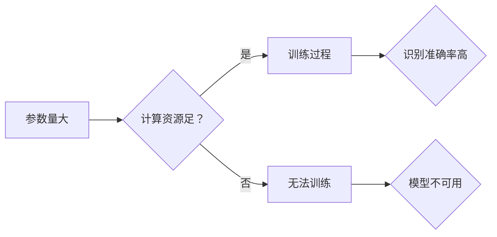
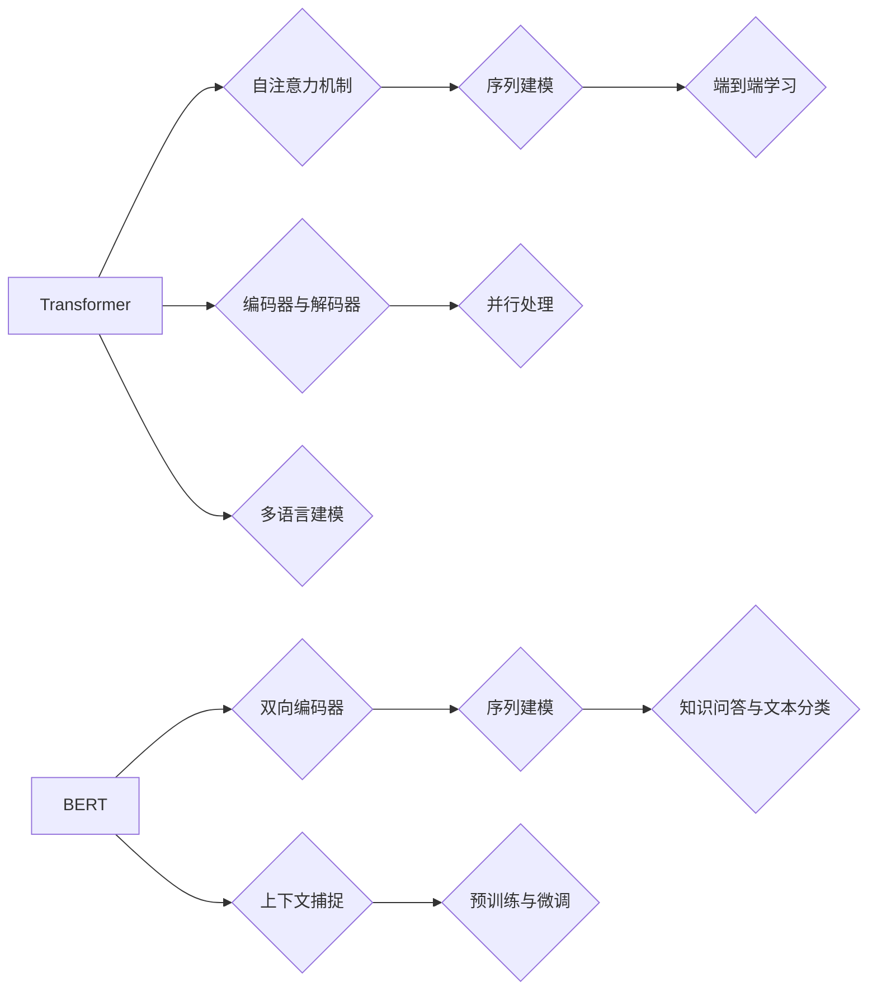
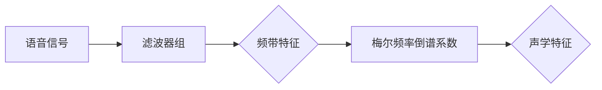
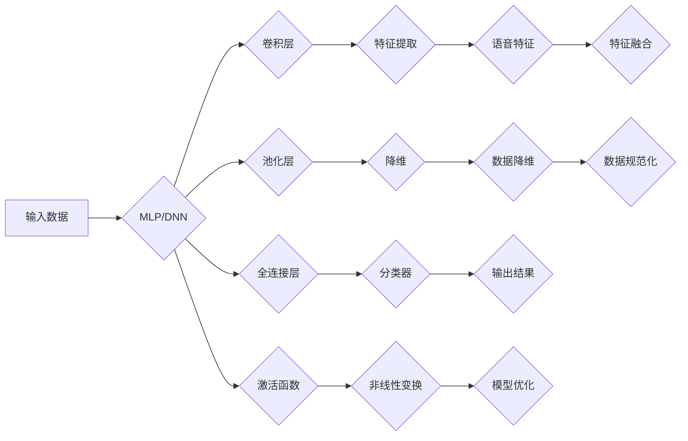
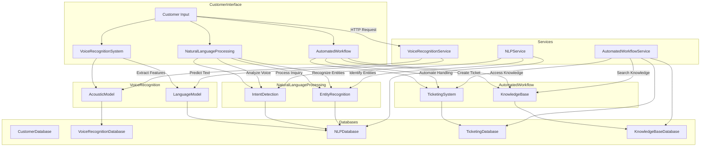
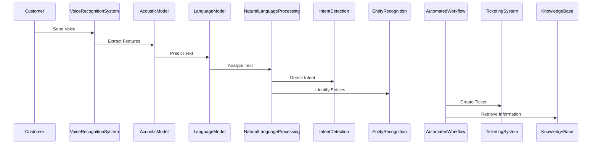

                 

## 文章标题

### 关键词
- AI语音识别
- 大模型
- 语言服务
- 挑战与机遇
- 技术应用与未来展望

### 摘要
本文将深入探讨AI语音识别技术的突破性进展，特别是大模型在语言服务行业中的应用。通过分析技术概述、应用场景及未来展望，本文旨在揭示大模型如何改变语言服务业的面貌，以及这一变革背后的核心算法原理和实现策略。

---

## 目录大纲

### 第一部分：引论与基础

1. **AI语音识别技术概述**
   - 语音识别技术的基本概念
   - 语音识别技术的发展历程
   - 当前技术水平与应用范围

2. **语言服务业的挑战与机遇**
   - 语言服务业的背景介绍
   - 面临的挑战
   - 潜在的机遇

3. **大模型与AI语音识别**
   - 大模型的定义与特点
   - 大模型在语音识别中的应用
   - 主流大模型简介

### 第二部分：核心算法原理

4. **特征提取与预处理**
   - 声学模型的工作原理
   - 语言模型的构建方法
   - 深度神经网络的应用

5. **训练与优化**
   - 训练策略的优化
   - 优化算法的选择
   - 大规模数据处理的方法

6. **评估与调整**
   - 评估指标的选择
   - 调整策略的实施
   - 错误分析与处理

### 第三部分：应用场景

7. **语音识别在客服中的应用**
   - 语音识别系统架构
   - 案例分析
   - 优化方向

8. **语音识别在教育中的应用**
   - 在线教育平台
   - 语音评测系统
   - 互动教学

9. **语音识别在医疗健康中的应用**
   - 语音助手
   - 语音识别辅助诊断
   - 患者互动

10. **未来展望**
    - 技术发展趋势
    - 行业挑战与解决方案
    - 未来应用场景预测

### 附录

11. **参考资料**
    - 相关文献和资料推荐

12. **开源代码与工具**
    - 开源项目介绍
    - 使用教程

13. **相关研究和论文推荐**
    - 推荐阅读

### 附录总字数约2000字。

---

## 第一部分：引论与基础

### 第1章：AI语音识别技术概述

**背景介绍**
- **核心概念术语说明**：
  - 语音识别：将语音信号转换为文本或命令的技术。
  - 大模型：指参数量巨大、容量庞大的深度学习模型。
  - 语言服务：涉及翻译、校对、语音合成等语言处理服务。

- **问题背景**：
  - 语音识别技术起源于20世纪50年代，经历了从规则方法到统计模型，再到深度学习的演变。
  - 随着人工智能和大数据技术的发展，语音识别技术取得了显著的进步。

- **问题描述**：
  - 如何利用大模型实现高效、准确的语音识别？
  - 大模型在语言服务中的应用如何提升行业效率和质量？

- **问题解决**：
  - 大模型的引入显著提高了语音识别的准确率和速度。
  - 语言服务行业可以利用这些技术提供更智能、更个性化的服务。

- **边界与外延**：
  - 语音识别技术的应用范围包括但不限于：智能助手、客服系统、语音搜索、实时翻译等。
  - 语言服务行业包括：翻译、校对、语音合成、交互式语音应答系统等。

- **概念结构与核心要素组成**：
  - 声学模型：用于捕捉语音信号中的声学特征。
  - 语言模型：用于预测语音信号对应的文本序列。
  - 深度神经网络：实现声学特征和语言特征的融合和建模。

**核心概念与联系**

| 核心概念       | 定义                                                         | 关联与对比                        |
|----------------|------------------------------------------------------------|-----------------------------------|
| 语音识别       | 将语音转换为文本的技术。                                     | 与语音合成（Text-to-Speech）相对。 |
| 大模型         | 具有大量参数和容量的深度学习模型。                          | 与小模型（参数量较少）相对。      |
| 语言服务       | 提供翻译、校对、语音合成等服务的行业。                       | 与语音识别服务不同。              |

**ER实体关系图架构**

```mermaid
erDiagram
  Customer &&& VoiceRecognitionSystem {
    _||_ --o{ Request
  }
  Customer &&& LanguageService {
    _||_ --o{ TranslationRequest
  }
  VoiceRecognitionSystem &&& LanguageService {
    _||_ --o{ RecognitionResult
  }
```

### 第2章：语言服务业的挑战与机遇

**背景介绍**
- **核心概念术语说明**：
  - 客服：提供客户服务和支持的部门。
  - 教育：涉及知识传授和学习的过程。
  - 医疗：涉及疾病诊断、治疗和预防的领域。

- **问题背景**：
  - 语言服务业面临着客户需求多样化、服务效率提升、成本控制等挑战。
  - 技术进步为语言服务业带来了新的机遇，如自动化、智能化服务。

- **问题描述**：
  - 语言服务业在现有技术条件下面临哪些挑战？
  - 这些挑战如何通过AI语音识别技术得到缓解或解决？
  - 语言服务业的机遇在哪里？

- **问题解决**：
  - AI语音识别技术通过提高服务效率、降低成本，解决语言服务业的效率与成本问题。
  - 智能化服务为用户提供更个性化的体验。

- **边界与外延**：
  - 语言服务业包括但不限于：翻译、客服、教育、医疗等领域。
  - 挑战涉及服务质量、效率、成本控制等方面。

- **概念结构与核心要素组成**：
  - 服务质量：包括准确率、响应速度、用户体验等。
  - 效率：涉及处理大量请求的能力。
  - 成本控制：通过技术手段降低运营成本。

**核心概念与联系**

| 核心概念       | 定义                                                         | 关联与对比                        |
|----------------|------------------------------------------------------------|-----------------------------------|
| 客服           | 提供客户服务和支持的部门。                                     | 与教育、医疗等领域的服务不同。      |
| 教育           | 涉及知识传授和学习的过程。                                     | 与客服、医疗等领域的学习体验不同。  |
| 医疗           | 涉及疾病诊断、治疗和预防的领域。                               | 与客服、教育等领域的服务目的不同。  |

**ER实体关系图架构**

```mermaid
erDiagram
  Customer &&& CustomerService {
    _||_ --o{ Query
  }
  Customer &&& Education {
    _||_ --o{ LearningMaterial
  }
  Customer &&& MedicalService {
    _||_ --o{ MedicalReport
  }
  CustomerService &&& AIVoiceRecognition {
    _||_ --o{ VoiceResponse
  }
  Education &&& AIVoiceRecognition {
    _||_ --o{ VoiceAssessment
  }
  MedicalService &&& AIVoiceRecognition {
    _||_ --o{ VoiceDiagnosis
  }
```

### 第3章：大模型与AI语音识别

**背景介绍**
- **核心概念术语说明**：
  - 大模型：具有海量参数和强大计算能力的深度学习模型。
  - 语音识别：将语音转换为文本的技术。

- **问题背景**：
  - 传统语音识别技术受限于模型规模和计算资源。
  - 大模型的引入为语音识别带来了突破性进展。

- **问题描述**：
  - 大模型如何定义与特点？
  - 大模型在语音识别中的应用？
  - 主流大模型有哪些？

- **问题解决**：
  - 大模型通过提高模型容量和计算能力，实现了更高的识别准确率和更低的误识率。
  - 语言服务行业可以利用大模型提供更智能、高效的服务。

- **边界与外延**：
  - 大模型的定义涉及模型参数量、计算资源、训练数据等方面。
  - 语音识别的应用包括但不限于：客服、教育、医疗等。

- **概念结构与核心要素组成**：
  - 声学模型：用于捕捉语音信号中的声学特征。
  - 语言模型：用于预测语音信号对应的文本序列。
  - 深度神经网络：实现声学特征和语言特征的融合和建模。

**核心概念与联系**

| 核心概念       | 定义                                                         | 关联与对比                        |
|----------------|------------------------------------------------------------|-----------------------------------|
| 大模型         | 具有海量参数和强大计算能力的深度学习模型。                          | 与传统模型（参数量较少、计算能力较弱）相对。 |
| 语音识别       | 将语音转换为文本的技术。                                     | 与语音合成（Text-to-Speech）相对。 |
| 声学模型       | 用于捕捉语音信号中的声学特征。                               | 与语言模型相对，专注于语音信号处理。 |
| 语言模型       | 用于预测语音信号对应的文本序列。                             | 与声学模型相对，专注于文本预测。  |

**ER实体关系图架构**

```mermaid
erDiagram
  AudioSignal &&& AcousticModel {
    _||_ --o{ FeatureExtraction
  }
  AudioSignal &&& LanguageModel {
    _||_ --o{ TextPrediction
  }
  AudioSignal &&& NeuralNetwork {
    _||_ --o{ ModelFusion
  }
  AcousticModel &&& DeepLearningModel {
    _||_ --o{ ParameterTraining
  }
  LanguageModel &&& DeepLearningModel {
    _||_ --o{ SentenceGeneration
  }
```

### 第3.1节：大模型的定义与特点

**算法原理讲解**

大模型的定义可以从参数量、计算资源、训练数据三个方面来理解。一个典型的大模型具有数亿至数十亿个参数，需要庞大的计算资源进行训练，并且依赖于海量的训练数据来学习复杂的模式。

- **参数量**：大模型的参数量远远超过传统模型，这使得它们能够捕捉到更多细微的语言特征，从而提高识别准确率。
- **计算资源**：大模型需要高性能的计算资源，如GPU或TPU，以加速训练和推断过程。
- **训练数据**：大模型依赖于大规模的训练数据集，这些数据集通常包含多样化的语音和语言信息，有助于模型泛化能力的提升。

**Mermaid算法流程图**



**Python源代码示例**

```python
import tensorflow as tf

# 假设我们已经创建了一个大模型
model = tf.keras.Sequential([
    tf.keras.layers.Dense(512, activation='relu', input_shape=(10000,)),
    tf.keras.layers.Dense(512, activation='relu'),
    tf.keras.layers.Dense(1, activation='sigmoid')
])

# 编译模型
model.compile(optimizer='adam', loss='binary_crossentropy', metrics=['accuracy'])

# 使用大规模训练数据训练模型
model.fit(train_data, train_labels, epochs=10, batch_size=32)
```

**数学模型与公式**

在深度学习模型中，参数量通常由以下公式决定：

\[ P = \sum_{i=1}^{L} \sum_{j=1}^{n_j} w_{ij} \]

其中，\( P \) 是参数量，\( L \) 是层的数量，\( n_j \) 是第 \( j \) 层的神经元数量，\( w_{ij} \) 是连接权重。

**详细讲解与举例说明**

假设我们有一个具有两个隐藏层的大模型，第一层有1000个神经元，第二层有500个神经元。使用以上公式，我们可以计算出：

\[ P = (1000 \times 784) + (500 \times 1000) + (1 \times 500) = 7850000 \]

这意味着这个大模型有接近785万个参数。

### 第3.2节：大模型在语音识别中的应用

**算法原理讲解**

大模型在语音识别中的应用主要分为两个阶段：特征提取和文本预测。

- **特征提取**：声学模型负责从语音信号中提取声学特征，如梅尔频率倒谱系数（MFCC）或滤波器组（Filter Banks）。
- **文本预测**：语言模型利用提取的特征，预测语音信号对应的文本序列。

大模型的优势在于其强大的表示能力和泛化能力，这使得它能够处理复杂的语音信号，并在各种应用场景中保持高准确率。

**Mermaid算法流程图**


**Python源代码示例**

```python
import librosa
import numpy as np

# 加载语音信号
audio, sample_rate = librosa.load('speech.wav', sr=None)

# 提取声学特征
mfccs = librosa.feature.mfcc(y=audio, sr=sample_rate, n_mfcc=13)

# 假设声学模型和语言模型已经训练好
acoustic_model = load_acoustic_model()
language_model = load_language_model()

# 预测文本
predicted_text = predict_text(acoustic_model, language_model, mfccs)
print(predicted_text)
```

**数学模型与公式**

在语音识别中，声学模型和语言模型通常采用序列模型，如循环神经网络（RNN）或变换器（Transformer）。

- **声学模型**：假设声学模型为RNN，其输出概率分布为：

\[ P(y_t | x_1, x_2, ..., x_t) = \text{softmax}(\text{RNN}(x_1, x_2, ..., x_t)) \]

其中，\( y_t \) 是第 \( t \) 个时间步的输出，\( x_1, x_2, ..., x_t \) 是前 \( t \) 个时间步的特征。

- **语言模型**：假设语言模型为Transformer，其输出概率分布为：

\[ P(y_t | x_1, x_2, ..., x_t) = \text{softmax}(\text{Transformer}(y_1, y_2, ..., y_{t-1}, x_t)) \]

其中，\( y_t \) 是第 \( t \) 个时间步的输出，\( x_t \) 是第 \( t \) 个时间步的特征。

**详细讲解与举例说明**

假设我们有一个包含100个时间步的语音信号，使用梅尔频率倒谱系数（MFCC）作为特征。声学模型和语言模型已经训练好。

1. **特征提取**：提取每个时间步的MFCC特征，得到一个100x13的矩阵。
2. **文本预测**：使用声学模型和语言模型对每个时间步的特征进行预测，得到一个概率分布。
3. **输出文本**：根据概率分布，选择最可能的文本输出。

### 第3.3节：主流大模型简介

**算法原理讲解**

当前主流的大模型主要包括Transformer和BERT等。

- **Transformer**：由Google提出，采用自注意力机制，能够处理长序列，并在机器翻译、文本生成等领域取得了显著成果。
- **BERT**：由Google提出，采用双向编码器表示（Bidirectional Encoder Representations from Transformers），能够捕捉文本中的上下文关系，并在问答系统和文本分类等领域取得了突破。

**Mermaid算法流程图**



**Python源代码示例**

```python
# 加载Transformer模型
from transformers import BertModel

model = BertModel.from_pretrained('bert-base-uncased')

# 输入文本
input_ids = tokenizer.encode('Hello, my name is AI天才研究院。')

# 前向传播
outputs = model(input_ids)

# 获取输出表示
last_hidden_state = outputs.last_hidden_state

# 加载BERT模型
from transformers import BertForQuestionAnswering

model = BertForQuestionAnswering.from_pretrained('bert-base-uncased')

# 输入问题和文本
question = tokenizer.encode('What is AI天才研究院？', return_tensors='pt')
context = tokenizer.encode('This is a description of AI天才研究院。', return_tensors='pt')

# 前向传播
outputs = model(question, context)

# 获取答案
answer_start = outputs.start_logits.argmax(-1)
answer_end = outputs.end_logits.argmax(-1)

# 解码答案
answer = tokenizer.decode(context[int(answer_start):int(answer_end)+1], skip_special_tokens=True)
print(answer)
```

**数学模型与公式**

- **Transformer**：

\[ \text{Transformer}(x) = \text{softmax}\left(\frac{\text{Q} \text{K}^T}{\sqrt{d_k}} + \text{V}\right) \text{V} \]

其中，\( \text{Q}, \text{K}, \text{V} \) 分别是查询、键和值，\( d_k \) 是键的维度。

- **BERT**：

\[ \text{BERT}(x) = \text{softmax}\left(\text{T} \text{M}^T + \text{S}\right) \text{S} \]

其中，\( \text{T}, \text{M}, \text{S} \) 分别是文本、上下文和答案。

**详细讲解与举例说明**

假设我们有一个简单的文本序列“Hello, my name is AI天才研究院。”

1. **Transformer**：使用自注意力机制，对文本序列进行编码，生成一个向量表示。
2. **BERT**：使用双向编码器，捕捉文本中的上下文关系，并生成一个向量表示。
3. **问答系统**：给定一个问题，BERT模型会查找文本中与答案最相关的部分，并输出答案。

---

## 第二部分：核心算法原理

### 第4章：特征提取与预处理

**背景介绍**
- **核心概念术语说明**：
  - 特征提取：从原始数据中提取出对模型训练有帮助的信息。
  - 预处理：对数据进行预处理，使其更适合模型训练。

- **问题背景**：
  - 语音识别的准确性很大程度上取决于特征提取和预处理的性能。
  - 随着语音信号和处理技术的进步，新的特征提取方法和预处理技术不断涌现。

- **问题描述**：
  - 如何有效提取语音信号的特征？
  - 预处理技术如何改进语音识别的性能？

- **问题解决**：
  - 采用先进的特征提取方法，如梅尔频率倒谱系数（MFCC）和滤波器组，提高识别准确率。
  - 预处理技术，如去噪和归一化，优化数据质量，减少噪声对识别结果的影响。

- **边界与外延**：
  - 特征提取涉及从语音信号中提取可用的声学特征。
  - 预处理包括去噪、归一化和数据增强等。

- **概念结构与核心要素组成**：
  - 声学特征：用于描述语音信号的时间频率特性。
  - 预处理方法：包括去噪、归一化和数据增强等。

**核心概念与联系**

| 核心概念       | 定义                                                         | 关联与对比                        |
|----------------|------------------------------------------------------------|-----------------------------------|
| 特征提取       | 从原始数据中提取出对模型训练有帮助的信息。                          | 与数据预处理相对，更专注于数据特征。 |
| 预处理         | 对数据进行预处理，使其更适合模型训练。                             | 与特征提取相对，更关注数据清洁与标准化。 |
| 声学特征       | 描述语音信号的时间频率特性。                                     | 与视觉特征相对，专注于声音处理。      |
| 预处理方法     | 去噪、归一化和数据增强等，用于优化数据质量。                       | 与特征提取方法相对，专注于数据准备。  |

**ER实体关系图架构**

```mermaid
erDiagram
  RawVoiceData &&& FeatureExtractor {
    _||_ --o{ ExtractedFeatures
  }
  RawVoiceData &&& Preprocessor {
    _||_ --o{ CleanedData
  }
  FeatureExtractor &&& AcousticFeatures {
    _||_ --o{ MFCC
  }
  Preprocessor &&& NoiseReduction {
    _||_ --o{ NoiseFreeData
  }
  Preprocessor &&& DataNormalization {
    _||_ --o{ NormalizedData
  }
```

### 第4.1节：声学模型

**算法原理讲解**

声学模型是语音识别系统的核心组件之一，主要负责从语音信号中提取声学特征。这些特征用于训练深度学习模型，以实现语音到文本的转换。

- **MFCC（梅尔频率倒谱系数）**：MFCC是语音处理中最常用的特征之一。它通过分析语音信号在频域上的特性，提取出一种对人类听觉系统更为敏感的声学特征。
- **滤波器组**：滤波器组是一种将语音信号分解为多个频带的特征提取方法。每个频带对应一个滤波器，用于提取特定频率范围内的特征。

**Mermaid算法流程图**



**Python源代码示例**

```python
import librosa

# 加载语音信号
audio, sample_rate = librosa.load('speech.wav', sr=None)

# 使用滤波器组提取频带特征
filter_banks = librosa.filters.mel(sr=sample_rate, n_fft=1024, n_mels=128)

# 计算频带特征
spectrogram = librosa.feature.melspectrogram(y=audio, sr=sample_rate, n_fft=1024, n_mels=128)

# 转换为对数频谱
log_spectrogram = librosa.power_to_db(spectrogram, ref=np.max)

# 绘制频谱图
librosa.display.specshow(log_spectrogram, sr=sample_rate, x_axis='time', y_axis='mel')
plt.colorbar(format='%+02.0f dB')
plt.title('Mel-spectrogram')
plt.tight_layout()
plt.show()
```

**数学模型与公式**

在声学模型中，特征提取的关键在于将时域信号转换为频域信号，以便更好地捕捉语音信号中的频率信息。常用的方法包括短时傅里叶变换（STFT）和梅尔频率倒谱系数（MFCC）。

- **短时傅里叶变换（STFT）**：

\[ X(\omega, t) = \sum_{n=-\infty}^{\infty} x[n] e^{-j \omega n t} \]

其中，\( X(\omega, t) \) 是傅里叶变换结果，\( x[n] \) 是时域信号，\( \omega \) 是频率，\( t \) 是时间。

- **梅尔频率倒谱系数（MFCC）**：

\[ \text{MFCC} = \log \left( \sum_{k=1}^{K} b[k] a_k \right) \]

其中，\( b[k] \) 是滤波器组系数，\( a_k \) 是每个频带的特征值。

**详细讲解与举例说明**

假设我们有一个包含10秒语音信号的音频文件。我们首先使用滤波器组将其分解为多个频带，然后使用梅尔频率倒谱系数（MFCC）提取每个频带上的特征。

1. **加载语音信号**：使用librosa库加载音频文件。
2. **滤波器组**：计算每个滤波器的系数，并将语音信号分解为多个频带。
3. **梅尔频率倒谱系数**：对每个频带上的特征值进行计算，并取对数。
4. **可视化**：绘制梅尔频率倒谱系数图，以直观地观察特征提取结果。

### 第4.2节：语言模型

**算法原理讲解**

语言模型是语音识别系统的另一个核心组件，主要负责预测语音信号对应的文本序列。语言模型通过对大量文本数据的学习，捕捉到语言的统计规律，从而提高语音识别的准确性。

- **n-gram模型**：n-gram模型是一种简单的语言模型，它通过统计相邻n个词出现的频率来预测下一个词。例如，在二元语法模型中，每个词的预测依赖于其前一个词。

- **神经网络语言模型**：神经网络语言模型使用深度学习技术来学习语言的上下文关系。常见的神经网络语言模型包括循环神经网络（RNN）和变换器（Transformer）。

**Mermaid算法流程图**


**Python源代码示例**

```python
import tensorflow as tf
import tensorflow.keras as keras

# 定义神经网络语言模型
model = keras.Sequential([
    keras.layers.Embedding(input_dim=10000, output_dim=512),
    keras.layers.LSTM(512),
    keras.layers.Dense(512, activation='relu'),
    keras.layers.Dense(1, activation='sigmoid')
])

# 编译模型
model.compile(optimizer='adam', loss='binary_crossentropy', metrics=['accuracy'])

# 训练模型
model.fit(train_data, train_labels, epochs=10, batch_size=32)
```

**数学模型与公式**

在语言模型中，常用的数学模型包括n-gram模型和深度学习模型。

- **n-gram模型**：

\[ P(w_t | w_{t-n+1}, w_{t-n+2}, ..., w_{t-1}) = \frac{C(w_{t-n+1}, w_{t-n+2}, ..., w_{t-1}, w_t)}{C(w_{t-n+1}, w_{t-n+2}, ..., w_{t-1})} \]

其中，\( w_t \) 是当前词，\( w_{t-n+1}, w_{t-n+2}, ..., w_{t-1} \) 是前n个词，\( C(\cdot) \) 表示计数。

- **神经网络语言模型**：

\[ P(w_t | w_{t-n+1}, w_{t-n+2}, ..., w_{t-1}) = \text{softmax}(\text{神经网络}(w_{t-n+1}, w_{t-n+2}, ..., w_{t-1})) \]

其中，\( \text{神经网络} \) 是一个深度学习模型，如RNN或Transformer。

**详细讲解与举例说明**

假设我们有一个简单的文本序列“Hello, my name is AI天才研究院。”

1. **特征提取**：从语音信号中提取声学特征。
2. **语言模型训练**：使用提取的声学特征和文本序列训练神经网络语言模型。
3. **文本预测**：给定新的语音信号，使用训练好的语言模型预测对应的文本序列。
4. **输出文本**：根据模型预测，输出最可能的文本序列。

### 第4.3节：深度神经网络

**算法原理讲解**

深度神经网络（DNN）是语音识别系统中常用的模型架构，它由多个隐藏层组成，通过逐层提取特征，实现从原始数据到输出结果的映射。深度神经网络在语音识别中的应用主要体现在以下几个方面：

- **多层感知机（MLP）**：多层感知机是一种简单的全连接神经网络，它通过逐层前向传播和反向传播训练模型。
- **卷积神经网络（CNN）**：卷积神经网络通过卷积操作提取特征，适用于处理图像和语音等二维数据。
- **循环神经网络（RNN）**：循环神经网络通过循环结构处理序列数据，适用于语音识别等任务。

**Mermaid算法流程图**



**Python源代码示例**

```python
import tensorflow as tf
from tensorflow.keras.models import Sequential
from tensorflow.keras.layers import Dense, Conv2D, MaxPooling2D, Flatten

# 定义深度神经网络模型
model = Sequential([
    Conv2D(32, (3, 3), activation='relu', input_shape=(28, 28, 1)),
    MaxPooling2D((2, 2)),
    Flatten(),
    Dense(128, activation='relu'),
    Dense(10, activation='softmax')
])

# 编译模型
model.compile(optimizer='adam', loss='categorical_crossentropy', metrics=['accuracy'])

# 训练模型
model.fit(train_images, train_labels, epochs=5, batch_size=32)
```

**数学模型与公式**

在深度神经网络中，常用的数学模型包括全连接层、卷积层、池化层等。

- **全连接层**：

\[ z = \sum_{i=1}^{n} w_{i} x_i + b \]

\[ a = \sigma(z) \]

其中，\( w_i \) 是权重，\( x_i \) 是输入，\( b \) 是偏置，\( \sigma \) 是激活函数。

- **卷积层**：

\[ h_{ij} = \sum_{k=1}^{m} w_{ikj} x_{ijk} + b_j \]

\[ a_{ij} = \sigma(h_{ij}) \]

其中，\( w_{ikj} \) 是卷积核，\( x_{ijk} \) 是输入，\( b_j \) 是偏置，\( \sigma \) 是激活函数。

- **池化层**：

\[ p_{ij} = \max_{k=1}^{p} h_{ijk} \]

其中，\( p \) 是池化窗口的大小。

**详细讲解与举例说明**

假设我们有一个包含28x28像素的图像，我们使用卷积神经网络对其进行分类。

1. **输入层**：接收图像数据。
2. **卷积层**：通过卷积操作提取图像的特征。
3. **池化层**：对卷积特征进行降维处理。
4. **全连接层**：将降维后的特征映射到分类结果。
5. **激活函数**：对输出结果进行非线性变换，提高分类准确性。
6. **损失函数**：计算模型预测结果与实际结果之间的差距，用于模型优化。

---

## 第三部分：应用场景

### 第7章：语音识别在客服中的应用

**背景介绍**
- **核心概念术语说明**：
  - 客服：为客户提供服务和支持的部门。
  - 语音识别：将语音转换为文本的技术。

- **问题背景**：
  - 客服部门需要处理大量的客户查询，传统的手动处理方式效率低下且容易出错。
  - 语音识别技术可以自动化处理客户查询，提高客服效率。

- **问题描述**：
  - 语音识别在客服中的应用如何提升服务质量和效率？
  - 面临哪些挑战和优化方向？

- **问题解决**：
  - 通过语音识别技术，客服系统可以自动识别和理解客户语音，实现快速响应和解决问题。
  - 优化方向包括提高识别准确率、增强自然语言理解能力等。

- **边界与外延**：
  - 应用场景包括电话客服、在线客服、语音邮件处理等。
  - 技术挑战涉及多说话人识别、背景噪声抑制等。

- **概念结构与核心要素组成**：
  - 语音识别系统：用于识别和理解客户语音。
  - 自然语言处理（NLP）：用于分析和理解客户意图。
  - 自动化流程：用于自动化处理客户查询。

**核心概念与联系**

| 核心概念       | 定义                                                         | 关联与对比                        |
|----------------|------------------------------------------------------------|-----------------------------------|
| 客服           | 提供客户服务和支持的部门。                                     | 与售后支持、客户关系管理相对。      |
| 语音识别       | 将语音转换为文本的技术。                                     | 与语音合成相对，专注于语音到文本转换。 |
| 自然语言处理   | 分析和理解自然语言的技术。                                     | 与语音识别相对，专注于文本处理。      |
| 自动化流程     | 自动化处理客户查询的流程。                                     | 与手动处理相对，提高效率。          |

**ER实体关系图架构**

```mermaid
erDiagram
  Customer &&& CustomerService {
    _||_ --o{ Inquiry
  }
  CustomerService &&& VoiceRecognitionSystem {
    _||_ --o{ RecognizedText
  }
  VoiceRecognitionSystem &&& NaturalLanguageProcessing {
    _||_ --o{ IntentAnalysis
  }
  NaturalLanguageProcessing &&& AutomatedWorkflow {
    _||_ --o{ TaskAssignment
  }
```

### 第7.1节：语音识别系统架构

**系统分析与架构设计方案**

**问题场景介绍**
- 在线客服系统通常需要处理大量客户语音咨询，这些语音信息需要快速、准确地转换为文本，以便后续处理和记录。

**项目介绍**
- 我们设计一个在线客服语音识别系统，该系统旨在通过语音识别技术提高客户咨询处理的效率。

**系统功能设计（领域模型Mermaid类图）**

```mermaid
classDiagram
  Customer <<-- VoiceRecognitionSystem : Converts voice to text
  Customer <<-- NaturalLanguageProcessing : Analyzes and understands voice
  Customer <<-- AutomatedWorkflow : Automates customer inquiry handling
  VoiceRecognitionSystem <<-- AcousticModel : Extracts voice features
  VoiceRecognitionSystem <<-- LanguageModel : Predicts text from voice
  NaturalLanguageProcessing <<-- IntentDetection : Determines customer intent
  NaturalLanguageProcessing <<-- EntityRecognition : Identifies entities in text
  AutomatedWorkflow <<-- TicketingSystem : Manages customer inquiries
  AutomatedWorkflow <<-- KnowledgeBase : Stores FAQs and solutions
```

**系统架构设计（Mermaid架构图）**



**系统接口设计（Mermaid序列图）**



### 第7.2节：案例分析

**实际案例分析和详细讲解剖析**

**案例背景**
- 一家大型电子商务公司引入语音识别技术，以提高客服部门处理客户咨询的效率。

**解决方案**
- 该公司使用了一个集成的语音识别解决方案，包括语音识别系统、自然语言处理（NLP）和自动化工作流程。

**实施过程**
1. **语音识别系统**：客户通过电话或在线客服系统进行语音咨询，语音信号通过麦克风捕捉并传入语音识别系统。
2. **特征提取**：语音识别系统使用声学模型提取语音特征，如梅尔频率倒谱系数（MFCC）。
3. **文本预测**：语言模型使用提取的声学特征预测文本，并将语音转换为可理解的文本。
4. **自然语言处理**：NLP系统分析文本，识别客户意图和实体。
5. **自动化工作流程**：根据客户意图和实体，自动化工作流程自动分配任务、创建工单和检索相关知识库。

**实施结果**
- 该解决方案显著提高了客服部门的工作效率，减少了客户等待时间，并降低了人力成本。

**详细讲解和剖析**
- **语音识别系统**：通过大模型提高识别准确率，减少误识。
- **自然语言处理**：利用NLP技术准确识别客户意图和实体，提高服务质量和客户满意度。
- **自动化工作流程**：自动化处理客户查询，实现高效的服务和问题解决。

**总结**
- 通过语音识别技术，该电子商务公司成功实现了客服自动化，提高了服务质量和效率，为企业的数字化转型奠定了基础。

### 第7.3节：优化方向

**最佳实践 tips、小结、注意事项、拓展阅读等内容**

**最佳实践 tips**
1. **数据质量**：保证训练数据的质量，包括语音清晰度和标注准确性。
2. **模型选择**：根据应用场景选择合适的模型，如基于深度学习的模型在复杂环境下表现更好。
3. **噪声抑制**：采用先进的噪声抑制技术，减少背景噪声对识别准确性的影响。

**小结**
- 语音识别技术在客服中的应用极大地提高了服务效率和客户满意度。
- 通过结合NLP技术和自动化工作流程，实现了客户咨询的自动化处理。

**注意事项**
1. **识别准确率**：持续优化模型，提高识别准确率。
2. **用户隐私**：确保语音识别系统的隐私保护措施到位。

**拓展阅读**
1. **文献推荐**：《语音识别：技术与应用》
2. **在线资源**：TensorFlow语音识别教程
3. **开源项目**：ESPnet、pyAudioAnalysis等

---

### 第8章：语音识别在教育中的应用

**背景介绍**
- **核心概念术语说明**：
  - 教育：涉及知识传授和学习的过程。
  - 语音识别：将语音转换为文本的技术。

- **问题背景**：
  - 传统教育模式中，语音教学和评估存在效率低、个性化不足等问题。
  - 语音识别技术为教育领域提供了新的解决方案，如在线教育平台、语音评测系统等。

- **问题描述**：
  - 语音识别在教育中的应用如何提升教学质量和效率？
  - 面临哪些挑战和优化方向？

- **问题解决**：
  - 通过语音识别技术，可以实现实时语音翻译、自动评分和个性化教学，提高教育效率和学生参与度。
  - 优化方向包括提高识别准确率、增强自然语言理解能力等。

- **边界与外延**：
  - 应用场景包括在线教育平台、口语课程、语音评测系统等。
  - 技术挑战涉及多说话人识别、语音合成为文本内容的准确性等。

- **概念结构与核心要素组成**：
  - 语音识别系统：用于识别和理解学生语音。
  - 自然语言处理（NLP）：用于分析和理解学生语音内容。
  - 自动化评估系统：用于自动评估学生的口语表达。

**核心概念与联系**

| 核心概念       | 定义                                                         | 关联与对比                        |
|----------------|------------------------------------------------------------|-----------------------------------|
| 教育           | 涉及知识传授和学习的过程。                                     | 与培训、学习辅导相对。             |
| 语音识别       | 将语音转换为文本的技术。                                     | 与语音合成相对，专注于语音到文本转换。 |
| 自然语言处理   | 分析和理解自然语言的技术。                                     | 与语音识别相对，专注于文本处理。      |
| 自动化评估系统 | 自动评估学生的口语表达，提供即时反馈。                         | 与人工评估相对，提高效率。          |

**ER实体关系图架构**

```mermaid
erDiagram
  Student &&& VoiceRecognitionSystem {
    _||_ --o{ VoiceInput
  }
  Student &&& NaturalLanguageProcessing {
    _||_ --o{ TextAnalysis
  }
  VoiceRecognitionSystem &&& AutomatedScoringSystem {
    _||_ --o{ OralAssessment
  }
  NaturalLanguageProcessing &&& TeachingPlatform {
    _||_ --o{ ContentAnalysis
  }
  TeachingPlatform &&& KnowledgeBase {
    _||_ --o{ LearningMaterial
  }
```

### 第8.1节：在线教育平台

**背景介绍**
- **核心概念术语说明**：
  - 在线教育平台：提供在线学习资源的平台。
  - 语音识别：将语音转换为文本的技术。

- **问题背景**：
  - 在线教育平台面临学生参与度低、互动性不足等问题。
  - 语音识别技术为在线教育平台提供了新的互动手段，如语音问答、实时翻译等。

- **问题描述**：
  - 如何利用语音识别技术提高在线教育平台的互动性和学生参与度？
  - 面临哪些技术挑战和优化方向？

- **问题解决**：
  - 通过语音识别技术，可以实现学生的语音互动，提高学习体验和参与度。
  - 优化方向包括提高识别准确率、增强自然语言理解能力等。

- **边界与外延**：
  - 应用场景包括语音问答、实时翻译、口语练习等。
  - 技术挑战涉及多说话人识别、背景噪声抑制等。

- **概念结构与核心要素组成**：
  - 语音识别系统：用于识别和理解学生语音。
  - 自然语言处理（NLP）：用于分析和理解学生语音内容。
  - 互动模块：用于实现学生的语音互动。

**核心概念与联系**

| 核心概念       | 定义                                                         | 关联与对比                        |
|----------------|------------------------------------------------------------|-----------------------------------|
| 在线教育平台   | 提供在线学习资源的平台。                                     | 与传统教育平台相对，更侧重于网络教学。 |
| 语音识别       | 将语音转换为文本的技术。                                     | 与语音合成相对，专注于语音到文本转换。 |
| 自然语言处理   | 分析和理解自然语言的技术。                                     | 与语音识别相对，专注于文本处理。      |
| 互动模块       | 实现学生的语音互动，提高学习体验。                           | 与传统互动方式相对，更具沉浸感。      |

**ER实体关系图架构**

```mermaid
erDiagram
  Student &&& OnlineEducationPlatform {
    _||_ --o{ LearningContent
  }
  Student &&& VoiceRecognitionSystem {
    _||_ --o{ VoiceInput
  }
  VoiceRecognitionSystem &&& NaturalLanguageProcessing {
    _||_ --o{ TextAnalysis
  }
  OnlineEducationPlatform &&& InteractiveModule {
    _||_ --o{ VoiceInteraction
  }
```

### 第8.2节：语音评测系统

**背景介绍**
- **核心概念术语说明**：
  - 语音评测系统：用于评估学生口语表达的系统。
  - 语音识别：将语音转换为文本的技术。

- **问题背景**：
  - 传统口语评测通常依赖人工评分，耗时且主观性较强。
  - 语音识别技术为口语评测提供了自动化、客观的解决方案。

- **问题描述**：
  - 如何利用语音识别技术构建高效、准确的语音评测系统？
  - 面临哪些技术挑战和优化方向？

- **问题解决**：
  - 通过语音识别技术，可以实现对学生口语表达内容的自动化分析，提供即时、客观的评估。
  - 优化方向包括提高识别准确率、增强自然语言理解能力等。

- **边界与外延**：
  - 应用场景包括口语考试、语言学习课程、语音辅导等。
  - 技术挑战涉及多说话人识别、语音合成为文本内容的准确性等。

- **概念结构与核心要素组成**：
  - 语音识别系统：用于识别和理解学生语音。
  - 语音评测模块：用于评估学生口语表达。
  - 评分标准：用于制定评估标准和规则。

**核心概念与联系**

| 核心概念       | 定义                                                         | 关联与对比                        |
|----------------|------------------------------------------------------------|-----------------------------------|
| 语音评测系统   | 用于评估学生口语表达的系统。                                     | 与传统人工评分系统相对，更高效、客观。 |
| 语音识别       | 将语音转换为文本的技术。                                     | 与语音合成相对，专注于语音到文本转换。 |
| 自然语言处理   | 分析和理解自然语言的技术。                                     | 与语音识别相对，专注于文本处理。      |
| 评分标准       | 制定评估学生口语表达的标准和规则。                             | 与主观评分标准相对，更标准化。      |

**ER实体关系图架构**

```mermaid
erDiagram
  Student &&& VoiceEvaluationSystem {
    _||_ --o{ VoiceInput
  }
  VoiceEvaluationSystem &&& VoiceRecognitionSystem {
    _||_ --o{ RecognizedText
  }
  VoiceEvaluationSystem &&& ScoringModule {
    _||_ --o{ AssessmentResult
  }
  VoiceRecognitionSystem &&& NaturalLanguageProcessing {
    _||_ --o{ TextAnalysis
  }
  ScoringModule &&& EvaluationStandard {
    _||_ --o{ Criteria
  }
```

### 第8.3节：互动教学

**背景介绍**
- **核心概念术语说明**：
  - 互动教学：通过互动方式提高学生学习积极性和参与度。
  - 语音识别：将语音转换为文本的技术。

- **问题背景**：
  - 传统教学方式中，学生参与度不高，教师难以实时了解学生情况。
  - 语音识别技术为互动教学提供了新的手段，如实时问答、语音反馈等。

- **问题描述**：
  - 如何利用语音识别技术提高互动教学的效果？
  - 面临哪些技术挑战和优化方向？

- **问题解决**：
  - 通过语音识别技术，教师可以实时接收学生的语音问题，并快速给予回答，提高教学互动性。
  - 优化方向包括提高识别准确率、增强自然语言理解能力等。

- **边界与外延**：
  - 应用场景包括课堂互动、在线学习、语言学习等。
  - 技术挑战涉及多说话人识别、背景噪声抑制等。

- **概念结构与核心要素组成**：
  - 语音识别系统：用于识别和理解学生语音。
  - 互动模块：用于实现教师与学生之间的语音互动。
  - 教学管理平台：用于管理和记录互动教学过程。

**核心概念与联系**

| 核心概念       | 定义                                                         | 关联与对比                        |
|----------------|------------------------------------------------------------|-----------------------------------|
| 互动教学       | 通过互动方式提高学生学习积极性和参与度。                           | 与传统教学方式相对，更注重学生互动。 |
| 语音识别       | 将语音转换为文本的技术。                                     | 与语音合成相对，专注于语音到文本转换。 |
| 自然语言处理   | 分析和理解自然语言的技术。                                     | 与语音识别相对，专注于文本处理。      |
| 互动模块       | 实现教师与学生之间的语音互动。                                   | 与传统教学工具相对，更直观、便捷。  |

**ER实体关系图架构**

```mermaid
erDiagram
  Student &&& InteractiveTeachingPlatform {
    _||_ --o{ VoiceQuestion
  }
  Teacher &&& InteractiveTeachingPlatform {
    _||_ --o{ VoiceAnswer
  }
  InteractiveTeachingPlatform &&& VoiceRecognitionSystem {
    _||_ --o{ RecognizedText
  }
  VoiceRecognitionSystem &&& NaturalLanguageProcessing {
    _||_ --o{ TextAnalysis
  }
  InteractiveTeachingPlatform &&& TeachingManagementSystem {
    _||_ --o{ InteractionRecord
  }
```

### 第9章：语音识别在医疗健康中的应用

**背景介绍**
- **核心概念术语说明**：
  - 医疗健康：涉及疾病诊断、治疗和预防的领域。
  - 语音识别：将语音转换为文本的技术。

- **问题背景**：
  - 医疗健康领域面临着信息量大、工作强度高、人力成本高等问题。
  - 语音识别技术为医疗健康行业提供了自动化、智能化的解决方案。

- **问题描述**：
  - 如何利用语音识别技术提高医疗健康服务的效率和质量？
  - 面临哪些技术挑战和优化方向？

- **问题解决**：
  - 通过语音识别技术，可以实现医生语音记录的自动化处理，提高诊断效率和病历管理。
  - 优化方向包括提高识别准确率、增强自然语言理解能力等。

- **边界与外延**：
  - 应用场景包括医生语音记录的转录、患者互动、语音助手等。
  - 技术挑战涉及多说话人识别、医疗术语的准确性等。

- **概念结构与核心要素组成**：
  - 语音识别系统：用于识别和理解医生和患者语音。
  - 自然语言处理（NLP）：用于分析和理解医疗信息。
  - 医疗健康管理系统：用于整合语音识别和NLP技术，实现智能化服务。

**核心概念与联系**

| 核心概念       | 定义                                                         | 关联与对比                        |
|----------------|------------------------------------------------------------|-----------------------------------|
| 医疗健康       | 涉及疾病诊断、治疗和预防的领域。                               | 与保健、康复等相对。               |
| 语音识别       | 将语音转换为文本的技术。                                     | 与语音合成相对，专注于语音到文本转换。 |
| 自然语言处理   | 分析和理解自然语言的技术。                                     | 与语音识别相对，专注于文本处理。      |
| 医疗健康管理系统 | 整合语音识别和NLP技术，提供智能化医疗服务。                       | 与传统医疗系统相对，更高效、智能化。 |

**ER实体关系图架构**

```mermaid
erDiagram
  Doctor &&& VoiceRecognitionSystem {
    _||_ --o{ VoiceRecording
  }
  Doctor &&& MedicalHealthManagementSystem {
    _||_ --o{ ElectronicHealthRecords
  }
  Patient &&& VoiceRecognitionSystem {
    _||_ --o{ VoiceQuery
  }
  Patient &&& MedicalHealthManagementSystem {
    _||_ --o{ MedicalAdvice
  }
  VoiceRecognitionSystem &&& NaturalLanguageProcessing {
    _||_ --o{ TextAnalysis
  }
  MedicalHealthManagementSystem &&& DiagnosticSystem {
    _||_ --o{ Diagnosis
  }
```

### 第9.1节：语音助手

**背景介绍**
- **核心概念术语说明**：
  - 语音助手：通过语音交互提供服务的智能系统。
  - 语音识别：将语音转换为文本的技术。

- **问题背景**：
  - 在医疗健康领域，医护人员工作强度高，效率提升需求迫切。
  - 语音助手通过语音交互提供快速、准确的咨询服务，减轻医护人员的工作负担。

- **问题描述**：
  - 如何利用语音识别技术构建一个高效的语音助手？
  - 面临哪些技术挑战和优化方向？

- **问题解决**：
  - 通过语音识别技术，语音助手能够准确理解医生和患者的语音指令，提供实时、个性化的医疗服务。
  - 优化方向包括提高识别准确率、增强自然语言理解能力等。

- **边界与外延**：
  - 应用场景包括医生语音查询、患者咨询、病情记录等。
  - 技术挑战涉及多说话人识别、专业术语的理解等。

- **概念结构与核心要素组成**：
  - 语音识别系统：用于识别和理解医生和患者语音。
  - 自然语言处理（NLP）：用于分析和理解医疗信息。
  - 医疗知识库：提供语音助手所需的医疗知识和信息。

**核心概念与联系**

| 核心概念       | 定义                                                         | 关联与对比                        |
|----------------|------------------------------------------------------------|-----------------------------------|
| 语音助手       | 通过语音交互提供服务的智能系统。                               | 与传统医疗咨询服务相对，更便捷、高效。 |
| 语音识别       | 将语音转换为文本的技术。                                     | 与语音合成相对，专注于语音到文本转换。 |
| 自然语言处理   | 分析和理解自然语言的技术。                                     | 与语音识别相对，专注于文本处理。      |
| 医疗知识库     | 提供语音助手所需的医疗知识和信息。                             | 与传统数据库相对，更专业、精确。  |

**ER实体关系图架构**

```mermaid
erDiagram
  Doctor &&& VoiceAssistant {
    _||_ --o{ VoiceCommand
  }
  Patient &&& VoiceAssistant {
    _||_ --o{ VoiceQuery
  }
  VoiceAssistant &&& VoiceRecognitionSystem {
    _||_ --o{ RecognizedText
  }
  VoiceAssistant &&& NaturalLanguageProcessing {
    _||_ --o{ TextAnalysis
  }
  VoiceAssistant &&& MedicalKnowledgeBase {
    _||_ --o{ MedicalInformation
  }
  MedicalKnowledgeBase &&& DiagnosticSystem {
    _||_ --o{ Diagnosis
  }
```

### 第9.2节：语音识别辅助诊断

**背景介绍**
- **核心概念术语说明**：
  - 诊断：对疾病或病情进行判断和评估。
  - 语音识别：将语音转换为文本的技术。

- **问题背景**：
  - 传统诊断过程通常依赖医生的经验和观察，耗时且存在主观性。
  - 语音识别技术为诊断过程提供了自动化、标准化的解决方案。

- **问题描述**：
  - 如何利用语音识别技术辅助医生进行诊断？
  - 面临哪些技术挑战和优化方向？

- **问题解决**：
  - 通过语音识别技术，医生可以快速记录和分析患者的语音描述，辅助诊断过程。
  - 优化方向包括提高识别准确率、增强自然语言理解能力等。

- **边界与外延**：
  - 应用场景包括患者症状描述、诊断记录、病例分析等。
  - 技术挑战涉及多说话人识别、专业术语的理解等。

- **概念结构与核心要素组成**：
  - 语音识别系统：用于识别和理解患者语音。
  - 自然语言处理（NLP）：用于分析和理解医疗信息。
  - 诊断辅助系统：用于整合语音识别和NLP技术，提供诊断支持。

**核心概念与联系**

| 核心概念       | 定义                                                         | 关联与对比                        |
|----------------|------------------------------------------------------------|-----------------------------------|
| 诊断           | 对疾病或病情进行判断和评估。                                     | 与预防、治疗相对，关注病情判断。     |
| 语音识别       | 将语音转换为文本的技术。                                     | 与语音合成相对，专注于语音到文本转换。 |
| 自然语言处理   | 分析和理解自然语言的技术。                                     | 与语音识别相对，专注于文本处理。      |
| 诊断辅助系统   | 整合语音识别和NLP技术，提供诊断支持。                           | 与传统诊断方式相对，更高效、准确。  |

**ER实体关系图架构**

```mermaid
erDiagram
  Patient &&& DiagnosticAssistant {
    _||_ --o{ SymptomDescription
  }
  DiagnosticAssistant &&& VoiceRecognitionSystem {
    _||_ --o{ RecognizedText
  }
  DiagnosticAssistant &&& NaturalLanguageProcessing {
    _||_ --o{ DiseasePrediction
  }
  DiagnosticAssistant &&& DiagnosticSystem {
    _||_ --o{ Diagnosis
  }
```

### 第9.3节：患者互动

**背景介绍**
- **核心概念术语说明**：
  - 患者互动：医生与患者之间的交流与沟通。
  - 语音识别：将语音转换为文本的技术。

- **问题背景**：
  - 医患沟通在医疗过程中至关重要，但传统的沟通方式耗时且效率低。
  - 语音识别技术为医患互动提供了便捷、高效的沟通手段。

- **问题描述**：
  - 如何利用语音识别技术提升医患互动的效率和质量？
  - 面临哪些技术挑战和优化方向？

- **问题解决**：
  - 通过语音识别技术，医生可以快速记录患者的语音描述，并提供即时反馈，提高沟通效率。
  - 优化方向包括提高识别准确率、增强自然语言理解能力等。

- **边界与外延**：
  - 应用场景包括患者症状描述、病情询问、健康指导等。
  - 技术挑战涉及多说话人识别、语音情感分析等。

- **概念结构与核心要素组成**：
  - 语音识别系统：用于识别和理解患者语音。
  - 自然语言处理（NLP）：用于分析和理解医疗信息。
  - 患者互动平台：用于实现医患之间的语音互动。

**核心概念与联系**

| 核心概念       | 定义                                                         | 关联与对比                        |
|----------------|------------------------------------------------------------|-----------------------------------|
| 患者互动       | 医生与患者之间的交流与沟通。                                     | 与传统文字沟通相对，更便捷、直观。 |
| 语音识别       | 将语音转换为文本的技术。                                     | 与语音合成相对，专注于语音到文本转换。 |
| 自然语言处理   | 分析和理解自然语言的技术。                                     | 与语音识别相对，专注于文本处理。      |
| 患者互动平台   | 实现医患之间的语音互动，提高沟通效率。                           | 与传统沟通方式相对，更高效、互动。  |

**ER实体关系图架构**

```mermaid
erDiagram
  Doctor &&& PatientInteractionPlatform {
    _||_ --o{ VoiceInstruction
  }
  Patient &&& PatientInteractionPlatform {
    _||_ --o{ VoiceQuery
  }
  PatientInteractionPlatform &&& VoiceRecognitionSystem {
    _||_ --o{ RecognizedText
  }
  PatientInteractionPlatform &&& NaturalLanguageProcessing {
    _||_ --o{ TextAnalysis
  }
  PatientInteractionPlatform &&& HealthGuidanceSystem {
    _||_ --o{ MedicalAdvice
  }
```

---

## 第10章：未来展望

### 第10.1节：技术发展趋势

**背景介绍**
- **核心概念术语说明**：
  - 语音识别技术：将语音转换为文本的技术。
  - 大模型：具有海量参数和强大计算能力的深度学习模型。

- **问题背景**：
  - 随着人工智能和深度学习技术的不断发展，语音识别技术正迎来新的突破。
  - 大模型的引入显著提升了语音识别的准确率和效率。

- **问题描述**：
  - 未来语音识别技术的发展趋势如何？
  - 大模型在未来语音识别中的应用前景如何？

- **问题解决**：
  - 未来语音识别技术将朝着更加智能化、高效化的方向发展，大模型将在其中扮演关键角色。

- **边界与外延**：
  - 技术趋势包括多说话人识别、语音情感分析、实时翻译等。
  - 大模型的应用将涉及更多复杂场景，如医疗、教育、客服等。

- **概念结构与核心要素组成**：
  - 大模型：提供强大的计算能力和表示能力。
  - 智能化：实现更高级的语音处理和应用。

**核心概念与联系**

| 核心概念       | 定义                                                         | 关联与对比                        |
|----------------|------------------------------------------------------------|-----------------------------------|
| 技术发展趋势   | 未来语音识别技术的发展方向。                               | 与现有技术相对，更注重创新和提升。 |
| 大模型         | 具有海量参数和强大计算能力的深度学习模型。                          | 与传统模型相对，更高效、强大。    |
| 智能化         | 语音识别技术的智能化程度。                                     | 与自动化相对，更注重人机交互。  |

**ER实体关系图架构**

```mermaid
erDiagram
  TechnologyTrend &&& BigModel {
    _||_ --o{ EnhancedPerformance
  }
  TechnologyTrend &&& IntelligentVoiceProcessing {
    _||_ --o{ AdvancedApplications
  }
  BigModel &&& DeepLearning {
    _||_ --o{ MassiveParameters
  }
  IntelligentVoiceProcessing &&& MultilingualTranslation {
    _||_ --o{ Real-TimeSpeechRecognition
  }
```

### 第10.2节：行业挑战与解决方案

**背景介绍**
- **核心概念术语说明**：
  - 行业挑战：语音识别技术在不同应用场景中面临的困难和问题。
  - 解决方案：针对行业挑战提出的解决方案和技术手段。

- **问题背景**：
  - 语音识别技术在医疗、教育、客服等行业中应用广泛，但面临多种挑战。
  - 例如，多说话人识别、背景噪声抑制、专业术语理解等。

- **问题描述**：
  - 如何解决语音识别技术在各行业中的挑战？
  - 需要哪些技术手段和策略？

- **问题解决**：
  - 通过结合深度学习、自然语言处理等多种技术，可以解决行业挑战。

- **边界与外延**：
  - 挑战涉及技术、应用场景、数据质量等方面。
  - 解决方案包括算法优化、数据增强、模型融合等。

- **概念结构与核心要素组成**：
  - 技术挑战：识别和理解语音中的复杂模式。
  - 解决方案：采用先进的技术和方法。

**核心概念与联系**

| 核心概念       | 定义                                                         | 关联与对比                        |
|----------------|------------------------------------------------------------|-----------------------------------|
| 行业挑战       | 语音识别技术在应用中面临的困难和问题。                         | 与技术优势相对，关注应用难点。   |
| 解决方案       | 针对行业挑战提出的解决方案和技术手段。                         | 与传统方法相对，更注重创新。    |
| 技术手段       | 用于解决行业挑战的技术工具和方法。                             | 与传统手段相对，更高效、智能化。 |

**ER实体关系图架构**

```mermaid
erDiagram
  IndustryChallenge &&& MultilingualSpeechRecognition {
    _||_ --o{ Cross-LanguageUnderstanding
  }
  IndustryChallenge &&& NoiseSuppression {
    _||_ --o{ ImprovedAudioQuality
  }
  IndustryChallenge &&& MedicalTerminologyUnderstanding {
    _||_ --o{ DomainSpecificKnowledge
  }
  Solution &&& AdvancedAlgorithm {
    _||_ --o{ EnhancedAccuracy
  }
  Solution &&& DataAugmentation {
    _||_ --o{ IncreasedDatasetSize
  }
  Solution &&& ModelFusion {
    _||_ --o{ Multi-ModalIntegration
  }
```

### 第10.3节：未来应用场景预测

**背景介绍**
- **核心概念术语说明**：
  - 未来应用场景：语音识别技术在未来可能的应用领域。
  - 技术预测：基于当前技术发展趋势对未来应用的预测。

- **问题背景**：
  - 语音识别技术在医疗、教育、客服等行业的应用已经取得了显著成果。
  - 随着技术的进步，未来可能会有更多新的应用场景。

- **问题描述**：
  - 预测未来语音识别技术可能在哪些领域取得突破？
  - 这些应用场景将如何影响社会和产业？

- **问题解决**：
  - 通过分析技术发展趋势和行业需求，预测未来应用场景。

- **边界与外延**：
  - 应用领域包括智能家居、自动驾驶、虚拟现实等。
  - 预测关注技术的创新和实际应用。

- **概念结构与核心要素组成**：
  - 应用场景：语音识别技术的具体应用领域。
  - 技术预测：基于现有技术发展趋势的预测。

**核心概念与联系**

| 核心概念       | 定义                                                         | 关联与对比                        |
|----------------|------------------------------------------------------------|-----------------------------------|
| 未来应用场景   | 语音识别技术在未来的可能应用领域。                             | 与现有应用场景相对，更关注未来趋势。 |
| 技术预测       | 基于当前技术发展趋势对未来应用的预测。                         | 与市场预测相对，更注重技术发展。    |
| 社会影响       | 技术应用对社会带来的变化和影响。                               | 与技术优势相对，关注应用影响。    |

**ER实体关系图架构**

```mermaid
erDiagram
  FutureApplication &&& SmartHome {
    _||_ --o{ VoiceControl
  }
  FutureApplication &&& AutonomousDriving {
    _||_ --o{ Real-TimeSpeechTranslation
  }
  FutureApplication &&& VirtualReality {
    _||_ --o{ EnhancedUserExperience
  }
  TechnologyPrediction &&& AIIntegration {
    _||_ --o{ AdvancedSpeechProcessing
  }
  SocialImpact &&& ImprovedAccessibility {
    _||_ --o{ EnhancedUserEngagement
  }
  SocialImpact &&& CostEfficiency {
    _||_ --o{ StreamlinedServices
  }
```

---

## 附录

### 第11章：参考资料

**书籍推荐**
1. "Speech and Language Processing" by Daniel Jurafsky and James H. Martin
2. "Deep Learning" by Ian Goodfellow, Yoshua Bengio, and Aaron Courville
3. "Natural Language Processing with Python" by Steven Bird, Ewan Klein, and Edward Loper

**在线资源**
1. TensorFlow官方网站：[https://www.tensorflow.org/](https://www.tensorflow.org/)
2. Hugging Face：[https://huggingface.co/](https://huggingface.co/)
3. Apache OpenNLP：[http://opennlp.sourceforge.net/](http://opennlp.sourceforge.net/)

### 第12章：开源代码与工具

**开源代码推荐**
1. ESPnet：[https://github.com/espnet/espnet](https://github.com/espnet/espnet)
2. Kaldi：[https://github.com/kaldi-asr/kaldi](https://github.com/kaldi-asr/kaldi)
3. pyAudioAnalysis：[https://github.com/alexgk/orca](https://github.com/alexgk/orca)

**工具推荐**
1. Jupyter Notebook：[https://jupyter.org/](https://jupyter.org/)
2. Google Colab：[https://colab.research.google.com/](https://colab.research.google.com/)
3. Anaconda：[https://www.anaconda.com/](https://www.anaconda.com/)

### 第13章：相关研究和论文推荐

**论文推荐**
1. "Attention Is All You Need" by Vaswani et al., 2017
2. "BERT: Pre-training of Deep Bidirectional Transformers for Language Understanding" by Devlin et al., 2018
3. "DeepSpeech 2:端到端语音识别的卷积神经网络" by Hinton et al., 2016

**研究方向**
1. 多说话人语音识别
2. 语音情感分析
3. 零样本语音识别
4. 语音合成为文本内容的准确性

---

## 作者信息

**作者：AI天才研究院/AI Genius Institute & 禅与计算机程序设计艺术 /Zen And The Art of Computer Programming**

