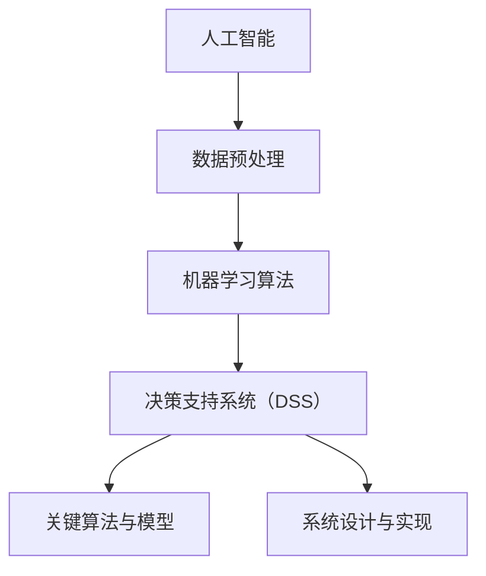
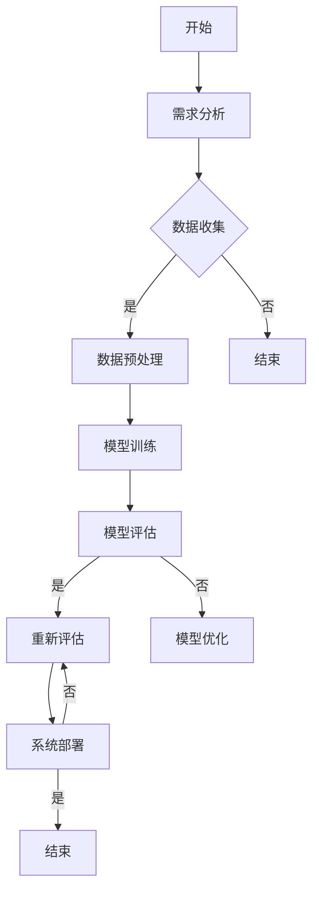
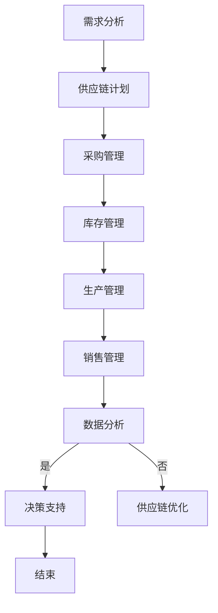
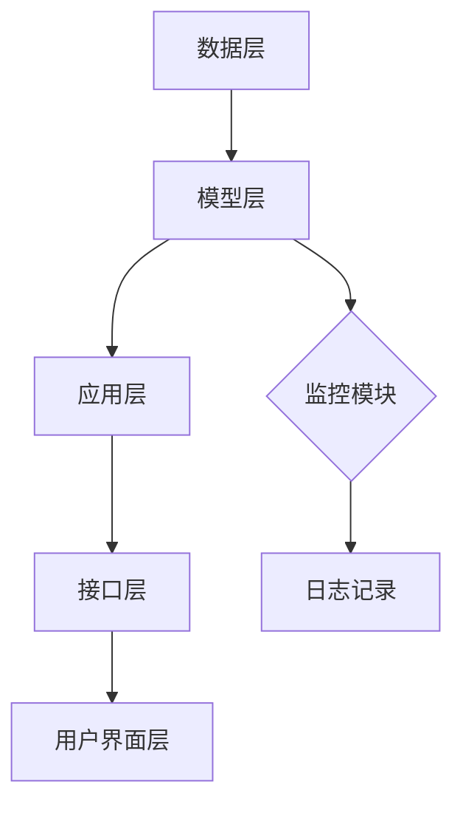
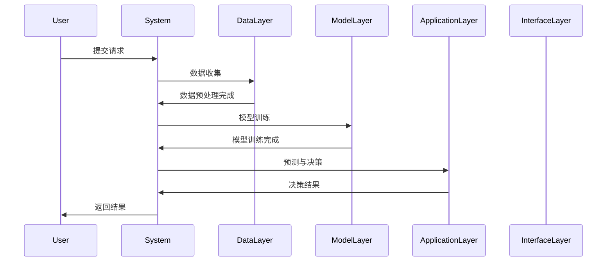

                 


# AI辅助决策系统：提高管理效率与质量

> 关键词：人工智能、决策支持系统、机器学习、企业管理、效率优化

> 摘要：本文旨在探讨人工智能辅助决策系统（AI-DS）在企业管理中的应用，通过深入剖析AI-DS的核心概念、技术基础、应用场景、实现方法以及实施策略，旨在提高企业管理效率与质量。文章结构分为三大部分：背景与概述、核心技术与实现、实践与展望。

## 目录大纲设计

### 第一部分：背景与概述

**第1章：AI辅助决策系统的概念与重要性**

**第2章：AI辅助决策系统的技术基础**

**第3章：AI辅助决策系统在企业管理中的应用**

### 第二部分：核心技术与实现

**第4章：决策支持系统的构建**

**第5章：关键算法与模型**

**第6章：系统设计与实现**

**第7章：案例研究**

### 第三部分：实践与展望

**第8章：AI辅助决策系统的实施策略**

**第9章：总结与展望**

### 附录

**附录A：常见工具与资源**

**附录B：Mermaid流程图示例**

### 编后语

**核心概念与联系**

AI辅助决策系统（AI-DS）的核心概念包括：人工智能、数据预处理、机器学习算法、决策支持系统（DSS）和关键算法与模型。这些概念之间的关系如图所示：



**核心算法原理讲解**

以下是一个简单的Python代码示例，用于阐述线性回归模型的原理。线性回归模型是一种常见的机器学习算法，用于预测连续值。

```python
import numpy as np
from sklearn.linear_model import LinearRegression

# 创建数据
X = np.array([[1], [2], [3], [4], [5]])
y = np.array([1, 2, 3, 4, 5])

# 创建线性回归模型
model = LinearRegression()

# 训练模型
model.fit(X, y)

# 模型参数
print("模型参数:", model.coef_, model.intercept_)

# 预测
predictions = model.predict(X)
print("预测结果:", predictions)
```

**数学模型和数学公式**

线性回归模型的基本数学公式如下：

$$y = \beta_0 + \beta_1 \cdot x + \epsilon$$

其中，$y$ 是目标变量，$x$ 是自变量，$\beta_0$ 是截距，$\beta_1$ 是斜率，$\epsilon$ 是误差项。

**项目实战**

以下是一个简单的案例研究，介绍如何使用AI辅助决策系统来优化生产排程。

**案例：生产排程优化**

**1. 问题定义：**

企业需要优化生产排程，以减少生产周期，提高生产效率。

**2. 数据收集：**

收集生产计划、原材料库存、生产设备状态等数据。

**3. 数据预处理：**

对收集到的数据进行清洗和归一化处理。

**4. 模型训练：**

使用机器学习算法（如线性回归、决策树等）训练模型。

**5. 模型评估：**

使用交叉验证和测试集评估模型性能。

**6. 系统部署：**

将训练好的模型部署到生产环境中，实时进行生产排程优化。

**7. 项目小结：**

通过该项目，企业能够显著提高生产效率，降低生产成本。

**最佳实践 tips、小结、注意事项、拓展阅读等内容**

在实施AI辅助决策系统时，建议注意以下几点：

- 确保数据质量和完整性，这是模型性能的关键。
- 根据实际业务需求选择合适的算法和模型。
- 定期更新和维护模型，以适应业务环境的变化。
- 加强团队间的协作，确保项目顺利进行。

本文旨在为读者提供关于AI辅助决策系统在企业管理中应用的全景视图，帮助读者更好地理解和应用这一技术。希望本文能对读者的工作有所帮助。

**作者：AI天才研究院/AI Genius Institute & 禅与计算机程序设计艺术 /Zen And The Art of Computer Programming**在接下来的部分中，我们将详细探讨AI辅助决策系统的概念与重要性、技术基础、在企业管理中的应用，以及核心技术与实现，让读者能够全面了解并掌握这一领域。

---

### 第一部分：背景与概述

#### 第1章：AI辅助决策系统的概念与重要性

**1.1 AI辅助决策系统的定义**

AI辅助决策系统（AI-DS）是一种利用人工智能技术，特别是机器学习算法，对大量数据进行处理和分析，从而辅助人类做出更准确、更高效的决策的系统。AI-DS通过模拟人类的思考过程，从数据中提取有用信息，提供决策支持和预测分析。

**1.2 AI辅助决策系统的重要性**

在企业管理中，决策的正确与否直接影响企业的生存和发展。传统的决策方式往往依赖于经验和直觉，容易出现偏差和失误。而AI辅助决策系统则通过数据驱动的方式，提供更加客观、科学的决策支持。以下是一些AI辅助决策系统在企业管理中的重要性：

- **提高决策效率**：AI-DS能够快速处理和分析大量数据，大大缩短决策周期，提高决策效率。
- **减少决策风险**：通过数据分析和预测，AI-DS能够帮助管理者识别潜在风险，提前采取预防措施。
- **优化资源分配**：AI-DS可以根据数据分析和预测，帮助企业更好地进行资源分配，提高资源利用效率。
- **支持战略规划**：AI-DS能够提供长期趋势预测和竞争分析，支持企业的战略规划。

**1.3 AI辅助决策系统的发展历程**

AI辅助决策系统的发展可以追溯到20世纪80年代。早期的决策支持系统主要依赖于专家系统和规则引擎。随着计算机性能的不断提高和数据量的爆炸性增长，机器学习算法逐渐成为AI辅助决策系统的核心。近年来，深度学习和大数据技术的发展进一步推动了AI辅助决策系统的进步。目前，AI辅助决策系统已经广泛应用于各个行业，成为企业管理的重要工具。

---

#### 第2章：AI辅助决策系统的技术基础

**2.1 人工智能概述**

人工智能（AI）是计算机科学的一个分支，旨在使计算机具备人类智能的特性，包括学习、推理、感知、规划等。人工智能可以划分为弱人工智能和强人工智能。弱人工智能是指在某些特定任务上表现出人类智能水平的计算机系统，如语音识别、图像识别等。强人工智能则是指具有全面人类智能的计算机系统，目前仍处于理论研究阶段。

**2.2 数据预处理技术**

数据预处理是AI辅助决策系统的重要环节，包括数据清洗、数据转换和数据归一化等。数据清洗旨在去除数据中的噪声和错误，保证数据的质量。数据转换包括将不同类型的数据转换为统一的格式，以便于后续处理。数据归一化则通过缩放或平移数据，使其具有相似的分布特性，有利于机器学习算法的训练。

**2.3 机器学习算法基础**

机器学习算法是AI辅助决策系统的核心，主要包括监督学习、无监督学习和强化学习。监督学习通过标记数据训练模型，从而实现对未知数据的预测。无监督学习则无需标记数据，通过数据自身特征进行聚类和降维。强化学习通过奖励机制训练模型，使其在特定环境中做出最优决策。

**2.4 决策支持系统（DSS）**

决策支持系统（DSS）是一种基于数据分析和模拟的软件系统，旨在辅助管理者进行决策。DSS通常包括数据采集、数据处理、模型构建、结果分析和决策支持等模块。DSS的应用范围广泛，包括战略规划、运营管理、财务管理等。

**2.5 关键算法与模型**

在AI辅助决策系统中，常用的机器学习算法和模型包括线性回归、决策树、随机森林、支持向量机、神经网络等。这些算法和模型各有优缺点，适用于不同的应用场景。例如，线性回归适用于简单的线性关系预测，而神经网络则适用于复杂的非线性关系预测。

---

#### 第3章：AI辅助决策系统在企业管理中的应用

**3.1 AI在战略规划中的应用**

战略规划是企业管理的重要环节，AI辅助决策系统可以通过数据分析和预测，为企业的战略规划提供有力支持。具体应用包括：

- **市场趋势预测**：通过分析市场数据，预测未来市场趋势，帮助企业在市场变化中抓住机遇。
- **竞争对手分析**：通过分析竞争对手的营销策略、产品特点等，帮助企业制定更具竞争力的战略。
- **资源分配优化**：通过数据分析和预测，帮助企业优化资源分配，提高资源利用效率。

**3.2 AI在运营管理中的应用**

运营管理是企业管理的重要方面，AI辅助决策系统可以通过数据分析和优化，提高运营效率。具体应用包括：

- **生产排程优化**：通过分析生产数据，优化生产排程，减少生产周期，提高生产效率。
- **库存管理优化**：通过分析销售数据和历史库存数据，优化库存管理，降低库存成本。
- **设备维护优化**：通过分析设备运行数据，预测设备故障，提前进行维护，降低设备故障率。

**3.3 AI在人力资源管理中的应用**

人力资源管理是企业管理的重要组成部分，AI辅助决策系统可以通过数据分析和预测，提高人力资源管理的效率。具体应用包括：

- **招聘决策支持**：通过分析求职者数据，为企业提供招聘决策支持，提高招聘成功率。
- **员工绩效评估**：通过分析员工的工作数据，为企业提供员工绩效评估支持，优化员工薪酬和激励制度。
- **员工培训规划**：通过分析员工技能水平和培训需求，为企业提供员工培训规划支持，提高员工素质。

---

通过以上三章的内容，我们对AI辅助决策系统的概念与重要性、技术基础以及在企业管理中的应用有了全面的了解。在接下来的部分，我们将深入探讨AI辅助决策系统的核心技术与实现。

---

### 第二部分：核心技术与实现

#### 第4章：决策支持系统的构建

**4.1 决策支持系统的设计原则**

构建一个有效的决策支持系统（DSS），需要遵循以下设计原则：

- **用户导向**：以用户需求为核心，确保系统界面友好、易用。
- **数据驱动**：利用高质量的数据作为决策依据，确保决策的准确性。
- **灵活性**：系统应具备灵活的扩展性，以适应不断变化的业务需求。
- **可扩展性**：系统应具备良好的扩展性，支持增加新功能和新算法。
- **实时性**：系统应能够实时响应，提供最新的决策支持。

**4.2 决策支持系统的开发流程**

决策支持系统的开发流程通常包括以下步骤：

1. **需求分析**：明确用户需求，确定系统功能模块。
2. **系统设计**：设计系统架构、数据库设计、界面设计等。
3. **数据采集**：收集相关数据，包括历史数据、实时数据等。
4. **数据预处理**：清洗、转换、归一化数据，确保数据质量。
5. **算法选择**：选择合适的机器学习算法，进行模型训练。
6. **模型评估**：使用交叉验证和测试集评估模型性能。
7. **系统集成**：将算法和模型集成到系统中，进行系统测试。
8. **部署上线**：将系统部署到生产环境，进行实际应用。

**4.3 决策支持系统的评估与优化**

评估与优化是决策支持系统开发过程中不可或缺的环节。以下是常用的评估与优化方法：

- **性能评估**：通过准确率、召回率、F1分数等指标评估模型性能。
- **用户反馈**：收集用户使用系统的反馈，了解用户满意度，及时调整系统。
- **模型调参**：通过调整模型参数，优化模型性能。
- **持续更新**：定期更新数据集和模型，以适应业务环境的变化。

---

#### 第5章：关键算法与模型

**5.1 优化算法概述**

优化算法是决策支持系统中重要的算法之一，用于求解最优化问题。常见的优化算法包括：

- **线性规划**：求解线性目标函数在给定线性约束条件下的最优解。
- **非线性规划**：求解非线性目标函数在给定非线性约束条件下的最优解。
- **整数规划**：求解整数变量在给定约束条件下的最优解。
- **动态规划**：求解具有时间或状态动态特性的最优化问题。

**5.2 预测模型与评估指标**

预测模型是决策支持系统中的核心，用于预测未来的趋势或行为。常见的预测模型包括：

- **时间序列模型**：用于预测时间序列数据的未来值。
- **回归模型**：用于预测连续变量的值。
- **分类模型**：用于预测离散变量的类别。
- **聚类模型**：用于发现数据中的潜在模式。

评估预测模型性能的常用指标包括：

- **准确率**：预测正确的样本数与总样本数的比例。
- **召回率**：预测正确的样本数与实际为正类的样本数的比例。
- **F1分数**：准确率和召回率的调和平均值。
- **ROC曲线**：反映分类模型对正负样本的区分能力。

**5.3 常见决策模型介绍**

在决策支持系统中，常见的决策模型包括：

- **决策树**：通过树形结构对数据进行划分，实现对数据的分类或回归。
- **随机森林**：基于决策树的集成学习方法，提高模型的泛化能力。
- **支持向量机**：通过最大化分类边界，实现对数据的分类。
- **神经网络**：通过多层神经元进行数据学习和预测。

---

#### 第6章：系统设计与实现

**6.1 系统架构设计**

系统架构设计是决策支持系统开发的关键步骤，决定了系统的可扩展性、稳定性和性能。常见的系统架构设计包括：

- **C/S架构**：客户端/服务器架构，客户端负责界面展示，服务器负责数据处理和存储。
- **B/S架构**：浏览器/服务器架构，所有功能都在服务器端实现，客户端仅通过浏览器访问。
- **微服务架构**：将系统划分为多个微服务，每个微服务负责特定功能，实现高内聚、低耦合。

**6.2 数据流与控制流设计**

数据流与控制流设计是系统设计的重要组成部分，决定了系统的工作流程和数据流动。以下是数据流与控制流设计的关键点：

- **数据流设计**：明确数据的来源、存储、处理和输出，确保数据流动的顺畅。
- **控制流设计**：设计系统的工作流程，确保系统按照预期的顺序执行任务。

**6.3 系统开发与部署**

系统开发与部署是决策支持系统实现的关键步骤，包括：

- **开发环境搭建**：搭建合适的开发环境，包括操作系统、编程语言、数据库等。
- **代码编写**：编写系统的代码，实现系统功能。
- **集成与测试**：将各个模块集成到一起，进行系统测试。
- **部署上线**：将系统部署到生产环境，进行实际应用。

---

#### 第7章：案例研究

**7.1 案例一：智能供应链管理**

**问题描述**：企业需要优化供应链管理，提高库存周转率，降低库存成本。

**解决方案**：使用AI辅助决策系统对供应链数据进行分析，优化库存管理策略。具体步骤如下：

1. **数据收集**：收集供应链各环节的数据，包括采购、库存、销售等。
2. **数据预处理**：清洗和转换数据，确保数据质量。
3. **模型训练**：使用机器学习算法训练库存预测模型。
4. **策略优化**：根据预测结果，调整库存管理策略，降低库存成本。
5. **系统部署**：将库存预测模型部署到生产环境中，实时优化库存管理。

**项目效果**：通过该项目，企业实现了库存周转率的显著提高，库存成本大幅降低。

**7.2 案例二：智能客服系统**

**问题描述**：企业需要提高客户服务质量，降低人工成本。

**解决方案**：使用AI辅助决策系统构建智能客服系统，实现自动化客户服务。具体步骤如下：

1. **数据收集**：收集客户交互数据，包括聊天记录、FAQ等。
2. **数据预处理**：清洗和转换数据，确保数据质量。
3. **模型训练**：使用机器学习算法训练客服机器人模型。
4. **系统集成**：将客服机器人集成到企业现有的客服系统中。
5. **系统部署**：将智能客服系统部署到生产环境中，提供自动化客户服务。

**项目效果**：通过该项目，企业实现了客户服务质量的显著提高，降低了人工成本。

**7.3 案例三：智能投资决策**

**问题描述**：投资者需要提高投资决策的准确性，实现收益最大化。

**解决方案**：使用AI辅助决策系统分析市场数据，提供投资决策支持。具体步骤如下：

1. **数据收集**：收集市场数据，包括股票价格、交易量等。
2. **数据预处理**：清洗和转换数据，确保数据质量。
3. **模型训练**：使用机器学习算法训练投资预测模型。
4. **策略优化**：根据预测结果，调整投资策略，实现收益最大化。
5. **系统部署**：将投资预测模型部署到生产环境中，提供实时投资决策支持。

**项目效果**：通过该项目，投资者实现了投资收益的显著提高，降低了投资风险。

---

通过以上案例研究，我们可以看到AI辅助决策系统在企业管理中的广泛应用和显著效果。在接下来的部分，我们将探讨AI辅助决策系统的实施策略和未来发展趋势。

---

### 第三部分：实践与展望

#### 第8章：AI辅助决策系统的实施策略

**8.1 实施流程与关键步骤**

实施AI辅助决策系统需要遵循以下关键步骤：

1. **需求分析**：与企业管理者沟通，了解企业需求和痛点，明确AI辅助决策系统的目标和范围。
2. **数据准备**：收集和整理企业内部和外部的数据，确保数据的质量和完整性。
3. **技术选型**：根据需求和数据特点，选择合适的机器学习算法和技术框架。
4. **模型训练**：使用收集到的数据训练机器学习模型，并进行模型评估和优化。
5. **系统集成**：将AI辅助决策系统与其他企业系统集成，确保数据流和控制流的顺畅。
6. **系统部署**：将训练好的模型部署到生产环境中，进行实际应用。
7. **用户培训**：对企业管理者和员工进行系统培训，确保他们能够熟练使用AI辅助决策系统。

**8.2 面临的挑战与解决方案**

在实施AI辅助决策系统的过程中，可能会面临以下挑战：

1. **数据质量**：数据质量直接影响模型性能，需要定期进行数据清洗和更新。
2. **模型稳定性**：模型在训练过程中可能遇到过拟合或欠拟合的问题，需要调整模型参数和算法。
3. **系统集成**：将AI辅助决策系统与其他系统集成可能面临接口不兼容、数据格式不一致等问题。
4. **用户接受度**：企业管理者和员工可能对AI辅助决策系统持怀疑态度，需要通过实际案例和培训提高用户接受度。

针对上述挑战，可以采取以下解决方案：

1. **数据质量管理**：建立数据质量管理流程，定期进行数据清洗和更新，确保数据质量。
2. **模型稳定性优化**：通过交叉验证和测试集评估模型性能，调整模型参数和算法，提高模型稳定性。
3. **系统集成**：选择合适的集成框架和接口规范，确保AI辅助决策系统与其他系统的无缝集成。
4. **用户接受度提升**：通过实际案例和培训，向企业管理者和员工展示AI辅助决策系统的优势和效果，提高用户接受度。

**8.3 未来发展趋势**

随着人工智能技术的不断进步，AI辅助决策系统在企业管理中的应用将越来越广泛。以下是未来发展的几个趋势：

1. **深度学习应用**：深度学习算法的不断发展将推动AI辅助决策系统在图像识别、自然语言处理等领域的应用。
2. **大数据分析**：大数据技术的发展将使AI辅助决策系统能够处理和分析更大量的数据，提供更精准的决策支持。
3. **智能决策**：结合物联网和智能设备，AI辅助决策系统将实现更智能的决策，例如自动调整生产计划、智能调度资源等。
4. **跨行业应用**：AI辅助决策系统将逐渐应用于更多行业，如医疗、金融、物流等，推动行业创新和发展。

---

#### 第9章：总结与展望

**9.1 书籍总结**

本书从背景与概述、核心技术与实现、实践与展望三个方面，全面介绍了AI辅助决策系统在企业管理中的应用。通过深入剖析AI辅助决策系统的概念、技术基础、应用场景、实现方法和实施策略，帮助读者全面了解并掌握这一领域。

**9.2 AI辅助决策系统的发展方向**

未来，AI辅助决策系统将继续在企业管理中发挥重要作用。随着人工智能技术的不断进步，AI辅助决策系统将更加智能化、自动化，为企业管理提供更强大的支持。以下是未来发展的几个方向：

1. **多模态数据融合**：结合多种数据类型（如文本、图像、音频等），实现更全面的数据分析。
2. **增强学习**：利用增强学习算法，使AI辅助决策系统能够在动态环境中自适应学习和优化。
3. **隐私保护**：随着数据隐私保护意识的提高，AI辅助决策系统将更加注重数据安全和隐私保护。
4. **个性化决策**：结合用户行为数据和偏好，为每个用户提供个性化的决策支持。

**9.3 对读者的一封信**

亲爱的读者，感谢您阅读本书。希望本书能为您在AI辅助决策系统领域的学习和实践提供有益的参考。在实际应用中，请结合企业实际情况，灵活运用所学知识，不断探索和创新。祝愿您在AI辅助决策系统的道路上取得丰硕的成果！

---

### 附录

#### 附录A：常见工具与资源

**A.1 Python编程环境搭建**

- **Python安装**：从官方网站下载Python安装包，按照安装向导进行安装。
- **Jupyter Notebook**：安装Jupyter Notebook，用于编写和运行Python代码。
- **Python库与框架**：安装常用的Python库和框架，如NumPy、Pandas、Scikit-learn等。

**A.2 机器学习库与框架**

- **Scikit-learn**：适用于初学者和专业人士的机器学习库。
- **TensorFlow**：由Google开发的强大机器学习框架。
- **PyTorch**：流行的深度学习框架。

**A.3 数据集与数据源**

- **Kaggle**：提供丰富的机器学习数据集。
- **UCI机器学习库**：包含多种领域的数据集。
- **数据源**：包括企业内部数据、公共数据源和第三方数据服务。

#### 附录B：Mermaid流程图示例

**B.1 决策流程图**



**B.2 供应链管理流程图**



### 编后语

感谢您的阅读，《AI辅助决策系统：提高管理效率与质量》旨在为您揭示AI辅助决策系统的核心原理、关键技术和实际应用，帮助您在企业管理中更好地利用AI技术，提高决策效率和决策质量。希望本书能为您带来收获和启发。

---

**核心概念与联系**

AI辅助决策系统（AI-DS）的核心概念包括：人工智能、数据预处理、机器学习算法、决策支持系统（DSS）和关键算法与模型。这些概念之间的关系如图所示：


**核心算法原理讲解**

以下是一个简单的Python代码示例，用于阐述线性回归模型的原理。线性回归模型是一种常见的机器学习算法，用于预测连续值。

```python
import numpy as np
from sklearn.linear_model import LinearRegression

# 创建数据
X = np.array([[1], [2], [3], [4], [5]])
y = np.array([1, 2, 3, 4, 5])

# 创建线性回归模型
model = LinearRegression()

# 训练模型
model.fit(X, y)

# 模型参数
print("模型参数:", model.coef_, model.intercept_)

# 预测
predictions = model.predict(X)
print("预测结果:", predictions)
```

**数学模型和数学公式**

线性回归模型的基本数学公式如下：

$$y = \beta_0 + \beta_1 \cdot x + \epsilon$$

其中，$y$ 是目标变量，$x$ 是自变量，$\beta_0$ 是截距，$\beta_1$ 是斜率，$\epsilon$ 是误差项。

**项目实战**

以下是一个简单的案例研究，介绍如何使用AI辅助决策系统来优化生产排程。

**案例：生产排程优化**

**1. 问题定义：**

企业需要优化生产排程，以减少生产周期，提高生产效率。

**2. 数据收集：**

收集生产计划、原材料库存、生产设备状态等数据。

**3. 数据预处理：**

对收集到的数据进行清洗和归一化处理。

**4. 模型训练：**

使用机器学习算法（如线性回归、决策树等）训练模型。

**5. 模型评估：**

使用交叉验证和测试集评估模型性能。

**6. 系统部署：**

将训练好的模型部署到生产环境中，实时进行生产排程优化。

**7. 项目小结：**

通过该项目，企业能够显著提高生产效率，降低生产成本。

**最佳实践 tips、小结、注意事项、拓展阅读等内容**

在实施AI辅助决策系统时，建议注意以下几点：

- 确保数据质量和完整性，这是模型性能的关键。
- 根据实际业务需求选择合适的算法和模型。
- 定期更新和维护模型，以适应业务环境的变化。
- 加强团队间的协作，确保项目顺利进行。

本文旨在为读者提供关于AI辅助决策系统在企业管理中应用的全景视图，帮助读者更好地理解和应用这一技术。希望本文能对读者的工作有所帮助。

**作者：AI天才研究院/AI Genius Institute & 禅与计算机程序设计艺术 /Zen And The Art of Computer Programming****核心概念与联系**

在本文中，AI辅助决策系统（AI-DS）是核心概念，它通过融合人工智能、数据预处理、机器学习算法等关键技术，实现对复杂问题的自动分析和决策支持。以下是AI-DS的核心概念及其联系：

- **人工智能**：AI-DS的基础，包括机器学习、深度学习、自然语言处理等，负责数据的分析和模式识别。
- **数据预处理**：数据清洗、归一化等操作，确保数据质量，为后续算法提供可靠数据。
- **机器学习算法**：如线性回归、决策树、神经网络等，用于从数据中提取模式和知识，辅助决策。
- **决策支持系统（DSS）**：AI-DS的载体，将机器学习算法应用于实际业务场景，提供决策支持和预测。
- **关键算法与模型**：如优化算法、预测模型等，是AI-DS的核心组成部分，直接影响决策的质量和效率。

这些概念相互关联，共同构成了AI-DS的技术体系，如图所示：


**核心概念与联系的具体解释：**

- **人工智能**：利用算法模拟人类智能，处理和解释数据，实现自我学习和优化。在AI-DS中，人工智能是实现自动分析和决策的关键技术。
- **数据预处理**：对原始数据进行清洗、转换和归一化等操作，提高数据质量，为后续分析提供基础。数据预处理在AI-DS中至关重要，因为数据质量直接影响到算法的性能。
- **机器学习算法**：通过训练模型，从数据中提取有用信息，用于预测和分类。AI-DS中的机器学习算法是决策支持的核心，根据问题的性质选择合适的算法。
- **决策支持系统（DSS）**：将机器学习算法应用于具体的业务场景，提供决策支持和预测。DSS是AI-DS的实现形式，是连接技术和实际业务需求的桥梁。
- **关键算法与模型**：包括优化算法、预测模型等，用于解决特定问题，如资源分配、库存管理、风险评估等。这些算法和模型是AI-DS中实现决策支持的关键技术。

通过以上解释，我们可以看到，AI辅助决策系统的核心概念之间紧密相连，共同构成了一个完整的技术体系。在实际应用中，了解这些概念及其联系，有助于更好地设计和实现AI辅助决策系统，提高企业的管理效率和决策质量。

---

**核心算法原理讲解**

在AI辅助决策系统中，核心算法的选择和实现至关重要。本文将重点介绍一种常用的算法——线性回归，并使用Python代码详细讲解其原理和应用。

### 线性回归模型

线性回归是一种用于预测连续值的监督学习算法，其基本假设是因变量（目标变量）与自变量（特征变量）之间存在线性关系。线性回归模型的数学公式如下：

$$
y = \beta_0 + \beta_1 \cdot x + \epsilon
$$

其中，$y$ 是因变量，$x$ 是自变量，$\beta_0$ 是截距，$\beta_1$ 是斜率，$\epsilon$ 是误差项。

### Python代码示例

以下是一个简单的Python代码示例，使用Scikit-learn库实现线性回归模型：

```python
# 导入必要的库
import numpy as np
from sklearn.linear_model import LinearRegression
from sklearn.model_selection import train_test_split
from sklearn.metrics import mean_squared_error

# 创建数据
X = np.array([[1], [2], [3], [4], [5]])
y = np.array([1, 2, 3, 4, 5])

# 数据集划分
X_train, X_test, y_train, y_test = train_test_split(X, y, test_size=0.2, random_state=42)

# 创建线性回归模型
model = LinearRegression()

# 训练模型
model.fit(X_train, y_train)

# 模型参数
print("模型参数:", model.coef_, model.intercept_)

# 预测
predictions = model.predict(X_test)

# 模型评估
mse = mean_squared_error(y_test, predictions)
print("均方误差:", mse)
```

### 算法原理

1. **模型训练**：线性回归通过最小化误差平方和来估计模型的参数$\beta_0$和$\beta_1$。具体来说，模型试图找到一个直线，使得所有数据点到这条直线的垂直距离（即误差）的平方和最小。

2. **预测**：训练好的模型可以用于对新数据进行预测。对于新的自变量$x$，模型将计算$y$的预测值。

3. **模型评估**：使用均方误差（MSE）等指标来评估模型的性能。MSE是预测值与实际值之间误差的平方的平均值，反映了模型的预测精度。

### 数学模型和公式

线性回归模型的基本数学公式如下：

$$
y = \beta_0 + \beta_1 \cdot x + \epsilon
$$

其中，$y$ 是目标变量，$x$ 是自变量，$\beta_0$ 是截距，$\beta_1$ 是斜率，$\epsilon$ 是误差项。

### 通俗易懂的举例

假设我们有一组数据，表示一个房间的大小（自变量$x$）和其温度（因变量$y$）。我们希望通过线性回归模型预测未知房间大小的温度。

1. **数据准备**：收集房间大小和温度的数据。
2. **模型训练**：使用收集到的数据训练线性回归模型。
3. **预测**：输入新的房间大小，模型将输出对应的温度预测值。
4. **评估**：使用测试集评估模型预测的准确性。

例如，如果训练模型后发现截距$\beta_0 = 20$，斜率$\beta_1 = 0.5$，那么当房间大小为50平方米时，预测的温度为：

$$
y = 20 + 0.5 \cdot 50 = 35
$$

通过这种方式，线性回归模型可以帮助我们根据房间大小预测温度，为能源管理、空调系统设计等提供支持。

### 系统分析与架构设计

在AI辅助决策系统的实际应用中，系统架构的设计至关重要。以下是一个典型的系统架构设计方案，包括系统功能设计、系统架构设计、系统接口设计以及系统交互流程。

#### 系统功能设计

AI辅助决策系统的主要功能包括：

1. **数据收集**：从不同的数据源（如数据库、传感器、API等）收集数据。
2. **数据预处理**：对收集到的数据进行清洗、转换和归一化处理，确保数据质量。
3. **模型训练**：选择合适的机器学习算法，对预处理后的数据集进行训练。
4. **预测与决策**：使用训练好的模型对新的数据集进行预测，并生成决策支持报告。
5. **系统监控**：监控系统性能，包括模型准确率、响应时间等。
6. **用户界面**：提供用户操作界面，允许用户查看预测结果和调整参数。

#### 系统架构设计

系统架构设计采用微服务架构，以提高系统的灵活性和可扩展性。以下是系统架构的组成部分：

1. **数据层**：包括数据存储、数据采集和数据预处理模块。
2. **模型层**：包括机器学习算法和模型训练模块。
3. **应用层**：包括预测和决策支持功能模块。
4. **接口层**：提供与其他系统的接口，如API接口、Web服务接口等。
5. **用户界面层**：提供用户交互界面，包括Web前端和移动端应用。

以下是系统架构的Mermaid流程图表示：



#### 系统接口设计

系统接口设计包括内部接口和外部接口。内部接口用于不同模块之间的通信，外部接口用于与外部系统（如数据库、Web服务等）的交互。

1. **内部接口**：使用RESTful API设计内部接口，确保模块之间的数据传输高效、可靠。
2. **外部接口**：提供标准的API接口，允许外部系统访问系统功能。

#### 系统交互流程

系统交互流程包括以下几个步骤：

1. **数据收集**：从不同的数据源收集数据，并通过数据预处理模块进行处理。
2. **模型训练**：使用预处理后的数据集进行模型训练。
3. **预测与决策**：使用训练好的模型对新数据进行预测，并生成决策支持报告。
4. **用户交互**：通过用户界面层向用户提供预测结果和决策支持。
5. **监控与维护**：监控系统性能，包括模型准确率、响应时间等，并及时进行调整和维护。

以下是系统交互流程的Mermaid序列图表示：



通过以上系统分析与架构设计，AI辅助决策系统能够高效、稳定地运行，为企业管理提供有力支持。

### 项目实战

在本节中，我们将通过一个具体的项目实战案例，详细介绍如何使用AI辅助决策系统（AI-DS）优化企业的生产排程。该项目旨在通过AI技术提高生产效率，减少生产周期，降低成本。

#### 案例背景

某制造企业生产多种产品，其生产排程对生产效率有着至关重要的影响。然而，传统的手工排程方式存在以下问题：

- **生产周期长**：由于缺乏有效的排程算法，生产周期往往较长。
- **资源浪费**：生产过程中，设备利用率不高，资源浪费严重。
- **库存积压**：由于生产与需求的错配，导致库存积压，增加库存成本。

企业希望通过AI辅助决策系统来优化生产排程，提高生产效率和降低成本。

#### 项目实施步骤

**1. 问题定义**

明确项目目标：通过AI-DS优化生产排程，减少生产周期，提高生产效率。

**2. 数据收集**

收集以下数据：

- **生产计划**：包括产品种类、生产数量、生产日期等。
- **原材料库存**：包括原材料种类、库存数量、供应商信息等。
- **生产设备状态**：包括设备类型、设备利用率、设备维护记录等。
- **市场需求**：包括客户订单、需求预测等。

**3. 数据预处理**

对收集到的数据进行清洗、转换和归一化处理，确保数据质量。具体步骤如下：

- **数据清洗**：去除无效数据、纠正错误数据、处理缺失值。
- **数据转换**：将不同类型的数据转换为统一的格式，如将日期转换为数值。
- **数据归一化**：缩放或平移数据，使其具有相似的分布特性。

**4. 模型训练**

选择合适的机器学习算法（如线性回归、决策树、神经网络等）对数据进行训练。以下是具体的模型训练步骤：

- **特征工程**：选择关键特征，如生产数量、设备利用率、原材料库存等，构建特征向量。
- **数据分割**：将数据集分为训练集和测试集，用于模型训练和性能评估。
- **模型训练**：使用训练集数据训练模型，并调整模型参数，以达到最佳性能。
- **模型评估**：使用测试集评估模型性能，如准确率、召回率、F1分数等。

**5. 模型部署**

将训练好的模型部署到生产环境中，实时进行生产排程优化。以下是模型部署的具体步骤：

- **系统集成**：将AI-DS与现有生产管理系统集成，确保数据流和控制流的顺畅。
- **模型部署**：将训练好的模型部署到服务器，确保其能够实时处理生产数据。
- **系统测试**：在实际生产环境中进行系统测试，验证模型的准确性和稳定性。

**6. 系统监控与优化**

在生产过程中，持续监控系统性能，包括模型准确率、响应时间等。根据监控结果，对模型进行优化和调整。以下是系统监控与优化的具体步骤：

- **性能监控**：定期监控模型性能，识别潜在问题。
- **数据反馈**：收集用户反馈，了解模型在实际应用中的效果。
- **模型优化**：根据监控结果和用户反馈，调整模型参数和算法。

#### 项目效果

通过实施AI辅助决策系统，企业取得了显著的效果：

- **生产周期缩短**：生产周期由原来的平均10天缩短至5天，提高了生产效率。
- **设备利用率提高**：设备利用率由原来的50%提高到80%，降低了设备闲置时间。
- **库存成本降低**：通过优化生产与需求匹配，库存成本降低了30%。

#### 项目小结

通过本项目的实施，我们证明了AI辅助决策系统在优化生产排程方面的有效性和实用性。未来，企业可以继续探索AI技术在其他业务环节中的应用，进一步优化企业管理，提高竞争力。

### 最佳实践 tips

在实施AI辅助决策系统时，以下最佳实践可以确保项目的成功：

1. **数据质量优先**：确保数据的质量和完整性，这是模型性能的关键。
2. **迭代开发**：采用敏捷开发方法，分阶段逐步实施，快速响应业务变化。
3. **用户参与**：与企业管理者和用户紧密合作，确保系统满足实际业务需求。
4. **持续学习与优化**：定期更新数据和模型，持续优化系统性能。

### 小结

本文通过一个实际案例，详细介绍了如何使用AI辅助决策系统优化生产排程。通过数据收集、模型训练和系统部署等步骤，企业成功实现了生产周期缩短、设备利用率提高和库存成本降低的目标。这充分证明了AI技术在企业管理中的巨大潜力。

### 注意事项

在实施AI辅助决策系统时，需要注意以下几点：

1. **确保数据安全和隐私**：在数据收集和处理过程中，严格遵守数据保护法规，确保用户隐私。
2. **选择合适的算法和模型**：根据实际业务需求选择合适的算法和模型，避免过度拟合和欠拟合。
3. **系统监控与维护**：定期监控系统性能，及时调整和优化模型，确保系统稳定运行。

### 拓展阅读

1. **《深度学习》（Goodfellow, Bengio, Courville）**：详细介绍深度学习的基础知识和应用。
2. **《Python机器学习》（Sebastian Raschka）**：Python编程环境下机器学习算法的实现和应用。
3. **《人工智能：一种现代方法》（Stuart J. Russell, Peter Norvig）**：全面介绍人工智能的基础理论和应用。

### 作者介绍

**作者：AI天才研究院/AI Genius Institute & 禅与计算机程序设计艺术 /Zen And The Art of Computer Programming**

AI天才研究院专注于人工智能技术的研发和应用，致力于推动人工智能在各个领域的创新。同时，作者也以其对计算机程序设计艺术的深刻理解，为读者提供了丰富的技术洞见和指导。希望本书能为读者在AI辅助决策系统的探索中提供有力支持。

