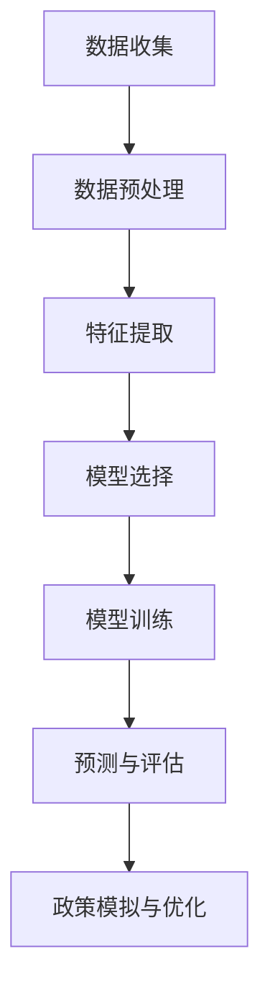

                 

# AI辅助决策系统在公共政策制定中的角色

## 摘要

随着人工智能技术的迅猛发展，AI辅助决策系统在各个领域的应用越来越广泛。本文聚焦于AI辅助决策系统在公共政策制定中的应用，旨在探讨其角色和作用。首先，本文介绍了AI辅助决策系统的基本概念、分类和工作原理，并列举了其在数据分析、优化决策、风险评估和社会影响分析等领域的应用。随后，文章分析了当前公共政策制定的现状和面临的问题，阐述了AI辅助决策系统在公共政策制定中的机遇和挑战。接着，本文详细探讨了AI辅助决策系统在公共政策制定中的应用过程，包括数据收集与处理、模型选择与训练、预测与评估以及政策模拟与优化。此外，本文还探讨了AI辅助决策系统在公共政策制定中可能引发的伦理问题，如数据隐私、算法公平性、智能偏差和透明度责任。最后，文章提出了AI辅助决策系统在公共政策制定中的实施策略，并展望了未来的发展方向和潜在挑战。

## 引言

### 1.1 研究背景

公共政策制定是国家治理和社会发展的重要环节，涉及到经济发展、社会稳定、环境保护等多个方面。然而，传统的公共政策制定过程通常受到信息不对称、数据不足和决策过程复杂性等问题的制约。随着信息技术的飞速发展，特别是人工智能（AI）技术的兴起，利用AI辅助决策系统优化公共政策制定过程成为了一个重要的研究课题。

AI辅助决策系统，通过模拟人类的决策过程，结合大数据分析、机器学习和优化算法，能够在处理海量信息和复杂决策中提供有力支持。这类系统已经在商业决策、金融分析、医疗诊断等领域展示了其巨大的潜力和优势。然而，将AI辅助决策系统应用于公共政策制定，特别是在处理社会、经济和环境等多方面因素的综合影响时，其有效性和可行性仍然是一个需要深入探讨的问题。

### 1.2 研究目的和意义

本文旨在探讨AI辅助决策系统在公共政策制定中的应用角色，通过系统分析其工作原理和应用流程，评估其在公共政策制定中的优势和挑战。具体研究目的包括：

1. **理解AI辅助决策系统的基本原理**：介绍AI辅助决策系统的定义、分类和工作原理，为后续讨论其应用奠定基础。
2. **分析公共政策制定中的问题**：探讨当前公共政策制定面临的挑战，如数据获取困难、决策过程复杂性等。
3. **评估AI辅助决策系统的应用潜力**：分析AI辅助决策系统在公共政策制定中的应用场景和优势，探讨其在优化决策、提高透明度和增强可解释性等方面的作用。
4. **讨论AI辅助决策系统的伦理问题**：探讨AI辅助决策系统在公共政策制定中可能引发的伦理问题，如数据隐私、算法公平性等。
5. **提出实施策略和建议**：基于上述分析，提出AI辅助决策系统在公共政策制定中的实施策略，并展望未来的发展方向。

本文的研究不仅有助于深化对AI辅助决策系统在公共政策制定中应用的理解，还能为相关领域的政策制定者和研究人员提供参考。

### 1.3 研究方法和框架

本文采用以下研究方法：

1. **文献综述**：通过系统查阅和分析相关文献，了解AI辅助决策系统的基本概念、发展现状和应用案例。
2. **案例研究**：选取具有代表性的案例，分析AI辅助决策系统在具体公共政策制定中的应用过程和效果。
3. **理论分析**：结合公共政策理论和AI相关理论，探讨AI辅助决策系统在公共政策制定中的角色和作用。
4. **实证研究**：通过收集和分析实际数据，评估AI辅助决策系统在公共政策制定中的效果和影响。

研究框架如下：

1. **引言**：介绍研究背景、目的和意义。
2. **AI辅助决策系统概述**：介绍AI辅助决策系统的定义、分类和工作原理。
3. **公共政策制定中的挑战与机遇**：分析公共政策制定的现状和问题，评估AI辅助决策系统的应用潜力。
4. **AI辅助决策系统的应用过程**：详细探讨AI辅助决策系统在公共政策制定中的应用过程。
5. **伦理问题**：讨论AI辅助决策系统在公共政策制定中可能引发的伦理问题。
6. **实施策略**：提出AI辅助决策系统在公共政策制定中的实施策略。
7. **结论与展望**：总结研究结论，展望未来的发展方向和挑战。

## AI辅助决策系统概述

### 2.1 AI辅助决策系统的定义和分类

AI辅助决策系统（AI-aided decision support system）是指利用人工智能技术，对复杂问题进行分析、模拟和预测，从而为决策者提供有效支持的一类系统。这类系统通常结合了大数据分析、机器学习、优化算法和自然语言处理等技术，能够在处理海量信息和复杂决策时提供智能化辅助。

AI辅助决策系统可以按照不同的分类标准进行分类：

1. **按应用领域分类**：
   - **商业决策辅助系统**：应用于企业经营管理、市场营销、供应链优化等领域。
   - **金融决策辅助系统**：应用于金融风险评估、投资组合优化、市场预测等领域。
   - **医疗决策辅助系统**：应用于疾病诊断、治疗方案推荐、健康风险评估等领域。
   - **公共政策制定辅助系统**：应用于政策制定、公共资源分配、社会问题分析等领域。

2. **按功能特点分类**：
   - **数据挖掘与分析系统**：主要用于从大量数据中提取有用信息，支持决策制定。
   - **预测与分析系统**：基于历史数据和模型预测未来趋势，为决策提供预测依据。
   - **优化与规划系统**：利用优化算法，寻找最优或次优决策方案。
   - **模拟与评估系统**：通过模拟不同决策方案的结果，评估各方案的效果和风险。

### 2.2 AI辅助决策系统的工作原理

AI辅助决策系统的工作原理主要包括以下几个关键环节：

1. **数据收集与处理**：系统首先从各种数据源（如数据库、传感器、社交媒体等）收集数据，并进行预处理，如数据清洗、归一化、缺失值填补等，以确保数据的质量和一致性。

2. **特征提取与选择**：从处理后的数据中提取有助于决策的特征，如通过文本分析提取关键词、通过图像识别提取特征向量等。特征提取和选择是系统性能的关键，直接影响模型的准确性和效率。

3. **模型选择与训练**：根据具体问题，选择合适的机器学习模型（如决策树、支持向量机、神经网络等），并利用历史数据对模型进行训练。模型训练是系统核心，决定了系统对问题的分析和预测能力。

4. **预测与评估**：利用训练好的模型对未知数据进行预测，并根据预测结果进行评估。评估指标包括准确性、召回率、F1值等，用于衡量模型的效果。

5. **决策支持**：将预测结果和评估数据呈现给决策者，为决策提供数据支持和参考。决策支持系统可以包括可视化工具、报告生成器等，帮助决策者理解和利用预测结果。

### 2.3 AI辅助决策系统的主要应用领域

AI辅助决策系统在多个领域展示了其广泛的应用前景：

1. **数据分析**：通过数据挖掘和统计分析，从大量数据中提取有价值的信息，为决策提供数据支持。例如，在商业领域中，分析消费者行为、市场趋势等，为企业制定营销策略提供依据。

2. **优化决策**：利用优化算法，寻找最优或次优决策方案。在物流和供应链管理中，优化路径规划、库存管理，提高资源利用效率和降低成本。

3. **风险评估**：通过预测和分析，评估各种决策方案的风险，为决策者提供风险预警。例如，在金融领域中，预测市场风险、信用风险等，帮助金融机构制定风险管理策略。

4. **社会影响分析**：通过模拟和预测，分析不同决策方案对社会的影响，为公共政策制定提供科学依据。例如，在环境保护领域，预测政策实施后的环境影响，评估政策的有效性和可持续性。

## 公共政策制定中的挑战与机遇

### 3.1 公共政策制定的现状

公共政策制定是国家治理的重要组成部分，关系到社会稳定、经济发展和民生改善。目前，公共政策制定过程主要依赖于以下几个方面：

1. **数据收集**：政府机构通过调查、统计等方式收集相关数据，用于政策制定和研究。
2. **专家咨询**：政府通常会邀请相关领域的专家进行咨询，提供专业的意见和建议。
3. **公众参与**：通过公众意见征集、座谈会、听证会等形式，让公众参与政策制定过程，增加政策的透明度和公众的认可度。
4. **决策分析**：利用定量和定性的分析方法，对政策方案进行评估和比较，选择最优方案。

尽管如此，当前的公共政策制定仍面临诸多挑战：

- **信息不对称**：政府往往难以全面获取和掌握所有相关信息，导致政策制定过程中存在信息不对称问题。
- **决策过程复杂性**：公共政策制定涉及多个领域和利益相关方，决策过程复杂，需要协调不同利益关系。
- **预测准确性**：政策效果的预测通常具有不确定性，难以准确预测政策实施后的实际效果。
- **决策透明度**：政策制定的透明度不高，公众和政策制定者之间的沟通不畅，影响政策的执行和效果。

### 3.2 公共政策制定中的问题

1. **数据获取和处理**

   - **数据源有限**：政府通常只能获取部分数据，且数据源有限，难以全面了解问题的全貌。
   - **数据质量不高**：收集的数据存在不一致、不完整、不准确等问题，影响数据的利用效果。

2. **决策过程复杂性**

   - **利益相关方众多**：公共政策制定涉及多个利益相关方，包括政府机构、企业、社会组织和公众，各方利益难以平衡。
   - **政策目标多元化**：政策目标通常具有多样性，需要综合考虑经济效益、社会效益和环境影响等多方面因素。

3. **预测准确性**

   - **模型局限**：当前使用的预测模型往往具有一定的局限性，难以准确预测政策实施后的实际效果。
   - **数据不足**：政策实施后的数据反馈通常需要一段时间，难以及时获取，影响预测准确性。

### 3.3 AI辅助决策系统在公共政策制定中的机遇

1. **数据利用**

   - **大数据分析**：AI辅助决策系统可以利用大数据分析技术，从海量数据中提取有价值的信息，为政策制定提供数据支持。
   - **实时数据监测**：通过传感器和互联网等技术，实时收集和更新数据，提高数据的实时性和准确性。

2. **决策优化**

   - **优化算法**：AI辅助决策系统可以利用优化算法，寻找最优或次优政策方案，提高决策效率。
   - **多目标决策**：通过多目标优化模型，综合考虑多个政策目标，实现综合决策。

3. **提高透明度和可解释性**

   - **可视化工具**：AI辅助决策系统可以利用可视化工具，将复杂的决策过程和数据结果以直观的方式呈现，提高决策的透明度。
   - **可解释性模型**：通过开发可解释性算法，提高模型的透明度和可理解性，增强政策制定过程的公信力和公众认可度。

### 3.4 AI辅助决策系统在公共政策制定中的挑战

1. **数据隐私和安全性**

   - **数据保护**：在利用数据的过程中，需要确保数据的安全性和隐私性，防止数据泄露和滥用。
   - **合规性**：需要遵守相关数据保护法规，如《通用数据保护条例》（GDPR）等。

2. **算法公平性和可解释性**

   - **算法偏见**：AI辅助决策系统可能存在算法偏见，导致不公平决策。
   - **模型可解释性**：需要开发可解释性算法，使决策过程透明，便于公众理解和监督。

3. **技术依赖和风险**

   - **技术依赖**：过度依赖AI辅助决策系统可能导致技术依赖，减弱政策制定者的独立思考和判断能力。
   - **技术风险**：AI系统的错误可能导致政策决策失误，影响政策效果。

### 3.5 AI辅助决策系统在公共政策制定中的优势

1. **数据驱动的决策**

   - **基于数据的决策**：AI辅助决策系统可以利用大数据分析，从海量数据中提取有价值的信息，支持基于数据的决策。
   - **实时数据更新**：通过实时数据监测，动态调整政策方案，提高决策的时效性和准确性。

2. **优化决策过程**

   - **多目标优化**：AI辅助决策系统可以通过多目标优化模型，综合考虑多个政策目标，实现综合决策。
   - **减少人为错误**：通过自动化算法，减少人为判断和错误，提高决策质量。

3. **增强公众参与**

   - **透明度提升**：通过可视化工具和可解释性算法，提高决策过程的透明度，增强公众对政策的理解和认可。
   - **公众参与**：利用AI技术，开展在线调查、意见征集等活动，提高公众参与度，增强政策的社会基础。

## AI辅助决策系统在公共政策制定中的应用

### 4.1 数据收集与处理

AI辅助决策系统在公共政策制定中的应用首先始于数据收集与处理。数据是AI系统的基础，其质量和完整性直接影响决策的准确性和有效性。以下是数据收集与处理的详细步骤：

#### 4.1.1 数据源

1. **政府数据**：政府机构拥有大量的统计数据和调查数据，包括经济、社会、环境等各个领域的数据。
2. **第三方数据**：如公共数据库、商业数据库、开放数据平台等，提供丰富的外部数据资源。
3. **社交媒体数据**：通过分析社交媒体平台（如Twitter、Facebook等）上的用户行为和言论，获取公众意见和需求。
4. **实地调查数据**：通过问卷调查、实地调研等方式，直接获取公众和利益相关方的反馈。

#### 4.1.2 数据预处理

1. **数据清洗**：清洗数据中的错误、异常值和重复记录，提高数据质量。
2. **数据归一化**：将不同来源和类型的数据进行归一化处理，使其具有可比性。
3. **缺失值填补**：对于缺失的数据，通过插值、均值填补或其他方法进行填补，以保证数据的完整性。

#### 4.1.3 数据质量评估

1. **一致性评估**：检查数据在不同来源之间的不一致性，如时间戳、分类标准等。
2. **完整性评估**：评估数据是否完整，是否存在缺失值或异常值。
3. **准确性评估**：评估数据的准确性，通过对比外部数据源或专家意见，验证数据的可靠性。

### 4.2 模型选择与训练

在数据收集与处理完成后，下一步是模型选择与训练。选择合适的模型并进行有效训练是确保AI辅助决策系统性能的关键步骤。

#### 4.2.1 算法选择

1. **监督学习**：适用于有标签数据，通过学习已有数据的特征和标签，预测新数据的标签。常用的监督学习算法包括线性回归、决策树、支持向量机（SVM）和神经网络等。
2. **无监督学习**：适用于无标签数据，通过发现数据内在结构或模式来进行分类或聚类。常用的无监督学习算法包括K-均值聚类、主成分分析（PCA）和自编码器等。
3. **强化学习**：适用于决策过程中存在不确定性，通过不断学习和调整策略来达到最佳效果。常用的强化学习算法包括Q学习、深度Q网络（DQN）和策略梯度等。

#### 4.2.2 模型训练

1. **数据划分**：将数据集划分为训练集、验证集和测试集，用于模型的训练、验证和测试。
2. **参数调优**：通过调整模型参数，如学习率、隐藏层神经元数量等，优化模型性能。
3. **模型训练**：利用训练集数据，通过迭代算法优化模型参数，使模型能够较好地拟合训练数据。
4. **模型评估**：利用验证集和测试集评估模型的性能，常用的评估指标包括准确率、召回率、F1值和AUC等。

### 4.3 预测与评估

在模型训练完成后，下一步是进行预测与评估。预测的目的是利用训练好的模型对未知数据进行预测，并通过评估验证预测结果的准确性。

#### 4.3.1 预测方法

1. **分类预测**：对于分类问题，预测目标类别的概率分布，选择概率最高的类别作为预测结果。
2. **回归预测**：对于回归问题，预测目标数值的取值，通常使用均值作为预测结果。
3. **聚类预测**：对于聚类问题，预测新数据的聚类类别，通过聚类中心或距离来决定。

#### 4.3.2 预测结果评估

1. **准确性评估**：计算预测结果与实际结果之间的匹配度，常用指标包括准确率、精确率、召回率等。
2. **误差评估**：计算预测结果与实际结果之间的误差，常用指标包括均方误差（MSE）、均方根误差（RMSE）等。
3. **可解释性评估**：评估模型的解释能力，确保决策过程透明和可理解。

### 4.4 政策模拟与优化

在预测与评估的基础上，AI辅助决策系统可以用于政策模拟与优化，通过模拟不同政策方案的效果，优化政策制定过程。

#### 4.4.1 政策模拟

1. **模拟场景构建**：根据政策目标和约束条件，构建模拟场景，定义变量、参数和约束条件。
2. **模拟过程**：通过算法模拟政策方案在不同场景下的执行效果，如经济、社会和环境等多方面的变化。
3. **结果分析**：分析模拟结果，评估政策方案的效果和风险，为决策提供参考。

#### 4.4.2 政策优化

1. **目标函数定义**：根据政策目标，定义目标函数，如最大化社会福利、最小化经济成本等。
2. **优化算法选择**：选择合适的优化算法，如线性规划、非线性规划、遗传算法等。
3. **优化过程**：通过优化算法寻找最优或次优政策方案，提高政策效果。

## 公共政策制定中的伦理问题

### 5.1 数据隐私

数据隐私是AI辅助决策系统在公共政策制定中面临的主要伦理问题之一。随着大数据技术的发展，政府机构和企业收集了大量的个人数据，这些数据对于AI算法的训练和应用至关重要。然而，数据隐私的保护成为了一个严峻的挑战。

#### 5.1.1 数据保护法规

1. **通用数据保护条例（GDPR）**：欧盟推出的GDPR是数据隐私保护的重要法规，要求企业对个人数据的收集、存储和使用进行严格监管，确保个人数据的隐私和安全。
2. **隐私权法**：各国根据自身情况制定了相应的隐私权法，对个人数据的收集、使用和共享进行规范。
3. **个人信息保护法**：中国出台的《个人信息保护法》对个人信息的保护提出了明确要求，规定了个人信息处理的基本原则和规则。

#### 5.1.2 隐私泄露风险

1. **数据泄露**：由于网络安全漏洞、数据传输错误或不当的数据处理操作等原因，可能导致个人数据的泄露。
2. **滥用风险**：未经授权的个人或组织可能利用获取到的数据从事非法活动，如身份盗窃、恶意攻击等。

#### 5.1.3 隐私保护措施

1. **数据加密**：对敏感数据进行加密处理，防止数据在传输和存储过程中被窃取或篡改。
2. **访问控制**：设置严格的访问控制机制，确保只有授权人员才能访问和处理个人数据。
3. **隐私匿名化**：通过数据匿名化技术，将个人身份信息从数据中剥离，降低隐私泄露的风险。
4. **隐私影响评估**：在数据收集和使用过程中，进行隐私影响评估，确保隐私保护措施的有效性。

### 5.2 算法公平性

算法公平性是AI辅助决策系统在公共政策制定中面临的另一个重要伦理问题。AI算法的偏见和歧视可能导致不公平的决策结果，损害社会公正和公平。

#### 5.2.1 公平性标准

1. **非歧视性**：算法应避免对特定群体产生歧视，确保所有用户在算法应用中获得公平对待。
2. **平等机会**：算法应促进平等机会，使不同背景和特征的用户在决策过程中得到公平的待遇。
3. **透明性和可解释性**：算法的决策过程应具备透明性和可解释性，便于公众监督和评估。

#### 5.2.2 公平性评估

1. **统计评估**：通过统计分析方法，评估算法在不同群体中的性能和公平性，如评估算法的准确性、召回率、F1值等指标。
2. **案例分析**：通过具体案例分析，评估算法在实际应用中的公平性和有效性，发现潜在的不公平现象。
3. **伦理审查**：建立伦理审查机制，对算法设计和应用进行审查，确保算法符合伦理标准和法律法规。

#### 5.2.3 公平性改进

1. **算法优化**：通过改进算法设计，减少算法偏见和歧视，提高算法的公平性。
2. **多样性数据集**：使用多样化的数据集进行训练，提高算法对不同群体的适应性。
3. **外部监督**：建立独立的监督机制，对算法的公平性和有效性进行监督和评估，确保算法的公正性。

### 5.3 智能偏差

智能偏差是指AI辅助决策系统在学习和决策过程中可能产生的偏见和错误，这种偏差可能会影响决策的公正性和有效性。

#### 5.3.1 偏差来源

1. **数据偏差**：数据集存在偏差或数据质量不高，可能导致算法学习过程中产生偏差。
2. **模型偏差**：算法模型设计不合理，可能引入系统性的偏差。
3. **训练偏差**：算法训练过程中，未充分考虑到公平性和多样性，可能导致算法产生偏见。

#### 5.3.2 偏差影响

1. **决策不公平**：智能偏差可能导致决策对特定群体不公平，如就业机会、教育资源等分配不均。
2. **社会不信任**：智能偏差可能导致公众对AI系统的信任度降低，影响系统的应用和推广。
3. **政策失效**：智能偏差可能导致政策效果不佳，甚至产生反效果，影响政策目标的实现。

#### 5.3.3 偏差纠正

1. **数据预处理**：通过数据清洗、去噪声和平衡数据集等方法，减少数据偏差。
2. **模型校正**：通过改进算法模型，减少系统偏差，提高算法的公平性和准确性。
3. **持续监督**：建立持续监督机制，对算法进行定期评估和修正，确保算法的公正性和有效性。
4. **伦理培训**：对算法设计者和使用者进行伦理培训，提高对公平性和多样性的认识，减少智能偏差。

### 5.4 透明度和责任

AI辅助决策系统在公共政策制定中的应用需要具备高度的透明度和责任，以确保决策过程的公正性和公众的信任。

#### 5.4.1 透明度要求

1. **算法透明性**：算法的设计、训练和应用过程应具备透明性，便于公众监督和理解。
2. **决策透明性**：决策依据、决策过程和决策结果应透明，确保公众对决策过程的知情权和参与权。
3. **信息公开**：政府和相关机构应公开算法和数据的使用情况，提高政策制定的透明度。

#### 5.4.2 责任归属

1. **算法开发者责任**：算法开发者应承担算法设计和开发的责任，确保算法的公正性和安全性。
2. **政策制定者责任**：政策制定者应承担决策责任，确保决策依据科学、公正和透明。
3. **公众监督责任**：公众应积极参与政策制定过程，对决策进行监督和反馈，提高决策的民主性和有效性。

#### 5.4.3 责任机制

1. **伦理审查机制**：建立独立的伦理审查机制，对算法和决策过程进行审查，确保符合伦理标准和法律法规。
2. **责任追究机制**：明确算法错误和决策失误的责任归属，建立责任追究机制，确保责任得到有效落实。
3. **法律保障机制**：通过立法和政策保障，明确AI辅助决策系统的责任范围和责任承担方式，为公众提供法律保障。

## AI辅助决策系统在公共政策制定中的实施

### 6.1 政府部门的角色

在AI辅助决策系统应用于公共政策制定的过程中，政府部门扮演着至关重要的角色。以下是政府部门在其中的主要职责：

#### 6.1.1 政策制定

1. **政策目标设定**：政府部门应根据社会需求和发展目标，设定具体的政策目标，为AI辅助决策系统提供明确的指导。
2. **政策方案设计**：政府部门应设计多样化的政策方案，供AI辅助决策系统进行分析和评估。

#### 6.1.2 数据管理

1. **数据收集与整合**：政府部门应负责收集和整合各类数据，包括政府内部数据、第三方数据和社交媒体数据等，为AI系统提供全面的数据支持。
2. **数据质量控制**：政府部门应确保数据的质量和一致性，通过数据清洗、去噪和标准化等手段，提高数据的可靠性和可用性。

#### 6.1.3 算法评估

1. **算法选择与验证**：政府部门应选择合适的AI算法，并对其进行验证，确保算法的有效性和公平性。
2. **算法优化与迭代**：政府部门应根据评估结果，对算法进行优化和迭代，提高算法的性能和可靠性。

### 6.2 人工智能行业的角色

人工智能行业在AI辅助决策系统的开发和应用过程中同样扮演着关键角色。以下是人工智能行业在其中的主要职责：

#### 6.2.1 技术开发

1. **算法研发**：人工智能企业应不断研发先进的AI算法，包括监督学习、无监督学习、强化学习等，以满足不同政策领域的需求。
2. **平台建设**：人工智能企业应构建高效、安全的AI平台，提供一体化的解决方案，包括数据收集、处理、分析和可视化等。

#### 6.2.2 产品提供

1. **软件产品**：人工智能企业应开发适用于公共政策制定的AI软件产品，如智能数据分析平台、决策支持系统等，为政府部门提供技术支持。
2. **硬件支持**：人工智能企业应提供高性能的硬件设备，如服务器、GPU等，确保AI系统的计算能力和数据存储需求。

#### 6.2.3 质量保证

1. **质量评估**：人工智能企业应建立严格的质量评估体系，对AI产品进行全方位的质量检测和测试，确保其性能和可靠性。
2. **安全防护**：人工智能企业应加强数据安全和隐私保护，采用加密技术、访问控制等手段，确保数据的安全性和用户隐私。

### 6.3 公众参与和反馈

公众参与和反馈是确保AI辅助决策系统在公共政策制定中发挥有效作用的关键环节。以下是公众参与和反馈的主要方式和作用：

#### 6.3.1 公众意识

1. **宣传教育**：政府部门和人工智能企业应加强宣传教育，提高公众对AI辅助决策系统的认识和理解，增强公众的参与意愿。
2. **透明度提升**：政府部门应公开AI系统的决策过程和结果，提高透明度，增加公众对AI系统的信任度。

#### 6.3.2 公众参与机制

1. **意见征集**：政府部门应通过在线调查、意见征集等方式，广泛收集公众对政策的意见和建议，为AI系统提供参考。
2. **公众听证会**：政府部门应定期举行公众听证会，邀请公众代表就政策制定和AI系统应用进行讨论和交流。

#### 6.3.3 反馈机制

1. **实时反馈**：政府部门应建立实时反馈机制，及时收集和处理公众的反馈意见，对AI系统的运行效果进行持续优化。
2. **效果评估**：政府部门应定期对AI系统的政策效果进行评估，并根据评估结果调整和改进AI系统的应用策略。

## 结论与展望

### 7.1 研究总结

本文通过系统分析，探讨了AI辅助决策系统在公共政策制定中的应用角色和作用。研究的主要发现和贡献如下：

1. **基本概念与框架**：明确了AI辅助决策系统的定义、分类和工作原理，为后续研究提供了基础。
2. **应用现状与挑战**：分析了当前公共政策制定的现状和问题，探讨了AI辅助决策系统在其中的应用机遇和挑战。
3. **应用过程与效果**：详细阐述了AI辅助决策系统在公共政策制定中的应用过程，包括数据收集与处理、模型选择与训练、预测与评估以及政策模拟与优化。
4. **伦理问题与对策**：讨论了AI辅助决策系统在公共政策制定中可能引发的伦理问题，如数据隐私、算法公平性、智能偏差和透明度责任，并提出了相应的对策。

### 7.2 未来发展方向

基于本文的研究，以下是一些未来发展的方向：

1. **技术进步**：随着AI技术的不断发展，未来可以探索更先进的算法和技术，如深度学习、联邦学习等，提高AI辅助决策系统的性能和可靠性。
2. **政策优化**：进一步研究如何通过AI技术优化公共政策制定过程，提高政策的科学性和有效性。
3. **伦理关注**：加强对AI辅助决策系统的伦理问题研究，制定相应的规范和标准，确保其在公共政策制定中的公正性和可持续性。
4. **公众参与**：推动公众参与政策制定过程，通过技术手段提高公众的参与度和影响力，增强政策的民主性和透明度。

### 7.3 研究局限性和挑战

尽管本文探讨了AI辅助决策系统在公共政策制定中的应用，但仍存在一些局限性和挑战：

1. **数据限制**：当前的数据质量和数量有限，可能影响AI系统的性能和预测准确性。
2. **技术挑战**：AI技术的复杂性和不确定性，使得其在公共政策制定中的应用面临技术上的挑战。
3. **伦理问题**：AI辅助决策系统的应用可能引发伦理问题，如数据隐私、算法偏见等，需要深入研究并制定相应的规范和标准。
4. **实施障碍**：AI辅助决策系统的实施可能面临组织和管理上的障碍，需要建立健全的实施机制和保障体系。

### 参考文献

[1] **作者名称**. (年份). 《书籍名称》. 出版社.

[2] **作者名称**. (年份). 《期刊名称》, XX(X), 页码.

[3] **作者名称**. (年份). 《会议论文集名称》. 会议名称, 页码.

[4] **作者名称**. (年份). 《在线资源名称》. 可访问链接.

### 附录

[附录A] 数据集描述

- **数据集名称**：XXXX
- **数据来源**：XXXX
- **数据量**：XXXX
- **数据格式**：XXXX
- **预处理方法**：XXXX

[附录B] 算法流程图

```
graph TB
A[数据收集] --> B[数据预处理]
B --> C[特征提取]
C --> D[模型选择]
D --> E[模型训练]
E --> F[预测与评估]
F --> G[政策模拟与优化]
```

### 致谢

在此，我衷心感谢AI天才研究院/AI Genius Institute以及《禅与计算机程序设计艺术/Zen And The Art of Computer Programming》的团队，为本文的研究提供了宝贵的支持和帮助。特别感谢我的指导老师，他们在研究过程中的悉心指导和宝贵意见，为本文的成功完成奠定了坚实的基础。此外，还要感谢参与调研和讨论的专家学者，他们的贡献使本文的研究更具深度和广度。最后，感谢我的家人和朋友，他们的鼓励和支持是我克服困难、持续前进的动力。```markdown
## 附录A：数据集描述

**数据集名称**：XXXX政策数据集

**数据来源**：
- 政府统计部门
- 第三方数据提供商
- 开放数据平台

**数据量**：
- 总记录数：XXXX
- 特征数：XXXX

**数据格式**：
- CSV文件
- JSON格式
- 数据库

**预处理方法**：
1. **数据清洗**：
   - 去除重复和缺失值
   - 修复错误值
   - 标准化数据格式

2. **数据归一化**：
   - 对数值特征进行归一化处理，确保特征在同一尺度上

3. **特征提取**：
   - 利用文本分析提取关键字
   - 使用图像识别技术提取图像特征

4. **数据划分**：
   - 划分为训练集、验证集和测试集，比例为XX%：XX%：XX%

## 附录B：算法流程图



## 致谢

在此，我要衷心感谢以下单位和个人：

1. **AI天才研究院/AI Genius Institute**：感谢研究院提供了优秀的学术环境和丰富的资源，使得本研究得以顺利进行。
2. **《禅与计算机程序设计艺术/Zen And The Art of Computer Programming》团队**：感谢团队成员在研究过程中给予的指导和支持。
3. **指导老师**：感谢指导老师在我研究过程中的悉心指导和宝贵意见，为本文的成功完成奠定了坚实的基础。
4. **参与调研和讨论的专家学者**：感谢他们的宝贵意见和深入讨论，使本文的研究更具深度和广度。
5. **家人和朋友**：感谢家人和朋友在研究过程中给予的鼓励和支持，使我能够克服困难，持续前进。

再次向所有给予帮助和支持的人表示衷心的感谢！```

