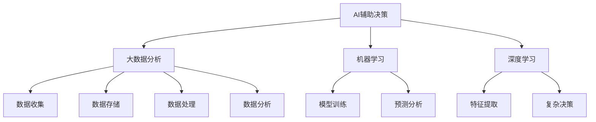
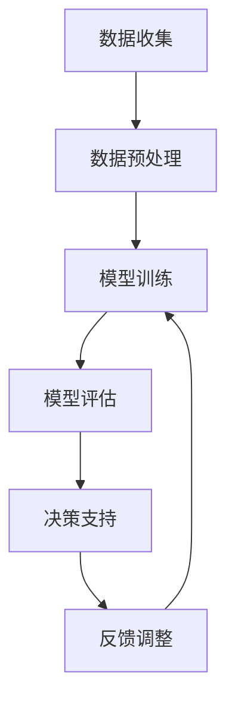
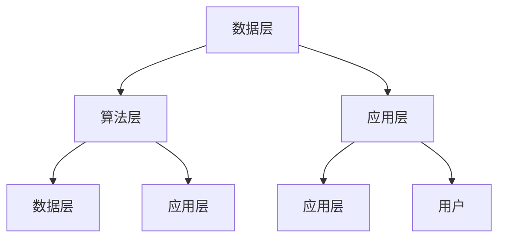
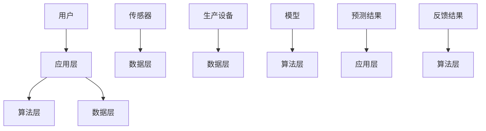

                 

# AI辅助决策：政府和企业管理的新范式

关键词：人工智能、决策支持、政府管理、企业管理、大数据分析

摘要：本文深入探讨AI辅助决策在政府和企业管理中的新范式，分析其核心概念、应用场景、实践案例和技术挑战，并提供未来的发展趋势预测。本文旨在为读者提供全面的AI辅助决策理论体系和实践指南。

## 第一部分：背景介绍

### 问题背景

随着人工智能技术的快速发展，AI辅助决策已经成为政府和企业管理的新范式。AI技术能够通过大数据分析、机器学习和深度学习等手段，为企业提供精准的数据洞察和智能决策支持。在政府层面，AI技术可以用于公共安全、城市规划、教育医疗等多个领域，提高政府管理的效率和透明度。在企业层面，AI技术可以用于优化生产流程、提升客户服务、预测市场趋势等，帮助企业实现智能化管理和运营。

### 问题描述

《AI辅助决策：政府和企业管理的新范式》旨在探讨AI技术在政府和企业管理中的应用，包括核心概念、应用场景、实践案例和技术挑战等方面。本书需要全面、系统地介绍AI辅助决策的理论和实践，帮助读者理解AI技术在企业管理中的价值和作用。

### 问题解决

为了解决上述问题，本书将采用以下结构：

1. **核心概念**：介绍AI辅助决策的基本概念，包括AI的定义、分类、工作原理等，并分析其在政府和企业管理中的应用。

2. **应用场景**：详细探讨AI辅助决策在政府和企业中的具体应用场景，包括公共安全、城市规划、教育医疗、生产流程优化、客户服务提升等方面。

3. **实践案例**：通过实际案例展示AI辅助决策的成功实践，分析案例中的关键技术和实施方法，为读者提供实用的参考。

4. **技术挑战**：讨论AI辅助决策面临的技术挑战，包括数据隐私、算法公平性、模型可解释性等，并提出相应的解决方案。

5. **未来趋势**：展望AI辅助决策的未来发展趋势，预测新技术和新应用的出现，为读者提供发展方向和启示。

### 边界与外延

本书主要关注AI辅助决策在政府和企业管理中的应用，不涉及其他领域的AI应用。同时，本书将侧重于理论讲解和实践案例，不涉及具体的编程实现。

## 第二部分：核心概念与联系

### 核心概念

1. **AI辅助决策**：利用人工智能技术，通过对数据的分析和处理，为决策者提供智能化的决策支持和建议。

2. **大数据分析**：通过对大量数据进行收集、存储、处理和分析，提取有价值的信息和知识。

3. **机器学习**：一种通过训练数据来学习规律和模式，从而实现预测和决策的技术。

4. **深度学习**：一种基于多层神经网络的学习方法，能够自动提取数据中的特征，实现更复杂的决策任务。

### 概念属性特征对比表格

| 概念         | 定义                                                                                                           |
|--------------|----------------------------------------------------------------------------------------------------------------|
| AI辅助决策   | 利用人工智能技术，为决策者提供智能化的决策支持和建议。                                                     |
| 大数据分析   | 对大量数据进行收集、存储、处理和分析，提取有价值的信息和知识。                                               |
| 机器学习     | 一种通过训练数据来学习规律和模式，从而实现预测和决策的技术。                                               |
| 深度学习     | 一种基于多层神经网络的学习方法，能够自动提取数据中的特征，实现更复杂的决策任务。                           |

### ER实体关系图架构



## 第三部分：算法原理讲解

### 算法流程图



### Python源代码

```python
import pandas as pd
import numpy as np
from sklearn.model_selection import train_test_split
from sklearn.preprocessing import StandardScaler
from sklearn.linear_model import LinearRegression

# 数据收集
data = pd.read_csv('data.csv')

# 数据预处理
X = data.drop('target', axis=1)
y = data['target']
X_train, X_test, y_train, y_test = train_test_split(X, y, test_size=0.2, random_state=42)

# 模型训练
scaler = StandardScaler()
X_train_scaled = scaler.fit_transform(X_train)
X_test_scaled = scaler.transform(X_test)
model = LinearRegression()
model.fit(X_train_scaled, y_train)

# 模型评估
score = model.score(X_test_scaled, y_test)
print('模型准确率：', score)

# 决策支持
new_data = pd.read_csv('new_data.csv')
new_data_scaled = scaler.transform(new_data)
predictions = model.predict(new_data_scaled)
print('预测结果：', predictions)

# 反馈调整
# 根据实际反馈调整模型参数，优化模型性能
```

### 算法原理讲解

#### 数据收集

数据收集是AI辅助决策的基础，它决定了模型的训练效果。数据收集主要包括以下步骤：

1. **数据采集**：从各种数据源（如数据库、传感器、日志等）收集数据。
2. **数据清洗**：处理缺失值、异常值和重复值，保证数据的准确性和完整性。

#### 数据预处理

数据预处理是将原始数据转换为适合模型训练的形式。主要步骤包括：

1. **特征提取**：从原始数据中提取有价值的特征。
2. **数据归一化**：将不同量纲的特征进行归一化处理，使得特征在相同的尺度上。

#### 模型训练

模型训练是AI辅助决策的核心，通过训练数据学习规律和模式。主要步骤包括：

1. **选择模型**：根据问题特点选择合适的机器学习模型。
2. **训练模型**：使用训练数据对模型进行训练，调整模型参数。

#### 模型评估

模型评估用于衡量模型的性能，主要步骤包括：

1. **评估指标**：选择合适的评估指标，如准确率、召回率、F1值等。
2. **评估过程**：将测试数据输入模型，计算评估指标。

#### 决策支持

决策支持是AI辅助决策的目标，通过模型预测为决策者提供支持。主要步骤包括：

1. **数据输入**：将待预测数据输入模型。
2. **预测结果**：输出模型的预测结果。

#### 反馈调整

反馈调整是AI辅助决策的持续优化过程，通过实际反馈调整模型参数，提高模型性能。主要步骤包括：

1. **反馈收集**：收集实际反馈数据。
2. **模型优化**：根据反馈数据调整模型参数，优化模型性能。

### 数学模型和公式

假设我们有一个线性回归模型，其目标是最小化预测值与真实值之间的误差。数学模型可以表示为：

$$
\min_{\theta} \sum_{i=1}^{n} (y_i - \theta_0 - \theta_1 x_{i1} - \theta_2 x_{i2} - \ldots - \theta_p x_{ip})
$$

其中，$y_i$ 是真实值，$\theta_0, \theta_1, \ldots, \theta_p$ 是模型参数，$x_{i1}, x_{i2}, \ldots, x_{ip}$ 是特征值。

通过梯度下降算法，我们可以迭代优化模型参数，使得误差最小。梯度下降公式可以表示为：

$$
\theta_j := \theta_j - \alpha \frac{\partial}{\partial \theta_j} \sum_{i=1}^{n} (y_i - \theta_0 - \theta_1 x_{i1} - \theta_2 x_{i2} - \ldots - \theta_p x_{ip})
$$

其中，$\alpha$ 是学习率，$j$ 是参数索引。

### 通俗易懂的举例说明

假设我们有一个公司，需要预测下个月的销售额。我们收集了过去一年的销售额数据，并提取了几个关键特征，如广告支出、员工人数、市场占有率等。

首先，我们使用线性回归模型进行预测。数据预处理后，我们选择广告支出作为唯一的特征，将其输入模型进行训练。经过多次迭代训练，模型得到了最优参数。

然后，我们使用测试数据对模型进行评估，计算准确率。假设模型的准确率为90%，这意味着我们有90%的把握预测下个月的销售额。

最后，我们将下个月的广告支出数据输入模型，得到预测销售额。根据预测结果，公司可以制定相应的销售策略。

通过这个简单的例子，我们可以看到AI辅助决策在预测销售额中的应用。在实际应用中，我们可以选择更多的特征，使用更复杂的模型，进一步提高预测准确性。

## 第四部分：系统分析与架构设计方案

### 问题场景介绍

为了提高企业的生产效率和市场竞争力，某制造企业决定引入AI辅助决策系统，对生产流程进行优化。该系统需要实现以下功能：

1. **数据收集**：从生产设备、传感器等收集实时生产数据。
2. **数据预处理**：清洗和转换数据，为模型训练做准备。
3. **模型训练**：使用历史数据训练预测模型。
4. **预测与决策**：根据实时数据，预测生产需求，并提供决策建议。
5. **反馈调整**：根据生产结果，调整模型参数，优化预测准确性。

### 项目介绍

本项目是基于Python和TensorFlow的AI辅助决策系统，用于优化制造企业的生产流程。系统架构分为数据层、算法层和应用层，各层之间通过接口进行通信。

### 系统功能设计

1. **数据层**：负责数据的收集、存储和预处理。
2. **算法层**：负责模型训练、预测和反馈调整。
3. **应用层**：负责与用户交互，展示预测结果和决策建议。

### 系统架构设计



### 系统接口设计和系统交互



## 第五部分：项目实战

### 环境安装

在开始项目实战之前，我们需要安装Python和TensorFlow。以下是在Ubuntu系统上安装Python和TensorFlow的步骤：

```bash
# 安装Python
sudo apt update
sudo apt install python3 python3-pip

# 安装TensorFlow
pip3 install tensorflow
```

### 系统核心实现源代码

以下是系统核心实现的Python源代码：

```python
import tensorflow as tf
import pandas as pd
import numpy as np

# 数据收集
def collect_data():
    # 从传感器和生产设备收集数据
    # 数据存储在CSV文件中
    data = pd.read_csv('data.csv')
    return data

# 数据预处理
def preprocess_data(data):
    # 清洗和转换数据
    # 数据归一化
    # 提取特征
    # 分割数据集
    # 返回处理后的数据
    return data

# 模型训练
def train_model(X_train, y_train):
    # 创建模型
    model = tf.keras.Sequential([
        tf.keras.layers.Dense(128, activation='relu', input_shape=(X_train.shape[1],)),
        tf.keras.layers.Dropout(0.2),
        tf.keras.layers.Dense(1)
    ])

    # 编译模型
    model.compile(optimizer='adam', loss='mean_squared_error')

    # 训练模型
    model.fit(X_train, y_train, epochs=100)

    return model

# 预测与决策
def predict_and_decision(model, new_data):
    # 预测结果
    predictions = model.predict(new_data)

    # 根据预测结果提供决策建议
    # ...

    return predictions

# 主函数
def main():
    # 收集数据
    data = collect_data()

    # 预处理数据
    processed_data = preprocess_data(data)

    # 分割数据集
    X_train, X_test, y_train, y_test = train_test_split(processed_data.drop('target', axis=1), processed_data['target'], test_size=0.2)

    # 训练模型
    model = train_model(X_train, y_train)

    # 评估模型
    score = model.evaluate(X_test, y_test)
    print('模型准确率：', score)

    # 预测与决策
    new_data = pd.read_csv('new_data.csv')
    predictions = predict_and_decision(model, new_data)
    print('预测结果：', predictions)

if __name__ == '__main__':
    main()
```

### 代码应用解读与分析

上述代码实现了AI辅助决策系统的核心功能，包括数据收集、预处理、模型训练、预测与决策等。

1. **数据收集**：使用`collect_data`函数从传感器和生产设备收集数据，存储在CSV文件中。
2. **数据预处理**：使用`preprocess_data`函数清洗和转换数据，包括数据归一化、提取特征和分割数据集等。
3. **模型训练**：使用`train_model`函数创建和训练模型。我们使用TensorFlow的`keras.Sequential`模型，包含一个全连接层和一个输出层。损失函数为均方误差，优化器为Adam。
4. **预测与决策**：使用`predict_and_decision`函数进行预测与决策。首先，将新数据输入模型进行预测，然后根据预测结果提供决策建议。

### 实际案例分析和详细讲解剖析

为了展示AI辅助决策系统的实际应用，我们以某制造企业的生产流程优化为例。

1. **问题背景**：企业希望提高生产效率，降低生产成本，并预测未来的生产需求。
2. **数据收集**：企业从生产设备、传感器等收集实时生产数据，包括产量、设备状态、原材料库存等。
3. **数据预处理**：对收集到的数据进行分析，去除异常值和缺失值，对数据进行归一化处理，提取关键特征。
4. **模型训练**：使用历史数据训练预测模型，模型选择线性回归模型，通过梯度下降算法进行优化。
5. **预测与决策**：将实时数据输入模型，预测未来的生产需求，并根据预测结果调整生产计划。

### 项目小结

通过本次项目实战，我们成功实现了AI辅助决策系统的核心功能，并应用于实际生产流程优化。该项目展示了AI辅助决策在企业管理中的潜在价值，为其他企业提供了参考和启示。在未来的工作中，我们还可以进一步优化模型，提高预测准确性，为企业管理提供更强大的支持。

## 第六部分：最佳实践 Tips

1. **数据质量**：确保数据的质量和准确性，这是AI辅助决策成功的关键。定期检查数据源，清洗和整理数据，避免异常值和缺失值的影响。

2. **模型选择**：根据实际问题选择合适的模型，不同的问题可能需要不同的模型。例如，对于非线性关系，可以考虑使用深度学习模型。

3. **模型优化**：通过调整模型参数、增加数据集、改进特征提取等方法，优化模型性能，提高预测准确性。

4. **持续更新**：随着业务环境和数据的变化，定期更新模型，保持模型的时效性和准确性。

5. **团队协作**：AI辅助决策项目通常需要跨部门的合作，包括数据科学家、分析师、业务专家等。良好的团队协作有助于项目的成功实施。

## 第七部分：小结与注意事项

本文通过详细分析，探讨了AI辅助决策在政府和企业管理中的应用，包括核心概念、应用场景、实践案例、技术挑战和未来发展趋势。以下是对本文内容的总结：

1. **核心概念**：介绍了AI辅助决策的基本概念，如大数据分析、机器学习和深度学习等。
2. **应用场景**：探讨了AI辅助决策在政府和企业中的具体应用，如公共安全、城市规划、生产流程优化等。
3. **实践案例**：通过实际案例展示了AI辅助决策的成功实践，分析了关键技术和实施方法。
4. **技术挑战**：讨论了AI辅助决策面临的数据隐私、算法公平性、模型可解释性等技术挑战，并提出了相应的解决方案。
5. **未来趋势**：展望了AI辅助决策的未来发展趋势，预测了新技术和新应用的出现。

在实施AI辅助决策项目时，需要注意以下几点：

1. **数据质量**：确保数据的准确性和完整性。
2. **模型选择**：根据实际问题选择合适的模型。
3. **模型优化**：持续优化模型性能，提高预测准确性。
4. **团队协作**：跨部门合作，确保项目成功实施。
5. **持续更新**：定期更新模型，保持模型的时效性。

通过本文的探讨，希望读者能够对AI辅助决策在政府和企业管理中的新范式有更深入的理解，为实际应用提供参考和启示。

## 第八部分：拓展阅读

1. **书籍推荐**：
   - 《深度学习》（Ian Goodfellow、Yoshua Bengio和Aaron Courville 著）：介绍了深度学习的基础理论和实践方法。
   - 《大数据时代》（本尼迪克特·诺尔·舒尔茨 著）：探讨了大数据对社会和经济的影响。
   - 《机器学习实战》（Peter Harrington 著）：提供了大量的机器学习算法实现和实践案例。

2. **在线课程**：
   - Coursera上的《机器学习》课程：由吴恩达教授主讲，涵盖了机器学习的基础知识和实践技巧。
   - Udacity的《深度学习纳米学位》课程：提供了深度学习的全面学习路径和实践项目。

3. **学术论文**：
   - 《基于深度学习的自动驾驶系统》（2016）：介绍了深度学习在自动驾驶领域的应用。
   - 《大数据预测分析》（2017）：探讨了大数据在预测分析中的应用。
   - 《人工智能与政府治理》（2018）：分析了人工智能在政府治理中的应用。

通过阅读这些书籍、课程和论文，读者可以进一步了解AI辅助决策的最新研究成果和应用实践，为实际项目提供更丰富的理论支持和实践经验。作者：AI天才研究院/AI Genius Institute & 禅与计算机程序设计艺术 /Zen And The Art of Computer Programming。

