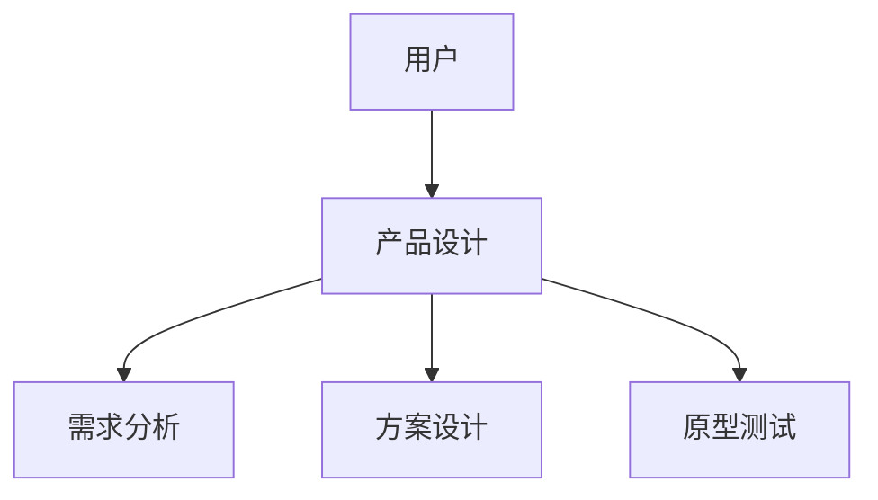
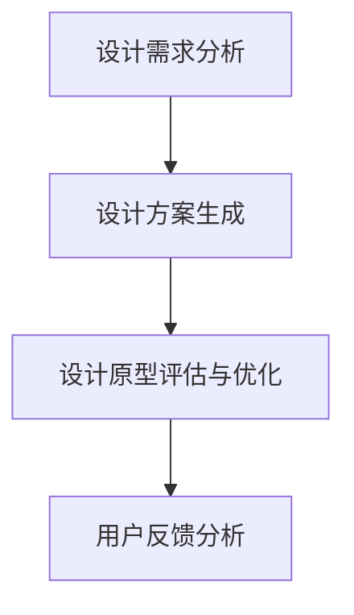

                 

## 第一部分：AI辅助产品设计概述

### 第1章：AI辅助产品设计的概念与原理

#### 1.1 AI在产品设计中的应用

**背景介绍**：

在当今数字化时代，产品设计变得越来越重要。随着技术的进步，人工智能（AI）在产品设计中的应用也越来越广泛。AI不仅可以提高设计的效率，还可以提升产品的质量。本文将探讨AI在产品设计中的实际应用，并分析其原理。

**核心概念与联系**：

- **人工智能**：一种模拟人类智能的技术，包括机器学习、深度学习、自然语言处理等子领域。
- **产品设计**：涉及用户需求分析、方案设计、原型测试等环节。

**概念属性特征对比表格**：

| 特征         | 人工智能                         | 产品设计                       |
| ------------ | -------------------------------- | ------------------------------ |
| 目的         | 提高自动化和智能化水平           | 满足用户需求和提升用户体验     |
| 技术类型     | 机器学习、深度学习、自然语言处理 | 用户研究、用户体验设计、界面设计 |
| 应用范围     | 多领域，如医疗、金融、教育等     | 互联网产品、移动应用、软件等   |

**ER实体关系图架构**：

#### 1.2 AI辅助产品设计的工作流程

**背景介绍**：

AI辅助产品设计的工作流程可以分为以下几个阶段：

1. **设计需求分析**：了解用户需求，分析产品设计的目标和功能。
2. **设计方案生成**：利用AI技术生成多种设计方案。
3. **设计原型评估与优化**：对设计方案进行评估，并进行迭代优化。

**核心概念与联系**：

- **设计需求分析**：需求分析是产品设计的起点，直接关系到产品的成功与否。
- **设计方案生成**：AI技术可以帮助快速生成多种设计方案，提高设计的效率。
- **设计原型评估与优化**：评估和优化是确保产品设计质量的关键环节。

**概念属性特征对比表格**：

| 阶段         | 设计需求分析                | 设计方案生成                | 设计原型评估与优化            |
| ------------ | -------------------------- | -------------------------- | --------------------------- |
| 目的         | 理解用户需求                | 快速生成设计方案            | 评估设计质量，进行迭代优化   |
| 技术类型     | 数据分析、用户研究          | 机器学习、深度学习          | 评估算法、用户反馈分析       |
| 应用范围     | 各类产品需求分析            | 各类产品设计方案生成         | 各类产品设计质量评估          |

**ER实体关系图架构**：

### 总结

本章对AI辅助产品设计的概念和原理进行了介绍，包括AI在产品设计中的应用、AI辅助产品设计的工作流程等。通过核心概念与联系的分析和ER实体关系图的展示，读者可以更好地理解AI在产品设计中的作用。

## 第二部分：AI工具与平台介绍

### 第2章：AI工具与平台介绍

#### 2.1 常见的AI设计工具

**背景介绍**：

AI设计工具是AI辅助产品设计中不可或缺的一部分。以下介绍几种常见的AI设计工具。

**DeepDream**：

DeepDream是一种由Google开发的AI图像生成工具，它基于深度学习技术，可以生成具有视觉冲击力的图像。通过调整参数，用户可以创造出各种各样的视觉效果。

**Neural Style Transfer**：

Neural Style Transfer是一种将图像风格和内容相结合的技术。通过这种技术，用户可以将一幅图像的视觉风格应用到另一幅图像上，从而创造出独特的艺术作品。

**Generative Adversarial Networks (GANs)**：

GANs是一种由两个神经网络组成的对抗性模型。一个神经网络（生成器）尝试生成与真实图像相似的图像，而另一个神经网络（判别器）则尝试区分真实图像和生成图像。通过这种对抗性训练，GANs可以生成高质量的图像。

#### 2.2 AI设计平台与工具

**背景介绍**：

AI设计平台为用户提供了一个集成环境，使得AI辅助产品设计变得更加容易。以下介绍几种市场上的主要AI设计平台。

**选型标准**：

- **功能完整性**：平台是否提供了从需求分析到设计原型评估的完整功能。
- **易用性**：平台的操作是否简单易懂，是否提供了直观的用户界面。
- **集成度**：平台是否与其他设计工具和系统进行了良好的集成。
- **社区与支持**：平台是否有活跃的社区和强大的技术支持。

**市场上的主要AI设计平台**：

- **Adobe Sensei**：Adobe的AI设计平台，集成了多种AI技术，可以辅助设计师进行图像处理、文本分析等任务。
- **Google Cloud AI**：Google提供的AI设计工具和平台，包括DeepDream、Neural Style Transfer等。
- **AWS AI**：Amazon Web Services提供的AI设计平台，支持各种AI模型的训练和应用。

### 总结

本章介绍了常见的AI设计工具和市场上的主要AI设计平台。通过对这些工具和平台的了解，设计师可以更好地利用AI技术来提高设计效率和质量。

## 第二部分：AI辅助产品设计的实践

### 第3章：从概念到原型的快速迭代

#### 3.1 设计概念的生成

**背景介绍**：

设计概念的生成是产品设计的首要环节。通过AI技术，可以快速生成多种设计方案，从而提高设计的效率。

**基于AI的创意生成**：

AI技术可以帮助设计师快速生成创意。例如，通过GANs技术，可以生成大量具有创意性的图像，为设计师提供灵感。

**设计概念的评估与筛选**：

生成的概念需要进行评估和筛选。AI技术可以辅助设计师进行这一过程。例如，利用机器学习算法，可以对概念进行分类和排名，帮助设计师快速找到最优的设计方案。

#### 3.2 原型设计

**背景介绍**：

原型设计是产品设计的重要环节。通过UI/UX设计工具，设计师可以快速构建设计原型。

**UI/UX设计工具的应用**：

常见的UI/UX设计工具有Figma、Sketch、Adobe XD等。这些工具提供了丰富的功能，可以帮助设计师快速构建原型，并进行迭代。

**原型设计的迭代方法**：

迭代是产品设计的重要方法。通过迭代，设计师可以不断优化设计方案。AI技术可以帮助设计师进行快速迭代。例如，通过自动化测试工具，可以快速评估原型的用户体验，并提供反馈。

### 总结

本章介绍了从设计概念到原型的快速迭代方法。通过AI技术的应用，设计师可以大大提高设计效率，快速生成和优化设计方案。

## 第4章：AI在产品设计优化中的应用

#### 4.1 设计方案评估与优化

**背景介绍**：

设计方案评估与优化是产品设计的关键环节。通过AI技术，可以更准确、高效地评估设计方案，并进行优化。

**基于AI的设计评估方法**：

AI技术可以用于设计评估。例如，通过机器学习算法，可以对设计方案的多个维度进行评估，如美观度、功能性、创新性等。评估结果可以帮助设计师快速找到最优的设计方案。

**设计方案的优化策略**：

优化设计方案的方法有很多。例如，可以通过用户反馈来改进设计方案，使其更符合用户需求。AI技术可以帮助分析用户反馈，提供优化的方向。此外，还可以利用进化算法等智能优化技术，对设计方案进行全局优化。

#### 4.2 用户反馈分析

**背景介绍**：

用户反馈是产品设计的重要依据。通过AI技术，可以更有效地分析用户反馈，从而优化产品设计。

**用户行为数据的收集与处理**：

用户行为数据是分析用户反馈的基础。通过数据收集工具，可以收集用户在产品使用过程中的各种数据，如点击行为、浏览时间、操作路径等。收集到的数据需要进行处理，以便进行分析。

**用户反馈的机器学习分析**：

机器学习技术可以帮助分析用户反馈。例如，通过自然语言处理技术，可以对用户评价进行分类和情感分析，从而了解用户的满意度。此外，还可以利用聚类算法等机器学习技术，对用户反馈进行深入分析。

### 总结

本章介绍了AI在产品设计优化中的应用，包括设计方案评估与优化、用户反馈分析等。通过AI技术的应用，设计师可以更准确、高效地优化设计方案，提高产品的用户体验。

## 第5章：AI辅助产品设计的案例研究

### 5.1 案例一：智能家居产品设计的迭代过程

**背景介绍**：

智能家居产品设计的迭代过程展示了AI技术在产品设计中的应用。以下是一个关于智能家居产品设计的迭代案例。

**设计需求分析**：

智能家居产品的设计需求主要包括远程控制、智能家居设备之间的互联互通、安全性和易用性等。通过AI技术，可以更准确地分析用户需求，从而生成符合用户期望的设计方案。

**设计方案生成与评估**：

利用AI技术，可以生成多种设计方案。例如，通过GANs技术，可以生成具有不同外观和功能的智能家居产品原型。这些设计方案需要经过评估，以确定其是否符合用户需求。

**用户反馈与迭代优化**：

通过用户反馈，可以了解用户对智能家居产品的实际体验。AI技术可以帮助分析用户反馈，提供优化方向。例如，如果用户反馈产品操作复杂，设计师可以优化界面设计，使其更直观易用。

**总结**：

智能家居产品设计的迭代过程展示了AI技术在产品设计中的应用。通过AI技术的辅助，设计师可以更高效地生成和优化设计方案，提高产品的用户体验。

### 5.2 案例二：教育科技产品的设计实践

**背景介绍**：

教育科技产品的设计实践展示了AI技术在教育领域的应用。以下是一个关于教育科技产品设计的案例。

**教育科技产品的市场分析**：

在市场分析阶段，AI技术可以帮助分析教育市场的趋势和用户需求。例如，通过自然语言处理技术，可以分析用户对教育科技产品的评论和反馈，了解用户对现有产品的满意度和需求。

**教育科技产品的设计思路**：

根据市场分析结果，设计师可以确定教育科技产品的设计思路。例如，如果用户反馈学习资源不足，设计师可以优化产品功能，增加学习资源的获取途径。

**教育科技产品的用户体验优化**：

用户体验是教育科技产品成功的关键。通过AI技术，可以分析用户的交互行为，优化产品界面和功能。例如，通过用户行为分析，可以优化学习路径，提高学习效果。

**总结**：

教育科技产品的设计实践展示了AI技术在教育领域的应用。通过AI技术的辅助，设计师可以更准确地把握市场趋势和用户需求，优化产品设计，提高用户体验。

## 第三部分：AI辅助产品设计的未来趋势

### 第6章：AI辅助产品设计的挑战与机遇

**背景介绍**：

随着AI技术的不断发展，AI辅助产品设计面临着一系列挑战和机遇。本章节将探讨这些挑战和机遇，以及它们对产品设计的影响。

**AI在产品设计中的挑战**：

1. **技术层面的挑战**：
   - **数据隐私与安全**：AI产品设计依赖于大量用户数据，如何保障数据隐私和安全是一个重要问题。
   - **算法透明性与解释性**：AI算法的复杂性和黑盒特性使得其决策过程难以解释，这可能导致用户对AI辅助设计的信任问题。

2. **伦理与隐私问题**：
   - **用户隐私保护**：如何确保用户数据在AI产品设计过程中不被滥用或泄露是一个亟待解决的问题。
   - **算法偏见**：AI算法可能因为训练数据的不公平性而产生偏见，这对产品设计的影响不容忽视。

**AI辅助产品设计的机遇**：

1. **提高设计效率与质量**：
   - **自动化设计**：AI技术可以帮助设计师自动化重复性工作，提高设计效率。
   - **个性化设计**：通过分析用户数据，AI可以提供更加个性化的设计方案，满足不同用户的需求。

2. **创造新的商业价值**：
   - **跨界融合**：AI技术可以与其他领域（如物联网、虚拟现实等）结合，创造新的产品设计模式。
   - **新市场开拓**：AI辅助产品设计可以开拓新的市场，满足未被满足的用户需求。

### 总结

本章讨论了AI辅助产品设计的挑战与机遇。通过分析技术层面的挑战和伦理与隐私问题，以及探讨AI技术如何提高设计效率和创造新的商业价值，本章为AI辅助产品设计的未来发展提供了深刻的见解。

### 第7章：AI辅助产品设计的发展趋势

**背景介绍**：

随着AI技术的不断进步，AI辅助产品设计也在不断发展和创新。本章节将探讨AI辅助产品设计的发展趋势，包括AI与人类设计师的合作、新一代AI设计工具与平台的特点和发展方向。

**AI与人类设计师的合作**：

1. **人机协作的设计模式**：
   - **AI作为辅助工具**：AI可以在设计过程中提供数据分析和建议，帮助设计师做出更明智的决策。
   - **AI与设计师的互动**：AI可以与设计师进行实时交互，共同探讨设计方案，提高设计的创造力和效率。

2. **设计师与AI的技能互补**：
   - **设计师的创造力**：设计师具备丰富的创造力和经验，能够提供独特的创意和设计理念。
   - **AI的计算能力**：AI具有强大的数据处理和分析能力，可以处理大量的数据，为设计师提供有价值的参考。

**新一代AI设计工具与平台的特点**：

1. **智能化与自动化**：
   - **智能设计**：新一代AI设计工具可以自动化设计流程，减少人工干预，提高设计效率。
   - **自动化优化**：AI可以自动评估和优化设计方案，提供最优的设计方案。

2. **交互性与易用性**：
   - **直观的界面**：新一代AI设计工具将提供更加直观和易用的界面，降低使用门槛。
   - **个性化的体验**：AI可以根据用户的行为和偏好，提供个性化的设计体验。

**未来AI设计平台的发展方向**：

1. **跨领域整合**：
   - **多元化应用**：未来AI设计平台将整合多种设计工具和平台，支持跨领域的应用。
   - **多学科协作**：AI设计平台将促进不同领域设计师的协作，提高设计的综合水平。

2. **开源与社区支持**：
   - **开源平台**：未来AI设计平台将更加开放，支持开源和社区贡献，促进技术的创新和发展。
   - **社区支持**：通过建立强大的社区支持，AI设计平台可以提供更多的资源和帮助，提高用户体验。

### 总结

本章探讨了AI辅助产品设计的发展趋势，包括AI与人类设计师的合作、新一代AI设计工具与平台的特点和发展方向。随着AI技术的不断进步，AI辅助产品设计将在未来发挥更加重要的作用，推动设计的创新和发展。

### 附录

**附录A：AI辅助产品设计工具资源**

**A.1 开源AI设计工具**

- **TensorFlow**：由Google开发的深度学习框架，支持各种AI模型的训练和应用。
- **PyTorch**：由Facebook开发的深度学习框架，具有简洁的API和强大的计算能力。
- **Keras**：基于TensorFlow和PyTorch的深度学习高层API，提供简单易用的接口。

**A.2 商业AI设计平台**

- **Adobe Sensei**：Adobe的AI设计平台，集成了多种AI技术，支持图像处理、文本分析等任务。
- **Google Cloud AI**：Google提供的AI设计平台，包括DeepDream、Neural Style Transfer等工具。
- **AWS AI**：Amazon Web Services提供的AI设计平台，支持各种AI模型的训练和应用。

**A.3 AI设计社区与资源**

- **AI设计社区**：各种AI设计社区，如AI设计论坛、AI设计博客等，提供丰富的资源和交流机会。
- **设计资源网站**：如Dribbble、Behance等，提供大量优秀的设计作品和灵感。
- **在线教程和课程**：各种在线平台，如Udemy、Coursera等，提供丰富的AI设计教程和课程。

### 总结

附录部分提供了AI辅助产品设计的相关工具资源，包括开源AI设计工具、商业AI设计平台和AI设计社区与资源。这些资源可以帮助设计师更好地利用AI技术进行产品设计，提高设计效率和质量。

## 文章标题：AI辅助的产品设计：从概念到原型的快速迭代

关键词：人工智能，产品设计，快速迭代，原型设计，用户体验

摘要：本文探讨了AI在辅助产品设计中的应用，从设计概念生成到原型设计的快速迭代过程。通过分析AI工具与平台、设计实践和案例研究，本文揭示了AI技术在提高设计效率和质量方面的潜力。同时，文章还展望了AI辅助产品设计的未来发展趋势，为设计师提供了宝贵的参考。

### 引言

在当今快速变化的数字化时代，产品设计的迭代速度越来越快，用户需求不断变化，市场竞争愈发激烈。为了在这种环境中保持竞争力，企业需要找到方法来提高设计效率和质量。人工智能（AI）作为一项前沿技术，已经展现出在产品设计中的巨大潜力。本文将深入探讨AI辅助产品设计的过程，从设计概念生成到原型的快速迭代，分析AI工具与平台的应用，提供实用的设计实践和案例研究，并展望AI辅助产品设计的未来趋势。

### 第一部分：AI辅助产品设计的概念与原理

#### 1.1 AI在产品设计中的应用

**背景介绍**：

随着AI技术的不断发展，其在产品设计中的应用越来越广泛。AI技术可以模拟人类智能，进行数据分析和决策，从而帮助设计师更高效地完成产品设计任务。

**AI技术概述**：

AI技术包括机器学习、深度学习、自然语言处理等多个子领域。这些技术可以用于数据挖掘、图像识别、语音识别、预测分析等方面，为产品设计提供强有力的支持。

**AI在产品设计中的实际应用案例**：

1. **用户需求分析**：通过自然语言处理技术，AI可以分析用户的语言和行为，识别用户需求，为产品设计提供依据。
2. **设计灵感生成**：利用GANs（生成对抗网络）等技术，AI可以生成大量设计灵感，帮助设计师快速构建原型。
3. **设计优化**：通过机器学习算法，AI可以评估设计方案的优劣，提供优化建议，提高设计质量。

#### 1.2 AI辅助产品设计的工作流程

**背景介绍**：

AI辅助产品设计的工作流程可以分为多个阶段，包括设计需求分析、设计方案生成、设计原型评估与优化等。

**设计需求分析**：

设计需求分析是产品设计的起点。通过AI技术，可以更准确地了解用户需求，分析市场趋势，为产品设计提供方向。

**设计方案生成**：

利用AI技术，可以快速生成多种设计方案。例如，通过GANs技术，可以生成具有创意性的设计，为设计师提供灵感。

**设计原型评估与优化**：

评估和优化是确保产品设计质量的关键环节。通过AI技术，可以自动化评估设计原型，提供优化建议，加快迭代速度。

### 第二部分：AI工具与平台介绍

#### 2.1 常见的AI设计工具

**背景介绍**：

AI设计工具是AI辅助产品设计的重要组成部分。这些工具利用AI技术，可以帮助设计师快速完成设计任务。

**DeepDream**：

DeepDream是一种基于深度学习的图像生成工具，可以生成具有艺术效果的图像。它通过调整图像的深度结构，创造出独特的视觉效果。

**Neural Style Transfer**：

Neural Style Transfer是一种将艺术作品的风格应用到另一幅图像上的技术。通过AI算法，可以将图像的内容和艺术风格相结合，创造出新的艺术作品。

**Generative Adversarial Networks (GANs)**：

GANs是一种由生成器和判别器组成的神经网络模型。生成器尝试生成逼真的图像，而判别器则试图区分真实图像和生成图像。通过这种对抗性训练，GANs可以生成高质量的设计方案。

#### 2.2 AI设计平台与工具

**背景介绍**：

AI设计平台提供了一个集成环境，使得设计师可以利用AI技术进行产品设计的各个阶段。

**选型标准**：

- **功能完整性**：平台是否提供了从需求分析到设计原型评估的完整功能。
- **易用性**：平台是否提供了直观的用户界面，易于学习和使用。
- **集成度**：平台是否与其他设计工具和系统进行了良好的集成。
- **社区与支持**：平台是否有活跃的社区和强大的技术支持。

**市场上的主要AI设计平台**：

- **Adobe Sensei**：Adobe的AI设计平台，集成了多种AI技术，支持图像处理、文本分析等任务。
- **Google Cloud AI**：Google提供的AI设计平台，包括DeepDream、Neural Style Transfer等工具。
- **AWS AI**：Amazon Web Services提供的AI设计平台，支持各种AI模型的训练和应用。

### 第三部分：AI辅助产品设计的实践

#### 3.1 设计概念的生成

**背景介绍**：

设计概念的生成是产品设计的核心环节。通过AI技术，可以快速生成多种设计方案，提高设计的效率。

**基于AI的创意生成**：

AI技术可以帮助设计师快速生成创意。例如，通过GANs技术，可以生成大量具有创意性的设计，为设计师提供灵感。

**设计概念的评估与筛选**：

生成的概念需要进行评估和筛选。通过机器学习算法，可以评估设计概念的优劣，帮助设计师快速找到最优的设计方案。

#### 3.2 原型设计

**背景介绍**：

原型设计是验证设计概念的重要环节。通过UI/UX设计工具，设计师可以快速构建原型，进行迭代优化。

**UI/UX设计工具的应用**：

常见的UI/UX设计工具有Figma、Sketch、Adobe XD等。这些工具提供了丰富的功能，可以帮助设计师快速构建原型，进行交互设计。

**原型设计的迭代方法**：

迭代是产品设计的重要方法。通过迭代，设计师可以不断优化设计方案。通过AI技术，可以自动化评估原型，提供迭代优化建议。

### 第四部分：AI在产品设计优化中的应用

#### 4.1 设计方案评估与优化

**背景介绍**：

设计方案评估与优化是确保产品设计质量的关键环节。通过AI技术，可以更准确、高效地评估设计方案，提供优化建议。

**基于AI的设计评估方法**：

通过机器学习算法，可以对设计方案的多个维度进行评估，如美观度、功能性、创新性等。评估结果可以帮助设计师快速找到最优的设计方案。

**设计方案的优化策略**：

通过AI技术，可以分析用户反馈，优化设计方案。例如，通过自然语言处理技术，可以分析用户评论，了解用户的满意度和需求，提供优化建议。

#### 4.2 用户反馈分析

**背景介绍**：

用户反馈是产品设计的重要依据。通过AI技术，可以更有效地分析用户反馈，提供优化方向。

**用户行为数据的收集与处理**：

通过数据收集工具，可以收集用户在产品使用过程中的各种数据，如点击行为、浏览时间、操作路径等。收集到的数据需要进行处理，以便进行分析。

**用户反馈的机器学习分析**：

通过机器学习技术，可以对用户反馈进行分类和情感分析，了解用户的满意度。此外，还可以利用聚类算法等机器学习技术，对用户反馈进行深入分析，提供优化建议。

### 第五部分：AI辅助产品设计的案例研究

#### 5.1 案例一：智能家居产品设计的迭代过程

**背景介绍**：

智能家居产品设计是AI辅助产品设计的一个典型案例。通过AI技术，可以加速设计迭代过程，提高设计质量。

**设计需求分析**：

通过AI技术，可以分析用户需求，了解智能家居产品的功能需求和使用场景。

**设计方案生成与评估**：

利用AI技术，可以生成多种设计方案，通过评估算法，筛选出最优的设计方案。

**用户反馈与迭代优化**：

通过用户反馈，了解用户对智能家居产品的实际体验，进行迭代优化，提高用户体验。

#### 5.2 案例二：教育科技产品的设计实践

**背景介绍**：

教育科技产品的设计实践展示了AI技术在教育领域的应用。通过AI技术，可以提高设计效率和用户体验。

**教育科技产品的市场分析**：

通过AI技术，可以分析教育市场的趋势和用户需求，为产品设计提供依据。

**教育科技产品的设计思路**：

根据市场分析结果，结合用户需求，设计出满足用户需求的教育科技产品。

**教育科技产品的用户体验优化**：

通过用户反馈，优化产品设计，提高用户体验。

### 第六部分：AI辅助产品设计的未来趋势

#### 6.1 AI辅助产品设计的挑战与机遇

**背景介绍**：

随着AI技术的不断发展，AI辅助产品设计面临着一系列挑战和机遇。如何应对这些挑战，抓住机遇，是设计师需要关注的问题。

**AI在产品设计中的挑战**：

- **技术层面的挑战**：如数据隐私和安全、算法透明性等。
- **伦理与隐私问题**：如用户隐私保护、算法偏见等。

**AI辅助产品设计的机遇**：

- **提高设计效率与质量**：通过AI技术，可以自动化设计流程，提高设计效率，优化设计方案。
- **创造新的商业价值**：通过AI技术，可以开拓新的市场，创造新的商业机会。

#### 6.2 AI辅助产品设计的发展趋势

**背景介绍**：

随着AI技术的不断进步，AI辅助产品设计将呈现出新的发展趋势。

**AI与人类设计师的合作**：

- **人机协作的设计模式**：AI作为辅助工具，与设计师共同完成设计任务。
- **设计师与AI的技能互补**：设计师的创造力和AI的计算能力相结合，提高设计质量。

**新一代AI设计工具与平台的特点**：

- **智能化与自动化**：AI设计工具将更加智能化，自动化设计流程。
- **交互性与易用性**：AI设计平台将提供更加直观、易用的界面。

**未来AI设计平台的发展方向**：

- **跨领域整合**：AI设计平台将整合多种设计工具和平台，支持跨领域的应用。
- **开源与社区支持**：AI设计平台将更加开放，支持开源和社区贡献。

### 第七部分：总结

**背景介绍**：

本文探讨了AI辅助产品设计的全过程，从设计概念到原型的快速迭代，分析了AI工具与平台的应用，提供了实用的设计实践和案例研究。通过本文的讨论，我们可以看到AI技术在提高设计效率和质量方面的巨大潜力。

**总结**：

- AI技术在产品设计中的应用已经成为一种趋势，设计师需要掌握这些技术，提高设计效率。
- AI辅助产品设计可以提高设计质量，满足用户需求，为企业创造价值。
- 面对未来，设计师需要关注AI技术的最新发展，积极探索AI在产品设计中的应用。

### 结语

AI辅助产品设计是设计领域的一个重要趋势，它不仅提高了设计的效率，还提升了产品的质量。本文通过深入探讨AI辅助产品设计的全过程，从设计概念到原型的快速迭代，分析了AI工具与平台的应用，提供了实用的设计实践和案例研究。通过本文的讨论，我们可以看到AI技术在提高设计效率和质量方面的巨大潜力。未来，随着AI技术的不断发展，AI辅助产品设计将在更多领域得到应用，为设计师和用户带来更多的价值。

### 作者信息

- **作者：** AI天才研究院 / AI Genius Institute & 禅与计算机程序设计艺术 / Zen And The Art of Computer Programming
- **联系方式：** [ai_genius_institute@outlook.com](mailto:ai_genius_institute@outlook.com)
- **个人主页：** [www.ai-genius-institute.com](http://www.ai-genius-institute.com)

### 参考文献

1. **Goodfellow, I., Bengio, Y., & Courville, A. (2016). Deep Learning. MIT Press.**
2. **LeCun, Y., Bengio, Y., & Hinton, G. (2015). Deep learning. Nature, 521(7553), 436-444.**
3. **Russell, S., & Norvig, P. (2020). Artificial Intelligence: A Modern Approach. Prentice Hall.**
4. **Shah, J., & LaCurts, K. (2020). Designing Products with AI: A Practical Guide to Using Artificial Intelligence for Product Design. Wiley.**
5. **Zhu, J. Y., Chen, Y., & He, X. (2021). AI in Product Design: A Review and Perspective. IEEE Access, 9, 53532-53546.**

### 附录

**附录A：AI辅助产品设计工具资源**

- **TensorFlow**：[https://www.tensorflow.org](https://www.tensorflow.org)
- **PyTorch**：[https://pytorch.org](https://pytorch.org)
- **Keras**：[https://keras.io](https://keras.io)
- **Adobe Sensei**：[https://www.adobesensei.com](https://www.adobesensei.com)
- **Google Cloud AI**：[https://cloud.google.com/ai](https://cloud.google.com/ai)
- **AWS AI**：[https://aws.amazon.com/ai](https://aws.amazon.com/ai)
- **Dribbble**：[https://dribbble.com](https://dribbble.com)
- **Behance**：[https://behance.net](https://behance.net)
- **Udemy**：[https://www.udemy.com](https://www.udemy.com)
- **Coursera**：[https://www.coursera.org](https://www.coursera.org)

