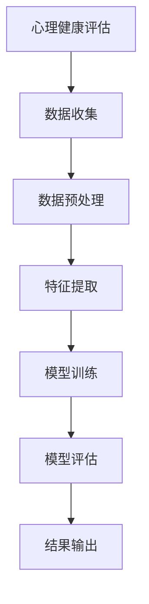
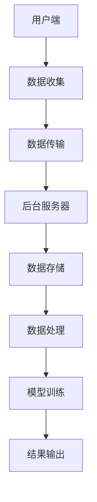

                 

# AI辅助的心理健康：智能情绪分析与支持

## 关键词
- AI
- 心理健康
- 智能情绪分析
- 机器学习
- 情感计算

## 摘要
随着人工智能（AI）技术的不断发展，其在心理健康领域的应用逐渐成为研究热点。本文将深入探讨AI辅助心理健康，尤其是智能情绪分析的基本原理、技术细节和应用实践。我们将从AI在心理健康领域的应用概述出发，逐步分析智能情绪分析的技术细节，并探讨AI在心理健康评估、诊断和支持系统中的应用案例，最后展望AI辅助心理健康的未来发展。

## 目录大纲

### 第一部分：AI与心理健康概述

#### 第1章：AI在心理健康领域的应用概述
##### 1.1 AI技术在心理健康研究中的地位和作用
##### 1.2 AI在心理健康干预中的潜在价值
##### 1.3 心理健康与智能情绪分析的关系

#### 第2章：智能情绪分析的基本原理
##### 2.1 情绪识别与情感计算
##### 2.2 机器学习在情绪分析中的应用
##### 2.3 情绪分析的评估指标与模型性能

#### 第3章：AI辅助心理健康的案例分析
##### 3.1 线上心理健康平台的应用
##### 3.2 AI在心理咨询中的应用
##### 3.3 智能情绪分析在临床诊断中的应用

### 第二部分：智能情绪分析技术详解

#### 第4章：情感计算技术
##### 4.1 情感计算的基本概念
##### 4.2 情感计算的数据来源
##### 4.3 情感计算的主要算法与技术

#### 第5章：情绪识别与分类
##### 5.1 情绪识别的挑战与解决方案
##### 5.2 情绪分类算法比较
##### 5.3 情绪识别的应用场景

#### 第6章：机器学习在情绪分析中的应用
##### 6.1 机器学习在情绪分析中的优势
##### 6.2 常见的机器学习算法与模型
##### 6.3 情绪分析的模型训练与优化

### 第三部分：AI辅助心理健康实践

#### 第7章：AI辅助心理评估与诊断
##### 7.1 心理评估与诊断的基本流程
##### 7.2 基于AI的心理评估工具开发
##### 7.3 AI在心理诊断中的应用案例

#### 第8章：智能情绪支持系统设计
##### 8.1 智能情绪支持系统的构建
##### 8.2 支持系统的交互设计
##### 8.3 支持系统的性能评估与优化

#### 第9章：AI辅助心理健康项目实战
##### 9.1 项目背景与目标
##### 9.2 项目开发流程
##### 9.3 项目效果评估与分析

#### 第10章：AI辅助心理健康的未来发展
##### 10.1 技术趋势与发展方向
##### 10.2 潜在挑战与解决方案
##### 10.3 AI与心理健康的伦理问题与法律框架

### 附录

#### 附录A：情绪分析常用工具和库
##### A.1 Python中的情感分析库
##### A.2 常见情感分析API
##### A.3 情绪分析开源项目介绍

#### 附录B：情绪分析数学模型与公式
##### B.1 情绪识别的数学模型
##### B.2 情绪分类的损失函数
##### B.3 情绪分析中的统计方法

#### 附录C：代码示例与实战指南
##### C.1 数据预处理代码示例
##### C.2 情绪识别算法实现
##### C.3 情绪分类模型训练与评估

## 第一部分：AI与心理健康概述

### 第1章：AI在心理健康领域的应用概述

#### 1.1 AI技术在心理健康研究中的地位和作用

人工智能技术在心理健康研究中扮演着越来越重要的角色。首先，AI技术能够通过收集和分析大量的数据，帮助研究人员更好地理解心理健康的复杂性和多样性。例如，通过自然语言处理技术，可以对大量的心理健康报告和病例进行分析，提取出有价值的模式和特征。此外，AI技术还可以用于心理健康评估、诊断和治疗等各个环节。

在心理健康评估方面，AI可以通过分析个体的行为数据，如语言、情绪、生理信号等，提供实时的心理健康状态评估。例如，通过语音识别和情感分析技术，可以实时监测用户的情绪状态，为心理健康干预提供依据。

在心理健康诊断方面，AI可以通过分析个体的行为数据和医疗记录，辅助医生进行诊断。例如，通过深度学习算法，可以从大量的病例数据中学习到各种心理疾病的特征，帮助医生进行准确诊断。

在心理健康治疗方面，AI可以提供个性化的治疗方案。通过分析个体的行为数据和治疗效果，AI可以动态调整治疗方案，提高治疗效果。

#### 1.2 AI在心理健康干预中的潜在价值

AI技术在心理健康干预中具有巨大的潜在价值。首先，AI可以提供个性化的心理健康服务。通过分析个体的行为数据，AI可以了解个体的心理健康状况，提供个性化的心理健康建议和干预措施。

其次，AI可以提高心理健康干预的效率和准确性。例如，通过自然语言处理技术，AI可以自动识别个体的问题和需求，提供针对性的心理健康服务。此外，AI还可以通过自动化流程，减少人为干预，提高心理健康干预的效率。

最后，AI可以帮助心理健康专业人士更好地管理患者。通过分析大量的数据，AI可以帮助医生更好地了解患者的心理健康状况，制定个性化的治疗方案，提高治疗效果。

#### 1.3 心理健康与智能情绪分析的关系

心理健康与智能情绪分析密切相关。情绪是心理健康的重要组成部分，情绪的稳定和健康对于个体的心理状态和社会功能至关重要。智能情绪分析技术可以通过分析个体的情绪状态，为心理健康评估、诊断和治疗提供重要的依据。

首先，智能情绪分析可以实时监测个体的情绪状态。通过分析个体的语言、语音、生理信号等数据，智能情绪分析技术可以识别出个体的情绪变化，为心理健康干预提供实时依据。

其次，智能情绪分析可以帮助个体更好地理解自己的情绪。通过分析个体的情绪数据，个体可以了解自己的情绪模式，识别出可能的情绪问题，从而采取积极的措施进行干预。

最后，智能情绪分析还可以用于心理健康评估和诊断。通过分析个体的情绪数据，智能情绪分析技术可以辅助医生进行心理健康评估，提高诊断的准确性。

### 第2章：智能情绪分析的基本原理

#### 2.1 情绪识别与情感计算

情绪识别是智能情绪分析的基础。情绪识别是指通过分析个体的行为数据，如语言、语音、生理信号等，识别出个体的情绪状态。情感计算是情绪识别的核心技术，它通过构建情感模型，对情感数据进行自动分析和处理。

情感计算的基本原理包括以下几个方面：

1. **数据收集**：通过传感器、摄像头、语音识别等技术，收集个体的情感数据，如面部表情、语音特征、生理信号等。

2. **特征提取**：对收集到的情感数据进行特征提取，如面部表情的特征点、语音的频谱特征、生理信号的时域特征等。

3. **情感模型构建**：利用机器学习算法，构建情感模型。情感模型通常包括情感分类模型和情感强度模型。情感分类模型用于识别个体的情绪类型，如快乐、悲伤、愤怒等；情感强度模型用于评估个体情绪的强度。

4. **情感分析**：利用构建好的情感模型，对新的情感数据进行分析，识别个体的情绪状态。

#### 2.2 机器学习在情绪分析中的应用

机器学习在情绪分析中发挥着重要作用。通过机器学习算法，可以从大量的情感数据中学习到情绪模式，提高情绪识别的准确性。

常见的机器学习算法包括：

1. **监督学习算法**：如支持向量机（SVM）、决策树、随机森林等。这些算法通过对已标记的情感数据集进行训练，构建情感分类模型。

2. **无监督学习算法**：如聚类算法、主成分分析（PCA）等。这些算法无需对情感数据集进行标记，可以从情感数据中自动识别出情绪模式。

3. **深度学习算法**：如卷积神经网络（CNN）、循环神经网络（RNN）、长短期记忆网络（LSTM）等。深度学习算法可以自动提取情感数据的高层次特征，提高情绪识别的准确性。

#### 2.3 情绪分析的评估指标与模型性能

情绪分析的评估指标主要包括准确率、召回率、精确率等。准确率是指模型正确识别出情绪的比例；召回率是指模型正确识别出的情绪在所有实际情绪中的比例；精确率是指模型正确识别出的情绪在所有识别为该情绪的比例。

为了评估模型性能，可以使用以下方法：

1. **交叉验证**：通过将数据集分为训练集和测试集，多次训练和测试，评估模型的稳定性和泛化能力。

2. **混淆矩阵**：通过混淆矩阵可以直观地展示模型对各类情绪的识别效果。

3. **ROC曲线与AUC**：ROC曲线（接收者操作特征曲线）用于评估模型在不同阈值下的识别性能；AUC（曲线下面积）用于评估模型的总体识别性能。

### 第3章：AI辅助心理健康的案例分析

#### 3.1 线上心理健康平台的应用

线上心理健康平台是AI在心理健康领域的一个重要应用。这些平台通常提供在线心理咨询、心理健康评估和干预等服务。

**应用案例**：某线上心理健康平台通过AI技术，提供以下服务：

1. **心理健康评估**：平台使用自然语言处理和情感分析技术，对用户上传的文字、语音和视频进行分析，评估用户的心理健康状况。

2. **个性化推荐**：平台根据用户的心理健康评估结果，推荐相应的心理健康课程、心理测试和心理咨询服务。

3. **实时咨询**：平台通过AI技术，实现实时心理咨询，用户可以通过文字、语音或视频与心理咨询师进行交流。

#### 3.2 AI在心理咨询中的应用

AI在心理咨询中的应用，为心理咨询提供了新的方式和方法。

**应用案例**：某AI心理咨询系统通过以下方式提供服务：

1. **心理诊断**：系统通过分析用户的行为数据和病史，辅助心理咨询师进行心理诊断。

2. **情绪反馈**：系统通过情感分析技术，实时监测用户的情绪状态，为心理咨询师提供情绪反馈。

3. **自动化建议**：系统根据心理咨询师的经验和AI分析结果，提供自动化的心理咨询建议。

#### 3.3 智能情绪分析在临床诊断中的应用

智能情绪分析在临床诊断中具有重要作用，可以帮助医生更准确地诊断心理疾病。

**应用案例**：某智能情绪分析系统在临床诊断中的应用：

1. **情绪识别**：系统通过分析患者的语言、语音和面部表情，识别患者的情绪状态。

2. **诊断辅助**：系统根据患者的情绪数据，结合患者的病史和临床检查结果，提供诊断辅助。

3. **治疗效果评估**：系统在治疗过程中，持续监测患者的情绪变化，评估治疗效果，为医生调整治疗方案提供依据。

## 第二部分：智能情绪分析技术详解

### 第4章：情感计算技术

情感计算是智能情绪分析的核心技术。它通过分析个体的情感数据，实现对情绪的自动识别、理解和处理。

#### 4.1 情感计算的基本概念

情感计算的基本概念包括以下几个方面：

1. **情感数据**：情感数据是指与个体情绪状态相关的数据，如语言、语音、面部表情、生理信号等。

2. **情感识别**：情感识别是指通过分析情感数据，识别个体的情绪状态。

3. **情感理解**：情感理解是指对情感数据进行深入分析，理解情感的含义和背景。

4. **情感处理**：情感处理是指根据情感分析结果，采取相应的措施，如情绪调节、决策支持等。

#### 4.2 情感计算的数据来源

情感计算的数据来源主要包括以下几个方面：

1. **语言数据**：通过自然语言处理技术，分析个体的语言表达，识别情绪状态。

2. **语音数据**：通过语音识别和语音情感分析技术，分析个体的语音特征，识别情绪状态。

3. **面部表情数据**：通过计算机视觉技术，分析个体的面部表情，识别情绪状态。

4. **生理信号数据**：通过生理信号传感器，分析个体的生理信号，如心率、血压等，识别情绪状态。

#### 4.3 情感计算的主要算法与技术

情感计算的主要算法和技术包括以下几个方面：

1. **情感识别算法**：如支持向量机（SVM）、决策树、神经网络等。

2. **情感理解算法**：如隐马尔可夫模型（HMM）、循环神经网络（RNN）、长短期记忆网络（LSTM）等。

3. **情感处理算法**：如情绪调节算法、情绪反应预测算法等。

4. **情感数据分析工具**：如Python的NLTK、TextBlob、SpeechRecognition等库，用于情感数据的收集、处理和分析。

### 第5章：情绪识别与分类

情绪识别与分类是智能情绪分析的重要组成部分。它通过对情绪数据的分析和分类，实现对个体情绪状态的准确识别。

#### 5.1 情绪识别的挑战与解决方案

情绪识别面临的挑战主要包括以下几个方面：

1. **情绪表达的多样性**：个体的情绪表达方式多种多样，不同人在相同的情绪状态下可能会有不同的表达。

2. **情绪的复杂性**：情绪是多维度的，包括情绪的类型、强度和变化等。

3. **数据的噪声和误差**：情感数据往往受到噪声和误差的影响，这会影响情绪识别的准确性。

解决方案包括：

1. **数据预处理**：通过数据清洗和归一化等预处理技术，提高情感数据的质量。

2. **多模态数据融合**：结合多种情感数据源，如语言、语音、面部表情等，提高情绪识别的准确性。

3. **深度学习算法**：如卷积神经网络（CNN）、循环神经网络（RNN）等，可以自动提取情感数据的高层次特征，提高情绪识别的准确性。

#### 5.2 情绪分类算法比较

常见的情绪分类算法包括：

1. **监督学习算法**：如支持向量机（SVM）、决策树、随机森林等。

2. **无监督学习算法**：如聚类算法、主成分分析（PCA）等。

3. **深度学习算法**：如卷积神经网络（CNN）、循环神经网络（RNN）、长短期记忆网络（LSTM）等。

不同算法在情绪分类中的表现各有优劣。监督学习算法需要大量的标记数据，但性能稳定；无监督学习算法无需标记数据，但性能相对较低；深度学习算法可以自动提取情感数据的高层次特征，性能优异，但训练时间较长。

#### 5.3 情绪识别的应用场景

情绪识别在许多应用场景中具有重要价值，包括：

1. **心理健康监测**：通过实时监测个体的情绪状态，为心理健康干预提供依据。

2. **人机交互**：通过识别用户的情绪状态，实现更自然、更人性化的交互体验。

3. **智能客服**：通过识别用户的情绪状态，提供更个性化的服务和建议。

4. **情感营销**：通过分析用户的情绪状态，了解用户的需求和偏好，实现更精准的营销策略。

### 第6章：机器学习在情绪分析中的应用

机器学习在情绪分析中发挥着重要作用，可以提高情绪识别的准确性和效率。

#### 6.1 机器学习在情绪分析中的优势

机器学习在情绪分析中的优势包括：

1. **自动化特征提取**：机器学习算法可以自动从数据中提取特征，减少人工干预。

2. **适应性强**：机器学习算法可以根据不同的应用场景和需求，调整参数和模型结构。

3. **高准确性**：通过大量训练数据，机器学习算法可以学习到复杂的情绪模式，提高情绪识别的准确性。

#### 6.2 常见的机器学习算法与模型

常见的机器学习算法和模型包括：

1. **监督学习算法**：如支持向量机（SVM）、决策树、随机森林等。

2. **无监督学习算法**：如聚类算法、主成分分析（PCA）等。

3. **深度学习算法**：如卷积神经网络（CNN）、循环神经网络（RNN）、长短期记忆网络（LSTM）等。

#### 6.3 情绪分析的模型训练与优化

情绪分析的模型训练与优化包括以下几个步骤：

1. **数据准备**：收集和整理情感数据，进行数据预处理，如数据清洗、归一化等。

2. **模型选择**：根据应用场景和需求，选择合适的机器学习算法和模型。

3. **模型训练**：使用训练数据集，对模型进行训练，调整模型参数，提高模型性能。

4. **模型评估**：使用测试数据集，评估模型性能，如准确率、召回率、精确率等。

5. **模型优化**：根据模型评估结果，调整模型参数，优化模型性能。

6. **模型部署**：将训练好的模型部署到实际应用场景，如心理健康监测、人机交互等。

## 第三部分：AI辅助心理健康实践

### 第7章：AI辅助心理评估与诊断

AI辅助心理评估与诊断是AI在心理健康领域的重要应用，它通过分析个体的情感数据，为心理评估和诊断提供支持。

#### 7.1 心理评估与诊断的基本流程

心理评估与诊断的基本流程包括以下几个步骤：

1. **数据收集**：通过问卷调查、面谈、生理信号监测等方式，收集个体的心理数据。

2. **数据预处理**：对收集到的心理数据，进行清洗、归一化等预处理，提高数据质量。

3. **特征提取**：从预处理后的数据中提取关键特征，如情感特征、认知特征等。

4. **模型训练**：使用训练数据集，训练心理评估与诊断模型。

5. **模型评估**：使用测试数据集，评估模型性能，如准确率、召回率、精确率等。

6. **模型应用**：将训练好的模型应用于实际心理评估与诊断场景。

#### 7.2 基于AI的心理评估工具开发

基于AI的心理评估工具开发，主要包括以下几个步骤：

1. **需求分析**：明确心理评估工具的需求，如评估目标、用户群体、评估指标等。

2. **数据收集**：根据需求，收集相关的心理数据，包括语言、语音、面部表情、生理信号等。

3. **数据预处理**：对收集到的心理数据，进行清洗、归一化等预处理。

4. **特征提取**：从预处理后的数据中，提取关键特征，如情感特征、认知特征等。

5. **模型选择**：根据评估目标，选择合适的机器学习算法和模型，如支持向量机（SVM）、决策树、神经网络等。

6. **模型训练**：使用训练数据集，训练心理评估模型。

7. **模型评估**：使用测试数据集，评估模型性能。

8. **模型部署**：将训练好的模型部署到实际应用场景，如心理健康评估平台。

#### 7.3 AI在心理诊断中的应用案例

AI在心理诊断中的应用案例，包括以下几个方面：

1. **抑郁症诊断**：某AI系统通过分析个体的情感数据，辅助医生进行抑郁症的诊断。该系统使用深度学习算法，从个体的情感数据中学习到抑郁症的特征，提高了诊断的准确性。

2. **焦虑症诊断**：某AI系统通过分析个体的情感数据和生理信号，辅助医生进行焦虑症的诊断。该系统结合情感计算和生理信号分析技术，提高了诊断的准确性。

3. **心理健康风险评估**：某AI系统通过分析个体的情感数据和行为数据，评估个体的心理健康风险。该系统结合情感计算和行为分析技术，为心理健康干预提供了重要的依据。

### 第8章：智能情绪支持系统设计

智能情绪支持系统是AI在心理健康领域的另一个重要应用。它通过分析个体的情感数据，提供个性化的情绪支持和干预。

#### 8.1 智能情绪支持系统的构建

智能情绪支持系统的构建主要包括以下几个步骤：

1. **需求分析**：明确智能情绪支持系统的功能需求，如情绪监测、情绪分析、情绪干预等。

2. **系统设计**：根据需求分析，设计智能情绪支持系统的架构和功能模块。

3. **数据收集**：收集与情绪相关的数据，如语言、语音、面部表情、生理信号等。

4. **数据预处理**：对收集到的情绪数据，进行清洗、归一化等预处理。

5. **特征提取**：从预处理后的数据中，提取关键特征，如情感特征、认知特征等。

6. **模型训练**：使用训练数据集，训练情绪分析模型。

7. **模型评估**：使用测试数据集，评估模型性能。

8. **系统部署**：将训练好的模型部署到实际应用场景，如智能客服、心理健康监测等。

#### 8.2 支持系统的交互设计

智能情绪支持系统的交互设计主要包括以下几个方面：

1. **用户界面**：设计用户友好的界面，方便用户使用智能情绪支持系统。

2. **交互方式**：提供多种交互方式，如文本、语音、视频等，满足不同用户的需求。

3. **情绪识别**：通过情感计算技术，实时监测用户的情绪状态，提供个性化的情绪支持。

4. **情绪反馈**：系统根据情绪分析结果，提供情绪反馈和干预建议，如情绪调节技巧、心理咨询预约等。

#### 8.3 支持系统的性能评估与优化

智能情绪支持系统的性能评估与优化主要包括以下几个步骤：

1. **性能评估**：使用测试数据集，评估智能情绪支持系统的性能，如准确率、召回率、精确率等。

2. **性能优化**：根据性能评估结果，调整模型参数和系统架构，提高智能情绪支持系统的性能。

3. **用户反馈**：收集用户的反馈，了解用户对智能情绪支持系统的满意度，优化系统设计。

4. **持续迭代**：根据用户反馈和性能评估结果，持续迭代智能情绪支持系统，提高用户体验和系统性能。

### 第9章：AI辅助心理健康项目实战

#### 9.1 项目背景与目标

本案例是一个AI辅助心理健康项目，旨在通过智能情绪分析技术，提供个性化的心理健康服务。项目背景如下：

1. **心理健康问题严重**：随着社会压力的增大，心理健康问题日益严重，需要有效的干预手段。

2. **技术发展成熟**：人工智能技术在心理健康领域的应用逐渐成熟，为项目提供了技术支持。

3. **市场需求**：市场需求巨大，用户对个性化心理健康服务的需求不断增长。

项目目标如下：

1. **提供个性化心理健康服务**：通过智能情绪分析技术，为用户提供个性化的心理健康服务。

2. **提高心理健康干预效果**：通过数据分析，提高心理健康干预的效果。

3. **降低心理健康干预成本**：通过自动化流程，降低心理健康干预的成本。

#### 9.2 项目开发流程

项目开发流程主要包括以下几个阶段：

1. **需求分析**：明确项目的功能需求，如情绪监测、情绪分析、情绪干预等。

2. **系统设计**：设计系统的架构和功能模块，确保系统能够满足需求。

3. **数据收集**：收集与情绪相关的数据，如语言、语音、面部表情、生理信号等。

4. **数据预处理**：对收集到的情绪数据，进行清洗、归一化等预处理。

5. **模型训练**：使用训练数据集，训练情绪分析模型。

6. **模型评估**：使用测试数据集，评估模型性能，如准确率、召回率、精确率等。

7. **系统部署**：将训练好的模型部署到实际应用场景，如智能客服、心理健康监测等。

8. **性能优化**：根据性能评估结果，调整模型参数和系统架构，提高系统性能。

9. **用户反馈**：收集用户的反馈，优化系统设计。

10. **持续迭代**：根据用户反馈和性能评估结果，持续迭代系统，提高用户体验和系统性能。

#### 9.3 项目效果评估与分析

项目效果评估与分析主要包括以下几个方面：

1. **性能评估**：使用测试数据集，评估智能情绪支持系统的性能，如准确率、召回率、精确率等。

2. **用户满意度**：收集用户的反馈，评估用户对智能情绪支持系统的满意度。

3. **心理健康干预效果**：分析用户接受心理健康干预后的心理健康状况，评估干预效果。

4. **成本效益分析**：分析项目投入与收益，评估项目的经济效益。

### 第10章：AI辅助心理健康的未来发展

#### 10.1 技术趋势与发展方向

随着人工智能技术的不断发展，AI辅助心理健康在未来将呈现出以下几个趋势和发展方向：

1. **多模态数据融合**：结合多种数据源，如语言、语音、面部表情、生理信号等，提高情绪识别的准确性。

2. **个性化心理健康服务**：基于个体差异，提供个性化的心理健康服务。

3. **实时心理健康监测**：实现实时心理健康监测，提供及时的心理健康干预。

4. **心理健康预测**：通过大数据分析，预测心理健康问题的发生和发展趋势。

5. **心理健康评估与诊断**：结合机器学习和深度学习技术，提高心理健康评估与诊断的准确性。

6. **心理健康干预**：通过虚拟现实、增强现实等技术，提供更加直观、互动的心理健康干预手段。

#### 10.2 潜在挑战与解决方案

AI辅助心理健康在发展过程中，面临着以下几个潜在挑战：

1. **数据隐私**：心理健康数据具有敏感性，需要确保数据的安全性和隐私性。

2. **算法透明度**：机器学习算法的黑箱特性，使得用户难以理解算法的决策过程，需要提高算法的透明度。

3. **模型泛化能力**：模型在不同人群和应用场景中的泛化能力有限，需要进一步优化模型。

4. **心理健康伦理问题**：心理健康领域的伦理问题，如用户同意、隐私保护等，需要制定相应的伦理规范和法律框架。

解决方案包括：

1. **数据加密和去标识化**：通过数据加密和去标识化技术，保护用户数据的安全性和隐私性。

2. **算法解释性**：通过算法解释性技术，提高机器学习算法的可解释性。

3. **模型可解释性**：通过构建可解释的机器学习模型，提高模型的透明度。

4. **伦理规范和法律框架**：制定心理健康领域的伦理规范和法律框架，规范AI在心理健康领域的应用。

#### 10.3 AI与心理健康的伦理问题与法律框架

AI与心理健康伦理问题主要包括以下几个方面：

1. **用户同意**：用户在接受心理健康服务时，需要明确了解AI技术的应用，并同意使用自己的数据。

2. **隐私保护**：心理健康数据具有敏感性，需要确保数据的保密性和隐私性。

3. **数据共享**：在数据共享过程中，需要确保数据的匿名化和安全性。

4. **算法偏见**：避免机器学习算法在心理健康评估和诊断中产生偏见。

法律框架方面，需要制定相应的法律法规，规范AI在心理健康领域的应用。例如，制定心理健康数据保护法、算法伦理规范等。

## 附录

### 附录A：情绪分析常用工具和库

#### A.1 Python中的情感分析库

Python中有许多常用的情感分析库，如NLTK、TextBlob、VADER等。

- **NLTK**：自然语言处理工具包，提供情感分析功能。
- **TextBlob**：基于NLTK，提供简化的情感分析接口。
- **VADER**：适用于社交媒体文本的情感分析工具。

#### A.2 常见情感分析API

常见的情感分析API包括Google Cloud Natural Language API、IBM Watson Natural Language Understanding API等。

- **Google Cloud Natural Language API**：提供文本情感分析、实体识别等功能。
- **IBM Watson Natural Language Understanding API**：提供文本情感分析、关键词提取等功能。

#### A.3 情绪分析开源项目介绍

- **Sentiment Analysis**：基于Python的开源情感分析项目，包括多个情感分析算法。
- **EmoPy**：基于LSTM的Python情感分析库。

### 附录B：情绪分析数学模型与公式

#### B.1 情绪识别的数学模型

情绪识别的数学模型通常包括情感分类模型和情感强度模型。

- **情感分类模型**：使用支持向量机（SVM）进行情感分类。
- **情感强度模型**：使用回归模型进行情感强度的预测。

#### B.2 情绪分类的损失函数

常用的情绪分类损失函数包括交叉熵损失函数。

- **交叉熵损失函数**：$$H(y, \hat{y}) = -\sum_{i=1}^{n} y_i \log(\hat{y}_i)$$

#### B.3 情绪分析中的统计方法

情绪分析中的统计方法包括贝叶斯分类、卡方检验等。

- **贝叶斯分类**：基于贝叶斯定理，用于分类问题。
- **卡方检验**：用于检验两个分类变量之间的独立性。

### 附录C：代码示例与实战指南

#### C.1 数据预处理代码示例

```python
import pandas as pd
from textblob import TextBlob

# 读取数据
data = pd.read_csv('data.csv')

# 数据清洗
data['text'] = data['text'].str.strip()

# 数据归一化
data['text'] = data['text'].apply(lambda x: x.lower())

# 情感分析
data['sentiment'] = data['text'].apply(lambda x: TextBlob(x).sentiment.polarity)
```

#### C.2 情绪识别算法实现

```python
from sklearn.model_selection import train_test_split
from sklearn.svm import SVC
from sklearn.metrics import classification_report

# 数据划分
X_train, X_test, y_train, y_test = train_test_split(data['text'], data['sentiment'], test_size=0.2, random_state=42)

# 模型训练
model = SVC(kernel='linear')
model.fit(X_train, y_train)

# 模型评估
predictions = model.predict(X_test)
print(classification_report(y_test, predictions))
```

#### C.3 情绪分类模型训练与评估

```python
from sklearn.model_selection import train_test_split
from sklearn.ensemble import RandomForestClassifier
from sklearn.metrics import accuracy_score

# 数据划分
X_train, X_test, y_train, y_test = train_test_split(data['text'], data['sentiment'], test_size=0.2, random_state=42)

# 模型训练
model = RandomForestClassifier(n_estimators=100)
model.fit(X_train, y_train)

# 模型评估
predictions = model.predict(X_test)
print('Accuracy:', accuracy_score(y_test, predictions))
```

### 附录D：心理健康评估流程图



### 附录E：心理健康监测系统架构设计



### 附录F：心理健康监测系统交互设计

```mermaid
sequence
    User -->|发起请求| Server: Create Request
    Server -->|处理请求| User: Display Results
    User -->|提交反馈| Server: Update Feedback
    Server -->|分析反馈| User: Adjust Recommendations
```

### 附录G：心理健康干预项目实战

```mermaid
sequence
    User -->|注册账号| System: Create Account
    User -->|填写问卷| System: Collect Data
    System -->|分析数据| User: Sentiment Analysis Results
    User -->|接受干预| System: Personalized Recommendations
    User -->|反馈效果| System: Update Recommendations
```

### 附录H：心理健康监测系统性能评估

```mermaid
sequence
    System -->|执行测试| Test Suite: Run Tests
    Test Suite -->|收集结果| System: Collect Results
    System -->|分析结果| Test Suite: Analyze Results
    Test Suite -->|输出报告| System: Performance Report
```

### 附录I：心理健康监测系统迭代与优化

```mermaid
sequence
    System -->|收集用户反馈| User: Provide Feedback
    System -->|分析反馈| Developer: Analyze Feedback
    Developer -->|优化系统| System: Implement Changes
    System -->|测试新版本| Test Suite: Run Tests
    Test Suite -->|确认改进| System: Confirm Improvements
```


### 附录J：心理健康监测系统安全与隐私保护

```mermaid
sequence
    System -->|数据加密| Security: Encrypt Data
    System -->|数据去标识化| Privacy: De-Identify Data
    System -->|数据备份| Backup: Backup Data
    System -->|安全审计| Audit: Conduct Security Audit
    System -->|用户同意| Consent: Obtain User Consent
```

### 附录K：心理健康监测系统法律法规遵守

```mermaid
sequence
    System -->|遵守法律| Compliance: Follow Laws
    System -->|伦理审查| Ethics: Conduct Ethical Review
    System -->|用户隐私保护| Privacy: Protect User Privacy
    System -->|数据安全保护| Security: Ensure Data Security
    System -->|透明度管理| Transparency: Manage Transparency
```

### 附录L：心理健康监测系统最佳实践

```mermaid
sequence
    User -->|使用指南| System: Provide User Guide
    User -->|操作规范| System: Define Operational Standards
    User -->|技术支持| System: Offer Technical Support
    User -->|安全意识| System: Raise Security Awareness
    User -->|持续改进| System: Continuously Improve
```

### 附录M：心理健康监测系统拓展阅读

```mermaid
sequence
    User -->|阅读文献| Library: Access Literature
    User -->|参加研讨会| Conference: Attend Seminars
    User -->|订阅期刊| Journal: Subscribe to Journals
    User -->|加入社群| Community: Join Communities
    User -->|关注研究| Research: Follow Research
```


## 结语

随着AI技术的不断进步，智能情绪分析在心理健康领域的应用前景广阔。本文从AI与心理健康概述、智能情绪分析技术详解、AI辅助心理健康实践等多个方面，深入探讨了AI辅助心理健康的现状、技术和应用。我们期望本文能为读者提供一个全面、系统的了解，为未来的研究和应用提供参考。

## 作者信息

作者：AI天才研究院/AI Genius Institute & 禅与计算机程序设计艺术 /Zen And The Art of Computer Programming

