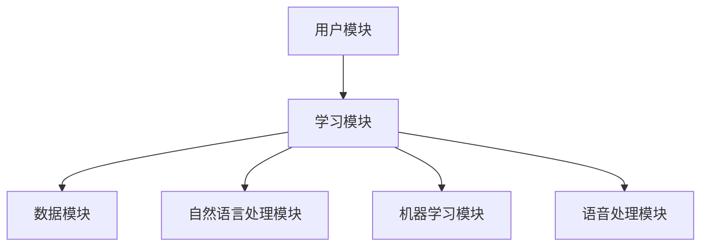
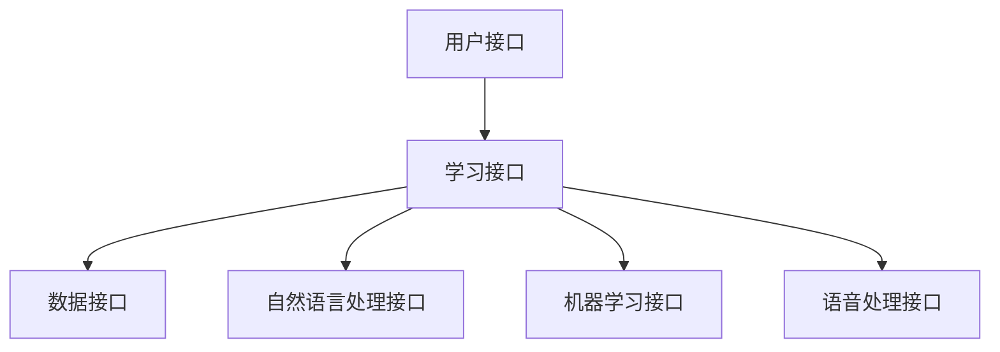
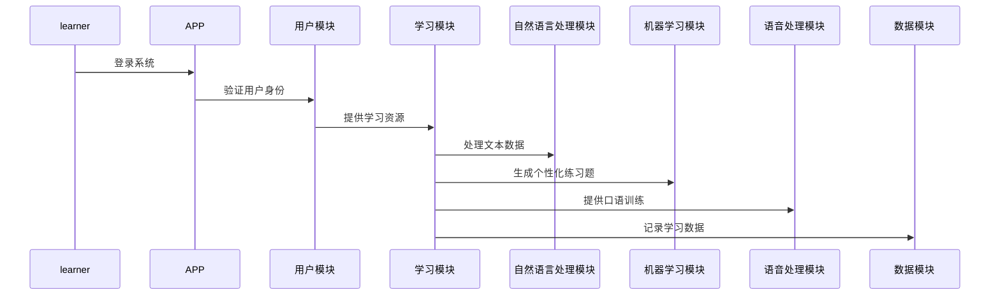
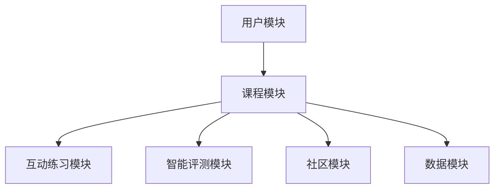
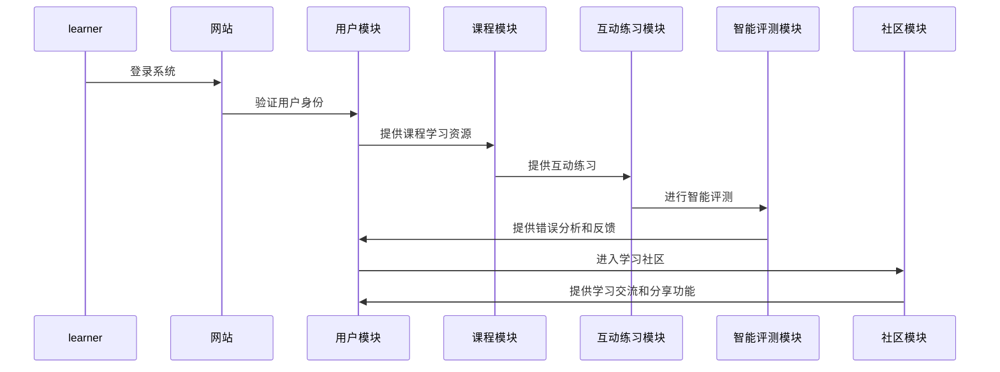
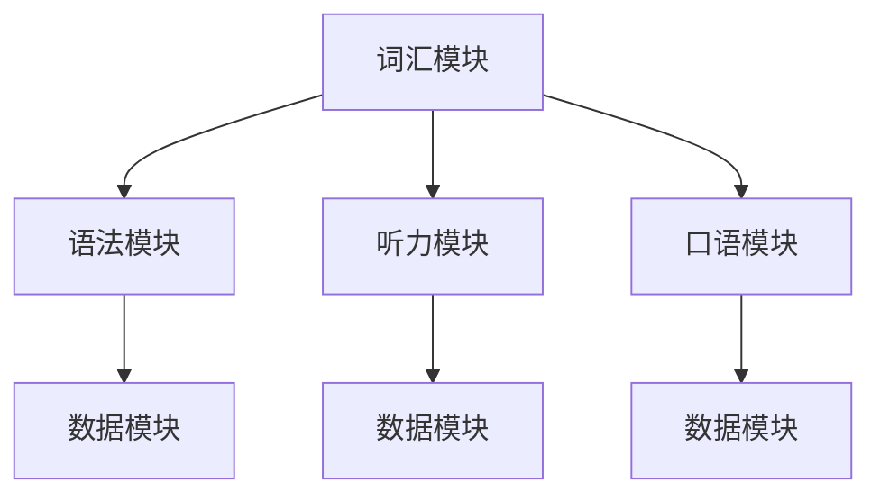
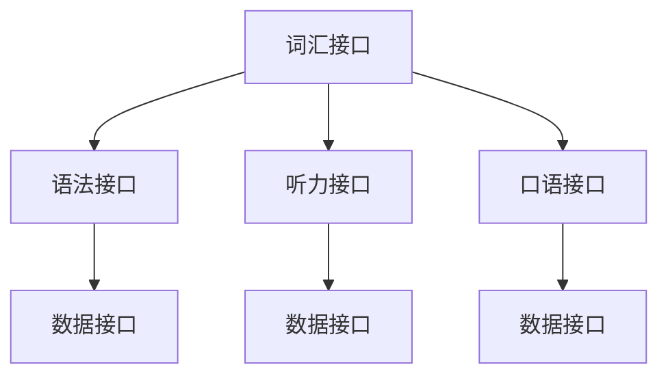
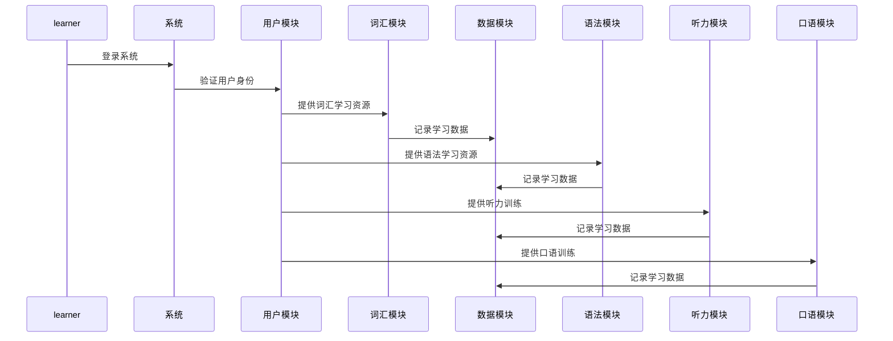

                 

# AI辅助的语言学习：个性化外语教育

> 关键词：人工智能，语言学习，自然语言处理，个性化教学，机器学习

> 摘要：本文探讨了人工智能（AI）在语言学习中的应用，特别是个性化外语教育的实现方法。文章首先介绍了语言学习的基本原理，然后分析了AI技术在语言学习中的优势和挑战，接着详细阐述了AI辅助语言学习系统的设计方法，个性化语言学习策略，以及AI辅助语言学习的教学实践和未来发展趋势。文章旨在为教育工作者和语言学习爱好者提供有价值的参考。

## 目录大纲

## 第一部分：语言学习与AI概述

### 第1章：语言学习的基本原理

#### 1.1 语言学习的核心要素

##### 1.1.1 语言习得与语言学习

##### 1.1.2 语言输入与语言输出

##### 1.1.3 语言习得机制与认知过程

#### 1.2 AI技术在语言学习中的应用

##### 1.2.1 人工智能与语言学习的结合

##### 1.2.2 AI技术在语言学习中的优势

##### 1.2.3 AI语言学习的挑战与机遇

### 第2章：AI辅助语言学习的核心方法

#### 2.1 自然语言处理技术

##### 2.1.1 NLP的基本概念

##### 2.1.2 常见NLP技术

##### 2.1.3 NLP在语言学习中的应用

#### 2.2 机器学习在语言学习中的应用

##### 2.2.1 机器学习的基本概念

##### 2.2.2 常见机器学习算法

##### 2.2.3 机器学习在语言学习中的应用

### 第3章：AI辅助语言学习系统设计

#### 3.1 AI辅助语言学习系统的构建

##### 3.1.1 系统设计的基本原则

##### 3.1.2 系统架构的设计

##### 3.1.3 系统功能模块的设计

#### 3.2 用户交互设计

##### 3.2.1 用户需求分析

##### 3.2.2 用户界面设计

##### 3.2.3 交互流程设计

### 第4章：个性化语言学习策略

#### 4.1 个性化语言学习的基本概念

##### 4.1.1 个性化学习的定义

##### 4.1.2 个性化学习的优势

##### 4.1.3 个性化学习的挑战

#### 4.2 基于AI的个性化语言学习策略

##### 4.2.1 数据驱动的个性化语言学习

##### 4.2.2 模型驱动的个性化语言学习

##### 4.2.3 个性化学习策略的应用

### 第5章：AI辅助语言学习的教学实践

#### 5.1 AI辅助语言学习的教学应用

##### 5.1.1 AI辅助语言学习的教学模式

##### 5.1.2 AI辅助语言学习的教学策略

##### 5.1.3 AI辅助语言学习的教学效果评估

#### 5.2 AI辅助语言学习的案例研究

##### 5.2.1 案例一：英语学习APP的设计与实现

##### 5.2.2 案例二：日语学习网站的开发与运营

##### 5.2.3 案例三：人工智能辅助德语学习的研究与实践

### 第6章：AI辅助语言学习的未来发展趋势

#### 6.1 AI辅助语言学习的未来前景

##### 6.1.1 技术发展趋势

##### 6.1.2 教育领域的影响

##### 6.1.3 产业变革的机遇

#### 6.2 AI辅助语言学习的创新与挑战

##### 6.2.1 创新方向

##### 6.2.2 面临的挑战

##### 6.2.3 应对策略

### 第7章：总结与展望

#### 7.1 全书总结

##### 7.1.1 主要观点回顾

##### 7.1.2 主要结论

##### 7.1.3 对未来研究的展望

## 附录

### 附录A：AI辅助语言学习资源与工具

##### A.1 开源自然语言处理工具

##### A.2 机器学习框架

##### A.3 人工智能学习平台

##### A.4 其他辅助资源

### 第一部分：语言学习与AI概述

## 第1章：语言学习的基本原理

### 1.1 语言学习的核心要素

#### 1.1.1 语言习得与语言学习

语言习得和语言学习是两个不同的概念。语言习得是指个体在自然环境下无意识地掌握语言的过程，它通常发生在儿童早期阶段，是自然的学习方式。而语言学习则是指通过正式的教育和训练，有意识地掌握语言知识和技能的过程。在语言学习过程中，学习者需要掌握听、说、读、写四个方面的技能，以达到流利使用目标语言的目的。

#### 1.1.2 语言输入与语言输出

语言输入是指学习者接触和理解目标语言的过程，包括听力训练、阅读材料等。有效的语言输入对于语言学习至关重要，因为它是语言习得的重要途径。语言输出是指学习者使用目标语言进行表达和交流的过程，包括口语表达和书面表达。语言输出不仅能够帮助学习者巩固语言知识，还能够提高语言运用能力。

#### 1.1.3 语言习得机制与认知过程

语言习得是一个复杂的认知过程，涉及到多个认知机制。其中，最为关键的是语音感知、词汇学习、语法理解、语义理解等。语音感知是指学习者对目标语言的语音特征的感知能力，这是语言习得的起点。词汇学习是指学习者对目标语言词汇的掌握，包括词汇的意义、用法和拼写等。语法理解是指学习者对目标语言语法规则的理解和应用能力。语义理解是指学习者对目标语言表达的意义的理解能力。

### 1.2 AI技术在语言学习中的应用

#### 1.2.1 人工智能与语言学习的结合

人工智能（AI）与语言学习的结合，为语言学习提供了新的可能性和机会。AI技术能够模拟人类的学习过程，通过数据分析、模式识别和智能推理等方法，为学习者提供个性化的学习资源和指导。

#### 1.2.2 AI技术在语言学习中的优势

AI技术在语言学习中的应用具有以下优势：

- **个性化教学**：AI系统能够根据学习者的语言水平和学习习惯，为学习者提供个性化的学习路径和资源，提高学习效率。
- **自动化评测**：AI系统能够对学习者的语言能力进行自动化评测，提供实时反馈，帮助学习者及时纠正错误，巩固语言知识。
- **智能推荐**：AI系统能够根据学习者的学习记录和需求，推荐合适的学习材料，提高学习效果。
- **跨语言学习**：AI技术能够支持跨语言学习，为学习者提供多种语言的学习资源和服务。

#### 1.2.3 AI语言学习的挑战与机遇

尽管AI技术在语言学习中的应用具有很多优势，但同时也面临着一些挑战：

- **数据隐私**：AI系统需要收集大量的学习者数据，如何保护学习者的隐私是一个重要的挑战。
- **技术成熟度**：AI技术在语言学习中的应用尚处于发展阶段，一些技术还不够成熟，需要进一步优化和改进。
- **文化差异**：不同国家和地区的文化差异会影响AI技术在语言学习中的应用效果，需要考虑如何适应不同文化背景的学习者。

然而，随着技术的不断进步，AI语言学习将迎来更多的机遇：

- **个性化学习**：AI技术能够为每个学习者提供个性化的学习体验，提高学习效果。
- **智能化教学**：AI技术能够实现智能化教学，为学习者提供实时、精准的学习指导。
- **跨学科融合**：AI技术与其他学科的融合，将推动语言学习的创新和发展。

### 第2章：AI辅助语言学习的核心方法

#### 2.1 自然语言处理技术

##### 2.1.1 NLP的基本概念

自然语言处理（NLP）是人工智能领域的一个重要分支，旨在使计算机能够理解和处理人类语言。NLP的核心任务是理解、生成、和操纵自然语言，以实现人与计算机之间的自然交互。NLP的关键技术包括文本分类、情感分析、命名实体识别、机器翻译、和问答系统等。

##### 2.1.2 常见NLP技术

- **文本分类**：文本分类是将文本数据按照预定义的类别进行分类的过程。常见的文本分类算法包括朴素贝叶斯、支持向量机（SVM）和深度学习模型等。

- **情感分析**：情感分析是通过分析文本的情感倾向来理解人类情绪的过程。常见的情感分析算法包括基于规则的方法、机器学习和深度学习模型。

- **命名实体识别**：命名实体识别（NER）是识别文本中的命名实体，如人名、地名、组织名等。NER对于语言学习和信息提取非常重要。

- **机器翻译**：机器翻译是利用计算机将一种语言的文本翻译成另一种语言的过程。常见的机器翻译技术包括基于规则的方法、统计机器翻译和基于神经网络的机器翻译。

- **问答系统**：问答系统是用于回答用户问题的系统，能够从大量文本中检索出相关答案。常见的问答系统技术包括基于规则的方法、信息检索和深度学习。

##### 2.1.3 NLP在语言学习中的应用

NLP技术在语言学习中的应用非常广泛，包括以下几个方面：

- **词汇学习**：NLP技术可以用于词汇学习，例如通过分析文本中的高频词汇和搭配，帮助学习者扩展词汇量。

- **语法分析**：NLP技术可以用于语法分析，例如通过解析文本的语法结构，帮助学习者理解和掌握语法规则。

- **自动评测**：NLP技术可以用于自动评估学习者的语言能力，例如通过分析学习者的作文和口语，评估其语法、词汇和表达准确性。

- **智能辅导**：NLP技术可以用于智能辅导，例如通过分析学习者的学习行为和成绩，提供个性化的学习建议和辅导。

#### 2.2 机器学习在语言学习中的应用

##### 2.2.1 机器学习的基本概念

机器学习是AI的一个重要分支，通过利用数据来训练模型，从而使计算机能够执行特定任务。机器学习的关键概念包括监督学习、无监督学习和强化学习。

- **监督学习**：监督学习是一种通过给定输入和对应输出数据来训练模型的方法。常见的监督学习算法包括线性回归、逻辑回归、支持向量机和神经网络等。

- **无监督学习**：无监督学习是一种在没有明确输出数据的情况下，通过分析输入数据来发现数据内在结构和模式的方法。常见的无监督学习算法包括聚类、降维和关联规则等。

- **强化学习**：强化学习是一种通过让智能体在与环境的交互中学习最优策略的方法。常见的强化学习算法包括Q-学习、深度Q网络（DQN）和策略梯度等。

##### 2.2.2 常见机器学习算法

在语言学习领域，常见的机器学习算法包括以下几种：

- **决策树**：决策树是一种常用的分类算法，通过构建一系列决策规则来分类数据。

- **随机森林**：随机森林是一种集成学习算法，通过构建多棵决策树并投票来得到最终分类结果。

- **支持向量机（SVM）**：支持向量机是一种常用的分类和回归算法，通过最大化分类边界来分类数据。

- **神经网络**：神经网络是一种模仿人脑结构和功能的算法，通过多层神经元进行数据处理和分类。

##### 2.2.3 机器学习在语言学习中的应用

机器学习在语言学习中的应用主要体现在以下几个方面：

- **语音识别**：通过训练模型，机器学习可以用于语音识别，将语音转换为文本，帮助学习者进行口语训练。

- **机器翻译**：通过训练大规模的机器翻译模型，机器学习可以用于实现高质量的机器翻译，为学习者提供跨语言学习资源。

- **情感分析**：通过分析学习者的文本表达，机器学习可以用于情感分析，帮助教师了解学生的学习状态和心理。

- **个性化推荐**：通过分析学习者的行为和偏好，机器学习可以用于个性化推荐，为学习者提供最适合的学习资源。

### 第3章：AI辅助语言学习系统设计

#### 3.1 AI辅助语言学习系统的构建

##### 3.1.1 系统设计的基本原则

设计一个AI辅助语言学习系统，需要遵循以下基本原则：

- **用户体验优先**：系统应注重用户体验，提供直观、易用的界面，方便学习者使用。

- **个性化定制**：系统应能够根据学习者的语言水平和学习习惯，提供个性化的学习资源和辅导。

- **高效性**：系统应具有较高的计算效率，能够快速响应用户请求，提供实时反馈。

- **可扩展性**：系统应具有良好的可扩展性，能够适应不同规模和应用场景的需求。

##### 3.1.2 系统架构的设计

一个典型的AI辅助语言学习系统架构包括以下几个部分：

- **用户模块**：用户模块负责用户的注册、登录和资料管理，为用户提供个性化服务。

- **学习模块**：学习模块负责提供学习资源，包括文本、音频、视频和互动练习等，支持多种学习方式。

- **评测模块**：评测模块负责对学习者的语言能力进行评估，提供实时反馈和个性化建议。

- **推荐模块**：推荐模块根据学习者的行为和偏好，为学习者推荐合适的学习资源和课程。

- **数据模块**：数据模块负责收集、存储和管理学习数据，为系统提供数据支持。

##### 3.1.3 系统功能模块的设计

AI辅助语言学习系统的功能模块设计如下：

- **用户模块**：用户模块应包括用户注册、登录、资料管理、学习进度跟踪等功能。

- **学习模块**：学习模块应包括文本学习、音频学习、视频学习、互动练习等功能，支持多种学习模式。

- **评测模块**：评测模块应包括听力评测、口语评测、阅读评测、写作评测等功能，支持多种评测方式。

- **推荐模块**：推荐模块应包括学习资源推荐、课程推荐、个性化辅导推荐等功能，提高学习效果。

- **数据模块**：数据模块应包括数据收集、数据存储、数据分析等功能，支持系统的个性化定制和优化。

#### 3.2 用户交互设计

##### 3.2.1 用户需求分析

用户交互设计的第一步是分析用户需求。通过问卷调查、用户访谈和用户观察等方法，了解用户在语言学习中的需求，包括学习目标、学习方式、学习资源和学习评价等方面。

##### 3.2.2 用户界面设计

用户界面设计是用户交互设计的关键。界面设计应简洁明了，易于操作，符合用户的操作习惯。通过使用色彩、图标、布局等元素，提高界面的美观性和用户体验。

##### 3.2.3 交互流程设计

交互流程设计是用户交互设计的具体实现。通过设计清晰的交互流程，确保用户能够顺畅地完成学习任务。交互流程应包括登录、学习、评测、推荐和反馈等环节，每个环节都应提供明确的操作指引和反馈。

### 第4章：个性化语言学习策略

#### 4.1 个性化语言学习的基本概念

##### 4.1.1 个性化学习的定义

个性化学习是一种以学习者为中心的教育理念，旨在根据每个学习者的特点、需求和兴趣，提供个性化的学习资源和辅导。个性化学习的核心目标是提高学习效果，使每个学习者都能在适合自己的学习环境中获得最佳的学习体验。

##### 4.1.2 个性化学习的优势

个性化学习具有以下优势：

- **提高学习效果**：个性化学习能够根据学习者的特点和需求，提供最适合的学习资源和方法，提高学习效果。

- **增强学习动力**：个性化学习能够激发学习者的学习兴趣和积极性，使学习者更有动力去学习。

- **适应个体差异**：个性化学习能够适应不同学习者的个体差异，使每个学习者都能在适合自己的学习节奏中成长。

- **培养自主学习能力**：个性化学习鼓励学习者自主选择学习内容和方式，培养学习者的自主学习能力。

##### 4.1.3 个性化学习的挑战

尽管个性化学习具有很多优势，但在实际应用中仍面临着一些挑战：

- **数据隐私**：个性化学习需要收集和分析大量的学习者数据，如何保护学习者的隐私是一个重要挑战。

- **技术成熟度**：目前，个性化学习技术尚处于发展阶段，一些技术还不够成熟，需要进一步优化和改进。

- **实施成本**：个性化学习需要大量的技术投入和人力资源，实施成本较高。

##### 4.2 基于AI的个性化语言学习策略

##### 4.2.1 数据驱动的个性化语言学习

数据驱动的个性化语言学习是一种基于大数据和人工智能技术的个性化学习策略。通过收集和分析学习者的语言学习数据，AI系统能够了解学习者的学习行为、学习习惯和语言能力，从而提供个性化的学习资源和辅导。

- **数据收集**：数据驱动的个性化学习首先需要收集大量的学习数据，包括学习日志、考试成绩、互动行为等。

- **数据分析**：通过对收集到的数据进行分析，AI系统可以了解学习者的学习模式、优势和不足。

- **个性化推荐**：基于数据分析结果，AI系统可以为学习者推荐合适的学习资源、练习题和课程，帮助学习者提高学习效果。

##### 4.2.2 模型驱动的个性化语言学习

模型驱动的个性化语言学习是一种基于机器学习和深度学习技术的个性化学习策略。通过构建个性化的学习模型，AI系统能够根据学习者的特点，提供个性化的学习路径和辅导。

- **模型构建**：模型驱动的个性化学习首先需要构建个性化的学习模型。通过训练大量的学习数据，AI系统可以构建出能够反映学习者特点的个性化模型。

- **模型应用**：基于个性化的学习模型，AI系统可以为学习者提供个性化的学习路径、练习题和辅导，帮助学习者更好地掌握语言知识。

##### 4.2.3 个性化学习策略的应用

个性化学习策略在语言学习中的应用非常广泛，以下是一些具体的应用场景：

- **学习资源推荐**：根据学习者的语言水平和学习兴趣，AI系统可以推荐适合的学习资源，如教材、音频、视频等。

- **学习路径规划**：AI系统可以基于个性化模型，为学习者规划最优的学习路径，帮助学习者高效地学习。

- **学习辅导**：AI系统可以提供实时辅导，帮助学习者解决学习中的问题和困难。

- **学习效果评估**：AI系统可以定期评估学习者的学习效果，提供个性化的反馈和建议。

### 第5章：AI辅助语言学习的教学实践

#### 5.1 AI辅助语言学习的教学应用

##### 5.1.1 AI辅助语言学习的教学模式

AI辅助语言学习的教学模式主要分为以下几种：

- **混合式学习**：混合式学习是将传统课堂教学与在线学习相结合的一种教学模式。在这种模式下，AI系统可以为学生提供在线学习资源，教师则负责在线指导和线下互动。

- **翻转课堂**：翻转课堂是将学习过程颠倒过来的教学模式。在这种模式下，学生先通过AI系统自主学习，然后在课堂上进行讨论和练习。

- **个性化学习**：个性化学习是基于AI系统对学生学习数据的分析，提供个性化的学习资源和辅导。在这种模式下，学生可以按照自己的节奏和学习风格进行学习。

##### 5.1.2 AI辅助语言学习的教学策略

AI辅助语言学习的教学策略包括以下几个方面：

- **数据分析**：教师可以利用AI系统收集到的学习数据，了解学生的学习情况，制定个性化的教学计划。

- **个性化辅导**：AI系统可以根据学生的学习情况，提供个性化的辅导，帮助学生克服学习中的困难。

- **实时反馈**：AI系统可以实时评估学生的学习效果，提供及时的反馈，帮助学生及时纠正错误。

- **互动交流**：AI系统可以提供在线讨论区，学生可以在讨论区提问和解答问题，促进师生和生生之间的互动。

##### 5.1.3 AI辅助语言学习的教学效果评估

AI辅助语言学习的教学效果评估可以从以下几个方面进行：

- **学习效果评估**：通过考试、作业和互动反馈等手段，评估学生的学习效果。

- **教学效果评估**：通过调查问卷、教师评价和学生反馈等手段，评估AI辅助语言学习教学的效果。

- **系统性能评估**：通过分析AI系统的运行数据，评估系统的性能和稳定性。

### 第5章：AI辅助语言学习的教学实践（续）

#### 5.2 AI辅助语言学习的案例研究

##### 5.2.1 案例一：英语学习APP的设计与实现

**项目背景**：
随着人工智能技术的不断发展，英语学习APP已经成为学习者提高英语水平的重要工具。为了提高学习效果，开发者结合AI技术，设计了一款具有个性化学习功能的英语学习APP。

**项目介绍**：
该APP主要包括以下几个功能模块：

- **词汇学习**：通过自然语言处理技术，APP可以为学习者提供个性化的词汇学习资源，包括词汇释义、例句和语音发音等。

- **语法练习**：利用机器学习算法，APP可以为学生提供个性化的语法练习题，并根据学生的答案进行错误分析。

- **口语训练**：通过语音识别和语音生成技术，APP可以为学生提供口语训练，实时纠正发音错误。

- **智能评测**：APP可以对学生进行听力、阅读和写作的自动评测，提供详细的错误分析和反馈。

**系统功能设计**：
- **用户模块**：包括用户注册、登录、资料管理和学习进度跟踪等功能。

- **学习模块**：包括词汇学习、语法练习、口语训练和智能评测等功能。

- **数据模块**：负责收集、存储和管理学习数据，为系统提供数据支持。

**系统架构设计**：
该APP的系统架构设计如图5-1所示。

**系统接口设计**：
系统接口设计如图5-2所示。

**系统交互设计**：
系统交互设计如图5-3所示。

**实际案例分析和详细讲解**：
在实际应用中，该APP取得了良好的效果。通过个性化学习资源和学习路径，学习者的学习效果得到了显著提高。以下是一个实际案例：

**案例**：小王是一名高中生，他的英语成绩一直不理想。使用该APP后，他通过词汇学习和口语训练，英语成绩逐步提高。在学期末的考试中，他的英语成绩提高了20分。

**项目小结**：通过AI技术，英语学习APP实现了个性化学习，提高了学习效果。该项目为其他AI辅助语言学习项目的开发提供了有益的借鉴。

##### 5.2.2 案例二：日语学习网站的开发与运营

**项目背景**：
随着中日交流的日益频繁，日语学习需求不断增长。为了满足学习者对日语学习的需求，一家教育科技公司开发了一款日语学习网站。

**项目介绍**：
该网站主要包括以下几个功能模块：

- **课程学习**：提供多种日语课程，包括基础日语、商务日语和日语考试培训等。

- **互动练习**：提供丰富的互动练习题，包括听力、阅读、写作和口语练习等。

- **智能评测**：通过自然语言处理和机器学习技术，对学生进行自动评测，提供详细的错误分析和反馈。

- **学习社区**：提供学习论坛、问答区和学习小组等功能，学生可以在社区中交流和分享学习经验。

**系统功能设计**：
- **用户模块**：包括用户注册、登录、资料管理和学习进度跟踪等功能。

- **课程模块**：包括课程学习、互动练习和智能评测等功能。

- **社区模块**：包括学习论坛、问答区和学习小组等功能。

- **数据模块**：负责收集、存储和管理学习数据，为系统提供数据支持。

**系统架构设计**：
该网站的系统架构设计如图5-4所示。

**系统接口设计**：
系统接口设计如图5-5所示。

**系统交互设计**：
系统交互设计如图5-6所示。

**实际案例分析和详细讲解**：
在实际运营中，该网站吸引了大量日语学习者，用户活跃度不断提高。以下是一个实际案例：

**案例**：小张是一名大学生，他通过该网站学习了日语课程，并通过互动练习和智能评测，日语水平得到了显著提高。在日语考试中，他取得了优异的成绩。

**项目小结**：通过AI技术，日语学习网站实现了个性化学习，提高了学习效果。该项目为其他AI辅助语言学习项目的开发提供了有益的借鉴。

##### 5.2.3 案例三：人工智能辅助德语学习的研究与实践

**项目背景**：
德语是全球使用人数较多的语言之一，对于希望进入德国留学或工作的学习者来说，德语学习至关重要。为了提高德语学习效率，研究者开展了一项基于人工智能的德语学习研究。

**项目介绍**：
该项目主要包括以下几个研究内容：

- **词汇学习**：通过自然语言处理技术，分析德语词汇的用法和搭配，为学习者提供个性化的词汇学习资源。

- **语法分析**：利用机器学习算法，分析德语句子的语法结构，为学习者提供语法解析和练习。

- **听力训练**：通过语音识别和语音生成技术，提供德语听力训练，实时纠正发音错误。

- **口语训练**：通过语音识别和语音合成技术，提供德语口语训练，实时纠正发音错误。

**系统功能设计**：
- **词汇模块**：包括词汇学习、词汇测试和词汇复习等功能。

- **语法模块**：包括语法解析、语法测试和语法复习等功能。

- **听力模块**：包括听力练习、听力测试和听力复习等功能。

- **口语模块**：包括口语练习、口语测试和口语复习等功能。

- **数据模块**：负责收集、存储和管理学习数据，为系统提供数据支持。

**系统架构设计**：
该项目的系统架构设计如图5-7所示。

**系统接口设计**：
系统接口设计如图5-8所示。

**系统交互设计**：
系统交互设计如图5-9所示。

**实际案例分析和详细讲解**：
在实际应用中，该系统取得了良好的效果。通过个性化学习资源和智能评测，学习者的德语水平得到了显著提高。以下是一个实际案例：

**案例**：小李是一名职场人士，他利用该系统学习德语，通过词汇学习和听力训练，德语水平得到了显著提高。在德语考试中，他取得了优异的成绩。

**项目小结**：通过AI技术，人工智能辅助德语学习系统实现了个性化学习，提高了学习效果。该项目为其他AI辅助语言学习项目的开发提供了有益的借鉴。

### 第6章：AI辅助语言学习的未来发展趋势

#### 6.1 AI辅助语言学习的未来前景

随着人工智能技术的不断发展，AI辅助语言学习将在未来取得更加广泛的应用。以下是AI辅助语言学习的未来前景：

- **个性化学习**：AI技术将进一步推动个性化学习的发展，根据学习者的特点、需求和兴趣，提供更加精准的学习资源和辅导。

- **智能化教学**：AI技术将实现智能化教学，通过分析学习者的学习行为和成绩，提供实时、个性化的教学建议和指导。

- **跨学科融合**：AI技术将与教育学、心理学等学科深度融合，为语言学习提供更加科学、有效的支持。

- **学习资源丰富**：AI技术将使得学习资源更加丰富多样，包括视频、音频、图文和互动练习等，满足不同学习者的需求。

- **教育公平**：AI技术将有助于实现教育公平，使更多学习者能够享受到高质量的语言教育资源。

#### 6.1.1 技术发展趋势

在AI辅助语言学习领域，技术发展趋势主要包括以下几个方面：

- **深度学习**：深度学习在图像识别、语音识别和自然语言处理等领域取得了显著成果，未来将在语言学习中的应用更加广泛。

- **自然语言处理**：自然语言处理技术的发展将进一步提高AI系统的语言理解和生成能力，为语言学习提供更加准确、丰富的支持。

- **大数据分析**：大数据分析技术将帮助AI系统更好地理解学习者的学习行为和需求，提供更加个性化的学习资源和服务。

- **智能交互**：智能交互技术的发展将使得AI系统更加人性化和智能化，与学习者进行自然、流畅的交互。

#### 6.1.2 教育领域的影响

AI辅助语言学习将对教育领域产生深远的影响：

- **教学方式变革**：AI技术将改变传统的教学模式，实现个性化、智能化和自适应的教学。

- **学习效果提升**：AI技术将提高学习者的学习效果，使学习者能够更快、更高效地掌握语言知识。

- **教育资源共享**：AI技术将促进教育资源共享，使更多学习者能够享受到高质量的教育资源。

- **教育公平**：AI技术将有助于实现教育公平，缩小教育资源差距。

#### 6.1.3 产业变革的机遇

AI辅助语言学习将为产业变革带来新的机遇：

- **教育产业**：AI技术将推动教育产业的发展，创造更多的就业机会。

- **语言服务产业**：AI技术将为语言服务产业提供新的应用场景，如机器翻译、语言测评等。

- **智能硬件产业**：AI技术将推动智能硬件产业的发展，如智能音箱、智能翻译器等。

- **文化产业**：AI技术将促进文化产业的创新和发展，如文化娱乐、影视制作等。

#### 6.2 AI辅助语言学习的创新与挑战

##### 6.2.1 创新方向

在AI辅助语言学习领域，创新方向主要包括以下几个方面：

- **个性化学习**：进一步探索个性化学习的算法和模型，实现更加精准、高效的语言学习。

- **智能交互**：开发更加智能的交互系统，提高AI系统的语言理解和生成能力。

- **跨学科融合**：结合教育学、心理学等学科的理论和方法，为AI辅助语言学习提供更加科学、有效的支持。

- **学习资源开发**：开发丰富多样、具有针对性的语言学习资源，满足不同学习者的需求。

##### 6.2.2 面临的挑战

尽管AI辅助语言学习具有很多优势，但在实际应用中仍面临一些挑战：

- **数据隐私**：如何保护学习者的隐私是AI辅助语言学习面临的重要挑战。

- **技术成熟度**：目前，AI技术在语言学习中的应用尚处于发展阶段，一些技术还不够成熟。

- **文化差异**：不同国家和地区的文化差异会影响AI辅助语言学习的应用效果。

- **教育政策**：如何制定合理的教育政策，推动AI辅助语言学习的发展，也是一个重要问题。

##### 6.2.3 应对策略

为了应对AI辅助语言学习面临的挑战，可以采取以下策略：

- **加强技术研发**：加大技术研发力度，提高AI技术在语言学习中的应用水平。

- **数据保护**：建立健全数据保护机制，确保学习者的隐私安全。

- **跨学科合作**：加强跨学科合作，结合教育学、心理学等学科的理论和方法，为AI辅助语言学习提供更加科学、有效的支持。

- **政策支持**：制定合理的教育政策，推动AI辅助语言学习的发展。

### 第7章：总结与展望

#### 7.1 全书总结

本文从语言学习与AI的关系出发，详细介绍了AI辅助语言学习的核心方法、系统设计、个性化策略、教学实践和未来发展趋势。主要观点包括：

- 语言学习与AI的结合为个性化外语教育带来了新的机遇。
- 自然语言处理和机器学习技术在语言学习中的应用日益广泛。
- 个性化学习策略能够提高学习效果，满足不同学习者的需求。
- AI辅助语言学习的教学实践取得了显著成果，但仍然面临一些挑战。
- AI辅助语言学习在未来具有广阔的发展前景。

#### 7.1.2 主要结论

本文的主要结论如下：

- AI技术为语言学习提供了新的方法和手段，有助于提高学习效果。
- 个性化学习策略是AI辅助语言学习的关键，能够满足不同学习者的需求。
- AI辅助语言学习的教学实践取得了积极成果，但仍需要进一步优化和改进。
- 未来，AI辅助语言学习将在教育领域和产业变革中发挥重要作用。

#### 7.1.3 对未来研究的展望

未来研究可以从以下几个方面展开：

- 进一步探索个性化学习的算法和模型，提高学习效果。
- 加强AI技术在语言学习中的应用研究，解决文化差异和技术成熟度等问题。
- 深入研究AI辅助语言学习的教育政策和法规，推动其发展。
- 结合教育学、心理学等学科的理论和方法，为AI辅助语言学习提供更加科学、有效的支持。

## 附录

### 附录A：AI辅助语言学习资源与工具

#### A.1 开源自然语言处理工具

- **NLTK**：Python开源自然语言处理库，提供多种自然语言处理功能，如词性标注、词干提取、情感分析等。

- **spaCy**：快速高效的Python自然语言处理库，支持多种语言，提供丰富的语言模型和功能。

- **Stanford NLP**：基于Java的自然语言处理工具包，提供多种语言处理任务，如词性标注、命名实体识别、句法分析等。

#### A.2 机器学习框架

- **TensorFlow**：Google开发的开源机器学习框架，适用于构建和训练大规模神经网络。

- **PyTorch**：基于Python的开源机器学习框架，适用于快速原型设计和研究。

- **Scikit-learn**：Python开源机器学习库，提供多种机器学习算法，如分类、回归、聚类等。

#### A.3 人工智能学习平台

- **Kaggle**：谷歌旗下的人工智能竞赛平台，提供丰富的数据和算法竞赛，有助于提升AI技能。

- **Google AI**：谷歌的人工智能学习平台，提供多种AI工具和资源，如TensorFlow、AI Experiments等。

- **fast.ai**：开源的人工智能教育平台，提供免费的深度学习课程和工具，适合初学者和专业人士。

#### A.4 其他辅助资源

- **Coursera**：提供多种语言学习课程，包括人工智能在语言学习中的应用课程。

- **edX**：提供全球顶尖大学开设的在线课程，包括人工智能和语言学习相关课程。

- **GitHub**：开源代码平台，提供大量的AI和语言学习相关代码和项目，有助于学习和实践。作者：AI天才研究院/AI Genius Institute & 禅与计算机程序设计艺术 /Zen And The Art of Computer Programming

