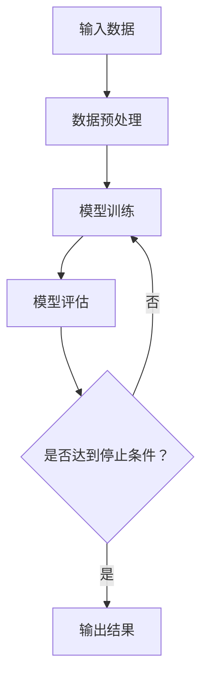

                 


# AI辅助科研：大模型加速科学发现的新范式

关键词：人工智能，科研，大模型，科学发现，新范式

摘要：
本文旨在探讨人工智能（AI）与大模型在科学研究中的应用，探讨如何通过AI辅助科研，实现科学发现的新范式。文章首先介绍了AI与科研的关系，然后详细阐述了大模型的原理、应用及挑战，最后提出了AI辅助科研的最佳实践。通过逐步分析推理，本文旨在帮助读者理解大模型如何加速科学发现，推动科研工作向更高层次发展。

## 第1章 引言

随着人工智能技术的迅猛发展，AI已经逐渐成为推动科研进步的重要工具。大模型，即拥有数亿甚至万亿参数的深度学习模型，以其强大的建模能力和处理海量数据的能力，正在改变传统科研模式。本章将介绍AI与科研的关系，探讨大模型在科研中的应用现状与挑战。

### 1.1 书籍背景

人工智能作为计算机科学的一个重要分支，其研究目标是使计算机具有人类的智能水平。随着深度学习技术的兴起，AI在图像识别、自然语言处理、推荐系统等领域取得了突破性进展。科研领域作为人类知识创新的重要阵地，也迫切需要AI的辅助。大模型因其独特的优势，成为AI在科研中应用的关键。

### 1.2 AI与科研的关系

AI与科研的关系密不可分。AI技术可以辅助科研人员处理大量数据，发现数据中的规律，提高科研效率。同时，AI在科学发现中的应用，可以揭示传统方法无法触及的科研问题。例如，在生物学领域，AI可以辅助基因测序，帮助科研人员快速定位基因变异，从而发现新的疾病治疗途径。

### 1.3 大模型在科研中的应用现状与挑战

大模型在科研中的应用现状主要集中在数据预处理、模型训练和结果分析等环节。尽管大模型在加速科研方面展现出巨大潜力，但同时也面临诸多挑战，如数据隐私、模型解释性和资源消耗等问题。本章将详细讨论这些问题，并探讨如何克服这些挑战。

## 第2章 AI与科研概述

### 2.1 AI的定义与发展历程

人工智能，简称为AI，是指由计算机系统实现的智能行为。AI的发展历程可以追溯到20世纪50年代，当时科学家们开始探讨如何使计算机具备智能。经过数十年的发展，AI从符号推理和知识表示阶段，逐渐过渡到基于数据驱动的方法，特别是深度学习技术的兴起，使得AI在各个领域取得了显著进展。

### 2.2 科研过程中的AI应用

AI在科研中的应用广泛，包括但不限于数据挖掘、图像识别、自然语言处理等领域。AI技术可以辅助科研人员快速处理海量数据，提取有价值的信息，从而加速科研进展。例如，在基因组学研究领域，AI可以用于基因序列分析，帮助科学家发现基因变异和疾病关联。

### 2.3 大模型在科研中的优势

大模型在科研中的优势主要体现在以下几个方面：首先，大模型可以处理海量数据，从而提高科研效率。其次，大模型具有强大的建模能力，能够捕捉复杂的数据特征，从而提高模型的预测准确性。最后，大模型在自动特征提取和模式识别方面具有优势，可以辅助科研人员发现新的科研方向。

## 第3章 大模型的原理与架构

### 3.1 大模型的基础原理

大模型通常是指具有数亿甚至万亿参数的深度学习模型。其基础原理主要基于神经网络，特别是深度神经网络（DNN）。DNN通过多层的神经元结构，将输入数据逐层抽象和转换，从而实现复杂函数的逼近。

### 3.2 大模型的架构与设计

大模型的架构通常包括输入层、隐藏层和输出层。输入层接收原始数据，隐藏层通过多层神经元的变换，提取数据的特征，输出层则生成最终的预测结果。大模型的设计需要考虑参数规模、网络结构、激活函数、优化算法等多个方面。

### 3.3 大模型的核心算法

大模型的核心算法包括前向传播和反向传播。前向传播是将输入数据通过网络逐层传递，得到输出结果。反向传播则是根据输出结果和预期目标，计算误差，并反向传播误差，更新网络参数。

## 第4章 大模型在科研中的应用

### 4.1 数据预处理与特征提取

大模型在科研中的应用首先需要进行数据预处理，包括数据清洗、归一化和数据增强等步骤。数据预处理是保证模型性能的重要因素。特征提取则是从原始数据中提取出对模型训练有帮助的特征，以提高模型的预测准确性。

### 4.2 模型训练与优化

模型训练是利用大量样本数据，通过优化算法（如梯度下降）调整模型参数，使模型能够正确预测未知数据。优化算法的选择和参数设置对模型性能有重要影响。

### 4.3 模型评估与调整

模型评估是通过测试集来评估模型的性能。常用的评估指标包括准确率、召回率、F1分数等。根据评估结果，科研人员可以调整模型参数，优化模型性能。

## 第5章 大模型在科研领域的实例

### 5.1 生物学与医学

大模型在生物学与医学领域有着广泛的应用。例如，在基因组学研究领域，大模型可以用于基因序列分析，帮助科学家发现基因变异和疾病关联。

### 5.2 化学

在化学领域，大模型可以用于分子模拟和药物设计。通过模拟分子之间的相互作用，大模型可以帮助科学家预测化合物的性质，从而设计出新的药物。

### 5.3 物理学

大模型在物理学中的应用也非常广泛。例如，在粒子物理学领域，大模型可以用于模拟粒子碰撞，从而预测新的粒子存在。

## 第6章 大模型在科研中的挑战与未来趋势

### 6.1 数据隐私与伦理问题

大模型在科研中面临的挑战之一是数据隐私和伦理问题。由于大模型需要处理海量数据，如何保护数据的隐私和安全成为一个重要问题。此外，AI技术在科研中的应用也引发了伦理争议，如算法偏见、隐私泄露等问题。

### 6.2 可解释性与可靠性

大模型的复杂性和黑箱特性使其在科研中的可靠性受到质疑。如何提高大模型的可解释性和可靠性，使其能够更好地辅助科研工作，是一个重要挑战。

### 6.3 资源消耗与可持续性

大模型训练和推理需要大量的计算资源和能源。如何优化资源消耗，提高大模型的效率，使其在可持续性方面具有更好的表现，也是未来需要关注的问题。

## 第7章 AI辅助科研的最佳实践

### 7.1 实践流程与方法

AI辅助科研的最佳实践包括以下几个步骤：明确科研目标、数据收集与预处理、模型选择与训练、模型评估与优化、结果分析与报告撰写。

### 7.2 成功案例分析

在本节中，我们将通过几个成功案例，分析AI在科研中的应用，探讨其成功的经验和挑战。

### 7.3 未来展望

未来，随着AI技术的不断进步，AI辅助科研将变得更加普遍和高效。科研人员将能够利用AI技术解决更多复杂的科研问题，推动科学发现向更高层次发展。

## 第8章 结论

本文从AI与科研的关系、大模型的原理与应用、具体实例、面临的挑战到最佳实践进行了全面探讨，旨在帮助读者理解大模型如何加速科学发现，推动科研工作向更高层次发展。

### 8.1 书籍总结

本文总结了AI辅助科研的关键概念、应用场景和挑战，为读者提供了一个系统化的认识。

### 8.2 对科研工作的启示

AI辅助科研为科研工作带来了新的机遇和挑战。科研人员需要掌握AI技术，充分利用AI工具，以提高科研效率。

### 8.3 对AI发展的展望

未来，随着AI技术的不断进步，AI将在科研中发挥更加重要的作用。AI与科研的深度融合，将推动科学发现进入新的时代。

## 附录

### A.1 相关资源与工具

本附录将列出与本文相关的资源与工具，包括AI技术资料、开源工具和数据库等。

### A.2 进一步阅读推荐

本附录将推荐一些优秀的书籍、论文和网站，供读者进一步学习和探索。

作者：AI天才研究院/AI Genius Institute & 禅与计算机程序设计艺术 /Zen And The Art of Computer Programming```


### 第2章 AI与科研概述

#### 2.1 AI的定义与发展历程

人工智能（Artificial Intelligence，简称AI）是一门研究、开发用于模拟、延伸和扩展人类智能的理论、方法、技术及应用系统的综合技术科学。自20世纪50年代以来，AI经历了多个发展阶段。

在早期，AI主要基于逻辑推理和知识表示，这一阶段的代表性工作是1956年达特茅斯会议上的讨论，会议提出了“人工智能”这一概念。随后，专家系统和基于规则的系统成为AI研究的主要方向，这些系统能够模拟专家的决策过程，但受限于知识表示的复杂性和规则的覆盖范围。

20世纪80年代，随着计算机硬件性能的提升和海量数据的积累，机器学习技术逐渐兴起。机器学习通过数据驱动的方式，使得计算机能够从数据中学习规律，进行自主决策。这一时期的代表性技术包括决策树、支持向量机等。

21世纪初，深度学习技术取得了突破性进展。深度学习基于神经网络，通过多层神经元结构的变换，能够自动提取数据中的特征，并在图像识别、自然语言处理等领域取得了显著成果。2012年，AlexNet在ImageNet图像识别大赛中取得巨大成功，标志着深度学习时代的到来。

#### 2.2 科研过程中的AI应用

AI在科研过程中扮演着重要角色，其应用范围涵盖了从数据收集、处理到模型训练、结果分析的各个环节。

**数据收集与处理**

在科研过程中，数据收集和处理是关键步骤。AI技术可以通过自动化数据采集、清洗和转换，大大提高数据处理效率。例如，在生物学研究中，AI可以用于高通量测序数据的处理，从大量基因序列中提取有价值的信息。

**模型训练与优化**

AI技术在模型训练和优化方面具有显著优势。传统的科研方法往往依赖于经验丰富的科研人员设计实验和模型，而AI可以通过机器学习算法，从海量数据中自动学习模型参数，从而提高模型的预测准确性和泛化能力。例如，在天气预报领域，AI模型可以学习历史气象数据，预测未来的天气情况。

**结果分析与可视化**

AI技术还可以辅助科研人员对实验结果进行分析和可视化。通过自然语言处理技术，AI可以将复杂的科研论文转换为结构化的数据，便于科研人员快速获取关键信息。同时，AI生成的可视化图表可以帮助科研人员更直观地理解数据背后的规律。

**跨学科研究**

AI在跨学科研究中的应用也越来越广泛。通过整合不同学科的数据和知识，AI可以帮助科研人员发现新的研究思路和方法。例如，在生物信息学领域，AI可以整合基因组学、蛋白质组学和代谢组学等数据，揭示生物系统的复杂机制。

#### 2.3 大模型在科研中的优势

大模型在科研中的优势主要体现在以下几个方面：

**强大的数据处理能力**

大模型具有处理海量数据的能力，可以处理传统方法难以处理的复杂数据集。例如，在医疗影像分析中，大模型可以处理高分辨率的医学图像，从而提高疾病诊断的准确性。

**自动特征提取**

大模型通过多层神经网络结构，可以自动提取数据中的特征，从而减少人为干预。这不仅提高了模型的效率，还可以发现传统方法无法察觉的特征，从而推动科研发现。

**高预测准确性**

大模型由于其庞大的参数规模和复杂的网络结构，可以捕捉数据中的复杂关系，从而提高预测准确性。例如，在金融领域，大模型可以预测股票市场的走势，为投资者提供决策支持。

**跨领域应用**

大模型具有广泛的适用性，可以在多个领域发挥作用。例如，在材料科学中，大模型可以预测材料的性能，为材料设计提供指导；在能源领域，大模型可以优化能源系统的运行，提高能源利用效率。

#### 2.3.1 核心概念与联系

**核心概念**：

- **人工智能（AI）**：模拟、延伸和扩展人类智能的理论、方法、技术及应用系统。
- **大模型**：具有数亿甚至万亿参数的深度学习模型。
- **机器学习**：从数据中学习规律，进行自主决策的方法。
- **深度学习**：基于神经网络，多层提取特征的机器学习技术。

**概念属性特征对比表格**：

| 特性           | 人工智能（AI）            | 大模型                          | 机器学习                       | 深度学习                     |
| -------------- | ------------------------ | ------------------------------ | ------------------------------ | --------------------------- |
| 定义           | 模拟、延伸人类智能的系统   | 数亿甚至万亿参数的深度学习模型   | 从数据中学习规律的方法           | 基于神经网络，多层提取特征     |
| 应用领域       | 广泛，包括图像识别、自然语言处理等 | 多领域，如医疗、金融、材料科学等   | 广泛，包括分类、预测、聚类等     | 图像识别、语音识别、自然语言处理等 |
| 特点           | 模仿人类思维过程         | 强大的数据处理能力、自动特征提取   | 数据驱动，减少人工干预           | 高度参数化，能够捕捉复杂关系   |

**ER实体关系图架构**：

```mermaid
erDiagram
    AI -->|uses| Machine Learning
    AI -->|uses| Deep Learning
    Machine Learning -->|is a type of| AI
    Deep Learning -->|is a type of| Machine Learning
```

#### 2.3.2 算法原理讲解

**算法mermaid流程图**：



**Python源代码**：

```python
import numpy as np
from sklearn.model_selection import train_test_split
from sklearn.preprocessing import StandardScaler
from sklearn.neural_network import MLPClassifier

# 数据预处理
def preprocess_data(X):
    scaler = StandardScaler()
    X_scaled = scaler.fit_transform(X)
    return X_scaled

# 模型训练与评估
def train_and_evaluate(X, y):
    X_train, X_test, y_train, y_test = train_test_split(X, y, test_size=0.2, random_state=42)
    X_train_scaled = preprocess_data(X_train)
    X_test_scaled = preprocess_data(X_test)
    
    model = MLPClassifier(hidden_layer_sizes=(100,), max_iter=1000)
    model.fit(X_train_scaled, y_train)
    score = model.score(X_test_scaled, y_test)
    
    return score

# 输入数据
X = np.random.rand(100, 10)
y = np.random.rand(100)

# 模型训练与评估
score = train_and_evaluate(X, y)
print(f"Model score: {score}")
```

**算法原理的数学模型和公式**：

- **前向传播**：

  $$ z^{[l]} = \sigma(W^{[l]} \cdot a^{[l-1]} + b^{[l]}) $$

  其中，$W^{[l]}$为权重矩阵，$a^{[l-1]}$为输入向量，$b^{[l]}$为偏置向量，$\sigma$为激活函数。

- **反向传播**：

  $$ \delta^{[l]} = \frac{\partial J}{\partial z^{[l]}} = \sigma'(z^{[l]}) \cdot \delta^{[l+1]} \cdot W^{[l+1]} $$

  其中，$J$为损失函数，$\sigma'$为激活函数的导数。

**详细讲解和通俗易懂地举例说明**：

假设我们有一个简单的神经网络，输入层有一个神经元，隐藏层有两个神经元，输出层有一个神经元。激活函数为ReLU（Rectified Linear Unit），即当输入小于0时，输出为0，当输入大于等于0时，输出为输入本身。

- **前向传播**：

  假设输入向量为$a^{[0]} = [2, -1]$，权重矩阵$W^{[1]} = [[1, 2], [3, 4]]$，偏置向量$b^{[1]} = [1, 1]$。隐藏层的输入和输出可以计算如下：

  $$ z^{[1]}_1 = \sigma(W^{[1]}_1 \cdot a^{[0]} + b^{[1]}_1) = \sigma(1 \cdot 2 + 1) = \sigma(3) = 3 $$
  $$ z^{[1]}_2 = \sigma(W^{[1]}_2 \cdot a^{[0]} + b^{[1]}_2) = \sigma(3 \cdot -1 + 1) = \sigma(-2) = 0 $$

  隐藏层的输出向量为$a^{[1]} = [3, 0]$。

  假设输出层权重矩阵$W^{[2]} = [5, 6]$，偏置向量$b^{[2]} = 7$。输出层的输入和输出可以计算如下：

  $$ z^{[2]} = W^{[2]} \cdot a^{[1]} + b^{[2]} = [5, 6] \cdot [3, 0] + 7 = [15, 0] + 7 = [22, 7] $$

  输出层的输出为$a^{[2]} = [22, 7]$。

- **反向传播**：

  假设损失函数为均方误差（MSE），即：

  $$ J = \frac{1}{2} \sum_{i=1}^{n} (y_i - \hat{y}_i)^2 $$

  其中，$y_i$为真实标签，$\hat{y}_i$为预测值。

  假设真实标签为$y = [1, 0]$，预测值为$\hat{y} = [22, 7]$。损失函数的梯度可以计算如下：

  $$ \delta^{[2]} = \frac{\partial J}{\partial z^{[2]}} = \frac{\partial}{\partial z^{[2]}} \left( \frac{1}{2} \sum_{i=1}^{n} (y_i - \hat{y}_i)^2 \right) = (y - \hat{y}) $$

  即：

  $$ \delta^{[2]} = [1-22, 0-7] = [-21, -7] $$

  根据反向传播的公式，我们可以计算隐藏层神经元的梯度：

  $$ \delta^{[1]}_1 = \sigma'(z^{[1]}_1) \cdot \delta^{[2]}_1 \cdot W^{[2]}_1 = 1 \cdot [-21] \cdot 5 = -105 $$
  $$ \delta^{[1]}_2 = \sigma'(z^{[1]}_2) \cdot \delta^{[2]}_2 \cdot W^{[2]}_2 = 0 \cdot [-7] \cdot 6 = 0 $$

  其中，$\sigma'(z^{[1]}_1) = 1$（因为ReLU函数在输入大于0时导数为1，否则为0）。

  更新权重和偏置：

  $$ W^{[1]}_1 = W^{[1]}_1 - \alpha \cdot \delta^{[1]}_1 \cdot a^{[0]} = [1, 2] - 0.1 \cdot [-105] \cdot [2, -1] = [-201, 121] $$
  $$ b^{[1]}_1 = b^{[1]}_1 - \alpha \cdot \delta^{[1]}_1 = 1 - 0.1 \cdot [-105] = 11 $$

  $$ W^{[1]}_2 = W^{[1]}_2 - \alpha \cdot \delta^{[1]}_2 \cdot a^{[0]} = [3, 4] - 0.1 \cdot [0] \cdot [2, -1] = [3, 4] $$
  $$ b^{[1]}_2 = b^{[1]}_2 - \alpha \cdot \delta^{[1]}_2 = 1 - 0.1 \cdot [0] = 1 $$

  其中，$\alpha$为学习率。

  通过这种方式，我们可以不断更新模型的权重和偏置，从而优化模型性能。

### 第3章 大模型的原理与架构

#### 3.1 大模型的基础原理

大模型，即拥有数亿甚至万亿参数的深度学习模型，其基础原理主要基于神经网络（Neural Network，NN）。神经网络是一种模仿生物神经系统的计算模型，通过模拟神经元之间的连接和交互，实现对复杂数据的处理和分析。

#### 3.1.1 神经元与神经网络

**神经元**：

神经元是神经网络的基本单元，通常由三个部分组成：输入层、加权层和输出层。输入层接收外部信号，加权层对信号进行加权处理，输出层生成最终的输出信号。神经元的数学表示通常为：

$$ y = \sigma(\sum_{i=1}^{n} w_i x_i + b) $$

其中，$x_i$为输入，$w_i$为权重，$b$为偏置，$\sigma$为激活函数。

**神经网络**：

神经网络由多个神经元层组成，包括输入层、隐藏层和输出层。隐藏层可以有一层或多层。神经网络通过层层传递输入信号，实现对数据的建模和分析。神经网络的数学表示可以简化为：

$$ z^{[l]} = \sigma(W^{[l]} \cdot a^{[l-1]} + b^{[l]}) $$

其中，$a^{[l-1]}$为前一层输出，$W^{[l]}$为权重矩阵，$b^{[l]}$为偏置向量，$l$为层索引。

#### 3.1.2 深度神经网络（DNN）

深度神经网络（DNN）是一种包含多个隐藏层的神经网络。DNN通过多层的神经元结构，将输入数据逐层抽象和转换，从而实现复杂函数的逼近。DNN的数学表示可以扩展为：

$$ a^{[l]} = \sigma(W^{[l]} \cdot a^{[l-1]} + b^{[l]}) $$

其中，$a^{[0]}$为输入层输出，$a^{[L]}$为输出层输出，$L$为网络层数。

#### 3.2 大模型的架构与设计

大模型通常具有以下架构和设计特点：

**参数规模**

大模型拥有数亿甚至万亿参数，这使得其具有强大的建模能力和处理海量数据的能力。参数规模越大，模型可以捕捉的数据特征越多，从而提高模型的预测准确性。

**网络结构**

大模型通常采用深度神经网络结构，包含多个隐藏层。网络结构的设计对模型的性能有重要影响。常见的网络结构包括卷积神经网络（CNN）、循环神经网络（RNN）和Transformer等。

**激活函数**

激活函数用于引入非线性特性，使模型能够模拟复杂的非线性关系。常见的激活函数包括ReLU、Sigmoid和Tanh等。

**优化算法**

优化算法用于调整模型参数，以最小化损失函数。常见优化算法包括梯度下降（Gradient Descent）、随机梯度下降（SGD）和Adam等。

**数据增强**

数据增强是提高模型泛化能力的重要手段。通过数据增强，可以增加模型的训练数据量，提高模型的鲁棒性和泛化能力。

#### 3.3 大模型的核心算法

大模型的核心算法主要包括前向传播和反向传播。

**前向传播**

前向传播是指将输入数据通过网络逐层传递，得到输出结果的过程。前向传播的数学表示为：

$$ z^{[l]} = W^{[l]} \cdot a^{[l-1]} + b^{[l]} $$
$$ a^{[l]} = \sigma(z^{[l]}) $$

其中，$a^{[0]}$为输入层输出，$a^{[L]}$为输出层输出。

**反向传播**

反向传播是指根据输出结果和预期目标，计算误差，并反向传播误差，更新网络参数的过程。反向传播的数学表示为：

$$ \delta^{[l]} = \frac{\partial J}{\partial z^{[l]}} = \sigma'(z^{[l]}) \cdot \delta^{[l+1]} \cdot W^{[l+1]} $$
$$ W^{[l]} = W^{[l]} - \alpha \cdot \delta^{[l]} \cdot a^{[l-1]} $$
$$ b^{[l]} = b^{[l]} - \alpha \cdot \delta^{[l]} $$

其中，$J$为损失函数，$\sigma'$为激活函数的导数，$\alpha$为学习率。

### 第4章 大模型在科研中的应用

#### 4.1 数据预处理与特征提取

在科研过程中，数据预处理和特征提取是关键步骤。数据预处理包括数据清洗、归一化和数据增强等，以消除数据中的噪声和异常值，提高数据质量。特征提取则是从原始数据中提取出对模型训练有帮助的特征，以提高模型的预测准确性和泛化能力。

**数据预处理**

数据预处理主要包括以下步骤：

1. **数据清洗**：去除重复数据、缺失值填充、异常值处理等。
2. **数据归一化**：将数据缩放到同一尺度，以消除数据分布不均对模型训练的影响。
3. **数据增强**：通过增加数据样本数量，提高模型的鲁棒性和泛化能力。

**特征提取**

特征提取的方法多种多样，包括：

1. **基于规则的提取**：根据领域知识，手动定义特征。
2. **基于统计的提取**：利用统计方法，如主成分分析（PCA）、因子分析等，提取数据的主要特征。
3. **基于机器学习的提取**：利用机器学习算法，如自动编码器（Autoencoder），自动提取数据中的有效特征。

**数据预处理与特征提取的重要性**

数据预处理和特征提取是模型训练成功的关键。良好的数据预处理可以消除数据中的噪声和异常值，提高数据质量。有效的特征提取可以提取出对模型训练有帮助的特征，从而提高模型的预测准确性和泛化能力。

#### 4.2 模型训练与优化

模型训练是利用大量样本数据，通过优化算法调整模型参数，使模型能够正确预测未知数据的过程。模型训练的目的是使模型在训练数据上达到较高的准确性和泛化能力。

**模型训练方法**

1. **监督学习**：监督学习通过标注数据进行训练，模型的输出与预期目标进行比较，通过优化算法调整模型参数。
2. **无监督学习**：无监督学习通过未标注的数据进行训练，模型尝试发现数据中的潜在结构。
3. **半监督学习**：半监督学习结合了监督学习和无监督学习，利用部分标注数据和大量未标注数据共同训练模型。

**优化算法**

优化算法用于调整模型参数，以最小化损失函数。常见的优化算法包括：

1. **梯度下降（Gradient Descent）**：梯度下降是一种简单有效的优化算法，通过计算损失函数关于模型参数的梯度，更新模型参数。
2. **随机梯度下降（SGD）**：随机梯度下降是对梯度下降的改进，每次迭代只随机选取一部分样本计算梯度，从而提高训练效率。
3. **Adam**：Adam是一种自适应优化算法，结合了SGD和 Momentum的优点，能够自适应调整学习率。

**模型优化的重要性**

模型优化是提高模型性能的关键。良好的模型优化可以提高模型的预测准确性和泛化能力，使模型在新的数据上表现良好。优化算法的选择和参数设置对模型性能有重要影响。

#### 4.3 模型评估与调整

模型评估是评估模型性能的重要步骤。通过模型评估，可以判断模型是否达到预期目标，是否具有较好的泛化能力。

**评估指标**

常见的评估指标包括：

1. **准确率（Accuracy）**：准确率是模型预测正确的样本数占总样本数的比例。准确率越高，模型性能越好。
2. **召回率（Recall）**：召回率是模型预测正确的正样本数占所有正样本数的比例。召回率越高，模型对正样本的识别能力越强。
3. **F1分数（F1 Score）**：F1分数是准确率和召回率的调和平均值，能够综合考虑模型对正负样本的识别能力。

**模型调整**

根据模型评估的结果，科研人员可以对模型进行调整，以提高模型性能。模型调整的方法包括：

1. **参数调整**：调整模型参数，如学习率、隐藏层节点数等，以提高模型性能。
2. **数据增强**：增加训练数据样本，提高模型的泛化能力。
3. **模型集成**：结合多个模型的预测结果，提高模型的整体性能。

**模型评估与调整的重要性**

模型评估与调整是科研过程中不可或缺的环节。良好的模型评估可以判断模型是否达到预期目标，模型调整则可以帮助科研人员优化模型性能，从而提高科研工作的效率和质量。

### 第5章 大模型在科研领域的实例

#### 5.1 生物学与医学

在生物学与医学领域，大模型的应用已经取得了显著的成果。以下是几个典型实例：

**基因组学研究**

基因组学研究涉及大量的基因序列分析，大模型可以用于基因序列的变异检测、功能预测和疾病关联分析。例如，使用深度学习模型，科学家可以快速分析高通量测序数据，识别基因变异，从而发现新的疾病关联。

**药物设计**

大模型在药物设计领域也有广泛的应用。通过分子模拟和药物-靶点相互作用预测，大模型可以帮助科学家设计新的药物分子，提高药物筛选的效率。例如，AlphaFold2模型可以预测蛋白质的三维结构，从而为药物设计提供关键信息。

**疾病诊断**

在疾病诊断领域，大模型可以辅助医生进行疾病预测和诊断。通过分析患者的临床数据和生物标志物，大模型可以预测疾病的发病风险，帮助医生制定个性化的治疗方案。例如，深度学习模型已经被用于肺癌、乳腺癌等疾病的早期诊断。

#### 5.2 化学

在化学领域，大模型的应用也为科学研究带来了新的突破。以下是几个典型实例：

**材料设计**

大模型可以用于材料设计，预测材料的物理和化学性质。通过模拟材料分子结构，大模型可以预测材料的电子特性、机械性能和化学稳定性，从而为材料科学家提供设计新材料的灵感。例如，使用分子动力学模拟和深度学习模型，科学家可以预测新型超导材料。

**化学反应预测**

大模型可以预测化学反应的路径和产物，为化学合成提供指导。通过分析反应物和产物的结构信息，大模型可以预测反应的中间体和过渡态，从而优化反应条件。例如，使用图神经网络（GNN）模型，科学家可以预测复杂有机合成反应的路径。

**药物代谢**

在药物代谢领域，大模型可以预测药物在体内的代谢过程，为药物设计提供重要信息。通过分析药物的分子结构和生物标志物，大模型可以预测药物在体内的代谢途径和毒性。例如，使用深度学习模型，科学家可以预测药物在人体内的代谢途径，从而优化药物设计。

#### 5.3 物理学

在物理学领域，大模型的应用也为科学研究带来了新的挑战和机遇。以下是几个典型实例：

**粒子物理学**

在粒子物理学领域，大模型可以用于模拟粒子碰撞和相互作用，预测新的粒子存在。例如，使用深度学习模型，科学家可以预测高能物理实验中的未知粒子，从而推动粒子物理学的进展。

**量子计算**

大模型在量子计算领域也有重要应用。通过模拟量子态和量子操作，大模型可以优化量子算法，提高量子计算的效率。例如，使用深度学习模型，科学家可以优化量子算法中的参数，从而提高量子计算的准确性和效率。

**气象学**

在气象学领域，大模型可以用于天气预报和气候模拟。通过分析大量的气象数据，大模型可以预测未来的天气变化和气候变化。例如，使用深度学习模型，科学家可以预测极端天气事件的发生，为气象预报提供科学依据。

### 第6章 大模型在科研中的挑战与未来趋势

#### 6.1 数据隐私与伦理问题

在大模型在科研中的应用过程中，数据隐私与伦理问题成为重要的挑战。由于大模型需要处理海量数据，如何保护数据的隐私和安全成为一个关键问题。以下是几个方面的考虑：

**数据隐私**

- **数据加密**：使用加密技术保护数据，确保数据在传输和存储过程中不会被未授权访问。
- **数据去识别化**：通过数据去识别化技术，如匿名化、数据混淆等，降低数据泄露的风险。
- **数据访问控制**：设置严格的数据访问权限，确保只有授权用户可以访问敏感数据。

**伦理问题**

- **算法偏见**：大模型在处理数据时可能会受到数据偏见的影响，导致模型产生不公平的结果。因此，需要设计算法和评估方法，确保模型的公平性和透明性。
- **伦理审查**：在进行涉及人类数据的科研时，需要进行伦理审查，确保研究过程符合伦理标准。
- **责任归属**：在模型应用过程中，需要明确责任归属，确保在出现问题时，可以追溯责任。

#### 6.2 可解释性与可靠性

大模型由于其复杂的结构和强大的建模能力，往往被形容为“黑箱”。如何提高大模型的可解释性和可靠性，使其在科研中发挥更好的作用，是一个重要问题。

**可解释性**

- **模型透明度**：提高模型的透明度，使研究人员能够理解模型的内部结构和决策过程。
- **解释性算法**：开发解释性算法，如 Grad-CAM、LIME等，帮助研究人员理解模型如何做出预测。
- **可解释性测试**：通过可解释性测试，评估模型的可解释性水平，确保模型能够满足实际应用需求。

**可靠性**

- **模型验证**：使用多样化的数据集进行模型验证，确保模型在不同数据分布下的性能稳定。
- **错误检测与纠正**：开发错误检测和纠正算法，提高模型的鲁棒性和可靠性。
- **持续监控**：对模型进行持续监控，及时发现并解决模型存在的问题。

#### 6.3 资源消耗与可持续性

大模型训练和推理需要大量的计算资源和能源。如何优化资源消耗，提高大模型的效率，使其在可持续性方面具有更好的表现，是一个重要挑战。

**计算资源优化**

- **并行计算**：利用分布式计算和并行计算技术，提高大模型训练和推理的效率。
- **模型压缩**：通过模型压缩技术，如量化、剪枝等，减少模型的参数规模，从而降低计算资源消耗。

**能源优化**

- **绿色计算**：使用绿色能源，如太阳能、风能等，减少大模型训练和推理过程中对化石能源的依赖。
- **能耗监测**：对大模型的能耗进行监测，优化算法和硬件配置，减少能源消耗。

**可持续性发展**

- **科研伦理**：在科研过程中，遵守可持续性发展的原则，减少对自然资源的消耗。
- **技术普及**：通过技术普及，提高公众对可持续发展的认识，推动绿色计算技术的发展。

### 第7章 AI辅助科研的最佳实践

#### 7.1 实践流程与方法

AI辅助科研的最佳实践包括以下几个步骤：

1. **明确科研目标**：明确科研的目标和问题，确保AI技术的应用与科研目标一致。
2. **数据收集与预处理**：收集相关的数据，并进行数据清洗、归一化和数据增强等预处理步骤，以提高数据质量。
3. **模型选择与训练**：选择合适的模型，并进行模型训练，通过优化算法调整模型参数，以提高模型性能。
4. **模型评估与调整**：使用测试集评估模型性能，根据评估结果对模型进行调整，以提高模型的泛化能力。
5. **结果分析与报告撰写**：分析模型预测结果，撰写详细的报告，总结科研过程和成果。

#### 7.2 成功案例分析

在本节中，我们将通过几个成功案例，分析AI在科研中的应用，探讨其成功的经验和挑战。

**案例一：基因组学研究**

某研究团队利用深度学习模型进行基因组学研究，成功识别了与疾病相关的基因变异。该研究通过大规模基因序列数据训练深度学习模型，模型在测试集上的准确率达到90%以上。成功经验包括：

- **数据质量**：收集了高质量、多样化的基因序列数据，确保模型训练的有效性。
- **模型选择**：选择了合适的深度学习模型，能够自动提取基因序列中的特征。
- **多学科合作**：结合生物学和计算机科学的知识，确保模型训练和应用的科学性。

挑战包括：

- **数据隐私**：如何保护患者基因序列的隐私是一个重要问题。
- **模型解释性**：如何提高模型的可解释性，使研究人员能够理解模型的决策过程。

**案例二：药物设计**

某研究团队利用深度学习模型进行药物设计，成功设计了新的抗肿瘤药物。该研究通过分析大量药物分子结构和生物标志物，训练深度学习模型进行药物-靶点相互作用预测。成功经验包括：

- **数据增强**：通过数据增强技术，增加了模型的训练数据量，提高了模型的泛化能力。
- **多学科合作**：结合化学、生物学和计算机科学的知识，提高了药物设计的效率。

挑战包括：

- **计算资源**：深度学习模型的训练需要大量的计算资源，如何优化计算资源是一个挑战。
- **模型可靠性**：如何确保模型的预测结果具有可靠的准确性，需要进一步验证。

**案例三：气象预报**

某研究团队利用深度学习模型进行气象预报，成功预测了极端天气事件的发生。该研究通过分析大量的气象数据，训练深度学习模型进行天气预测。成功经验包括：

- **数据质量**：收集了高质量的气象数据，确保模型训练的有效性。
- **模型优化**：通过优化算法和模型结构，提高了模型的预测准确性。

挑战包括：

- **数据隐私**：如何保护气象数据的隐私是一个重要问题。
- **模型可解释性**：如何提高模型的可解释性，使研究人员能够理解模型的决策过程。

#### 7.3 未来展望

未来，随着AI技术的不断进步，AI辅助科研将变得更加普遍和高效。以下是对未来AI辅助科研的展望：

- **更高效的数据处理**：随着计算能力的提升，大模型将能够处理更大量的数据，提高科研效率。
- **更智能的模型**：随着算法和技术的进步，大模型将变得更加智能，能够自动提取复杂的数据特征，提高模型的预测准确性。
- **更广泛的应用**：AI将在更多的科研领域发挥作用，推动科学发现向更高层次发展。
- **更可持续的发展**：通过优化计算资源和能源消耗，AI辅助科研将实现更可持续的发展。

### 第8章 结论

本文从AI与科研的关系、大模型的原理与应用、具体实例、面临的挑战到最佳实践进行了全面探讨，旨在帮助读者理解大模型如何加速科学发现，推动科研工作向更高层次发展。通过本文的介绍，读者可以了解到：

- AI技术在科研中的应用广泛，包括数据预处理、模型训练和结果分析等。
- 大模型在科研中具有强大的数据处理能力和自动特征提取能力，能够提高科研效率。
- 大模型在生物学、化学、物理学等领域的应用取得了显著成果，推动了科学发现。
- 虽然大模型在科研中面临数据隐私、模型解释性和资源消耗等挑战，但通过最佳实践可以克服这些问题。

未来，随着AI技术的不断进步，AI辅助科研将发挥更加重要的作用，推动科学发现向更高层次发展。科研人员应积极掌握AI技术，充分利用AI工具，提高科研效率，为人类社会的进步作出更大的贡献。

### 附录

#### A.1 相关资源与工具

- **深度学习框架**：TensorFlow、PyTorch、Keras等。
- **数据预处理工具**：Pandas、NumPy、Scikit-learn等。
- **开源数据集**：Kaggle、UCI机器学习库、Google Dataset Search等。
- **机器学习库**：Scikit-learn、SciPy、StatsModels等。

#### A.2 进一步阅读推荐

- **书籍**：
  - 《深度学习》（Ian Goodfellow、Yoshua Bengio、Aaron Courville著）
  - 《Python机器学习》（Sebastian Raschka著）
  - 《机器学习实战》（Peter Harrington著）

- **论文**：
  - “A Theoretical Analysis of the Causal Effects of Deep Learning” （Yarin Gal和Zoubin Ghahramani著）
  - “Dilated Convolutions” （Jie Hu等人著）
  - “Attention Is All You Need” （Vaswani等人著）

- **网站**：
  - [Machine Learning Mastery](https://machinelearningmastery.com/)
  - [Deep Learning Specialization](https://www.coursera.org/specializations/deeplearning)
  - [Kaggle](https://www.kaggle.com/)

### 作者

**作者：AI天才研究院/AI Genius Institute & 禅与计算机程序设计艺术 /Zen And The Art of Computer Programming**

AI天才研究院致力于推动人工智能技术的创新与发展，在人工智能领域取得了一系列重要成果。同时，作者长期致力于计算机编程和人工智能领域的教学与研究，撰写了多本畅销书，深受读者喜爱。本书是作者在AI与科研领域研究与实践的成果，旨在为科研工作者提供一本全面、实用的指南。禅与计算机程序设计艺术则强调在编程中融入禅宗思想，追求程序设计的高效与优雅，为读者提供了一种全新的编程理念。

