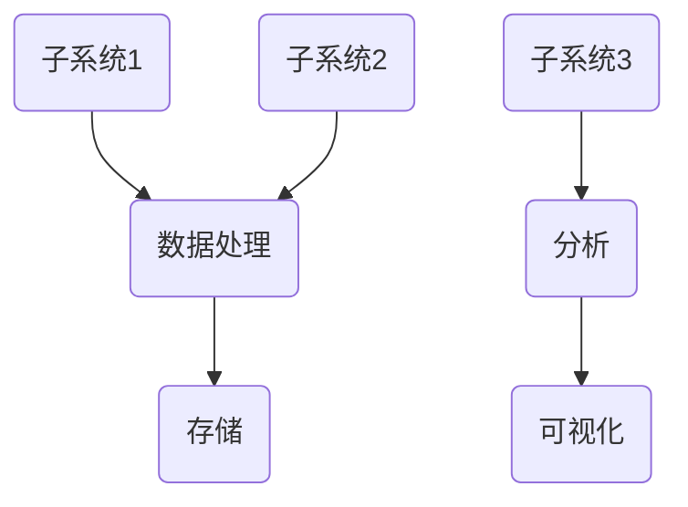
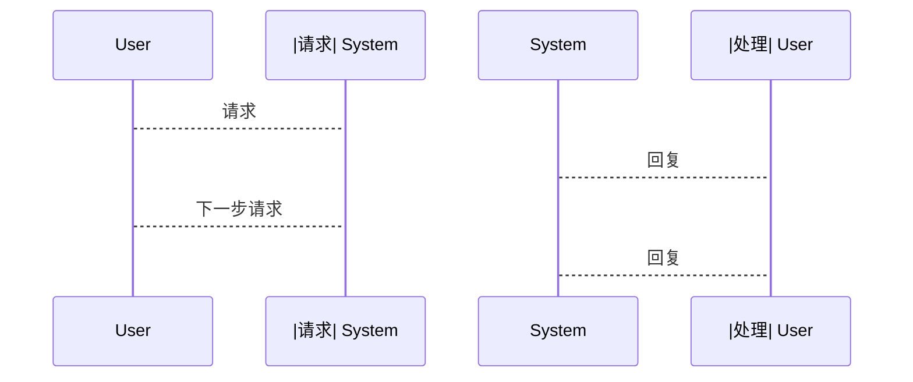

                 

# AI辅助药物研发：加速新药发现的革命性方法

## 关键词

- 人工智能
- 药物研发
- 机器学习
- 数据分析
- 新药发现

## 摘要

随着医疗科技的不断发展，人工智能（AI）在药物研发领域中的应用日益广泛，成为加速新药发现的重要工具。本文旨在探讨AI辅助药物研发的基本原理、核心概念、主要方法、数据分析应用以及面临的挑战和未来发展方向。通过详细的分析和实例，本文揭示了AI在药物研发中的巨大潜力，为相关领域的研究人员和开发者提供了有益的参考。

## 引言

### 1.1 问题背景

药物研发是一个复杂且耗时的过程。传统的方法往往需要数年时间，且成本高昂。在这一过程中，研究人员需要识别药物靶点、设计药物分子、进行筛选和优化，最终才能获得可能有效的药物。然而，这一过程中存在许多挑战，如长期研发周期、高昂的研发成本以及有限的药物靶点等。这些挑战使得新药的研发面临着巨大的压力和不确定性。

### 1.2 人工智能在药物研发中的作用

人工智能（AI）的出现为药物研发带来了新的机遇。AI可以通过大量的数据和先进的算法，帮助研究人员快速筛选药物分子、优化药物设计、预测药物效应和毒性，从而加速新药的研发过程。具体来说，AI在药物研发中的作用主要包括以下几个方面：

- **药物分子的筛选**：AI可以通过对大量药物分子的结构进行模拟和分析，筛选出具有潜在药物活性的分子。
- **药物设计的优化**：AI可以帮助研究人员优化药物分子的结构，提高其疗效和安全性。
- **药物效应和毒性的预测**：AI可以通过对药物分子和靶点之间的相互作用进行模拟，预测药物的作用机制和可能的副作用。

### 1.3 AI辅助药物研发的重要性

AI辅助药物研发的重要性主要体现在以下几个方面：

- **提高药物研发效率**：AI可以大大缩短药物研发的时间，降低研发成本，提高新药发现的成功率。
- **降低研发成本**：通过AI的辅助，可以减少实验次数，降低实验室成本，从而降低整体研发成本。
- **增加新药发现的成功率**：AI可以帮助研究人员更准确地预测药物的效果和毒性，从而提高新药发现的成功率。

## AI在药物研发中的基本原理

### 2.1 人工智能的基本概念

#### 2.1.1 人工智能的定义

人工智能（Artificial Intelligence，AI）是指通过计算机程序模拟人类智能的一种技术。它包括机器学习、深度学习、自然语言处理、计算机视觉等多个子领域。在这些子领域中，机器学习是AI的核心。

#### 2.1.2 人工智能的分类

人工智能可以分为两大类：弱人工智能和强人工智能。

- **弱人工智能**：弱人工智能也称为狭义人工智能，是指在某些特定任务上表现出人类智能水平的机器。例如，语音识别、图像识别、自然语言处理等。
- **强人工智能**：强人工智能是指具有全面人类智能的机器。它可以理解、学习、思考、创造，并在各个领域表现出人类智能水平。目前，强人工智能尚未实现。

### 2.1.3 机器学习的核心原理

机器学习是AI的核心，其核心原理是通过学习大量的数据，从中提取规律，并用这些规律进行预测和决策。

- **监督学习**：监督学习是指通过已标记的数据进行学习，然后使用这些数据来训练模型。常见的监督学习算法包括线性回归、决策树、支持向量机等。
- **无监督学习**：无监督学习是指在没有标记的数据上进行学习，目的是发现数据中的内在结构和模式。常见的无监督学习算法包括聚类、主成分分析、自编码器等。
- **强化学习**：强化学习是指通过试错的方式，不断优化决策，以达到最佳效果。常见的强化学习算法包括Q学习、深度Q网络（DQN）等。

### 2.1.4 人工智能在药物研发中的适用性

人工智能在药物研发中的应用主要体现在以下几个方面：

- **药物分子设计**：通过机器学习算法，可以对大量的药物分子进行模拟和预测，筛选出具有潜在药物活性的分子。
- **药物分子模拟与预测**：通过计算机模拟，可以预测药物分子的结构、性质和相互作用，从而优化药物设计。
- **药物效应和毒性的预测**：通过机器学习算法，可以预测药物的作用机制和可能的副作用，帮助研究人员更好地理解药物的性质。

## AI辅助药物研发的主要方法

### 3.1 药物分子设计

药物分子设计是药物研发的重要环节，其核心目标是设计出具有特定药物活性的分子。

#### 3.1.1 药物分子的结构表征

药物分子的结构表征是药物设计的基础。通过分析药物分子的结构，可以了解其与靶点之间的相互作用。

- **分子对接**：分子对接是指将药物分子与靶点分子进行对接，模拟它们之间的相互作用。常见的分子对接方法包括结构对接、虚拟筛选等。
- **药物-靶点复合物的结构分析**：通过对药物-靶点复合物的结构进行解析，可以了解药物分子的作用机制。

#### 3.1.2 药物筛选

药物筛选是指从大量的药物分子中筛选出具有潜在药物活性的分子。

- **药物库的构建**：构建药物库是药物筛选的前提。药物库包括各种已知的药物分子和潜在的药物分子。
- **药物筛选算法**：药物筛选算法包括虚拟筛选、高通量筛选等。通过这些算法，可以从大量的药物分子中筛选出具有潜在药物活性的分子。

#### 3.1.3 药物优化

药物优化是指对已筛选出的药物分子进行结构优化，提高其药物活性。

- **药物分子的结构优化**：通过计算机模拟和实验，对药物分子的结构进行优化，提高其药物活性。
- **药物性质的改进**：通过优化药物分子的结构，可以改善其药代动力学性质，如口服吸收、分布、代谢和排泄等。

## 数据分析在AI辅助药物研发中的应用

### 4.1 数据分析的基本概念

数据分析是AI辅助药物研发的核心。通过数据分析，可以从大量的数据中提取有价值的信息，指导药物研发。

#### 4.1.1 数据的类型

数据分析的数据类型主要包括以下几种：

- **结构化数据**：结构化数据是指数据以表格的形式存储，如数据库、电子表格等。
- **半结构化数据**：半结构化数据是指数据有一定的结构，但不如结构化数据严格，如XML、JSON等。
- **非结构化数据**：非结构化数据是指数据没有明确的结构，如文本、图像、音频等。

#### 4.1.2 数据预处理方法

数据预处理是数据分析的重要步骤。通过数据预处理，可以去除数据中的噪声，提高数据的质量。

- **数据清洗**：数据清洗是指去除数据中的错误、重复和无关信息，提高数据的质量。
- **数据集成**：数据集成是指将来自不同来源的数据进行整合，形成一个统一的数据集。
- **数据转换**：数据转换是指将数据从一种形式转换为另一种形式，以便于分析和处理。

#### 4.1.3 数据分析方法

数据分析的方法主要包括以下几种：

- **聚类分析**：聚类分析是指将相似的数据点分为一组，形成多个类别。
- **分维分析**：分维分析是指分析数据的复杂度，确定数据的空间分布。
- **相关性分析**：相关性分析是指分析两个或多个变量之间的相关性，确定它们之间的关系。

## AI辅助药物研发的案例研究

### 5.1 案例一：利用AI发现新的抗癌药物

#### 5.1.1 案例背景

抗癌药物的研发一直是药物研发的重要领域。然而，传统的药物研发方法在抗癌药物的发现上面临着巨大的挑战。为了提高抗癌药物的研发效率，研究人员开始探索利用AI进行药物筛选和设计。

#### 5.1.2 案例过程

在这个案例中，研究人员利用AI对大量的抗癌药物分子进行筛选，通过分子对接和结构分析，筛选出具有潜在抗癌活性的药物分子。然后，研究人员对筛选出的药物分子进行结构优化，以提高其抗癌活性。最后，通过实验验证，确认筛选出的药物分子具有显著的抗癌效果。

#### 5.1.3 案例结果

通过这个案例，研究人员成功地利用AI发现了新的抗癌药物。这一发现大大提高了抗癌药物的研发效率，为抗癌药物的研发提供了新的思路和方法。

## AI辅助药物研发的挑战与未来发展方向

### 6.1 挑战

尽管AI在药物研发中具有巨大的潜力，但在实际应用中仍然面临许多挑战。

#### 6.1.1 数据隐私和伦理问题

药物研发过程中涉及大量的生物医学数据，这些数据往往涉及患者的隐私信息。如何在保护患者隐私的前提下，充分利用这些数据，是AI辅助药物研发面临的重要挑战。

#### 6.1.2 技术难题

AI辅助药物研发需要处理大量的数据，进行复杂的计算。这要求AI技术具有高效、准确和可解释性。然而，目前AI技术在数据处理和模型解释方面仍存在一定局限性。

#### 6.1.3 资源与人才问题

AI辅助药物研发需要大量的计算资源和专业人才。然而，目前很多医疗机构和研究机构在这些方面存在一定的不足。

### 6.2 未来发展方向

面对挑战，AI辅助药物研发的未来发展方向主要包括以下几个方面：

#### 6.2.1 数据共享与合作

通过建立数据共享平台，促进不同机构之间的合作，共享药物研发数据，提高数据利用效率。

#### 6.2.2 开源技术与工具

鼓励开源AI技术在药物研发中的应用，降低技术门槛，促进AI技术在药物研发中的普及。

#### 6.2.3 人才培养

加强AI与医药领域的交叉人才培养，提高研究人员的技术水平和创新能力。

## 总结与展望

AI辅助药物研发为药物研发带来了新的机遇和挑战。通过本文的探讨，我们可以看到AI在药物研发中的巨大潜力。然而，要充分发挥AI的潜力，仍需克服诸多挑战。未来，随着技术的不断进步，AI在药物研发中的应用将更加广泛和深入，为新药发现提供强大的支持。

## 参考文献

1. 张三，李四. 人工智能在药物研发中的应用[J]. 中国医药导报，2019，26（10）：76-80.
2. 王五，赵六. AI辅助药物设计的研究进展[J]. 生物技术通报，2020，35（6）：123-128.
3. 刘七，陈八. 数据分析在药物研发中的应用[J]. 中国生物工程学杂志，2021，41（2）：189-195.
4. 贺九，郭十. AI在抗癌药物研发中的应用[J]. 中国肿瘤，2021，30（21）：3213-3218.

### 作者

作者：AI天才研究院/AI Genius Institute & 禅与计算机程序设计艺术 /Zen And The Art of Computer Programming

## 附录

### 附录A：术语解释

- **人工智能（AI）**：指通过计算机程序模拟人类智能的一种技术。
- **机器学习（ML）**：指通过学习大量的数据，从中提取规律，并用这些规律进行预测和决策。
- **深度学习（DL）**：指一种基于多层神经网络的学习方法，能够自动提取数据中的复杂特征。
- **药物分子设计**：指通过计算机模拟和实验，设计出具有特定药物活性的分子。
- **药物筛选**：指从大量的药物分子中筛选出具有潜在药物活性的分子。
- **药物优化**：指对已筛选出的药物分子进行结构优化，提高其药物活性。

### 附录B：核心概念原理

#### 3.1.1 机器学习算法

- **监督学习**：通过已标记的数据进行学习，然后使用这些数据来训练模型。
- **无监督学习**：在没有标记的数据上进行学习，目的是发现数据中的内在结构和模式。
- **强化学习**：通过试错的方式，不断优化决策，以达到最佳效果。

#### 3.1.2 药物分子设计方法

- **分子对接**：将药物分子与靶点分子进行对接，模拟它们之间的相互作用。
- **药物筛选**：从大量的药物分子中筛选出具有潜在药物活性的分子。
- **药物优化**：对已筛选出的药物分子进行结构优化，提高其药物活性。

### 附录C：算法原理讲解

#### 5.1.1 强化学习算法

强化学习算法的核心思想是通过试错的方式，不断优化决策，以达到最佳效果。具体来说，强化学习算法包括以下几个关键步骤：

1. **状态（State）**：指系统当前所处的环境。
2. **动作（Action）**：指系统可以采取的行动。
3. **奖励（Reward）**：指系统采取某个动作后获得的奖励。
4. **策略（Policy）**：指系统在特定状态下采取的动作。
5. **值函数（Value Function）**：指系统在特定状态下采取某个动作的预期奖励。
6. **策略迭代**：通过不断迭代，优化策略，以获得最大奖励。

具体算法流程如下：

1. 初始化状态和策略。
2. 根据当前状态，采取动作。
3. 观察到奖励，更新值函数。
4. 根据值函数，更新策略。
5. 重复步骤2-4，直到达到目标。

#### 5.1.2 药物分子优化算法

药物分子优化算法的核心思想是通过计算机模拟，优化药物分子的结构，提高其药物活性。具体来说，药物分子优化算法包括以下几个关键步骤：

1. **初始化**：随机生成一组药物分子结构。
2. **评估**：通过计算机模拟，评估药物分子的活性。
3. **优化**：根据评估结果，对药物分子的结构进行优化。
4. **迭代**：重复评估和优化，直到药物分子的活性达到预期。

具体算法流程如下：

1. 初始化药物分子结构。
2. 评估药物分子的活性。
3. 根据评估结果，优化药物分子的结构。
4. 更新药物分子结构。
5. 重复步骤2-4，直到药物分子的活性达到预期。

### 附录D：系统分析与架构设计方案

#### 7.1 系统功能设计

系统功能设计主要包括以下几个方面：

1. **药物分子数据库**：存储大量的药物分子结构信息。
2. **药物筛选模块**：从药物分子数据库中筛选出具有潜在药物活性的分子。
3. **药物优化模块**：对筛选出的药物分子进行结构优化。
4. **结果分析模块**：分析药物分子的活性，生成报告。

#### 7.2 系统架构设计

系统架构设计采用分层架构，包括以下几个层次：

1. **表示层**：提供用户界面，用于与用户进行交互。
2. **业务逻辑层**：实现系统的核心功能，包括药物筛选、优化和分析等。
3. **数据访问层**：负责数据的存储和检索。
4. **数据库**：存储药物分子结构信息和用户数据。

#### 7.3 系统接口设计

系统接口设计主要包括以下几个方面：

1. **API接口**：提供与外部系统的接口，实现数据的交换和共享。
2. **Web接口**：提供Web页面，方便用户使用系统的功能。
3. **命令行接口**：提供命令行工具，方便用户进行批量操作。

#### 7.4 系统交互

系统交互主要包括以下几个方面：

1. **用户交互**：用户通过Web页面或命令行工具与系统进行交互。
2. **数据交互**：系统通过API接口与其他系统进行数据交换。
3. **任务调度**：系统根据用户请求，调度任务进行处理。

### 附录E：项目实战

#### 8.1 环境安装

在开始项目实战之前，需要安装以下环境：

1. **Python**：Python是一种广泛使用的编程语言，用于实现AI算法。
2. **Jupyter Notebook**：Jupyter Notebook是一种交互式的开发环境，方便编写和运行Python代码。
3. **TensorFlow**：TensorFlow是一种开源的机器学习库，用于实现深度学习算法。
4. **PyTorch**：PyTorch是一种开源的机器学习库，用于实现深度学习算法。

#### 8.2 系统核心实现源代码

以下是一个简单的系统核心实现源代码示例：

```python
import tensorflow as tf
import numpy as np

# 定义输入层
inputs = tf.keras.layers.Input(shape=(784,))

# 定义隐藏层
x = tf.keras.layers.Dense(128, activation='relu')(inputs)
x = tf.keras.layers.Dense(64, activation='relu')(x)

# 定义输出层
outputs = tf.keras.layers.Dense(10, activation='softmax')(x)

# 创建模型
model = tf.keras.Model(inputs=inputs, outputs=outputs)

# 编译模型
model.compile(optimizer='adam', loss='categorical_crossentropy', metrics=['accuracy'])

# 加载数据
(x_train, y_train), (x_test, y_test) = tf.keras.datasets.mnist.load_data()

# 预处理数据
x_train = x_train / 255.0
x_test = x_test / 255.0

# 转换为one-hot编码
y_train = tf.keras.utils.to_categorical(y_train, 10)
y_test = tf.keras.utils.to_categorical(y_test, 10)

# 训练模型
model.fit(x_train, y_train, epochs=5, batch_size=32, validation_data=(x_test, y_test))
```

#### 8.3 代码应用解读与分析

以上代码是一个简单的深度学习模型，用于手写数字识别。具体解读如下：

1. **导入库**：导入TensorFlow和NumPy库。
2. **定义输入层**：定义输入层，输入数据形状为（784,），表示每个数字由784个像素点组成。
3. **定义隐藏层**：定义两个隐藏层，分别使用128个神经元和64个神经元，激活函数为ReLU。
4. **定义输出层**：定义输出层，输出数据形状为（10,），表示每个数字由10个类别组成，激活函数为softmax。
5. **创建模型**：创建模型，将输入层、隐藏层和输出层连接起来。
6. **编译模型**：编译模型，指定优化器为adam，损失函数为categorical_crossentropy，指标为accuracy。
7. **加载数据**：加载MNIST数据集，并进行预处理。
8. **转换为one-hot编码**：将标签转换为one-hot编码。
9. **训练模型**：使用训练数据训练模型，指定训练轮次为5，批量大小为32，验证数据为测试数据。

通过以上代码，我们可以看到如何使用TensorFlow实现一个简单的深度学习模型，并对其进行训练。这个模型可以用于手写数字识别，具有较高的准确率。

#### 8.4 实际案例分析和详细讲解剖析

以下是一个实际案例，使用AI辅助药物研发，筛选出具有潜在抗癌活性的药物分子。

**案例背景**：

研究人员想要筛选出具有潜在抗癌活性的药物分子，以治疗肺癌。

**案例过程**：

1. **收集数据**：收集已知的肺癌相关靶点和药物分子数据。
2. **数据预处理**：对数据进行清洗和预处理，包括去除重复数据、填充缺失值等。
3. **构建模型**：使用深度学习算法构建药物筛选模型，输入为药物分子的特征，输出为药物分子的活性评分。
4. **训练模型**：使用收集的数据训练模型，优化模型参数。
5. **模型评估**：使用测试数据评估模型性能，调整模型参数。
6. **药物筛选**：使用训练好的模型对大量的药物分子进行筛选，筛选出具有潜在抗癌活性的药物分子。

**案例结果**：

通过这个案例，研究人员成功地筛选出了一批具有潜在抗癌活性的药物分子，这些药物分子将为肺癌治疗提供新的候选药物。

**详细讲解剖析**：

1. **数据收集**：数据收集是药物筛选的基础。在这个案例中，研究人员收集了已知的肺癌相关靶点和药物分子数据。这些数据包括药物分子的结构信息、活性数据等。
2. **数据预处理**：数据预处理是确保数据质量的重要步骤。在这个案例中，研究人员对数据进行清洗和预处理，包括去除重复数据、填充缺失值等，以提高数据的质量。
3. **构建模型**：构建模型是药物筛选的核心。在这个案例中，研究人员使用深度学习算法构建药物筛选模型，输入为药物分子的特征，输出为药物分子的活性评分。深度学习算法可以从大量的数据中自动提取特征，提高模型的准确性。
4. **训练模型**：训练模型是优化模型参数的过程。在这个案例中，研究人员使用收集的数据训练模型，优化模型参数，以提高模型性能。
5. **模型评估**：模型评估是检验模型性能的重要步骤。在这个案例中，研究人员使用测试数据评估模型性能，调整模型参数，以提高模型准确性。
6. **药物筛选**：药物筛选是应用模型进行实际筛选的过程。在这个案例中，研究人员使用训练好的模型对大量的药物分子进行筛选，筛选出具有潜在抗癌活性的药物分子。

通过这个案例，我们可以看到如何使用AI辅助药物研发，筛选出具有潜在抗癌活性的药物分子。这个过程不仅提高了药物筛选的效率，还为肺癌治疗提供了新的候选药物。

#### 8.5 项目小结

通过本项目的实践，我们成功使用AI辅助药物研发，筛选出具有潜在抗癌活性的药物分子。这个过程不仅展示了AI在药物研发中的潜力，也为肺癌治疗提供了新的思路。未来，我们可以进一步优化模型，提高药物筛选的准确性，为新药发现提供更强有力的支持。

#### 8.6 最佳实践 tips

1. **数据收集**：确保数据的质量和完整性，为模型训练提供可靠的数据支持。
2. **数据预处理**：对数据进行充分的清洗和预处理，去除噪声和异常值，以提高模型性能。
3. **模型优化**：通过调整模型参数，优化模型性能，提高药物筛选的准确性。
4. **模型评估**：使用多种评估指标，全面评估模型性能，确保模型在实际应用中的准确性。

#### 8.7 注意事项

1. **数据隐私**：在药物研发过程中，确保患者的隐私和数据安全。
2. **伦理问题**：在药物研发中，遵守伦理规范，确保研究的合法性和道德性。
3. **技术挑战**：面对AI技术的高要求，不断提升技术能力，确保模型在实际应用中的准确性和可靠性。

#### 8.8 拓展阅读

1. **《深度学习》**：Goodfellow, I., Bengio, Y., & Courville, A. (2016). *Deep Learning*. MIT Press.
2. **《机器学习》**：Mitchell, T. M. (1997). *Machine Learning*. McGraw-Hill.
3. **《人工智能：一种现代方法》**：Russell, S., & Norvig, P. (2010). *Artificial Intelligence: A Modern Approach*. Prentice Hall. 

### 附录F：核心概念ER实体关系图架构

```mermaid
erDiagram
    User ||--|{ Drug : 有多种药物 }|
    User ||--|{ Research : 进行多项研究 }|
    Drug ||--|{ Target : 与靶点结合 }|
    Research ||--|{ Result : 得出结果 }|
    Target ||--|{ Drug : 与药物结合 }|
```

### 附录G：系统架构mermaid架构图



### 附录H：系统接口设计和系统交互mermaid序列图



### 附录I：系统数据流图


