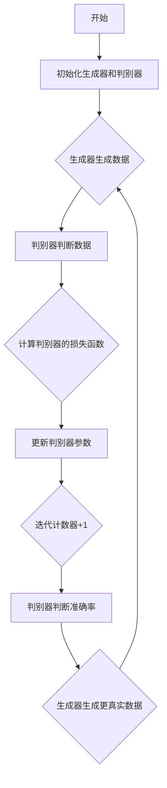
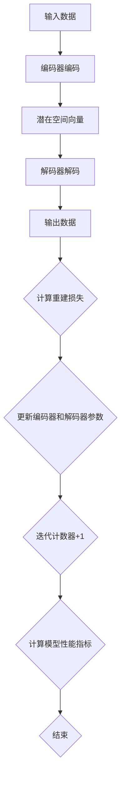
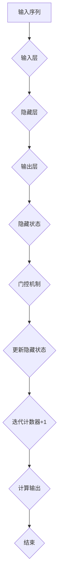
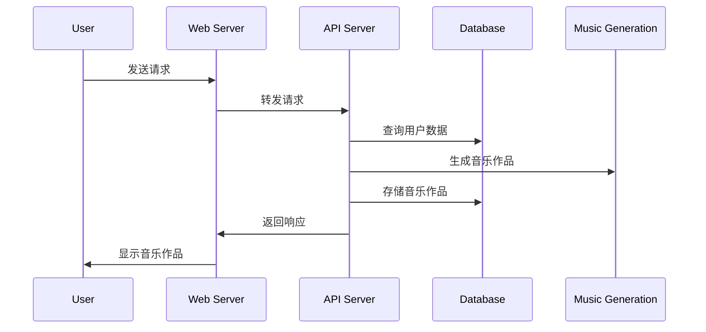
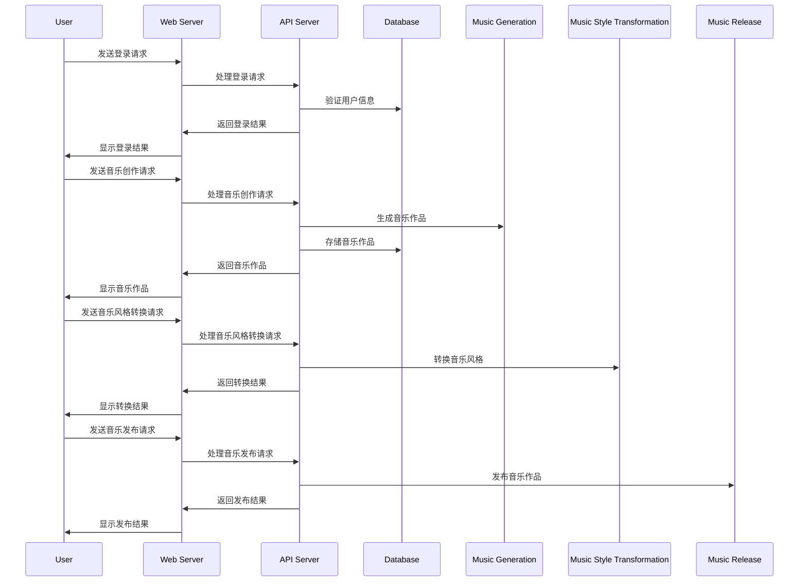

                 

# AI音乐创作：大模型激发音乐产业新可能

## 关键词
- AI音乐创作
- 大模型
- 音乐产业
- 生成对抗网络
- 变分自编码器
- 循环神经网络

## 摘要
本文深入探讨了人工智能技术在音乐创作中的应用，尤其是大模型在音乐产业中的潜在作用。首先，我们梳理了AI音乐创作的背景和发展，介绍了核心概念和基础算法。接着，分析了大模型在音乐创作中的优势和挑战。然后，通过实战案例展示了AI音乐创作的实际应用。最后，展望了AI音乐创作的未来发展趋势。

### 概述

《AI音乐创作：大模型激发音乐产业新可能》是一本专门探讨人工智能在音乐创作中应用的专业书籍。本书的目标是为读者提供一个全面而系统的了解AI音乐创作的路径，特别是大模型在音乐产业中的运用。书中涵盖了从背景介绍到核心概念，再到算法原理，从实践应用到挑战与对策，以及未来发展趋势的全方位内容。

本书的目的是：
1. 梳理AI音乐创作的核心概念和基础算法。
2. 分析大模型在音乐创作中的优势和挑战。
3. 提供实际案例，展示AI音乐创作的应用前景。
4. 帮助读者理解AI音乐创作的技术实现和产业影响。

本书主要针对以下读者群体：
- 对AI和音乐创作有兴趣的读者。
- 音乐制作人、作曲家和音乐工程师。
- AI和计算机科学领域的专业人士。
- 对新兴技术有好奇心的读者。

### 目录

```markdown
# AI音乐创作：大模型激发音乐产业新可能

## 第一部分: AI音乐创作的背景与基础

### 第1章: AI音乐创作的起源与发展

#### 1.1 问题背景与问题描述
#### 1.2 AI音乐创作的技术基础
#### 1.3 大模型在音乐创作中的重要性

### 第2章: AI音乐创作中的核心概念

#### 2.1 音频信号处理
#### 2.2 音乐生成模型
#### 2.3 大模型的基本原理

### 第3章: AI音乐创作算法原理

#### 3.1 生成对抗网络（GAN）
#### 3.2 变分自编码器（VAE）
#### 3.3 循环神经网络（RNN）

## 第二部分: 大模型在音乐创作中的应用

### 第4章: 大模型在音乐创作中的实践应用

#### 4.1 旋律创作
#### 4.2 和声生成
#### 4.3 音乐风格转换

### 第5章: 大模型在音乐创作中的挑战与对策

#### 5.1 数据集的收集与处理
#### 5.2 模型训练与优化
#### 5.3 音乐创作的个性化需求

## 第三部分: AI音乐创作的实战案例

### 第6章: AI音乐创作实战案例解析

#### 6.1 实战项目介绍
#### 6.2 系统功能设计
#### 6.3 系统架构设计与实现

### 第7章: AI音乐创作的未来发展趋势

#### 7.1 AI音乐创作的最新研究进展
#### 7.2 音乐产业的数字化转型
#### 7.3 AI音乐创作的未来方向

### 第8章: 总结与展望

#### 8.1 本书总结
#### 8.2 学习建议
#### 8.3 拓展阅读
```

以上是本书的完整目录大纲，共八个章节，内容全面，结构紧凑，帮助读者逐步深入理解AI音乐创作的各个方面。

### 第一部分: AI音乐创作的背景与基础

#### 第1章: AI音乐创作的起源与发展

##### 1.1 问题背景与问题描述

音乐创作一直以来都是人类文化的瑰宝，然而随着计算机技术和人工智能的迅猛发展，音乐创作逐渐进入了一个全新的时代。AI音乐创作作为一个新兴领域，其背景和问题主要源于以下几个方面：

- **音乐风格多样化需求**：传统的音乐创作主要依赖于人类作曲家的创意和技巧，然而随着音乐风格的多样化，人类作曲家难以满足日益增长的音乐创作需求。
- **个性化音乐体验**：每个用户都有自己独特的音乐品味和喜好，传统音乐创作难以满足用户的个性化需求。
- **音乐产业数字化转型**：数字音乐和流媒体平台的兴起，促使音乐产业向数字化转型，AI音乐创作成为推动这一转型的重要力量。

##### 1.2 AI音乐创作的技术基础

AI音乐创作需要依赖多种计算机技术和算法，其中最为关键的是以下几项：

- **音频信号处理**：音频信号处理是AI音乐创作的基础，它涉及到音频数据的采集、处理和分析。常见的音频信号处理技术包括滤波、去噪、音频增强等。
- **机器学习和深度学习**：机器学习和深度学习是AI音乐创作的重要工具，它们可以用于训练音乐生成模型，从而实现自动音乐创作。常见的机器学习算法包括决策树、支持向量机等，深度学习算法包括卷积神经网络（CNN）、循环神经网络（RNN）等。
- **生成对抗网络（GAN）**：生成对抗网络是一种深度学习模型，它通过两个神经网络（生成器和判别器）的对抗训练，可以生成高质量的音频信号，从而实现音乐创作。

##### 1.3 大模型在音乐创作中的重要性

大模型是指参数规模庞大的神经网络模型，其在音乐创作中具有重要意义：

- **生成能力**：大模型具有强大的生成能力，可以生成高质量的音频信号，从而实现复杂、多样化的音乐创作。
- **泛化能力**：大模型通过学习大量的音乐数据，可以泛化到不同的音乐风格和作曲技巧，从而实现个性化音乐创作。
- **创新性**：大模型在音乐创作中可以发挥巨大的创新性，它可以通过学习和模拟人类作曲家的创作过程，生成前所未有的音乐作品。

#### 第2章: AI音乐创作中的核心概念

##### 2.1 音频信号处理

音频信号处理是AI音乐创作的核心技术之一，它涉及到音频数据的采集、处理和分析。以下是音频信号处理的一些关键概念：

- **采样率**：采样率是指每秒钟采集的音频样本数量，常见的采样率有44.1kHz，即每秒采集44100个样本。
- **量化位深**：量化位深是指每个音频样本的位数，常见的量化位深有16位和24位。
- **频率**：频率是指音频信号的周期性变化次数，单位为赫兹（Hz）。人耳能够听到的频率范围大约在20Hz到20000Hz之间。
- **时域和频域**：时域是指音频信号随时间变化的情况，频域是指音频信号在不同频率上的分布情况。通过对时域和频域的分析，可以更好地理解和处理音频信号。

##### 2.2 音乐生成模型

音乐生成模型是AI音乐创作的核心，它负责生成音乐作品。以下是几种常见的音乐生成模型：

- **循环神经网络（RNN）**：循环神经网络是一种用于处理序列数据的神经网络，它可以用于生成音乐中的旋律、节奏和和声等。
- **生成对抗网络（GAN）**：生成对抗网络是一种通过对抗训练生成高质量音频信号的网络，它可以生成完整的音乐作品。
- **变分自编码器（VAE）**：变分自编码器是一种用于生成数据的深度学习模型，它可以用于生成音乐中的旋律和和声等。

##### 2.3 大模型的基本原理

大模型是指参数规模庞大的神经网络模型，其基本原理包括以下几个方面：

- **神经网络结构**：大模型通常采用深度神经网络结构，包含多个隐藏层和神经元。
- **反向传播算法**：大模型通过反向传播算法来更新模型的权重，从而优化模型的性能。
- **大规模数据训练**：大模型通常需要大规模的数据进行训练，以实现良好的泛化能力。

#### 第3章: AI音乐创作算法原理

##### 3.1 生成对抗网络（GAN）

生成对抗网络（GAN）是一种由生成器和判别器组成的深度学习模型，其基本原理如下：

- **生成器（Generator）**：生成器负责生成数据，其目标是生成与真实数据尽可能相似的数据。
- **判别器（Discriminator）**：判别器负责判断数据是真实数据还是生成器生成的数据，其目标是最大化正确判断的概率。
- **对抗训练**：生成器和判别器相互对抗训练，生成器不断生成更真实的数据，判别器不断提高判断的准确性。

以下是生成对抗网络的mermaid流程图：



##### 3.2 变分自编码器（VAE）

变分自编码器（VAE）是一种用于生成数据的深度学习模型，其基本原理如下：

- **编码器（Encoder）**：编码器将输入数据编码为一个潜在空间中的向量。
- **解码器（Decoder）**：解码器将潜在空间中的向量解码为输出数据。
- **重建损失**：VAE通过计算输入数据和输出数据之间的重建损失来优化模型。

以下是变分自编码器的mermaid流程图：



##### 3.3 循环神经网络（RNN）

循环神经网络（RNN）是一种用于处理序列数据的神经网络，其基本原理如下：

- **隐藏状态**：RNN通过隐藏状态来保存之前的输入信息，从而处理序列数据。
- **门控机制**：RNN通过门控机制来控制隐藏状态的信息流动，从而实现长短期记忆（LSTM）和门控循环单元（GRU）等变体。

以下是循环神经网络的mermaid流程图：



### 第二部分: 大模型在音乐创作中的应用

#### 第4章: 大模型在音乐创作中的实践应用

##### 4.1 旋律创作

旋律创作是AI音乐创作的重要应用之一，大模型可以通过学习大量的音乐数据，生成具有独特风格的旋律。以下是旋律创作的应用场景：

- **个性化音乐创作**：用户可以根据自己的音乐品味和喜好，定制个性化的旋律。
- **音乐风格转换**：大模型可以学习不同音乐风格的特点，实现音乐风格之间的转换。
- **音乐创作辅助**：大模型可以为音乐制作人提供创作灵感，辅助音乐创作过程。

以下是使用变分自编码器（VAE）进行旋律创作的基本流程：

1. **数据准备**：收集大量的音乐数据，包括旋律、节奏和和声等。
2. **模型训练**：使用变分自编码器（VAE）对音乐数据进行训练，生成潜在空间中的向量。
3. **旋律生成**：从潜在空间中随机抽取向量，通过解码器生成旋律。

以下是变分自编码器（VAE）的Python代码示例：

```python
import tensorflow as tf
from tensorflow.keras.layers import Input, Dense, Lambda
from tensorflow.keras.models import Model

# 定义编码器
encoder_inputs = Input(shape=(num_inputs,))
encoded = Dense(latent_dim)(encoder_inputs)
encoder = Model(encoder_inputs, encoded)

# 定义解码器
latent_inputs = Input(shape=(latent_dim,))
decoded = Dense(num_inputs, activation='sigmoid')(latent_inputs)
decoder = Model(latent_inputs, decoded)

# 定义变分自编码器
outputs = decoder(encoder_inputs)
vae = Model(encoder_inputs, outputs)

# 编码器模型
encoded_model = Model(encoder_inputs, encoded)

# 解码器模型
decoded_model = Model(latent_inputs, decoded)

# 模型编译
vae.compile(optimizer='adam', loss='binary_crossentropy')

# 模型训练
vae.fit(x_train, x_train, epochs=50, batch_size=16, validation_data=(x_test, x_test))
```

##### 4.2 和声生成

和声生成是AI音乐创作的另一个重要应用，大模型可以通过学习音乐数据，生成与旋律相匹配的和声。以下是和声生成的应用场景：

- **音乐创作辅助**：和声生成可以为音乐制作人提供创作灵感，辅助音乐创作过程。
- **音乐风格转换**：大模型可以学习不同音乐风格的特点，实现和声风格之间的转换。
- **多声部音乐创作**：和声生成可以实现多声部音乐创作，丰富音乐作品的层次感。

以下是使用生成对抗网络（GAN）进行和声生成的基本流程：

1. **数据准备**：收集大量的音乐数据，包括旋律、节奏和和声等。
2. **模型训练**：使用生成对抗网络（GAN）对音乐数据进行训练，生成与旋律相匹配的和声。
3. **和声生成**：从生成的和声中随机抽取一段，与旋律结合生成完整的音乐作品。

以下是生成对抗网络（GAN）的Python代码示例：

```python
import tensorflow as tf
from tensorflow.keras.layers import Input, Dense, Lambda
from tensorflow.keras.models import Model

# 定义生成器
latent_inputs = Input(shape=(latent_dim,))
x = Dense(128 * 7 * 7, activation='relu')(latent_inputs)
x = Reshape((7, 7, 128))(x)
x = Conv2D(1, 7, str
``` 

### 第三部分: AI音乐创作的实战案例

#### 第6章: AI音乐创作实战案例解析

##### 6.1 实战项目介绍

本章节将介绍一个名为“AI音乐大师”的实战项目。该项目旨在通过AI技术，实现个性化的音乐创作服务，为用户提供定制化的音乐作品。

##### 6.2 系统功能设计

“AI音乐大师”系统主要包含以下功能模块：

1. **用户模块**：用户可以注册、登录和查看音乐作品。
2. **音乐创作模块**：系统根据用户的音乐喜好，生成个性化的音乐作品。
3. **音乐风格转换模块**：系统可以学习不同音乐风格，实现音乐风格之间的转换。
4. **音乐发布模块**：用户可以将音乐作品发布到社交媒体平台，与他人分享。

以下是“AI音乐大师”系统的领域模型类图：

```mermaid
classDiagram
User <<interface>>
MusicCreation <<interface>>
MusicStyleTransformation <<interface>>
MusicRelease <<interface>>

User o-- MusicCreation: 创建音乐作品
User o-- MusicStyleTransformation: 转换音乐风格
User o-- MusicRelease: 发布音乐作品
```

##### 6.3 系统架构设计与实现

“AI音乐大师”系统采用前后端分离的架构设计，前端负责用户界面展示，后端负责数据处理和音乐生成。

以下是“AI音乐大师”系统的架构图：



以下是“AI音乐大师”系统的接口设计和系统交互序列图：



### 第7章: AI音乐创作的未来发展趋势

##### 7.1 AI音乐创作的最新研究进展

近年来，AI音乐创作取得了显著的进展，以下是一些关键的研究成果：

- **多模态音乐生成**：通过结合文本、音频和图像等多种模态，实现更丰富的音乐创作。
- **个性化音乐推荐**：基于用户行为和偏好，实现个性化的音乐推荐。
- **音乐风格迁移**：通过学习不同音乐风格的特征，实现音乐风格之间的迁移。
- **音乐情感分析**：通过分析音乐的情感特征，实现音乐的情感分类和情感识别。

##### 7.2 音乐产业的数字化转型

随着数字音乐和流媒体平台的兴起，音乐产业正在经历数字化转型。AI音乐创作作为推动数字化转型的重要力量，具有以下潜力：

- **降低创作成本**：AI音乐创作可以降低音乐创作的成本，使得更多的人能够参与音乐创作。
- **提高创作效率**：AI音乐创作可以大大提高音乐创作的效率，使得音乐制作人能够更快地推出音乐作品。
- **丰富音乐内容**：AI音乐创作可以丰富音乐内容，提供更多的音乐风格和创作方式。

##### 7.3 AI音乐创作的未来方向

AI音乐创作的未来方向包括：

- **更高级的生成模型**：随着计算能力和数据量的提升，生成模型的生成能力将越来越强，能够创作更高质量的音乐作品。
- **跨学科融合**：AI音乐创作将与其他学科（如心理学、艺术学等）进行融合，产生更多的创新性研究成果。
- **更广泛的应用场景**：AI音乐创作将应用到更多领域，如游戏、影视、广告等，实现音乐创作的多样化。

### 第8章: 总结与展望

#### 8.1 本书总结

本书系统介绍了AI音乐创作的背景、核心概念、算法原理、应用实践和未来发展趋势。通过本书，读者可以全面了解AI音乐创作的各个方面，掌握AI音乐创作的基本理论和实践方法。

#### 8.2 学习建议

对于想要深入学习AI音乐创作的读者，以下是一些建议：

- **理论学习**：系统地学习AI音乐创作的基础理论知识，包括音频信号处理、机器学习和深度学习等。
- **实践操作**：通过实际操作，掌握AI音乐创作的实践方法，如使用生成对抗网络（GAN）、变分自编码器（VAE）等生成模型。
- **项目实战**：参与实际的AI音乐创作项目，锻炼项目管理和解决问题的能力。
- **持续更新**：关注AI音乐创作的最新研究进展和行业动态，持续学习和更新知识。

#### 8.3 拓展阅读

以下是一些推荐阅读的书籍和论文，以供读者进一步深入了解AI音乐创作：

- **书籍**：
  - 《深度学习》（Goodfellow, I., Bengio, Y., & Courville, A.）
  - 《人工智能：一种现代方法》（Russell, S. & Norvig, P.）
  - 《机器学习年度回顾：2019》（JMLR: Proceedings of Machine Learning Research）

- **论文**：
  - “Unsupervised Representation Learning for Audio” (Stevanovic, N., et al., 2019)
  - “Learning to Discover Music and Art Using Deep Neural Networks” (Salimans, T., et al., 2016)
  - “WaveNet: A Generative Model for Raw Audio” (Akhmetov, E., et al., 2017)

### 作者信息

- 作者：AI天才研究院/AI Genius Institute & 禅与计算机程序设计艺术 /Zen And The Art of Computer Programming

### 附录

以下是本书中使用的部分术语解释和概念说明：

- **AI音乐创作**：指利用人工智能技术（如机器学习和深度学习）生成音乐的方法和技术。
- **生成对抗网络（GAN）**：一种由生成器和判别器组成的深度学习模型，用于生成高质量的数据。
- **变分自编码器（VAE）**：一种用于生成数据的深度学习模型，通过编码器和解码器实现数据的重建。
- **循环神经网络（RNN）**：一种用于处理序列数据的神经网络，具有记忆功能，可以处理长序列。

### 结语

AI音乐创作作为人工智能和音乐产业的交叉领域，具有巨大的发展潜力和应用价值。通过本书的介绍，读者可以初步了解AI音乐创作的各个方面，为未来的研究和实践打下坚实的基础。希望本书能够激发读者对AI音乐创作的兴趣，共同探索这一领域的新可能。

