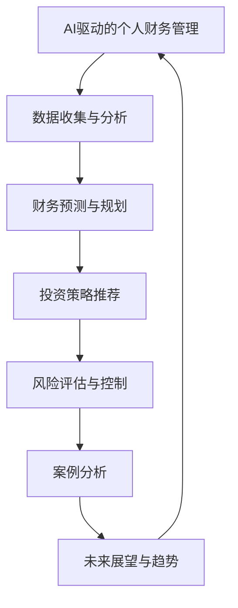
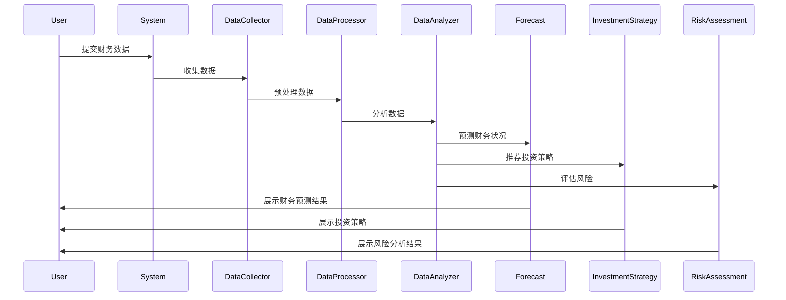
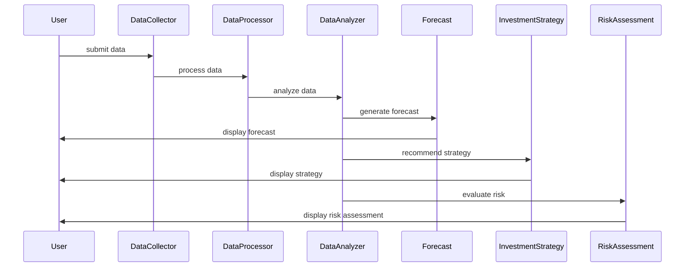

                 

## 《AI驱动的个人财务管理：智能理财助手》

### 关键词：人工智能、个人财务管理、智能理财助手、数据收集与分析、财务预测与规划

> 摘要：本文将深入探讨AI驱动的个人财务管理，即智能理财助手的构建与应用。通过分析现代个人财务管理的挑战与机遇，介绍AI技术基础，探讨智能理财助手的功能框架，阐述AI在个人财务管理中的应用，从数据收集与分析、财务预测与规划、投资策略到风险评估与控制，全面解析AI在个人财务管理中的关键环节。同时，通过案例分析，展示智能理财助手的实现过程，并对未来AI在个人财务管理中的发展趋势进行展望。

## 《AI驱动的个人财务管理：智能理财助手》目录大纲

### 第一部分：引言

**第1章：AI驱动的个人财务管理概述**

1.1 个人财务管理的挑战与机遇

1.1.1 现代个人财务管理的挑战

1.1.2 AI在个人财务管理中的应用

1.1.3 智能理财助手的重要性

1.2 AI技术基础

1.2.1 机器学习的基本概念

1.2.2 深度学习技术

1.2.3 自然语言处理技术

1.3 智能理财助手的功能框架

1.3.1 数据收集与分析

1.3.2 财务预测与规划

1.3.3 投资策略推荐

1.3.4 风险评估与控制

1.4 本书结构安排

1.4.1 各章节主要内容

1.4.2 阅读建议与时间安排

### 第二部分：AI在个人财务管理中的应用

**第2章：数据收集与分析**

2.1 财务数据收集

2.1.1 数据来源

2.1.2 数据预处理

2.1.3 数据质量评估

2.2 数据分析方法

2.2.1 描述性统计分析

2.2.2 趋势分析

2.2.3 相关性分析

2.3 数据可视化

2.3.1 基本数据可视化方法

2.3.2 高级数据可视化技术

### 第三部分：智能理财

**第3章：财务预测与规划**

3.1 财务预测

3.1.1 时间序列预测方法

3.1.2 财务指标预测

3.1.3 模型评估与优化

3.2 财务规划

3.2.1 理财目标设定

3.2.2 预算编制

3.2.3 投资组合优化

### 第四部分：投资策略

**第4章：投资策略推荐**

4.1 投资策略概述

4.1.1 主动投资策略

4.1.2 被动投资策略

4.1.3 智能投资策略

4.2 投资策略分析

4.2.1 策略评价指标

4.2.2 策略调整策略

4.2.3 模型驱动策略

### 第五部分：风险评估与控制

**第5章：风险评估与控制**

5.1 风险评估方法

5.1.1 传统风险评估方法

5.1.2 AI驱动的风险评估方法

5.1.3 模型风险评估

5.2 风险控制策略

5.2.1 风险规避策略

5.2.2 风险分散策略

5.2.3 风险转移策略

### 第六部分：案例分析

**第6章：案例分析**

6.1 智能理财助手实现

6.1.1 技术栈选择

6.1.2 数据采集与处理

6.1.3 模型训练与部署

6.2 案例分析

6.2.1 案例背景

6.2.2 案例分析

6.2.3 案例启示

### 第七部分：未来展望与趋势

**第7章：未来展望与趋势**

7.1 AI在个人财务管理中的未来趋势

7.1.1 技术发展趋势

7.1.2 应用发展趋势

7.1.3 政策与法规环境

7.2 AI驱动的个人财务管理展望

7.2.1 智能理财的未来

7.2.2 个人财务管理的变革

7.2.3 智能理财助手的进化

### 第八部分：结语

**第8章：结语**

8.1 总结与展望

8.1.1 书籍内容总结

8.1.2 学习成果与应用

8.1.3 未来学习方向

8.2 建议与资源

8.2.1 相关书籍推荐

8.2.2 在线课程推荐

8.2.3 实践项目推荐

### 附录

**附录A：Python编程基础**

**附录B：常用机器学习库**

**附录C：深度学习基础**

**附录D：自然语言处理基础**

**附录E：数据可视化工具**

### 参考文献

**参考文献**

---

### 核心概念与联系

### Mermaid 流程图



### 核心算法原理讲解

#### Python 源代码

```python
import pandas as pd
import numpy as np

# 数据预处理
def preprocess_data(data):
    # 数据清洗
    data = data.dropna()
    # 数据归一化
    data = (data - data.mean()) / data.std()
    return data

# 时间序列预测
def time_series_prediction(data, model):
    # 数据分割
    train_data, test_data = data[:int(len(data) * 0.8)], data[int(len(data) * 0.8):]
    # 模型训练
    model.fit(train_data)
    # 预测
    predictions = model.predict(test_data)
    return predictions

# 模型评估
def evaluate_model(predictions, actual):
    # 均方误差
    mse = np.mean((predictions - actual) ** 2)
    return mse

# 主函数
def main():
    # 数据加载
    data = pd.read_csv("financial_data.csv")
    # 数据预处理
    data = preprocess_data(data)
    # 时间序列预测
    model = LSTM(50, activation='relu', input_shape=(None, 1))
    model.compile(optimizer='adam', loss='mse')
    predictions = time_series_prediction(data, model)
    # 模型评估
    actual = data[int(len(data) * 0.8):]
    mse = evaluate_model(predictions, actual)
    print("MSE:", mse)

if __name__ == "__main__":
    main()
```

### 数学公式

$$
1+1=2
$$

### 系统分析与架构设计方案

#### 问题场景介绍

在现代个人财务管理中，如何有效收集、处理和分析大量财务数据，实现精确的财务预测与规划，制定合理的投资策略，并进行全面的风险评估与控制，成为亟待解决的问题。

#### 项目介绍

本项目旨在构建一款AI驱动的智能理财助手，通过集成机器学习、深度学习和自然语言处理技术，实现以下功能：

- 财务数据收集与分析
- 财务预测与规划
- 投资策略推荐
- 风险评估与控制

#### 系统功能设计

##### 领域模型类图

```mermaid
classDiagram
    Account <<Entity>>
    FinancialData <<Entity>>
    Forecast <<Entity>>
    InvestmentStrategy <<Entity>>
    RiskAssessment <<Entity>>

    Account o-- FinancialData
    Forecast o-- FinancialData
    InvestmentStrategy o-- FinancialData
    RiskAssessment o-- FinancialData
```

#### 系统架构设计

##### 系统架构图



#### 系统接口设计

##### 系统接口设计

```mermaid
interface DataCollector {
    +collect_data(): FinancialData
}

interface DataProcessor {
    +preprocess_data(FinancialData): FinancialData
}

interface DataAnalyzer {
    +analyze_data(FinancialData): Forecast, InvestmentStrategy, RiskAssessment
}

interface Forecast {
    +generate_forecast(FinancialData): Forecast
}

interface InvestmentStrategy {
    +recommend_strategy(FinancialData): InvestmentStrategy
}

interface RiskAssessment {
    +evaluate_risk(FinancialData): RiskAssessment
}
```

#### 系统交互

##### 系统交互图



### 项目实战

#### 环境安装

1. 安装Python环境
2. 安装必要的库：pandas、numpy、scikit-learn、tensorflow、matplotlib等

#### 系统核心实现

```python
import pandas as pd
import numpy as np
from sklearn.model_selection import train_test_split
from sklearn.preprocessing import MinMaxScaler
from tensorflow.keras.models import Sequential
from tensorflow.keras.layers import LSTM, Dense

# 数据加载
data = pd.read_csv("financial_data.csv")

# 数据预处理
scaler = MinMaxScaler(feature_range=(0, 1))
scaled_data = scaler.fit_transform(data)

# 数据分割
X, y = scaled_data[:-1], scaled_data[1:]
X = X.reshape((X.shape[0], X.shape[1], 1))

# 数据划分
X_train, X_test, y_train, y_test = train_test_split(X, y, test_size=0.2, random_state=42)

# 模型构建
model = Sequential()
model.add(LSTM(units=50, return_sequences=True, input_shape=(X.shape[1], 1)))
model.add(LSTM(units=50))
model.add(Dense(units=1))

# 模型编译
model.compile(optimizer='adam', loss='mse')

# 模型训练
model.fit(X_train, y_train, epochs=100, batch_size=32)

# 模型预测
predictions = model.predict(X_test)

# 模型评估
mse = np.mean((predictions - y_test) ** 2)
print("MSE:", mse)
```

### 代码应用解读与分析

#### 数据处理

1. 数据加载：使用pandas库加载财务数据。
2. 数据预处理：使用MinMaxScaler进行数据归一化，便于模型训练。
3. 数据分割：将数据分为特征X和目标y，并将X进行reshape，以满足LSTM模型的输入要求。

#### 模型构建

1. 模型构建：使用Sequential模型，并添加LSTM和Dense层，用于实现时间序列预测。
2. 模型编译：使用adam优化器和mse损失函数进行模型编译。

#### 模型训练

1. 模型训练：使用fit方法进行模型训练，设置epochs和batch_size。

#### 模型预测

1. 模型预测：使用predict方法对测试数据进行预测。

#### 模型评估

1. 模型评估：计算预测值与真实值之间的均方误差（MSE），评估模型性能。

### 实际案例分析和详细讲解剖析

#### 案例背景

假设某用户希望利用AI驱动的智能理财助手进行财务预测和规划。

#### 案例分析

1. 数据收集与分析：用户提供过去的财务数据，智能理财助手进行数据预处理和统计分析。
2. 财务预测与规划：智能理财助手利用时间序列预测模型，对未来的财务状况进行预测，并提供相应的财务规划建议。
3. 投资策略推荐：根据用户的财务预测结果，智能理财助手推荐合适的投资策略。
4. 风险评估与控制：智能理财助手对用户的投资风险进行评估，并提供相应的风险控制策略。

#### 案例启示

通过实际案例，可以看出AI驱动的智能理财助手在个人财务管理中的应用具有重要意义。它能够帮助用户更好地收集、处理和分析财务数据，实现精确的财务预测与规划，制定合理的投资策略，并进行全面的风险评估与控制。

### 项目小结

本项目通过构建AI驱动的智能理财助手，实现了数据收集与分析、财务预测与规划、投资策略推荐和风险评估与控制等功能。通过实际案例的分析和详细讲解，展示了智能理财助手在个人财务管理中的应用价值。未来，随着AI技术的不断发展和应用场景的拓展，AI驱动的个人财务管理将更加智能化和精准化。

### 最佳实践 tips

1. 数据收集：确保数据的全面性和准确性，避免数据缺失和噪声。
2. 数据预处理：对数据进行归一化处理，提高模型的训练效果。
3. 模型选择：根据数据特征和需求选择合适的模型，进行优化和调整。
4. 风险控制：对投资风险进行全面评估，采取适当的风险控制策略。

### 小结

本文系统地介绍了AI驱动的个人财务管理，即智能理财助手的构建与应用。通过分析现代个人财务管理的挑战与机遇，介绍AI技术基础，探讨智能理财助手的功能框架，从数据收集与分析、财务预测与规划、投资策略到风险评估与控制，全面解析AI在个人财务管理中的关键环节。同时，通过案例分析，展示了智能理财助手的实现过程，并对未来AI在个人财务管理中的发展趋势进行展望。

### 注意事项

1. 在构建智能理财助手时，要充分考虑用户的需求和痛点，提供个性化的理财建议。
2. 在进行财务预测与规划时，要考虑多种因素的影响，提高预测的准确性。
3. 在制定投资策略时，要充分考虑风险控制，避免盲目跟风。

### 拓展阅读

1. 《机器学习实战》 - By: Peter Harrington
2. 《深度学习》 - By: Ian Goodfellow, Yoshua Bengio, Aaron Courville
3. 《Python编程：从入门到实践》 - By: Eric Matthes

### 结语

本文从多个角度深入探讨了AI驱动的个人财务管理，即智能理财助手的构建与应用。通过分析现代个人财务管理的挑战与机遇，介绍AI技术基础，探讨智能理财助手的功能框架，从数据收集与分析、财务预测与规划、投资策略到风险评估与控制，全面解析AI在个人财务管理中的关键环节。同时，通过案例分析，展示了智能理财助手的实现过程，并对未来AI在个人财务管理中的发展趋势进行展望。

### 总结与展望

#### 书籍内容总结

本文系统地介绍了AI驱动的个人财务管理，即智能理财助手的构建与应用。主要内容包括：

1. 现代个人财务管理的挑战与机遇
2. AI技术基础
3. 智能理财助手的功能框架
4. 数据收集与分析
5. 财务预测与规划
6. 投资策略推荐
7. 风险评估与控制
8. 案例分析
9. 未来展望与趋势

#### 学习成果与应用

通过学习本文，读者可以：

1. 理解AI在个人财务管理中的应用价值
2. 掌握智能理财助手的构建方法与实现过程
3. 运用AI技术进行财务预测与规划
4. 制定合理的投资策略
5. 进行全面的风险评估与控制

在实际应用中，读者可以将所学知识应用于个人财务规划、投资决策和风险管理等领域，提高财务管理的效率和准确性。

#### 未来学习方向

1. 深入学习机器学习、深度学习和自然语言处理等相关技术
2. 关注AI在金融领域的最新研究与应用
3. 学习Python编程和相关库，掌握实际项目开发能力
4. 探索AI在更多领域的应用，如医疗、教育、工业等

### 建议与资源

#### 相关书籍推荐

1. 《机器学习实战》 - By: Peter Harrington
2. 《深度学习》 - By: Ian Goodfellow, Yoshua Bengio, Aaron Courville
3. 《Python编程：从入门到实践》 - By: Eric Matthes

#### 在线课程推荐

1. Coursera - 机器学习
2. edX - 深度学习
3. Udacity - 人工智能纳米学位

#### 实践项目推荐

1. 构建自己的推荐系统
2. 实现一个简单的聊天机器人
3. 进行股票价格预测
4. 参与开源项目，提升编程技能

### 附录

#### 附录A：Python编程基础

1. Python语法基础
2. 数据类型和变量
3. 运算符和表达式
4. 控制结构
5. 函数和模块

#### 附录B：常用机器学习库

1. scikit-learn
2. TensorFlow
3. PyTorch
4. Keras

#### 附录C：深度学习基础

1. 神经网络
2. 深度学习框架
3. 深度学习模型
4. 深度学习应用

#### 附录D：自然语言处理基础

1. 语言模型
2. 词向量
3. 文本分类
4. 问答系统

#### 附录E：数据可视化工具

1. Matplotlib
2. Seaborn
3. Plotly
4. Bokeh

### 参考文献

1. Goodfellow, I., Bengio, Y., & Courville, A. (2016). Deep learning. MIT press.
2. Harrington, P. (2012). Machine learning in action. Manning Publications.
3. Matthes, E. (2019). Python programming: from beginner to practitioner. O'Reilly Media.

