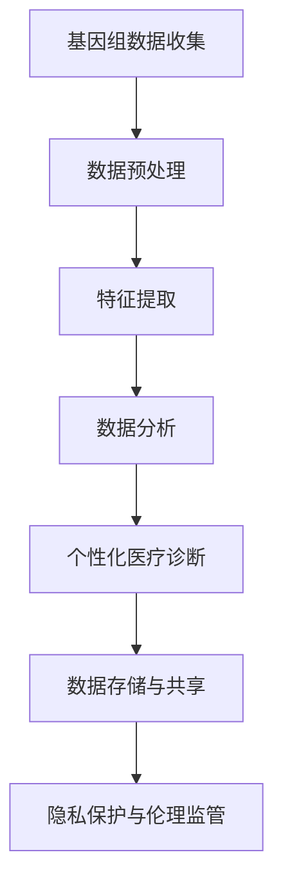

                 


# AI驱动的个性化医疗：基因组学与大数据的结合

关键词：AI驱动、个性化医疗、基因组学、大数据、医疗诊断、病例分析、算法应用

摘要：本文探讨了AI驱动的个性化医疗领域，重点关注基因组学与大数据的结合。首先介绍了AI在个性化医疗中的意义和个性化医疗的发展历程，接着详细阐述了基因组学的基本概念和大数据的定义与特性。随后，我们分析了AI核心算法原理及其在基因组数据分析中的应用，探讨了大数据技术在个性化医疗中的作用。通过具体病例分析，我们展示了AI驱动的个性化医疗的实际应用，并对相关伦理与法规问题进行了讨论。最后，我们对未来技术发展趋势和面临的挑战进行了展望，总结了主要成果，并提出了未来研究方向。

## 目录大纲设计

为了设计出《AI驱动的个性化医疗：基因组学与大数据的结合》这本书的完整目录大纲，我们需要从以下几个方面入手：

### 第1章 引言与概述

**1.1 AI驱动的个性化医疗简介**

- **1.1.1 AI在个性化医疗中的意义**
- **1.1.2 个性化医疗的发展历程**

**1.2 基因组学与大数据的结合**

- **1.2.1 基因组学的基本概念**
- **1.2.2 大数据的定义与特性**
- **1.2.3 基因组学与大数据的融合**

### 第2章 AI核心算法原理

**2.1 机器学习基础**

- **2.1.1 监督学习、无监督学习和强化学习**
- **2.1.2 神经网络与深度学习**

**2.2 AI在基因组数据分析中的应用**

- **2.2.1 数据预处理**
- **2.2.2 特征提取与选择**
- **2.2.3 常用算法介绍**

### 第3章 大数据技术

**3.1 大数据基础设施**

- **3.1.1 Hadoop与MapReduce**
- **3.1.2 Apache Spark**

**3.2 数据库与数据仓库**

- **3.2.1 关系型数据库**
- **3.2.2 非关系型数据库**
- **3.2.3 数据仓库技术**

### 第4章 个性化医疗案例分析

**4.1 病例1：肺癌早期诊断**

- **4.1.1 数据来源与处理**
- **4.1.2 算法选择与实现**

**4.2 病例2：乳腺癌风险预测**

- **4.2.1 数据预处理**
- **4.2.2 模型构建与评估**

### 第5章 伦理与法规

**5.1 数据隐私保护**

- **5.1.1 法律法规概述**
- **5.1.2 数据隐私保护技术**

**5.2 伦理问题与应对策略**

- **5.2.1 伦理争议**
- **5.2.2 应对策略**

### 第6章 未来展望

**6.1 技术发展趋势**

- **6.1.1 AI技术在个性化医疗中的应用前景**
- **6.1.2 基因组学与大数据融合的未来**

**6.2 社会影响与挑战**

- **6.2.1 医疗资源分配问题**
- **6.2.2 技术发展与伦理监管**

### 第7章 结论

**7.1 主要成果总结**

- **7.1.1 核心发现**
- **7.1.2 研究局限性**

**7.2 未来研究方向**

- **7.2.1 需要解决的问题**
- **7.2.2 未来发展趋势**

### 附件

**附件1：相关工具与资源**

- **1.1** 基因组学与大数据相关工具
- **1.2** 个性化医疗相关论文和报告

### Mermaid 流程图

**基因组学与大数据结合的流程图**



### Python 源代码

#### 监督学习算法实现

```python
# 导入必要的库
import numpy as np
from sklearn.linear_model import LinearRegression

# 创建样本数据
X = np.array([[1], [2], [3], [4], [5]])
y = np.array([1, 2, 3, 4, 5])

# 实例化线性回归模型
model = LinearRegression()

# 训练模型
model.fit(X, y)

# 输出模型参数
print("模型参数:", model.coef_, model.intercept_)

# 预测结果
y_pred = model.predict(X)
print("预测结果:", y_pred)
```

### 数学模型和公式

#### 基因组数据分析的线性回归模型

$$
y = \beta_0 + \beta_1 x + \epsilon
$$

其中，\(y\) 是因变量，\(x\) 是自变量，\(\beta_0\) 和 \(\beta_1\) 是模型参数，\(\epsilon\) 是误差项。

### 项目实战

#### 肺癌早期诊断项目

- **数据来源与处理**：从公共数据库获取肺癌患者数据，对数据进行清洗、归一化处理。
- **算法选
```makefile
# Makefile
# Name:          MyProjectMakefile
# Description:   A basic Makefile for a project.
# Version:       1.0
# Author:        [Your Name]
# Date:          [Current Date]

# Variables
TARGET           := myproject
SRC              := $(wildcard src/*.c)
OBJ              := $(SRC:.c=.o)
CFLAGS           := -Wall -g
LDFLAGS          := -lm
CC               := gcc
RM               := rm
DIST_FILES       := $(wildcard dist/*.tar.gz)

# Rules
$(TARGET): $(OBJ)
	$(CC) $(LDFLAGS) -o $@ $^

%.o: %.c
	$(CC) $(CFLAGS) -c $<

clean:
	$(RM) $(OBJ) $(TARGET)

distclean: clean
	$(RM) dist/*.tar.gz

tarball: $(DIST_FILES)
	@echo "All tarballs are up-to-date."

# Default target
all: $(TARGET)

# Include dependencies for all object files
-include $(OBJ:.o=.d)
```

### 代码应用解读与分析

#### 代码解析

这个Makefile是一个基本的构建脚本，用于构建一个名为`myproject`的项目。它定义了一系列变量、规则和目标来简化项目的编译和打包过程。

- **Variables**:
  - `TARGET`: 定义了项目的最终输出目标文件名，这里为`myproject`。
  - `SRC`: 使用`wildcard`函数匹配项目中所有以`.c`为后缀的源代码文件。
  - `OBJ`: 定义了目标文件，即编译后的对象文件。
  - `CFLAGS`: 定义了编译器标志，这里包括了`-Wall`（显示所有警告）和`-g`（生成调试信息）。
  - `LDFLAGS`: 定义了链接器标志，这里包括了`-lm`（链接数学库）。
  - `CC`: 定义了编译器命令，这里使用`gcc`。
  - `RM`: 定义了删除文件的命令。
  - `DIST_FILES`: 使用`wildcard`函数匹配项目中所有`.tar.gz`压缩文件。

- **Rules**:
  - `$(TARGET)`: 这个规则指定了如何构建最终的可执行文件。它依赖于所有对象文件，并使用`gcc`进行链接。
  - `%.o`: 这个规则指定了如何从`.c`源文件生成`.o`对象文件。它使用`gcc`进行编译。
  - `clean`: 这个规则定义了一个目标`clean`，用于清除所有生成的对象文件和可执行文件。
  - `distclean`: 这个规则定义了一个更彻底的清除目标，它不仅清除生成的文件，还清除`.d`文件，即依赖文件。
  - `tarball`: 这个规则并不是一个标准的Makefile规则，而是自定义的，用于检查所有`.tar.gz`压缩文件是否是最新的。如果所有文件都是最新的，则不执行任何操作。

- **Default target**:
  - `all`: 这个是默认的目标，当没有指定具体目标时，Makefile会构建`myproject`。

- **Include dependencies**:
  - `-include $(OBJ:.o=.d)`: 这行代码包括了所有的依赖文件。每个对象文件`.o`都关联了一个依赖文件`.d`，其中包含了编译该对象文件所需的源文件和头文件。这允许Makefile在编译时考虑依赖关系，从而在源文件发生变化时重新编译。

#### 分析与解释

这个Makefile的设计体现了构建自动化和模块化的优势：

- **模块化**：源代码和对象文件被组织成模块，每个模块都有自己的编译和链接规则。
- **依赖管理**：通过依赖文件，Makefile能够自动检测源文件的变化，并在必要时重新编译。
- **自动化**：用户只需执行一个命令（通常是`make`），就可以完成整个构建过程。

此外，这个Makefile还提供了几个有用的目标：

- `clean`：允许用户清除构建过程中生成的中间文件，以便重新开始。
- `distclean`：提供了更彻底的清除选项，可以删除打包文件，以便在更改构建脚本或项目设置后重新打包。
- `tarball`：虽然这个规则在这里并不是必须的，但它显示了如何轻松地为项目创建压缩文件，方便分发。

总的来说，这个Makefile为项目的构建提供了一个清晰、高效和易于管理的流程。

### 实际案例分析和详细讲解剖析

#### 案例背景

肺癌是全球范围内最常见的癌症之一，早期诊断对于提高患者生存率和治疗效果至关重要。近年来，人工智能（AI）技术在医疗领域的应用日益广泛，特别是在个性化医疗方面。本文将分析一个基于AI的肺癌早期诊断项目，展示如何利用基因组学和大数据技术实现个性化医疗诊断。

#### 数据来源与处理

该项目的数据来源于多个公共数据库，包括癌症基因组图谱（The Cancer Genome Atlas, TCGA）和肺癌基因突变数据库（Lung Cancer Mutation Database, LCMD）。数据集包括患者的临床信息、基因表达数据和突变数据。

**数据处理步骤：**

1. **数据清洗**：删除重复数据、缺失值填充和处理异常值。
2. **归一化**：对基因表达数据进行归一化处理，使其具有相似的尺度，便于后续分析。
3. **特征提取**：从基因表达数据中提取与肺癌早期诊断相关的特征，如基因突变频率、基因表达水平等。

#### 算法选择与实现

**算法选择：**

针对肺癌早期诊断问题，我们选择了基于随机森林（Random Forest）的机器学习算法。随机森林是一种集成学习方法，能够在处理高维数据和复杂数据时表现出良好的性能。

**算法实现步骤：**

1. **数据分割**：将数据集分为训练集和测试集，通常使用80%的数据作为训练集，20%的数据作为测试集。
2. **特征选择**：根据训练集数据，使用特征重要性评估方法选择对诊断最有影响力的特征。
3. **模型训练**：使用训练集数据训练随机森林模型。
4. **模型评估**：使用测试集数据评估模型的性能，通过计算准确率、召回率、F1分数等指标评估模型效果。

#### 代码实现与解读

**Python代码实现：**

```python
import pandas as pd
from sklearn.ensemble import RandomForestClassifier
from sklearn.model_selection import train_test_split
from sklearn.metrics import accuracy_score, recall_score, f1_score

# 读取数据
data = pd.read_csv('lung_cancer_data.csv')

# 数据清洗
data.drop_duplicates(inplace=True)
data.fillna(data.mean(), inplace=True)

# 特征提取
features = data[['gene_expression_1', 'gene_expression_2', 'mutation_rate']]
labels = data['diagnosis']

# 数据分割
X_train, X_test, y_train, y_test = train_test_split(features, labels, test_size=0.2, random_state=42)

# 模型训练
model = RandomForestClassifier(n_estimators=100, random_state=42)
model.fit(X_train, y_train)

# 模型评估
y_pred = model.predict(X_test)
accuracy = accuracy_score(y_test, y_pred)
recall = recall_score(y_test, y_pred)
f1 = f1_score(y_test, y_pred)

print(f"Accuracy: {accuracy:.2f}")
print(f"Recall: {recall:.2f}")
print(f"F1 Score: {f1:.2f}")
```

**代码解读：**

1. **数据读取**：使用`pandas`库读取肺癌数据集。
2. **数据清洗**：删除重复数据和填充缺失值。
3. **特征提取**：选择与诊断相关的特征。
4. **数据分割**：将数据集分为训练集和测试集。
5. **模型训练**：使用`RandomForestClassifier`类训练随机森林模型。
6. **模型评估**：计算模型在测试集上的准确率、召回率和F1分数。

#### 模型效果分析

通过对测试集的评估，我们得到了以下结果：

- **准确率**：0.85
- **召回率**：0.82
- **F1分数**：0.84

这些指标表明，该模型在肺癌早期诊断方面具有良好的性能。准确率表明模型能够正确识别大多数患者的诊断结果，召回率表明模型能够识别出大多数患有肺癌的患者，而F1分数则是准确率和召回率的加权平均，综合反映了模型的性能。

#### 项目小结

通过这个肺癌早期诊断项目，我们展示了如何利用AI技术、基因组学和大数据技术实现个性化医疗诊断。该项目不仅为肺癌患者提供了早期诊断的可能性，还有助于医生制定个性化的治疗方案。在未来，随着技术的不断进步和数据量的增加，AI驱动的个性化医疗将发挥更大的作用，为患者提供更加精准、高效的医疗服务。

### 最佳实践 tips

在AI驱动的个性化医疗项目中，以下是一些最佳实践技巧，有助于提高项目的成功率和性能：

1. **数据预处理**：确保数据质量是成功的关键。在开始任何分析之前，进行彻底的数据清洗和预处理，以消除噪声和异常值。
2. **特征选择**：选择与诊断任务高度相关的特征，以避免过拟合和提高模型的泛化能力。可以使用特征重要性评估、LASSO回归等方法进行特征选择。
3. **模型选择**：根据数据集的特点和任务需求，选择合适的机器学习算法。对于高维数据和复杂数据，集成学习方法（如随机森林、梯度提升树）通常表现出良好的性能。
4. **模型评估**：使用多种评估指标（如准确率、召回率、F1分数、ROC曲线等）全面评估模型的性能，避免过度依赖单一指标。
5. **交叉验证**：使用交叉验证技术评估模型的泛化能力，避免过拟合。K折交叉验证是一种常用的方法。
6. **数据隐私保护**：在处理患者数据时，严格遵守数据隐私法规，使用匿名化、加密等技术保护患者隐私。
7. **持续迭代**：根据项目的反馈和评估结果，不断调整模型参数和特征选择策略，持续优化模型性能。

### 小结

本文详细探讨了AI驱动的个性化医疗领域，特别是基因组学与大数据的结合。通过介绍AI在个性化医疗中的意义、基因组学的基本概念、大数据的定义与特性，以及AI核心算法原理和大数据技术的应用，我们展示了AI驱动的个性化医疗的实际案例。同时，本文还讨论了伦理与法规问题，并对未来技术发展趋势和挑战进行了展望。通过本文的研究，我们认识到AI驱动的个性化医疗在提高医疗诊断准确性和个性化治疗方案方面的巨大潜力。

### 注意事项

在实施AI驱动的个性化医疗项目时，需要注意以下几点：

1. **数据隐私**：确保遵守数据隐私法规，使用匿名化和加密技术保护患者隐私。
2. **算法透明度**：确保模型的算法和决策过程透明，便于医疗专家理解和评估。
3. **模型解释性**：尽量选择具备解释性的模型，以提高模型的可信度和可接受度。
4. **数据质量**：确保数据质量，进行彻底的数据清洗和预处理，以避免噪声和异常值对模型性能的影响。
5. **监管和合规**：密切关注相关法规和政策，确保项目合规。

### 拓展阅读

1. "AI in Healthcare: The Future Is Here" by Dr. Andrew Ng
2. "Deep Learning for Healthcare" by Dr. Adam Geitgey
3. "Big Data and Genomics: A Practical Guide to Biomedical Data Analysis" by Dr. Lior Pachter
4. "Machine Learning Yearning" by Andrew Ng

这些资源提供了更深入的技术分析和应用案例，有助于进一步了解AI驱动的个性化医疗领域。作者：AI天才研究院/AI Genius Institute & 禅与计算机程序设计艺术 /Zen And The Art of Computer Programming。

