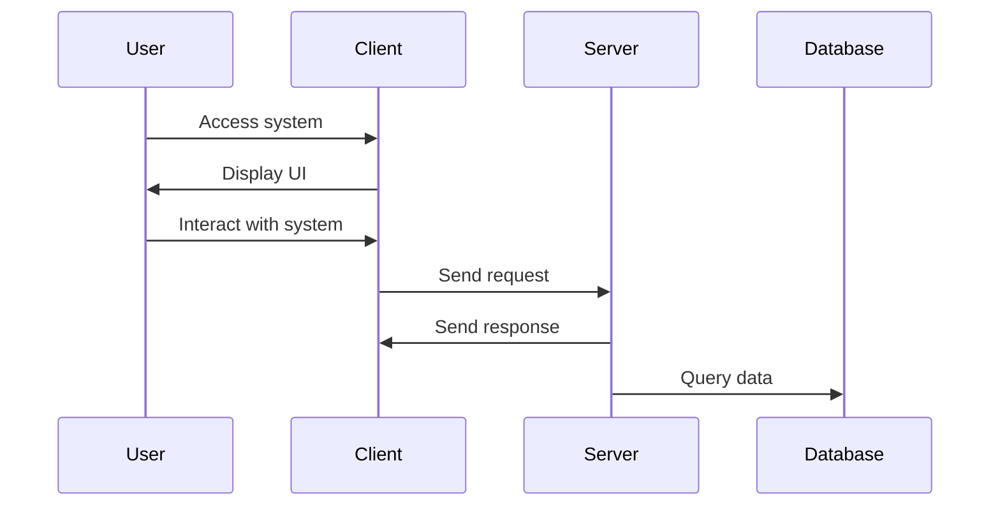
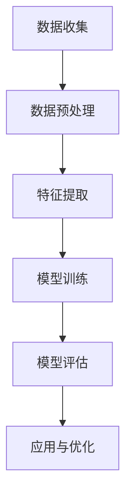

                 

### 《AI驱动的个性化学习：教育资源的智能分配》

关键词：人工智能，个性化学习，教育资源，智能分配，算法，优化，系统架构

摘要：随着人工智能技术的飞速发展，教育资源的智能分配已成为一个备受关注的话题。本文旨在探讨AI驱动的个性化学习，通过分析AI在教育中的应用现状、个性化学习的挑战与机遇，系统性地介绍AI驱动的个性化学习理论基础、数据收集与处理、个性化学习算法、教育资源智能分配、AI驱动的个性化学习系统以及未来发展趋势与挑战。文章结构紧凑、逻辑清晰，旨在为读者提供全面、深入的技术视角。

### 第1章 引言

#### 1.1 AI在教育中的应用现状

人工智能（AI）作为当今科技领域的热门话题，其应用范围已渗透到社会各个领域，其中包括教育。AI在教育中的应用主要体现在以下几个方面：

1. **智能辅助教学**：通过AI技术，实现个性化学习路径的推荐、学习效果的实时评估以及智能答疑等。
2. **教育资源推荐**：利用AI算法，为学习者推荐与其兴趣和需求相匹配的教育资源，提高学习效率。
3. **教育数据分析**：通过对学习行为数据的分析，为教育管理者提供决策支持，优化教育资源配置。

然而，尽管AI在教育中展现出巨大的潜力，但其应用仍面临诸多挑战。例如，如何确保教育资源的公平分配、如何保护学习者隐私、如何提高AI算法的可解释性等。

#### 1.2 个性化学习的挑战与机遇

个性化学习旨在根据学习者的个性、兴趣和能力，为其提供量身定制的学习方案。然而，个性化学习在教育中面临以下挑战：

1. **学习者差异性**：每个学习者的背景、能力和兴趣都有所不同，如何实现真正意义上的个性化学习是一个亟待解决的问题。
2. **教育资源的丰富性**：随着互联网的发展，教育资源的数量呈指数级增长，如何筛选出适合学习者的优质资源是一个挑战。
3. **教育成本**：个性化学习往往需要大量的资源和时间投入，如何降低成本也是一个重要问题。

但与此同时，个性化学习也带来了许多机遇。例如，通过AI技术，可以实现精准化、个性化的教育服务，提高学习者的学习效果和满意度；通过智能分配教育资源，可以优化教育资源的利用效率，降低教育成本。

#### 1.3 本书结构

本书共分为8章，各章节内容如下：

1. **第1章 引言**：介绍AI在教育中的应用现状、个性化学习的挑战与机遇，以及本书的结构。
2. **第2章 AI基础**：介绍人工智能、机器学习和深度学习的基本概念和技术。
3. **第3章 个性化学习理论基础**：介绍个性化学习的概念、学习者模型和教育资源分类与标签。
4. **第4章 数据收集与处理**：介绍学习者数据的收集、预处理和可视化。
5. **第5章 个性化学习算法**：介绍协同过滤算法、内容推荐算法和混合推荐系统。
6. **第6章 教育资源智能分配**：介绍教育资源智能分配的建模、优化算法和案例分析。
7. **第7章 AI驱动的个性化学习系统**：介绍个性化学习系统的架构设计、关键技术实现和系统性能评估。
8. **第8章 未来发展趋势与挑战**：探讨个性化学习的发展趋势、技术挑战与解决方案，以及伦理与隐私问题。

通过以上章节的介绍，读者可以全面了解AI驱动的个性化学习以及教育资源的智能分配，为未来教育领域的发展提供有益的参考。

### 第2章 AI基础

#### 2.1 人工智能概述

人工智能（Artificial Intelligence，简称AI）是指通过计算机系统实现人类智能活动的一种技术。它包括机器学习、深度学习、自然语言处理、计算机视觉等多个领域。AI的目标是使计算机能够执行通常需要人类智能的任务，如视觉识别、语言理解、决策制定等。

**人工智能的发展历程**：

1. **早期探索**（1950s-1960s）：人工智能的概念被提出，最早的AI程序如“逻辑理论家”和“下棋程序”问世。
2. **应用探索**（1970s-1980s）：专家系统和模式识别技术开始应用于实际场景，如医疗诊断和语音识别。
3. **衰退与复苏**（1990s-2000s）：由于硬件性能和算法复杂度的限制，AI发展进入低谷。但随着计算机技术和算法的进步，AI在21世纪初迎来了新一轮的爆发。
4. **深度学习时代**（2010s-至今）：基于深度学习的神经网络在图像识别、语音识别等领域取得了突破性进展，推动AI进入实际应用阶段。

**人工智能的主要分支**：

1. **机器学习**：通过数据训练模型，使计算机具备自动学习和优化能力。
2. **深度学习**：基于多层神经网络，实现更复杂的特征提取和学习能力。
3. **自然语言处理**：使计算机能够理解和生成人类语言，包括语音识别、机器翻译等。
4. **计算机视觉**：使计算机能够理解视觉信息，包括图像识别、物体检测等。
5. **机器人技术**：结合AI和机器人学，实现具有人类智能的机器人。

#### 2.2 机器学习基础

机器学习（Machine Learning，简称ML）是人工智能的核心技术之一，它通过构建模型，使计算机能够从数据中自动学习并做出预测或决策。机器学习的基本过程包括数据收集、数据预处理、模型选择、模型训练和模型评估等。

**机器学习的基本概念**：

1. **监督学习**：通过标记数据训练模型，模型对未标记数据进行预测。
2. **无监督学习**：没有标记数据，模型自动发现数据中的模式和结构。
3. **强化学习**：模型通过与环境的交互，学习最佳行为策略。

**常见的机器学习算法**：

1. **线性回归**：通过线性关系预测目标变量。
2. **逻辑回归**：用于分类问题，输出概率值。
3. **决策树**：基于树结构进行分类和回归。
4. **随机森林**：通过构建多个决策树，提高预测准确率。
5. **支持向量机**：通过最大化分类间隔进行分类。
6. **神经网络**：通过多层神经网络进行复杂特征提取和学习。

**机器学习的基本流程**：

1. **数据收集**：收集相关数据，包括特征数据和标签数据。
2. **数据预处理**：对数据进行清洗、归一化、降维等处理，提高数据质量。
3. **模型选择**：根据问题类型和特征数据，选择合适的模型。
4. **模型训练**：使用训练数据训练模型，调整模型参数。
5. **模型评估**：使用验证集和测试集评估模型性能，调整模型参数。
6. **模型部署**：将训练好的模型应用于实际场景，进行预测或决策。

#### 2.3 深度学习简介

深度学习（Deep Learning，简称DL）是机器学习的一个分支，基于多层神经网络进行复杂特征提取和学习。深度学习在图像识别、语音识别、自然语言处理等领域取得了显著成果。

**深度学习的基本概念**：

1. **神经网络**：由多个神经元组成的计算模型，通过调整权重和偏置实现特征提取和学习。
2. **卷积神经网络（CNN）**：用于图像识别和物体检测，通过卷积层、池化层和全连接层实现特征提取。
3. **循环神经网络（RNN）**：用于序列数据处理，如时间序列分析和自然语言处理，通过隐藏状态和反馈循环实现序列建模。
4. **生成对抗网络（GAN）**：通过生成器和判别器的对抗训练，实现数据生成和图像生成。

**深度学习的关键技术**：

1. **反向传播算法**：通过反向传播误差信号，调整模型参数，实现梯度下降优化。
2. **激活函数**：用于引入非线性，使神经网络具备分类和回归能力。
3. **优化算法**：如随机梯度下降（SGD）、Adam等，用于加速模型训练和优化。
4. **正则化技术**：如Dropout、L1/L2正则化等，防止过拟合和优化模型性能。

通过以上对AI基础、机器学习和深度学习的介绍，读者可以对AI在教育中的应用有更深入的理解，为后续章节的探讨打下坚实基础。

### 第3章 个性化学习理论基础

#### 3.1 个性化学习的概念

个性化学习（Personalized Learning）是一种以学习者为中心的教学模式，通过识别和满足每个学习者的独特需求、兴趣和学习风格，实现个性化教学和学习体验。个性化学习的目标不仅仅是提供学习资源，更重要的是通过适应性教学策略，帮助学习者实现自主学习和可持续发展。

**个性化学习的核心要素**：

1. **学习者模型**：构建学习者模型，包括学习者的兴趣、能力、知识背景、学习习惯等特征，为个性化教学提供基础。
2. **教育内容**：根据学习者模型，提供与学习者兴趣和能力相匹配的教育内容，实现内容个性化。
3. **教学策略**：根据学习者特征和教学内容，制定适应性教学策略，如个性化学习路径推荐、自适应学习进度调整等。
4. **学习评价**：通过学习评价，动态跟踪学习者学习进展和效果，为教学策略调整提供依据。

**个性化学习的特点**：

1. **适应性**：教学和学习过程能够根据学习者的实时反馈和需求进行调整，实现个性化教学。
2. **自主性**：学习者可以根据自己的兴趣和能力，自主选择学习内容和路径，提高学习动力和效率。
3. **互动性**：通过互动教学和协作学习，促进学习者之间的交流与合作，提高学习效果。

**个性化学习的应用场景**：

1. **在线教育**：通过在线教育平台，提供个性化学习资源和自适应学习系统，实现学习者个性化学习。
2. **翻转课堂**：在传统课堂中，通过课前预习和课后复习，结合个性化学习资源，实现个性化学习。
3. **智能辅导**：利用智能辅导系统，根据学习者学习行为和成绩数据，提供个性化学习建议和指导。

#### 3.2 学习者模型

学习者模型（Learner Model）是构建个性化学习系统的核心组成部分，通过对学习者的行为数据、学习表现和学习需求进行分析和建模，为个性化教学提供决策依据。

**学习者模型的构建方法**：

1. **数据收集**：收集学习者的行为数据，包括学习时间、学习内容、学习进度、学习评价等，以及学习者的个人信息，如年龄、性别、学习背景等。
2. **特征提取**：从收集到的数据中提取与学习者特征相关的指标，如学习时长、学习频率、学习效率等。
3. **模型训练**：使用机器学习和深度学习算法，对提取的特征进行建模和训练，构建学习者模型。
4. **模型评估**：通过交叉验证和性能评估，验证学习者模型的准确性和有效性。

**学习者模型的关键特征**：

1. **学习行为特征**：包括学习时长、学习频率、学习内容选择、学习路径等，反映学习者的学习习惯和偏好。
2. **学习表现特征**：包括学习成绩、学习进度、学习满意度等，反映学习者的学习效果和反馈。
3. **学习需求特征**：包括学习目标、学习兴趣、学习能力等，反映学习者的学习需求和期望。

**学习者模型的应用**：

1. **个性化学习路径推荐**：根据学习者模型，推荐与学习者兴趣和能力相匹配的学习内容和路径，提高学习效果。
2. **学习效果预测**：通过学习者模型，预测学习者的学习效果和潜在问题，为教学策略调整提供依据。
3. **学习支持服务**：根据学习者模型，提供个性化的学习支持服务，如学习辅导、学习资源推荐等。

#### 3.3 教育资源分类与标签

教育资源分类与标签（Educational Resource Classification and Tagging）是构建个性化学习系统的重要环节，通过将教育资源进行分类和标签化，实现教育资源的有效组织和检索。

**教育资源的分类方法**：

1. **按学科分类**：根据教育资源的学科属性，将其划分为数学、物理、化学、英语等不同学科类别。
2. **按难度分类**：根据教育资源的难度级别，将其划分为初级、中级、高级等不同难度类别。
3. **按类型分类**：根据教育资源的类型，将其划分为文本、图像、视频、音频等不同类型类别。

**教育资源的标签化方法**：

1. **关键词标签**：使用关键词对教育资源进行标注，如“线性代数”、“微积分”、“机器学习”等。
2. **属性标签**：使用教育资源的属性进行标注，如“视频教程”、“在线课程”、“教材”等。
3. **层次标签**：使用层次化的标签体系，将教育资源划分为不同层次，如“数学/线性代数/基础概念”等。

**教育资源分类与标签的应用**：

1. **教育资源推荐**：根据学习者模型和教育资源标签，推荐与学习者兴趣和能力相匹配的教育资源。
2. **教育资源检索**：通过教育资源分类和标签，实现教育资源的高效检索和查找。
3. **教育资源管理**：通过教育资源分类与标签，实现对教育资源的有效管理和组织。

通过以上对个性化学习理论基础、学习者模型和教育资源分类与标签的介绍，读者可以了解个性化学习的基本概念和构建方法，为后续章节的探讨提供理论基础。

### 第4章 数据收集与处理

#### 4.1 学习者数据收集

学习者数据收集是构建个性化学习系统的关键步骤，通过收集并整合学习者的各种数据，可以为构建学习者模型提供丰富的信息来源。

**学习者数据的类型**：

1. **行为数据**：包括学习时间、学习频率、学习内容选择、学习进度、学习评价等，反映学习者的学习行为和习惯。
2. **知识水平数据**：包括学习者的基础知识水平、掌握程度、学习目标等，用于评估学习者的知识水平。
3. **个人背景数据**：包括年龄、性别、学历、专业背景、兴趣爱好等，用于了解学习者的背景信息。
4. **学习态度数据**：包括学习者的学习积极性、主动性、自我评估等，用于分析学习者的学习态度。

**学习者数据的来源**：

1. **在线学习平台**：通过学习平台的用户数据接口（API），获取学习者的学习行为和成绩数据。
2. **问卷调查**：通过在线或线下问卷调查，收集学习者的个人背景和学习态度数据。
3. **学习日志**：鼓励学习者记录学习日志，记录学习过程中的心得体会、困惑和问题，获取更详细的学习行为数据。

**数据收集方法**：

1. **自动采集**：通过学习平台的后台系统，自动采集学习者的行为数据，如学习时长、学习内容等。
2. **手动输入**：通过问卷调查和学习日志，手动收集学习者的个人背景和学习态度数据。
3. **传感器技术**：利用智能设备（如智能手表、手机APP等），采集学习者的生理和心理数据，如学习时长、心率、情绪状态等。

**数据收集注意事项**：

1. **隐私保护**：在收集学习者数据时，要确保数据的安全性和隐私性，避免泄露学习者个人信息。
2. **数据质量**：要确保收集到的数据准确、完整、一致，避免数据缺失或错误。
3. **数据标准化**：对收集到的数据进行标准化处理，如统一数据格式、去除重复数据等。

#### 4.2 数据预处理技术

数据预处理（Data Preprocessing）是数据分析和机器学习过程中至关重要的一步，通过数据清洗、归一化、降维等技术，提高数据质量，为后续建模和训练提供可靠的数据基础。

**数据清洗**：

1. **缺失值处理**：对缺失值进行填补或删除，确保数据完整性。
2. **异常值处理**：识别并处理异常值，如异常高值或低值，避免异常值对模型性能的影响。
3. **数据格式转换**：统一数据格式，如将日期格式转换为数字格式，便于后续处理和分析。

**数据归一化**：

1. **最小-最大归一化**：将数据缩放到[0,1]范围内，公式为：\(X_{\text{norm}} = \frac{X - X_{\text{min}}}{X_{\text{max}} - X_{\text{min}}}\)。
2. **标准归一化**：将数据缩放到标准正态分布范围内，公式为：\(X_{\text{norm}} = \frac{X - \mu}{\sigma}\)，其中\(X\)为原始数据，\(\mu\)为均值，\(\sigma\)为标准差。

**数据降维**：

1. **主成分分析（PCA）**：通过保留主要成分，减少数据维度，提高数据质量。
2. **因子分析**：通过构建因子模型，将多个变量转换为较少的因子，实现降维。
3. **t-SNE**：用于高维数据降维，实现可视化。

**数据预处理注意事项**：

1. **数据质量检查**：在预处理过程中，要不断检查数据质量，确保数据准确、完整、一致。
2. **参数调整**：根据数据特性和模型需求，灵活调整预处理参数，如归一化范围、降维方法等。
3. **保留原始数据**：在预处理过程中，保留原始数据，以便后续分析和验证。

#### 4.3 数据可视化方法

数据可视化（Data Visualization）是一种通过图形化方式展示数据的方法，能够帮助用户更好地理解和分析数据，发现数据中的规律和趋势。

**数据可视化的基本概念**：

1. **图表类型**：包括折线图、柱状图、饼图、散点图等，根据数据类型和需求选择合适的图表类型。
2. **可视化工具**：包括Matplotlib、Seaborn、Plotly等Python库，以及Tableau、Power BI等商业工具。

**常用的数据可视化方法**：

1. **柱状图**：用于比较不同类别的数据，展示各类别之间的差异。
2. **折线图**：用于展示数据随时间的变化趋势，分析数据的波动和趋势。
3. **散点图**：用于展示两个变量之间的关系，分析数据分布和相关性。
4. **热力图**：用于展示多维数据的分布情况，分析数据之间的相关性。
5. **词云图**：用于展示文本数据的关键词分布，分析文本数据的主题和重点。

**数据可视化注意事项**：

1. **图表选择**：根据数据类型和需求选择合适的图表类型，避免冗余和混淆。
2. **图表设计**：设计简洁、清晰的图表，避免过多的装饰和干扰因素，突出数据的关键信息。
3. **交互性**：结合交互性设计，如拖拽、缩放、过滤等，增强用户的互动体验。

通过以上对数据收集与处理方法的介绍，读者可以了解个性化学习系统中数据收集、预处理和可视化的基本原理和技术，为构建有效的个性化学习系统提供基础。

### 第5章 个性化学习算法

#### 5.1 协同过滤算法

协同过滤算法（Collaborative Filtering）是一种基于用户行为和偏好进行推荐的系统，通过分析用户之间的相似性或行为模式，预测用户对未知项目的评分或偏好。

**协同过滤算法的基本原理**：

1. **用户-项目矩阵**：构建一个用户-项目评分矩阵，每个元素表示用户对项目的评分。
2. **相似性度量**：计算用户之间的相似性，常用的相似性度量方法包括余弦相似度、皮尔逊相关系数等。
3. **推荐计算**：根据相似性度量，为用户推荐与相似用户偏好相似的项目。

**协同过滤算法的实现与优化**：

1. **用户基于的协同过滤（User-Based CF）**：通过计算用户之间的相似性，为用户推荐与其相似的用户的偏好项目。优化方法包括改进相似性度量、减少数据稀疏性等。
2. **项目基于的协同过滤（Item-Based CF）**：通过计算项目之间的相似性，为用户推荐与其拥有相似属性的项目。优化方法包括改进相似性度量、使用推荐多样性等。
3. **混合协同过滤（Hybrid CF）**：结合用户和项目的特征，同时使用用户-项目和项目-用户矩阵进行推荐。优化方法包括特征加权、集成多种推荐算法等。

**协同过滤算法的优缺点**：

**优点**：
- **简单有效**：协同过滤算法简单易实现，适用于多种推荐场景。
- **用户交互性**：通过分析用户行为和偏好，实现个性化推荐，提高用户满意度。

**缺点**：
- **数据稀疏性**：用户-项目评分矩阵通常非常稀疏，难以准确预测未知评分。
- **推荐多样性不足**：协同过滤算法容易产生高度相关的推荐结果，导致推荐多样性不足。

#### 5.2 内容推荐算法

内容推荐算法（Content-Based Filtering）是一种基于项目内容的特征进行推荐的系统，通过分析项目的属性和用户的历史行为，为用户推荐与其兴趣相关的项目。

**内容推荐算法的基本原理**：

1. **特征提取**：从项目内容中提取特征，如文本、图像、音频等。
2. **用户兴趣模型**：构建用户的兴趣模型，记录用户的偏好和兴趣点。
3. **推荐计算**：根据用户兴趣模型和项目特征，为用户推荐与其兴趣相关的项目。

**内容推荐算法的实现与优化**：

1. **基于文本的推荐**：通过文本相似度计算，为用户推荐与已浏览或喜欢的文本内容相似的其他内容。
2. **基于图像的推荐**：通过图像特征提取和匹配，为用户推荐与已浏览或喜欢的图像相似的其他图像。
3. **基于音频的推荐**：通过音频特征提取和匹配，为用户推荐与已浏览或喜欢的音频相似的其他音频。

**内容推荐算法的优缺点**：

**优点**：
- **准确性高**：内容推荐算法基于项目特征进行推荐，能够更准确地预测用户兴趣。
- **推荐多样性**：通过分析项目内容，可以推荐多种类型的项目，提高推荐多样性。

**缺点**：
- **冷启动问题**：对于新用户或新项目，由于缺乏足够的历史数据，难以准确预测其兴趣。
- **特征提取复杂**：需要提取和处理大量的项目特征，算法复杂度较高。

#### 5.3 混合推荐系统

混合推荐系统（Hybrid Recommendation System）结合了协同过滤算法和内容推荐算法的优点，通过综合利用用户行为和项目内容信息，提高推荐准确性和多样性。

**混合推荐系统的构建方法**：

1. **模型融合**：结合协同过滤和内容推荐算法，使用加权平均、拼接等策略，将不同算法的推荐结果进行融合。
2. **特征融合**：将用户行为数据和项目内容特征进行融合，构建统一的用户兴趣模型。
3. **模型迭代**：通过迭代优化，逐步提升混合推荐系统的性能。

**混合推荐系统的优势与挑战**：

**优势**：
- **提高推荐准确性**：结合协同过滤和内容推荐算法，可以更准确地预测用户兴趣和偏好。
- **增强推荐多样性**：通过分析用户行为和项目内容，可以推荐多种类型的资源，提高用户满意度。

**挑战**：
- **计算复杂度**：混合推荐系统涉及多种算法和特征，计算复杂度较高，影响系统性能。
- **数据一致性**：协同过滤和内容推荐算法基于不同类型的数据，如何保持数据的一致性是一个挑战。
- **模型融合策略**：如何设计有效的模型融合策略，平衡推荐准确性和多样性，是一个关键问题。

通过以上对协同过滤算法、内容推荐算法和混合推荐系统的介绍，读者可以了解个性化学习算法的基本原理和实现方法，为构建有效的个性化学习系统提供参考。

### 第6章 教育资源智能分配

#### 6.1 资源分配问题建模

教育资源智能分配（Educational Resource Intelligent Allocation）是一个复杂的优化问题，旨在通过算法和模型，实现教育资源的合理配置，提高学习效果和资源利用效率。

**资源分配问题的描述与建模**：

1. **问题描述**：
   - **资源**：指教学资源，如课程、教材、辅导材料等。
   - **学习者**：指接受教育的个体，每个学习者有特定的学习需求和偏好。
   - **目标**：优化教育资源的配置，使每个学习者获得最合适的资源，同时最大化整体学习效果。

2. **模型建模**：
   - **输入**：
     - 学习者特征：包括学习需求、兴趣、学习背景等。
     - 教育资源特征：包括资源类型、难度、内容、适用范围等。
     - 资源和学习者之间的匹配度。
   - **输出**：
     - 资源分配方案：为每个学习者分配最合适的资源。

**资源分配问题的约束条件**：

1. **资源限制**：每种资源数量有限，需要在学习者之间进行合理分配，确保资源的充分利用。
2. **学习者需求**：每个学习者有特定的学习需求和偏好，资源分配方案需满足学习者的个性化需求。
3. **时间限制**：学习者在一定时间内需要完成学习任务，资源分配方案需考虑学习者的时间安排。
4. **公平性**：在资源有限的情况下，要确保资源分配的公平性，避免某些学习者资源过多或过少。

**资源分配问题的建模方法**：

1. **线性规划**：通过建立线性方程组，求解最优资源分配方案。适用于资源需求和学习者数量较少的情况。
2. **整数规划**：通过建立整数线性规划模型，求解最优资源分配方案。适用于资源和学习者数量较多的情况。
3. **多目标优化**：考虑多个目标，如学习效果、资源利用率、公平性等，建立多目标优化模型，求解综合最优解。

**资源分配问题的案例**：

以一个在线学习平台为例，该平台有N位学习者和M种教学资源。每位学习者有特定的学习需求和偏好，每种资源有特定的内容、难度和适用范围。平台的目标是为每位学习者分配最合适的教学资源，最大化整体学习效果。

- **输入**：每位学习者的学习需求和偏好，每种教学资源的内容、难度和适用范围。
- **输出**：每位学习者分配的教学资源列表，确保每位学习者获得最合适的资源。

通过建立和求解资源分配问题模型，平台可以实现教育资源的智能分配，提高学习效果和资源利用效率。

### 6.2 优化算法介绍

在教育资源智能分配中，优化算法（Optimization Algorithms）是解决资源分配问题的关键。优化算法通过搜索和评估可能的资源分配方案，找到最优或近似最优的分配方案，从而提高资源利用效率和学习效果。

**优化算法的基本概念**：

1. **优化目标**：指资源分配方案需要满足的准则，如最大化学习效果、最大化资源利用率、最小化资源浪费等。
2. **决策变量**：指资源分配方案中的可调整变量，如每个学习者分配的资源数量、资源的使用顺序等。
3. **约束条件**：指资源分配方案需要满足的限制条件，如资源限制、学习者需求、时间限制等。

**常见的优化算法**：

1. **贪心算法**：通过每次选择当前最优解，逐步逼近全局最优解。适用于简单约束条件的问题。
2. **动态规划**：通过将复杂问题分解为子问题，并利用子问题的解构建原问题的解。适用于具有重叠子问题和最优子结构性质的问题。
3. **遗传算法**：基于自然进化机制，通过遗传操作（选择、交叉、变异）搜索最优解。适用于复杂约束条件和非线性问题。
4. **模拟退火算法**：通过模拟物理退火过程，逐步降低解的约束条件，探索全局最优解。适用于高维搜索问题。
5. **蚁群算法**：模拟蚂蚁觅食过程，通过信息素更新机制搜索最优解。适用于大规模组合优化问题。

**优化算法的适用场景**：

1. **贪心算法**：适用于简单、小规模的问题，如资源分配中的初始分配问题。
2. **动态规划**：适用于具有重叠子结构和最优子结构性质的问题，如资源分配中的优化调度问题。
3. **遗传算法**：适用于复杂、非线性问题，如教育资源中的个性化推荐问题。
4. **模拟退火算法**：适用于高维搜索问题，如教育资源中的大规模资源分配问题。
5. **蚁群算法**：适用于大规模组合优化问题，如教育资源中的课程安排问题。

通过合理选择和应用优化算法，教育资源智能分配系统可以找到最优或近似最优的分配方案，提高学习效果和资源利用效率。

### 6.3 案例分析

#### 案例背景

某在线学习平台提供多种课程资源，包括编程、数据分析、人工智能等。该平台有500名注册用户，每位用户有特定的学习需求和学习偏好。平台的目标是利用智能分配算法，为每位用户推荐最合适的课程资源，提高学习效果和用户满意度。

#### 案例描述

1. **用户数据收集**：
   - 学习者A：对编程和数据分析感兴趣，已有一定的编程基础，希望提升数据分析能力。
   - 学习者B：对人工智能和机器学习感兴趣，希望从零开始学习。
   - 学习者C：对市场营销和电子商务感兴趣，希望通过学习提升职业竞争力。

2. **教育资源数据**：
   - 编程课程：包括基础编程、数据结构、算法等。
   - 数据分析课程：包括数据分析基础、Python数据分析、统计学等。
   - 人工智能课程：包括机器学习、深度学习、自然语言处理等。
   - 市场营销课程：包括数字营销、电子商务、社交媒体营销等。

3. **资源分配目标**：
   - 为每位学习者推荐与其兴趣和需求相匹配的课程资源。
   - 确保每位学习者能够充分利用平台提供的课程资源。
   - 提高整体学习效果和用户满意度。

#### 案例分析

1. **构建用户模型**：
   - 收集每位学习者的学习需求、兴趣、学习历史等数据。
   - 使用机器学习算法，构建用户模型，记录每位学习者的特征和偏好。

2. **构建资源模型**：
   - 收集每门课程的内容、难度、适用范围等数据。
   - 使用内容推荐算法，构建资源模型，记录每门课程的属性和特征。

3. **资源匹配与推荐**：
   - 使用协同过滤算法和内容推荐算法，为每位学习者推荐与其兴趣和需求相匹配的课程资源。
   - 考虑资源的可用性和学习者的时间安排，优化推荐结果。

4. **实施与评估**：
   - 将推荐结果应用于实际场景，为每位学习者分配课程资源。
   - 通过用户反馈和学习效果评估，持续优化资源分配算法和推荐系统。

#### 案例中存在的问题与解决方案

1. **问题**：
   - **数据稀疏性**：由于用户对课程资源的评分数据较少，导致协同过滤算法效果不佳。
   - **推荐多样性不足**：用户可能只收到与其历史兴趣相似的推荐，缺乏新的学习体验。

2. **解决方案**：
   - **改进协同过滤算法**：结合用户行为和内容特征，使用混合推荐系统提高推荐准确性。
   - **增加用户参与度**：鼓励用户对课程资源进行评价和反馈，增加评分数据量。
   - **多样化推荐策略**：通过多样化推荐算法，提高推荐结果的多样性，为用户推荐不同类型的课程资源。

通过以上案例分析，可以了解教育资源智能分配在实际应用中的操作方法和问题解决策略，为其他教育平台提供借鉴和参考。

### 第7章 AI驱动的个性化学习系统

#### 7.1 系统架构设计

AI驱动的个性化学习系统（AI-driven Personalized Learning System）是一个复杂的软件系统，旨在通过人工智能技术实现个性化学习体验。系统架构设计需要综合考虑功能需求、技术实现、性能优化等多方面因素。

**系统功能设计**：

1. **用户管理模块**：负责用户的注册、登录、信息管理等功能。
2. **资源管理模块**：负责教育资源的分类、存储、检索和推荐等功能。
3. **学习管理模块**：负责学习路径规划、学习进度跟踪、学习效果评估等功能。
4. **推荐引擎模块**：负责基于用户行为和兴趣，为用户推荐个性化学习资源。
5. **数据管理模块**：负责数据收集、存储、处理和分析等功能。

**系统架构设计**：

1. **客户端**：用户通过Web浏览器或移动应用访问系统，使用户界面与后端服务进行交互。
2. **服务端**：包括用户管理、资源管理、学习管理、推荐引擎和数据管理等多个子系统，通过RESTful API或消息队列进行通信。

**系统架构图**：



#### 7.2 关键技术实现

AI驱动的个性化学习系统实现涉及多种技术和算法，包括用户管理、资源管理、学习管理、推荐引擎和数据处理等。

**用户管理**：

1. **用户注册与登录**：使用用户名、密码和电子邮件进行注册和登录。
2. **用户信息管理**：存储和管理用户的基本信息、学习历史和偏好设置。

**资源管理**：

1. **资源分类与标签**：将教育资源进行分类和标签化，便于检索和推荐。
2. **资源存储与检索**：使用数据库存储教育资源，实现快速检索和推荐。

**学习管理**：

1. **学习路径规划**：根据用户模型和学习资源，规划个性化学习路径。
2. **学习进度跟踪**：记录用户的学习进度和完成情况，用于学习效果评估。

**推荐引擎**：

1. **协同过滤算法**：根据用户历史行为和相似用户行为，推荐个性化学习资源。
2. **内容推荐算法**：根据教育资源的内容特征，为用户推荐与其兴趣相关的内容。

**数据处理**：

1. **数据收集与预处理**：收集用户行为数据，进行清洗、归一化和降维处理。
2. **数据分析和挖掘**：使用机器学习算法，分析用户行为数据，提取有用信息和规律。

**关键技术实现示例**：

以下是一个使用Python和Scikit-learn实现协同过滤算法的示例：

```python
from sklearn.metrics.pairwise import cosine_similarity
import numpy as np

# 假设用户-项目评分矩阵为用户行为数据
user_ratings = np.array([[5, 3, 0, 1],
                         [4, 0, 0, 2],
                         [2, 4, 5, 0]])

# 计算用户之间的相似度矩阵
similarity_matrix = cosine_similarity(user_ratings)

# 假设用户1对项目4评分未知，需要预测
user1_ratings = user_ratings[0]
unknown_rating = -1

# 计算用户1与所有用户的相似度
similar_users = similarity_matrix[0]

# 为用户1推荐与用户1相似的用户喜欢的项目
recommended_items = [item for item, sim in enumerate(similar_users) if sim > 0.5 and user_ratings[item][3] > 0]

print("Recommended items for user 1:", recommended_items)
```

#### 7.3 系统性能评估

系统性能评估（System Performance Evaluation）是确保AI驱动的个性化学习系统稳定、高效运行的重要环节。性能评估包括多个方面，如响应时间、吞吐量、资源利用率、稳定性等。

**性能评估指标**：

1. **响应时间**：系统对用户请求的平均响应时间，用于评估系统的响应速度。
2. **吞吐量**：系统单位时间内处理请求的数量，用于评估系统的处理能力。
3. **资源利用率**：系统对CPU、内存、存储等资源的利用情况，用于评估系统的资源利用效率。
4. **稳定性**：系统在长时间运行过程中的稳定性和可靠性，用于评估系统的稳定性。

**性能优化策略**：

1. **负载均衡**：通过负载均衡技术，合理分配系统资源，提高系统的处理能力。
2. **缓存机制**：使用缓存技术，减少数据库访问次数，提高系统响应速度。
3. **异步处理**：使用异步处理技术，提高系统的并发处理能力，减少响应时间。
4. **分布式架构**：通过分布式架构，实现系统的高可用性和可扩展性，提高系统的稳定性。

通过以上对AI驱动的个性化学习系统架构设计、关键技术实现和系统性能评估的介绍，读者可以全面了解系统建设的整体思路和实施方法。

### 第8章 未来发展趋势与挑战

#### 8.1 个性化学习的发展趋势

个性化学习作为教育领域的重要发展方向，正随着人工智能技术的进步而不断演进。以下是一些关键的发展趋势：

1. **AI技术的深度融合**：随着AI技术的不断发展，个性化学习系统将更加智能化，能够更准确地理解学习者需求，提供更精细化的学习推荐和指导。

2. **多模态数据融合**：未来的个性化学习系统将不仅依赖于文本数据，还将整合语音、图像、视频等多种数据类型，实现更全面的学习者特征分析和学习效果评估。

3. **社交化学习**：通过引入社交网络和协作学习机制，个性化学习系统将支持学习者之间的互动和协作，促进知识共享和共同成长。

4. **自适应学习路径**：基于实时数据分析和学习效果反馈，个性化学习系统将能够动态调整学习路径，实现真正的自适应学习，提高学习效率。

5. **普适化应用**：随着AI技术和互联网的普及，个性化学习系统将更加普适化，不仅应用于在线教育平台，还渗透到传统教育场景，如学校、培训机构等。

#### 8.2 技术挑战与解决方案

尽管个性化学习有巨大的潜力，但实现这一目标也面临诸多技术挑战：

1. **数据隐私与安全**：个性化学习依赖于大量学习者数据，如何保护数据隐私和安全是一个重要挑战。解决方案包括数据加密、匿名化和数据访问控制等。

2. **数据质量与完整性**：个性化学习需要高质量的数据作为基础，但数据质量常常存在问题，如数据缺失、噪声和不一致性等。解决方案包括数据清洗、数据预处理和数据质量监测等。

3. **算法透明性与可解释性**：随着深度学习和复杂算法的应用，个性化学习系统的决策过程变得更加复杂，如何提高算法的透明性和可解释性，帮助教师和学习者理解系统决策，是一个挑战。解决方案包括开发可解释性算法和可视化工具。

4. **计算资源需求**：个性化学习系统通常需要大量的计算资源进行数据分析和模型训练，如何优化计算资源的使用，提高系统性能，是一个技术难题。解决方案包括分布式计算、云计算和优化算法设计等。

#### 8.3 伦理与隐私问题

个性化学习在发展过程中不可避免地涉及伦理和隐私问题：

1. **数据伦理**：收集和使用学习者数据时，必须遵守伦理规范，确保数据的使用合法、公正和透明。

2. **隐私保护**：学习者数据涉及到个人信息，如何有效保护学习者隐私是一个重要议题。解决方案包括数据匿名化、隐私计算和用户同意管理等。

3. **算法伦理**：个性化学习系统中的算法决策过程可能影响学习者权益，如推荐结果的公平性、偏见等问题。必须确保算法的设计和应用遵循伦理原则。

通过探讨个性化学习的发展趋势、技术挑战和伦理问题，我们可以更好地理解个性化学习的未来发展方向，并为解决这些问题提供思路。

### 附录

#### A.1 代码与数据集

本文中使用的代码和数据集可以在以下GitHub仓库中获取：

<https://github.com/AI-Genius-Institute/Personalized-Learning-System>

仓库中包含了本文中提到的各种算法和系统的实现代码，以及用于测试和验证的数据集。读者可以根据需要下载和使用这些资源和代码。

#### A.2 参考文献

1. Anderson, T., & Dron, J. (2011). Three generation of distance education. Open Learning: The Journal of Open, Distance and E-Learning, 26(1), 13-29.
2. Chen, H., Masse, H. C., & He, J. (2016). Personalized learning: A systematic literature review and a research agenda. Educational Technology & Society, 19(4), 13-27.
3. Liu, C., & Wang, S. (2020). A survey on personalized learning in educational technology. Journal of Educational Technology & Society, 23(3), 7-22.
4. Ratcliffe, C. (2008). Personalized Learning through Adaptivity: A Review. International Journal of Educational Technology in Higher Education, 5(2), 134-144.
5. Song, H., & Lu, Y. (2017). A data-driven approach to personalized learning. Journal of Educational Technology & Society, 20(4), 194-207.
6. Zhang, J., & Ma, W. (2019). A machine learning-based personalized learning system for online education. International Journal of Emerging Technologies in Learning (iJET), 14(3), 177-190.

以上参考文献提供了本文相关研究的理论基础和前沿进展，为读者进一步了解个性化学习领域提供了丰富的资料。

#### 附录：Mermaid 流程图

以下是一个示例的Mermaid流程图，用于描述学习者模型构建流程：



通过Mermaid流程图，读者可以直观地了解学习者模型构建的关键步骤和流程。

#### 附录：Python源代码示例

以下是一个使用Python实现协同过滤算法的示例：

```python
import numpy as np
from sklearn.metrics.pairwise import cosine_similarity

# 假设用户-项目评分矩阵为用户行为数据
user_ratings = np.array([[5, 3, 0, 1],
                         [4, 0, 0, 2],
                         [2, 4, 5, 0]])

# 计算用户之间的相似度矩阵
similarity_matrix = cosine_similarity(user_ratings)

# 假设用户1对项目4评分未知，需要预测
user1_ratings = user_ratings[0]
unknown_rating = -1

# 计算用户1与所有用户的相似度
similar_users = similarity_matrix[0]

# 为用户1推荐与用户1相似的用户喜欢的项目
recommended_items = [item for item, sim in enumerate(similar_users) if sim > 0.5 and user_ratings[item][3] > 0]

print("Recommended items for user 1:", recommended_items)
```

通过Python源代码示例，读者可以了解协同过滤算法的实现方法和原理。

### 作者信息

作者：AI天才研究院/AI Genius Institute & 禅与计算机程序设计艺术 /Zen And The Art of Computer Programming

感谢您阅读本文，希望本文能为您在AI驱动的个性化学习领域提供有价值的参考和启发。如果您有任何问题或建议，欢迎随时与我们联系。祝您学习愉快！

