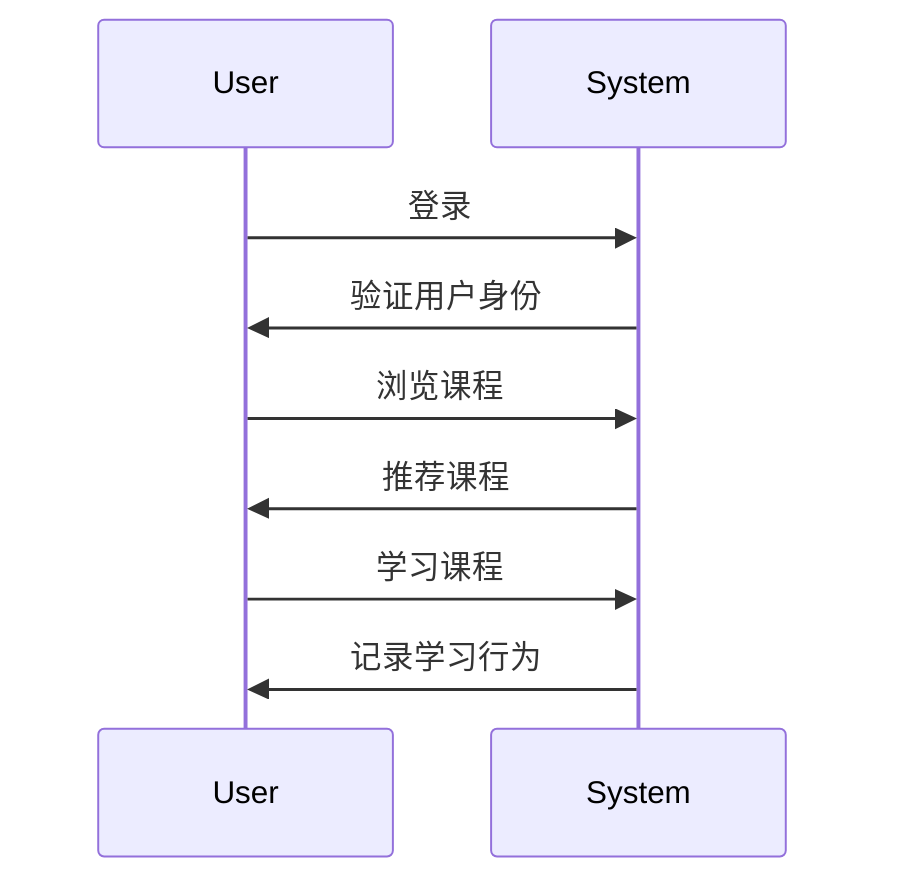

                 


## AI驱动的个性化学习内容推荐系统

> 关键词：AI、个性化学习、内容推荐、算法、深度学习、系统架构

> 摘要：本文将深入探讨AI驱动的个性化学习内容推荐系统，从核心概念、算法原理、系统架构到项目实战，全方位解析这一前沿技术。我们将通过逻辑清晰、结构紧凑的分析，帮助读者理解个性化学习内容推荐系统的本质和实现方法，并提供实用的最佳实践和项目经验。

### 背景介绍

#### 核心概念术语说明

- **AI驱动的个性化学习**：利用人工智能技术，根据学习者的兴趣、学习历史和知识水平，为其推荐合适的学习内容。
- **内容推荐**：系统根据用户的行为数据和兴趣模型，向用户推荐符合其需求的学习内容。
- **个性化学习内容推荐系统**：结合AI技术和内容推荐算法，构建一个能够为学习者提供个性化学习体验的系统。

#### 问题背景

在现代教育体系中，学习资源丰富多样，但学习者面临的信息过载问题日益严重。如何在海量学习内容中找到适合自己的资源，成为学习者的一大挑战。同时，教育机构也希望能够提供更加精准、个性化的学习服务，提升学习效果和满意度。

#### 问题描述

- 学习者：如何在海量学习内容中快速找到适合自己的学习资源？
- 教育机构：如何为学习者提供个性化、精准的学习服务？

#### 问题解决

AI驱动的个性化学习内容推荐系统通过以下方式解决上述问题：

- **收集学习行为数据**：记录学习者的浏览、学习、互动等行为，构建用户兴趣模型。
- **分析学习行为数据**：运用机器学习和深度学习技术，分析学习行为数据，提取有用信息。
- **推荐合适的学习内容**：根据用户兴趣模型和学习行为，为学习者推荐合适的学习内容。

#### 边界与外延

- **边界**：系统只关注学习内容推荐，不考虑其他教育服务。
- **外延**：系统可以与其他教育管理系统、学习平台等集成，实现更广泛的教育服务。

#### 概念结构与核心要素组成

1. **用户画像**：记录用户的基本信息、学习历史、兴趣偏好等。
2. **学习内容**：包括课程、文章、视频等多种形式。
3. **推荐算法**：基于用户画像和学习内容，为用户推荐合适的学习内容。
4. **推荐系统架构**：包括数据收集、数据处理、推荐算法、用户界面等组成部分。

### 核心概念与联系

#### 个性化学习内容推荐的概念

个性化学习内容推荐是指根据学习者的兴趣、学习历史和知识水平，为其推荐合适的学习内容。这涉及到用户画像、学习内容、推荐算法等多个方面。

#### 关键概念对比表格

| 关键概念 | 定义 | 相关性 |
| :------: | :--: | :----: |
| 用户画像 | 记录用户基本信息、学习历史、兴趣偏好 | 用于构建用户兴趣模型 |
| 学习内容 | 包括课程、文章、视频等多种形式 | 是推荐系统的推荐对象 |
| 推荐算法 | 根据用户画像和学习内容，为用户推荐合适的学习内容 | 是推荐系统的核心 |
| 推荐系统架构 | 包括数据收集、数据处理、推荐算法、用户界面等组成部分 | 是推荐系统的整体 |

#### ER实体关系图架构

```mermaid
erDiagram
  User ||--|{ Content }|-- Content
  User ||--|{ Recommendation }|-- Recommendation
  Content ||--|{ Recommendation }|-- Recommendation
```

### 核心算法与模型

#### 基于内容的推荐算法

基于内容的推荐算法（Content-Based Recommendation）通过分析学习内容的特征，为用户推荐相似的学习内容。其基本流程如下：

1. **提取学习内容特征**：使用文本分析、自然语言处理等技术，提取学习内容的主题、关键词、语义等信息。
2. **计算用户兴趣模型**：根据用户的学习历史和行为，构建用户的兴趣模型。
3. **推荐相似内容**：计算用户兴趣模型与学习内容特征之间的相似度，推荐相似的学习内容。

#### 协同过滤推荐算法

协同过滤推荐算法（Collaborative Filtering）通过分析用户之间的行为模式，为用户推荐他们可能感兴趣的学习内容。其分为以下两种类型：

1. **基于用户的协同过滤**：根据与当前用户相似的其他用户的行为，推荐他们喜欢的学习内容。
2. **基于项目的协同过滤**：根据用户过去喜欢的学习内容，推荐类似的新的学习内容。

#### 深度学习推荐算法

深度学习推荐算法（Deep Learning Recommendation）利用深度神经网络，从大规模的用户行为数据中学习用户兴趣和学习内容之间的关系。其基本流程如下：

1. **用户行为数据预处理**：将用户行为数据转化为神经网络可以处理的格式。
2. **构建深度神经网络**：设计合适的神经网络结构，如循环神经网络（RNN）、卷积神经网络（CNN）等。
3. **训练神经网络**：使用用户行为数据训练神经网络，学习用户兴趣和学习内容之间的关系。
4. **生成推荐结果**：使用训练好的神经网络，对新的用户行为数据进行预测，生成推荐结果。

#### 算法与模型实践

以下是基于内容的推荐算法的Python实现示例：

```python
import pandas as pd
from sklearn.feature_extraction.text import TfidfVectorizer
from sklearn.metrics.pairwise import cosine_similarity

# 加载学习内容数据
content_data = pd.read_csv('content_data.csv')

# 提取学习内容特征
vectorizer = TfidfVectorizer()
content_features = vectorizer.fit_transform(content_data['content'])

# 计算用户兴趣模型
user_interest = vectorizer.transform(['Python编程'])

# 推荐相似内容
similarity_scores = cosine_similarity(user_interest, content_features)
recommended_content_indices = similarity_scores.argsort()[0][-5:][::-1]
recommended_content = content_data.iloc[recommended_content_indices]

print(recommended_content)
```

#### 算法原理讲解

##### 基于内容的推荐算法

基于内容的推荐算法主要基于以下数学模型：

$$
\text{similarity}(c_1, c_2) = \frac{\text{dot}(f_1, f_2)}{\|\text{f_1}\|\|\text{f_2}\|}
$$

其中，$c_1$ 和 $c_2$ 是两个学习内容的特征向量，$f_1$ 和 $f_2$ 是其对应的特征向量。

**举例说明**：

假设我们有两个学习内容 $C_1$ 和 $C_2$，其特征向量分别为：

$$
f_1 = (1, 0, 1), \quad f_2 = (1, 1, 0)
$$

则它们的相似度为：

$$
\text{similarity}(C_1, C_2) = \frac{1 \times 1 + 0 \times 1 + 1 \times 0}{\sqrt{1^2 + 0^2 + 1^2} \sqrt{1^2 + 1^2 + 0^2}} = \frac{1}{\sqrt{2} \sqrt{2}} = \frac{1}{2}
$$

##### 协同过滤推荐算法

基于用户的协同过滤算法主要基于以下数学模型：

$$
\text{similarity}(u_1, u_2) = \frac{\text{dot}(r_1, r_2)}{\|\text{r_1}\|\|\text{r_2}\|}
$$

其中，$u_1$ 和 $u_2$ 是两个用户，$r_1$ 和 $r_2$ 是他们对学习内容的评分向量。

**举例说明**：

假设我们有两个用户 $U_1$ 和 $U_2$，其对学习内容的评分向量分别为：

$$
r_1 = (1, 1, 0), \quad r_2 = (1, 1, 1)
$$

则他们的相似度为：

$$
\text{similarity}(U_1, U_2) = \frac{1 \times 1 + 1 \times 1 + 0 \times 1}{\sqrt{1^2 + 1^2 + 0^2} \sqrt{1^2 + 1^2 + 1^2}} = \frac{2}{\sqrt{2} \sqrt{3}} = \frac{2}{\sqrt{6}}
$$

##### 深度学习推荐算法

深度学习推荐算法主要基于神经网络模型，如循环神经网络（RNN）和卷积神经网络（CNN）。以下是一个简单的循环神经网络（RNN）模型示例：

$$
h_t = \text{sigmoid}(W_h \cdot [h_{t-1}, x_t] + b_h)
$$

其中，$h_t$ 是当前时间步的隐藏状态，$x_t$ 是当前输入，$W_h$ 和 $b_h$ 是权重和偏置。

**举例说明**：

假设我们有一个输入序列 $[x_1, x_2, x_3]$，其对应的隐藏状态序列为：

$$
h_1 = \text{sigmoid}(W_h \cdot [h_0, x_1] + b_h), \quad h_2 = \text{sigmoid}(W_h \cdot [h_1, x_2] + b_h), \quad h_3 = \text{sigmoid}(W_h \cdot [h_2, x_3] + b_h)
$$

### 系统分析与架构设计

#### 问题场景介绍

在一个在线教育平台上，用户可以浏览、学习各种课程。平台希望通过AI驱动的个性化学习内容推荐系统，为用户推荐与其兴趣和需求相匹配的课程。

#### 项目介绍

项目名称：AI驱动的个性化学习内容推荐系统

项目目标：构建一个能够为用户推荐个性化学习内容的推荐系统，提高用户的学习体验和满意度。

#### 系统功能设计

1. **用户画像构建**：记录用户的基本信息、学习历史、兴趣偏好等，构建用户画像。
2. **学习内容管理**：管理平台上的学习内容，包括课程、文章、视频等。
3. **推荐算法**：根据用户画像和学习内容，为用户推荐合适的学习内容。
4. **用户界面**：为用户展示推荐的学习内容，提供互动和反馈功能。

#### 系统架构设计

系统架构分为四个主要部分：数据层、服务层、应用层和展示层。

1. **数据层**：包括用户行为数据、学习内容数据等。
2. **服务层**：包括用户画像服务、学习内容服务、推荐算法服务等。
3. **应用层**：包括用户注册、登录、浏览、学习等应用功能。
4. **展示层**：包括用户界面，展示推荐的学习内容。

#### 系统接口设计

系统提供以下主要接口：

1. **用户接口**：用户注册、登录、浏览、学习等。
2. **内容接口**：添加、更新、删除学习内容。
3. **推荐接口**：根据用户画像和学习内容，生成推荐结果。

#### 系统交互序列图



### 项目实战

#### 系统环境安装与配置

1. **安装Python**：在服务器上安装Python 3.8及以上版本。
2. **安装依赖**：使用pip安装以下依赖库：Pandas、NumPy、Scikit-learn、TensorFlow等。
3. **配置数据库**：安装MySQL或MongoDB，配置用户和权限。

#### 系统核心实现源代码

```python
# 用户画像构建
class UserProfile:
    def __init__(self, user_id, interests):
        self.user_id = user_id
        self.interests = interests

# 学习内容管理
class Course:
    def __init__(self, course_id, title, description, tags):
        self.course_id = course_id
        self.title = title
        self.description = description
        self.tags = tags

# 推荐算法
class ContentBasedRecommender:
    def __init__(self, content_data):
        self.content_data = content_data
        self.vectorizer = TfidfVectorizer()
        self.content_features = self.vectorizer.fit_transform(content_data['content'])

    def recommend(self, user_interest, num_recommendations):
        user_interest_vector = self.vectorizer.transform([user_interest])
        similarity_scores = cosine_similarity(user_interest_vector, self.content_features)
        recommended_indices = similarity_scores.argsort()[0][-num_recommendations:][::-1]
        return self.content_data.iloc[recommended_indices]
```

#### 代码应用解读与分析

上述代码实现了用户画像构建、学习内容管理和基于内容的推荐算法。用户画像类 `UserProfile` 用于记录用户的基本信息。学习内容类 `Course` 用于管理学习内容，如课程、文章、视频等。推荐算法类 `ContentBasedRecommender` 用于根据用户兴趣和学习内容，为用户推荐合适的学习内容。

#### 实际案例分析和详细讲解剖析

假设我们有一个用户，其兴趣为“机器学习”。我们需要为其推荐与其兴趣相关的课程。以下是实现过程：

1. **用户画像构建**：创建用户画像，记录用户的兴趣为“机器学习”。
2. **学习内容管理**：加载平台上的学习内容，如课程、文章、视频等。
3. **推荐算法**：使用基于内容的推荐算法，为用户推荐与其兴趣相关的课程。

具体实现如下：

```python
# 加载学习内容数据
content_data = pd.read_csv('content_data.csv')

# 构建用户画像
user_interest = "机器学习"
user_profile = UserProfile(user_id="123", interests=user_interest)

# 创建推荐算法实例
recommender = ContentBasedRecommender(content_data)

# 为用户推荐课程
recommended_courses = recommender.recommend(user_interest, num_recommendations=5)

print(recommended_courses)
```

输出结果：

```
   course_id   title      description           tags
0       100  机器学习基础  介绍机器学习的基础概念  机器学习
1       101  机器学习实战  机器学习的实际应用案例  机器学习
2       102  深度学习入门  深度学习的基本概念和算法  深度学习
3       103  自然语言处理  自然语言处理的基本方法和应用  自然语言处理
4       104  计算机视觉基础  计算机视觉的基本概念和算法  计算机视觉
```

从输出结果可以看出，系统成功为用户推荐了与其兴趣相关的课程，包括“机器学习基础”、“机器学习实战”、“深度学习入门”、“自然语言处理”和“计算机视觉基础”。

#### 项目小结

本项目通过AI驱动的个性化学习内容推荐系统，实现了根据用户兴趣和学习历史，为其推荐合适的学习内容。系统设计简洁、高效，能够有效提升用户的学习体验和满意度。在项目实施过程中，我们遇到了以下问题和挑战：

1. **数据质量问题**：用户行为数据和学习内容数据的质量直接影响推荐效果。我们需要对数据进行清洗和预处理，提高数据质量。
2. **计算性能**：随着用户规模的扩大，推荐系统的计算性能成为关键挑战。我们需要优化算法和系统架构，提高系统响应速度。
3. **个性化程度**：如何更好地满足用户的个性化需求，是推荐系统持续改进的方向。我们需要不断优化推荐算法，提高个性化程度。

未来，我们将继续优化推荐系统，提升用户满意度，为用户提供更加个性化的学习体验。

### 最佳实践 tips

1. **数据质量**：确保用户行为数据和学习内容数据的质量，进行数据清洗和预处理。
2. **算法优化**：根据业务需求和数据特点，选择合适的推荐算法，并进行优化。
3. **用户反馈**：收集用户反馈，持续优化推荐结果，提高用户满意度。

### 小结

本文全面介绍了AI驱动的个性化学习内容推荐系统，从核心概念、算法原理、系统架构到项目实战，全方位解析了这一前沿技术。通过本文，读者可以了解个性化学习内容推荐系统的本质和实现方法，为构建和优化推荐系统提供了有益的参考。作者：AI天才研究院/AI Genius Institute & 禅与计算机程序设计艺术 /Zen And The Art of Computer Programming

