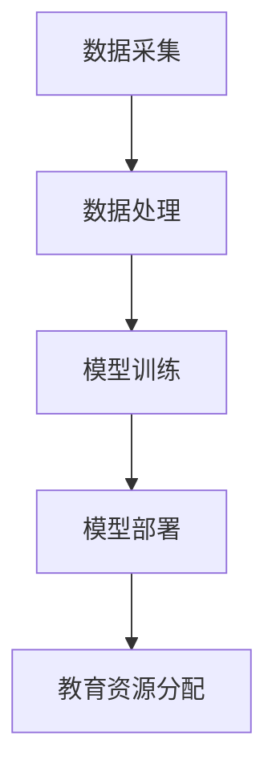

                 

### 《AI驱动的个性化学习平台：教育资源的智能分配》

#### 关键词：AI、个性化学习、教育资源、智能分配、学习平台、机器学习、深度学习

> 摘要：本文深入探讨了AI驱动的个性化学习平台在教育资源的智能分配中的应用。通过分析个性化学习的定义和核心价值，本文详细介绍了AI驱动的个性化学习平台的基础，包括AI基础理论和平台架构。接着，文章阐述了教育资源分配的基本原则与策略，并介绍了常见的AI驱动的教育资源分配算法。通过实际案例的实践分析，本文展示了AI在教育资源配置中的实际应用效果，并探讨了其中的挑战和未来趋势。

### 目录

1. 引言与概述
    1.1 个性化学习的概念与价值
    1.2 AI驱动的个性化学习平台基础
2. 教育资源的智能分配
    2.1 教育资源分配的基本原则与策略
    2.2 AI驱动的教育资源分配算法
    2.3 教育资源的智能分配实践
3. 教育资源的智能分配挑战与未来趋势
4. 总结与展望
5. 附录：相关资源与工具

### 第一部分：引言与概述

#### 第1章：个性化学习的概念与价值

个性化学习是一种以学习者为中心的教学方法，旨在根据每个学生的兴趣、能力和学习风格提供个性化的学习路径。随着教育信息化的推进，个性化学习已成为教育领域的重要研究方向。

##### 1.1 个性化学习的定义

个性化学习（Personalized Learning）是指通过数据分析和算法，根据学生的个人特点，如学习能力、学习风格、兴趣爱好等，提供定制化的学习内容和路径。

##### 1.2 个性化学习的核心价值

个性化学习具有以下核心价值：

1. 提高学习效率：根据学生的个性化需求提供适合的学习内容，有助于学生快速掌握知识。
2. 促进学生全面发展：个性化学习注重学生的全面发展，包括知识技能、情感态度、价值观等。
3. 激发学习兴趣：个性化学习能更好地满足学生的个性化需求，提高学习兴趣和动力。
4. 减轻教师负担：通过智能分配教育资源，减轻教师的备课和批改作业等负担。

##### 1.3 AI在个性化学习中的应用前景

随着人工智能技术的发展，AI在个性化学习中的应用前景十分广阔。未来，AI将更好地辅助教师进行教学，帮助学生进行学习，实现真正的个性化教育。

### 第2章：AI驱动的个性化学习平台基础

#### 2.1 AI基础理论

##### 2.1.1 机器学习概述

机器学习（Machine Learning）是一种让计算机通过数据学习并做出决策或预测的技术。主要方法包括监督学习、无监督学习和强化学习。

##### 2.1.2 深度学习原理

深度学习（Deep Learning）是机器学习的一个分支，通过多层神经网络模拟人脑进行学习。深度学习在图像识别、自然语言处理等领域取得了显著的成果。

##### 2.1.3 自然语言处理基础

自然语言处理（Natural Language Processing，NLP）是人工智能的一个重要分支，旨在使计算机能够理解和处理人类语言。NLP技术包括分词、词性标注、语义分析等。

#### 2.2 个性化学习平台架构

##### 2.2.1 平台整体设计

AI驱动的个性化学习平台通常包括数据采集、数据处理、模型训练、模型部署等模块。

##### 2.2.2 数据流与处理流程

数据流包括学生数据、教师数据、课程数据等。数据处理流程包括数据清洗、数据集成、数据挖掘等。

### 第二部分：教育资源的智能分配

#### 第3章：教育资源分配的基本原则与策略

##### 3.1 教育资源概述

教育资源包括教学资源（如课程、教材、课件等）和学生的学习活动资源（如作业、考试、讨论等）。

##### 3.2 智能分配原则

智能分配原则包括：

1. 公平性：确保教育资源公平分配，不偏袒任何学生。
2. 适应性：根据学生的个性化需求调整教育资源。
3. 可扩展性：平台应能适应不同规模的教育需求。

##### 3.3 智能分配策略

智能分配策略包括：

1. 优先级排序：根据学生的个性化需求设置教育资源的优先级。
2. 动态调整机制：根据学生的学习进度和效果动态调整教育资源。

### 第4章：AI驱动的教育资源分配算法

##### 4.1 算法概述

AI驱动的教育资源分配算法包括：

1. 基于机器学习的教育资源分配
2. 基于深度学习的教育资源分配
3. 基于强化学习的教育资源分配

##### 4.2 常见算法介绍

常见算法包括：

1. 推荐系统算法：基于用户历史行为、兴趣等推荐合适的教育资源。
2. 聚类算法：将学生分为不同的群体，根据群体特征分配教育资源。
3. 强化学习算法：通过不断试错和优化，找到最优的教育资源分配策略。

### 第5章：教育资源的智能分配实践

##### 5.1 实践案例介绍

本章节将介绍两个教育资源的智能分配实践案例：

1. 个性化学习路径规划
2. 动态学习资源推荐系统

##### 5.2 实践分析

通过对实践案例的分析，本文将探讨AI驱动的教育资源智能分配在实际应用中的效果和挑战。

### 第6章：教育资源的智能分配挑战与未来趋势

##### 6.1 挑战分析

教育资源智能分配面临的挑战包括：

1. 技术挑战：如何提高算法的准确性和效率。
2. 数据隐私问题：如何保护学生和教师的隐私。
3. 伦理与法律问题：如何确保教育资源分配的公平性和合法性。

##### 6.2 未来趋势

未来，教育资源智能分配将朝着以下方向发展：

1. 技术发展趋势：深度学习、强化学习等新技术的应用。
2. 教育资源分配模式的创新：如区块链技术的应用、跨平台教育资源共享等。

### 第7章：总结与展望

##### 7.1 个性化学习与教育资源智能分配的重要性

个性化学习与教育资源智能分配对提高教育质量具有重要意义。未来，AI将在教育领域发挥更大的作用。

##### 7.2 当前研究与应用现状

当前，AI驱动的个性化学习平台已在多个领域得到应用，但仍有很大发展空间。

##### 7.3 未来发展方向与前景

未来，教育资源智能分配将朝着更高效、更公平、更个性化的方向发展。

### 附录：相关资源与工具

##### 8.1 开源资源推荐

本文推荐了一些开源资源，包括机器学习框架、自然语言处理工具等。

##### 8.2 AI工具使用指南

本文提供了AI工具的使用指南，帮助读者更好地应用AI技术。

##### 8.3 学习资源推荐

本文推荐了一些优质的学习资源，包括教材、论文、在线课程等，供读者深入学习。

### Mermaid 流程图



### 代码示例与解释

```python
# 代码示例：教育资源推荐系统
import pandas as pd
from sklearn.feature_extraction.text import TfidfVectorizer
from sklearn.metrics.pairwise import cosine_similarity

# 数据预处理
courses = pd.read_csv('courses.csv')
tfidf = TfidfVectorizer(stop_words='english')
tfidf_matrix = tfidf.fit_transform(courses['description'])

# 计算相似度
cosine_sim = cosine_similarity(tfidf_matrix, tfidf_matrix)

# 推荐课程
def recommend_course(course_name):
    index = courses[courses['name'] == course_name].index[0]
    sim_scores = list(enumerate(cosine_sim[index]))
    sim_scores = sim_scores[1:]
    sim_scores = sim_scores[:10]
    course_indices = [i[0] for i in sim_scores]
    recommended_courses = courses.iloc[course_indices]
    return recommended_courses

# 使用示例
recommends = recommend_course('Introduction to AI')
print(recommends)
```

### 作者信息

作者：AI天才研究院/AI Genius Institute & 禅与计算机程序设计艺术 /Zen And The Art of Computer Programming

### 结语

本文深入探讨了AI驱动的个性化学习平台在教育资源的智能分配中的应用。通过分析个性化学习的定义和核心价值，以及AI驱动的个性化学习平台的基础，本文详细介绍了教育资源分配的基本原则与策略，并介绍了常见的AI驱动的教育资源分配算法。通过实际案例的实践分析，本文展示了AI在教育资源配置中的实际应用效果，并探讨了其中的挑战和未来趋势。未来，随着人工智能技术的发展，教育资源智能分配将朝着更高效、更公平、更个性化的方向发展，为教育质量的提升提供有力支持。

