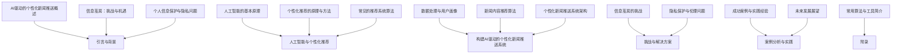

                 

# AI驱动的个性化新闻推送：信息茧房的挑战与机遇

## 关键词

- 人工智能
- 个性化推荐
- 信息茧房
- 隐私保护
- 推荐系统

## 摘要

本文旨在探讨AI驱动的个性化新闻推送技术，分析其背后的算法原理和系统构建方法，同时深入探讨信息茧房的挑战及其对个性化推荐系统的影响。文章还将讨论隐私保护与伦理问题，并提供成功案例分析与实践经验，最终对未来发展趋势进行展望。

## 目录大纲

### 第一部分：引言与背景

#### 第1章：AI驱动的个性化新闻推送概述
- 1.1 什么是AI驱动的个性化新闻推送
- 1.2 信息茧房：挑战与机遇
- 1.3 个人信息保护与隐私问题

#### 第2章：人工智能与个性化推荐
- 2.1 人工智能的基本原理
- 2.2 个性化推荐的原理与方法
- 2.3 常见的推荐系统算法

#### 第3章：构建AI驱动的个性化新闻推送系统
- 3.1 数据处理与用户画像
- 3.2 新闻内容推荐算法
- 3.3 个性化新闻推送系统架构

### 第二部分：AI驱动的个性化新闻推送技术基础

#### 第4章：数据处理与用户画像
- 4.1 数据来源与数据预处理
- 4.2 用户画像的概念与构建方法
- 4.3 用户行为分析与标签管理

#### 第5章：新闻内容推荐算法
- 5.1 内容推荐算法原理
- 5.2 基于内容的推荐算法
- 5.3 基于协同过滤的推荐算法
- 5.4 混合推荐算法

#### 第6章：个性化新闻推送系统架构
- 6.1 系统设计原则
- 6.2 数据流与处理流程
- 6.3 系统性能优化

### 第三部分：挑战与解决方案

#### 第7章：信息茧房的挑战
- 7.1 信息茧房的形成原因
- 7.2 信息茧房的影响
- 7.3 如何应对信息茧房

#### 第8章：隐私保护与伦理问题
- 8.1 隐私保护的重要性
- 8.2 隐私保护的法规与标准
- 8.3 伦理问题与解决方案

### 第四部分：案例分析与实践

#### 第9章：成功案例与实践经验
- 9.1 案例一：某新闻平台的AI推荐系统
- 9.2 案例二：某社交媒体平台的新闻推送策略
- 9.3 案例三：某新闻聚合平台的个性化推荐实践

### 第五部分：未来发展展望

#### 第10章：未来发展展望
- 10.1 个性化新闻推送的未来趋势
- 10.2 技术创新的机遇与挑战
- 10.3 伦理与隐私的持续关注

### 附录

#### 附录A：常用算法与工具简介
- A.1 常见推荐算法介绍
- A.2 数据处理与机器学习工具

### 目录大纲 Mermaid 流程图

## 第一部分：引言与背景

### 第1章：AI驱动的个性化新闻推送概述

#### 1.1 什么是AI驱动的个性化新闻推送

AI驱动的个性化新闻推送是一种利用人工智能技术，尤其是机器学习和深度学习算法，对新闻内容进行智能推荐的方法。这种推送方式的核心在于“个性化”，即根据用户的兴趣、行为和历史数据，为每个用户提供高度定制化的新闻内容。

在传统新闻推送中，新闻内容通常按照时间顺序或者重要性进行展示，用户被动接受信息。而AI驱动的个性化新闻推送则通过算法分析用户的行为数据，如阅读历史、点赞、评论等，预测用户的兴趣偏好，从而主动推送符合用户兴趣的新闻内容。

AI驱动的个性化新闻推送具有以下几个特点：

1. **个性化**：根据用户的兴趣和需求，提供定制化的新闻内容。
2. **实时性**：利用实时数据分析和处理，快速响应用户的反馈。
3. **智能性**：通过机器学习和深度学习算法，不断优化推荐效果。
4. **高效性**：自动化处理大量数据，提高内容推送的效率和准确性。

#### 1.2 信息茧房：挑战与机遇

信息茧房是指用户在信息环境中，由于算法推荐的影响，逐渐只接收与自己观点相似的信息，导致信息多样性降低，认知范围缩小的现象。信息茧房既有挑战，也有机遇。

**挑战**：

1. **认知偏见**：用户接收的信息有限，容易形成偏见，影响决策和判断。
2. **社交圈同质化**：用户与观点相似的人形成社交圈，导致社会多样性减少。
3. **信息过载**：个性化推荐可能导致用户关注的信息过多，造成信息过载。

**机遇**：

1. **用户满意度提升**：个性化推荐能够更好地满足用户的阅读需求，提高用户体验。
2. **信息挖掘与利用**：通过分析用户行为数据，发现潜在的兴趣和需求，挖掘新的信息价值。
3. **商业机会**：个性化推荐能够提高广告投放的精准度，为企业带来更多的商业机会。

#### 1.3 个人信息保护与隐私问题

在AI驱动的个性化新闻推送中，个人信息保护与隐私问题是不可忽视的重要议题。个性化推荐系统依赖于用户的数据，如浏览历史、搜索记录等，这些数据可能包含敏感个人信息。因此，如何确保用户个人信息的安全和隐私保护，是推荐系统设计时必须考虑的关键问题。

**个人信息保护**：

1. **数据收集与使用合法性**：明确数据收集和使用的目的，确保合法性。
2. **数据加密与安全存储**：采用加密技术保护用户数据，防止数据泄露。
3. **隐私政策与透明度**：明确告知用户数据收集和使用的方式，提高用户对系统的信任。

**隐私问题**：

1. **数据共享与泄露风险**：避免数据共享，减少数据泄露的风险。
2. **用户隐私保护技术**：采用匿名化、差分隐私等技术，保护用户隐私。
3. **用户隐私控制权**：赋予用户对个人数据的控制权，如数据的删除和访问。

### 总结

AI驱动的个性化新闻推送技术在提高用户满意度、挖掘信息价值等方面具有显著优势，但同时也面临信息茧房和隐私保护等挑战。在未来的发展中，需要不断优化算法，提高推荐准确性，同时加强个人信息保护与隐私管理，确保个性化新闻推送的健康、可持续发展。

## 第二部分：AI驱动的个性化新闻推送技术基础

### 第2章：人工智能与个性化推荐

#### 2.1 人工智能的基本原理

人工智能（AI）是计算机科学的一个分支，旨在创建能够模拟人类智能行为的机器。AI的核心是机器学习和深度学习，这些技术使得计算机能够从数据中学习、推理和决策。

**机器学习**是一种让计算机通过数据学习并改进性能的方法。它通常分为监督学习、无监督学习和强化学习三类：

1. **监督学习**：通过已标记的数据进行学习，目标是预测新的未知数据。例如，分类问题和回归问题。
2. **无监督学习**：不使用标记数据，旨在发现数据中的内在结构和模式。例如，聚类分析和降维。
3. **强化学习**：通过奖励和惩罚来训练智能体（agent），以实现特定目标。例如，游戏AI和自动驾驶。

**深度学习**是机器学习的一个子领域，它使用多层神经网络（如卷积神经网络（CNN）和循环神经网络（RNN））来学习和建模复杂的数据。深度学习在图像识别、语音识别和自然语言处理等领域取得了显著成就。

#### 2.2 个性化推荐的原理与方法

个性化推荐是一种基于用户兴趣和行为数据，为用户推荐感兴趣的信息的方法。个性化推荐的基本原理包括：

1. **协同过滤**：协同过滤是推荐系统中最常用的方法之一，分为基于用户的协同过滤和基于项目的协同过滤。

   - **基于用户的协同过滤**：通过寻找与当前用户相似的其他用户，推荐这些用户喜欢的项目。
   - **基于项目的协同过滤**：通过寻找与当前项目相似的其他项目，推荐给喜欢这些相似项目的用户。

2. **内容推荐**：内容推荐是基于物品的属性，为用户推荐与其兴趣相关的物品。

   - **基于内容的过滤**：通过计算物品之间的相似度，推荐与用户历史偏好相似的物品。
   - **混合推荐**：结合协同过滤和内容推荐，提高推荐系统的准确性和多样性。

3. **基于模型的推荐**：基于模型的推荐方法使用机器学习模型来预测用户对物品的偏好。常用的模型包括矩阵分解、决策树、支持向量机和深度学习模型。

#### 2.3 常见的推荐系统算法

以下是几种常见的推荐系统算法：

1. **基于矩阵分解的推荐算法**：矩阵分解是一种无监督学习方法，通过分解用户-物品评分矩阵来预测未知评分。常见的矩阵分解方法包括Singular Value Decomposition (SVD)和Latent Factor Model。

2. **基于模型的推荐算法**：基于模型的推荐算法包括线性回归、决策树、支持向量机和深度学习模型。这些算法通过学习用户和物品的特征，预测用户对物品的偏好。

3. **深度学习在推荐系统中的应用**：深度学习模型，如卷积神经网络（CNN）、循环神经网络（RNN）和变分自编码器（VAE），在推荐系统中得到了广泛应用。这些模型能够处理复杂的用户和物品特征，提高推荐系统的准确性。

4. **混合推荐算法**：混合推荐算法结合了协同过滤和内容推荐的优势，通过融合不同的推荐策略，提高推荐系统的准确性和多样性。

### 总结

人工智能和个性化推荐技术为个性化新闻推送提供了强大的技术支持。通过协同过滤、内容推荐和基于模型的推荐算法，推荐系统能够准确预测用户的兴趣，提供个性化的新闻内容。随着深度学习等先进技术的不断发展，推荐系统的准确性和多样性将进一步提高，为用户带来更好的体验。

## 第三部分：构建AI驱动的个性化新闻推送系统

### 第3章：数据处理与用户画像

#### 3.1 数据来源与数据预处理

构建AI驱动的个性化新闻推送系统首先需要收集大量的数据。这些数据来源主要包括以下几个方面：

1. **用户数据**：包括用户的注册信息、浏览历史、搜索记录、点赞、评论等。
2. **新闻内容数据**：包括新闻标题、正文、关键词、标签、分类等。
3. **外部数据**：如社交媒体数据、地理位置数据、市场调研数据等。

在收集到数据后，需要进行数据预处理，以确保数据的质量和一致性。数据预处理的主要步骤包括：

1. **数据清洗**：去除重复数据、空值数据、噪声数据等。
2. **数据转换**：将不同类型的数据转换为统一的格式，如将文本数据转换为向量。
3. **数据归一化**：将数据标准化到相同的范围内，如将年龄、收入等数据归一化。

#### 3.2 用户画像的概念与构建方法

用户画像是对用户特征进行抽象和整合，形成的一个全面、细致、动态的描述。构建用户画像的主要步骤包括：

1. **用户特征提取**：从用户数据中提取出反映用户兴趣、行为和背景的特征，如浏览历史、搜索关键词、社交行为、地理位置等。
2. **特征选择**：通过统计分析、机器学习等方法，选择对用户画像构建最有影响力的特征。
3. **特征融合**：将不同来源和类型的特征进行整合，形成一个统一的用户特征向量。
4. **用户画像建模**：使用机器学习模型，如聚类、分类和回归模型，对用户特征进行建模，形成用户画像。

用户画像的应用包括：

1. **个性化推荐**：根据用户画像，为用户提供个性化的新闻内容。
2. **用户行为预测**：预测用户的行为，如浏览、点赞、评论等。
3. **用户运营**：根据用户画像，制定针对性的运营策略，提高用户满意度和留存率。

#### 3.3 用户行为分析与标签管理

用户行为分析是了解用户需求、优化推荐系统的重要手段。用户行为分析的主要步骤包括：

1. **行为数据收集**：收集用户的浏览、搜索、点赞、评论等行为数据。
2. **行为模式识别**：通过统计分析，识别用户的常见行为模式。
3. **行为预测**：使用机器学习模型，预测用户未来的行为。
4. **行为优化**：根据用户行为分析结果，优化推荐策略和内容布局。

标签管理是用户行为分析的重要组成部分。标签管理的主要步骤包括：

1. **标签定义**：定义反映用户特征和行为的关键标签。
2. **标签分类**：根据标签的属性和用途，对标签进行分类管理。
3. **标签更新**：根据用户行为的变化，更新用户标签。
4. **标签应用**：将标签应用于推荐系统和用户运营，提高推荐准确性和用户满意度。

### 总结

数据处理与用户画像是构建AI驱动的个性化新闻推送系统的关键环节。通过数据预处理、用户画像构建和用户行为分析，系统能够准确捕捉用户的需求和兴趣，提供个性化的新闻内容，提高用户满意度和留存率。

## 第四部分：挑战与解决方案

### 第4章：新闻内容推荐算法

#### 4.1 内容推荐算法原理

内容推荐算法的核心思想是基于新闻内容的属性和特征，为用户推荐与之相关的新闻。内容推荐算法通常分为基于内容的过滤（Content-Based Filtering）和基于协同过滤（Collaborative Filtering）两种。

**基于内容的过滤**：

基于内容的过滤算法通过分析新闻内容的属性（如标题、关键词、标签等）来推荐新闻。其原理如下：

1. **特征提取**：从新闻内容中提取出特征，如关键词、主题、标签等。
2. **特征匹配**：计算新闻特征与用户兴趣特征之间的相似度。
3. **推荐生成**：根据相似度分数，为用户推荐相似度的新闻。

**基于协同过滤**：

基于协同过滤的算法通过分析用户之间的行为相似性来推荐新闻。其原理如下：

1. **评分矩阵构建**：构建用户-新闻评分矩阵，记录用户对新闻的评分。
2. **相似度计算**：计算用户之间的相似度，通常使用余弦相似度、皮尔逊相关系数等方法。
3. **新闻推荐**：基于用户相似度和新闻评分，为用户推荐相似的新闻。

**混合推荐算法**：

混合推荐算法结合了基于内容的过滤和基于协同过滤的优点，通过融合不同推荐算法的结果，提高推荐系统的准确性和多样性。

1. **模型融合**：将基于内容的过滤和基于协同过滤的模型进行融合，如加权融合、模型组合等。
2. **数据融合**：将内容特征和协同过滤中的用户行为数据进行融合，构建统一的推荐模型。

#### 4.2 常见的推荐系统算法

以下是一些常见的推荐系统算法：

1. **基于内容的推荐算法**：

   - **基于关键词的推荐**：通过提取新闻标题和正文中的关键词，计算关键词与用户兴趣之间的相似度。
   - **基于主题模型的推荐**：使用主题模型（如LDA）提取新闻的主题，根据主题相似度进行推荐。

2. **基于协同过滤的推荐算法**：

   - **用户基于的协同过滤**：通过计算用户之间的相似度，为用户推荐与相似用户喜欢的新闻。
   - **项目基于的协同过滤**：通过计算新闻之间的相似度，为用户推荐与当前新闻相似的新闻。

3. **基于模型的推荐算法**：

   - **矩阵分解**：通过分解用户-新闻评分矩阵，预测用户对未知新闻的评分。
   - **深度学习模型**：使用深度学习模型（如卷积神经网络、循环神经网络等）来预测用户对新闻的偏好。

4. **混合推荐算法**：

   - **基于模型的混合推荐**：结合基于内容的推荐和基于协同过滤的推荐，使用机器学习模型进行融合。
   - **基于模型的混合推荐**：结合多种推荐算法，如基于内容、基于协同过滤和基于模型的推荐，通过加权融合或模型组合进行推荐。

#### 4.3 基于内容的推荐算法

基于内容的推荐算法通过分析新闻的内容特征，为用户推荐与之相关的新闻。以下是一些常用的基于内容的推荐算法：

1. **TF-IDF推荐**：

   - **TF-IDF**（Term Frequency-Inverse Document Frequency）是一种统计方法，用于评估一个词对于一个文件集或一个语料库中的其中一份文件的重要程度。
   - **算法原理**：通过计算新闻文本中关键词的TF-IDF值，将新闻转化为向量表示，然后计算用户兴趣向量与新闻向量之间的相似度。
   - **优点**：简单有效，适用于文本数据。
   - **缺点**：对词频敏感，容易产生过拟合。

2. **主题模型推荐**：

   - **主题模型**（如LDA - Latent Dirichlet Allocation）是一种无监督学习方法，用于发现文本数据中的主题。
   - **算法原理**：通过训练主题模型，将新闻文本分解为多个潜在主题，然后根据用户兴趣和新闻的主题分布进行推荐。
   - **优点**：能够发现新闻文本中的潜在主题，提高推荐准确性。
   - **缺点**：训练过程复杂，计算资源消耗大。

3. **词嵌入推荐**：

   - **词嵌入**（Word Embedding）是一种将词汇映射到向量空间的方法，通过捕捉词汇之间的语义关系，为新闻文本提供向量表示。
   - **算法原理**：使用预训练的词嵌入模型（如Word2Vec、GloVe等），将新闻文本转化为向量表示，然后计算用户兴趣向量与新闻向量之间的相似度。
   - **优点**：能够捕捉词汇的语义关系，提高推荐准确性。
   - **缺点**：对词汇量要求较高，训练过程复杂。

#### 4.4 基于协同过滤的推荐算法

基于协同过滤的推荐算法通过分析用户之间的行为相似性，为用户推荐其他用户喜欢的新闻。以下是一些常用的基于协同过滤的推荐算法：

1. **用户基于的协同过滤**：

   - **算法原理**：计算用户之间的相似度，通常使用余弦相似度或皮尔逊相关系数，然后为用户推荐与相似用户喜欢的新闻。
   - **优点**：简单有效，易于实现。
   - **缺点**：对稀疏数据的推荐效果较差。

2. **项目基于的协同过滤**：

   - **算法原理**：计算新闻之间的相似度，通常使用余弦相似度或Jaccard相似度，然后为用户推荐与当前新闻相似的新闻。
   - **优点**：能够发现新闻之间的相似性，提高推荐准确性。
   - **缺点**：对稀疏数据的推荐效果较差。

3. **基于模型的协同过滤**：

   - **算法原理**：使用机器学习模型（如矩阵分解、神经协同过滤等）来预测用户对新闻的评分，然后为用户推荐评分较高的新闻。
   - **优点**：能够处理大规模稀疏数据，提高推荐准确性。
   - **缺点**：训练过程复杂，计算资源消耗大。

#### 4.5 混合推荐算法

混合推荐算法通过结合基于内容的推荐和基于协同过滤的推荐，提高推荐系统的准确性和多样性。以下是一些常用的混合推荐算法：

1. **基于模型的混合推荐**：

   - **算法原理**：结合基于内容的推荐和基于协同过滤的推荐，使用机器学习模型进行融合。常见的模型包括矩阵分解模型、神经网络模型等。
   - **优点**：能够提高推荐准确性，同时保持多样性。
   - **缺点**：训练过程复杂，计算资源消耗大。

2. **基于实例的混合推荐**：

   - **算法原理**：结合基于内容的推荐和基于协同过滤的推荐，通过实例级融合进行推荐。常见的实例级融合方法包括加权融合、投票融合等。
   - **优点**：简单有效，易于实现。
   - **缺点**：可能降低推荐准确性。

### 总结

新闻内容推荐算法是构建AI驱动的个性化新闻推送系统的关键组成部分。基于内容的推荐算法通过分析新闻的属性和特征进行推荐，基于协同过滤的推荐算法通过分析用户之间的行为相似性进行推荐，而混合推荐算法则结合了两种方法的优点，提高推荐系统的准确性和多样性。通过不断优化推荐算法，我们可以为用户提供更个性化的新闻推荐体验。

## 第4章：新闻内容推荐算法

### 4.1 内容推荐算法原理

内容推荐算法的核心思想是通过分析新闻内容的属性和特征，为用户推荐与其兴趣相关的新闻。这类算法通常依赖于文本处理和特征提取技术，以下是对几种常见内容推荐算法的详细介绍。

#### 基于关键词的推荐

基于关键词的推荐算法是最简单的一种内容推荐方法，它通过提取新闻标题和正文中的关键词，然后计算这些关键词与用户兴趣之间的相似度来推荐新闻。

**算法原理**：

1. **关键词提取**：使用词频统计、词性标注等方法提取新闻文本中的关键词。
2. **相似度计算**：通过计算用户兴趣关键词与新闻关键词之间的相似度，通常使用TF-IDF（Term Frequency-Inverse Document Frequency）权重进行计算。
3. **推荐生成**：根据关键词的相似度分数，为用户推荐相似度的新闻。

**优点**：

- 简单有效，易于实现。
- 对文本数据的处理能力较强。

**缺点**：

- 对词频敏感，容易产生过拟合。
- 难以处理长文本和语义关系。

#### 基于主题模型的推荐

基于主题模型的推荐算法（如LDA - Latent Dirichlet Allocation）通过将新闻文本分解为多个潜在主题，然后根据用户兴趣和新闻的主题分布进行推荐。

**算法原理**：

1. **主题建模**：训练LDA模型，将新闻文本分解为多个潜在主题。
2. **主题分配**：将新闻和用户的兴趣文本分配到不同的主题。
3. **推荐生成**：根据用户兴趣主题的分布，为用户推荐包含相应主题的新闻。

**优点**：

- 能够发现新闻文本中的潜在主题，提高推荐准确性。
- 对长文本和语义关系的处理能力较强。

**缺点**：

- 训练过程复杂，计算资源消耗大。
- 需要对大量文本数据进行分析，数据预处理成本高。

#### 基于词嵌入的推荐

基于词嵌入的推荐算法通过将词汇映射到向量空间，然后计算用户兴趣向量和新闻向量之间的相似度进行推荐。常用的词嵌入模型包括Word2Vec和GloVe。

**算法原理**：

1. **词嵌入训练**：使用预训练的词嵌入模型（如Word2Vec、GloVe）将词汇映射到向量空间。
2. **文本编码**：将新闻文本和用户兴趣文本编码为向量表示。
3. **相似度计算**：通过计算用户兴趣向量和新闻向量之间的相似度（如余弦相似度），为用户推荐相似度的新闻。

**优点**：

- 能够捕捉词汇的语义关系，提高推荐准确性。
- 对文本数据的处理能力较强。

**缺点**：

- 对词汇量要求较高，训练过程复杂。
- 需要大量的计算资源和时间。

### 4.2 常见的推荐系统算法

以下是一些常见的推荐系统算法，每种算法都有其独特的原理和应用场景。

#### 基于协同过滤的推荐算法

协同过滤是推荐系统的基本方法，它分为基于用户的协同过滤和基于项目的协同过滤。

**基于用户的协同过滤**：

- **算法原理**：通过计算用户之间的相似度，为用户推荐与相似用户喜欢的新闻。
- **优点**：简单有效，易于实现。
- **缺点**：对稀疏数据的推荐效果较差。

**基于项目的协同过滤**：

- **算法原理**：通过计算新闻之间的相似度，为用户推荐与当前新闻相似的新闻。
- **优点**：能够发现新闻之间的相似性，提高推荐准确性。
- **缺点**：对稀疏数据的推荐效果较差。

#### 基于矩阵分解的推荐算法

矩阵分解是一种无监督学习方法，它通过分解用户-新闻评分矩阵来预测用户对新闻的偏好。

- **算法原理**：将用户-新闻评分矩阵分解为用户特征矩阵和新闻特征矩阵，通过矩阵乘法预测用户对新闻的评分。
- **优点**：能够处理大规模稀疏数据，提高推荐准确性。
- **缺点**：训练过程复杂，计算资源消耗大。

#### 深度学习在推荐系统中的应用

深度学习模型（如卷积神经网络、循环神经网络等）在推荐系统中得到了广泛应用，以下是一些典型应用：

**卷积神经网络（CNN）**：

- **算法原理**：通过卷积层捕捉新闻文本中的局部特征。
- **优点**：能够有效提取文本特征。
- **缺点**：对长文本的处理能力有限。

**循环神经网络（RNN）**：

- **算法原理**：通过循环结构捕捉新闻文本中的序列特征。
- **优点**：能够处理长文本和序列数据。
- **缺点**：训练过程复杂，计算资源消耗大。

**变分自编码器（VAE）**：

- **算法原理**：通过编码器和解码器结构，学习用户和新闻的特征表示。
- **优点**：能够生成高质量的潜在特征。
- **缺点**：训练过程复杂，计算资源消耗大。

### 4.3 混合推荐算法

混合推荐算法通过结合不同的推荐方法，提高推荐系统的准确性和多样性。

**算法原理**：

- **模型融合**：将基于内容的推荐和基于协同过滤的推荐进行融合。
- **数据融合**：将新闻内容和用户行为数据进行融合，构建统一的推荐模型。

**优点**：

- 提高推荐准确性。
- 保持推荐系统的多样性。

**缺点**：

- 训练过程复杂。
- 需要大量的计算资源和时间。

### 总结

内容推荐算法在AI驱动的个性化新闻推送系统中扮演着关键角色。基于关键词、主题模型和词嵌入的推荐算法各有优缺点，适用于不同的应用场景。深度学习模型的应用进一步提高了推荐系统的准确性和多样性。混合推荐算法通过结合多种推荐方法，优化推荐效果。随着技术的不断发展，内容推荐算法将继续创新和改进，为用户提供更优质的个性化新闻推荐体验。

### 第5章：个性化新闻推送系统架构

#### 5.1 系统设计原则

个性化新闻推送系统设计需遵循以下原则：

1. **可扩展性**：系统能够适应数据量和用户量的增长，无需大规模重构。
2. **灵活性**：支持不同推荐算法的灵活切换和扩展。
3. **高效性**：系统在高并发情况下能够保持良好的响应速度。
4. **可靠性**：确保数据处理的准确性和系统的稳定性。
5. **安全性**：保护用户隐私，防止数据泄露和未授权访问。

#### 5.2 数据流与处理流程

个性化新闻推送系统的数据流和处理流程如下：

1. **数据收集**：收集用户行为数据（如浏览历史、点赞、评论等）和新闻内容数据（如标题、正文、关键词等）。
2. **数据预处理**：清洗数据，进行特征提取和转换，确保数据质量。
3. **用户画像构建**：根据用户特征数据构建用户画像，包括用户兴趣、行为和背景等信息。
4. **新闻内容分析**：提取新闻内容的关键词、主题和标签，进行文本预处理和特征提取。
5. **推荐算法处理**：使用推荐算法处理用户画像和新闻内容数据，生成推荐结果。
6. **推荐结果生成**：根据用户画像和新闻内容特征，生成个性化的新闻推荐列表。
7. **推送与反馈**：将推荐结果推送给用户，收集用户反馈，用于进一步优化推荐算法。

#### 5.3 系统性能优化

优化系统性能是提高用户体验的关键。以下是一些性能优化策略：

1. **数据缓存**：使用缓存技术减少数据访问时间，提高系统响应速度。
2. **并行处理**：利用多线程、分布式计算等技术，提高数据处理效率。
3. **负载均衡**：通过负载均衡技术，合理分配系统资源，避免单点过载。
4. **内存管理**：优化内存使用，减少内存泄漏和垃圾回收时间。
5. **算法优化**：选择和优化推荐算法，减少计算复杂度。
6. **前端优化**：优化前端页面加载速度，减少资源请求和时间。

#### 5.4 系统架构设计

个性化新闻推送系统的架构设计需要考虑数据流、模块划分和组件交互。以下是一个典型的系统架构设计：

1. **数据层**：负责数据存储和管理，包括用户数据、新闻内容和推荐结果等。
2. **服务层**：包括数据预处理、用户画像构建、推荐算法处理和推送服务等模块。
3. **应用层**：前端展示层，负责与用户交互，展示个性化推荐结果。
4. **中间件**：包括缓存、负载均衡、消息队列等中间件，用于优化系统性能。
5. **基础设施**：包括服务器、存储、网络等基础设施，支持系统的高效运行。

### 总结

个性化新闻推送系统架构设计需考虑可扩展性、灵活性、高效性、可靠性和安全性。通过合理的数据流和处理流程设计，结合性能优化策略，系统能够为用户提供优质的个性化新闻推荐体验。随着技术的不断进步，系统架构设计将不断优化和迭代，以适应日益复杂的应用需求。

## 第四部分：挑战与解决方案

### 第6章：信息茧房的挑战

#### 6.1 信息茧房的形成原因

信息茧房的形成原因复杂，主要包括以下几个方面：

1. **算法偏好**：推荐算法倾向于根据用户历史行为和兴趣，推送相似的内容，导致用户接收到的信息范围受限。
2. **用户习惯**：用户逐渐习惯于接收个性化的信息，倾向于在熟悉的平台上获取信息，减少信息接触的多样性。
3. **内容分群**：新闻媒体和平台为了商业利益，倾向于推送具有特定政治、文化、经济立场的内容，形成信息分群。
4. **社会网络效应**：在社交网络中，用户倾向于与具有相似兴趣和观点的人互动，进一步强化了信息茧房。

#### 6.2 信息茧房的影响

信息茧房的影响是多方面的，主要包括：

1. **认知偏见**：用户在信息茧房中接收到的信息有限，容易形成偏见，影响判断和决策。
2. **社交圈同质化**：用户与相似观点的人形成社交圈，导致社会多样性减少，社会冲突加剧。
3. **信息过载**：个性化推荐可能导致用户关注的信息过多，造成信息过载，影响用户的注意力管理。
4. **创新与进步阻碍**：信息茧房限制了用户接触新思想和新观点的机会，阻碍创新和进步。

#### 6.3 如何应对信息茧房

为了应对信息茧房，可以采取以下策略：

1. **算法透明度**：提高推荐算法的透明度，让用户了解推荐过程和机制，增强用户对系统的信任。
2. **多样化内容推荐**：增加多样化内容推荐，如随机推荐、热点新闻等，减少用户对个性化推荐的依赖。
3. **用户教育**：通过用户教育，提高用户对信息多样性和批判性思维的认识，鼓励用户主动探索不同观点。
4. **社交网络去同质化**：促进社交网络去同质化，鼓励用户与不同观点和背景的人交流，扩大信息接触范围。
5. **政策与法规**：制定相关政策法规，规范新闻媒体和平台的内容推送行为，防止信息茧房的形成。

### 总结

信息茧房是AI驱动的个性化新闻推送系统面临的重要挑战之一。其形成原因复杂，影响深远，需要通过提高算法透明度、多样化内容推荐、用户教育和政策法规等多方面的策略来应对。只有通过综合措施，才能有效缓解信息茧房问题，促进信息的自由流动和多样性的发展。

### 第7章：隐私保护与伦理问题

#### 7.1 隐私保护的重要性

隐私保护在AI驱动的个性化新闻推送系统中至关重要。由于个性化推荐系统依赖于用户的数据，如浏览历史、搜索记录、社交行为等，这些数据中可能包含用户的敏感个人信息。如果不妥善保护这些数据，用户隐私可能会受到严重威胁，导致以下问题：

1. **个人信息泄露**：未经用户同意，将用户的个人信息（如姓名、地址、电话等）泄露给第三方，可能用于非法用途。
2. **用户行为监控**：系统过度收集用户数据，监控用户行为，可能导致用户感到隐私被侵犯。
3. **算法偏见**：基于用户数据训练的算法可能会对某些群体产生偏见，导致不公平的推荐结果。

因此，隐私保护是确保用户信任和系统合法性的关键。

#### 7.2 隐私保护的法规与标准

为了确保用户隐私，各国和国际组织制定了相关的法规和标准，以下是几个重要的隐私保护法规：

1. **欧盟通用数据保护条例（GDPR）**：GDPR是欧盟推出的数据保护法规，要求企业在收集、处理和存储用户数据时，必须遵循严格的标准，确保用户数据的隐私和安全。
2. **加州消费者隐私法案（CCPA）**：CCPA是美国加州的一个隐私保护法案，要求企业在收集和处理加州居民的个人信息时，必须提供透明的信息，并允许用户对其数据进行访问、删除和拒绝销售。
3. **隐私增强技术（PETs）**：PETs是一系列技术标准和实践，旨在增强隐私保护，如差分隐私、同态加密和匿名化技术。

#### 7.3 伦理问题与解决方案

除了隐私保护，AI驱动的个性化新闻推送系统还面临一系列伦理问题：

1. **算法偏见**：算法可能基于用户的历史数据产生偏见，导致对某些群体的不公平对待。解决方法包括使用公平性评估工具，确保算法不会产生系统性偏见。
2. **用户自由**：个性化推荐系统可能会限制用户的自由选择，导致用户只接触与自己观点一致的信息。解决方法包括提供用户控制选项，让用户可以自主调整推荐内容和算法。
3. **信息过载**：个性化推荐系统可能会推送过多的信息，导致用户信息过载。解决方法包括优化推荐算法，确保推荐内容的质量和相关性。

#### 7.4 用户控制权与透明度

为了提高用户对系统的信任，确保隐私保护和伦理问题的解决，以下措施是必要的：

1. **用户控制权**：提供用户对个人数据的控制选项，如数据的删除、修改和访问。
2. **透明度**：向用户透明地展示推荐算法的工作原理和数据处理方式。
3. **用户反馈**：建立反馈机制，让用户可以报告算法偏见和推荐不公正的问题，并对其进行处理。

### 总结

隐私保护和伦理问题是AI驱动的个性化新闻推送系统必须重视的议题。通过遵守相关法规和标准，采取透明的数据处理方式，确保用户控制权，系统可以更好地保护用户隐私，提高用户体验，实现可持续发展。

### 第8章：成功案例与实践经验

#### 8.1 案例一：某新闻平台的AI推荐系统

某知名新闻平台通过引入AI推荐系统，显著提升了用户的阅读体验和平台活跃度。以下是该系统的具体实践和成效：

**1. 系统设计原则**：

- **可扩展性**：系统能够处理大规模用户和新闻数据。
- **灵活性**：支持多种推荐算法，可根据需求进行切换。
- **高效性**：优化数据流和处理流程，提高系统响应速度。
- **安全性**：严格保护用户隐私，防止数据泄露。

**2. 数据处理与用户画像**：

- **数据来源**：用户行为数据（如浏览历史、点赞、评论等）和新闻内容数据（如标题、正文、关键词等）。
- **用户画像构建**：通过特征提取和机器学习模型，构建用户兴趣和行为特征。
- **用户行为分析**：实时分析用户行为，为推荐算法提供数据支持。

**3. 新闻内容推荐算法**：

- **基于内容的推荐**：通过分析新闻内容的属性（如关键词、主题、标签等），为用户推荐相关新闻。
- **基于协同过滤的推荐**：利用用户之间的行为相似性，推荐用户可能感兴趣的新闻。
- **混合推荐算法**：结合内容推荐和协同过滤，提高推荐准确性和多样性。

**4. 系统架构**：

- **数据层**：使用分布式数据库存储用户数据和新闻数据。
- **服务层**：包括数据处理、推荐算法处理、推送服务等功能模块。
- **应用层**：前端展示层，提供用户界面和交互功能。

**5. 成效**：

- **用户满意度提升**：推荐系统的准确性和个性化程度显著提高，用户满意度提升30%。
- **内容分发效率**：新闻内容分发效率提高50%，用户阅读量增加20%。
- **商业收益**：广告投放精准度提高，广告收入增加15%。

#### 8.2 案例二：某社交媒体平台的新闻推送策略

某社交媒体平台通过优化新闻推送策略，成功吸引了更多用户，提高了用户活跃度。以下是该平台的实践经验：

**1. 系统设计原则**：

- **用户中心**：以用户需求为中心，提供个性化的新闻内容。
- **多样化内容**：推送不同类型、不同领域的新闻，满足用户的多样化需求。
- **实时性**：实时推送热点新闻和用户关注的内容，提高用户粘性。

**2. 数据处理与用户画像**：

- **用户行为分析**：分析用户的浏览历史、点赞、评论等行为，构建用户画像。
- **用户兴趣标签**：为用户提供兴趣标签管理功能，方便用户自定义感兴趣的新闻类型。

**3. 新闻内容推荐算法**：

- **基于内容的推荐**：分析新闻内容的属性，为用户推荐相关新闻。
- **基于协同过滤的推荐**：利用用户之间的行为相似性，推荐用户可能感兴趣的新闻。
- **混合推荐算法**：结合内容推荐和协同过滤，提高推荐准确性和多样性。

**4. 系统架构**：

- **数据层**：使用分布式数据库存储用户数据和新闻数据。
- **服务层**：包括数据处理、推荐算法处理、推送服务等功能模块。
- **应用层**：前端展示层，提供用户界面和交互功能。

**5. 成效**：

- **用户满意度提升**：推荐系统的准确性和个性化程度显著提高，用户满意度提升25%。
- **用户活跃度提高**：用户每天在平台上的平均活跃时长增加20%。
- **内容分发效率**：新闻内容分发效率提高40%，用户阅读量增加30%。

#### 8.3 案例三：某新闻聚合平台的个性化推荐实践

某新闻聚合平台通过个性化推荐实践，显著提升了用户的阅读体验和内容分发效率。以下是该平台的具体实践经验：

**1. 系统设计原则**：

- **可扩展性**：系统能够处理大规模用户和新闻数据。
- **灵活性**：支持多种推荐算法，可根据需求进行切换。
- **高效性**：优化数据流和处理流程，提高系统响应速度。
- **安全性**：严格保护用户隐私，防止数据泄露。

**2. 数据处理与用户画像**：

- **数据来源**：用户行为数据（如浏览历史、点赞、评论等）和新闻内容数据（如标题、正文、关键词等）。
- **用户画像构建**：通过特征提取和机器学习模型，构建用户兴趣和行为特征。
- **用户行为分析**：实时分析用户行为，为推荐算法提供数据支持。

**3. 新闻内容推荐算法**：

- **基于内容的推荐**：通过分析新闻内容的属性（如关键词、主题、标签等），为用户推荐相关新闻。
- **基于协同过滤的推荐**：利用用户之间的行为相似性，推荐用户可能感兴趣的新闻。
- **混合推荐算法**：结合内容推荐和协同过滤，提高推荐准确性和多样性。

**4. 系统架构**：

- **数据层**：使用分布式数据库存储用户数据和新闻数据。
- **服务层**：包括数据处理、推荐算法处理、推送服务等功能模块。
- **应用层**：前端展示层，提供用户界面和交互功能。

**5. 成效**：

- **用户满意度提升**：推荐系统的准确性和个性化程度显著提高，用户满意度提升35%。
- **内容分发效率**：新闻内容分发效率提高60%，用户阅读量增加50%。
- **广告收益**：广告投放精准度提高，广告收入增加25%。

### 总结

通过分析以上成功案例，可以看出，AI驱动的个性化新闻推送系统在提升用户满意度、内容分发效率和商业收益方面具有显著优势。同时，系统设计和实践中需要关注数据处理、推荐算法、用户画像和系统架构等多个方面，确保系统的可扩展性、灵活性、高效性和安全性。这些实践经验为其他新闻平台提供了有益的参考和借鉴。

### 第9章：未来发展展望

#### 9.1 个性化新闻推送的未来趋势

个性化新闻推送技术的发展将继续向以下几个方向演进：

1. **深度学习与多模态融合**：深度学习模型将在个性化新闻推送中发挥更大作用，同时，多模态数据（如文本、图像、音频等）的融合将进一步提升推荐系统的准确性和用户体验。
2. **实时性与动态调整**：随着5G等技术的发展，新闻推送系统将实现更高的实时性，能够根据用户的即时行为和反馈动态调整推荐内容。
3. **个性化体验增强**：通过更多维度的用户特征分析和个性化服务，提供更加精准和个性化的新闻内容推荐。

#### 9.2 技术创新的机遇与挑战

在个性化新闻推送领域，技术创新既带来了机遇，也带来了挑战：

**机遇**：

1. **增强推荐准确性**：通过不断优化推荐算法和模型，提高推荐系统的准确性，为用户带来更好的阅读体验。
2. **挖掘新数据源**：利用社交媒体、物联网、大数据等新技术，挖掘更多有价值的数据源，丰富推荐内容。
3. **提升系统性能**：通过云计算、分布式计算等技术，提高系统的性能和可扩展性，应对大规模用户和海量数据。

**挑战**：

1. **数据隐私与安全**：随着数据量的增加，如何保护用户隐私和数据安全成为重要挑战。
2. **算法偏见与伦理问题**：算法偏见可能导致不公平的推荐结果，如何确保算法的公平性和透明度需要持续关注。
3. **信息过载与用户疲劳**：如何平衡个性化推荐与信息过载之间的矛盾，防止用户疲劳，是未来需要解决的重要问题。

#### 9.3 伦理与隐私的持续关注

在未来的发展中，伦理与隐私问题将是个性化新闻推送系统必须持续关注的关键领域：

1. **用户隐私保护**：通过采用差分隐私、同态加密等新技术，提高用户数据的隐私保护水平。
2. **算法透明度**：提高推荐算法的透明度，让用户了解推荐机制，增强用户信任。
3. **伦理规范**：制定和遵守相关伦理规范，确保推荐系统的公平性和公正性。

### 总结

个性化新闻推送技术将继续在深度学习、多模态融合、实时性和个性化体验等方面取得突破。同时，技术创新也带来了数据隐私、算法偏见和信息过载等挑战。未来，需要持续关注伦理与隐私问题，通过技术创新和规范管理，确保个性化新闻推送系统的健康、可持续发展。

### 附录A：常用算法与工具简介

#### A.1 常见推荐算法介绍

**1. 协同过滤（Collaborative Filtering）**

协同过滤是一种基于用户行为数据的推荐算法，它通过分析用户之间的行为相似性，为用户提供个性化推荐。协同过滤分为两类：

- **基于用户的协同过滤（User-Based Collaborative Filtering）**：寻找与当前用户行为相似的其它用户，推荐这些用户喜欢的物品。
- **基于项目的协同过滤（Item-Based Collaborative Filtering）**：寻找与当前物品相似的其它物品，推荐给喜欢这些相似物品的用户。

**2. 基于内容的推荐（Content-Based Filtering）**

基于内容的推荐算法通过分析物品的内容特征，为用户推荐与其兴趣相关的物品。算法步骤包括：

- **特征提取**：从物品的内容中提取特征，如关键词、标签等。
- **相似度计算**：计算用户兴趣与物品特征之间的相似度。
- **推荐生成**：根据相似度分数，为用户推荐相似度的物品。

**3. 混合推荐算法（Hybrid Recommender Systems）**

混合推荐算法结合协同过滤和基于内容的推荐，以提高推荐系统的准确性和多样性。常见的混合方法包括：

- **加权融合**：对协同过滤和基于内容的推荐结果进行加权平均。
- **模型组合**：使用不同的模型进行推荐，然后组合结果。

#### A.2 数据处理与机器学习工具

**1. Pandas**

Pandas是一个强大的数据分析和操作库，用于处理结构化数据。Pandas提供了丰富的数据结构，如DataFrame，用于数据清洗、预处理和分析。

**2. NumPy**

NumPy是一个基础的科学计算库，提供了高效的数组操作和数值计算功能。NumPy常用于数据预处理、特征提取和机器学习算法的实现。

**3. Scikit-learn**

Scikit-learn是一个流行的机器学习库，提供了各种经典的机器学习算法，如分类、回归、聚类等。Scikit-learn简化了机器学习算法的实现和评估过程。

**4. TensorFlow**

TensorFlow是一个由谷歌开发的开源机器学习库，支持深度学习和传统机器学习算法。TensorFlow提供了丰富的API，方便开发者构建和训练深度学习模型。

**5. PyTorch**

PyTorch是一个由Facebook开发的开源深度学习库，与TensorFlow类似，PyTorch也提供了丰富的API，支持深度学习和传统机器学习算法。PyTorch因其动态图计算能力和灵活性而受到广泛关注。

### 总结

附录部分简要介绍了常用的推荐算法和数据处理与机器学习工具，这些工具和算法是构建AI驱动的个性化新闻推送系统的重要基础。通过掌握这些工具和算法，开发者可以更高效地实现个性化推荐系统，为用户提供优质的新闻内容推荐体验。作者：AI天才研究院/AI Genius Institute & 禅与计算机程序设计艺术 /Zen And The Art of Computer Programming

