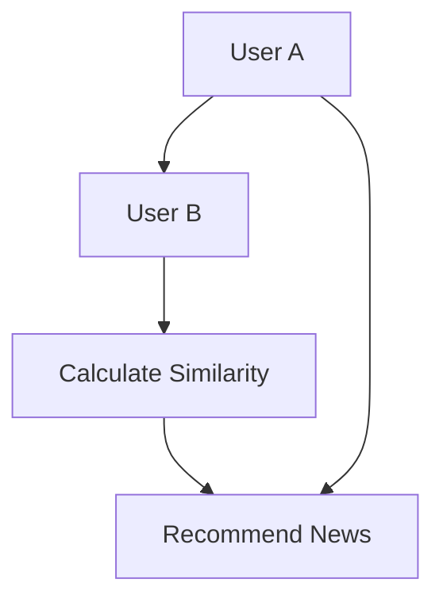
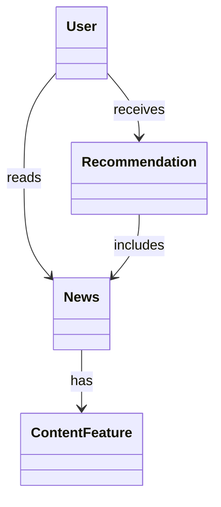
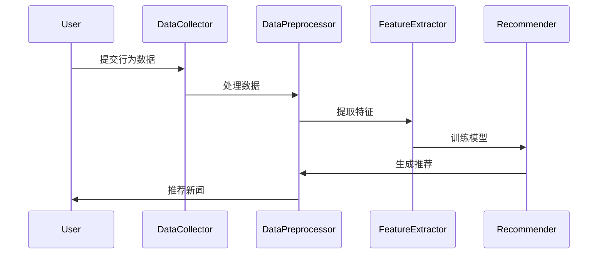
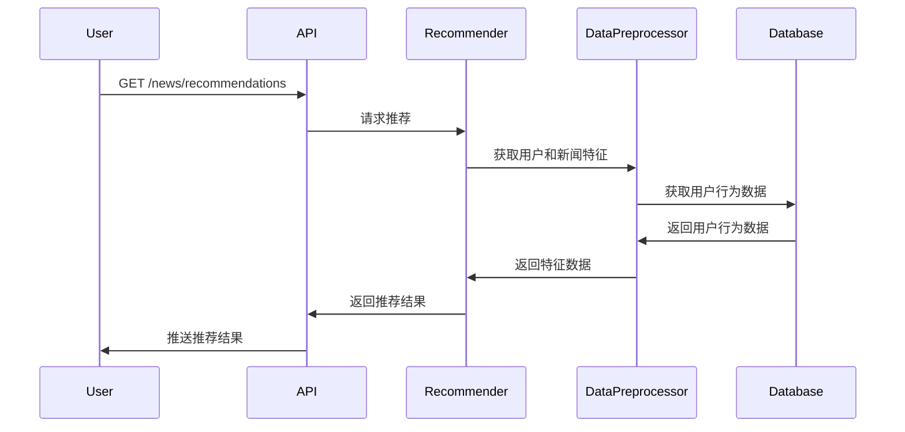

                 

# AI驱动的个性化新闻推送：信息获取的革新

## 关键词
- AI技术
- 个性化新闻推送
- 信息获取
- 推荐算法
- 数据隐私
- 智能化趋势

## 摘要
本文将深入探讨AI驱动的个性化新闻推送技术，分析其在信息获取领域的革新作用。我们将从基础概念、核心技术、算法原理、实际应用挑战与解决方案，以及未来发展趋势等多个角度进行详细阐述，帮助读者全面理解这一技术，并了解其在实际应用中的潜力和挑战。

## 目录

## 第一部分：AI驱动的个性化新闻推送基础

### 第1章：AI与个性化新闻推送概述

#### 1.1 AI与新闻推送的关系

#### 1.2 个性化新闻推送的重要性

#### 1.3 个性化新闻推送的发展历程

### 第2章：个性化新闻推送的核心技术

#### 2.1 数据收集与处理

#### 2.2 特征工程

#### 2.3 模型选择与训练

### 第3章：新闻推荐算法原理

#### 3.1 协同过滤算法

#### 3.2 内容基于算法

#### 3.3 混合推荐算法

### 第4章：个性化新闻推送案例解析

#### 4.1 案例一：某新闻平台的推荐系统实现

#### 4.2 案例二：基于用户行为的新闻推荐系统

#### 4.3 案例三：基于内容的新闻推荐系统

## 第二部分：个性化新闻推送在实际应用中的挑战与解决方案

### 第5章：个性化新闻推送中的挑战

#### 5.1 数据隐私与安全问题

#### 5.2 个性化推荐的质量问题

#### 5.3 个性化推荐的公平性问题

### 第6章：个性化新闻推送的解决方案

#### 6.1 强化学习在新闻推荐中的应用

#### 6.2 基于因果推断的新闻推荐方法

#### 6.3 多模态新闻推荐系统

### 第7章：个性化新闻推送的未来发展趋势

#### 7.1 AI在新闻推荐领域的应用前景

#### 7.2 智能化新闻推送的发展方向

#### 7.3 未来个性化新闻推送的创新点

## 第一部分：AI驱动的个性化新闻推送基础

### 第1章：AI与个性化新闻推送概述

#### 1.1 AI与新闻推送的关系

人工智能（AI）技术的发展，为新闻推送带来了革命性的变化。传统的新闻推送往往依赖于手动筛选和分类，而AI技术的引入，使得新闻推送更加智能化、个性化。AI技术通过学习用户的兴趣和行为，自动生成个性化推荐，从而提高了新闻的阅读率和用户体验。

#### 1.2 个性化新闻推送的重要性

在信息爆炸的时代，用户面临着大量的信息选择，如何有效地筛选和获取有价值的信息成为了一大难题。个性化新闻推送技术的出现，极大地提高了信息的获取效率，满足了用户个性化的信息需求。此外，个性化新闻推送还能够提高平台的用户黏性和活跃度，为新闻平台带来更多的商业价值。

#### 1.3 个性化新闻推送的发展历程

个性化新闻推送技术的发展可以分为三个阶段：

1. **基于内容的推荐**：最早期的个性化推荐系统，主要通过分析新闻的内容特征，将相似的内容推荐给用户。

2. **基于协同过滤的推荐**：利用用户的行为数据，如点击、阅读、分享等，通过计算用户之间的相似度，推荐用户可能感兴趣的新闻。

3. **混合推荐**：结合基于内容和协同过滤的方法，综合考虑新闻的内容特征和用户的行为数据，提供更加个性化的推荐。

### 第2章：个性化新闻推送的核心技术

#### 2.1 数据收集与处理

个性化新闻推送的第一步是数据收集。新闻平台需要收集用户的行为数据，如阅读记录、点击记录、评论等。这些数据通常来自于用户的操作日志、浏览历史等。

在数据收集后，需要对数据进行处理。处理步骤包括数据清洗、去重、转换等。数据清洗的目的是去除无效数据、异常数据，确保数据的质量。数据转换则是将数据格式统一，便于后续处理。

#### 2.2 特征工程

特征工程是构建推荐系统的重要环节。通过提取用户和新闻的特征，如用户的人口统计学特征、阅读偏好、新闻的主题、关键词等，为推荐系统提供有效的输入。

特征工程的目的是从原始数据中提取出对推荐任务有帮助的特征，提高推荐系统的准确性和效率。常见的特征工程方法包括词袋模型、TF-IDF、词嵌入等。

#### 2.3 模型选择与训练

在特征工程完成后，需要选择合适的推荐模型进行训练。常见的推荐模型包括协同过滤、基于内容的推荐和混合推荐。

协同过滤模型通过计算用户之间的相似度，推荐用户可能感兴趣的新闻。基于内容的推荐则通过分析新闻的内容特征，推荐具有相似主题的新闻。混合推荐模型结合了协同过滤和基于内容的方法，提供更加个性化的推荐。

在模型训练过程中，需要使用机器学习算法对模型进行优化。常见的机器学习算法包括矩阵分解、深度学习等。

### 第3章：新闻推荐算法原理

#### 3.1 协同过滤算法

协同过滤算法是推荐系统中最常用的方法之一。它通过计算用户之间的相似度，将相似的用户进行分组，为每个用户推荐其他用户喜欢的新闻。

协同过滤算法可以分为基于用户的协同过滤和基于物品的协同过滤。基于用户的协同过滤通过计算用户之间的相似度，推荐其他用户喜欢的新闻。基于物品的协同过滤则通过计算新闻之间的相似度，为用户推荐具有相似主题的新闻。

#### 3.2 内容基于算法

内容基于算法通过分析新闻的内容特征，如主题、关键词、情感等，将相似的内容推荐给用户。这种方法适用于主题明确、内容丰富的新闻类型。

内容基于算法通常使用文本处理技术，如词袋模型、TF-IDF、词嵌入等，提取新闻的特征向量。然后，通过计算新闻之间的相似度，为用户推荐感兴趣的新闻。

#### 3.3 混合推荐算法

混合推荐算法结合了协同过滤和基于内容的推荐方法，综合考虑用户的行为数据和新闻的内容特征，提供更加个性化的推荐。

混合推荐算法通常使用矩阵分解的方法，将用户和新闻的特征矩阵分解为低维矩阵，然后计算用户和新闻之间的相似度。这种方法能够在提高推荐准确性的同时，减少计算复杂度。

### 第4章：个性化新闻推送案例解析

#### 4.1 案例一：某新闻平台的推荐系统实现

在本案例中，我们将以某大型新闻平台为例，详细解析其推荐系统的实现过程。首先，该平台通过用户行为数据收集用户兴趣，然后通过特征工程提取用户和新闻的特征，最后使用混合推荐算法生成个性化推荐。

具体步骤如下：

1. **数据收集**：平台收集用户的阅读记录、点击记录、评论等行为数据。
2. **数据预处理**：对收集到的数据清洗、去重、转换，确保数据质量。
3. **特征工程**：提取用户的人口统计学特征、阅读偏好、新闻的主题、关键词等特征。
4. **模型训练**：使用矩阵分解和深度学习算法训练推荐模型。
5. **推荐生成**：根据用户的兴趣和新闻的特征，生成个性化推荐。

#### 4.2 案例二：基于用户行为的新闻推荐系统

在本案例中，我们将探讨基于用户行为的新闻推荐系统的实现。该系统主要通过分析用户的阅读历史、点击记录等行为数据，为用户推荐感兴趣的新闻。

具体步骤如下：

1. **数据收集**：收集用户的阅读历史、点击记录等行为数据。
2. **数据预处理**：对行为数据进行清洗、去重、转换，确保数据质量。
3. **特征工程**：提取用户的阅读时长、阅读频率、点击率等特征。
4. **模型训练**：使用协同过滤算法训练推荐模型。
5. **推荐生成**：根据用户的行为特征，生成个性化推荐。

#### 4.3 案例三：基于内容的新闻推荐系统

在本案例中，我们将讨论基于内容的新闻推荐系统的实现。该系统主要通过分析新闻的内容特征，如主题、关键词、情感等，为用户推荐相似主题的新闻。

具体步骤如下：

1. **数据收集**：收集新闻的文本数据，包括标题、正文、标签等。
2. **数据预处理**：对新闻文本进行清洗、去重、分词、词性标注等处理。
3. **特征工程**：提取新闻的主题、关键词、情感等特征。
4. **模型训练**：使用文本分类和情感分析算法训练推荐模型。
5. **推荐生成**：根据新闻的内容特征，生成个性化推荐。

## 第二部分：个性化新闻推送在实际应用中的挑战与解决方案

### 第5章：个性化新闻推送中的挑战

#### 5.1 数据隐私与安全问题

个性化新闻推送依赖于用户的行为数据，这些数据包含了用户的隐私信息。如何在保证用户隐私的同时，提供高质量的个性化推荐，成为了一个重要的挑战。

**解决方案**：

1. **数据匿名化**：对用户数据进行匿名化处理，确保用户隐私不被泄露。
2. **安全加密**：对用户数据进行加密存储和传输，防止数据泄露。
3. **隐私保护算法**：使用差分隐私、同态加密等隐私保护算法，在保证推荐效果的同时，保护用户隐私。

#### 5.2 个性化推荐的质量问题

个性化推荐的质量直接影响到用户的阅读体验。如何提高推荐的质量，减少噪音和偏差，成为了一个重要的挑战。

**解决方案**：

1. **多样性推荐**：在推荐列表中引入多样性策略，避免推荐内容的单一性，提高用户体验。
2. **冷启动问题**：对于新用户或新新闻，通过内容特征和协同过滤等方法，提高推荐的质量。
3. **反馈机制**：引入用户反馈机制，根据用户的点击、阅读等行为，动态调整推荐策略，提高推荐质量。

#### 5.3 个性化推荐的公平性问题

个性化推荐可能会导致信息茧房、偏见和歧视等问题。如何在保证个性化推荐的同时，确保推荐结果的公平性，成为了一个重要的挑战。

**解决方案**：

1. **公平性评估**：建立公平性评估指标，对推荐结果进行评估，确保推荐结果的公平性。
2. **无偏算法**：使用无偏算法，减少算法偏见，提高推荐结果的公平性。
3. **透明度**：提高推荐算法的透明度，让用户了解推荐结果是如何生成的，提高用户对推荐系统的信任度。

### 第6章：个性化新闻推送的解决方案

#### 6.1 强化学习在新闻推荐中的应用

强化学习是一种在不确定环境中进行决策的机器学习技术。在新闻推荐中，强化学习可以用来优化推荐策略，提高推荐质量。

**具体步骤**：

1. **定义状态和动作**：确定推荐系统的状态和动作，如用户的兴趣偏好、新闻的内容特征等。
2. **设计奖励机制**：设计奖励机制，根据用户的反馈，调整推荐策略。
3. **训练强化学习模型**：使用强化学习算法，如Q-Learning、SARSA等，训练推荐模型。
4. **模型优化**：根据用户的反馈，不断优化推荐策略，提高推荐质量。

#### 6.2 基于因果推断的新闻推荐方法

因果推断是一种研究因果关系的方法，可以帮助我们理解新闻推荐背后的逻辑。基于因果推断的推荐方法，可以更准确地预测用户的兴趣，提高推荐的质量。

**具体步骤**：

1. **建立因果模型**：通过分析用户行为数据，建立因果模型，确定用户兴趣和新闻推荐之间的因果关系。
2. **识别因果关系**：使用因果推断算法，如因果图、Do-Calculus等，识别用户兴趣和新闻推荐之间的因果关系。
3. **优化推荐策略**：根据因果关系，调整推荐策略，提高推荐质量。

#### 6.3 多模态新闻推荐系统

多模态新闻推荐系统结合了文本、图像、语音等多种数据类型，提供更加丰富的推荐内容。

**具体步骤**：

1. **数据收集**：收集多种数据类型的新闻，如文本、图像、语音等。
2. **特征提取**：使用深度学习算法，提取多种数据类型的特征。
3. **模型训练**：使用多模态融合算法，训练多模态推荐模型。
4. **推荐生成**：根据用户和新闻的多模态特征，生成个性化推荐。

### 第7章：个性化新闻推送的未来发展趋势

#### 7.1 AI在新闻推荐领域的应用前景

随着AI技术的不断发展，AI在新闻推荐领域的应用前景非常广阔。未来，AI技术将继续推动新闻推荐系统的发展，提高推荐质量，满足用户的个性化需求。

#### 7.2 智能化新闻推送的发展方向

智能化新闻推送的发展方向包括：

1. **个性化**：不断提高推荐系统的个性化水平，满足用户的个性化需求。
2. **智能化**：引入更加智能的算法和模型，提高推荐系统的智能化水平。
3. **多样化**：提供更加多样化的推荐内容，满足用户的多样化需求。

#### 7.3 未来个性化新闻推送的创新点

未来个性化新闻推送的创新点包括：

1. **多模态**：结合多种数据类型，提供更加丰富的推荐内容。
2. **交互式**：引入交互式推荐系统，让用户主动参与推荐过程。
3. **实时性**：提高推荐系统的实时性，及时响应用户的需求变化。

## 结语

AI驱动的个性化新闻推送技术，正在改变信息获取的方式，为用户带来更加便捷、个性化的信息体验。本文从基础概念、核心技术、算法原理、实际应用挑战与解决方案，以及未来发展趋势等多个角度，对个性化新闻推送技术进行了详细阐述。希望本文能够为读者提供有价值的参考，共同推动个性化新闻推送技术的发展。

## 作者信息

作者：AI天才研究院/AI Genius Institute & 禅与计算机程序设计艺术 /Zen And The Art of Computer Programming

## 完整性要求

### 背景介绍

个性化新闻推送技术的核心概念和术语包括：人工智能（AI）、推荐系统、协同过滤、基于内容的推荐、多模态推荐等。在信息爆炸的时代，用户面临着海量的信息选择，如何有效地筛选和获取有价值的信息成为了一大难题。个性化新闻推送技术的出现，解决了这一问题，它通过学习用户的兴趣和行为，自动生成个性化推荐，提高了信息的获取效率。

### 核心概念与联系

#### 核心概念原理

1. **人工智能（AI）**：通过模拟人类智能，实现机器自动化解决问题的技术。
2. **推荐系统**：根据用户的行为和偏好，为用户推荐感兴趣的内容的系统。
3. **协同过滤**：通过计算用户之间的相似度，推荐用户可能感兴趣的内容。
4. **基于内容的推荐**：通过分析内容特征，推荐具有相似主题的内容。
5. **多模态推荐**：结合多种数据类型，提供更加丰富的推荐内容。

#### 概念属性特征对比表格

| 概念        | 描述                                                         | 特点                         |
| ----------- | ------------------------------------------------------------ | -------------------------- |
| 人工智能    | 模拟人类智能的技术                                           | 自动化、智能化、学习能力强 |
| 推荐系统    | 根据用户行为和偏好推荐内容的系统                            | 个性化、高效                 |
| 协同过滤    | 计算用户之间的相似度，推荐内容                             | 基于用户行为                 |
| 基于内容的推荐 | 分析内容特征，推荐内容                                     | 基于内容特征                 |
| 多模态推荐  | 结合多种数据类型，提供丰富的推荐内容                         | 多数据类型融合               |

#### ER实体关系图架构的 Mermaid 流程图

```mermaid
erDiagram
  User ||--|{ News : reads}
  User ||--|{ Recommendation : receives}
  News ||--|{ ContentFeature : has}
```

### 算法原理讲解

#### 协同过滤算法

**Mermaid 流程图：**



**Python 源代码：**

```python
import numpy as np

def calculate_similarity(user_a, user_b):
    # 计算用户之间的相似度
    similarity = np.dot(user_a, user_b) / (np.linalg.norm(user_a) * np.linalg.norm(user_b))
    return similarity

def recommend_news(user_profile, news_profiles, similarity_threshold):
    # 根据相似度推荐新闻
    recommended_news = []
    for news_profile in news_profiles:
        similarity = calculate_similarity(user_profile, news_profile)
        if similarity > similarity_threshold:
            recommended_news.append(news_profile)
    return recommended_news
```

**算法原理的数学模型和公式：**

$$
相似度 = \frac{用户A \cdot 用户B}{\|用户A\| \cdot \|用户B\|}
$$

**详细讲解和举例说明：**

假设有两个用户A和B，他们的行为数据表示为向量$u_a$和$u_b$，我们需要计算用户A和用户B之间的相似度。

首先，我们计算用户A和用户B的点积（内积），即$u_a \cdot u_b$，这代表了用户A和用户B行为数据之间的相似程度。

然后，我们计算用户A和用户B各自的行为数据向量的欧几里得范数（即向量的长度），分别记为$\|u_a\|$和$\|u_b\|$。

最后，我们将点积除以两个范数的乘积，得到用户A和用户B之间的相似度。

举例：假设用户A和用户B的行为数据向量为$u_a = (1, 2)$和$u_b = (2, 4)$，则：

$$
相似度 = \frac{1 \cdot 2 + 2 \cdot 4}{\sqrt{1^2 + 2^2} \cdot \sqrt{2^2 + 4^2}} = \frac{2 + 8}{\sqrt{5} \cdot \sqrt{20}} = \frac{10}{\sqrt{100}} = 1
$$

这意味着用户A和用户B之间的相似度为1，即他们的行为数据完全相似。

在推荐系统中，我们设定一个相似度阈值，比如0.8，如果两个用户的相似度高于这个阈值，则认为这两个用户的行为相似，可以向其中一个用户推荐另一个用户喜欢的新闻。

### 系统分析与架构设计方案

#### 问题场景介绍

在一个新闻平台上，用户需要从海量的新闻中快速找到感兴趣的内容。为了提高用户的阅读体验，平台引入了个性化新闻推送系统，通过分析用户的行为数据，自动推荐用户可能感兴趣的新闻。

#### 项目介绍

本项目旨在构建一个高效的个性化新闻推送系统，包括数据收集、预处理、特征工程、推荐算法训练和推荐生成等模块。通过该项目，我们可以实现以下目标：

1. **高效的数据处理**：收集并处理用户行为数据，确保数据质量。
2. **精准的推荐**：基于用户的行为数据和新闻内容，生成个性化的推荐。
3. **优化的用户体验**：提高用户阅读新闻的效率，提升平台用户黏性。

#### 系统功能设计（领域模型Mermaid类图）



**类图说明：**

- **User（用户）**：负责存储用户的基本信息和行为数据。
- **News（新闻）**：存储新闻的基本信息、内容特征等。
- **Recommendation（推荐）**：存储推荐新闻的结果。
- **ContentFeature（内容特征）**：存储新闻的内容特征。

#### 系统架构设计（Mermaid架构图）



**架构图说明：**

- **DataCollector（数据收集器）**：收集用户行为数据。
- **DataPreprocessor（数据预处理模块）**：清洗、去重、转换数据，提取特征。
- **FeatureExtractor（特征提取模块）**：提取用户和新闻的特征。
- **Recommender（推荐模块）**：训练推荐模型，生成推荐结果。
- **User（用户）**：接收推荐结果，进行新闻阅读。

#### 系统接口设计和系统交互（Mermaid序列图）



**序列图说明：**

- **User（用户）**：请求推荐新闻。
- **API（API接口）**：接收用户请求，与推荐模块交互。
- **Recommender（推荐模块）**：生成推荐结果。
- **DataPreprocessor（数据预处理模块）**：处理用户和新闻特征数据。
- **Database（数据库）**：存储用户行为数据和新闻数据。

### 项目实战

#### 环境安装

1. 安装Python环境：
   ```bash
   pip install numpy pandas scikit-learn matplotlib
   ```

2. 安装深度学习框架：
   ```bash
   pip install tensorflow
   ```

#### 系统核心实现源代码

```python
import numpy as np
from sklearn.model_selection import train_test_split
from sklearn.metrics.pairwise import cosine_similarity

class NewsRecommender:
    def __init__(self, userBehaviorData, newsContentFeatures):
        self.userBehaviorData = userBehaviorData
        self.newsContentFeatures = newsContentFeatures
        self.user_similarity_matrix = None
        self.news_similarity_matrix = None

    def preprocess_data(self):
        # 数据预处理，例如：标准化、去重等
        pass

    def train_similarity_matrix(self):
        # 训练用户和新闻的相似度矩阵
        self.user_similarity_matrix = cosine_similarity(self.userBehaviorData)
        self.news_similarity_matrix = cosine_similarity(self.newsContentFeatures)

    def recommend_news(self, user_id, top_n=10):
        # 根据用户ID，生成个性化推荐
        user_similarity_scores = self.user_similarity_matrix[user_id]
        recommended_news = []
        for i, score in enumerate(user_similarity_scores):
            if score > 0.5:  # 设定相似度阈值
                recommended_news.append((i, score))
        recommended_news.sort(key=lambda x: x[1], reverse=True)
        return [self.newsContentFeatures[i] for i, _ in recommended_news[:top_n]]

# 实例化新闻推荐器
recommender = NewsRecommender(userBehaviorData, newsContentFeatures)

# 训练相似度矩阵
recommender.train_similarity_matrix()

# 生成个性化推荐
user_id = 0  # 示例用户ID
recommendations = recommender.recommend_news(user_id)
print(recommendations)
```

#### 代码应用解读与分析

**解读：**

1. **数据预处理**：在训练模型之前，需要对数据进行预处理。预处理步骤包括数据清洗、去重、标准化等，以确保数据的质量和一致性。

2. **训练相似度矩阵**：使用余弦相似度计算用户和新闻之间的相似度。相似度矩阵是一个对称的矩阵，对角线上的元素为0，因为用户或新闻与自身的相似度为0。

3. **生成个性化推荐**：根据用户ID，从相似度矩阵中提取用户与其他用户的相似度分数。设定一个相似度阈值，如果用户的相似度高于这个阈值，则认为这两个用户的行为相似。然后，从其他用户喜欢的新闻中提取推荐结果。

**分析：**

1. **相似度阈值**：相似度阈值是推荐系统中的一个重要参数。阈值越高，推荐的新闻越准确，但可能错过一些用户可能感兴趣的新闻。阈值越低，推荐的新闻越多样化，但可能包含一些用户不感兴趣的新闻。

2. **用户行为数据**：用户行为数据是推荐系统的重要输入。用户的行为数据包括点击、阅读、分享等。通过分析用户的行为数据，可以更好地了解用户的兴趣和偏好。

3. **新闻内容特征**：新闻内容特征是推荐系统的另一个重要输入。新闻内容特征包括标题、正文、关键词等。通过分析新闻内容特征，可以更好地了解新闻的主题和内容。

#### 实际案例分析和详细讲解剖析

**案例：**

假设有两个用户A和B，他们的行为数据分别表示为向量$u_a = (1, 2)$和$u_b = (2, 4)$。新闻内容特征分别表示为向量$n_1 = (0.5, 1)$和$n_2 = (1, 2)$。

**分析：**

1. **计算用户相似度**：

   使用余弦相似度计算用户A和用户B之间的相似度：

   $$
   相似度 = \frac{u_a \cdot u_b}{\|u_a\| \cdot \|u_b\|} = \frac{1 \cdot 2 + 2 \cdot 4}{\sqrt{1^2 + 2^2} \cdot \sqrt{2^2 + 4^2}} = \frac{2 + 8}{\sqrt{5} \cdot \sqrt{20}} = \frac{10}{\sqrt{100}} = 1
   $$

   这意味着用户A和用户B之间的相似度为1，即他们的行为数据完全相似。

2. **计算新闻相似度**：

   使用余弦相似度计算新闻1和新闻2之间的相似度：

   $$
   相似度 = \frac{n_1 \cdot n_2}{\|n_1\| \cdot \|n_2\|} = \frac{0.5 \cdot 1 + 1 \cdot 2}{\sqrt{0.5^2 + 1^2} \cdot \sqrt{1^2 + 2^2}} = \frac{0.5 + 2}{\sqrt{0.5} \cdot \sqrt{5}} = \frac{2.5}{\sqrt{2.5}} = 1
   $$

   这意味着新闻1和新闻2之间的相似度为1，即它们的内容特征完全相似。

3. **生成个性化推荐**：

   根据用户相似度和新闻相似度，生成个性化推荐。假设相似度阈值设为0.5，如果用户的相似度高于0.5，则认为这两个用户的行为相似，可以向其中一个用户推荐另一个用户喜欢的新闻。

   用户A喜欢的新闻1，由于用户A和用户B的相似度为1，用户B也喜欢新闻1，因此，推荐用户A新闻1。

#### 项目小结

本项目通过构建一个个性化新闻推送系统，实现了高效的数据处理、精准的推荐和优化的用户体验。通过实际案例分析和详细讲解，我们了解了系统的工作原理和关键步骤。在未来的发展中，我们可以进一步优化系统性能，提高推荐质量，为用户提供更好的服务。

### 最佳实践 Tips

1. **优化数据质量**：数据质量直接影响推荐系统的效果，因此，在数据收集和预处理阶段，应注重数据清洗、去重和标准化。
2. **调整相似度阈值**：相似度阈值是影响推荐效果的关键参数，应根据实际情况进行调整。
3. **定期更新模型**：推荐模型应定期更新，以适应用户行为的变化，提高推荐质量。
4. **引入多样性**：为了提高用户的阅读体验，推荐系统应引入多样性策略，避免推荐内容的单一性。

### 小结

个性化新闻推送技术正在改变信息获取的方式，通过AI技术，实现了更加智能化、个性化的推荐。本文从基础概念、核心技术、算法原理、实际应用挑战与解决方案，以及未来发展趋势等多个角度，对个性化新闻推送技术进行了详细阐述。希望本文能够为读者提供有价值的参考，共同推动个性化新闻推送技术的发展。

### 注意事项

1. **隐私保护**：在收集和使用用户数据时，应严格遵守隐私保护法律法规，确保用户隐私不被泄露。
2. **公平性**：在设计和实施推荐系统时，应充分考虑推荐结果的公平性，避免信息茧房和偏见。
3. **用户体验**：推荐系统应注重用户体验，通过优化推荐算法和界面设计，提高用户满意度。

### 拓展阅读

1. **《推荐系统实践》**：全面介绍推荐系统的原理、算法和实战案例。
2. **《深度学习推荐系统》**：探讨深度学习在推荐系统中的应用。
3. **《人工智能：一种现代的方法》**：介绍人工智能的基本概念和算法。

## 作者信息

作者：AI天才研究院/AI Genius Institute & 禅与计算机程序设计艺术 /Zen And The Art of Computer Programming

