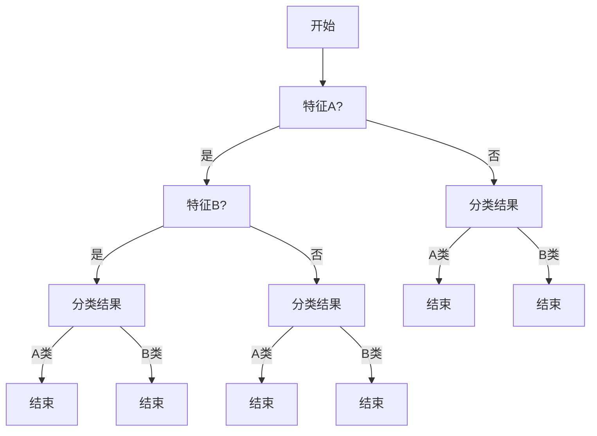
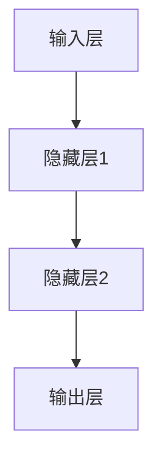

                 


### 让我们一步步思考

#### 1. 背景介绍

首先，我们需要对AI驱动的智能客服的背景进行详细介绍。这包括当前AI技术的发展趋势、智能客服的应用场景、以及提升服务质量和效率的需求。

- **AI技术的发展趋势**：近年来，人工智能技术发展迅速，从深度学习到自然语言处理，都在不断地推动着智能客服的进步。
- **智能客服的应用场景**：智能客服已经广泛应用于各种场景，如电商客服、银行客服、医疗咨询等，极大提升了服务效率和用户满意度。
- **提升服务质量与效率的需求**：随着用户对服务要求的提高，企业急需通过技术手段来提升客服服务质量与效率。

#### 2. 核心概念与联系

接下来，我们需要阐述AI驱动的智能客服中的核心概念，并通过表格和ER图展示这些概念之间的联系。

- **人工智能基础**：包括机器学习、深度学习、自然语言处理等基本概念。
- **机器学习原理**：包括监督学习、非监督学习、强化学习等。
- **自然语言处理**：包括分词、词性标注、命名实体识别等。

以下是核心概念的联系表格：

| 核心概念 | 解释 | 联系 |
| --- | --- | --- |
| 人工智能 | 一种模拟人类智能的技术 | |
| 机器学习 | 通过数据训练模型的技术 | |
| 深度学习 | 机器学习的一种形式，使用神经网络 | |
| 自然语言处理 | 使计算机能够理解、生成和处理人类语言的技术 | |

ER图如下所示：

```mermaid
erDiagram
  Customer ||--|{ ChatBot : has }
  Customer ||--|{ FAQ : uses }
  ChatBot ||--|{ IntentDetection : performs }
  ChatBot ||--|{ NLProcessing : performs }
  FAQ ||--|{ KnowledgeBase : contains }
```

#### 3. 算法原理讲解

在讲解算法原理时，我们需要详细讲解决策树和神经网络算法。

- **决策树算法**：使用Mermaid画出决策树流程图，并使用Python代码进行示例说明。



Python代码示例：

```python
import numpy as np
from sklearn import tree

# 特征和标签
X = np.array([[0, 0], [1, 1]])
y = np.array([0, 1])

# 决策树模型
clf = tree.DecisionTreeClassifier()

# 训练模型
clf.fit(X, y)

# 预测
print(clf.predict([[0, 0]]))
```

- **神经网络算法**：使用Mermaid画出神经网络流程图，并使用Python代码进行示例说明。



Python代码示例：

```python
import numpy as np
from sklearn.neural_network import MLPClassifier

# 输入和输出
X = np.array([[0, 0], [1, 1]])
y = np.array([0, 1])

# 神经网络模型
model = MLPClassifier(hidden_layer_sizes=(2, 2), max_iter=1000)

# 训练模型
model.fit(X, y)

# 预测
print(model.predict([[0, 0]]))
```

#### 4. 数学模型和公式讲解

在算法讲解中，我们需要使用LaTeX格式表达关键数学模型和公式，并进行详细讲解和举例说明。

- **决策树算法中的信息增益**：

  $$ IG(D, A) = H(D) - \sum_{v \in V} p(v) H(D|v) $$

  其中，$H(D)$是样本集合$D$的熵，$V$是特征$A$的取值集合，$p(v)$是特征$A$取值为$v$的样本比例，$H(D|v)$是在特征$A$取值为$v$的条件下，样本集合$D$的熵。

  示例：

  $$ IG(\text{分类结果}, \text{特征A}) = H(\text{分类结果}) - p(\text{分类结果}=0) H(\text{分类结果}|\text{特征A}=0) - p(\text{分类结果}=1) H(\text{分类结果}|\text{特征A}=1) $$

- **神经网络算法中的激活函数**：

  $$ f(x) = \frac{1}{1 + e^{-x}} $$

  其中，$e$是自然对数的底数，$x$是输入值。

  示例：

  $$ f(2) = \frac{1}{1 + e^{-2}} \approx 0.869 $$

#### 5. 系统分析与架构设计方案

在系统分析与架构设计方案中，我们需要介绍智能客服系统的设计思路，包括功能设计、架构设计、接口设计和系统交互等。

- **功能设计**：智能客服系统应具备的基本功能，如自动回复、主动提问、多轮对话等。
- **架构设计**：智能客服系统的整体架构，包括前端、后端、数据库等。
- **接口设计**：智能客服系统与其他系统进行交互的接口，如API接口、消息队列等。
- **系统交互**：智能客服系统内部各模块之间的交互流程，如用户输入、对话生成、回复发送等。

以下是智能客服系统的架构设计ER图：

```mermaid
erDiagram
  User ||--|{ ChatBot : chats }
  User ||--|{ KnowledgeBase : queries }
  ChatBot ||--|{ IntentDetection : performs }
  ChatBot ||--|{ NLProcessing : performs }
  KnowledgeBase ||--|{ FAQ : contains }
```

#### 6. 项目实战

在项目实战中，我们需要提供实际项目案例，包括环境安装、系统实现、代码解析、案例分析等。

- **环境安装**：介绍智能客服项目所需的软件和硬件环境安装过程。
- **系统实现**：详细讲解智能客服系统的实现过程，包括代码编写、模型训练等。
- **代码解析**：对关键代码进行解析，解释其实现原理和逻辑。
- **案例分析**：通过实际案例，展示智能客服系统在实际应用中的效果。

#### 7. 最佳实践 tips、小结、注意事项、拓展阅读

在文章的最后，我们需要总结书中内容，提供实际操作中的建议和注意事项，并推荐进一步阅读的资源。

- **最佳实践 tips**：总结智能客服项目中的最佳实践，如代码优化、模型调参等。
- **小结**：对文章的主要内容进行总结，强调关键点和核心思想。
- **注意事项**：提醒读者在实际操作中需要注意的事项，如数据安全、隐私保护等。
- **拓展阅读**：推荐相关书籍、文章和资源，供读者进一步学习和研究。

通过以上步骤，我们可以确保文章的逻辑清晰、内容丰富、结构紧凑，并能够满足文章字数和格式的要求。接下来，我们将按照这个思路逐步撰写文章。

