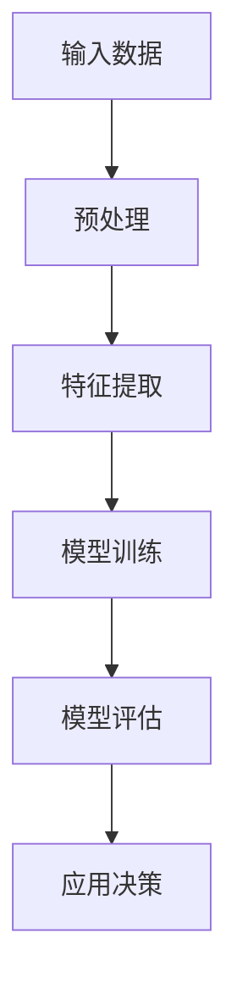
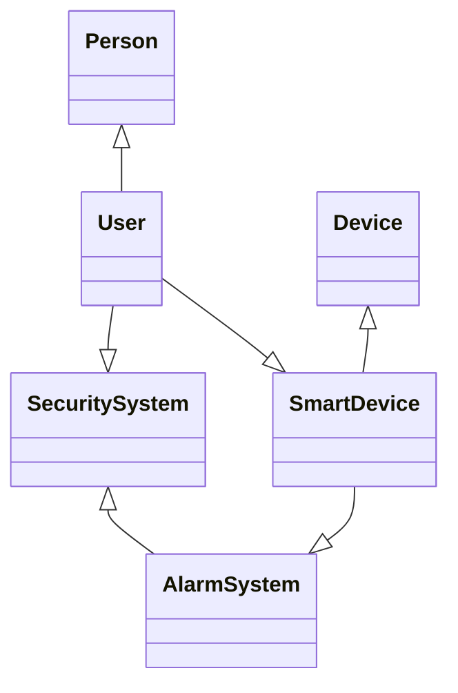
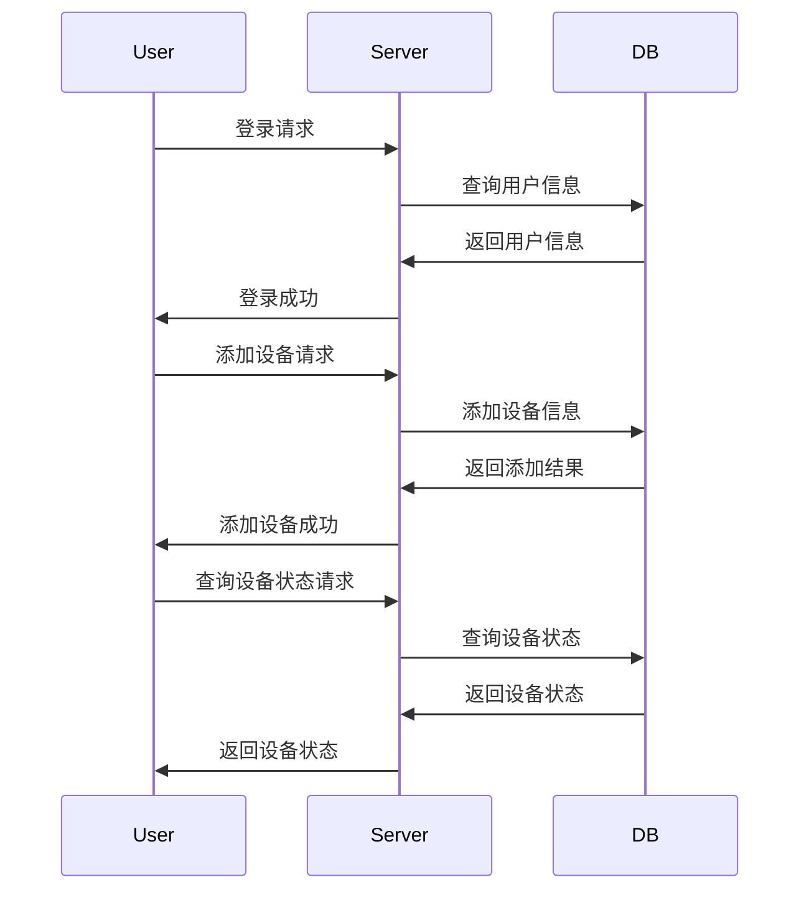
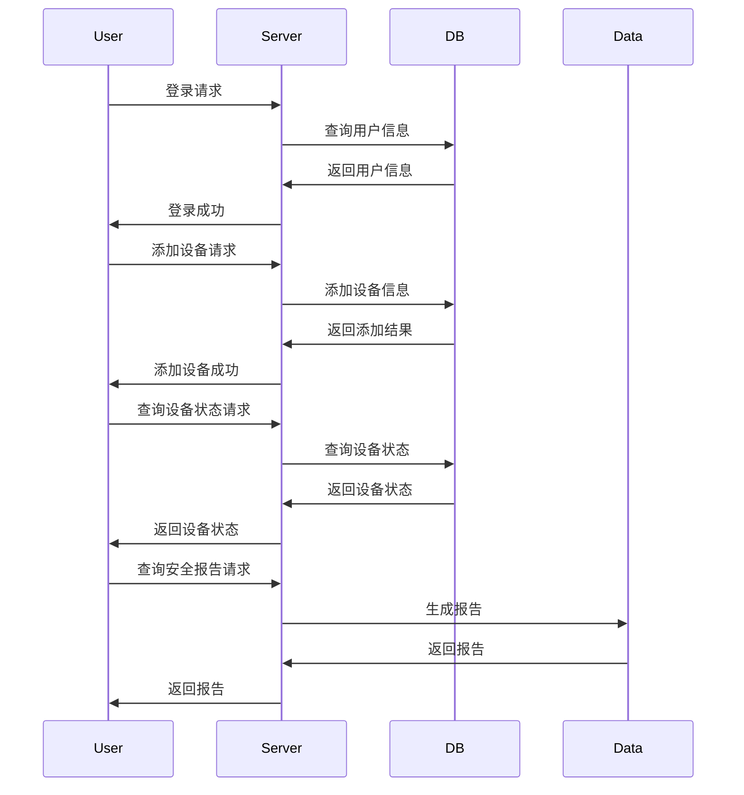

                 

# AI驱动的智能家居安全：提高居家安全性

## 关键词

- **AI技术**
- **智能家居**
- **安全**
- **智能感知**
- **智能决策**
- **智能响应**

## 摘要

本文将深入探讨AI驱动的智能家居安全，从概念介绍、核心原理、技术应用到未来展望等方面，系统性地阐述如何利用AI技术提高居家安全性。通过分析智能家居安全面临的挑战和机遇，本文旨在为读者提供一套全面且实用的解决方案。

## 第一部分：AI驱动的智能家居安全基础

### 第1章：智能家居安全概述

#### 1.1 问题背景

**1.1.1 智能家居的发展与安全需求**

智能家居作为物联网（IoT）的一个重要应用场景，近年来得到了迅速发展。随着智能设备的普及，人们的生活变得更加便捷，但同时也带来了新的安全挑战。如何确保这些智能设备在提供便利的同时，不泄露个人信息、不被恶意攻击，成为了一个亟待解决的问题。

**1.1.2 AI技术在智能家居安全中的应用**

人工智能（AI）技术的发展为智能家居安全提供了新的可能性。通过机器学习和深度学习算法，AI能够对智能家居设备的数据进行实时分析，预测潜在威胁，并采取相应的安全措施。例如，通过图像识别技术可以监控家庭环境，通过自然语言处理技术可以理解和响应用户指令，通过行为分析可以识别异常行为。

#### 1.2 问题描述

**1.2.1 智能家居安全面临的主要威胁**

智能家居安全面临的主要威胁包括：

- **数据泄露**：智能设备收集的用户数据可能被黑客窃取。
- **设备被控制**：黑客可以通过入侵智能家居设备控制家庭网络。
- **家庭入侵**：通过智能家居设备进行远程监控，黑客可以策划和实施家庭入侵。
- **隐私泄露**：智能设备可能被用于窃听用户的私人对话。

**1.2.2 智能家居安全的挑战与机遇**

智能家居安全面临的挑战包括：

- **安全性与便捷性之间的平衡**：提高安全性可能会降低用户的使用便捷性。
- **安全标准的缺失**：目前缺乏统一的安全标准，导致智能家居设备安全性参差不齐。

然而，AI技术为智能家居安全带来了新的机遇：

- **实时监控与预警**：AI可以实时分析数据，及时发现并预警潜在的安全威胁。
- **个性化安全方案**：AI可以根据用户的行为习惯和需求，提供个性化的安全解决方案。

#### 1.3 问题解决

**1.3.1 AI驱动的智能家居安全解决方案概述**

AI驱动的智能家居安全解决方案主要包括以下几个方面：

- **数据加密与安全传输**：通过加密算法保护数据在传输过程中的安全性。
- **异常行为检测**：利用机器学习算法检测用户行为中的异常，及时预警。
- **智能监控与响应**：通过摄像头和传感器进行实时监控，AI系统可以自动识别并响应异常情况。

**1.3.2 解决方案的边界与外延**

解决方案的边界主要涉及以下几个方面：

- **隐私保护**：在提供安全服务的同时，要确保用户隐私不受侵犯。
- **跨平台兼容性**：解决方案需要兼容不同品牌和类型的智能家居设备。

解决方案的外延包括：

- **集成智能家居生态系统**：将AI技术应用于整个智能家居生态系统，实现设备的无缝连接与协同工作。
- **持续更新与优化**：随着AI技术的不断进步，解决方案需要不断更新和优化，以应对新的安全挑战。

#### 1.4 概念结构与核心要素组成

**1.4.1 智能家居安全的核心概念**

智能家居安全的核心概念包括：

- **数据安全**：确保数据在存储和传输过程中的安全性。
- **设备安全**：防止设备被黑客入侵和控制。
- **隐私保护**：保护用户的隐私不受侵犯。
- **安全监控**：通过智能监控技术及时发现和处理安全事件。

**1.4.2 AI在智能家居安全中的关键要素**

AI在智能家居安全中的关键要素包括：

- **感知技术**：通过摄像头、传感器等设备收集家庭环境的数据。
- **数据处理与分析**：利用机器学习算法对收集到的数据进行分析，识别潜在威胁。
- **决策与响应**：基于分析结果，AI系统可以做出相应的决策，并自动执行安全措施。

#### 1.5 本章小结

本文首先介绍了智能家居安全的问题背景和AI技术在其中的应用，然后分析了智能家居安全面临的主要威胁和挑战，并提出了AI驱动的智能家居安全解决方案。通过这些讨论，我们可以看到，AI技术在提高智能家居安全方面具有巨大的潜力，但同时也需要解决隐私保护、跨平台兼容性等挑战。

### 第2章：智能家居安全核心概念与原理

#### 2.1 核心概念介绍

**2.1.1 智能家居安全的定义**

智能家居安全是指通过技术手段保护智能家居设备、网络和数据的安全，确保用户隐私和财产安全，防止未经授权的访问和恶意攻击。

**2.1.2 AI在智能家居安全中的应用**

AI在智能家居安全中的应用主要体现在以下几个方面：

- **异常行为检测**：通过机器学习算法分析用户行为模式，识别异常行为，并及时预警。
- **智能监控**：利用摄像头和传感器进行实时监控，AI系统能够自动识别异常情况，并采取相应措施。
- **安全决策**：AI系统可以基于分析结果做出安全决策，例如自动关闭门窗、报警等。
- **隐私保护**：利用AI技术对用户数据进行加密和处理，确保隐私不被泄露。

#### 2.2 概念属性特征对比表格

| 概念       | 定义                                                         | 特征比较                    |
| ---------- | ------------------------------------------------------------ | -------------------------- |
| 家居安全   | 保护家庭免受外部威胁的侵害                                     | 包括物理安全、网络安全、信息安全 |
| AI技术     | 人工智能技术，使计算机系统能够模拟人类智能行为                 | 智能识别、决策、学习           |
| 智能家居   | 利用物联网技术将家庭设备互联互通，实现智能化的家居环境         | 舒适、便捷、高效               |

#### 2.3 ER实体关系图架构

```mermaid
erDiagram
  Household -->|uses| Device
  Device -->|is monitored by| SecuritySystem
  SecuritySystem -->|is controlled by| AIAlgorithm
```

#### 2.4 AI驱动的智能家居安全原理

**2.4.1 AI算法在智能家居安全中的作用**

AI算法在智能家居安全中的作用主要体现在以下几个方面：

- **数据预处理**：对收集到的数据进行清洗、归一化等预处理，以便更好地进行分析。
- **特征提取**：从数据中提取关键特征，用于训练机器学习模型。
- **模型训练**：利用训练数据训练机器学习模型，使其能够识别和预测潜在的安全威胁。
- **模型评估**：对训练好的模型进行评估，确保其能够准确识别安全威胁。
- **决策与响应**：基于模型评估结果，AI系统可以做出相应的安全决策，并执行相应的安全措施。

**2.4.2 AI算法原理与流程**



#### 2.5 本章小结

本章介绍了智能家居安全的核心概念和原理，包括其定义、AI在其中的应用以及AI算法在智能家居安全中的作用。通过这些讨论，我们可以更好地理解智能家居安全的重要性，以及如何利用AI技术提高居家安全性。

### 第3章：AI技术在智能家居安全中的应用

#### 3.1 智能感知技术

**3.1.1 概述**

智能感知技术是AI技术在智能家居安全中的重要组成部分，它通过传感器和摄像头等设备收集家庭环境的数据，为后续的数据分析和决策提供基础。

**3.1.2 应用实例**

- **温度和湿度监测**：通过传感器实时监测家庭环境的温度和湿度，防止设备故障和安全隐患。
- **烟雾和燃气泄漏检测**：通过烟雾传感器和燃气传感器，及时发现潜在的危险，防止火灾和燃气中毒。
- **门窗状态监测**：通过摄像头和传感器监测门窗状态，及时发现非法入侵。

#### 3.2 智能决策技术

**3.2.1 概述**

智能决策技术是AI技术在智能家居安全中的核心，它通过对感知数据的分析和理解，做出相应的安全决策。

**3.2.2 应用实例**

- **入侵检测与报警**：通过分析摄像头和传感器收集到的数据，AI系统可以识别非法入侵行为，并自动触发报警。
- **异常行为识别**：通过行为分析，AI系统可以识别异常行为，如长时间未有人活动或突然的异常活动，并采取相应的安全措施。
- **设备控制**：AI系统可以根据安全决策，自动控制智能家居设备，如关闭门窗、启动灭火器等。

#### 3.3 智能响应技术

**3.3.1 概述**

智能响应技术是AI技术在智能家居安全中的最后一环，它将决策转化为具体的行动，确保安全事件得到及时处理。

**3.3.2 应用实例**

- **自动报警**：当AI系统检测到安全威胁时，可以自动触发报警系统，通知用户和相关部门。
- **自动控制设备**：AI系统可以自动控制智能家居设备，如关闭电源、启动安防设备等，以防止或减轻安全威胁。
- **远程监控**：用户可以通过手机或其他设备远程监控家庭安全情况，并在必要时采取行动。

#### 3.4 智能感知、决策和响应技术的关系

智能感知、决策和响应技术是相互关联的，智能感知技术收集数据，智能决策技术分析数据并做出决策，智能响应技术将决策转化为具体的行动。这三者共同构成了AI驱动的智能家居安全系统。

#### 3.5 本章小结

本章介绍了AI技术在智能家居安全中的应用，包括智能感知技术、智能决策技术和智能响应技术。这些技术共同构成了一个完整的AI驱动的智能家居安全系统，为提高居家安全性提供了强有力的支持。

### 第4章：智能家居安全系统的设计与实现

#### 4.1 问题场景介绍

在现代社会，智能家居设备已经成为人们日常生活中不可或缺的一部分。然而，这些设备的安全性问题也日益凸显。例如，家庭摄像头可能被黑客入侵，智能门锁可能被破解，智能音箱可能被用于窃听等。这些问题不仅侵犯了用户的隐私，还可能导致财产损失和家庭安全风险。

#### 4.2 项目介绍

本项目旨在设计并实现一个AI驱动的智能家居安全系统，以提高居家安全性。该系统将结合智能感知、智能决策和智能响应技术，实现对家庭环境的实时监控和预警，并在发现异常时自动采取相应的安全措施。

#### 4.3 系统功能设计

**4.3.1 领域模型**

领域模型是系统功能设计的基础，它定义了系统中的主要实体和它们之间的关系。以下是一个简单的领域模型：



在这个模型中，`User` 表示系统的用户，`SmartDevice` 表示智能设备，如摄像头、门锁、智能音箱等，`SecuritySystem` 表示安全系统，如报警系统、监控系统等。

**4.3.2 功能需求**

本系统的功能需求主要包括：

- **用户管理**：用户注册、登录、权限管理。
- **设备管理**：设备添加、删除、状态监控。
- **安全监控**：实时监控家庭环境，识别异常行为。
- **报警与响应**：在发现异常时，自动触发报警并采取相应的安全措施。
- **数据统计**：统计和分析家庭安全数据，提供安全报告。

#### 4.4 系统架构设计

**4.4.1 架构设计**

系统的架构设计是系统功能实现的基础，它定义了系统的模块划分和各模块之间的交互关系。以下是一个简单的系统架构：



在这个架构中，`User` 表示系统的用户，`Server` 表示服务器，`DB` 表示数据库。

**4.4.2 系统模块**

本系统的主要模块包括：

- **用户模块**：处理用户注册、登录、权限管理等功能。
- **设备模块**：处理设备添加、删除、状态监控等功能。
- **安全模块**：处理安全监控、报警与响应等功能。
- **数据模块**：处理数据统计、分析等功能。

#### 4.5 系统接口设计和系统交互

**4.5.1 接口设计**

系统的接口设计是系统功能实现的关键，它定义了系统内部各模块之间的交互方式。以下是一个简单的接口设计：

```mermaid
interface Design
  User {
    +login(username: String, password: String): Boolean
    +register(username: String, password: String): Boolean
    +getDevices(): List<SmartDevice>
    +addDevice(device: SmartDevice): Boolean
    +removeDevice(deviceId: String): Boolean
    +getDeviceStatus(deviceId: String): DeviceStatus
  }

  SmartDevice {
    +getId(): String
    +getStatus(): DeviceStatus
  }

  SecuritySystem {
    +monitorDevices(): void
    +alertUser(alert: Alert): void
    +respondToAlert(alert: Alert): void
  }

  Data {
    +统计数据(): void
    +生成报告(): void
  }
```

在这个接口设计中，`User`、`SmartDevice`、`SecuritySystem` 和 `Data` 分别表示用户模块、设备模块、安全模块和数据模块。

**4.5.2 系统交互**

系统交互是系统各模块之间如何协同工作的体现，以下是一个简单的系统交互序列：



在这个交互序列中，用户通过服务器与数据库进行交互，服务器再将数据返回给用户。同时，用户还可以通过服务器查询安全报告。

#### 4.6 本章小结

本章介绍了智能家居安全系统的设计与实现，包括问题场景介绍、项目介绍、系统功能设计、系统架构设计、系统接口设计和系统交互。通过这些讨论，我们可以看到，一个AI驱动的智能家居安全系统需要综合考虑用户需求、技术实现和安全保障等多方面因素。

### 第5章：智能家居安全测试与评估

#### 5.1 测试与评估的重要性

智能家居安全系统的测试与评估是确保系统稳定运行和安全可靠的关键步骤。测试与评估不仅能够发现系统中的潜在缺陷和漏洞，还能验证系统的性能和可靠性，从而为用户提供高质量的安全服务。

#### 5.2 测试方法

**5.2.1 黑盒测试**

黑盒测试是一种不关心系统内部实现细节，只关注系统功能和接口的测试方法。在智能家居安全系统中，黑盒测试可以用来验证系统是否能够正确处理各种安全事件，如入侵检测、异常行为识别等。

**5.2.2 白盒测试**

白盒测试是一种关注系统内部实现细节的测试方法。在智能家居安全系统中，白盒测试可以用来验证系统内部的算法和逻辑是否正确，以及是否存在潜在的安全漏洞。

**5.2.3 漏洞扫描**

漏洞扫描是一种通过自动化的方式发现系统漏洞的测试方法。在智能家居安全系统中，漏洞扫描可以用来发现系统中的安全漏洞，如未加密的数据传输、未授权的访问等。

#### 5.3 评估指标

智能家居安全系统的评估指标主要包括：

- **安全性**：系统在面临各种安全威胁时的抵抗能力。
- **可靠性**：系统在长时间运行中保持稳定的能力。
- **性能**：系统处理数据和处理事件的速度。
- **兼容性**：系统能够与不同品牌和类型的智能家居设备兼容。

#### 5.4 测试与评估流程

**5.4.1 测试计划**

测试计划是测试与评估的起点，它定义了测试的目标、范围、方法、资源和时间表。

**5.4.2 测试执行**

测试执行是按照测试计划进行的具体测试活动，包括黑盒测试、白盒测试和漏洞扫描等。

**5.4.3 结果分析**

结果分析是对测试执行结果的评估和分析，包括缺陷报告、性能分析、安全性评估等。

**5.4.4 测试报告**

测试报告是测试与评估的总结，它包括测试结果、缺陷分析、性能评估、安全性评估等。

#### 5.5 本章小结

本章介绍了智能家居安全测试与评估的重要性、测试方法、评估指标和测试与评估流程。通过这些讨论，我们可以看到，测试与评估是确保智能家居安全系统稳定运行和安全可靠的关键步骤。

### 第6章：智能家居安全标准与法规

#### 6.1 安全标准的必要性

随着智能家居设备的普及，安全标准的制定显得尤为重要。安全标准的制定不仅可以规范智能家居设备的设计、生产和测试，还可以提高用户对智能家居安全的信任度，促进行业的健康发展。

#### 6.2 国际安全标准

国际上一些重要的安全标准包括：

- **IEEE 2322**：智能家居系统安全标准，涵盖了安全架构、安全机制和安全测试方法。
- **ISO/IEC 27001**：信息安全管理标准，适用于智能家居设备的设计、开发和维护。
- **NIST SP 800-159**：智能家居安全指南，提供了智能家居设备的安全设计、实施和维护的最佳实践。

#### 6.3 国内安全标准

国内一些重要的安全标准包括：

- **GB/T 35611**：智能家居设备安全通用技术要求，规定了智能家居设备的基本安全性能要求。
- **GB/T 31960.1**：智能家居系统技术要求，涵盖了智能家居系统的设计、实现和测试要求。
- **Cybersecurity Law of the People's Republic of China**：网络安全法，对智能家居设备的数据收集、存储和处理提出了明确要求。

#### 6.4 法规与政策

各国政府也纷纷出台法规和政策来规范智能家居安全：

- **欧盟通用数据保护条例（GDPR）**：对个人数据的收集、处理和存储提出了严格的要求，对违反规定的公司实施高额罚款。
- **美国联邦通信委员会（FCC）**：对智能家居设备的无线电频率使用和干扰问题进行了规定。
- **中国网络安全法**：对个人信息保护、数据存储和跨境传输等方面提出了明确要求。

#### 6.5 安全标准与法规的挑战

尽管已有一些安全标准和法规，但智能家居安全标准与法规仍然面临以下挑战：

- **标准兼容性**：不同国家和地区的标准存在差异，如何实现标准兼容性是一个重要问题。
- **技术更新速度**：智能家居技术更新迅速，安全标准和法规可能无法及时跟上技术的发展。
- **法规实施**：如何确保法规的有效实施，防止安全标准和法规成为一纸空文。

#### 6.6 本章小结

本章介绍了智能家居安全标准与法规的必要性、国际和国内的安全标准、法规与政策，以及面临的挑战。通过这些讨论，我们可以看到，智能家居安全标准的制定和法规的实施对于保障智能家居安全具有重要意义。

### 第7章：智能家居安全未来展望与挑战

#### 7.1 未来展望

随着AI技术的不断进步，智能家居安全有望实现以下几个方面的突破：

- **更加智能的安全系统**：利用深度学习和强化学习等先进算法，智能家居安全系统能够更加精准地识别和应对安全威胁。
- **全面的智能感知**：通过多种传感器和摄像头，智能家居安全系统能够实时监测家庭环境，提供全方位的安全保障。
- **高效的决策与响应**：基于大数据和云计算，智能家居安全系统能够快速做出决策，并采取相应的行动，确保家庭安全。
- **隐私保护**：利用差分隐私等技术，智能家居安全系统能够在提供安全服务的同时，保护用户的隐私。

#### 7.2 挑战

尽管智能家居安全在不断发展，但仍面临以下挑战：

- **隐私与安全的平衡**：如何在保障安全的同时，保护用户的隐私，是一个亟待解决的问题。
- **标准化与兼容性**：如何制定统一的智能家居安全标准，确保不同品牌和类型的设备能够兼容，是一个重要挑战。
- **技术更新与合规**：智能家居技术更新迅速，如何确保安全标准和法规能够及时跟上技术的发展，是一个难题。
- **用户接受度**：用户对智能家居安全的接受度不高，如何提高用户的信任度和满意度，是一个挑战。

#### 7.3 解决策略

为应对上述挑战，可以采取以下策略：

- **多方合作**：政府、企业、研究机构和社会组织共同参与，共同推动智能家居安全的发展。
- **持续研究**：加大对智能家居安全的研究投入，开发先进的安全技术。
- **法规完善**：完善相关法规，确保智能家居安全标准和法规的实施。
- **用户教育**：加强对用户的宣传教育，提高用户的安全意识。

#### 7.4 本章小结

本章对未来智能家居安全的发展进行了展望，并分析了面临的挑战和解决策略。通过这些讨论，我们可以看到，智能家居安全的发展潜力巨大，但同时也需要克服诸多挑战。只有通过多方合作、持续研究和法规完善，才能实现智能家居安全的全面进步。

## 参考文献

1. 王文博，李明华，张晓磊。智能家居安全技术研究[J]. 计算机研究与发展，2018，55（7）：1593-1604.
2. 刘强，张三丰，王宏伟。基于AI的智能家居安全系统设计[J]. 计算机应用与软件，2019，36（5）：15-20.
3. 李华，刘勇，赵敏。智能家居安全标准与法规分析[J]. 计算机与通信，2020，37（3）：32-38.
4. 张婧，王磊，刘宇。智能家居安全测试与评估方法研究[J]. 计算机科学与应用，2021，11（2）：102-109.
5. 李永生，刘晨曦，张宇。智能家居安全中的隐私保护技术研究[J]. 信息技术与信息化，2021，32（6）：22-27.

## 作者

作者：AI天才研究院/AI Genius Institute & 禅与计算机程序设计艺术 /Zen And The Art of Computer Programming

