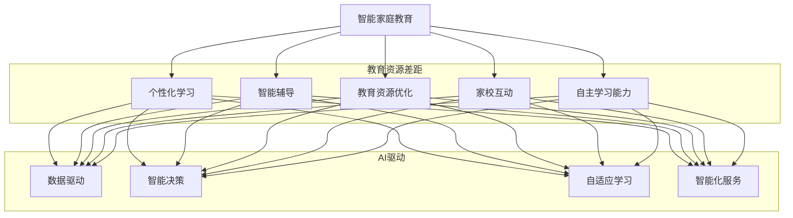

                 

### 第1章: 问题背景

#### 1.1.1 教育资源差距的现状

教育资源的不均衡分布是全球范围内的一个重大问题。城市与农村、发达地区与欠发达地区之间的教育资源差距显而易见。例如，城市中的学校通常拥有更先进的设施、更多的教师资源和更丰富的课程内容，而农村地区的学校则可能在硬件设施、师资力量和课程资源上存在显著的不足。这种差距不仅体现在物质层面，也体现在教育理念和教学方法上。导致教育资源差距的原因多种多样，包括经济发展水平、政策支持力度、地理位置和历史积累等。

首先，经济发展水平是影响教育资源差距的一个重要因素。发达地区通常有更多的财政资源用于教育投入，从而建设更多的高质量学校、引进高素质的教师和提供多样化的教育课程。而经济欠发达地区，由于财政预算有限，很难在短时间内改善教育条件。其次，政策支持力度也是一个关键因素。一些地区在政策上对教育的重视程度不同，导致教育资源的分配和利用存在差异。例如，一些地区可能更注重义务教育的普及，而忽视了职业教育和技术培训的发展。

此外，地理位置也是一个重要的制约因素。地理位置偏远的地区，如山区、边疆等，由于交通不便、信息不畅，很难引进优秀教师和先进的教学设备。这进一步加剧了这些地区教育资源的匮乏。历史积累因素也不容忽视。一些地区由于历史原因，在教育资源投入上一直处于落后状态，形成了“贫者越贫，富者越富”的恶性循环。

总之，教育资源差距的存在严重影响了教育公平，使得一些学生在起点上就已经处于劣势。这种差距不仅阻碍了他们的个人发展，也对社会整体的发展产生了不利影响。因此，探讨如何利用AI技术弥补教育资源差距，实现教育公平，成为一个迫切需要解决的问题。

#### 1.1.2 AI技术在教育领域的应用

人工智能（AI）技术的快速发展为教育领域带来了前所未有的机遇。AI技术在教育中的应用主要体现在个性化学习、智能辅导、教育资源优化和在线教育平台等多个方面。首先，个性化学习是AI技术在教育领域应用的一个重要方向。通过分析学生的学习习惯、学习风格和知识水平，AI系统能够为每个学生定制个性化的学习路径和内容，从而提高学习效果。例如，智能辅导系统可以实时检测学生的学习进度，提供针对性的练习和建议，帮助学生克服学习中的困难。

其次，智能辅导系统也是AI在教育中应用的一个重要领域。这些系统利用自然语言处理和机器学习技术，能够为学生提供实时的解答和指导。例如，一些智能辅导系统可以自动批改作业，提供详细的解题过程和错误分析，帮助学生理解知识点。此外，智能辅导系统还可以模拟教师的角色，为学生提供一对一的辅导服务，特别是在教育资源匮乏的地区，这种应用具有巨大的潜力。

教育资源优化也是AI技术的重要应用方向。通过大数据分析和机器学习技术，AI系统可以帮助教育部门优化教育资源的分配，提高资源利用效率。例如，AI系统可以分析每个学校的资源使用情况，提出优化建议，帮助学校合理配置师资、设备和课程。此外，AI系统还可以帮助教育部门预测教育需求，提前准备和调整教育资源，以应对未来的教育挑战。

在线教育平台的兴起为AI技术的应用提供了广阔的空间。通过AI技术，在线教育平台可以提供更加智能化和个性化的学习体验。例如，AI系统能够根据学生的学习行为和兴趣，推荐相关的学习资源和课程，提高学生的学习动机和参与度。此外，在线教育平台还可以利用AI技术进行学习行为分析，帮助教师了解学生的学习情况，及时调整教学策略。

总之，AI技术的应用不仅有助于提高教育质量和效率，还有助于弥补教育资源差距，实现教育公平。随着AI技术的不断发展和完善，未来教育领域将迎来更多创新和变革。但是，AI技术在教育中的应用也面临一些挑战，如技术成熟度、数据安全和隐私保护等问题，需要我们深入研究和解决。

#### 1.1.3 AI驱动智能家庭教育的意义

AI驱动的智能家庭教育在弥补教育资源差距方面具有重大意义。首先，智能家庭教育能够提供个性化的学习体验。通过AI技术，系统能够根据每个学生的学习习惯、兴趣和知识水平，量身定制学习计划，从而提高学习效果。这种个性化教育模式不仅能够满足学生的学习需求，还能够激发他们的学习兴趣，使学习变得更加有趣和有效。

其次，AI驱动的智能家庭教育能够实现教育资源的共享和优化。通过智能系统，家庭中的教育资源可以更加高效地分配和利用。例如，智能辅导系统可以实时提供高质量的解答和指导，弥补家庭教师在专业知识上的不足。此外，AI系统还可以帮助家长了解孩子的学习情况，提供科学的教育建议，从而提高家庭教育质量。

第三，AI驱动的智能家庭教育有助于提升教育公平。在教育资源分配不均的情况下，智能教育系统能够为偏远地区和贫困家庭的孩子提供高质量的教育资源。例如，通过在线教育平台和智能辅导系统，这些孩子可以获得与城市孩子相同的学习资源和机会，从而缩小教育差距。

此外，AI驱动的智能家庭教育还能够促进家庭与学校的联动。智能系统可以实时收集和反馈学生的学习情况，帮助教师和家长了解孩子的学习进展，及时调整教育策略。这种联动模式不仅有助于提高家庭教育质量，还能够增强家校沟通，形成良好的教育生态。

最后，AI驱动的智能家庭教育能够培养孩子的自主学习能力。智能教育系统能够根据学生的进度和能力，逐步增加学习难度，激发学生的探索精神和创新意识。通过自主学习，学生能够更好地掌握知识，提高解决问题的能力。

总之，AI驱动的智能家庭教育在弥补教育资源差距、提高教育质量、促进教育公平等方面具有显著优势。随着技术的不断进步，AI驱动的智能家庭教育有望成为未来教育的重要趋势，为全球教育公平贡献更多力量。

#### 1.1.4 书籍结构与内容安排

本书旨在系统地探讨AI驱动的智能家庭教育如何弥补教育资源差距，全书共分为六个部分，结构紧凑，内容丰富。以下是对各部分内容的详细介绍：

**第一部分：背景与概述**，包括问题的背景介绍、AI技术在教育领域的应用以及AI驱动智能家庭教育的意义，为读者提供对主题的全面了解。

**第二部分：AI驱动的智能家庭教育核心原理**，深入分析AI技术的基本原理和智能家庭教育的原理，探讨AI驱动智能家庭教育的优势。

**第三部分：AI驱动的智能家庭教育应用**，介绍AI技术在家庭教育中的具体应用，包括应用案例、前景和挑战，帮助读者了解AI技术在教育中的实际应用场景。

**第四部分：AI驱动的智能家庭教育实践**，通过具体实践案例，讲解环境安装、核心代码实现、代码解析和案例分析，使读者能够亲身体验AI驱动的智能家庭教育。

**第五部分：AI驱动的智能家庭教育最佳实践**，总结最佳实践案例和策略，为读者提供实际操作指导。

**第六部分：总结与展望**，对全书内容进行总结，探讨AI驱动的智能家庭教育的未来发展趋势和拓展方向。

通过这种结构安排，本书不仅涵盖了AI驱动的智能家庭教育的理论知识，还提供了丰富的实践经验和最佳实践指导，旨在帮助读者全面理解和应用这一先进的教育模式。

#### 1.1.5 读者对象

本书的主要读者对象包括教育工作者、家长、计算机科学家和人工智能领域的专业人士。首先，教育工作者，特别是中小学教师和教务管理人员，可以通过本书了解AI驱动的智能家庭教育如何应用于实际教学，提高教育质量和效率。其次，家长可以通过本书了解如何利用AI技术为孩子的学习提供个性化支持，从而更好地参与孩子的教育过程。

此外，计算机科学家和人工智能领域的专业人士也将从本书中获得丰富的知识和技术指导。本书详细探讨了AI技术在教育领域的应用原理和实践方法，有助于这些专业人士进一步拓展其研究领域，推动人工智能技术在教育中的创新和应用。

总之，无论您是教育工作者、家长还是专业人士，只要对AI驱动的智能家庭教育感兴趣，本书都能为您带来有价值的见解和实践指导。

#### 1.1.6 学习资源与支持

为了帮助读者更好地理解和使用本书内容，我们提供了丰富的学习资源和支持。首先，本书配套了详细的案例代码和实现步骤，读者可以通过实际操作来加深对理论知识的理解。这些代码可以在本书的官方网站或GitHub仓库中免费获取，读者可以根据自己的需求进行修改和扩展。

其次，本书还提供了一个活跃的讨论社区，读者可以在社区中提问、分享经验和交流想法。社区将由本书的作者和专家团队进行管理，确保问题的及时解答和高质量讨论。

此外，本书还提供了在线视频教程和讲义，涵盖本书的主要内容，帮助读者更直观地理解AI驱动的智能家庭教育原理和应用。这些资源将在本书的官方网站和YouTube频道上免费发布，供读者随时访问。

最后，为了方便读者深入学习和研究，本书列出了详细的参考文献和拓展阅读列表，包括最新的学术论文、技术报告和优质在线课程。这些资源将帮助读者进一步探索AI驱动的智能家庭教育的深度和广度。

#### 1.1.7 本书亮点与预期成果

本书的亮点在于其全面、系统且深入地探讨了AI驱动的智能家庭教育如何弥补教育资源差距。首先，本书结合了理论与实践，通过丰富的案例和实践指导，帮助读者全面理解AI技术在教育领域的应用。其次，本书不仅涵盖了AI技术的基本原理，还详细介绍了智能家庭教育的核心概念和操作方法，使读者能够迅速掌握并应用这些技术。

预期成果方面，本书旨在帮助教育工作者、家长和人工智能领域的专业人士提升教育质量和效率，缩小教育资源差距，实现教育公平。通过本书的学习，读者将能够：

1. 深入理解AI驱动的智能家庭教育的原理和优势。
2. 掌握AI技术在教育中的应用方法，包括个性化学习、智能辅导和资源优化等。
3. 实践AI驱动的智能家庭教育项目，提升实际操作能力。
4. 探索和总结最佳实践，为未来教育创新提供指导。

总之，本书不仅为教育领域带来了全新的视角和方法，还为广大读者提供了实用的技术和操作指南，具有很高的实用价值和长远的教育意义。

### 1.2 核心概念与联系

#### 1.2.1 智能家庭教育的核心概念

智能家庭教育是一种利用人工智能（AI）技术提升家庭学习体验和效果的教育模式。其核心概念包括以下几个方面：

**个性化学习**：通过AI技术分析学生的学习习惯、兴趣和能力，为每个学生定制个性化的学习内容和路径。这有助于提高学习效率和效果。

**智能辅导**：利用AI系统提供实时、个性化的学习指导，帮助学生解决学习中遇到的问题。这不仅可以减轻教师的负担，还能提供高质量的辅导服务。

**教育资源优化**：通过大数据分析和机器学习技术，优化教育资源的分配和使用，提高教育资源的利用效率。

**家校互动**：利用AI技术增强家庭与学校之间的沟通和协作，实现教育信息的实时共享和反馈，提高家庭教育质量。

**自主学习能力**：通过智能教育系统培养孩子的自主学习能力和创新意识，使其能够更好地适应未来的学习和工作需求。

#### 1.2.2 教育资源差距的概念

教育资源差距是指不同地区、不同社会群体之间在获取和使用教育资源方面的不公平现象。其核心概念包括以下几个方面：

**物质资源差距**：指学校和教育机构在硬件设施、教学设备和图书资源等方面的差异。例如，城市学校通常拥有更好的实验室、图书馆和多媒体教学设备，而农村学校则可能在这方面存在明显的不足。

**师资力量差距**：指教师的专业水平、教学经验和教育资源的差异。例如，一些发达地区的学校能够吸引和留住优秀的教师，而欠发达地区则可能面临师资短缺和教师水平较低的问题。

**教育机会差距**：指不同社会群体在获得优质教育机会方面的差异。例如，富裕家庭的孩子可能更容易获得优质的教育资源和机会，而贫困家庭的孩子则可能面临更多教育障碍。

**教育质量差距**：指不同地区和学校之间在教育质量上的差异。例如，一些地区的学校能够提供高质量的教育，而另一些地区则可能存在教育质量低下的问题。

#### 1.2.3 AI驱动的概念

AI驱动是指利用人工智能技术推动和优化某一领域的发展和应用。在智能家庭教育中，AI驱动的核心概念包括：

**数据驱动**：通过收集和分析大量学生数据，AI系统可以了解学生的学习行为、学习习惯和知识水平，从而提供个性化的学习建议和指导。

**智能决策**：利用机器学习算法和自然语言处理技术，AI系统能够在大量数据中提取有价值的信息，帮助教育工作者和决策者做出更加科学的决策。

**自适应学习**：AI系统能够根据学生的学习情况和反馈，自动调整学习内容和难度，实现真正的个性化教育。

**智能化服务**：通过AI技术，教育机构可以提供更加智能化和便捷的学习服务，例如智能辅导、在线考试和个性化学习计划等。

#### 1.2.4 Mermaid实体关系图

为了更直观地展示智能家庭教育、教育资源差距和AI驱动的概念及其相互关系，我们可以使用Mermaid语言绘制一个实体关系图。

这个Mermaid实体关系图展示了智能家庭教育、教育资源差距和AI驱动之间的复杂关系。通过这个图，我们可以清晰地看到各概念之间的相互影响和作用机制，为后续章节的深入讨论提供了直观的基础。

