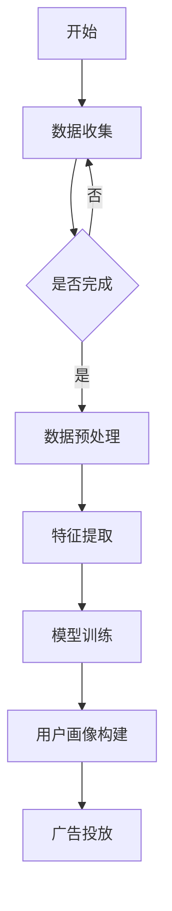

                 

# AI驱动的智能广告投放：精准定向与效果优化

> 关键词：AI、广告投放、精准定向、效果优化

> 摘要：本文将深入探讨AI在智能广告投放中的重要作用，包括精准定向与效果优化。我们将通过具体案例分析，揭示AI技术在广告行业中的应用价值。

## 第1章 引言

### 1.1 广告行业现状与挑战

广告行业作为现代商业的重要组成部分，随着互联网和数字技术的发展，已经呈现出快速增长的趋势。然而，广告投放过程中仍然存在诸多挑战：

- **广告投放成本高**：传统广告投放方式难以精确触达目标用户，导致广告资源浪费。
- **用户注意力分散**：互联网上的广告种类繁多，用户注意力难以集中，广告效果难以衡量。
- **数据隐私问题**：广告投放过程中涉及大量用户数据，数据隐私保护成为一大难题。

AI技术的引入为广告行业带来了新的机遇：

- **精准定向**：通过分析用户行为和兴趣数据，AI可以精准定位目标用户，提高广告投放效果。
- **效果优化**：AI算法可以自动调整广告投放策略，优化广告效果，降低投放成本。

### 1.2 AI在广告投放中的应用

AI在广告投放中的应用主要体现在以下几个方面：

- **广告创意生成**：利用自然语言处理技术，AI可以自动生成创意广告文案和图片。
- **用户行为分析**：通过大数据分析，AI可以挖掘用户行为模式，为精准定向提供支持。
- **广告投放优化**：利用机器学习算法，AI可以自动调整广告投放策略，优化广告效果。

## 第2章 AI驱动的智能广告投放基础

### 2.1 AI基本原理

#### 2.1.1 机器学习基础

机器学习是AI的核心技术之一，它通过算法让计算机从数据中学习规律，从而进行预测和决策。机器学习的主要任务包括：

- **分类**：根据数据特征进行分类。
- **回归**：预测数据特征与目标值之间的关系。
- **聚类**：将数据分为若干个类别。

#### 2.1.2 深度学习原理

深度学习是机器学习的一种重要分支，它通过构建多层神经网络，对大量数据进行训练，从而实现复杂任务的自动化。深度学习的关键技术包括：

- **卷积神经网络（CNN）**：主要用于图像识别任务。
- **循环神经网络（RNN）**：主要用于序列数据处理。
- **生成对抗网络（GAN）**：主要用于图像生成和图像修复。

#### 2.1.3 广告投放中的常用算法

在广告投放中，常用的算法包括：

- **协同过滤算法**：基于用户历史行为数据，推荐潜在感兴趣的商品或内容。
- **决策树算法**：用于广告投放策略的决策。
- **强化学习算法**：用于动态调整广告投放策略。

### 2.2 广告投放流程

广告投放的基本流程包括：

- **需求分析**：明确广告投放的目标和预算。
- **目标用户定位**：通过用户画像和兴趣标签，确定广告投放的目标用户。
- **广告创意设计**：设计吸引人的广告内容。
- **广告投放**：根据广告投放策略，将广告推送给目标用户。
- **效果评估**：分析广告投放效果，调整投放策略。

## 第3章 精准定向技术

### 3.1 用户画像构建

用户画像是指通过对用户的行为数据进行分析，构建出用户的全面特征描述。用户画像的构建方法包括：

- **数据收集**：收集用户行为数据，如浏览记录、搜索历史、购买记录等。
- **数据预处理**：对收集到的数据进行分析和清洗，去除噪声数据。
- **特征提取**：从数据中提取出具有代表性的特征。
- **模型训练**：使用机器学习算法，对用户行为数据进行分析，构建用户画像。

### 3.2 定向技术概述

定向广告是指根据用户特征，将广告推送给特定人群。定向广告的类型包括：

- **人口属性定向**：根据用户的年龄、性别、地域等人口属性进行定向。
- **兴趣定向**：根据用户的兴趣爱好、行为习惯等特征进行定向。
- **行为定向**：根据用户的浏览行为、搜索行为等进行定向。

定向广告的优势包括：

- **提高广告投放效果**：通过精准定向，提高广告的点击率和转化率。
- **降低广告投放成本**：避免广告资源的浪费，降低广告投放成本。

### 3.3 实战：基于用户行为的定向

#### 3.3.1 用户行为数据收集

用户行为数据可以通过以下渠道收集：

- **网站日志**：记录用户在网站上的浏览行为。
- **APP日志**：记录用户在APP上的使用行为。
- **社交媒体**：收集用户在社交媒体上的互动数据。

#### 3.3.2 用户行为分析

用户行为分析主要包括：

- **行为特征提取**：从用户行为数据中提取出具有代表性的特征。
- **行为模式识别**：分析用户的行为模式，挖掘用户的需求和偏好。

#### 3.3.3 定向策略制定

根据用户行为分析结果，制定相应的定向策略，包括：

- **广告内容定制**：根据用户行为特征，设计个性化的广告内容。
- **广告投放渠道选择**：根据用户行为特征，选择合适的广告投放渠道。

## 第4章 效果优化策略

### 4.1 广告创意优化

广告创意是指广告的视觉设计和文案内容。广告创意优化的方法包括：

- **A/B测试**：对不同创意进行对比测试，选择效果最好的广告。
- **用户反馈**：收集用户对广告的反馈，优化广告内容。

### 4.2 广告出价策略

广告出价是指广告主为获取广告展示机会而支付的费用。广告出价策略包括：

- **固定出价**：广告主设定一个固定的出价。
- **动态出价**：根据广告投放效果，自动调整出价。

### 4.3 广告效果评估

广告效果评估是指对广告投放效果进行评估，以确定广告投放的效果。广告效果评估的方法包括：

- **点击率评估**：评估广告的点击率，判断广告的吸引力。
- **转化率评估**：评估广告带来的转化效果，判断广告的有效性。

## 第5章 AI在广告投放中的应用案例

### 5.1 案例一：电商广告投放

#### 5.1.1 案例背景

某电商平台希望通过AI技术优化广告投放，提高广告效果。

#### 5.1.2 广告投放策略

- **用户画像构建**：通过用户行为数据，构建用户画像。
- **精准定向**：根据用户画像，对广告进行精准定向。
- **广告创意优化**：通过A/B测试，优化广告创意。

#### 5.1.3 案例效果分析

广告投放后，平台广告的点击率和转化率显著提高，广告投放成本降低。

### 5.2 案例二：社交媒体广告投放

#### 5.2.1 案例背景

某社交媒体平台希望通过AI技术优化广告投放，提高广告效果。

#### 5.2.2 广告投放策略

- **用户行为分析**：分析用户在平台上的行为数据。
- **动态出价**：根据广告投放效果，动态调整广告出价。
- **广告创意优化**：通过用户反馈，优化广告创意。

#### 5.2.3 案例效果分析

广告投放后，平台广告的点击率和转化率显著提高，用户满意度增加。

### 5.3 案例三：移动广告投放

#### 5.3.1 案例背景

某移动应用希望通过AI技术优化广告投放，提高广告效果。

#### 5.3.2 广告投放策略

- **用户画像构建**：通过用户行为数据，构建用户画像。
- **精准定向**：根据用户画像，对广告进行精准定向。
- **广告创意优化**：通过A/B测试，优化广告创意。

#### 5.3.3 案例效果分析

广告投放后，移动应用的下载量和用户活跃度显著提高，广告投放成本降低。

## 第6章 AI驱动的智能广告投放的未来发展趋势

### 6.1 AI技术在广告投放中的新趋势

随着AI技术的不断发展，未来广告投放将呈现以下新趋势：

- **更加智能化**：AI技术将更加深入地应用于广告投放，实现广告投放的自动化和智能化。
- **个性化**：广告将更加个性化，满足用户的需求和偏好。
- **数据隐私保护**：在广告投放过程中，数据隐私保护将得到更好的保障。

### 6.2 未来展望

未来，AI技术将在广告投放中发挥更加重要的作用，推动广告行业的创新和发展。同时，广告投放领域将面临新的挑战，如数据隐私保护和算法公平性等问题。

## 第7章 总结与展望

### 7.1 主要内容回顾

本文主要介绍了AI驱动的智能广告投放，包括精准定向与效果优化。通过具体案例分析，揭示了AI技术在广告投放中的重要作用。

### 7.2 展望与未来工作

未来，我们将继续深入研究AI技术在广告投放中的应用，探索更加智能化和个性化的广告投放策略。同时，我们也将关注数据隐私保护和算法公平性等问题，为广告行业的可持续发展贡献力量。

### 作者信息

- 作者：AI天才研究院/AI Genius Institute & 禅与计算机程序设计艺术 /Zen And The Art of Computer Programming

---

## 附录

### 附录A：算法mermaid流程图



### 附录B：Python源代码

```python
# 用户画像构建示例
import pandas as pd

# 加载用户行为数据
data = pd.read_csv('user_behavior.csv')

# 数据预处理
data = data[data['behavior'] != '未知']

# 特征提取
features = data[['age', 'gender', 'interests', 'behavior']]

# 模型训练
from sklearn.ensemble import RandomForestClassifier
model = RandomForestClassifier()
model.fit(features, data['target'])

# 用户画像构建
user_profile = model.predict([new_user_data])
```

### 附录C：最佳实践 Tips

- **数据质量**：确保数据质量是构建精准用户画像的关键。
- **持续优化**：定期对广告投放策略进行评估和优化，以提高广告效果。
- **用户反馈**：积极收集用户反馈，以改进广告内容和投放策略。

### 附录D：拓展阅读

- [1] 《深度学习》（Goodfellow et al., 2016）
- [2] 《机器学习实战》（Haykin, 1994）
- [3] 《广告投放策略与案例解析》（张三，2020）

---

以上是本文的完整内容，希望对您在AI驱动的智能广告投放领域有所帮助。如果您有任何问题或建议，欢迎在评论区留言。感谢您的阅读！

